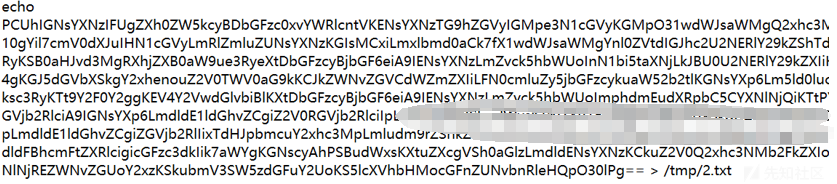

# 某次目的为导向的内网渗透-取开发源码 - 先知社区

某次目的为导向的内网渗透-取开发源码

- - -

本次任务是某地区软件开发公司所开发的产品，最好是能拿到源码，或者开发、测试环境的访问凭证。  
首先定位目标公司的资产，使用fofa检索：  
[](https://xzfile.aliyuncs.com/media/upload/picture/20231123220307-074c83d2-8a09-1.png)  
根据资产对应的指纹，使用一些扫描工具扫一扫：  
[](https://xzfile.aliyuncs.com/media/upload/picture/20231123220315-0be14f36-8a09-1.png)  
以及新近出来的exp：  
[](https://xzfile.aliyuncs.com/media/upload/picture/20231123220328-13fe31c0-8a09-1.png)  
结合编码将webshell内容上传目标站点：  
[](https://xzfile.aliyuncs.com/media/upload/picture/20231123220338-19a4e010-8a09-1.png)  
访问站点发现已经解析：  
[](https://xzfile.aliyuncs.com/media/upload/picture/20231123220344-1d484ce8-8a09-1.png)  
**连接成功后，由于主要目标为获取源码，因此做了些简单的信息收集后，直接丢免杀的扫描工具去发现开发机器。**  
发现网络地址为10段，于是上传个精简版netspy看看有没有其他段：  
[](https://xzfile.aliyuncs.com/media/upload/picture/20231123220406-2a97ef16-8a09-1.png)  
扫完存活网段后，将结果作为信息收集工具的目标，例如fscan制定hf参数，即可根据结果文件中的目标地址展开信息收集：  
[](https://xzfile.aliyuncs.com/media/upload/picture/20231123220412-2e2def2c-8a09-1.png)  
**这时在结果中就可以额外注意一些扫出来的445端口信息，或者netbios主机名，如果存在dev、ops、code、git等字眼，或者web标题中常见的response、git、code等字眼，可作为重点关注目标：**  
[](https://xzfile.aliyuncs.com/media/upload/picture/20231123220419-31d1a506-8a09-1.png)  
**笔者这里并没发现特别的站点，但由于前期调研目标单位，发现单位提供产品大多为crm套件，或者云办公产品，且合作单位猎豹有oracle，因此判断大概率存在java中间件二开的产品。**  
而在内网扫描一波后发现两个指纹为weblogic的站，且端口7001符合常用端口：  
[](https://xzfile.aliyuncs.com/media/upload/picture/20231123220425-35968c06-8a09-1.png)  
使用漏洞扫描工具，将流量带到内网进行扫描，发现存在历史漏洞，且可以执行命令：  
[](https://xzfile.aliyuncs.com/media/upload/picture/20231123220438-3d49082a-8a09-1.png)

执行tasklist查看有没有杀毒软件：  
[](https://xzfile.aliyuncs.com/media/upload/picture/20231123220448-4322038c-8a09-1.png)  
好家伙，诺顿，绕过还是挺麻烦的，看看迂回战术能不能取到想要的内容。  
先使用命令执行挨个查看硬盘内容：  
[](https://xzfile.aliyuncs.com/media/upload/picture/20231123220455-477d45c2-8a09-1.png)

再查看weblogic发布的代码包：  
[](https://xzfile.aliyuncs.com/media/upload/picture/20231123220503-4c092f02-8a09-1.png)  
好家伙，存在不少呢，于是简单判定这个跟开发肯定有关系，至少是测试环境，误打误撞碰到了竟然。

**由于存在杀软，绕过需要费心思，因此取文件是个技术活。**  
**回头看weblogic漏洞的权限，发现为管理员administrator，于是上传prodump取lsass，此处不再赘述。**  
将结果放到weblogic 的默认界面的静态目录下，更名为zip后下载到本地解密，得到密码：

[](https://xzfile.aliyuncs.com/media/upload/picture/20231123220514-52b87cb8-8a09-1.png)  
**得到密码后，如果不需要长期稳定控制，其实可以选择单条命令执行、编码解码、取共享文件方式获取敏感内容，而非使用明星远控、烂大街工具取，徒增被发现的风险。**  
使用impacket的smbclient连接目标，代码：

```plain
proxychains python3 smbclient.py administrator:passrrrr@10.210.22.3
使用hash:
proxychains python3 smbclient.py administrator@10.133.22.22 -hashs xxxxxx:xxxxx
```

效果：  
[](https://xzfile.aliyuncs.com/media/upload/picture/20231123220521-5736f972-8a09-1.png)  
发现有个backup文件夹共享出来了，盲猜这是开发各个版本的备份内容。

发现一些开发历史文件：  
[](https://xzfile.aliyuncs.com/media/upload/picture/20231123220529-5bdf9902-8a09-1.png)

根据其中部分测试文件，发现了一些软件使用指南，例如使用登录方式：  
[](https://xzfile.aliyuncs.com/media/upload/picture/20231123220536-60393a26-8a09-1.png)

以及核心软件系统附加开发开发项目管理的账本，经翻译后显示为：  
[](https://xzfile.aliyuncs.com/media/upload/picture/20231123220545-654dd15c-8a09-1.png)  
共享文件中没什么其他可去的工具后，使用weblogic漏洞翻桌面发现语言不通会乱码，于是查询管理员不在线的情况下，冒险登录桌面看看：  
[](https://xzfile.aliyuncs.com/media/upload/picture/20231123220554-6a9fedb6-8a09-1.png)  
很好，在备注处还直接备注了登录账密，那离最后目标不远了，访问:  
[](https://xzfile.aliyuncs.com/media/upload/picture/20231123220601-6ed4d1a8-8a09-1.png)  
翻遍桌面和其他盘内容后，给桌面留个截图：  
[](https://xzfile.aliyuncs.com/media/upload/picture/20231123220609-73a44344-8a09-1.png)

将源码就地打包，放入web的静态目录后直接下载到本地：  
[](https://xzfile.aliyuncs.com/media/upload/picture/20231123220618-78e7b0ca-8a09-1.png)  
最后拿着这些代码交了差，甲方对此成果价值比较满意，并部署了后续持续控制的要求。
