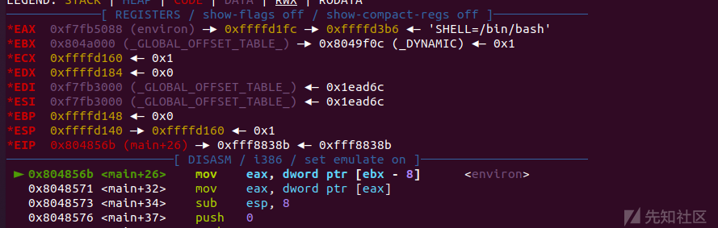
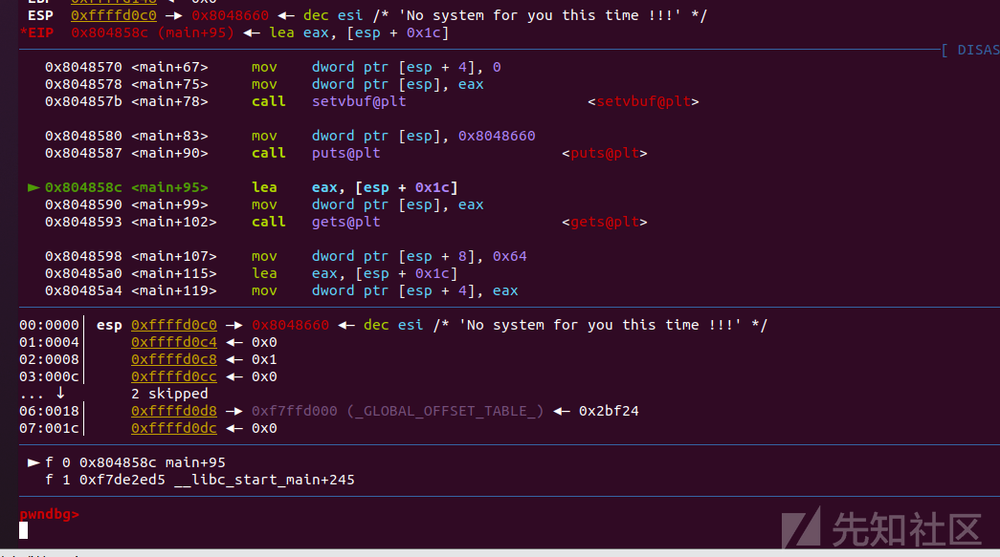
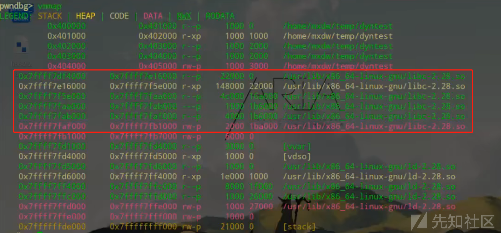
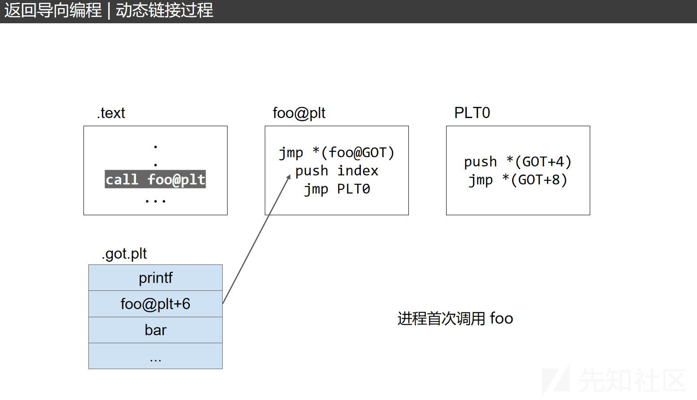
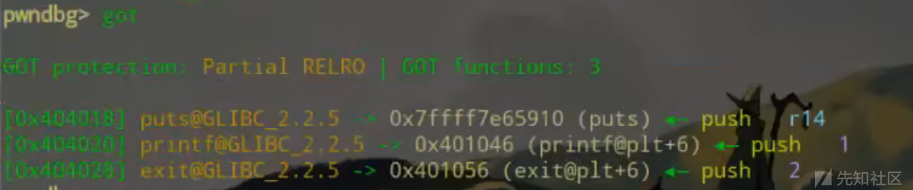
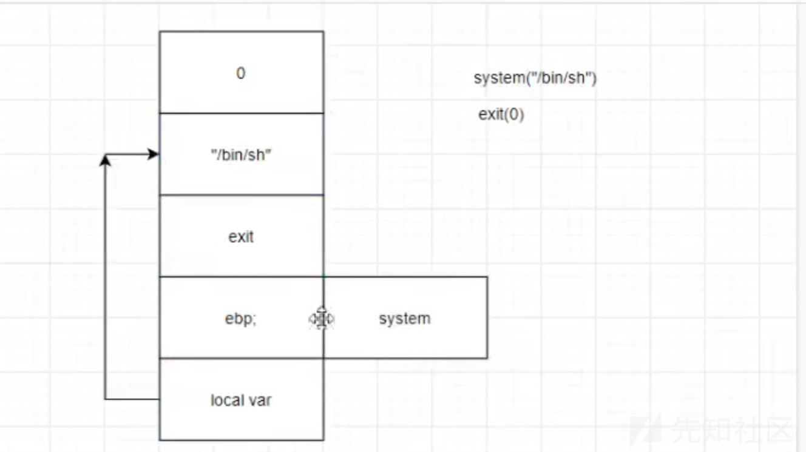
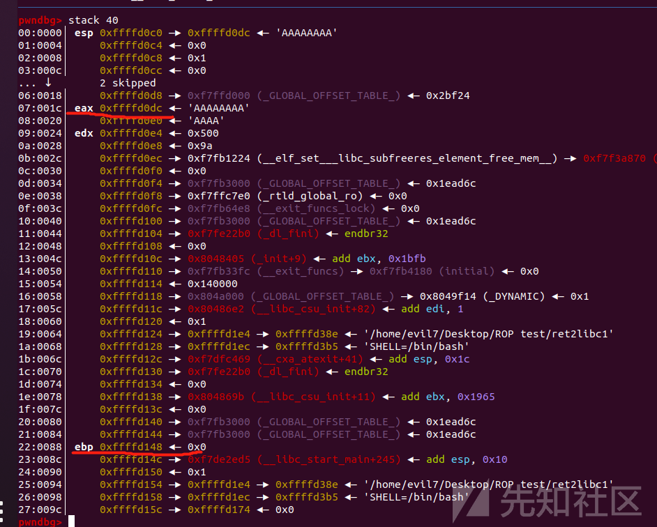
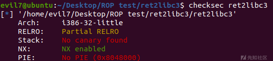
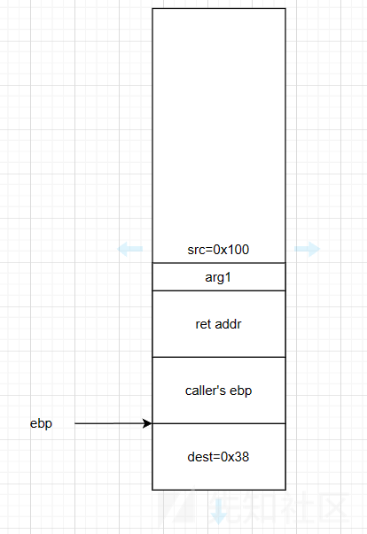

栈溢出详解

* * *

# 栈溢出

## 前言

我们前面讲解了二进制基础，接下来来到了我们PWN的第一课--栈溢出，下面我将结合图片以及实例进行讲解

## C语言函数调用栈

[](https://xzfile.aliyuncs.com/media/upload/picture/20230629202544-11ae896a-1678-1.png)

[](https://xzfile.aliyuncs.com/media/upload/picture/20230629202548-13dde910-1678-1.png)

[](https://xzfile.aliyuncs.com/media/upload/picture/20230629202552-1672b1ec-1678-1.png)

`esp` 用来存储函数调用栈的`栈顶地址`，在压栈和退栈时发生变化。  
`ebp` 用来存储当前函数状态的`基地址`，在函数运行时不变，可以用来索引确定函数参数或局部变量的位置。  
`eip` 用来存储`即将执行的程序指令的地址`，cpu 依照 eip 的存储内容读取指令并执行，eip 随之指向相邻的下一条指令，如此反复，程序就得以连续执行指令。

```plain
#include <studio.h>
int sum(int x,int y) {
    return x+y;
}
int main() {
    sum(1,2);
    return 0;
}
```

```plain
在以上C语言编写的函数中，main函数调用了sum函数，这里的main函数是sum函数的父函数，也是调用函数
sum函数是main函数的子函数，也是被调用函数
```

[](https://xzfile.aliyuncs.com/media/upload/picture/20230629202557-19956266-1678-1.png)

```plain
当main函数调用sum函数时，会将1,2逆序压入main函数的栈帧中，当sum函数执行完之后，会直接返回到sum(1,2)的下一条指令也就是return 0,压入return 0的返回地址
```

[](https://xzfile.aliyuncs.com/media/upload/picture/20230629202601-1c1a9ea2-1678-1.png)

```plain
在sum函数调用完毕之后，sum函数的栈帧就没有用了，要恢复main函数的栈帧，所以再调用sum函数的之前就不能将main的基本信息给丢弃，先将main函数的栈顶指针压进去，也就是PUSH一个Caller's ebp
```

[](https://xzfile.aliyuncs.com/media/upload/picture/20230629202605-1e92bfde-1678-1.png)

子函数的局部变量等数据压入后，子函数的栈帧形成完毕，此时ebp指向子函数的栈底，esp指向子函数的栈顶

[](https://xzfile.aliyuncs.com/media/upload/picture/20230629202610-2171a396-1678-1.png)

不用清除Local Variables，这里弹出的意思就是将esp重新指向ebp就行，这样就相当于将函数调用栈的栈顶地址指向了ebp，存储原有的Local Variables的地方可以利用别的数据进行写入

```plain
esp与ebp这两个指针中间的部分也就是当前栈底的栈帧
```

[](https://xzfile.aliyuncs.com/media/upload/picture/20230629202615-23fdd5b2-1678-1.png)

[](https://xzfile.aliyuncs.com/media/upload/picture/20230629202618-260da5bc-1678-1.png)

[](https://xzfile.aliyuncs.com/media/upload/picture/20230629202622-284dc596-1678-1.png)

```plain
int callee(int a,int b,int c) {
    return a+b+c;
}
int caller(void) {
    int ret;
    ret = callee(1,2,3);
    ret += 4;
    return ret;
}
```

[](https://xzfile.aliyuncs.com/media/upload/picture/20230629202627-2b275a2a-1678-1.png)

[](https://xzfile.aliyuncs.com/media/upload/picture/20230629202629-2ce1578a-1678-1.png)

[](https://xzfile.aliyuncs.com/media/upload/picture/20230629202633-2ecb2e22-1678-1.png)

[](https://xzfile.aliyuncs.com/media/upload/picture/20230629202637-312b7c94-1678-1.png)

[](https://xzfile.aliyuncs.com/media/upload/picture/20230629202640-33215cb2-1678-1.png)

[](https://xzfile.aliyuncs.com/media/upload/picture/20230629202643-35383d68-1678-1.png)

[](https://xzfile.aliyuncs.com/media/upload/picture/20230629202647-3789627c-1678-1.png)

[](https://xzfile.aliyuncs.com/media/upload/picture/20230629202651-39c6d2fe-1678-1.png)

[](https://xzfile.aliyuncs.com/media/upload/picture/20230629202655-3c2087de-1678-1.png)

[](https://xzfile.aliyuncs.com/media/upload/picture/20230629202659-3e50a14c-1678-1.png)

[](https://xzfile.aliyuncs.com/media/upload/picture/20230629202705-41d1a172-1678-1.png)

[](https://xzfile.aliyuncs.com/media/upload/picture/20230629202735-540d9bd4-1678-1.png)

[](https://xzfile.aliyuncs.com/media/upload/picture/20230629202731-5195d0f6-1678-1.png)

[](https://xzfile.aliyuncs.com/media/upload/picture/20230629202727-4f4d36b8-1678-1.png)

## ret2text

要求：

```plain
程序中有一个后门函数
```

[](https://xzfile.aliyuncs.com/media/upload/picture/20230629202742-58117fc0-1678-1.png)

[](https://xzfile.aliyuncs.com/media/upload/picture/20230629202746-5a538c92-1678-1.png)

[](https://xzfile.aliyuncs.com/media/upload/picture/20230629202749-5c5c2602-1678-1.png)

```plain
int vulnerable()
{
  char buffer[8]; // [esp+8h] [ebp-10h]

  gets(buffer);
  return 0;
}
```

典型栈溢出

这里char 了一个buffer，也就是开辟了一个8字节的栈缓冲区供buffer使用

但是之后使用了一个gets(buffer)，gets()函数没有限制字符串的长度，所以只要输入大于8个字节的字符串，就可以造成栈溢出，从而覆盖关键内存。

第一个脚本

```plain
from pwn import * #导入pwn库
io = process("./ret2text")#加载本地进程
io = remote("localhost",123)#远程连接，这里是打本地
io = recvline()#输出一行字符串
#b'Have you heard of buffer overflow\n'
io = send("")#b"sdad" 这是send字节流 p64(1) send一个整数被打包为64字节流 p32(1)同理，打包为32字节流
#io = sendline(b"asdsd") <=> io = send(b"asdsd\n")
```

[](https://xzfile.aliyuncs.com/media/upload/picture/20230629202755-5fa20b9c-1678-1.png)

例题

首先拿到二进制文件先checksec

[](https://xzfile.aliyuncs.com/media/upload/picture/20230629202800-62c1f59e-1678-1.png)

**Arch:**  
程序架构信息。判断是拖进64位IDA还是32位？exp编写时p64还是p32函数？

**RELRO:**  
Relocation Read-Only (RELRO) 此项技术主要针对 GOT 改写的攻击方式。它分为两种，Partial RELRO 和 Full RELRO。  
部分RELRO 易受到攻击，例如攻击者可以atoi.got为system.plt，进而输入/bin/sh\\x00获得shell  
完全RELRO 使整个 GOT 只读，从而无法被覆盖，但这样会大大增加程序的启动时间，因为程序在启动之前需要解析所有的符号。

```plain
gcc -o hello test.c // 默认情况下，是Partial RELRO
gcc -z norelro -o hello test.c // 关闭，即No RELRO
gcc -z lazy -o hello test.c // 部分开启，即Partial RELRO
gcc -z now -o hello test.c // 全部开启，即Full RELRO
```

**Stack-canary**

栈溢出保护是一种缓冲区溢出攻击缓解手段，当函数存在缓冲区溢出攻击漏洞时，攻击者可以覆盖栈上的返回地址来让shellcode能够得到执行。当启用栈保护后，函数开始执行的时候会先往栈里插入类似cookie的信息，当函数真正返回的时候会验证cookie信息是否合法，如果不合法就停止程序运行。攻击者在覆盖返回地址的时候往往也会将cookie信息给覆盖掉，导致栈保护检查失败而阻止shellcode的执行。在Linux中我们将cookie信息称为canary。

```plain
gcc -fno-stack-protector -o hello test.c   //禁用栈保护
gcc -fstack-protector -o hello test.c    //启用堆栈保护，不过只为局部变量中含有 char 数组的函数插入保护代码
gcc -fstack-protector-all -o hello test.c  //启用堆栈保护，为所有函数插入保护代码s
```

**NX**

NX enabled如果这个保护开启就是意味着栈中数据没有执行权限，如此一来, 当攻击者在堆栈上部署自己的 shellcode 并触发时, 只会直接造成程序的崩溃，但是可以利用rop这种方法绕过

```plain
gcc -o  hello test.c // 默认情况下，开启NX保护
gcc -z execstack -o  hello test.c // 禁用NX保护
gcc -z noexecstack -o  hello test.c // 开启NX保护
```

**PIE**

PIE(Position-Independent Executable, 位置无关可执行文件)技术与 ASLR 技术类似,ASLR 将程序运行时的堆栈以及共享库的加载地址随机化, 而 PIE 技术则在编译时将程序编译为位置无关, 即程序运行时各个段（如代码段等）加载的虚拟地址也是在装载时才确定。这就意味着, 在 PIE 和 ASLR 同时开启的情况下, 攻击者将对程序的内存布局一无所知, 传统的改写  
GOT 表项的方法也难以进行, 因为攻击者不能获得程序的.got 段的虚地址。  
若开启一般 需在攻击时泄露地址信息

```plain
gcc -o hello test.c  // 默认情况下，不开启PIE
gcc -fpie -pie -o hello test.c  // 开启PIE，此时强度为1
gcc -fPIE -pie -o hello test.c  // 开启PIE，此时为最高强度2
(还与运行时系统ALSR设置有关）
```

**RPATH/RUNPATH**

程序运行时的环境变量，运行时所需要的共享库文件优先从该目录寻找，可以fake lib造成攻击

**FORTIFY**

这是一个由GCC实现的源码级别的保护机制，其功能是在编译的时候检查源码以避免潜在的缓冲区溢出等错误。  
简单地说，加了这个保护之后,一些敏感函数如read, fgets,memcpy, printf等等可能  
导致漏洞出现的函数都会被替换成**read\_chk,**fgets\_chk, **memcpy\_chk,** printf\_chk等。  
这些带了chk的函数会检查读取/复制的字节长度是否超过缓冲区长度，

通过检查诸如%n之类的字符串位置是否位于可能被用户修改的可写地址，  
避免了格式化字符串跳过某些参数（如直接%7$x）等方式来避免漏洞出现。  
开启了FORTIFY保护的程序会被checksec检出，此外，在反汇编时直接查看got表也会发现chk函数的存在  
这种检查是默认不开启的，可以通过

```plain
gcc -D_FORTIFY_SOURCE=2 -O1
开启fortity检查，开启后会替换strcpy等危险函数。
```

IDA看一下反编译结果

main函数

[](https://xzfile.aliyuncs.com/media/upload/picture/20230629202808-67b93cf6-1678-1.png)

```plain
setbuf(stdin,0);
setbuf(stdout,0);
#关闭标准输入输出的缓冲区
```

立即会输出puts(”Have you heard of buffer overflow?“)

之后再调用vulnerable()

[](https://xzfile.aliyuncs.com/media/upload/picture/20230629202812-6a40cc28-1678-1.png)

典型最简单的栈溢出

```plain
这里也告诉你了开辟的buffer的位置
ebp-10h，也就是10进制的ebp-16，与ebp的距离为16(在内存中,ebp总是指向上一个栈的栈底的位置)
```

[](https://xzfile.aliyuncs.com/media/upload/picture/20230629202816-6c59e3f0-1678-1.png)

```plain
由图可知，这里buf与蓝色区域的距离为16字节
(这个可以决定栈溢出的字节长度，但是有时候也不可靠，最可靠的方式是动调)
```

之后就是一个puts()

return 0

进行动调找栈溢出的字节

```plain
gdb ret2text
```

运行程序

```plain
run
r
```

打断点

```plain
b *0x8048000    #断点断在0x8048000地址
b main #断点打在main函数
```

```plain
b main
```

[](https://xzfile.aliyuncs.com/media/upload/picture/20230629202823-708f7cfa-1678-1.png)

步过

```plain
n
```

步进

```plain
s
```

```plain
r
```

[](https://xzfile.aliyuncs.com/media/upload/picture/20230629202827-73169f80-1678-1.png)

此时执行到的这一行命令的寄存器的值

[](https://xzfile.aliyuncs.com/media/upload/picture/20230629202831-751d2042-1678-1.png)

反汇编窗口

[](https://xzfile.aliyuncs.com/media/upload/picture/20230629202834-774522de-1678-1.png)

栈窗口

上面栈底，下面是栈顶，gdb中的栈与数据结构中的栈相反，上面是低地址，下面高地址

数据从上往下写

[](https://xzfile.aliyuncs.com/media/upload/picture/20230629202839-7a1c069e-1678-1.png)

函数调用栈的关系

这里是由\_\_libc\_start\_main调用了main函数

这里之前利用ida进行静态分析了一下，知道了漏洞点在vulnerable(),就一直步过找到vulnerable()

[](https://xzfile.aliyuncs.com/media/upload/picture/20230629202846-7e7634c6-1678-1.png)

找到之后步进

```plain
s
```

```plain
n
```

先不溢出，输入8个字符

```plain
AAAAAAAA
```

看一下stack

```plain
stack 24
```

[](https://xzfile.aliyuncs.com/media/upload/picture/20230629202855-835f4220-1678-1.png)

esp与ebp之间是栈帧

esp是栈顶，ebp是栈底

ebp指向的是前一个函数的ebp的值

需要攻击的位置是ebp的再往高的一个字长，就是返回地址，也就是图中画圈的位置

[](https://xzfile.aliyuncs.com/media/upload/picture/20230629202900-86748920-1678-1.png)

只要覆盖了返回地址，将返回地址改为我们想要的地址，就可以进行攻击了

回到IDA的get\_shell后面函数，查看后面代码

[](https://xzfile.aliyuncs.com/media/upload/picture/20230629202904-88bc0c58-1678-1.png)

[](https://xzfile.aliyuncs.com/media/upload/picture/20230629202907-8b029d6a-1678-1.png)

正常来说，return 0是要回到main函数的，但是如果我们修改return的地址改为get\_shell的地址，就可以getshell

[](https://xzfile.aliyuncs.com/media/upload/picture/20230629202912-8d9a12ec-1678-1.png)

```plain
0x138-0x128=16
```

但是ebp本身还含有4个字节

[](https://xzfile.aliyuncs.com/media/upload/picture/20230629202918-91330b02-1678-1.png)

[](https://xzfile.aliyuncs.com/media/upload/picture/20230629202922-936faad8-1678-1.png)

再覆盖4个字节，就可以把previous ebp也给覆盖掉

我们只要写入20个A就可以溢出到ebp，父函数的ebp给覆盖掉

[](https://xzfile.aliyuncs.com/media/upload/picture/20230629202927-96f74986-1678-1.png)

[](https://xzfile.aliyuncs.com/media/upload/picture/20230629202931-993a1a5c-1678-1.png)

```plain
0x1c-0x18=0x04=4
```

如果我们再写4个字节就可以将返回地址也给覆盖掉

```plain
from pwn import *
io = process("./ret2text")
io = recvline()
payload = b'A' * 16 + b'BBBB' + p32('')
```

[](https://xzfile.aliyuncs.com/media/upload/picture/20230629202936-9c51584a-1678-1.png)

这里回到IDA看get\_shell的地址，可以看到起始地址为8048522

```plain
from pwn import *
io = process("./ret2text")
io.recvline()
payload = b'A' * 16 + b'BBBB' + p32('0x8048522')
io.sendline(payload)
io.interactive()
```

打本地成功

```plain
from pwn import *
io = remote("xx.xx.xx.xx",xxxx)
get_shell_addr = 0x8048522
payload = b'A' * 16 + b'BBBB' + p32(get_shell_addr)
io.sendline(payload)
io.interactive()
```

## ret2shellcode

```plain
shellcode是我们自己输入的，一定要存在于缓冲区中(栈、堆、BSS)
(但是堆默认malloc到的没有可执行权限)
```

[](https://xzfile.aliyuncs.com/media/upload/picture/20230629202943-9ff1034c-1678-1.png)

[](https://xzfile.aliyuncs.com/media/upload/picture/20230629202948-a317a986-1678-1.png)

[](https://xzfile.aliyuncs.com/media/upload/picture/20230629202951-a543fa20-1678-1.png)

[](https://xzfile.aliyuncs.com/media/upload/picture/20230629202956-a7d00ed2-1678-1.png)

可以利用pwntools中的shellcraft

```plain
asm(shellcraft.sh())
#将sh的shellcode的汇编代码转为机械码
```

```plain
asm(shellcraft.amd64.sh())
#64位
```

在写shellcraft之前要写

```plain
context.arch = "amd64" #打64位的时候需要
```

**例题：**ret2shellcode

先checksec

[](https://xzfile.aliyuncs.com/media/upload/picture/20230629203002-abb83790-1678-1.png)

可以看到这里NX未设置保护，而且有RWX：可读可写可执行段(非常危险)

[](https://xzfile.aliyuncs.com/media/upload/picture/20230629203007-ae88ad06-1678-1.png)

IDA静态分析一下main函数

```plain
int __cdecl main(int argc, const char **argv, const char **envp)
{
  char s[100]; // [esp+1Ch] [ebp-64h] BYREF

  setvbuf(stdout, 0, 2, 0);
  setvbuf(stdin, 0, 1, 0);
  puts("No system for you this time !!!");
  gets(s);
  strncpy(buf2, s, 0x64u);
  printf("bye bye ~");
  return 0;
}
```

一开始声明一个s变量

setvbuf关闭缓冲区

puts一个字符串

gets()函数存在漏洞

然后strncpy()进行复制，将s中长为0x64个字节复制到buf2中，而且buf2没在main函数里，追溯过去发现在BSS段

由于这题不存在NX，ARLX等保护，不存在随机性，在本地的地址就是远程的地址

动调一下

```plain
gdb ret2shellcode
```

```plain
b main
```

```plain
r
```

```plain
n
```

步过到gets()函数

[](https://xzfile.aliyuncs.com/media/upload/picture/20230629203015-b36f5590-1678-1.png)

先随便输入字符串看一下与栈底的距离

之后静态分析IDA F5看一下IDA给我们的注释

[](https://xzfile.aliyuncs.com/media/upload/picture/20230629203020-b626c96c-1678-1.png)

这里告诉了我们局部变量s与ebp的距离为64h，0x64

[](https://xzfile.aliyuncs.com/media/upload/picture/20230629203024-b8db331e-1678-1.png)

这里图中选中的区域就是0x64，也就是局部变量s与ebp的距离，此时我们如果再溢出一个字节，就能覆盖previous ebp，也就是输入0x68(0x64+0x04)的垃圾字节，之后再根据我们需要的地址再输入即可栈溢出

接着动调，我们随便输入了几个字符，之后看一下栈

这里先看一下寄存器有多远，从而确定看栈的几行

[](https://xzfile.aliyuncs.com/media/upload/picture/20230629203029-bb92a0ec-1678-1.png)

```plain
0x148-0x0c0=136
```

这里我用

```plain
stack 35
```

[](https://xzfile.aliyuncs.com/media/upload/picture/20230629203035-bf0e03ec-1678-1.png)

这里已知我们可控的地方距离ebp的地址，算一下偏移量

```plain
0x148-0x0dc=108
```

所以我们只要写入112(108+4 )个垃圾字节，之后再写想要的地址即可，这也就是IDA不可靠的问题

实际利用gdb动调才是正确的

先打本地

这里不像ret2text一样有后门函数了，这里需要自己构造利用shellcraft,之后利用上面给到的strncpy()函数，我们可以将shellcode写入s中，之后复制给buf2，buf2在bss段，而且之前checksec发现了BSS段RWX，可读可写可执行，所以就可以执行我们的shellcode

```plain
from pwn import *
io = process('./ret2shellcode')
shellcode = asm(shellcraft.sh())
buf2_addr = 0x804a080

io.sendline(shellcode.ljust(112,b'A') + p32(buf2_addr))
io.interactive()
```

这道题本地打不通，感觉题目问题，题目在bss段没有可执行权限，用libc打

```plain
from pwn import *
context(os='linux',arch='i386',log_level='debug')

sh = process("./pwn")
libc = ELF('/lib/i386-linux-gnu/libc.so.6')
elf = ELF('./pwn')
puts = elf.got["puts"]
putsp = elf.plt['puts']
shellcode = asm(shellcraft.sh())
buf2_addr = 0x0804A080
sh.recvuntil(b'!!!\n')
#pl=shellcode.ljust(112,b'\x00') + p32(buf2_addr)
#pl=shellcode+b'\x00'*(0x64-len(shellcode)+0x8+4)+p32(0x804A080)
pl = b'a'*112 + p32(putsp) + p32(0x0804852D) + p32(puts)

sh.sendline(pl)
sh.recvuntil(b'bye bye ~')
puts_libc = u32(sh.recv(4))
libcbase = puts_libc - 0x6dc40
print(hex(libcbase))
system = libcbase + libc.sym['system']
binsh = libcbase + 0x0018e363
pl = b'a'*104 + p32(system) +b'aaaa' + p32(binsh)
gdb.attach(sh)
pause()
sh.sendline(pl)
sh.interactive()

'''
0xc9bbb execve("/bin/sh", [ebp-0x2c], esi)
constraints:
  address ebp-0x20 is writable
  ebx is the GOT address of libc
  [[ebp-0x2c]] == NULL || [ebp-0x2c] == NULL
  [esi] == NULL || esi == NULL

0x14482b execl("/bin/sh", eax)
constraints:
  ebp is the GOT address of libc
  eax == NULL

0x14482c execl("/bin/sh", [esp])
constraints:
  ebp is the GOT address of libc
  [esp] == NULL


'''
```

这里解释一下shellcode.ljust()，参考[Python ljust()方法 | 菜鸟教程 (runoob.com)](https://www.runoob.com/python/att-string-ljust.html)

```plain
Python ljust() 方法返回一个原字符串左对齐,并使用空格填充至指定长度的新字符串。如果指定的长度小于原字符串的长度则返回原字符串。
```

就是一个填充的，这里我们如果将shellcode转为机器码之后小于112个垃圾字节，可以利用ljust()方法进行填充

64位下的ret2shellcode攻击

先自己常见一个a.c

```plain
#include <stido.h>
int main() {
    setvbuf(stdout, 0);
    setvbuf(stdin, 0);
    char s[100];
    printf("%p",s);//加上这一行为了运行时，查看ASLR打开后的结果
    gets(s);
    return 0;
}
```

```plain
gcc -o ret2stack ret2stack.c
```

之后checksec一下

[](https://xzfile.aliyuncs.com/media/upload/picture/20230629203051-c9005184-1678-1.png)

amd64的架构，小端序，开启栈不可执行(NX)

[](https://xzfile.aliyuncs.com/media/upload/picture/20230629203055-cb651270-1678-1.png)

开启canary的情况，如果在溢出的时候先遇到canary，会打开canary防护，如果溢出后原有的随机数发生变化

[](https://xzfile.aliyuncs.com/media/upload/picture/20230629203108-d2cf0c64-1678-1.png)

这里的leave前会检查canary的值，如果值发生变化程序会检测到之后强行退出程序

[](https://xzfile.aliyuncs.com/media/upload/picture/20230629203112-d567f008-1678-1.png)

之后了为教学打64的shellcode,将保护关闭

```plain
#include <stido.h>
int main() {
    char str[100];
    //printf("%p",str);//加上这一行为了运行时，查看ASLR打开后的结果
    gets(str);
    return 0;
}
```

gcc编译，之后开始动调

[](https://xzfile.aliyuncs.com/media/upload/picture/20230629203120-da007216-1678-1.png)

64位的虚拟数据结构

[](https://xzfile.aliyuncs.com/media/upload/picture/20230629203124-dcb35b22-1678-1.png)

地址应该是8字节，内核和用户空间之间有一段未定义的空间，需要留空间，所以是6字节，所以说和32位的原理一样

[](https://xzfile.aliyuncs.com/media/upload/picture/20230629203129-df8abe08-1678-1.png)

需要覆盖的垃圾字长

```plain
0xd0-0x60=112
```

但是要覆盖previous ebp还是要按照64的数据结构，所以要再加8字节

```plain
from pwn import *
context.arch = "amd64"
io= process("./ret2stack")
io = recv()
shellcode = asm(shellcraft.amd64.sh())
shellcode.ljust(120,b'a')
buf = 0x7fffffffe0e0
payload = shellcode + p64(buf)
io.sendline(payload)
io.interactive()
```

## ret2syscall

这个于前几个的区别在于

```plain
无法找到一步到位调用shell的地址，需要找到多个地址从而获取shell
```

返回系统调用

[](https://xzfile.aliyuncs.com/media/upload/picture/20230629203138-e4d3cbca-1678-1.png)

系统调用函数的大体流程，这里以write()为例,x86架构

会先向eax传入一个系统调用号

```plain
eax = 0x4
ebx //传第一个参数
ecx //传第二个参数
edx //传第三个参数
//用mov指令进行传参
```

之后系统调用号和传进去的三个参数全都放入正确的值后，系统执行

```plain
int 0x80
```

之后完成系统调用

正常来说我们利用C语言写入的函数会被动态链接库封装成为汇编代码以便系统使用

可以利用ldd命令查看可执行文件的动态链接库以及软链接

参考[(110条消息) “ldd”命令详解\_ldd命令\_f\_carey的博客-CSDN博客](https://blog.csdn.net/f_carey/article/details/109686310)

[](https://xzfile.aliyuncs.com/media/upload/picture/20230629203143-e7da6644-1678-1.png)

system("/bin/sh")相当于是以下汇编代码步骤的一个封装

```plain
mov eax,0xb //eax保存系统调用号,需要根据用的函数从而查询系统调用号，execve的系统调用号是11，也就是0xb
mov ebx,["/bin/sh"] //参数
mov ecx,0 //参数
mov edx,0 //参数
int 0x80 //这里的int是中断号,0x80代表的是系统调用 
=>execve("/bin/sh",NULL,NULL)
```

[](https://xzfile.aliyuncs.com/media/upload/picture/20230629203147-ea395224-1678-1.png)

标红的部分是溢出数据

右边代码段中标黄的部分就是一个个的gadget

[](https://xzfile.aliyuncs.com/media/upload/picture/20230629203152-ed082e6c-1678-1.png)

将这些gadget连续执行即可形成我们的payload

[](https://xzfile.aliyuncs.com/media/upload/picture/20230629203156-efb5b670-1678-1.png)

**ret其实也就是pop eip**

这里通过栈溢出覆盖了返回地址，之后执行`ret`

相当于把0x08052318这个地址中保存的值pop到`eip`中，eip就会再跳转到`这个地址所保存的值的指向位置`

也就是执行

```plain
pop %edx;ret;
```

然后`esp`寄存器再返回到高一字节的地址

[](https://xzfile.aliyuncs.com/media/upload/picture/20230629203202-f3124220-1678-1.png)

此时gadget来到了**pop %edx;ret;**的位置，

0x0c0c地址里的数据存放在了edx中，同时ESP继续向高地址移动(**pop %edx**)

这是此时ESP的位置

[](https://xzfile.aliyuncs.com/media/upload/picture/20230629203206-f56f5efe-1678-1.png)

之后进行ret，相当于又是一次`pop eip`(**ret**)

[](https://xzfile.aliyuncs.com/media/upload/picture/20230629203211-f866280e-1678-1.png)

之后又是将0x0809951f地址中的数据pop到eip中，这其实也就是从上一个gadget跳转到下一个gadget的过程

[](https://xzfile.aliyuncs.com/media/upload/picture/20230629203215-fb086e8c-1678-1.png)

刚刚eip指向的是0x0809951f的地址，之后会执行其中的代码

先是一个xor %eax,%eax 其实就是相当于%eax=0

之后再ret,相当于pop eip，将0x080788c1地址指向eip，进行下一条gadget

[](https://xzfile.aliyuncs.com/media/upload/picture/20230629203221-fe49c910-1678-1.png)

这里我们执行0x0807地址的指令

将eax中的值赋值给edx(因为在eax,edx前加了%，如果是正常英特尔情况下，是将后者的数值赋值给前者)(**mov %eax,(%ebx)**)

之后再ret，将0x41414141地址指向eip，(ret)

由此看出，如果gadget结尾是由`ret`结尾的，那么我们可以通过栈溢出的方式控制其返回地址，实现一直ret到我们想要的地址，从而进行控制数据

[](https://xzfile.aliyuncs.com/media/upload/picture/20230629203226-0192d1ac-1679-1.png)

整体看一下

做一下例题ret2syscall

首先看一下保护

```plain
checksec ret2syscall
```

[](https://xzfile.aliyuncs.com/media/upload/picture/20230629203231-04523874-1679-1.png)

可以发现是一个x86架构32位的二进制文件，

no canary就可以进行栈溢出

打开了栈不可执行，没法直接写shellcode

再拖进ida里反编译一下

先找找有没有现成的后门函数

[](https://xzfile.aliyuncs.com/media/upload/picture/20230629203235-0700fd30-1679-1.png)

之后再shift+F12查找一下有没有后门参数，例如/bin/sh

[](https://xzfile.aliyuncs.com/media/upload/picture/20230629203240-09ae8200-1679-1.png)

现在后门参数有了，就是要进一步寻找如何构造后门函数(execve其实和system用法差不多，所以我们可以利用execve，不过需要找到其系统调用号)

进入main函数，看一下C语言编译结果

[](https://xzfile.aliyuncs.com/media/upload/picture/20230629203246-0d3e6ae8-1679-1.png)

可以看到main函数有一个gets()所以可以进行栈溢出

所以思路也就是有了，可以利用ROP构造出

```plain
ROPgadget --binary ret2syscall --only('pop|ret')
```

这里展示一部分获得的gadget

```plain
0x0809dde2 : pop ds ; pop ebx ; pop esi ; pop edi ; ret
0x0809d7b2 : pop ds ; ret
0x0809ddda : pop eax ; pop ebx ; pop esi ; pop edi ; ret
0x080bb196 : pop eax ; ret
0x0807217a : pop eax ; ret 0x80e
0x0804f704 : pop eax ; ret 3
0x0805b6ed : pop ebp ; pop ebx ; pop esi ; pop edi ; ret
0x0809e1d5 : pop ebp ; pop esi ; pop edi ; ret
0x0804838e : pop ebp ; ret
0x080a9a45 : pop ebp ; ret 0x10
0x08096a29 : pop ebp ; ret 0x14
0x08070d76 : pop ebp ; ret 0xc
0x0804854a : pop ebp ; ret 4
0x08049c00 : pop ebp ; ret 8
0x0809e1d4 : pop ebx ; pop ebp ; pop esi ; pop edi ; ret
0x080be23f : pop ebx ; pop edi ; ret
0x0806eb69 : pop ebx ; pop edx ; ret
0x08092258 : pop ebx ; pop esi ; pop ebp ; ret
0x0804838b : pop ebx ; pop esi ; pop edi ; pop ebp ; ret
0x080a9a42 : pop ebx ; pop esi ; pop edi ; pop ebp ; ret 0x10
0x08096a26 : pop ebx ; pop esi ; pop edi ; pop ebp ; ret 0x14
0x08070d73 : pop ebx ; pop esi ; pop edi ; pop ebp ; ret 0xc
0x08048547 : pop ebx ; pop esi ; pop edi ; pop ebp ; ret 4
0x08049bfd : pop ebx ; pop esi ; pop edi ; pop ebp ; ret 8
0x08048913 : pop ebx ; pop esi ; pop edi ; ret
0x08049a19 : pop ebx ; pop esi ; pop edi ; ret 4
0x08049a94 : pop ebx ; pop esi ; ret
0x080481c9 : pop ebx ; ret
0x080d7d3c : pop ebx ; ret 0x6f9
0x08099c87 : pop ebx ; ret 8
0x0806eb91 : pop ecx ; pop ebx ; ret
0x0804838d : pop edi ; pop ebp ; ret
0x080a9a44 : pop edi ; pop ebp ; ret 0x10
0x08096a28 : pop edi ; pop ebp ; ret 0x14
0x08070d75 : pop edi ; pop ebp ; ret 0xc
0x08048549 : pop edi ; pop ebp ; ret 4
0x08049bff : pop edi ; pop ebp ; ret 8
0x0806336b : pop edi ; pop esi ; pop ebx ; ret
0x0805c508 : pop edi ; pop esi ; ret
0x0804846f : pop edi ; ret
0x08049a1b : pop edi ; ret 4
0x0806eb90 : pop edx ; pop ecx ; pop ebx ; ret
0x0806eb6a : pop edx ; ret
0x0809ddd9 : pop es ; pop eax ; pop ebx ; pop esi ; pop edi ; ret
0x080671ea : pop es ; pop edi ; ret
0x0806742a : pop es ; ret
0x08092259 : pop esi ; pop ebp ; ret
0x0806eb68 : pop esi ; pop ebx ; pop edx ; ret
0x0805c820 : pop esi ; pop ebx ; ret
0x0804838c : pop esi ; pop edi ; pop ebp ; ret
0x080a9a43 : pop esi ; pop edi ; pop ebp ; ret 0x10
0x08096a27 : pop esi ; pop edi ; pop ebp ; ret 0x14
0x08070d74 : pop esi ; pop edi ; pop ebp ; ret 0xc
0x08048548 : pop esi ; pop edi ; pop ebp ; ret 4
0x08049bfe : pop esi ; pop edi ; pop ebp ; ret 8
0x0804846e : pop esi ; pop edi ; ret
0x08049a1a : pop esi ; pop edi ; ret 4
0x08049a95 : pop esi ; ret
0x08050256 : pop esp ; pop ebx ; pop esi ; pop edi ; pop ebp ; ret
```

我们要先获得eax的gadget

```plain
0x080bb196 : pop eax ; ret
```

发现上述gadget符合我们的要求，以ret为结尾

再找edx存储我们的数据，再找ebx,ecx赋值为0

```plain
0x0806eb90 : pop edx ; pop ecx ; pop ebx ; ret
```

这里找了一个比较符合的gadget,这里其实就是分别执行

```plain
pop edx
pop ecx
pop ebx
```

[](https://xzfile.aliyuncs.com/media/upload/picture/20230629203255-129f691a-1679-1.png)

再找之前我们已知的后门参数/bin/sh的地址,利用IDA

```plain
.rodata:080BE408 aBinSh          db '/bin/sh',0          ; DATA XREF: .data:shell↓o
```

也可以利用ROPgadget

```plain
ROPgadget --binary ret2syscall --string '/bin/sh'
```

最后找int 80

```plain
ROPgadget --binary ret2syscall --only "int"
```

```plain
0x08049421 : int 0x80
```

这里其实已经具备ROP部分了，现在来看栈溢出

[](https://xzfile.aliyuncs.com/media/upload/picture/20230629203301-1680dfbe-1679-1.png)

可以看到我们输入的字符存储在eax的0xffffd0ec地址，要想栈溢出需要覆盖到ebp的0xffffd158，然后ebp自身还有4字节的长度，所以要写入112个的垃圾字节

这里说一下如何查看eax中的execve的系统调用号

```plain
cat /usr/include/x86_64-linux-gnu/asm/unistd_32.h | grep "execve"
```

[](https://xzfile.aliyuncs.com/media/upload/picture/20230629203331-2869f8fa-1679-1.png)

十进制的11,也就是16进制的0xb

编写exp

```plain
from pwn import *

io = process('./ret2syscall')

pop_eax_ret_addr=0x080bb196
pop_edx_ecx_ebx_addr=0x0806eb90
int_80=0x08049421
bin_sh_addr=0x080be408

payload=flat([b'A'*112,pop_eax_ret_addr,0xb,pop_edx_ecx_ebx_addr,0,0,bin_sh_addr,int_80])
#利用flat()将一系列数据打包成二进制格式的字符串
#相当于payload=b'A'*112+p32(pop_eax_ret_addr)+p32(0xb)+p32(pop_edx_ecx_ebx_addr)+p32(0)+p32(0)+p32(bin_sh_addr)+p32(int_80) 不知道这一长串为什么不行，栈平衡的问题

io.sendline(payload)
io.interactive()
```

下面exp也是和上面相同思路

```plain
from pwn import *

io = process('./ret2syscall')

pop_eax_ret_addr=0x080bb196
pop_edx_addr=0x0806eb6a
pop_ecx_ebx_addr=0x0806eb91
int_80=0x08049421
bin_sh_addr=0x080be408

payload=b'A'*112+p32(pop_eax_ret_addr)+p32(0xb)+p32(pop_ecx_ebx_addr)+p32(0)+p32(bin_sh_addr)+p32(pop_edx_addr)+p32(0)+p32(int_80)

io.sendline(payload)
io.interactive()
```

这里大体了解了一下什么是栈平衡，之后再继续深入学习

## 动态链接过程

[](https://xzfile.aliyuncs.com/media/upload/picture/20230629203339-2d0115c4-1679-1.png)

动态链接在装载的时候才为用户可见，静态链接在链接的时候就可以获取

这里分别gcc编译一下，看一下动态链接和静态链接的区别

```plain
gcc -fno-pie --static -o statest test.c
```

```plain
gcc -fno-pie -o dyntest test.c
```

[](https://xzfile.aliyuncs.com/media/upload/picture/20230629203344-3029bc6a-1679-1.png)

[](https://xzfile.aliyuncs.com/media/upload/picture/20230629203347-31869d26-1679-1.png)

可以发现一个利用动态链接，一个利用静态链接的大小差别明显，运行效果一模一样

用IDA静态分析一下

这是利用动态链接的gcc编译后的程序

[](https://xzfile.aliyuncs.com/media/upload/picture/20230629203352-349237dc-1679-1.png)

这是静态链接的gcc编译后的程序

[](https://xzfile.aliyuncs.com/media/upload/picture/20230629203356-36f2fe58-1679-1.png)

静态链接的代码中的函数都要保存在程序内部，运行时从自身进行调用，静态链接程序中有很多指令片段

这里gdb看一下动态链接编译的dyntest

[](https://xzfile.aliyuncs.com/media/upload/picture/20230629203404-3ba8c54a-1679-1.png)

主要看一下这一部分，这里是此程序调用的动态链接库。

举个例子，这里libc-2.28.so里就存放着main函数中puts()真正实现的代码，注意这里是将整个libc放进去，不是只放入libc中的puts()

在程序ELF的code段会有plt的节，里面的代码是用来解析存放例如puts()真实地址，之后存入data段中got.plt的节

[](https://xzfile.aliyuncs.com/media/upload/picture/20230629203409-3eeb4660-1679-1.png)

```plain
.got保存的全局的变量地址
.got.plt保存的是全局的函数真实地址
```

[](https://xzfile.aliyuncs.com/media/upload/picture/20230629203414-419b68d6-1679-1.png)

[](https://xzfile.aliyuncs.com/media/upload/picture/20230629203417-4398b9a4-1679-1.png)

[](https://xzfile.aliyuncs.com/media/upload/picture/20230629203420-456e89c0-1679-1.png)

[](https://xzfile.aliyuncs.com/media/upload/picture/20230629203424-476c0856-1679-1.png)

首次调用foo时，首先先jmp到got.plt表中的foo表项

但是由于第一次调用foo，got.plt中的foo表项是空，所以又回到plt中，使得plt中的foo知道接下来要寻找foo函数的真实地址，并填入got.plt，再跳转到真实地址，也就是下图

[](https://xzfile.aliyuncs.com/media/upload/picture/20230629203428-4a4169b8-1679-1.png)

[](https://xzfile.aliyuncs.com/media/upload/picture/20230629203432-4c3d018c-1679-1.png)

[](https://xzfile.aliyuncs.com/media/upload/picture/20230629203436-4ec617c2-1679-1.png)

push index，其实就是push了foo的索引，也就是push 3，也就是此时要解析的是表项中的第几个外部函数

[](https://xzfile.aliyuncs.com/media/upload/picture/20230629203442-5232d49a-1679-1.png)

这里就是一个简单的跳转到PLT0表

[](https://xzfile.aliyuncs.com/media/upload/picture/20230629203446-548a8710-1679-1.png)

push \*(GOT+4),这是push了GOT+4里的内容，这是表示我要从哪个动态链接库找到使用的函数

[](https://xzfile.aliyuncs.com/media/upload/picture/20230629203503-5f313c5e-1679-1.png)

之后jmp \*(GOT+8)，jump到GOT+8的位置

[](https://xzfile.aliyuncs.com/media/upload/picture/20230629203508-61bc50b2-1679-1.png)

进入了dl\_resolve这个函数

[](https://xzfile.aliyuncs.com/media/upload/picture/20230629203512-6472a414-1679-1.png)

经过call\_fix\_up函数之后，这里的got.plt表中的foo表项是真正的在libc中的foo函数的地址

进程第二次调用foo

[](https://xzfile.aliyuncs.com/media/upload/picture/20230629203520-68df23c4-1679-1.png)

[](https://xzfile.aliyuncs.com/media/upload/picture/20230629203543-76c07cea-1679-1.png)

此时已经知道了foo的真实地址，这里也不用第一次调用foo时候的返回了，直接就可以跳转到foo的真实地址

[](https://xzfile.aliyuncs.com/media/upload/picture/20230629203547-78ea9956-1679-1.png)

[](https://xzfile.aliyuncs.com/media/upload/picture/20230629203550-7b40b564-1679-1.png)

这里实例演示一下

```plain
#include <stdio.h>
int main(){
    int x = 0;
    puts("fist!");

    int a = 1;
    puts("second");
    printf("once");
    exit(0);
}
```

```plain
gcc -fno-pie -g -o link dyntest.c
```

之后gdb调试一下

[](https://xzfile.aliyuncs.com/media/upload/picture/20230629203559-804e7e7e-1679-1.png)

```plain
x/20 0x401030
```

[](https://xzfile.aliyuncs.com/media/upload/picture/20230629203604-8355fa20-1679-1.png)

这里可以看到plt表项一共有16个字节，里面记录了puts相关所需要用到的解析的代码

这里利用IDA看一下我们编译后的程序

[](https://xzfile.aliyuncs.com/media/upload/picture/20230629203610-86e4cb1c-1679-1.png)

这些标有LOAD的部分是用作程序装入内存的控制信息的部分

[](https://xzfile.aliyuncs.com/media/upload/picture/20230629203614-897d9bf6-1679-1.png)

.init这些节，是用来记录初始化代码的节

[](https://xzfile.aliyuncs.com/media/upload/picture/20230629203619-8c65ded2-1679-1.png)

这里是plt节，可以看到IDA用虚线分别给我们划分了各个字段的plt节，这里其实通过看地址的长度，也能看出来plt表的长度为16字节

这里我们看一下plt表项内容

```plain
push 0
jmp sub_401020
```

这里其实也就对应了上面的

```plain
push index
jmp PLT0
```

[](https://xzfile.aliyuncs.com/media/upload/picture/20230629203657-a3017f0c-1679-1.png)

这里是got.plt节，这里也能知道puts等外部函数在libc中的真实地址(没有开启pie保护)

回到gdb进行动调，看一下got

[](https://xzfile.aliyuncs.com/media/upload/picture/20230629203721-b13be148-1679-1.png)

[](https://xzfile.aliyuncs.com/media/upload/picture/20230629203725-b38cc93a-1679-1.png)

可以看出存储的数据为ELF文件对应的代码段，其实这里也就说明了上面的

[](https://xzfile.aliyuncs.com/media/upload/picture/20230629203729-b5fadc48-1679-1.png)

当未调用外部函数，发现没有真实地址，会返回plt的值

之后步过一下

[](https://xzfile.aliyuncs.com/media/upload/picture/20230629203838-df4b7670-1679-1.png)

再看一下plt和got

[](https://xzfile.aliyuncs.com/media/upload/picture/20230629203842-e1bb1e38-1679-1.png)

[](https://xzfile.aliyuncs.com/media/upload/picture/20230629203846-e3fab44c-1679-1.png)

这里发现调用过的puts()函数，got表的表项里填入了puts()函数的真实地址

这里我们查看一下这个地址

```plain
x/20x 0x7ffff7e65910
```

[](https://xzfile.aliyuncs.com/media/upload/picture/20230629203903-eddbd37e-1679-1.png)

看一下反汇编

```plain
disass 0x7ffff7e65910
```

[](https://xzfile.aliyuncs.com/media/upload/picture/20230629203907-f02d33fc-1679-1.png)

再进行步过(printf("once"))

[](https://xzfile.aliyuncs.com/media/upload/picture/20230629203910-f274adfc-1679-1.png)

这里由于又调用了一次puts()所以是没有变化的

再进行步过(exit(0))

[](https://xzfile.aliyuncs.com/media/upload/picture/20230629203916-f5c5092a-1679-1.png)

got表中的表项printf()存储真实地址

这里学习了gdb中的backtrace用法->反应了函数调用栈的顺序

[](https://xzfile.aliyuncs.com/media/upload/picture/20230629203953-0bb64456-167a-1.png)

比如当前的my\_puts()是由main()调用的

main()函数是由\_libc\_\_csu\_init()调用的

## ret2libc

[](https://xzfile.aliyuncs.com/media/upload/picture/20230629204015-18abe440-167a-1.png)

[](https://xzfile.aliyuncs.com/media/upload/picture/20230629204018-1abd792e-167a-1.png)

左边是ret2shellcode的一种新的解法，一般远程服务器都开启ASLR保护，所以我们很难获取可以返回shellcode的地址

可以利用**nop滑梯**(nop这个指令没有用，系统看到nop指令会直接不管继续执行下一条指令，所以我们如果在shellcode的高地址写入大量的nop指令，然后之后返回地址写到差不多的位置，这样系统会一直执行nop指令，直到执行到shellcode)

[](https://xzfile.aliyuncs.com/media/upload/picture/20230629204022-1d11badc-167a-1.png)

[](https://xzfile.aliyuncs.com/media/upload/picture/20230629204025-1f03c754-167a-1.png)

这里详细给出了子函数与父函数的栈帧划分，这里以previous ebp作为划分

这也就解释了为什么system函数与/bin/sh参数之间为什么system往上第二个字长为参数

向上第一个字长是返回地址，参数为第二个字长可以将其压入ebp

同样的，其他ROP也是往上第二个字长写入参数

当ret之后，system相当于被pop到eip中

[](https://xzfile.aliyuncs.com/media/upload/picture/20230629204032-2314d3f6-167a-1.png)

之后system自己的代码会再压入一个ebp

[](https://xzfile.aliyuncs.com/media/upload/picture/20230629204036-2564b20c-167a-1.png)

在x86下正常的函数调用栈

[](https://xzfile.aliyuncs.com/media/upload/picture/20230629204139-4b37ca14-167a-1.png)

这里的被调函数(callee)是system，在system自身内部代码，第一步是**push ebp**

(所以说，要看被调函数的自身代码)

接下来就是system的Local Variavlbes

[](https://xzfile.aliyuncs.com/media/upload/picture/20230629204145-4e7a50de-167a-1.png)

```plain
"/bin/sh" 相当于上图的arg1，也就是我们的参数位置
```

这里的exit()与system()同理，所以说这一段ROP就是

```plain
system("/bin/sh")
exit(0)
```

如果连续调用多个函数，

[](https://xzfile.aliyuncs.com/media/upload/picture/20230629204150-5145f944-167a-1.png)

先ret system，之后system自身有pop ebp，之后和上面一样

[](https://xzfile.aliyuncs.com/media/upload/picture/20230629204153-53666664-167a-1.png)

之后pop\_ret将system的参数pop

将puts() ret

[](https://xzfile.aliyuncs.com/media/upload/picture/20230629204157-55a7da3e-167a-1.png)

与上方同理了，这里ret了puts()

puts()自身代码有push ebp指令，就和system()一样了

[](https://xzfile.aliyuncs.com/media/upload/picture/20230629204200-57acd23a-167a-1.png)

[](https://xzfile.aliyuncs.com/media/upload/picture/20230629204203-5990665c-167a-1.png)

[](https://xzfile.aliyuncs.com/media/upload/picture/20230629204207-5b8c6f46-167a-1.png)

例题一：ret2libc1

首先checksec一下

[](https://xzfile.aliyuncs.com/media/upload/picture/20230629204217-619b816a-167a-1.png)

没有canary,没有pie，完全可以进行栈溢出

再file看一下，动态链接

[](https://xzfile.aliyuncs.com/media/upload/picture/20230629204227-678ca752-167a-1.png)

IDA静态分析一下，看一下有没有后门函数(就找一些系统中本来不存在的函数)

[](https://xzfile.aliyuncs.com/media/upload/picture/20230629204232-6a559dea-167a-1.png)

这里通过查找后门函数secure()，发现为我们提供了system()这个后门函数，但是我们不知道system()函数在libc的真实地址

但是在程序中只要调用了system()函数，在plt段的表项一定会有system()

（执行system@plt和执行system()其实是一样的效果的）

[](https://xzfile.aliyuncs.com/media/upload/picture/20230629204236-6d418ffa-167a-1.png)

这其实就是我们最终payload的结构

[](https://xzfile.aliyuncs.com/media/upload/picture/20230629204243-712a9a58-167a-1.png)

首先gdb动调看一下栈溢出的字长

[](https://xzfile.aliyuncs.com/media/upload/picture/20230629204249-74961f1e-167a-1.png)

[](https://xzfile.aliyuncs.com/media/upload/picture/20230629204253-76f4d70a-167a-1.png)

加上ebp自身字节长，垃圾字长为112

之后查看system()的plt字段地址，可以利用pwntools查看

```plain
from pwn import *
io = process("./ret2libc1")
elf = ELF("./ret2libc1")
sys_plt_addr = elf.plt["system"]
print(sys_plt_addr)
```

[](https://xzfile.aliyuncs.com/media/upload/picture/20230629204258-7a4441a2-167a-1.png)

[](https://xzfile.aliyuncs.com/media/upload/picture/20230629204302-7cb3815a-167a-1.png)

再利用ROPgadget查一下/bin/sh的地址

```plain
ROPgadget --binary ret2libc1 --string "/bin/sh"
```

[](https://xzfile.aliyuncs.com/media/upload/picture/20230629204307-7f300516-167a-1.png)

exp:

```plain
from pwn import *

io=process("./ret2libc1")
elf = ELF("./ret2libc1")
print(elf.plt["system"])
sys_plt_addr=0x8048460
binsh_addr =0x08048720
payload=b'A'*112 +p32(sys_plt_addr)+b'a'*4+p32(binsh_addr)
#payload=flat([b'A'*112,sys_plt_addr,b'a'*4,binsh_addr])
io.sendline(payload)
io.interactive()
```

例题二 ret2libc2

首先checksec检查保护

[](https://xzfile.aliyuncs.com/media/upload/picture/20230629204312-82b10668-167a-1.png)

IDA分析一下

[](https://xzfile.aliyuncs.com/media/upload/picture/20230629204316-84b640c2-167a-1.png)

[](https://xzfile.aliyuncs.com/media/upload/picture/20230629204319-8694286e-167a-1.png)

ROPgadget搜不到/bin/sh了，所以需要我们自己写入

(一般是通过BSS段，因为BSS段地址确定且可写)->需要借助可进行读写的函数引用写入参数

[](https://xzfile.aliyuncs.com/media/upload/picture/20230629204323-892b0d5e-167a-1.png)

这里发现BSS段为变量buf2开辟了缓存区，所以我们可以利用buf2写入参数，现在要找可以进行读写的函数

这里我选用的已有的gets()

exp:

[](https://xzfile.aliyuncs.com/media/upload/picture/20230629204327-8b7afd26-167a-1.png)

```plain
from pwn import *

io = process("./ret2libc2")
elf =ELF("./ret2libc2")
#sys_plt_addr = elf.plt["system"]
#print(sys_plt_addr)
#0x8048490
sys_plt_addr = 0x8048490
#buf2_addr = elf.symbols["buf2"]  利用elf.symbols[]获取bss段地址
#print(buf2_addr)
#0x804a080
buf2_addr=0x804a080
#gets_addr=elf.plt["gets"]
#print(gets_addr)
#0x8048460
gets_addr=0x8048460

payload=b'A'*112+p32(gets_addr)+p32(sys_plt_addr)+p32(buf2_addr)+p32(buf2_addr)

io.sendline(payload)
io.interactive()
```

其实用pwndgb能更好的看plt地址

[](https://xzfile.aliyuncs.com/media/upload/picture/20230629204332-8e7cf4d4-167a-1.png)

第二种是第一种的复杂写法，可以参考上面的多次调用函数的结构，用完即扔

[](https://xzfile.aliyuncs.com/media/upload/picture/20230629204336-90dfa2d0-167a-1.png)

exp:

```plain
from pwn import *

io = process("./ret2libc2")
elf = ELF("./ret2libc2")
sys_plt_addr = 0x8048490
buf2_addr=0x804a080
gets_addr=0x8048460
pop_ebx_ret_addr=0x0804843d #这里是利用ROPgadget找了一下只有pop ebx;ret;

payload=b'A'*112 + p32(gets_addr)+p32(pop_ebx_ret_addr)+p32(buf2_addr)+p32(sys_plt_addr)+b'b'*4+p32(buf2_addr)

io.sendline(payload)
io.interactive()
```

例题三:**ret2libc3**

[](https://xzfile.aliyuncs.com/media/upload/picture/20230629204341-93901884-167a-1.png)

没有可读可写可执行，所以不能ret2shellcode打法

IDA静态分析一下

```plain
int __cdecl main(int argc, const char **argv, const char **envp)
{
  char **v3; // ST04_4
  int v4; // ST08_4
  char src; // [esp+12h] [ebp-10Eh]
  char buf; // [esp+112h] [ebp-Eh]
  _DWORD *v8; // [esp+11Ch] [ebp-4h]

  puts("###############################");
  puts("Do you know return to library ?");
  puts("###############################");
  puts("What do you want to see in memory?");
  printf("Give me an address (in dec) :");
  fflush(stdout);
  read(0, &buf, 0xAu);
  v8 = (_DWORD *)strtol(&buf, v3, v4);
  See_something(v8);
  printf("Leave some message for me :");
  fflush(stdout);
  read(0, &src, 0x100u);
  Print_message(&src);
  puts("Thanks you ~");
  return 0;
}
```

[C 库函数 – fflush() | 菜鸟教程 (runoob.com)](https://www.runoob.com/cprogramming/c-function-fflush.html)

[C 库函数 – strtol() | 菜鸟教程 (runoob.com)](https://www.runoob.com/cprogramming/c-function-strtol.html)

可以画一下图分析一下main栈帧的Local variables,分析一下栈溢出的位置

[](https://xzfile.aliyuncs.com/media/upload/picture/20230629204346-968e1c16-167a-1.png)

经过分析，可以发现在main函数中不存在可以进行栈溢出利用的函数，再看下引用的函数

```plain
int __cdecl See_something(_DWORD *a1)
{
  return printf("The content of the address : %p\n", *a1);
}
```

这里引用的See\_something()就是一个将我们输入的字符串转为地址

```plain
int __cdecl Print_message(char *src)
{
  char dest; // [esp+10h] [ebp-38h]

  strcpy(&dest, src);
  return printf("Your message is : %s", &dest);
}
```

[](https://xzfile.aliyuncs.com/media/upload/picture/20230629204354-9b36fb5c-167a-1.png)

结合图像我们看一下，这里我们dest与ebp的距离为0x38,但是我们利用strcpy()函数

将src的值复制给dest，src是在main函数中被定义开辟了0x100的大小，远远大于dest中的0x38的大小，从而实现栈溢出

接下来就是构造我们的payload

首先看一下有没有现成的后门函数和后门参数

看一下plt段有哪些函数可以直接使用

[](https://xzfile.aliyuncs.com/media/upload/picture/20230629204359-9ead9fd4-167a-1.png)

有一个read()，我们看一下是否可以利用read()写入后门参数

[](https://xzfile.aliyuncs.com/media/upload/picture/20230629204404-a1650de8-167a-1.png)

可以看到，bss没有被定义的变量可以使用，所以不能像ret2libc2一样利用gets(),read()自己写入/bin/sh

再看一下got表

[](https://xzfile.aliyuncs.com/media/upload/picture/20230629204408-a3b4e960-167a-1.png)

这里可以看到，我们可以获得puts()的真实地址，而且题目给出了我们一个libc文件，这里就要涉及一个概念了

[](https://xzfile.aliyuncs.com/media/upload/picture/20230629204411-a5b4a4a8-167a-1.png)

[](https://xzfile.aliyuncs.com/media/upload/picture/20230629204414-a7956ce4-167a-1.png)

puts()和system()之间的地址距离是不发生变化的，是libc下的可执行文件这一个整体全放入虚拟内存中

所以如果我们知道puts()的**真实地址**和在**libc中的地址**的话，就可以通过system()在libc中的地址推知system()的真实地址了

(这也就算是**地址泄露**的入门)

先运行一下程序，测试一下

[](https://xzfile.aliyuncs.com/media/upload/picture/20230629204420-ab03880c-167a-1.png)

这里我们不能直接输入地址，是因为strtol()函数，我们需要输入字符串

可以得到puts()的真实地址(不能直接利用plt中的puts()，是因为开启了ASLR，本地与远程的地址是有偏差的)

先构造system

(这一道题题目给出的libc打不通本地，我用的我本地的libc)

[](https://xzfile.aliyuncs.com/media/upload/picture/20230629204423-acf13e34-167a-1.png)

```plain
from pwn import *

io = process("./ret2libc3")
elf = ELF("./ret2libc3")
libc = ELF("/usr/lib/i386-linux-gnu/libc.so.6")
io.sendlineafter(b' :',str(elf.got['puts']))
io.recvuntil(b" : ")
LibcBase=int(io.recvuntil(b'\n',drop=True),16) - libc.symbols['puts']
system_addr=LibcBase + libc.symbols['system']
```

[](https://xzfile.aliyuncs.com/media/upload/picture/20230629204428-af70c9ae-167a-1.png)  
对于后门参数，可以借助elf.search进行搜索有sh的字符串，之后利用00截断

从而获得后门参数'sh'

exp:

```plain
from pwn import *

elf=ELF("./ret2libc3")
libc=ELF("/usr/lib/i386-linux-gnu/libc.so.6")
io = process("./ret2libc3")
#io = remote("ip",port)
io.sendlineafter(b" :", str(elf.got["puts"]))
io.recvuntil(b" : ")
LibcBase=int(io.recvuntil(b'\n',drop=True), 16)-libc.symbols["puts"]
system_addr=LibcBase+libc.symbols["system"]
payload=flat([cyclic(60),system_addr,cyclic(4),next(elf.search(b"sh\00"))])
#payload=flat([cyclic(60),system_addr,pop_ebx_ret,next(elf.search(b'sh\00'))])

io.sendlineafter(b' :',payload)
io.interactive()
```

[](https://xzfile.aliyuncs.com/media/upload/picture/20230629204432-b1d34f6e-167a-1.png)

# 参考

[手把手教你栈溢出从入门到放弃（上） - 知乎 (zhihu.com)](https://zhuanlan.zhihu.com/p/25816426)

[手把手教你栈溢出从入门到放弃（下） - 知乎 (zhihu.com)](https://zhuanlan.zhihu.com/p/25892385)
