浅析SSRF与文件读取的一些小特性

- - -

# 浅析SSRF与文件读取的一些小特性

## 0x0 前言

  很久之前打比赛的遇到的一个点, 我当时以为这样的读取特性是跟php伪协议有关呢, 之前也看飘零师傅发过朋友圈，但是记忆比较模糊了，刚好最近放假有时间来调试一下才发现原来是curl的锅。

## 0x1 分析问题

引起我的好奇心是一个师傅分析POSCMS的文章的一个tips:  
[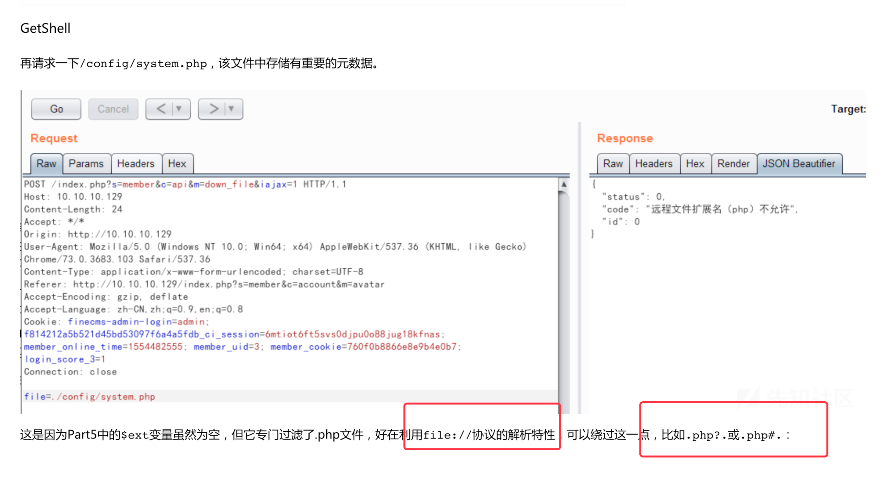](https://cdn.nlark.com/yuque/0/2020/png/376067/1579060661183-4844beda-4a22-4bfe-bce5-f1804cbc4531.png#align=left&display=inline&height=1478&name=image-20200111163800105.png&originHeight=1478&originWidth=2714&size=628714&status=done&style=none&width=2714)

其实我个人觉得师傅这里解释不是很严谨,这个问题其实主要还是出在了curl请求上面，比如我们请求[http://127.0.0.1/1.php?.jpg,那么我们访问的内容就是1.php,而不是名称为\`1.php?.jpg\`的文件,而\`file\_get\_contents\`刚好相反,至于为什么是这样,其实通俗来说原因是按照URL的定义来解析,那么1.php才是资源名,所以才会导致这样的结果](http://127.0.0.1/1.php?.jpg,%E9%82%A3%E4%B9%88%E6%88%91%E4%BB%AC%E8%AE%BF%E9%97%AE%E7%9A%84%E5%86%85%E5%AE%B9%E5%B0%B1%E6%98%AF1.php,%E8%80%8C%E4%B8%8D%E6%98%AF%E5%90%8D%E7%A7%B0%E4%B8%BA`1.php?.jpg`%E7%9A%84%E6%96%87%E4%BB%B6,%E8%80%8C`file_get_contents`%E5%88%9A%E5%A5%BD%E7%9B%B8%E5%8F%8D,%E8%87%B3%E4%BA%8E%E4%B8%BA%E4%BB%80%E4%B9%88%E6%98%AF%E8%BF%99%E6%A0%B7,%E5%85%B6%E5%AE%9E%E9%80%9A%E4%BF%97%E6%9D%A5%E8%AF%B4%E5%8E%9F%E5%9B%A0%E6%98%AF%E6%8C%89%E7%85%A7URL%E7%9A%84%E5%AE%9A%E4%B9%89%E6%9D%A5%E8%A7%A3%E6%9E%90,%E9%82%A3%E4%B9%881.php%E6%89%8D%E6%98%AF%E8%B5%84%E6%BA%90%E5%90%8D,%E6%89%80%E4%BB%A5%E6%89%8D%E4%BC%9A%E5%AF%BC%E8%87%B4%E8%BF%99%E6%A0%B7%E7%9A%84%E7%BB%93%E6%9E%9C), 但是下面我将从php底层来分析下这个原理,说明白下面两段代码的实现差异。

我们先从两段代码开始看起:

```plain
<?php
$url = $_GET['url'];
$file = $url . '.jpg';
var_dump($url);
var_dump($file);
echo file_get_contents($url);
echo '</br>';
echo file_get_contents($file);
?>
```

[](https://cdn.nlark.com/yuque/0/2020/png/376067/1579060673564-33c83ef8-6ea7-43e1-8536-cc1eec414bc6.png#align=left&display=inline&height=1612&name=%E5%9B%BE%E7%89%87.png&originHeight=1612&originWidth=3258&size=728657&status=done&style=none&width=3258)

[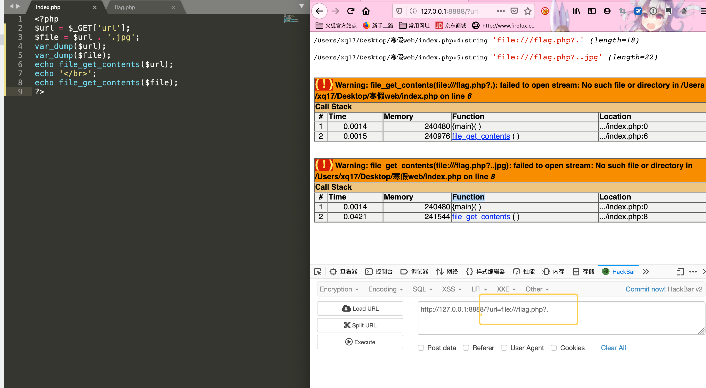](https://cdn.nlark.com/yuque/0/2020/png/376067/1579060679755-899b4d62-d4ea-4e9f-8939-8611c09738b6.png#align=left&display=inline&height=1620&name=%E5%9B%BE%E7%89%87.png&originHeight=1620&originWidth=2944&size=717486&status=done&style=none&width=2944)

```plain
<?php
var_dump(ini_get('allow_url_fopen'));
$url = $_POST['url'];
$url = $url . '.jpg';
var_dump($url);
// echo file_get_contents($url);

if(function_exists('curl_init') && function_exists('curl_exec')){
    $ch = curl_init($url);
    $data = '';
    curl_setopt($ch, CURLOPT_HEADER, 0);
    curl_setopt($ch, CURLOPT_RETURNTRANSFER, 1);
    $data = curl_exec($ch);
    curl_close($ch);
    var_dump($data);
}
?>
```

[](https://cdn.nlark.com/yuque/0/2020/png/376067/1579060688461-e0facd6f-b50c-45e2-936b-285174110444.png#align=left&display=inline&height=1504&name=%E5%9B%BE%E7%89%87.png&originHeight=1504&originWidth=2794&size=543567&status=done&style=none&width=2794)

我们经常在代码里面看到下载文件的时候,一般都会有这两种函数去读取文件内容(导致SSRF), 他们一般是先执行`file_get_contents`判断返回结果为`False`的则接着去执行`curl_exec`,否则直接return, 至于为什么这么写,估计是考虑了像我上面列举的情况?

下面我就主要来分析下php底层如何实现`file_get_contents`的功能。

## 0x2 从底层分析file\_get\_contents

### 0x2.0 debug环境构建

下载:

```plain
git clone https://github.com/php/php-src.git
cd php-src
git checkout remotes/origin/PHP-7.2.0
```

编译:

```plain
./buildconf
./configure  --enable-debug  --disable-all --prefix=/Users/xq17/Desktop/PHPCore/
make && make install
```

### 0x2.1 开始分析

关于StreamWrapper和protocols的关系: [Supported Protocols and Wrappers](https://www.php.net/manual/en/wrappers.php)

关于`file://`,[wrapper.file](https://www.php.net/manual/en/wrappers.file.php)

**PHP流的的概念**

我们都知道PHP中的文件操作函数可以打开文件、URL等资源然后返回一个句柄。那么PHP是如何做到使用一致的API对不同数据源进行操作的呢? 其实就得益于PHP在底层对各种操作进行了分装, 再上层将其统一看做成"流"对象,在底层在进行具体解析。

**php7.1.8**

file\_get\_contents函数的定义

`/ext/standard/file.c` 520 line

[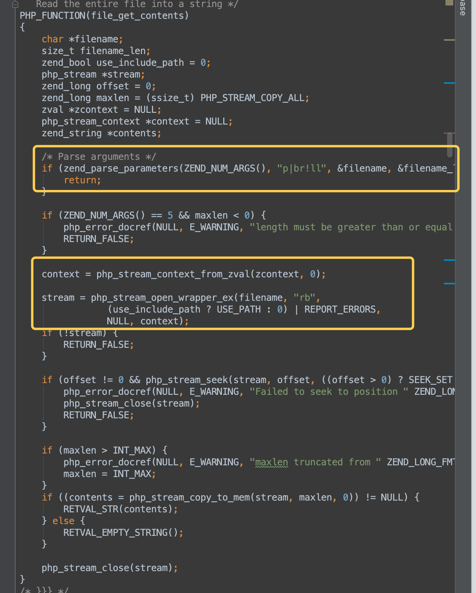](https://cdn.nlark.com/yuque/0/2020/png/376067/1579060702610-692cebff-0c2e-4f41-856d-c71b9c2e16c8.png#align=left&display=inline&height=1514&name=%E5%9B%BE%E7%89%87.png&originHeight=1514&originWidth=1216&size=300011&status=done&style=none&width=1216)

解析完参数之后,开始解析流,我们跟入`php_stream_open_wrapper_ex`

`/main/streams/streams.c` 2010 line

[](https://cdn.nlark.com/yuque/0/2020/png/376067/1579060710986-cdb40acc-3922-4b56-a70b-192f2e31df69.png#align=left&display=inline&height=360&name=%E5%9B%BE%E7%89%87.png&originHeight=360&originWidth=1646&size=64653&status=done&style=none&width=1646)

跟进`php_stream_locate_url_wrapper` 这个函数

[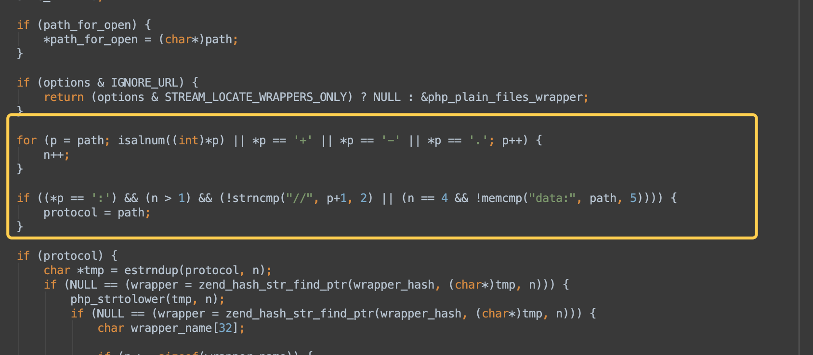](https://cdn.nlark.com/yuque/0/2020/png/376067/1579060718674-a2859afb-cf46-4d28-aeee-702f34693d71.png#align=left&display=inline&height=738&name=%E5%9B%BE%E7%89%87.png&originHeight=738&originWidth=1688&size=126812&status=done&style=none&width=1688)

解析协议类型,继续向下看

[](https://cdn.nlark.com/yuque/0/2020/png/376067/1579060725451-fe5385be-ce27-4fe5-808a-2a188078b7a9.png#align=left&display=inline&height=628&name=%E5%9B%BE%E7%89%87.png&originHeight=628&originWidth=1892&size=107377&status=done&style=none&width=1892)

里面看到`path[n+3]!='/'`这就是为什么我们使用file协议需要:`file:///`的原因

也就是必须要用绝对路径。

[](https://cdn.nlark.com/yuque/0/2020/png/376067/1579060735642-8398b5c3-e031-4c9d-971e-c007c88fed5c.png#align=left&display=inline&height=634&name=%E5%9B%BE%E7%89%87.png&originHeight=634&originWidth=2396&size=130463&status=done&style=none&width=2396)

这里就是根据协议找出对应的wrapper,没有就回退为`plain_files_wrapper`

```plain
<?php
$url = 'file:///flag.php?#123';
file_get_contents($url);
?>
```

这里我们可以正确返回:`file://`的包装器,下面就是用相应包装器取打开流的操作了。

[](https://cdn.nlark.com/yuque/0/2020/png/376067/1579060744872-d2c7cb01-3db0-41f0-8f90-fe4bc5dec663.png#align=left&display=inline&height=528&name=%E5%9B%BE%E7%89%87.png&originHeight=528&originWidth=1662&size=109211&status=done&style=none&width=1662)

[](https://cdn.nlark.com/yuque/0/2020/png/376067/1579060750171-e4a681fc-d8a4-4890-a393-c696c2795dd9.png#align=left&display=inline&height=376&name=%E5%9B%BE%E7%89%87.png&originHeight=376&originWidth=1322&size=68918&status=done&style=none&width=1322)

此时调用栈如下:

[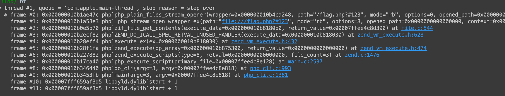](https://cdn.nlark.com/yuque/0/2020/png/376067/1579060756247-57519694-092c-48f6-bd9a-75d89543014c.png#align=left&display=inline&height=430&name=%E5%9B%BE%E7%89%87.png&originHeight=430&originWidth=2242&size=192850&status=done&style=none&width=2242)

[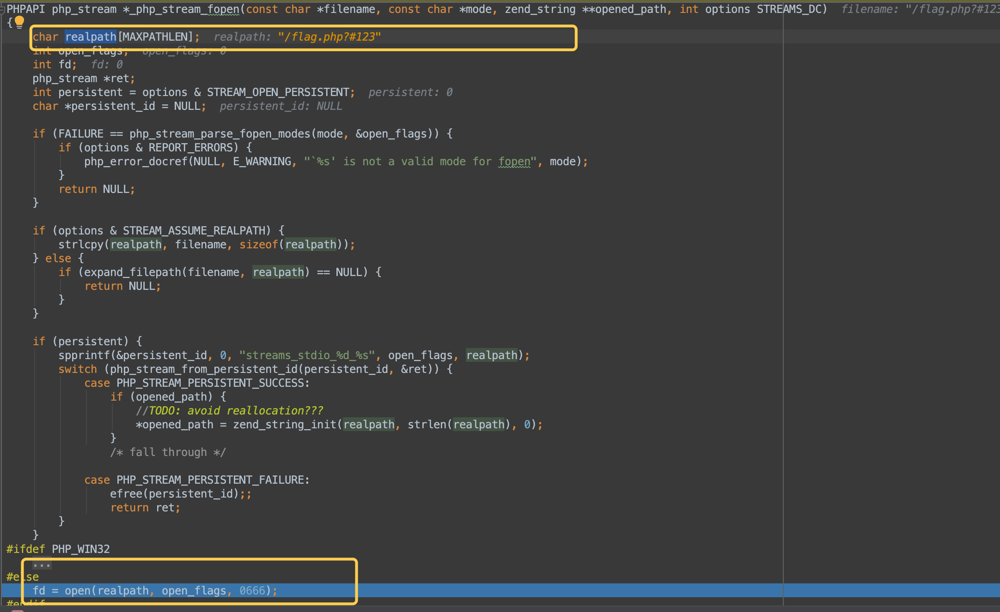](https://cdn.nlark.com/yuque/0/2020/png/376067/1579060761257-0240ead9-8ebc-4f0d-814f-ae3a7da5aed6.png#align=left&display=inline&height=1326&name=%E5%9B%BE%E7%89%87.png&originHeight=1326&originWidth=2164&size=283633&status=done&style=none&width=2164)

可以看到这里经过一些简单的操作就直接把`flag.php?#123`当作文件名传进去了,所以自然是`failed to open stream`

所以说`file_get_contents`对file协议的文件名倒没做什么处理, 不过读者有兴趣可以去研究下`http://`这个协议PHP是如何解析的。

[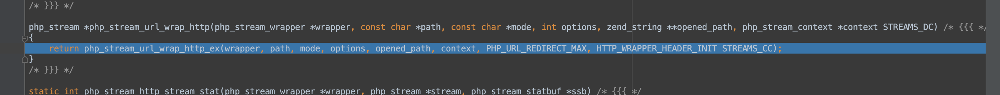](https://cdn.nlark.com/yuque/0/2020/png/376067/1579060768806-56f49fd1-3c96-412d-ab1e-6c8912665f99.png#align=left&display=inline&height=266&name=%E5%9B%BE%E7%89%87.png&originHeight=266&originWidth=2786&size=66704&status=done&style=none&width=2786)

感觉挺有意思的。

## 0x3 从底层分析php curl的流程

那么为什么curl处理file的时候会省略后面的`? or #`的内容呢?

MAC本机调试其实还是挺麻烦的

libcurl 与 curl 的关系

> libcurl and curl 都可以利用多种多样的协议来传输文件  
> curl 是开源文件传输的命令行工具,是基于libcurl的基础上而来的。  
> libcurl 则是一个免费开源,客户端URL传输库。  
> 本文说的PHP的curl其实说的就是libcurl

这里记录下MAC安装Libcurl的过程:

```plain
wget https://curl.haxx.se/download/curl-7.68.0.tar.gz
tar -xzvf 
cd curl-7.68.0
./configure  --enable-debug  --prefix=/usr/local/curl
make && make install
```

然后我们编译下curl扩展,然后再开启

```plain
# 修改命令行的Path
export PATH="/Users/xq17/Desktop/个人学习/php扩展学习/debugphp/php7/bin:$PATH"
# 开始编译扩展
phpize
./configure  --with-curl=/usr/local/curl
make && make install
```

接着我们加载扩展,然后调用就好了。

- - -

因为php版本的问题导致我上面的操作失败了,所以后面我直接重新编译一下PHP7.2了

```plain
./configure  --enable-debug  --with-curl=/usr/local/curl --disable-all  --prefix=/Users/xq17/Desktop/PHPCore/php7.2
make && make install
```

然后我们写一个调用的CURL的PHP文件即可。

```plain
<?php
$url = 'file:///flag.php?123';
if(function_exists('curl_init') && function_exists('curl_exec')){
    $ch = curl_init($url);
    $data = '';
    curl_setopt($ch, CURLOPT_HEADER, 0);
    curl_setopt($ch, CURLOPT_RETURNTRANSFER, 1);
    $data = curl_exec($ch);
    curl_close($ch);
    var_dump($data);
}
?>
```

我们跟进下`curl_init`函数

[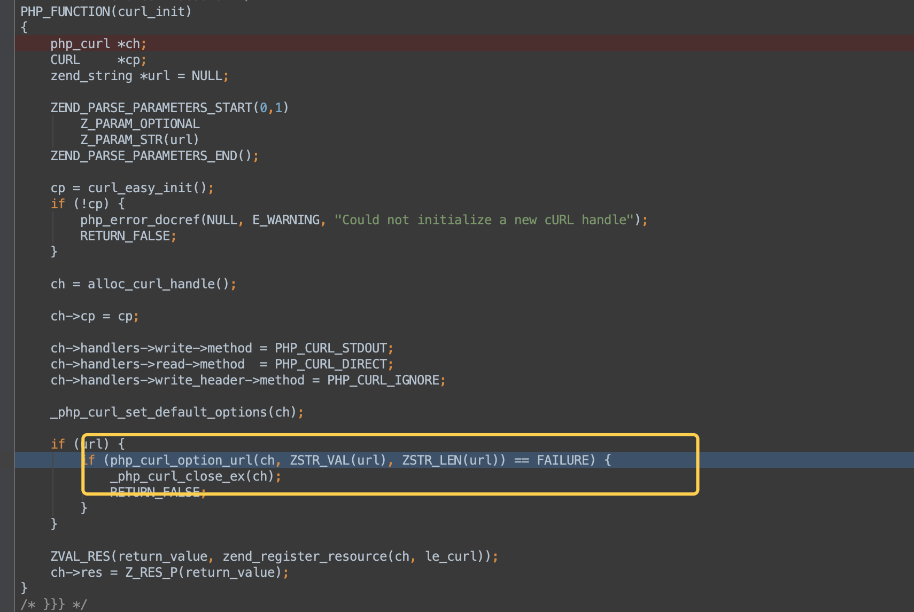](https://cdn.nlark.com/yuque/0/2020/png/376067/1579060781118-a9b8f27c-6cd3-4956-8e60-c0be56ed41b9.png#align=left&display=inline&height=1146&name=%E5%9B%BE%E7%89%87.png&originHeight=1146&originWidth=1710&size=176795&status=done&style=none&width=1710)

然后跟进`php_curl_option_url`

[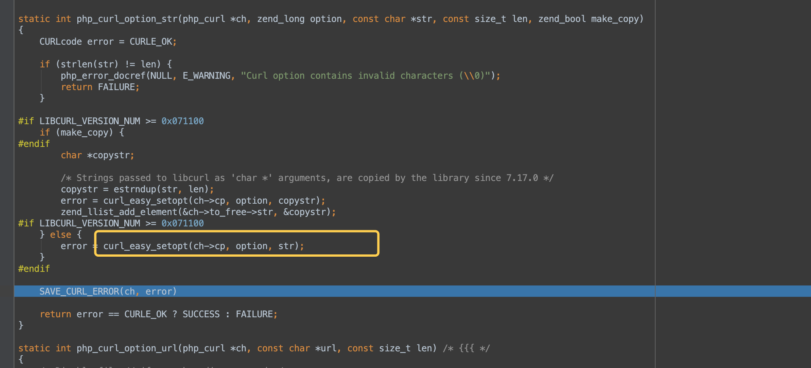](https://cdn.nlark.com/yuque/0/2020/png/376067/1579060787824-34699267-1639-40ed-8f57-8e1823df6fa8.png#align=left&display=inline&height=972&name=%E5%9B%BE%E7%89%87.png&originHeight=972&originWidth=2140&size=181713&status=done&style=none&width=2140)

```plain
# 当前栈情况
frame #0: 0x00000001037ca1cf php`php_curl_option_str(ch=0x0000000104282000, option=10002, str="file:///flag.php?123", len=20, make_copy=0 '\0') at interface.c:194
```

这里就是调用了libcurl里面的`curl_easy_setopt`函数,我们跟进看看

函数的官方定义:[curl\_easy\_setopt - set options for a curl easy handle](https://curl.haxx.se/libcurl/c/curl_easy_setopt.html)

同理我们跟进`curl_exec`函数发现其最终调用的是:`curl_easy_perform`

其实PHP只不过对example做了一些小封装分别搞出了自己的函数.

> ## EXAMPLE

```plain
CURL *curl = curl_easy_init();
if(curl) {
 CURLcode res;
 curl_easy_setopt(curl, CURLOPT_URL, "http://example.com");
 res = curl_easy_perform(curl);
 curl_easy_cleanup(curl);
}
```

所以下面我们主要分析下libcurl是怎么解析URL就行了。

`/lib/setopt.c`

```plain
#undef curl_easy_setopt
CURLcode curl_easy_setopt(struct Curl_easy *data, CURLoption tag, ...)
{
  va_list arg;
  CURLcode result;

  if(!data)
    return CURLE_BAD_FUNCTION_ARGUMENT;

  va_start(arg, tag);

  result = Curl_vsetopt(data, tag, arg);

  va_end(arg);
  return result;
}
```

跟进下`Curl_vsetopt`,这个函数就是设置各种请求信息的,代码case多所以比较长。

[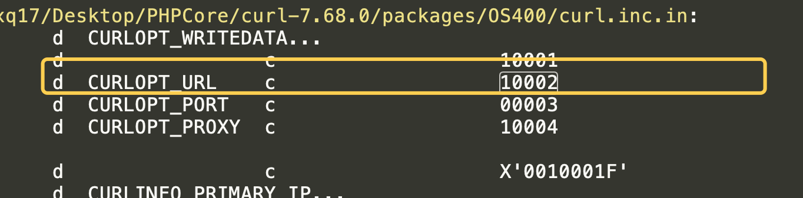](https://cdn.nlark.com/yuque/0/2020/png/376067/1579060813663-9653b791-c12c-4969-a862-8490ec1b9656.png#align=left&display=inline&height=338&name=%E5%9B%BE%E7%89%87.png&originHeight=338&originWidth=1364&size=60261&status=done&style=none&width=1364)

这里我们结合上面分析可以确定就是发起的是URL请求。

```plain
case CURLOPT_URL:
    /*
     * The URL to fetch.
     */
    if(data->change.url_alloc) {
      /* the already set URL is allocated, free it first! */
      Curl_safefree(data->change.url);
      data->change.url_alloc = FALSE;
    }
    result = Curl_setstropt(&data->set.str[STRING_SET_URL],
                            va_arg(param, char *));
    data->change.url = data->set.str[STRING_SET_URL];
    break;
```

```plain
CURLcode Curl_setstropt(char **charp, const char *s)
{
  /* Release the previous storage at `charp' and replace by a dynamic storage
     copy of `s'. Return CURLE_OK or CURLE_OUT_OF_MEMORY. */

  Curl_safefree(*charp);

  if(s) {
    char *str = strdup(s);

    if(str) {
      size_t len = strlen(str);
      if(len > CURL_MAX_INPUT_LENGTH) {
        free(str);
        return CURLE_BAD_FUNCTION_ARGUMENT;
      }
    }
    if(!str)
      return CURLE_OUT_OF_MEMORY;

    *charp = str; #这里就是值传递的点
  }

  return CURLE_OK;
}
```

这里URL的`file:///flag.php?123`给了`data->set.str[STRING_SET_URL]`

感觉还是没到点子上, 我们继续跟进看下是怎么发出请求的。

[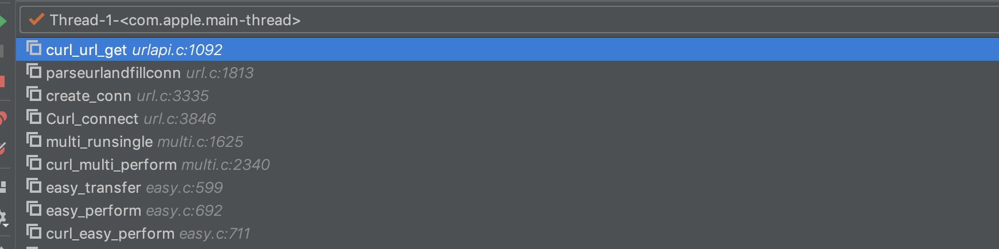](https://cdn.nlark.com/yuque/0/2020/png/376067/1579060837533-d8283b05-686f-438e-9c89-9259e7d5a5ad.png#align=left&display=inline&height=434&name=%E5%9B%BE%E7%89%87.png&originHeight=434&originWidth=1740&size=83985&status=done&style=none&width=1740)

下面就是关键的处理URL函数了

`lib/urlapi.c`

`curl_url_get` line:1003

```plain
case CURLUPART_URL: {
    char *url;
    char *scheme;
    char *options = u->options;
    char *port = u->port;
    char *allochost = NULL;
    if(u->scheme && strcasecompare("file", u->scheme)) {
      url = aprintf("file://%s%s%s",
                    u->path,
                    u->fragment? "#": "",
                    u->fragment? u->fragment : "");
    }
```

这里可以看到这里拼接直接没有考虑`query`部分,最终结果就是`file:///flag.php`

继续跟下去到`file`协议的处理流程,file协议走的是文件处理函数`file_connect`

```plain
static CURLcode file_connect(struct connectdata *conn, bool *done)
{
  struct Curl_easy *data = conn->data;
  char *real_path;
  struct FILEPROTO *file = data->req.protop;
  int fd = -1;
#ifdef DOS_FILESYSTEM
  size_t i;
  char *actual_path;
#endif
  size_t real_path_len;

  CURLcode result = Curl_urldecode(data, data->state.up.path, 0, &real_path,
                                   &real_path_len, FALSE);
```

`real_path`最终处理file的时候拼接的路径值就是`data->state.up.path`,也就是资源部分,其他不管,这点刚好和php上面不一样。

## 0x4 总结

  libcurl的处理过程显然是比php处理过程更细腻， 毕竟两者方向不一样， 不过正好说明了一个问题，越完善的功能往往暴露出的攻击点显然会更多。哎，之前一直卡在wupco师傅的那个phppwn的题目导致我落下了很多知识的学习，争取这几天把坑补完吧。

## 0x5 参考链接

[PHP:file\_get\_contents获取微信头像缓慢问题定位](https://www.jianshu.com/p/42e0c4304b60)

[Docker环境下编译安装PHP7.1.4 Nginx1.12.0](https://www.jianshu.com/p/b2655d50b1ad)

[Phar与Stream Wrapper造成PHP RCE的深入挖掘](https://blog.zsxsoft.com/post/38)

[PHP回顾之流](https://segmentfault.com/a/1190000015052042)

[如何在 Mac 上用 Clion 调试 php7 源码](https://www.jianshu.com/p/f6af567b25a7)

[libcurl中curl\_easy\_setopt()和curl\_easy\_perform()函数使用中文详解](http://blog.sina.com.cn/s/blog_7e0127220100zfbf.html)
