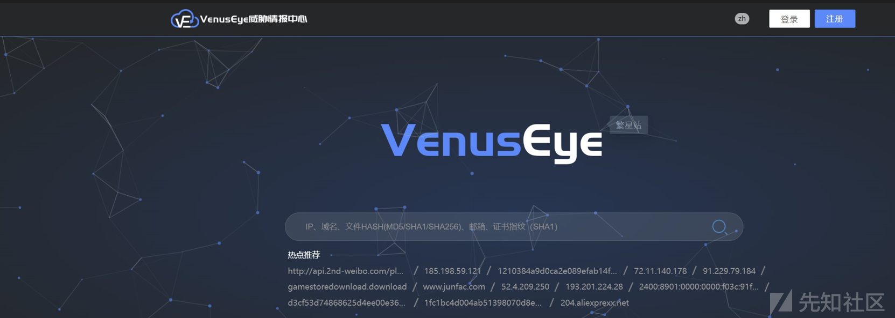
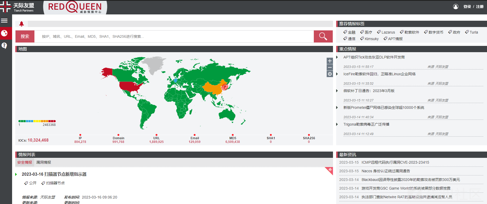

# 浅谈威胁情报的数据采集与情报共享 - 先知社区

浅谈威胁情报的数据采集与情报共享

- - -

## 文章前言

2013年Gartner率先提出威胁情报并给予了其初始定义，随后威胁情报便在国内外迅速发展并一度成为国内外安全领域关注的热点，威胁情报因其在安全检测与防御的实践应用中的重要作用使得很多中大型企业都逐渐的建立了自己的威胁情报运营中心或者将威胁情报数据加入了年度采购预算之中，威胁情报备受重视

## 安全情报

安全情报从情报类型上可以划分为如下几个方面：

-   资产情报：主要用于确认企业自身的资产
-   事件情报：对于已经发生的安全事件的报道
-   漏洞情报：软硬件的各种已知或未知的漏洞情报
-   威胁情报：OSINT(Open source intelligence ，公开资源情报)、 未公开数据(黑产群、社区\\等)

## 威胁情报

威胁情报是一种基于证据的知识，包括情境、机制、指标、影响和操作建议等方面，威胁情报描述了已发现或将来会出现的威胁或危险，并可以用于通知主体针对相关威胁或危险采取的某种响应，广义上的威胁情报内容比较宽泛，包括但不限于狭义的漏洞情报、安全事件情报以及基础信息知识情报等方面内容，在当前的网络安全行业内大多数情况下所说的威胁情报主要指的是狭义的威胁情报，主要是攻击者相关的信息、动机、目标、攻击技战术、IOC(失陷标识: Indicators of Compromise)等

## 情报分类

威胁情报旨在为面临威胁的资产主体(通常为资产所属企业或机构)提供全面的、准确的、与其相关的、并且能够执行和决策的知识和信息，威胁情报按照使用场景可以分为以下几类：

-   战略威胁情报(Strategic Threat Intelligence)：战略威胁情报是给组织的安全管理者使用的(比如:CSO)，它能够帮助决策者把握当前的安全态势，在安全决策上更加有理有据，战略威胁情报主要涵盖诸如网络攻击活动的财务影响、网络攻击趋势以及可能影响高层商业决策的领域
-   运营威胁情报(Operational Threat Intelligence)：运营威胁情报是给安全分析师或者安全事件响应人员使用的，目的是通过对已知的重要安全事件做分析(告警确认、影响范围、攻击链、攻击目的、技战术等)查找攻击相关线索
-   战术威胁情报(Tactical Threat Intelligence)：战术威胁情报关注于攻击者的TTPs，其与针对特定行业或地理区域范围的攻击者使用的特定攻击向量有关并且由类似应急响应人员确保面对此类威胁攻击准备好相应的响应和行动策略
-   技术威胁情报(Technical Threat Intelligence)：技术威胁情报主要是失陷标识，可以自动识别和阻断恶意攻击行为，当前业内更广泛应用的威胁情报主要还是在技术威胁情报层面

威胁情报根据数据本身可以分为HASH值、IP地址、域名、网络或主机特征、TTPs(Tactics、Techniques & Procedures)：

[](https://xzfile.aliyuncs.com/media/upload/picture/20231110162723-f9054aa4-7fa2-1.png)

上图中左侧是能够利用的情报，右侧是这些情报给攻击者造成的困难程度，威胁情报中价值最低的是Hash值、IP地址和域名，其次是网络/主机特征、攻击工具特征，对攻击者影响最大的是TTPs(战术、技术和行为模式)类型的威胁情报：

-   HASH值：指样本、文件的HASH值，比如:MD5和SHA系列，由于HASH函数的雪崩效应使得文件任何微弱地改变都会导致产生一个完全不同也不相关的哈希值，这使得在很多情况下它变得不值得跟踪，所以它带来的防御效果也是最低的
-   IP地址：通过IP的访问控制可以抵御很多常见的攻击，同时因为IP数量太大导致任何攻击者均可以尝试更改IP地址以绕过访问控制
-   域名：有些攻击类型或攻击手法出于隐藏的目的，攻击者会通过域名连接外部服务器进行间接通信，由于域名需要购买、注册、与服务器绑定等操作使得它的成本相对IP是比较高的，对域名的把控产生的防御效果也是较好的，但是对于高级APT攻击或大规模的团伙攻击，往往会准备大量备用域名，所以它的限制作用也是有限
-   网络/主机特征：这里指的特征可以是很多方面，比如:攻击者浏览器的User-Agent、登录的用户名、访问的频率等，这些特征就是一种对攻击者的描述，这些情报数据可以很好的将攻击流量从其他的流量中提取出来，就会产生一种较好的防御效果
-   攻击工具：指获取或检测到了攻击者使用的工具，这种基于工具的情报数据能够使得一批攻击失效，攻击者不得不进行免杀或者重写工具，从而达到增加攻击成本的目的
-   TTPs：Tactics、Techniques、Procedures的缩写，这里指攻击者所使用的攻击策略、攻击手法等，掌握了些信息就能明白攻击者所利用的具体漏洞并能够针对性的进行安全布防，使得攻击者不得不寻找新的漏洞，这类情报数据属于价值最高的情报数据

## 生命周期

威胁情报生命周期是一个循环的过程，其主要包含以下阶段：

-   情报计划：情报计划包括威胁情报对应的安全风险点(包括业务安全、IT资产安全等)、对应情报大类(包括战术情报、战略情报、运营情报、技术情报)、情报小类(包括但不限于pDNS情报、Whois情报、钓鱼网站情报、黑产情报)以及闭环跟进流程，完整的情报计划可以达到指导现有安全体系建设和改进方向的作用
-   情报收集：情报收集是对所有相关安全情报的收集，可以从多种开放或封闭的源收集数据
-   情报处理：情报处理是对原始情报信息进行预处理并进行可靠性评估，确定适用的范围和目标
-   情报分析：情报分析是按照情报计划，分析处理之后的数据，生产最终的情报(也就是所谓的FINTEL)
-   情报传递：情报传递是将FINTEL输送至客户(即安全运营团队)并使用情报，在情报传输阶段需要考虑情报的输送类型(YARA规则、MD5、IPtable...)、情报的面向目标(中间件、数据库等)、情报的传送的及时性等问题
-   情报反馈：情报反馈是通过对输送的情报进行分类归纳和整理后对未来的情报计划进行动态调整和优化并制定新一轮次的情报计划，确定我们需要交付何种类型的情报

## 主要用途

企业威胁情报的主要用途有以下几个方面：

-   安全检测与主动防御：基于威胁情报数据可以不断的创建针对恶意代码或行为特征的签名，或者生成NFT(网络取证工具)、SIEM/SOC(安全信息与事件管理/安全管理中心)、ETDR(终端威胁检测及响应)等产品的规则，实现对攻击的应急检测，如果威胁情报是IP、域名、URL等具体上网属性信息则可应用于各类在线安全设备对既有攻击进行实时的阻截与防御
-   安全分析与事件响应：基于威胁情报可以让安全分析和事件响应工作处理变得更简单、更高效，例如:可依赖威胁情报区分不同类型的攻击并识别出潜在的APT高危级别攻击，从而实现对攻击的及时响应，同时通过利用威胁情报可预测既有的攻击线索可能造成的恶意行为，从而实现对攻击范围的快速划定，通过建立威胁情报的检索实现对安全线索的精准挖掘
-   安全建设与风险感知：基于威胁情报企业可以对自身安全能力进行评估并对不足之处进行强化从而纵深提升企业安全能力，同时也为企业整体网络风险感知提供了指南

## 情报采集

威胁情报数据的来源主要有以下几个渠道：

### 寻找安全公司购买

从安全公司购买威胁情报的情形可以大致分为以下两类：

-   非安全公司：部分非安全公司因为没有安全团队而其业务范围又较为广泛，故而需要通过向安全公司购买威胁情报数据并应用于企业业务保障系统中，防止企业务受到损失
-   安全类公司：安全类公司如果自身没有威胁数据的沉淀或者威胁数据并不够全面或者精准则会找寻另外一些安全公司通过购买或者合作的方式获取威胁情报，之后对威胁情报进行分析处理并集成到自己的安全产品中(例如:态势感知)，从而提升自身安全产品的安全能力

### 开源威胁数据采集

除了寻找安全公司购买威胁情报数据之外，我们还可以从各种不同的开源威胁情报平台或网站收集各种开源的威胁情服将这些开源的威胁情报数据加入到自己的产品中，例如：

**IOC Feeds**

```plain
https://threatfeeds.io/
http://botscout.com/last.htm
http://www.blocklist.de/lists
https://sblam.com/blacklist.txt
http://vxvault.net/URL_List.php
https://dataplane.org/sshclient.txt
https://dataplane.org/sshpwauth.txt
https://urlhaus.abuse.ch/downloads/csv
http://www.spamhaus.org/drop/drop.txt
https://www.spamhaus.org/drop/edrop.txt
http://www.ciarmy.com/list/ci-badguys.txt
http://www.blocklist.de/lists/apache.txt
http://lists.blocklist.de/lists/all.txt
http://report.rutgers.edu/DROP/attackers
https://multiproxy.org/txt_all/proxy.txt
http://cinsscore.com/list/ci-badguys.txt
http://botscout.com/last_caught_cache.htm
http://blocklist.greensnow.co/greensnow.txt
https://isc.sans.edu/feeds/daily_sources
http://data.phishtank.com/data/online-valid.csv
https://secure.dshield.org/ipsascii.html?limit=1000
https://www.dshield.org/ipsascii.html?limit=10000
https://www.projecthoneypot.org/list_of_ips.php?by=2d
https://www.stopforumspam.com/downloads/toxic_ip_cidr.txt
https://myip.ms/files/blacklist/htaccess/latest_blacklist.txt
https://danger.rulez.sk/projects/bruteforceblocker/blist.php
https://onionoo.torproject.org/details?type=relay&running=true
http://www.stopforumspam.com/downloads/listed_ip_1_all.zip
http://rules.emergingthreats.net/fwrules/emerging-PF-CC.rules
http://rules.emergingthreats.net/open/suricata/rules/botcc.rules
http://rules.emergingthreats.net/blockrules/emerging-ciarmy.rules
http://rules.emergingthreats.net/blockrules/emerging-compromised.rules
http://rules.emergingthreats.net/open/suricata/rules/compromised-ips.txt

https://www.circl.lu/doc/misp/feed-osint/

https://gitlab.com/ZeroDot1/CoinBlockerLists/blob/master/list.txt
https://github.com/disconnectme/disconnect-tracking-protection
https://github.com/stamparm/maltrail/blob/master/trails/static/mass_scanner.txt

https://raw.githubusercontent.com/firehol/blocklist-ipsets/master/sslproxies_1d.ipset
https://raw.githubusercontent.com/firehol/blocklist-ipsets/master/socks_proxy_7d.ipset
https://raw.githubusercontent.com/firehol/blocklist-ipsets/master/cruzit_web_attacks.ipset
https://raw.githubusercontent.com/futpib/policeman-rulesets/master/examples/simple_domains_blacklist.txt

https://openphish.com/feed.txt

https://www.malware-traffic-analysis.net/
https://www.webinspector.com/website-malware-scanner/
```

**IOC Repositories**

```plain
https://github.com/aptnotes/data
https://github.com/eset/malware-ioc
https://github.com/pan-unit42/iocs
https://github.com/Neo23x0/signature-base/tree/master/iocs
https://github.com/stamparm/maltrail/tree/master/trails/static/malware
https://github.com/stamparm/maltrail/tree/master/trails/static/suspicious
```

**Security Blog**  
下面的一些安全公司和安全研究员的博客时常也会发布一些关于威胁情报的通知，其中包含的IOC可用于安全情报

```plain
https://contagiodump.blogspot.com/
https://www.malware-traffic-analysis.net/
https://www.trellix.com/en-us/about/newsroom/stories.html
http://www.harmj0y.net/blog/
......
```

**Security Tools**  
当然一些工具类的官网也是非常值得关注的，例如：

```plain
http://w3af.org/
https://hashcat.net/
https://wiki.wireshark.org/

https://portswigger.net/
https://www.netsparker.com/
https://www.metasploit.com/
https://blog.cobaltstrike.com/
https://github.com/gentilkiwi/mimikatz
......
```

### 威胁情报平台

安全厂商也会建立他们自己的威胁情报平台，其中部分为用户提供免费的自建服务，也有一部分付费服务，非安全公司的安全运维人员可以通过威胁平台查询威胁情报数据来判断当前企业是否存在安全风险或者安全隐患，例如：在威胁情报平台发现XXX中间件存在反序列化漏洞的威胁情报后快速确定XXX中间件的影响范围和利用条件，之后反查当前企业是否有使用XXX中间件并确认是否在影响范围列表，如果在影响范围列表则根据威胁情报中的相关安全建议进行风险处置规避安全风险，同时威胁情报平台在安全人员做应急响应时也可以提供多方面的帮助，例如：可疑木马文件检测、可疑外连IP地址检测等  
**国内的威胁情报平台**  
[https://x.threatbook.com/](https://x.threatbook.com/)

[](https://xzfile.aliyuncs.com/media/upload/picture/20231110163228-ae923c42-7fa3-1.png)

[https://redqueen.tj-un.com/IntelHome.html](https://redqueen.tj-un.com/IntelHome.html)

[](https://xzfile.aliyuncs.com/media/upload/picture/20231110163246-b9965646-7fa3-1.png)

[https://www.venuseye.com.cn/](https://www.venuseye.com.cn/)

[](https://xzfile.aliyuncs.com/media/upload/picture/20231110163303-c3ccedd2-7fa3-1.png)  
[https://ti.360.net/#/homepage](https://ti.360.net/#/homepage)

[](https://xzfile.aliyuncs.com/media/upload/picture/20231110163322-cf34cc12-7fa3-1.png)  
[https://ti.nsfocus.com/](https://ti.nsfocus.com/)  
[](https://xzfile.aliyuncs.com/media/upload/picture/20231110163337-d813cdce-7fa3-1.png)  
[https://ti.dbappsecurity.com.cn/](https://ti.dbappsecurity.com.cn/)

[](https://xzfile.aliyuncs.com/media/upload/picture/20231110163355-e2bdf2ea-7fa3-1.png)  
[https://ti.qianxin.com/](https://ti.qianxin.com/)

[](https://xzfile.aliyuncs.com/media/upload/picture/20231110163513-1139791e-7fa4-1.png)

**国外威胁情报平台**  
[https://exchange.xforce.ibmcloud.com/](https://exchange.xforce.ibmcloud.com/)

[](https://xzfile.aliyuncs.com/media/upload/picture/20231110163548-25cee986-7fa4-1.png)

[https://www.virustotal.com/gui/home/upload](https://www.virustotal.com/gui/home/upload)  
[](https://xzfile.aliyuncs.com/media/upload/picture/20231110163601-2d8c0dc0-7fa4-1.png)  
[https://isc.sans.edu/](https://isc.sans.edu/)

[](https://xzfile.aliyuncs.com/media/upload/picture/20231110163620-39500aee-7fa4-1.png)  
[https://www.threatminer.org/](https://www.threatminer.org/)

[](https://xzfile.aliyuncs.com/media/upload/picture/20231110163639-4480291c-7fa4-1.png)  
**OSINT相关检索平台和框架**  
[https://start.me/p/rxRbpo/cti](https://start.me/p/rxRbpo/cti)  
[](https://xzfile.aliyuncs.com/media/upload/picture/20231110163705-5416f9aa-7fa4-1.png)  
[https://map.malfrats.industries/](https://map.malfrats.industries/)

[](https://xzfile.aliyuncs.com/media/upload/picture/20231110163725-5fb4ff28-7fa4-1.png)  
[https://osintframework.com/](https://osintframework.com/)

[](https://xzfile.aliyuncs.com/media/upload/picture/20231110163741-6930c258-7fa4-1.png)

**安全漏洞情报**  
威胁情报工作者在获得漏洞情报后需要通过对漏洞各个方面的信息(包括漏洞成因、严重程度、影响范围、是否在野利用、漏洞修复方案等)进行分析，确保相关人员可在第一时间对企业内部受影响资产组织应急响应及修复工作，以下是几个较为常见且更新较为及时的漏洞情报获取网站  
CNVD：主要监测国内厂商发布的漏洞，由于CNVD对国外厂商的漏洞更新较慢，一般采用其他的方式来对国外漏洞进行监测  
[https://www.cnvd.org.cn/](https://www.cnvd.org.cn/)

[](https://xzfile.aliyuncs.com/media/upload/picture/20231110163815-7d81ea70-7fa4-1.png)  
IBM：更新近期CVE漏洞，更新较快  
[https://exchange.xforce.ibmcloud.com/activity/list?filter=Vulnerabilities](https://exchange.xforce.ibmcloud.com/activity/list?filter=Vulnerabilities)

[](https://xzfile.aliyuncs.com/media/upload/picture/20231110163832-87996de4-7fa4-1.png)  
Openwall：CVE漏洞邮件集合，更新速度较快  
[https://www.openwall.com/lists/oss-security/](https://www.openwall.com/lists/oss-security/)

[](https://xzfile.aliyuncs.com/media/upload/picture/20231110163848-91551b6c-7fa4-1.png)

**POC/EXP情报**  
Exploit-DB：公布漏洞POC  
[https://www.exploit-db.com/](https://www.exploit-db.com/)

[](https://xzfile.aliyuncs.com/media/upload/picture/20231110163909-9dadd46c-7fa4-1.png)  
**病毒情报(IOC情报)**  
天际友盟：每天都会更新近期各类威胁指示器  
[https://redqueen.tj-un.com/IntelHome.html](https://redqueen.tj-un.com/IntelHome.html)

[](https://xzfile.aliyuncs.com/media/upload/picture/20231110163927-a85c8656-7fa4-1.png)

**数据泄露情报**  
[https://0.zone/Intelligence](https://0.zone/Intelligence)  
[](https://xzfile.aliyuncs.com/media/upload/picture/20231110163946-b40261f6-7fa4-1.png)

### 安全公司安全运营

安全公司大多数都有专门的安全团队进行运营，而安全运营的核心在于安全数据，安全公司获取数据的途径主要有以下几个方面：

-   蜜罐系统：安全公司通过搭建一系列的安全蜜罐系统对样本进行捕获并进行分析，从中获取相关威胁情报数据
-   在线沙箱：安全公司提供的在线沙箱检测平台在给予用户恶意样本检测服务的同时也可以用来收集客户上传的恶意样本数据信息
-   安全终端：安全公司做的2C的产品(例如：火绒剑、360安全卫士等)会从用户那里收集各种各样的恶意样本数据，通过将恶意样本数据上传到服务器端，再由安全公司的后台进行分析处理形成不同的样本库，黑库、白库、灰库等
-   安全论坛：安全公司的安全论坛提供了一个很好的技术交流分享平台，用户可以将样本提交到安全公司的安全论坛网站，之后由安全公司进行分析处理，通过此类渠道安全公司可以收集大量的恶意样本文件、恶意样本Hash值、恶意IP地址、恶意URL等

在线沙箱平台：  
[https://s.threatbook.cn/](https://s.threatbook.cn/)

[](https://xzfile.aliyuncs.com/media/upload/picture/20231110164114-e895d0ec-7fa4-1.png)  
[https://app.any.run/](https://app.any.run/) 超级好用  
[](https://xzfile.aliyuncs.com/media/upload/picture/20231110164141-f85500a2-7fa4-1.png)  
[https://analyze.intezer.com/](https://analyze.intezer.com/) 超级好用+2

[](https://xzfile.aliyuncs.com/media/upload/picture/20231110164216-0d20d114-7fa5-1.png)

## 情报共享

情报信息是现代网络安全中重要的一种资源，由于网络空间里的黑客有了更强大的工具军火库和资源，攻击行为更多的是有组织犯罪和政府背景行为，攻击变得越来越复杂且态势感知技术也因此被应用于网络空间安全领域来对抗这种复杂的攻击。为了实现对威胁的全面感知、分析和响应，态势感知技术需要掌握所有出现的威胁信息，但一种单独的网络安全设备无法检测到所有类型的攻击，一家单独的组织也无法发现所有的安全威胁，因此在设备间和组织间交换安全威胁相关的情报成为搭建态势感知系统的重要基础，由于不同设备和组织各自有不同的数据格式和数据组织形式，为了加强安全设备的配合，以及促进不同组织间的协同响应，需要开发标准化的机器可识别的网络空间威胁情报数据交换方法

### 共享标准

目前国际上已有多种关于威胁情报的共享交换标准，当前比较常见的做法是用STIX作情报描述，用TAXII传输数据，用CybOX作为威胁情报词汇

#### STIX

[https://stix.mitre.org/](https://stix.mitre.org/)  
STIX(Structured Threat Information eXpression，结构化威胁信息表达式)是由MITRE联合DHS(美国国土安全部)发布的用来交换威胁情报的一种语言和序列化格式，STIX规范可以通过对象和描述关系清晰地表示威胁情报中的多方面特征，包括威胁因素、威胁活动、威胁属性等，STIX信息可以直观地展示给分析师或者以JSON形式存储以便快速地进行机器读取  
STIX的适用场景包括以下四种：

-   威胁分析：包括威胁的判断、分析、调查、保留记录等
-   威胁情报分享：用标准化的框架进行威胁情报描述与共享
-   威胁特征分类：通过人工方式或自动化工具将威胁特征进行分类
-   威胁及安全事件应急处理： 安全事件的防范、侦测、处理、总结等，对以后的安全事件处置能够有很好的借鉴作用

STIX有两个版本：STIX 1.0基于XML定义，STIX 2.0基于JSON定义，STIX 1.0定义了下图所示的8种对象，STIX 2.0定义了12种域对象(将1.0版本中的TTP与Exploit Target拆分为Attack Pattern, Malware, Tool, Vulnerability，删去了Incident，新增了Report, Identity, Intrusion Set)和2种关系对象(Relationship, Sighting)

[](https://xzfile.aliyuncs.com/media/upload/picture/20231110164347-43a98c26-7fa5-1.png)

#### TAXII

[https://taxii.mitre.org/](https://taxii.mitre.org/)  
TAXII(Trusted Automated eXchange of Indicator Information，情报信息的可信自动化交换)是用来基于HTTPS交换威胁情报信息的一个应用层协议，TAXII是为支持使用STIX描述的威胁情报交换而专门设计的，但是也可以用来共享其他格式的数据，需要注意的是STIX和TAXII是两个相互独立的标准，STIX的结构和序列化不依赖于任何特定的传输机制，而TAXII也可用于传输非STIX数据，不同的组织机构之间可以通过定义与通用共享模型相对应的API来共享威胁情报，TAXII定义了一个服务信息交换集合和一个TAXII客户端服务器需求集，以及如下两种主要服务来支持多种通用共享模型

-   汇聚服务(Collections)：由TAXII服务器作为情报中心汇聚威胁情报，TAXII客户端和服务器以请求-响应模型交换信息，多个客户端可以向同一服务器请求威胁情报信息
-   通道服务(Channels)：由TAXII服务器作为通道，TAXII客户端之间以发布-订阅模型交换信息，通道服务允许一个情报源将数据推送给多个情报用户同时每个情报用户可接收到多个情报源发送的数据  
    汇聚服务和通道服务可以用不同的方式进行组织，比如:可以将两种服务组合在一起来支持某一可信组的需求，通过这两种服务TAXII可支持所有广泛使用的威胁情报共享模型，包括辐射型(hub-and-spoke)、 点对点(peer-to-peer)，订阅型(source-subscriber)  
    [](https://xzfile.aliyuncs.com/media/upload/picture/20231110164410-518574fe-7fa5-1.png)  
    \#### CyboX  
    [https://cyboxproject.github.io/](https://cyboxproject.github.io/)  
    CybOX(Cyber Observable eXpression，网络可观察表达式)定义了一种表征计算机可观察对象与网络动态和实体的方法，可观察对象可以是动态的事件，也可以是静态的资产，例如:HTTP会话、X509证书、文件、系统配置项等。CybOX规范提供了一套标准且支持扩展的语法来描述所有可被从计算系统和操作上观察到的内容，可用于威胁评估、日志管理、恶意软件特征描述、指标共享和事件响应等

[](https://xzfile.aliyuncs.com/media/upload/picture/20231110164427-5b1ef800-7fa5-1.png)

#### MAEC

MAEC(Malware Attribute Enumeration and Characterization，恶意软件属性枚举与特性描述)是一种共享恶意软件结构化信息的标准化语言，MAEC的提出旨在消除恶意软件描述当前存在的模糊性和不确定性问题并降低对签名的依赖性，从而为改变恶意软件研究和响应提供基础。MAEC寻求改善有关恶意软件的人与人、人与工具、工具与工具以及工具与人之间的通信，减少研究人员对恶意软件分析工作的潜在重复并通过利用以前观察到的恶意软件实例的响应来促进对策的快速开发，下图所示的MAEC数据模型可以由点和边组成的连接图表示，其中MAEC顶层对象定义为节点，MAEC关系定义为边，关系用来描述MAEC对象之间如何关联

[](https://xzfile.aliyuncs.com/media/upload/picture/20231110164447-671dfbb0-7fa5-1.png)

#### OVAL

[https://oval.mitre.org](https://oval.mitre.org/)  
OVAL(Open Vulnerability and Assessment Language，开放式漏洞与评估语言)是由MITRE开发的一种在漏洞分析中常被用来定义检查项、脆弱点等技术细节的描述语言。OVAL使用标准的XML格式组织内容，包含OVAL定义格式(OVAL Definition Schema)，OVAL系统特性格式(OVAL System Characteristics Schema)与OVAL结果格式(OVAL Result Schema)三种格式，其中OVAL定义格式具有较为重要的作用，它提供了对系统进行安全评估的操作指南，具有较好的可机读性，可用来描述系统的配置信息、分析系统的安全状态、报告评估结果等，典型的OVAL定义格式的XML文档结构较为简单，主要是将定义(Definition)、测试(Test)、对象(Object)、状态(State)和变量(Variable)等各要素进行枚举，另外OVAL系统特性格式用于描述系统信息快照，该快照可用于和OVAL定义文件进行匹配以得出评估结果，OVAL结果格式用于描述评估结果，然而由于表达内容、应用场景的局限性，OVAL并不能满足当前各厂商对威胁情报共享的普遍需求，因此逐步被STIX取代

[](https://xzfile.aliyuncs.com/media/upload/picture/20231110164518-7a0f906c-7fa5-1.png)

#### CAPEC

[https://capec.mitre.org/about/index.html](https://capec.mitre.org/about/index.html)  
CAPEC(Common Attack Pattern Enumeration and Classification，常见攻击模式枚举与分类)致力于提供一个关于常见攻击模式的公共可用分类，从而帮助用户理解敌人如何利用应用程序中的弱点和其他支持网络的性能来进行攻击，"攻击模式"是对敌方利用网络性能的已知弱点来进行攻击的常用属性和方法的描述。攻击模式定义了敌人可能面临的挑战以及他们如何解决它，这些解决方法来源于在破坏性环境中而非建设性环境中应用的设计模式的概念并且通过对特定的现实世界的开发实例的深入分析生成，每个攻击模式捕获关于如何设计和执行攻击的特定部分的知识并指导如何减轻攻击的有效性，攻击模式帮助开发应用程序或网络管理人员更好地理解攻击的特征以及如何阻止它们成功

### 简易使用

这里我们对使用STIX作情报描述，用TAXII传输数据，用CybOX作为威胁情报词汇进行简单介绍：

#### STIX情报描述

简易示例：[https://stixproject.github.io/documentation/idioms/](https://stixproject.github.io/documentation/idioms/)

[](https://xzfile.aliyuncs.com/media/upload/picture/20231110164636-a8678d98-7fa5-1.png)  
这里我们以"CVE in an Exploit Target"为例进行演示，其数据模型如下：  
[https://stixproject.github.io/documentation/idioms/cve/](https://stixproject.github.io/documentation/idioms/cve/)

[](https://xzfile.aliyuncs.com/media/upload/picture/20231110164651-b11f0524-7fa5-1.png)

XML格式情报描述：

```plain
<stixCommon:Exploit_Target xsi:type="et:ExploitTargetType" id="example:et-48a276f7-a8d7-bba2-3575-e8a63fcd488" timestamp="2014-02-20T09:00:00.000000Z">
    <et:Title>Javascript vulnerability in MSIE 6-11</et:Title>
    <et:Vulnerability>
        <et:CVE_ID>CVE-2013-3893</et:CVE_ID>
        <et:References>
            <stixCommon:Reference>https://technet.microsoft.com/library/security/2887505</stixCommon:Reference>
        </et:References>
    </et:Vulnerability>
</stixCommon:Exploit_Target>
```

#### TAXII传输数据

[https://oasis-open.github.io/cti-documentation/resources.html#individual-specification-documents](https://oasis-open.github.io/cti-documentation/resources.html#individual-specification-documents)  
定义STIX语言、领域对象、关系对象、网络可观察对象和元对象的概念和结构，定义模式语言，以便能够检测网络和端点上可能的恶意活动  
[](https://xzfile.aliyuncs.com/media/upload/picture/20231110164745-d1a30e30-7fa5-1.png)  
[https://docs.oasis-open.org/cti/stix/v2.1/os/stix-v2.1-os.html](https://docs.oasis-open.org/cti/stix/v2.1/os/stix-v2.1-os.html)

[](https://xzfile.aliyuncs.com/media/upload/picture/20231110164805-dd1e81c2-7fa5-1.png)  
例如：Hash值

[](https://xzfile.aliyuncs.com/media/upload/picture/20231110164819-e5c30f28-7fa5-1.png)

[](https://xzfile.aliyuncs.com/media/upload/picture/20231110164826-ea1a86b4-7fa5-1.png)

[](https://xzfile.aliyuncs.com/media/upload/picture/20231110164837-f053ca40-7fa5-1.png)  
示例如下：

[](https://xzfile.aliyuncs.com/media/upload/picture/20231110164854-fab623ac-7fa5-1.png)

#### CybOX威胁情报词汇

简易实例：[https://cyboxproject.github.io/samples/](https://cyboxproject.github.io/samples/)  
[](https://xzfile.aliyuncs.com/media/upload/picture/20231110165121-525e85fe-7fa6-1.png)  
例如：Email Pattern

```plain
<?xml version="1.0" encoding="UTF-8"?>
<cybox:Observables 
    xmlns:xsi="http://www.w3.org/2001/XMLSchema-instance" 
    xmlns:cybox="http://docs.oasis-open.org/cti/ns/cybox/core-2" 
    xmlns:cyboxCommon="http://docs.oasis-open.org/cti/ns/cybox/common-2" 
    xmlns:AddrObj="http://docs.oasis-open.org/cti/ns/cybox/objects/address-2" 
    xmlns:URIObj="http://docs.oasis-open.org/cti/ns/cybox/objects/uri-2" 
    xmlns:FileObj="http://docs.oasis-open.org/cti/ns/cybox/objects/file-2" 
    xmlns:cyboxVocabs="http://docs.oasis-open.org/cti/ns/cybox/vocabularies-2" 
    xmlns:EmailMessageObj="http://docs.oasis-open.org/cti/ns/cybox/objects/email-message-2" 
    xmlns:example="http://example.com/" 
    xsi:schemaLocation="
    http://docs.oasis-open.org/cti/ns/cybox/core-2 ../core.xsd
    http://docs.oasis-open.org/cti/ns/cybox/objects/file-2 ../objects/File_Object.xsd
    http://docs.oasis-open.org/cti/ns/cybox/objects/email-message-2 ../objects/Email_Message_Object.xsd
    http://docs.oasis-open.org/cti/ns/cybox/vocabularies-2 ../default_vocabularies.xsd" 
    cybox_major_version="2" cybox_minor_version="1" cybox_update_version="1">
    <cybox:Observable id="example:Obervable-298376a2-cf65-4778-9894-ed9a95b5441d">
        <cybox:Object id="example:Object-f9769431-db6b-448f-b34e-72eb3c3e07d1">
            <cybox:Properties xsi:type="EmailMessageObj:EmailMessageObjectType">
                <EmailMessageObj:Header>
                    <EmailMessageObj:From category="e-mail">
                        <AddrObj:Address_Value condition="Equals" apply_condition="ANY">attacker@example.com##comma##attacker1@example.com##comma##attacker@bad.example.com</AddrObj:Address_Value>
                    </EmailMessageObj:From>
                    <EmailMessageObj:Subject condition="Equals" >New modifications to the specification</EmailMessageObj:Subject>
                </EmailMessageObj:Header>
            </cybox:Properties>
        </cybox:Object>
    </cybox:Observable>
</cybox:Observables>
```

### LWTISUF

#### 框架介绍

STIX/TAXII采用一套逻辑严密的机制定义了网络威胁情报共享的协议、服务和信息格式，但是从攻击溯源需求的角度来看将该机制直接应用于攻击溯源尚存在以下2个方面的不足：

-   对于攻击溯源的表达能力不足：STIX/TAXII的设计理念是为广泛的威胁情报共享提供支撑，对于攻击溯源的内涵和外延的表达还不够深入，不能覆盖诸如匿名网络、网络跳板、僵尸网络、暗网、网络隐蔽信道等对抗溯源的技术机制的描述，从而无法为深入的攻击溯源自动化分析能力提供支持
-   威胁情报表达格式交换机制过于复杂，不利于快速普及应用，同时也会增加威胁情报的分析处理负载，面对海量威胁情报更会显著增加处理成本  
    为此定制化的轻量型威胁情报共享利用框架LWTISUF(lightweight threat intelligence sharing and using framework)应运而生，它可以专门用于对网络攻击行为的溯源，同时尽量保持与STIX/TAXII机制的兼容性，该架可以很方便地集成到当前主流的安全检测防护系统和产品中，例如：入侵检测系统、防火墙系统、终端安全管理系统统等，从而实现攻击情报的共享、交换和利用，为攻击溯源提供协同化处理机制

[](https://xzfile.aliyuncs.com/media/upload/picture/20231110165220-7582f8d0-7fa6-1.png)  
内部威胁情报源主要是指机构自身的安全检测防护分析系统所形成的威胁数据，包括来自基础安全检测系统和综合安全分析系统方面的数据，其中基础安全检测系统包括防火墙、入侵检测系统、漏洞扫描系统、防病毒系统、终端安全管理系统等基础安全检测单元，综合安全分析系统包括安全管理平台、安全运营中心(SOC)、安全信息与事件管理(SIEM)等综合安全检测分析单元  
外部威胁情报源主要指来自外部机构的威胁情报源，主要包括互联网公开情报源、合作交换情报源和商业购买情报源3个方面，其中互联网公开情报源主要包括来自互联网的安全分析报告、安全事件情报、安全态势预警等数据,，通过网络爬虫进行采集，合作交换情报源来自建立合作关系的机构，这往往通过在互利互惠基础上实现的共享合作机制进行保障，商业购买情报源指完全通过商业付费行为得到的情报源，这往往来自专门的威胁情报供应商，例如：FireEye、Verisign等企业

#### 情报表示

从攻击溯源的角度来看相关的威胁情报主要包括恶意IP/DNS/URL等信息、安全攻击事件信息、恶意代码活动及特征信息、僵尸网络活动信息、0day/nday漏洞信息、黑客及其组织的TTP(策略技术和过程)信息等方面  
轻量型威胁情报共享利用框架将威胁情报信息统一采用XML格式进行描述，方便机器处理又方便人工阅读分析，轻量型威胁情报共享利用框架将威胁情报分为6个方面，括黑白名单数据类(包括:IP类、DNS类、URL类)、安全攻击事件信息类(包括攻击时间、发起IP地址、目标IP地址、攻击类型、关键特征等)，恶意代码活动及其特征信息类(包括恶意代码MD5值、类型、活动时间、回连地址、技术特征等)，尸网络活动信息类(包括尸网络名称、类型、控制节点、技术特点等)，漏洞信息类(包括漏洞名称、漏洞类别、利用特点等)、黑客及其组信息类(包括黑客组织、成员联系方式、个人特点等)  
下面以C2命令和控制主机为例按照LWTISUF框架的表达方法，C2主机威胁指标表达的数据模型分为2个主要部分：C2主机观察到的恶意行为和对应恶意行为的解释，数据模型如下：  
[](https://xzfile.aliyuncs.com/media/upload/picture/20231110165349-aa671388-7fa6-1.png)  
根据C2主机的数据模型，按照LWTISUF架以XML的形式对该威胁指标进行表达的格式如下所：

```plain
<lwtisuf:Indicators>
    <lwtisuf:Indicator xsi：type="indicator:IndicatorType" 
                       id="example: Indicator33fe3b22-0201-47c-85d0-97c02164528d" 
                       timestamp="2014-05-08T09:00:00.000000Z">
        <indicator:Title>IP Address for known C2 channel</indicator:Title>
        <indicator:Type xsi: type="stixVocabs:IndicatorTypeVocab-l. 1">IP Watchlist</indicator:Type>
        <indicator:Observable id="example: Observable-1c798262-a4cd-434d-a958884d6980c459">
            </indicator:Observable><indicator:Indicated_TTP>
        <Common:TTP idref="example:TTPbc66360d-a7d1-4d8cadla-ea3a13d62da9"/>
        </indicator:Indicated_TTP>
        </lwtisuf:Indicator></lwtisuf:Indicators>
<lwtisuf:TTPs>
    <lwtisuf:TTP xsi: type="ttp: TTPType" id="exam-ple:TTP-bc66360d-a7d1-4d8c-adla-ea3a13d62da9" timestamp="2014-05-08T09:00:00.000000Z">
        <ttp:Title>C2 Behavior</ttp:Title>
   </lwtisuf:TTP>
</lwtisuf:TTPs>
```

C2主机威胁指标通过轻量型威胁情报共享利用框架来表达不仅可以保证良好的人、机可读性，更能够充分满足数据交换和共享的需求，还能够直观地查看到各个威胁属性之间的关联情况，下图所示的是一种可视化表示的C2主机威胁属性关联图

[](https://xzfile.aliyuncs.com/media/upload/picture/20231110165413-b8812530-7fa6-1.png)

#### 情报交换

系统收到威胁情报数据后将XML文档消息转换为系统可识别的对象，然后存于数据库中供其分析和使用，并在此基础上协调各个组件之间的运作，威胁情报交换过程中的转换处理工作流程如下：

1.  将XML格式的威胁情报数据发送给转换模块
2.  转换模块解析XML文档根据威胁情报的数据模型生成相应的对象
3.  根据威胁情报数据库格式的定义，转换模块从数据对象中提取特定属性，组织成各个威胁情报数据域

#### 情报利用

利用威胁情报实现的攻击溯源主要包括控制主机溯源和攻击者溯源两个方面，所形成的攻击溯源信息可以作为新产生的威胁情报为内部安全防护体系提供支撑，也可以用于跟外部机构之间的威胁情报交换

-   控制主机溯源分析主要是寻找和定位发起攻击事件的主控机器，主要是利用威胁情报数据进行关联分析以实现对采用隐匿技术机制的攻击行为进行溯源分析，例如：僵尸网络、网络跳板、匿名网络、网络隐蔽信道等
-   攻击者溯源旨在寻找实施攻击的幕后黑客及其组织，主要通过结合威胁情报和攻击事件信息进行基于大数据的挖掘分析，包括攻击代码分析、攻击模式分析、社会网络分析、代码模式分析、键盘模式分析、工作习惯分析等方面，通过基于大数据的共享利用分析可以实现对攻击者的刻画、对攻击行为的关联分析，从而为揭示攻击过程提供有效值的信息

## 文末小结

威胁情报在进行采集时需要根据之前制定的威胁情报方案来定向获取威胁情报数据，同时需要注意威胁情报采集的时效性和精准性，对于威胁情报的使用针对不同使用者有不同的作用效果，安全厂商可以通过威胁情报增设规则提升自己产品的安全能力，应急响应人员可以通过威胁情报进行攻击溯源和事件定性等，安全运维人员可以通过威胁情报对产品进行查缺补漏对产品应用进行加固，厂商可以通过威胁情报对自研产品进行风险排查定位脆弱点来修复自身产品的安全缺陷

## 参考连接

[https://oval.mitre.org/about/](https://oval.mitre.org/about/)  
[https://cyboxproject.github.io/](https://cyboxproject.github.io/)  
[http://capec.mitre.org/about/index.html](http://capec.mitre.org/about/index.html)  
[https://www.doc88.com/p-0032541830926.html](https://www.doc88.com/p-0032541830926.html)  
[http://maecproject.github.io/documentation/overview](http://maecproject.github.io/documentation/overview)  
[https://oasis-open.github.io/cti-documentation/stix/intro](https://oasis-open.github.io/cti-documentation/stix/intro)  
[https://oasis-open.github.io/cti-documentation/taxii/intro](https://oasis-open.github.io/cti-documentation/taxii/intro)  
[http://www.covert.io/threat-intelligence/](http://www.covert.io/threat-intelligence/)  
[http://www.changyuan.net.cn/index.php?m=home&c=View&a=index&aid=19](http://www.changyuan.net.cn/index.php?m=home&c=View&a=index&aid=19)  
[https://www.slideshare.net/JeremyLi10/discover-advanced-threats-with-threat-intelligence-jeremy-li](https://www.slideshare.net/JeremyLi10/discover-advanced-threats-with-threat-intelligence-jeremy-li)
