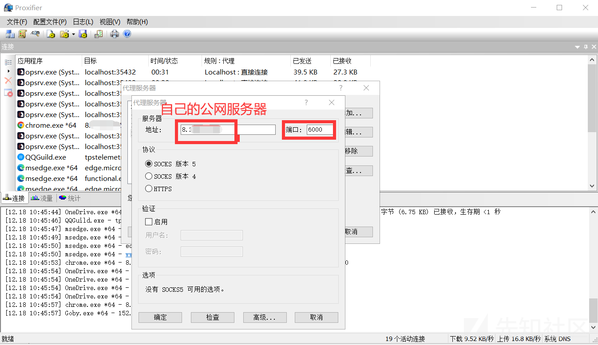
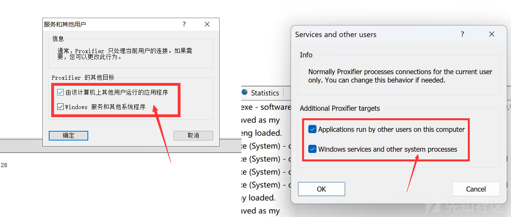

# 渗透必备：使用Proxifier玩转代理 - 先知社区

渗透必备：使用Proxifier玩转代理

- - -

# 0# 概述

在日常的渗透过程中，不管是前期的外部打点还是后渗透，代理总是绕不开的话题。在前期的外部打点过程中，扫描和渗透测试会不断受到WAF的拦截，需要不停的更换IP进行扫描和渗透测试；而在后期的后渗透过程中，通过Frp和Nps等等工具从入口点出网之后，也需要对接代理进入目标内网进行内网渗透。

本文内容是我个人自己摸索出来的，也有可能别的师傅也有类似的方法哈哈。

[](https://xzfile.aliyuncs.com/media/upload/picture/20231205105723-03752236-931a-1.jpg)

# 1# Proxifier介绍

本文我们需要用到一个工具：`Proxifier`，有不少师傅应该听过它的大名。  
`Proxifier` 是一款代理客户端软件，可以让不支持代理服务器工作的程序变的可行。支持各种操作系统和各代理协议，它的运行模式可以指定端口，指定程序的特点。

`Proxifier` 的主要用途是在系统级别通过代理服务器强制 Web 请求，从而使来自不支持代理的应用程序的请求通过代理访问其预期网站。

工具下载地址： [https://pan.baidu.com/s/1pu\_5Wcq1MG5GcN9H4C8-Nw?pwd=sz5v](https://pan.baidu.com/s/1pu_5Wcq1MG5GcN9H4C8-Nw?pwd=sz5v)  
提取码：sz5v  
**注：请各位师傅下载我这里的这个，新版本的汉化版有很多Bug，试过的师傅都知道**

# 2# 操作过程

安装完成后，就可以开始上手配置代理了  
总共需要两步：1、配置代理服务器 2、配置代理规则  
简单理解：第一步是配置 `Proxifier` 连上你的代理服务器，第二步是指定对应程序强制走你之前配置好的代理服务器

### 2.1 配置代理服务器

打开安装好的 `Proxifier` ，点击菜单栏“配置文件”中的“代理服务器”

[](https://xzfile.aliyuncs.com/media/upload/picture/20231205105740-0de61234-931a-1.png)

在弹出的窗口中点击“添加”

[](https://xzfile.aliyuncs.com/media/upload/picture/20231205105920-496c2276-931a-1.png)

找到代理的服务端的IP和端口（本地代理服务就是 `127.0.0.1`）并填写和选择对应代理协议，如下图所示：

[](https://xzfile.aliyuncs.com/media/upload/picture/20231205105930-4f51cfb0-931a-1.png)

有的师傅到这一步有点蒙圈，我来说一下这里填写的内容在哪找吧：

[](https://xzfile.aliyuncs.com/media/upload/picture/20231205105939-54b592ca-931a-1.png)

[](https://xzfile.aliyuncs.com/media/upload/picture/20231205105949-5a793a5e-931a-1.png)

**注：使用本地代理端口，请先测试本地客户端的代理能否可用**  
同样类似的，你用啥客户端，就在具体客户端那边找就行了  
接下来进行测试，点击下方“检查”按钮

[](https://xzfile.aliyuncs.com/media/upload/picture/20231205105957-5f57f13c-931a-1.png)

代理测试可用，直接点击“确定”保存即可，然后在列表中能找到你添加的代理服务器

[](https://xzfile.aliyuncs.com/media/upload/picture/20231205110007-65448538-931a-1.png)

### 2.2 配置代理规则

点击菜单栏“配置文件”中的“代理规则”

[](https://xzfile.aliyuncs.com/media/upload/picture/20231205110016-6ad3ab96-931a-1.png)

打开“代理规则”列表，点击“添加”按钮

[](https://xzfile.aliyuncs.com/media/upload/picture/20231205110027-71300ef8-931a-1.png)

以下，以我将本地所有java运行的工具都走代理作为示例  
应用程序处点击“浏览”可以设置指定程序，目标端口处可以设置指定端口（一般不设置）

[](https://xzfile.aliyuncs.com/media/upload/picture/20231205110038-779b638c-931a-1.png)

设置完成后点击“确定”即可保存，接下来java进程的程序都可以走代理了

[](https://xzfile.aliyuncs.com/media/upload/picture/20231205110049-7e5d9870-931a-1.png)

如图所示，直接让Jar工具的流量走代理打出去了

# 3# Proxifier玩转代理

既然了解了 `Proxifier` 的基本配置，那不是应该骚起来吗~

### 3.0 配置说明

配置其他的之前，要新增一个代理规则，如下：

[](https://xzfile.aliyuncs.com/media/upload/picture/20231205110059-84938998-931a-1.png)

```plain
127.0.0.1; ::1
```

让它 `Direct` （直接连接，即不走任何代理）即可

> 说明：  
> ::1是IPv6中的环回地址，将其视为127.0.0.1的IPv6版本  
> 有些进程在本地通讯中会用到这个玩意，必须先让它直连，如果它走代理的话对应的进程会出问题的

由此，这条规则在代理列表里面要处于最高（优先进行），如下：

[](https://xzfile.aliyuncs.com/media/upload/picture/20231205110123-92dab5d0-931a-1.png)

通过右边的按钮，将这条规则调整到第一行（优先执行）

### 3.1 通过Proxifier进行内网渗透

这个在我之前的文章 [2022安恒杯决赛思路](https://blog.zgsec.cn/index.php/archives/68/) 里面提到过，我这里再写一下吧  
这里以Frp为例：  
下载Frp： [fatedier/frp](https://github.com/fatedier/frp/releases/download/v0.45.0/frp_0.45.0_linux_amd64.tar.gz)

[](https://xzfile.aliyuncs.com/media/upload/picture/20231205110331-df388bd2-931a-1.png)

很简单，frpc是客户端，frps是服务端

[](https://xzfile.aliyuncs.com/media/upload/picture/20231205110407-f432e73a-931a-1.png)

配置`frpc.ini`:

```plain
# frpc.ini
[common]
server_addr = 自己公网服务器地址
server_port = 7000

[frp]
type = tcp
remote_port = 6000
plugin = socks5    //这一句必须要加，不然代理连不上
```

客户端通过WebShell上传，frps上传到自己的公网服务器上，配置`frps.ini`:

```plain
# frps.ini
[common]
bind_port = 7000
```

接下来要在自己的公网服务器上开6000和7000这两个端口，并执行命令进行监听：

```plain
./frps -c ./frps.ini
```

再在上线的那台机器上执行命令：

```plain
/var/www/html/frp/frpc -c ./frpc.ini
```

这样就可以成功将内网流量通过公网服务器的6000端口代理出来了，接下来使用 `Proxifier` 配合Frp对相关进程进行全局代理即可：

[](https://xzfile.aliyuncs.com/media/upload/picture/20231205110510-19b952c8-931b-1.png)

然后直接用工具对内网目标攻击即可（没错，就是你想的那样，工具里面直接填内网IP地址就能打）

### 3.2 通过Proxifier将VM虚拟机代理

很多时候，作为攻击队，我们都需要在纯净的武器库虚拟机中完成自己的渗透（因为蜜罐会尝试获取浏览器Cookie和本地文件，用自己的实体机很快就能被溯源），如何直接让所有的虚拟机都走上代理呢？

**注：本文这个方法，无视任何类型的系统类型和对应配置，只要配置VM网卡出网即可被代理**

如下配置：

[](https://xzfile.aliyuncs.com/media/upload/picture/20231205110549-318d0ba6-931b-1.png)

应用程序填写如下：

```plain
vmware.exe; vmnetcfg.exe; vmnat.exe; vmrun.exe; vmware-vmx.exe; mkssandbox.exe; vmware-hostd.exe; vmnat.exe; vmnetdhcp.exe
```

配置完成后，我们来虚拟机里面看看：

[](https://xzfile.aliyuncs.com/media/upload/picture/20231205110613-3f667294-931b-1.png)

让我们来查看一下虚拟机公网IP地址：

[](https://xzfile.aliyuncs.com/media/upload/picture/20231205110624-4624e17e-931b-1.png)

让我们继续来看看Linux的表现：

[](https://xzfile.aliyuncs.com/media/upload/picture/20231205110637-4dba4528-931b-1.png)

再让我们来查看一下虚拟机公网IP地址：

[](https://xzfile.aliyuncs.com/media/upload/picture/20231205110650-55e188f6-931b-1.png)

这样整个虚拟机的代理都走上代理，无需在虚拟机中有任何其他配置，就问你骚不骚？

#### VM虚拟机17以上版本-特别补充

之前有挺多师傅反馈VMware 17以上版本无法将流量代理出来，苦于本地没装VMware 17，一直没空尝试，今天终于和 `nack0c` 师傅研究出了解决方法：

[](https://xzfile.aliyuncs.com/media/upload/picture/20231205110706-5f1fff42-931b-1.png)

在“配置文件”的“高级”处，选择“服务与其他用户”，然后勾选上两个选项：

[](https://xzfile.aliyuncs.com/media/upload/picture/20231205110719-6726cfc2-931b-1.png)

勾选上就可以解决VMware 17以上的版本无法代理的问题啦~祝师傅们玩的开心哈哈~  
**如果还是代理不上，请尝试本文的 `3.4 补充` 里面按操作导入配置文件**

### 3.3 通过Proxifier进行小程序抓包

很多时候，作为攻击队，我们还需要关注目标的小程序和公众号作为突破口，如何对小程序抓包呢？没想到吧哈哈，通过 `Proxifier` 还能对PC的微信小程序进行抓包~

如下配置：

[](https://xzfile.aliyuncs.com/media/upload/picture/20231205110735-70528492-931b-1.png)

应用程序填写如下：

```plain
WeChatApp.exe;WechatBrowser.exe;WeChatAppEx.exe
```

这里的代理服务器我使用的是 `HTTPS://127.0.0.1:8080` 这个要看你抓包软件中的配置了，如下：

[](https://xzfile.aliyuncs.com/media/upload/picture/20231205110749-78b9ade0-931b-1.png)

**特别注意：Burp是通过java启动的，那上面配置的java相关的规则要选择 `Direct` （直接连接，即不走任何代理），否则两者会冲突！！！**

接下来让我们打开微信，试试看吧~  
随便找个小程序，然后看Burp中 `Proxy` 的 `HTTP History` 有无反应:

[](https://xzfile.aliyuncs.com/media/upload/picture/20231205110803-80f30b5a-931b-1.png)

**注：这里Burp中 `Proxy` 的 `Intercept` 要选择将流量放行**

### 3.4 补充

写完这篇文章后，有师傅反馈说按照我文章里面配置好了，但是还是没有代理成功，那可以尝试我这边导入配置文件的方法：

配置文件下载地址： [https://pan.baidu.com/s/16FLCGFkMNjk4UFxPr-yu2A?pwd=inr8](https://pan.baidu.com/s/16FLCGFkMNjk4UFxPr-yu2A?pwd=inr8)  
提取码: inr8

下载完后请解压出 `Default.ppx` 文件  
然后点击 `Proxifier` 左上角的“文件”-->“导入配置文件”，选择解压出的 `Default.ppx` 文件即可导入成功

[](https://xzfile.aliyuncs.com/media/upload/picture/20231205110818-8a107e3e-931b-1.png)

**注：导入成功后，记得要将“代理服务器”里面的地址和端口改成自己客户端的噢~**

# 4# 总结

都看到这里了，也感谢各位师傅的捧场~  
让我们一起玩转代理，希望本文能给各位师傅带来帮助，欢迎给我点个赞  
这篇文章的相关姿势，也是我自己在日常的渗透测试过程中，逐渐摸索出来的，在直播的时候，有师傅希望我能写一篇相关的文章整理一下，便有了本文

当然，`Proxifier` 这款软件还有很多高阶玩法，也欢迎各位师傅与我交流，如果这篇文章反响不错，后续可以做一些拓展的内容出来哈哈~
