# 渗透测试tips：两处有趣的文件上传到getshell - 先知社区

渗透测试tips：两处有趣的文件上传到getshell

- - -

### 渗透测试tips：两处有趣的文件上传到getshell

#### 0x00 写在前面

前阵子某安全厂商对我司的某系统进行了渗透测试，报告中有两处由于文件上传导致的getshell。在复现和研究这两处的漏洞过程中，觉得漏洞挺有意思，几个漏洞组合在一起getshell，大佬的思路也挺牛逼的，故做简单的一个记录。

两处漏洞产生的功能点都为：个人资料编辑处的上传头像功能（两处不同的上传头像接口）。该两处上传头像的接口类似，上传流程如下：先将头像图片上传到阿里云的OSS，随后有个头像裁剪功能，裁剪头像将头像下载到本地，保存到根目录。

#### 0x01 漏洞接口1-漏洞详情

##### （1）漏洞1：任意文件读取

该接口(`/invite/uploadavatar`)的正常上传流程如下：

先将图片上传到阿里云OSS，接口如下：

[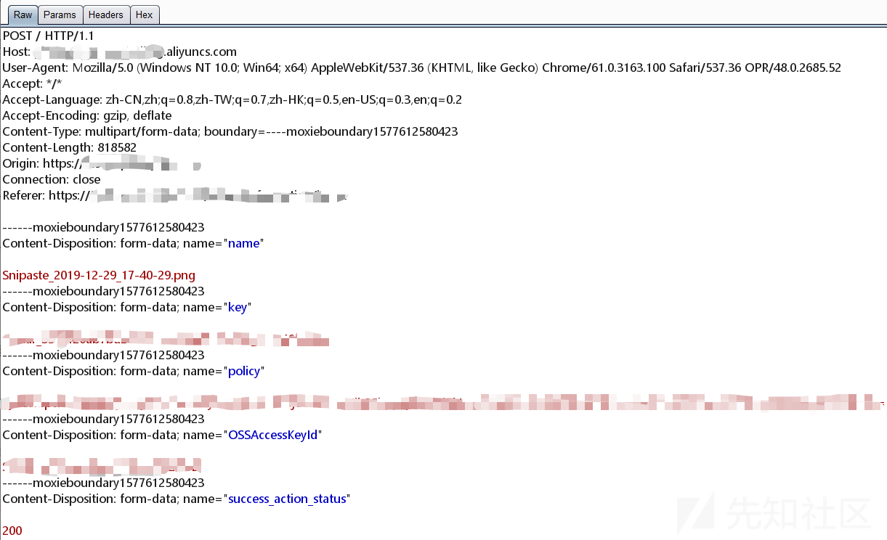](https://xzfile.aliyuncs.com/media/upload/picture/20191229200331-3b5865ae-2a33-1.png)

图片上传成功后，界面会弹出裁剪图片：

[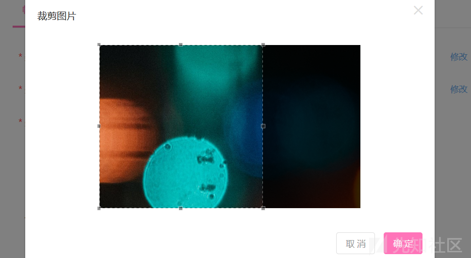](https://xzfile.aliyuncs.com/media/upload/picture/20191229200402-4dfbe122-2a33-1.png)

点击确定，裁剪的接口数据包如下：

[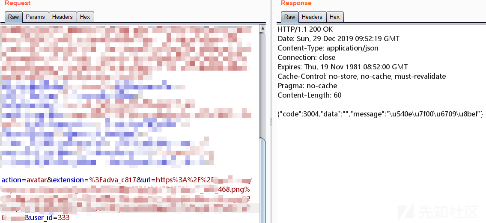](https://xzfile.aliyuncs.com/media/upload/picture/20191229200535-850adea2-2a33-1.png)

该接口四个参数，url参数是阿里云OSS返回的图片url地址。

该url参数未进行校验地址是否合法，故url参数我们可以随意构造。所以很显然，该url参数也存在ssrf。

除了ssrf，url参数我们也可使用file协议构造（原理是源码中使用了copy()函数，后面贴源码我会进行介绍）。

将url参数构造出`file:///etc/passwd`，user\_id用base64编码一下。响应包中，会直接返回裁剪后（保存在本地）的url地址，如下图所示：

[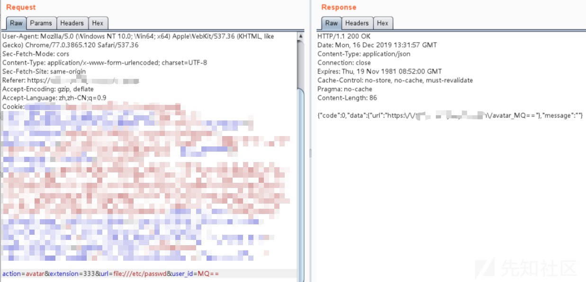](https://xzfile.aliyuncs.com/media/upload/picture/20191229200603-95b4941e-2a33-1.png)

然后直接访问响应中的url地址:`http:///www.xxx.com/avatar_MQ==`,该文件内容就是`etc/passwd`的内容：

[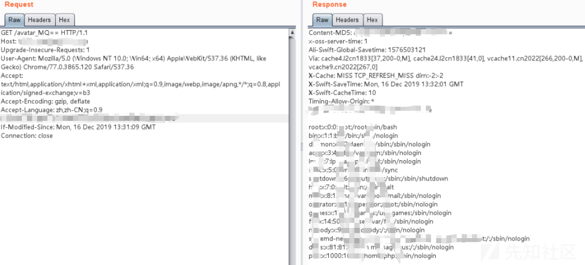](https://xzfile.aliyuncs.com/media/upload/picture/20191229200637-aa6a5cd6-2a33-1.png)

##### （2）代码审计

由于系统中某些功能报错，页面直接返回了代码的绝对路径，所以我们直接可以读取该上传接口控制器的源代码：

[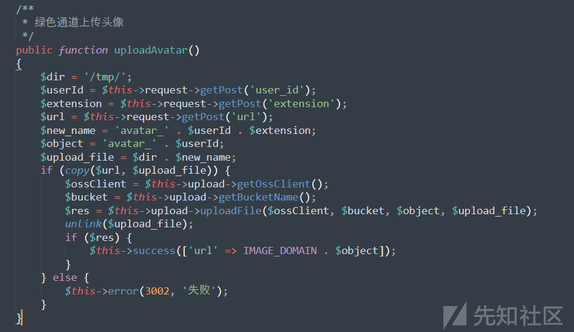](https://xzfile.aliyuncs.com/media/upload/picture/20191229200700-b80202a4-2a33-1.png)

可以看到请求包中的参数（`extension、url、user_id`）都没有进行校验。可以看到代码中使用了`copy()`函数，php 的 copy 函数可访问 `file:///`等协议，然后在某个地点回显出文件内容。

> 例如`copy(source,destination)`,就是将文件从 *source* 拷贝到 *destination*。如果成功则返回 TRUE，否则返回 FALSE。

而传入`copy()`中的两个参数都没有进行校验。copy结束后返回url地址。

copy函数的第二个参数，是由`'$dir'`和`'$new_name'`拼接的，而$new*name参数是由\`'avatar*'`、`'$userId'`和`'$extension'\`拼接而成的。

所以我们可以自己写一个控制器，里面包含shell的代码，然后copy到控制器根目录，这样就可以getshell了。

##### （3）getshell

首先，根据我们下载的控制器代码，自己写一个控制器(目的是执行test函数，打印"avatar")：

```plain
# 代码结构跟前面file协议读取的控制器代码一样，就自己写了个test()方法
<?php
namespace app\controller;
use My;
use my\api\Controller;

class MyevalController extends BaseController
{

    private $inviteService = false;
    private $commonHelper = false;

    public function __construct()
    {
        parent::__construct();

    }
    public function test()
    {
        exit("avatar");
    }
}
```

将编写的控制器脚本上传到我们自己的服务器上，随后构造extension参数：

前文源码中我们已经知道copy函数的第二个参数(`$upload_file`)，结构为：

`$dir + 'avatar_' + $userId + $extension`

源码中`$dir`的值为'/tmp/'，若请求包中的user\_id参数为345，extension参数为789，则`$upload_file`参数的值为：

`/tmp/avatar_345789`。

那我们构造user\_id参数为345，extension参数为：`/../../data/www/xx/controller/MyTestController.php`，如下图所示（当然，user\_id参数也没有校验，我们也可以把构造的内容放在user\_id后面）：

[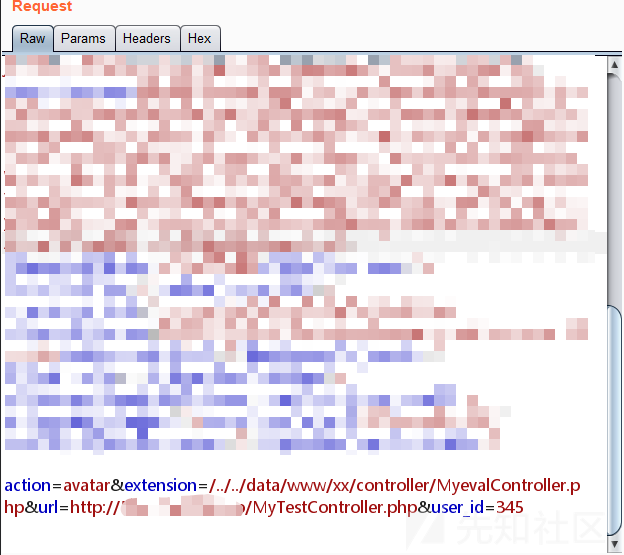](https://xzfile.aliyuncs.com/media/upload/picture/20191229200729-c93639d2-2a33-1.png)

则`$upload_file`参数就是这样的：

`/tmp/avatar_345/../../data/www/xx/controller/MyTestController.php`

这个upload\_file参数的路径就有意思了，copy函数执行的时候，先将我们的MyTestController.php拷贝到`/tmp/avatar_345/`目录，然后执行`/../../`，返回两个上级目录，又回到了当前目录，然后再进入到`/data/www/xx/controller/`目录下。所以最终我们的控制器就直接拷贝在了`/data/www/xx/controller/`下。

有点类似linux里面的这种（两个`/../`执行，又回到当前目录）：

[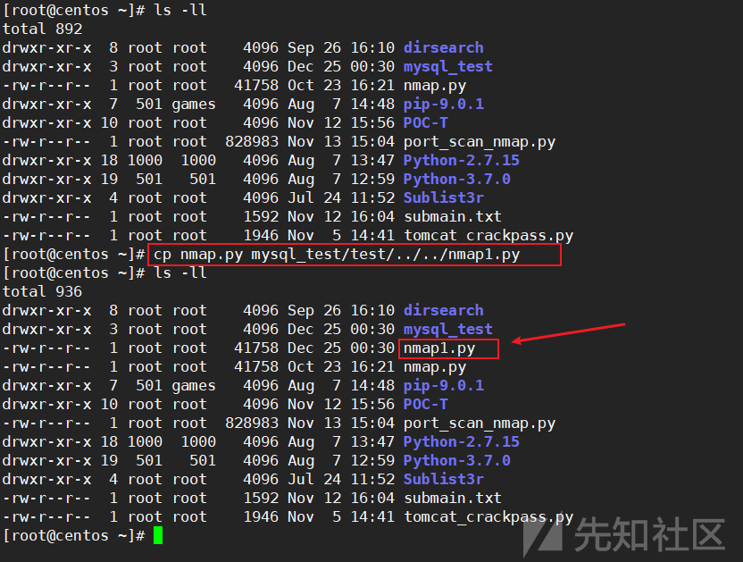](https://xzfile.aliyuncs.com/media/upload/picture/20191229200749-d530a0ba-2a33-1.png)

所以我们直接浏览器访问我们的控制器：

`http://www.xxxx.com/MyTestController/test`

执行test方法，页面上打印"avatar"。

故如何getshell，也就很简单了。

#### 0x02 漏洞接口2-漏洞详情

第二个接口跟第一个接口原理一样，不同的是，接口2的代码中先对url进行了校验，然后直接调用了接口1的uploadAvatar代码：

[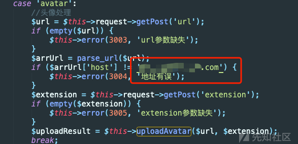](https://xzfile.aliyuncs.com/media/upload/picture/20191229200808-e08dfa48-2a33-1.png)

判断了url的host是否为`www.xxxx.com`，如果不是的就直接返回“地址有误”。

绕过该限制的方法是：我们直接在上传头像到阿里云OSS处，就把我们的控制器放在图片内容里（该上传接口未对图片内容进行校验）：

[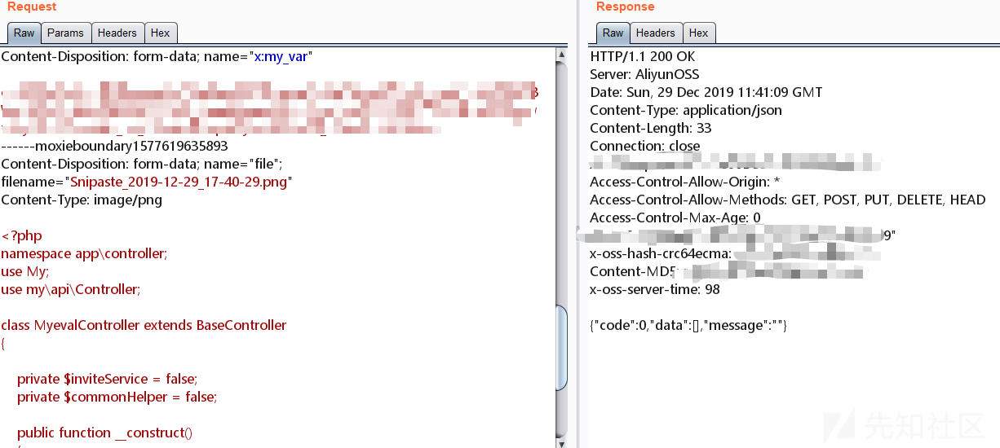](https://xzfile.aliyuncs.com/media/upload/picture/20191229200822-e8cd703a-2a33-1.png)

访问阿里云OSS返回的图片地址，可以看到图片内容是我们控制器的代码：

[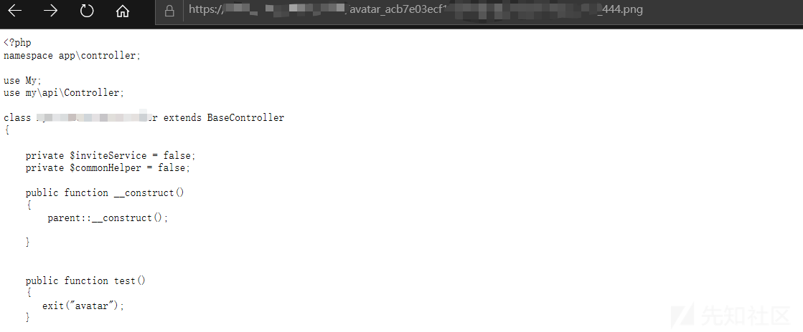](https://xzfile.aliyuncs.com/media/upload/picture/20191229200841-f3d197e0-2a33-1.png)

其他的就跟第一个接口一样，将url参数构造为阿里云OSS返回的包含我们控制器代码地址，extension参数也是一样，给定控制器的目录。

故拿到shell也是轻而易举了（很显然，这个方法同样可以在漏洞接口1中利用）。

#### 0x03 漏洞修复

在复现和分析完这两个漏洞后，让开发严格限制了：

-   user\_id只能为数字，不能包含字母和特殊字符；
-   extension参数严格过滤点号、斜线等可能造成跨目录访问的字符；
-   url参数严格过滤只能http协议、校验url的host白名单、校验图片内容；
