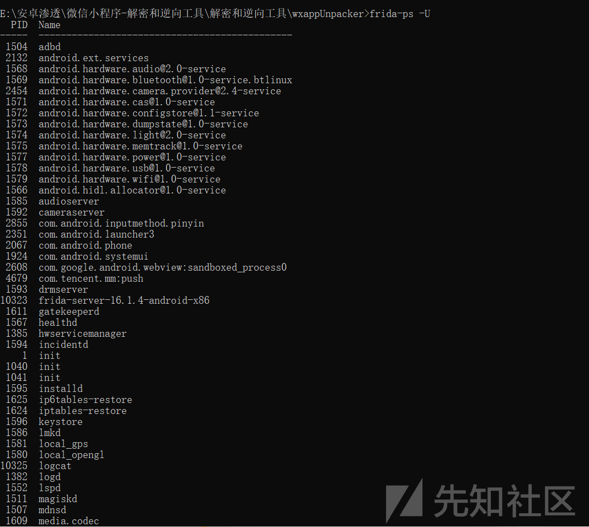

# 渗透测试之App与小程序工具总结 - 先知社区

渗透测试之App与小程序工具总结

- - -

# Burpsuite抓包问题

由于如今的应用已经逐渐对安卓应用的版本都在提高，有部分应用已经只兼容来安卓9了，不兼容安卓7，因此刚开始的时候可能会发现模拟器能抓到浏览器的包，但是抓不到App包的情况。这是因为安卓7以上默认已经不信任用户安装的证书了，因此需要使用adb将证书导入系统进行安装，以夜神模拟器安卓9为例。

1.  首先从burpsuite中生成证书，保存。

[](https://xzfile.aliyuncs.com/media/upload/picture/20240119210016-b11cce56-b6ca-1.png)

1.  导出的证书是DER格式的，需要转成PEM格式的证书，可以使用kali自带的openssl直接进行转换，并计算证书的MD5的值，并将证书命名为MD5的值。

```plain
openssl x509 -inform DER -in cacert.der -out cacert.pem
openssl x509 -inform PEM -subject_hash_old -in cacert.pem
```

[](https://xzfile.aliyuncs.com/media/upload/picture/20240119210021-b43d917e-b6ca-1.png)

1.  找到夜神模拟器的bin目录，使用adb.exe输入以下命令上传证书

```plain
adb.exe devices  查看运行中的设备
adb.exe push 9a5ba575.0 /sdcard/   将证书推入到sdcard中
adb.exe shell  进入shell交互模式
mount -o remount,rw /system  重新挂载写入system
cp /sdcard/9a5ba575.0 /system/etc/security/cacerts/  将证书复制到系统安全目录
chmod 644 /system/etc/security/cacerts/9a5ba575.0  赋予证书读写权限
reboot  重启
```

[](https://xzfile.aliyuncs.com/media/upload/picture/20240119210031-ba4026e0-b6ca-1.png)

1.  burpsuite开启监听，并设置代理服务器，这里本机的ip地址为192.168.1.101。

[](https://xzfile.aliyuncs.com/media/upload/picture/20240119210036-bcc363e6-b6ca-1.png)

[](https://xzfile.aliyuncs.com/media/upload/picture/20240119210040-bf24ec2c-b6ca-1.png)

1.  抓包成功

[](https://xzfile.aliyuncs.com/media/upload/picture/20240119210045-c274c870-b6ca-1.png)

# LPosed+JustTrustMe 绕过 SSL Pining

以上方式是最简单进行抓包的方式，假如对方服务器启用了SSL Pinning机制，那么可能依旧会无法捕捉到包，因为当我们使用抓包工具抓包时，抓包工具在拦截了服务端返回的内容并重新发给客户端的时候使用证书不是服务器端原来的证书，而是抓包工具自己的，抓包工具原来的证书并不是APP开发者设定的服务端原本的证书，于是就构成了中间人攻击，触发SSL Pinning机制导致链接中断，所以我们无法直接抓到包，这里使用低于安卓7版本的手机可能会没问题，但是App不一定兼容，因此要其它解决办法，可以使用Lposed即以Xposed为基础的框架进行绕过，以下是详细步骤。

1.  安装Magisk，这里我安装的是Magisk-delta 25.2版本，下载地址如下：

[Magisk](https://github.com/topjohnwu/Magisk/releases "Magisk")

下载好后，直接将Magisk拖入夜神模拟器中，点击本地安装，在线安装需要翻墙才可以。

[](https://xzfile.aliyuncs.com/media/upload/picture/20240119210051-c6301c12-b6ca-1.png)

[](https://xzfile.aliyuncs.com/media/upload/picture/20240119210056-c8b811ec-b6ca-1.png)

[](https://xzfile.aliyuncs.com/media/upload/picture/20240119210100-cb3cb54e-b6ca-1.png)

点击安装，安装完成后，会ti's提示需要重启，这里先不进行重启，先将夜神模拟器设置的root权限关闭，关闭重启，即可将Magisk安装完成。

[](https://xzfile.aliyuncs.com/media/upload/picture/20240119210108-cfec1d78-b6ca-1.png)

安装完成后，打开Magisk，点击右上角的设置，允许Zygisk运行即可。

[](https://xzfile.aliyuncs.com/media/upload/picture/20240119210112-d2201d88-b6ca-1.png)

1.  安装Lposed框架，我下载的是zygisk版本的，下载地址如下：

[Lposed](https://github.com/LSPosed/LSPosed/releases "Lposed")

直接将下载好的zip压缩包拖入到夜神模拟器中，然后打开Magisk，选择模块，本地安装，然后选中Lposed的安装包，加载完成后，重启。

[](https://xzfile.aliyuncs.com/media/upload/picture/20240119210117-d59bcbc4-b6ca-1.png)

1.  重启之后，进入/data/adb/lspd 目录，出现manager.apk包，点中，选择安装。

[](https://xzfile.aliyuncs.com/media/upload/picture/20240119210121-d7df17f6-b6ca-1.png)

1.  如果出现了解析包出现错误，哪就直接从Lposed框架中解压出manager.apk,直接拖入模拟器中即可成功。

[](https://xzfile.aliyuncs.com/media/upload/picture/20240119210126-da8dd726-b6ca-1.png)

1.  能够打开，即安装成功。

[](https://xzfile.aliyuncs.com/media/upload/picture/20240119210129-dcadcf66-b6ca-1.png)

1.  下载JustTrustMe模块，拖入到夜神模拟器中，在Lposed的模块中启用即可成功绕过SSL Pining进行抓包。

# 小程序的反编译

在对小程序进行渗透时，一般除了测试小程序的功能点之外，最好的方式就是将小程序反编译，查看一下源码，特别是当小程序每一个数据包都会将小程序提交给后端的数据进行签名一并提交的时候，就不得不反编译小程序查找签名的算法来进行伪造数据，相当于前端的js进行了加密一样。

1.  首先，当你运行了小程序，并且使用了各小程序的功能的时候，小程序的打包文件其实就存储在了你的手机存储当中，文件后缀为wxapkg，只不过存在主包和分包的区别，比如我的夜神模拟器的存储目录就是/data/data/com.tencent.mm/MicroMsg/e594472a09487567540796a08a51a24f/appbrand/pkg中，中间很长那段e594472a09487567540796a08a51a24f可能为有所变化。

[](https://xzfile.aliyuncs.com/media/upload/picture/20240119210147-e70676b6-b6ca-1.png)

1.  将这些生成的打包全部删除，重新访问一个小程序，把它的所有页面都走一遍，就会发现有新出现的几个wxapkg包，这几个包就是小程序的包，进行解包即可，解包使用wxappUnpacker进行解包，需要node.js环境。

```plain
npm install
npm install esprima
npm install css-tree
npm install cssbeautify
npm install vm2
npm install uglify-es
npm install js-beautify
```

1.  首先使用UnpackMiniApp(小程序包解密).exe查看一下小程序是否被加密。

[](https://xzfile.aliyuncs.com/media/upload/picture/20240119210152-ea5e304c-b6ca-1.png)

1.  然后使用wuWxapkg.js对小程序的主包进行解包，如果解包出现错误，可能这个包不是主包导致的，当然经常会报错，但是也会有小程序的代码出来，可以自己判断是否找到自己想要的。

[](https://xzfile.aliyuncs.com/media/upload/picture/20240119210156-eca3f576-b6ca-1.png)

1.  虽然这里我也报错，但是反编译出来的小程序还算是完整的。

[](https://xzfile.aliyuncs.com/media/upload/picture/20240119210200-eef43700-b6ca-1.png)

# APP脱壳，反射大师、frida

App也一样，App如果逆向出来java代码就不说了，这个可以上网搜，也可以看我之前的文章，重点是现在市面上的APP都会进行混淆和加壳操作，一般都是加上诸如腾讯安全、阿里安全等壳，会把很多代码信息都给隐藏掉，影响人的正常查看，因此需要把这个壳给脱掉，观看到没加壳之前的App正常的Java代码。

这里关于App的扫描和反编译，也有一个不错的平台可以直接使用，自己也经常用来进行反编译，至于它的漏洞扫描，其实没有太大的作用，但是它会把Activity、SERVICES、provides以及代码等各种都列出来，并且会对一下permission的配置、XML的配置等进行检查，列出危险程度，也比较不错。

地址如下：

[APP扫描](https://github.com/MobSF/Mobile-Security-Framework-MobSF "APP扫描")

[](https://xzfile.aliyuncs.com/media/upload/picture/20240119210206-f272b938-b6ca-1.png)

## 反射大师

1.  首先可以使用检测壳的工具检测是否加壳了，诸如AppMessage等等工具。

[](https://xzfile.aliyuncs.com/media/upload/picture/20240119210211-f59966fc-b6ca-1.png)

1.  下面提供两种方式进行直接脱壳，首先是反射大师，反射大师在安卓9已经不支持了，安卓7安装XPosed框架以及反射大师后依旧可以使用，这里以夜神模拟器安卓7版本进行演示。

首先直接在游戏中心中搜索Xposed即可进行安装下载，安装后进行重启即可成功，点击启动即可，Xposed的作者已经不进去维护了，因为不会再进行更新。

[](https://xzfile.aliyuncs.com/media/upload/picture/20240119210216-f84c6c14-b6ca-1.png)

[](https://xzfile.aliyuncs.com/media/upload/picture/20240119210219-fa5cbaf4-b6ca-1.png)

然后去网上找反射大师的apk文件，到处都有，至于官网在哪，自己也不知道，注意不要有后门即可，拖入APK中，打开反射大师，即会提示未激活模块，进入Xposed进行激活即可。

[](https://xzfile.aliyuncs.com/media/upload/picture/20240119210227-ff2a5d98-b6ca-1.png)

随后打开反射大师，选中应用，选择打开，会有五角星，把每个页面都跑一遍，会有很多代码的acivity都出来，选择进行保存即可。

[](https://xzfile.aliyuncs.com/media/upload/picture/20240119210231-01ce6fda-b6cb-1.png)

点击五角星，最上方可以选择对应的activity启动器，点击当前Activity，写出Dex，再使用正常的反编译工具反编译成jar包后使用jd-gui打开即可。

[](https://xzfile.aliyuncs.com/media/upload/picture/20240119210236-04b6d250-b6cb-1.png)

## Frida

反射大师不支持安卓9了，意味着假如应用不兼容安卓7就无法使用了，但是frida是个不错的解决方案。

1.  首先需要下载frida-server以及frida-dexdump工具。

frida-dexdump可以直接使用python进行下载，或者去github上下载：

```plain
pip3 install frida-dexdump
pip install frida-tools
pip install frida
```

随后查看安装的frida版本，我这里是16.1.4，然后再查看对应安卓模拟器的处理器版本，进而去github下载对应的安卓服务器

[](https://xzfile.aliyuncs.com/media/upload/picture/20240119210301-137d49fe-b6cb-1.png)

[](https://xzfile.aliyuncs.com/media/upload/picture/20240119210310-18994e1a-b6cb-1.png)

[frida-server](https://github.com/frida/frida/releases "frida-server")

[](https://xzfile.aliyuncs.com/media/upload/picture/20240119210314-1b68c436-b6cb-1.png)

再利用adbshell将下载的frida拖入到夜神模拟器中，没报错即可运行成功。

```plain
adb.exe push frida-portal-16.1.4-android-x86_64.xz  /data/local/tmp
adb.exe shell
cd /data/local/tmp
chmod 755 frida-portal-16.1.4-android-x86_64.xz
./frida-portal-16.1.4-android-x86_64.xz
```

[](https://xzfile.aliyuncs.com/media/upload/picture/20240119210320-1e6c60d4-b6cb-1.png)

随后在Windows中运行frida-hexdump命令即可查看到安卓模拟器正在运行的程序。

[](https://xzfile.aliyuncs.com/media/upload/picture/20240119210323-20b5df6e-b6cb-1.png)

可以通过以下命令直接反编译出转储正在运行的应用程序或通过命令指定某个包。

```plain
frida-dexdump -FU
frida-dexdump -U -f com.app.pkgname
```

[](https://xzfile.aliyuncs.com/media/upload/picture/20240119210329-23ecc17a-b6cb-1.png)

# 总结

当然了，关于移动端的东西肯定不止这么点，以后遇到了再学习到了，再补上吧，毕竟版本更替引起的话题是一个永恒不变的话题
