# 牙刷牙线冲牙器，怎么用才是正确的口腔保健？ - 少数派

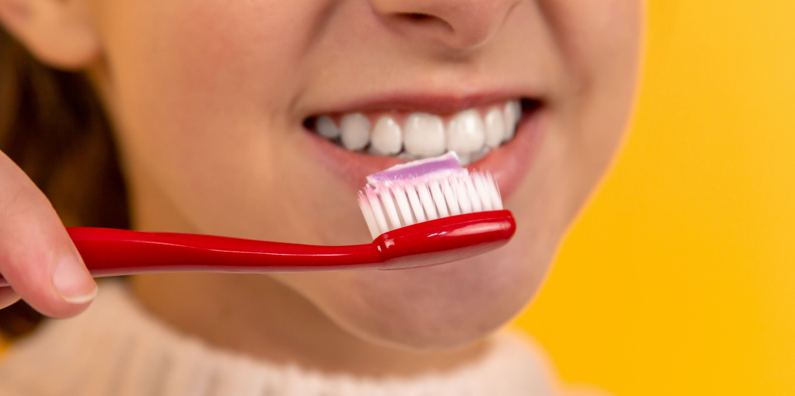

牙刷牙线冲牙器，怎么用才是正确的口腔保健？

[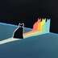](https://sspai.com/u/7w2qer6m/updates)

[EurekaLab](https://sspai.com/u/7w2qer6m/updates)

21 小时前

前段时间，在翻阅我最喜欢的「美食博主」苏东坡的《东坡集》时，看到了这样的一段：每食已，辄以浓茶漱口，烦腻即去……缘此渐坚密，蠹病自已。这不就是古代的口腔健康科普吗？古代人通过观察生活中的细节，总结经验，虽然简单，却蕴含着朴实的智慧。

反观现在，随着生活水平的升高，人们对健康的关注也越来越高。但同时也出现了一种过度依赖商业化产品的趋势。市场上充斥着各种口腔保健产品，从普通牙刷到高科技电动牙刷，从漱口水到「包治百病」的牙膏。这些产品的广告无处不在，宣传的效果也越来越强。好像只要用了这些产品，就能够远离口腔疾病了。

我一直坚持一种由「理」（原理）到「法」（方法）的理念，如果你掌握了原理，其实方法是非常灵活的，你不必纠结于某些工具和方法的优劣，只要能够达到同样的效果，那么选择各方面最适合你的就行。所以我想写一篇关于口腔保健和清洁的文章，来具体谈谈其原理、方法以及误区。

在口腔保健这个问题上，我们需要先明白清洁和保护的究竟是什么，然后再去探究用什么样的方法和工具去进行。

在这篇文章中，我想主要解决三个问题：

-   我们的「敌人」是谁？
-   我们的「战场」在哪里？
-   我们的「战术和武器」应该如何选择？

## 我们的敌人——牙菌斑

### 牙齿的组织结构

为了更好的理解接下来说的一些内容，我先简单介绍下牙齿及牙周组织的一些名词。

#### 牙齿

我们的牙齿主要分为牙冠和牙根两个部分，牙冠位于口腔内，一般来说，我们能够看到的牙齿部分都是牙冠。而牙根位于牙龈和骨头内，起到固位和支撑的作用。牙冠又分为 5 个面，靠近嘴唇和面颊的我们称之为**唇 / 颊面**（外），靠近舌头的是**舌面**（内），咬合接触的称之为**𬌗面**（顶），两侧和其他牙齿相邻的是**邻面**。

#### 牙周组织

牙根的绝大部分是位于骨头内的，这部分骨头我们称之为牙槽骨。包裹覆盖在牙槽骨和部分牙齿表面的，粉红色质韧的组织我们称之为牙龈。而牙槽骨、牙龈和牙齿之间有一层薄膜，起到连接、营养和缓冲的作用，这层薄膜就称之为牙周膜。牙槽骨、牙周膜、牙龈被统称为牙周组织。

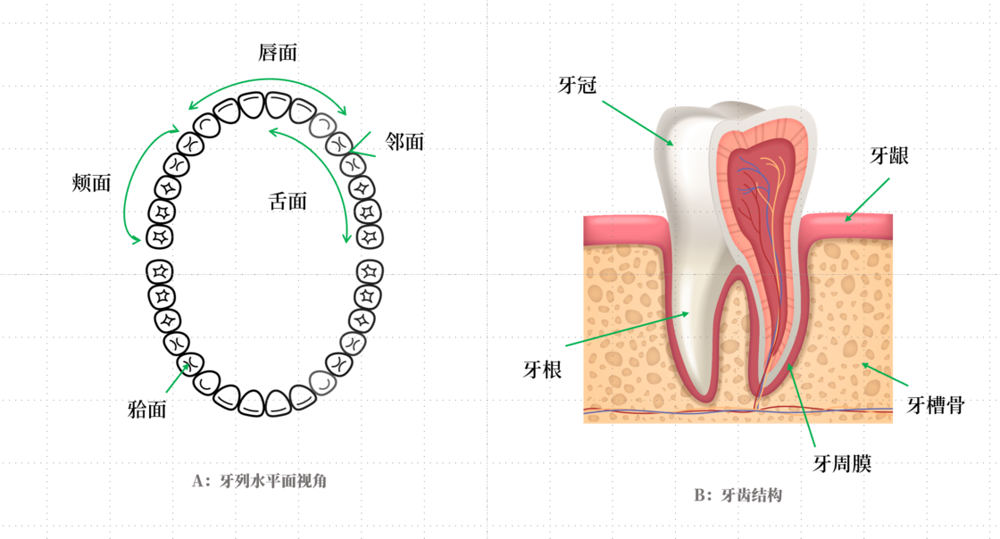

牙齿结构示意图

### 口腔的防御体系

口腔自身其实有一套非常完整的防御体系。

不知道大家有没有观察过，其实我们口腔内部的大部分区域都是由非常光滑的黏膜（粉红色的湿润组织）构成的。它类似于皮肤，是我们口腔的第一道防线。在没有破损的情况下，它能够直接抵御致病微生物（主要是细菌）的入侵。同时，其光滑的表面能够最大程度的减少食物残渣的堆积和黏附，断绝细菌的生存补给。

除了物理屏障外，唾液也在其中扮演重要角色。它含有多种抗菌成分，如免疫球蛋白 A（IgA）、溶菌酶和乳铁蛋白等，这些成分可以抑制或破坏微生物。唾液还具有缓冲作用，帮助维持口腔中的 pH 值，防止酸性环境的形成，这是抑制细菌生长的关键因素。并且，唾液的流动性有助于清洁口腔，冲走食物残渣和微生物。

除此之外，口腔内的正常细菌可以通过竞争性排斥来抑制病原体的生长。同时，口腔粘膜下含有免疫细胞，是免疫系统的一部分，一旦有致病微生物入侵，它们能迅速响应。

由此可见，对于细菌来说，口腔内的生存条件是非常恶劣的，它们有两个亟待解决的问题：

-   要怎么才能够活下去？
-   要怎么搞破坏？

而第二个问题，本质上就是第一个问题。

于是，这些致病菌们就聚集在了一起，展开了一场头脑风暴。其中一些聪明菌们七嘴八舌道：

> 「要不我们组织个联盟军？」
> 
> 「派先锋军建立几个前哨基地。」
> 
> 「再大军出动。」
> 
> 「大家分工合作，各司其职。」
> 
> 「做大做强，再创辉煌。」

牙菌斑，应运而生。

### 牙菌斑

#### 形成

牙齿虽然是人身体内最坚硬的器官，却是口腔致病菌眼中的弱点所在。

最开始，一些细菌（如链球菌属中的初生菌，特别是变形链球菌）通过利用唾液和食物残渣中的一些蛋白质，黏附到牙齿的表面。这些「先锋菌」一旦在牙齿表面立稳脚跟，就开始产生胞外多糖。这种多糖，不仅可以帮助更多种类的细菌黏附在固体和其他细胞的表面，还能够为微生提供额外的保护。在某些情况下，胞外多糖甚至可以作为能量和碳的储备，供微生物在营养匮乏时使用。

在此基础上，第二批细菌（包括牙龈卟啉菌、放线菌和粪链球菌等）开始在牙齿表面形成更复杂的结构。随着时间的推移，这个结构变得更加多层和复杂。在这个阶段，不同的细菌群体通过物理和化学信号进行交流，调整他们的代谢以适应环境。最终，形成一个成熟稳定的结构——牙菌斑。

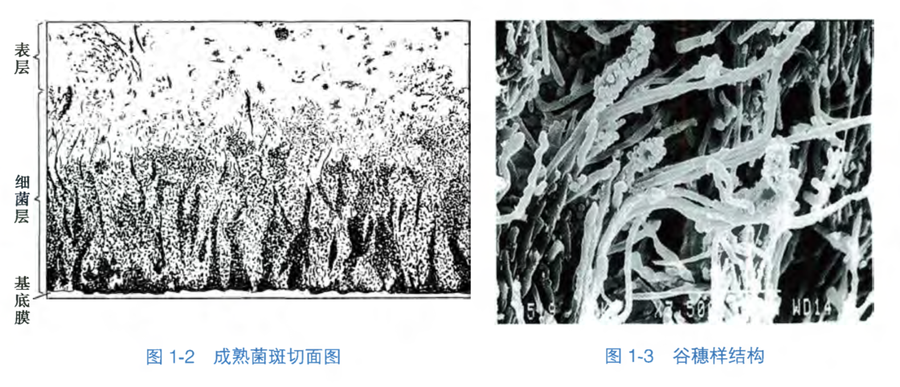

牙菌斑结构图 - 《口腔生物学》第 5 版 人民卫生出版社

牙菌斑就像是一个先锋营地，一旦形成，我们的身体就很难依靠自身的力量去清除了。

为什么牙菌斑大多黏附在牙齿表面和牙龈交界处，而不太可能在粘膜上堆积？

-   表面特性不同：口腔粘膜的表面特性与牙齿表面大不相同。牙齿提供了一个硬且相对平滑的表面，这有助于牙菌斑的形成。而粘膜表面较为柔软，不利于牙菌斑的紧密附着。
-   持续的细胞更新：口腔粘膜细胞持续更新和脱落，这有助于防止细菌在其表面上稳定生长和形成牙菌斑。

#### 危害

如果牙菌斑没有及时清除，它会继续发展并导致各种各样的口腔问题。

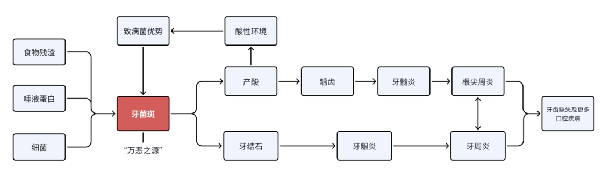

**产酸的恶性循环**

首先，在缺氧的条件下（例如在紧密的牙菌斑中），一些细菌，可以通过分解代谢食物残渣中的糖类，产生各种酸性物质。这些酸在牙菌斑中积累，逐渐降低牙齿表面的 pH 值。当 pH 值降至临界点以下时，牙齿的矿物质（如磷酸钙）开始溶解，这个过程被称为脱矿。持续的酸性攻击会破坏坚硬的牙齿结构，最终形成龋齿（蛀牙）。

同时，酸性环境通常不利于某些益生菌的生存，从而破坏口腔微生物的平衡。而对一些产酸细菌（如变形链球菌）的生长有利，这些细菌通常都是致病的细菌。它们又能进一步产酸并降低口腔环境的 pH 值，形成恶性循环。

牙结石的存在使得日常的口腔清洁更加困难，为口腔细菌提供了理想的栖息地。致病菌们会进一步释放有害物质，导致牙周组织的炎症（包括牙龈及支撑牙齿的骨组织），也就是我们常说的牙龈炎和牙周炎。

**「万恶之源」**

根据最新的流行病学统计，约 62% 的成年人患有牙周炎，其中 23.6% 的人病情严重。至于龋齿，没有蛀过牙的人才是凤毛麟角吧。龋齿可以进一步发展为牙髓炎，牙髓炎又可以进一步发展为根尖周的炎症，和牙周炎相互作用，导致各种形式的牙齿疼痛和松动。如果不经治疗，就会导致牙齿的缺失，颌骨囊肿，间隙感染等更为严重的疾病，必要的时候甚至需要手术干预。

如果排除先天性的、外力导致的（骨折等）以及颌面外科的部分疾病（以颌面部的肿瘤为主），口腔的绝大部分疾病最终都可以追溯到牙菌斑（buff 叠满了）。基本上可以将牙菌斑称之为口腔疾病的「万恶之源」了。

**因此，目前我们的口腔保健手段，基本都是以清除牙菌斑作为首要目的的。**

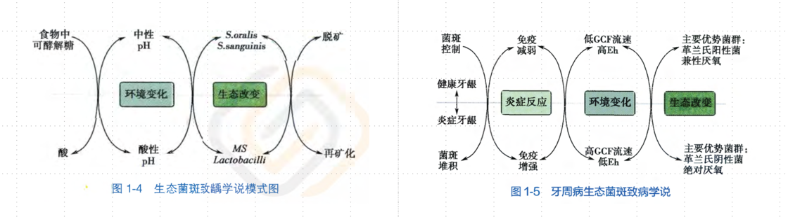

牙菌斑致病模式图 - 《口腔生物学》第 5 版 人民卫生出版社

## 我们的战场——牙齿的弱点

牙齿自身、牙齿和牙齿之间、牙齿和牙周组织之间，会有一些天然的间隙，这些间隙就比较容易积聚食物残渣和牙菌斑。

### 𬌗面的沟裂

我们的牙齿表面会有一些天然的凹凸，这些凹凸构成了牙尖、隆突、窝沟等。它们大多位于牙齿的𬌗面，这样的结构有助于切削食物，增加咀嚼效率。但同时，这些窝沟也是食物残渣和牙菌斑天然的庇护所。

家里有孩子的朋友们近几年可能都听说过一个叫「窝沟封闭」的预防措施。小朋友刚换的新牙齿，部分窝沟比较深，再加上清洁不到位，很容易聚积牙菌斑，导致龋坏（烂牙）。这个措施就是预防性的将这些较深的窝沟填补起来，减少了食物残渣和牙菌斑聚集的机会，从而预防龋齿的发生。所以，如果你的牙齿已经龋坏，再进行窝沟封闭是没有意义的。

### 邻面（牙间隙）

牙间隙指的是两枚牙齿邻面之间的空隙。正常情况下，牙齿的邻面应该是紧密连接的，牙齿和牙齿相邻的接触区域称之为接触区，接触区下方的三角区域称之为间隙三角，间隙三角通常由牙龈乳头覆盖。这种天然的结构有助于维持牙列的稳定，但也给了牙菌斑可乘之机。由于这个区域（牙间隙）很难清洁到，所以即使是在接触区连接紧密的情况下，其下方的间隙也比较容易堆积食物残渣和牙菌斑。

我们常说的「牙缝大」「容易塞牙」，实际上指的是接触区由于各种原因连接不再紧密，食物自然容易卡压、填塞在接触区及下方的间隙三角内。如果没有能够及时清洁，填塞的食物会压迫牙龈乳头，导致牙缝的进一步扩大（实际是原本长在间隙三角内的牙龈退缩了）。

### 牙龈和牙齿的交界处

牙龈与牙齿接触的地方也有一个天然的间隙，我们称之为龈沟。正常情况下，牙龈通过牙周膜与牙齿连接紧密，龈沟深度较浅，牙菌斑堆积有限，相对容易清洁。如果我们没有能够及时清洁，牙菌斑中的细菌就会进一步破坏牙周膜，导致牙龈和牙齿组织的分离，龈沟变深。

深的龈沟更容易堆积牙菌斑，也更难以清洁。深的龈沟也更容易形成无氧的环境，有利于有害的细菌生存。所以，牙石通常都堆积在牙龈交界处。同时，由于牙周膜被破坏，细菌向下侵袭的屏障消失，通道打开，就可以进一步侵犯牙槽骨，导致更加严重的牙周病。

如果你能够将这些重点位置的清洁都做到位，那么基本可以远离绝大部分牙齿和牙周问题。

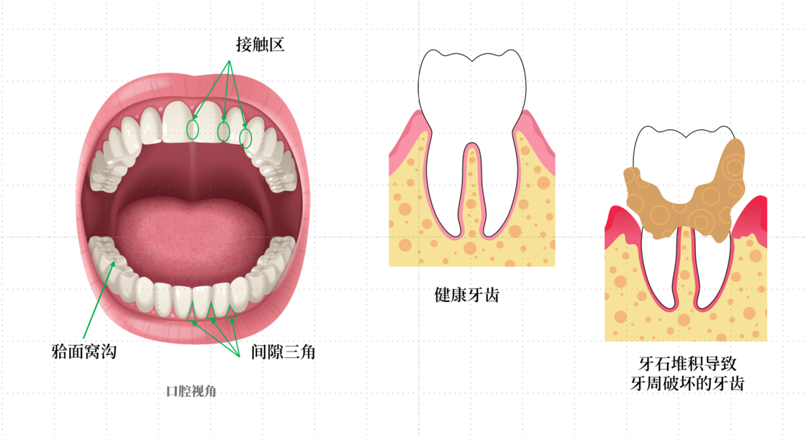

## 我们的武器——口腔保健方法

上文已经介绍了口腔保健的主要目的就是清除牙菌斑，也介绍了牙菌斑聚集的三个「重灾区」，接着就是选择合适的工具和使用正确的方法将它们「一网打尽」了。

### 广义的刷牙

#### 为什么光使用牙刷是不够的

刷牙大家应该并不陌生，一般指的是使用牙刷和牙膏将牙齿清洁干净。但我认为广义的刷牙应该是使用正确的清理方式将口腔清洁干净。

这里的区别就在于「使用牙刷牙膏」上。由上文可知，我们口腔有三个重点清洁区域，传统牙刷的结构非常适合清洁𬌗面以及牙龈交界处，但对邻面就无能为力了。由于牙龈乳头的阻挡，它无法进入邻面的间隙三角，并进行有效的清洁。所以，单单使用牙刷是不够的。

牙线、牙间隙刷、冲牙器，就是为了更好地清洁牙间隙而设计出来的。牙线本身较细，可以直接通过接触区，清洁其下方的区域。间隙刷是特制的小头牙刷，并且刷头可以自由弯曲，方便进入牙间隙进行清洁。冲牙器是使用高压的细水流冲击的方式，来对间隙内部进行清洁。

#### 该如何选择合适的工具

我将口腔的清洁工具分为 A 类和 B 类。A 类工具包括牙刷+牙膏、电动牙刷+牙膏、正畸牙刷+牙膏，主要负责口腔内大部分区域的清洁。B 类工具包括牙线、牙间隙刷、冲牙器，主要负责牙刷清洁不到的区域。

在日常的口腔清洁中，我们应该组合使用 A 类和 B 类工具进行口腔清洁。**普通牙刷+牙膏+牙线**是适用于绝大多数普通人的工具组合。

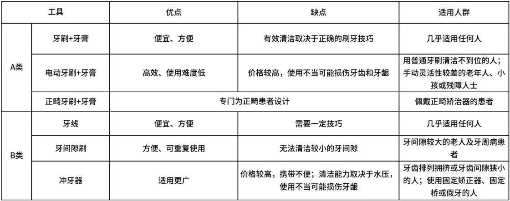

A 类工具应该尽量选择软毛的产品，因为我们不光要对牙面进行清洁，同时还要清洁牙齿和牙龈交界处。过硬的刷毛会刺激牙龈，同时也有可能会造成牙齿不同程度的磨耗。

B 类工具中，牙线应该尽量选择扁线的产品，相对于细线的产品来说有更大的清洁面积。因为我们除了要清除间隙内的食物残渣外，还需要通过机械摩擦的方式来清洁附着在牙齿邻面上的牙菌斑（具体使用方法可以见下一小节）。

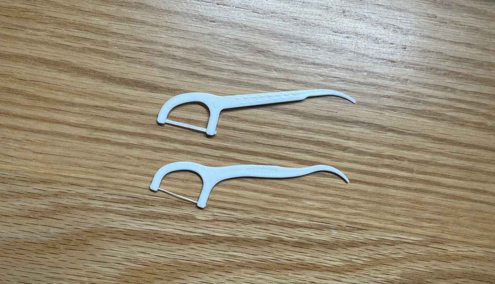

上方为扁线，下方为细线

牙间隙刷更加适合老年人或者牙周炎的患者。这类人群因为生理或病理的改变，牙间隙会比正常人大很多，方便牙间隙刷的进入。冲牙器相较于前两者要更加灵活一些，甚至可以清洁某些牙线可能都无法到达的区域（牙齿拥挤或错位、部分佩戴假牙和正畸矫治器的患者）。但较低的水压无法有效清洁牙菌斑，较大的水压又容易损伤牙龈，需要一定的使用门槛。

#### 正确的刷牙方法

根据[中华口腔医学会（中国口腔医生的官方组织）官网](https://sspai.com/link?target=http%3A%2F%2Fwww.cndent.com%2Fbooksoforal)的科普内容：

-   成人推荐使用水平颤动拂刷法
-   儿童推荐使用圆弧刷牙法
-   使用牙线、牙间隙刷、冲牙器清洁牙间隙

**成人：水平颤动拂刷法**

1.  刷牙齿唇、颊面和后牙舌面：牙刷的刷毛应朝向牙根方向，与牙齿侧面成 45° 角。刷上牙时，牙刷朝上；刷下牙时，牙刷朝下。轻轻加压，使刷毛部分进入牙齿和牙龈的缝隙中，在 2 至 3 颗牙的范围内进行水平短距离颤动至少 5 次，然后轻轻拂刷牙齿的唇舌面。
2.  刷前牙舌面：将刷柄竖起，用刷头后部的刷毛接触牙龈。下牙从下向上刷，上牙从上向下刷。
3.  刷𬌗面：将牙刷毛指向牙齿的𬌗面，稍用力前后来回刷。
4.  刷最后一颗牙的邻面：张大口，将刷柄竖起，使刷头从下颌最后一颗牙的舌面，沿着牙龈缘，转过这颗牙后侧的邻面，直至唇面。

具体请看「VCR」 —— [中华口腔医学会科普视频](https://sspai.com/link?target=http%3A%2F%2Fen.cndent.com%2F1.html)

**儿童：圆弧刷牙法**

1.  刷后牙颊面：牙齿咬在一起，牙刷在后牙的颊面转圈，刷毛从上牙牙龈拖拉至下牙牙龈。
2.  刷前牙唇面：门牙对齐，然后牙刷在牙齿上面继续连续地圆弧形转动。
3.  刷后牙舌面：刷毛朝向舌面，来回反复刷。
4.  刷前牙舌面：将牙刷竖起，来回上下刷。
5.  刷𬌗面：将刷毛放在𬌗面上，来回反复刷。
6.  刷最后一颗牙的邻面：张大口，将刷柄竖起，使刷头从下颌最后一颗牙的舌面，沿着牙龈缘，转过这颗牙后侧的邻面，直至唇面。

具体请看「VCR」 —— [中华口腔医学会科普视频](https://sspai.com/link?target=http%3A%2F%2Fen.cndent.com%2F2.html)

**牙线、牙间隙刷、冲牙器使用方法**

1.  牙线：将牙线从𬌗面向下，压过接触区后，紧贴邻面做上下提拉动作清除牙菌斑。
2.  牙间隙刷：根据牙间隙大小，选择不同牙间隙刷型号。将牙间隙刷伸入间隙内做拉锯动作清洁。
3.  冲牙器：将水线对准需要清洁的部位进行冲洗。

「VCR」：[牙线的使用方法](https://sspai.com/link?target=http%3A%2F%2Fen.cndent.com%2F3.html)，[牙间隙刷的使用方法](https://sspai.com/link?target=http%3A%2F%2Fen.cndent.com%2F4.html)，[冲牙器的使用方法](https://sspai.com/link?target=http%3A%2F%2Fen.cndent.com%2F10.html)。

### 刷牙以外

#### 牙签

不推荐使用牙签。首先，牙签只能够起到清洁食物残渣的作用，没有办法清洁牙菌斑。其次，牙签尖锐的头部很容易刺伤牙龈。牙签相当于只有牙线一半的作用，却比牙线的风险要大，有条件的话尽量使用牙线进行清洁（我一般都随身携带牙线的便携装）。

#### 漱口水

如果你有相关的口腔疾病，或者口腔治疗、手术术后等，请遵医嘱使用漱口水。而除了一种情况外，我不推荐健康人使用任何形式的漱口水。

无论是医用还是商品漱口水，它们主要的作用就是抑菌。然而，口腔本身就是一个有菌环境，你使用漱口水强行抑菌，相当于破坏了整个口腔正常的生态环境。如果把使用牙刷、牙线等进行口腔清洁比作是拔除杂草、修剪花园的话，使用漱口水就像是在无差别使用农药。部分漱口水还含有刺激成分，甚至会刺激粘膜，导致粘膜疾病。此外，用进废退的道理大家都懂。长期依赖漱口水可能会减弱口腔自身的防御系统，因为其不再需要自己抵抗细菌。

但如果你刚刚吃完大蒜，碰巧女朋友打电话约你去她家，或者你的领导叫你去办公室汇报工作，那么可以应急地使用漱口水改善一下口气。注意尽量选择没有刺激性成分的漱口水，并且抑菌作用是非必要的。

#### 口香糖

咀嚼口香糖（无糖）其实还是有不少好处的，但并不能够代替刷牙。

口香糖能够黏附部分的食物残渣和牙菌斑，起到一定的清洁作用。同时，咀嚼能够刺激唾液的分泌，辅助口腔清洁。但口香糖的清洁能力有限，并且无法做到均匀全面的清洁每颗牙齿，所以无法替代刷牙。如果进食后没有合适的刷牙漱口条件，也可以考虑咀嚼口香糖。注意要选择无糖的口香糖，否则得不偿失。

## 一些常见问题的 Q&A

### 使用牙线会导致牙缝变大吗？

不会。

使用牙线清洁对牙齿的磨耗基本是可以忽略不计的，不会导致牙缝的增大，不使用牙线反而有可能导致牙缝增大。

我们主观感受到牙缝增大通常是因为塞牙。而上面已经介绍过了，塞牙是因为牙齿邻面的接触区破坏，连接不紧密了。而接触区破坏最主要的原因就是龋齿。另外一个导致牙缝增大的主要原因是牙周炎。牙周炎会使牙龈退缩或损害牙齿的支持结构，使得原本由牙龈覆盖的区域裸露出来，形成较大的牙缝。此外，龋齿和牙周炎都可能导致牙齿的缺失。一旦牙齿缺失，牙弓整体的稳定性就会遭到破坏，周围的牙齿会逐渐倾斜，接触区的关系也会变得不再紧密。

### 每天要刷几次牙？

按需刷牙，最少两次。

如果你口腔情况良好，那么每天早晚刷牙就基本够用了。细菌形成牙菌斑的一个重要条件就是时间，每天早晚规律刷牙足够阻止牙菌斑的进一步积累和破坏了。

此外，由于糖是细菌代谢产酸的主要来源，所以在进食高糖食物后清洁口腔是必要的。如果没有刷牙的条件，至少应该漱口或者咀嚼无糖口香糖。如果你有平时有塞牙的问题，那么最好能够在进食后使用牙线清除嵌塞的食物。

如果你有口腔疾病，或者正在佩戴正畸矫治器，请遵医嘱刷牙。

### 使用牙膏是资本的阴谋吗？

不是，但牙膏确实有一些「资本的阴谋」在。

#### 牙膏的用量

其实每次刷牙使用豌豆大小的牙膏就基本够用。而在很多广告和宣传画册上，都会出现牙膏挤出来一条，盖满牙刷刷头的场景。这种画面会给你一种心理暗示，让你不自主地增加了牙膏的用量。此外，厂商会通过小幅度增大牙膏管口直径的方式，来增加你牙膏的使用量。

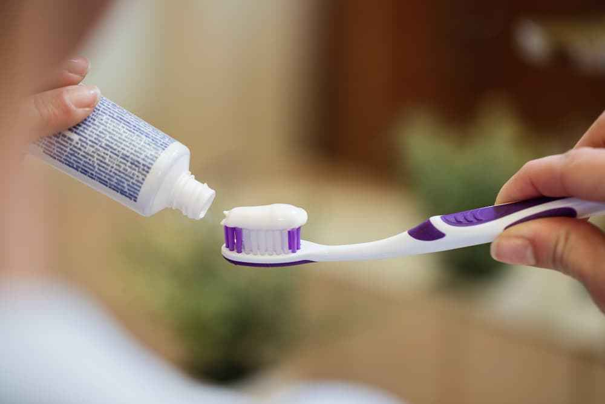

挤得满满的牙膏

#### 牙膏的作用

牙膏最主要的作用是辅助清洁。除此之外，含氟牙膏可以降低龋齿发病率，修复早期的牙齿损伤。抗过敏牙膏能够通过减少牙齿对外界刺激的敏感性来缓解牙齿敏感问题。这些都是明确有效的牙膏的作用。

一些牙膏宣传具有抗炎的作用，通常是在其中添加中草药或者植物提取物来实现的，具体效果有待商榷。如果有牙膏宣传能够治疗除了「牙本质敏感」以外的任何口腔疾病，都是虚假宣传，建议举报。

好消息是，国务院已经出台了[《牙膏监督管理办法》](https://www.gov.cn/gongbao/2023/issue_10506/202306/content_6885262.html)，将于 2023 年 12 月 1 日起正式施行。

### 我需要每年都洗牙吗？

不需要，但宣传每年洗牙是利大于弊的。

前文已经介绍了，牙结石是由牙菌斑矿化而来的。理想情况下，如果你能够及时且完全地清除牙菌斑，实际上就是从根源杜绝了牙结石的产生，自然也不再需要洗牙。但现实中你是无法做到完全清除牙菌斑的。比如，如果你之前没有使用牙线或者其他工具清洁邻面的习惯，很有可能你的牙间隙中就有一些牙结石。

所以我的建议是，如果你之前从来没有洗过牙，可以先去正规医院进行一次检查，由医生判断你是否需要洗牙。如果需要洗牙，可以记下来自己牙结石较多的区域，这也是你平时没有清洁到位的地方。之后，只要你能够保持良好的口腔卫生习惯，每年形成的牙结石数量都是非常少的，完全没有必要每年都去洗牙。而且洗牙多多少少还是会对牙龈和牙齿造成损伤的。

洗牙这个活又脏又累，收费还低，其实没有多少医生愿意去做。对于口腔诊所来说，如果用销售的思维去想，洗牙本身是一个低客单的产品，它的主要作用是吸引顾客。过程中可以给顾客介绍高客单的产品，从而赚取高额的利润。而对于三甲医院和医疗科普人员来说，洗牙的过程相当于进行了全面的口腔检查，可以检查出可能存在的各种口腔问题，的的确确能够促进口腔疾病的早期诊治（二级预防）。而且，从现阶段牙周炎和龋齿的高发病率来说，大部分人都没有办法做到良好的口腔清洁。所以现阶段，宣传每年洗牙肯定是利大于弊的。

### 我如何判断自己清洁到位了呢？

第一个方法就是之前说的，可以去正规医院进行一次全面的口腔检查，通过医生的反馈来判断自己哪些地方清洁到位了，哪些地方没有。

此外，一个可行的方法是购买牙菌斑显示剂，在刷完牙之后使用。通过显示剂看看哪个区域的牙菌斑还没有清洁到位。

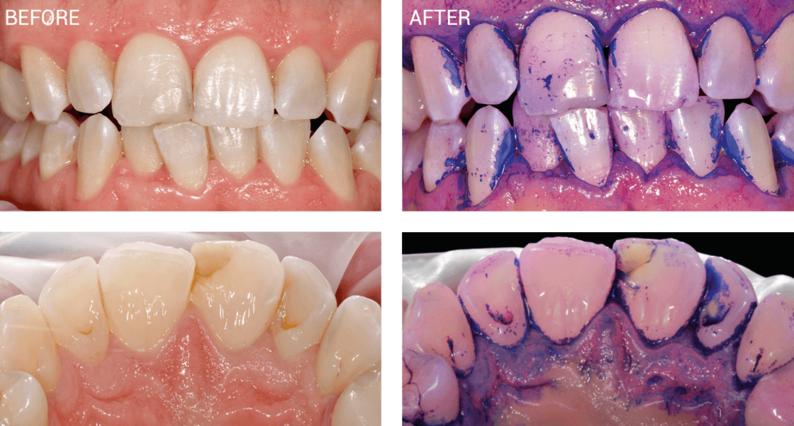

比较震撼，可以自行点开大图。

### 冲牙器能够代替刷牙和洗牙吗？

不能。

冲牙器只能够辅助清洁牙刷无法刷到的区域，但无法代替刷牙。

洗牙的主要目的是清洁牙石，而冲牙器基本没有能力去除牙石。

## 尾巴

消费主义作为一种文化现象，似乎在推动我们追求物质的满足和表象的完美。它诱导我们购买各式各样的口腔保健产品，这些产品或许各有其功效，但当我们过度专注于表面的、多样化的产品时，可能就会忽视了最基本的原理。

并非使用更高级、更精致、更昂贵的电动牙刷、冲牙器等，就能够获得良好的口腔健康的。法无定法，万变不离其宗。无论使用什么样的工具和方法，最终还是要落实在更好地清洁牙菌斑上。

因此，我们需要培养一种平衡的观念，既欣赏技术和产品带来的便利，也保持对基本生活原则的重视。通过这种平衡，我们可以更加自由地选择适合自己的生活方式，避免被不必要的物质追求所左右，从而实现实实在在的生活质量的提升。

#### 参考文献

-   《口腔生物学》第 5 版 人民卫生出版社
-   Almubarak, Abdulrahman et al. 「Disruption of Monocyte and Macrophage Homeostasis in Periodontitis.」 *Frontiers in immunology* vol. 11 330. 26 Feb. 2020, doi:10.3389/fimmu.2020.00330
-   《国内权威口腔科专家联合指出：使用含氟牙膏防龋是安全、有效和经济的方法》- 中华人民共和国国家卫生和计划生育委员会
-   中华口腔医学会口腔预防医学专业委员会牙本质敏感专家组.牙本质敏感的诊断和防治指南(2019 修订版)\[J\].中华口腔医学杂志,2019,54(4):223-227.DOI:10.3760/cma.j.issn.1002-0098.2019.04.002.

\> 关注 [少数派公众号](https://sspai.com/s/J71e)，解锁全新阅读体验 📰

\> 实用、好用的 [正版软件](https://sspai.com/mall)，少数派为你呈现 🚀

我们的敌人——牙菌斑

牙齿的组织结构

口腔的防御体系

牙菌斑

我们的战场——牙齿的弱点

𬌗面的沟裂

邻面（牙间隙）

牙龈和牙齿的交界处

我们的武器——口腔保健方法

广义的刷牙

刷牙以外

一些常见问题的 Q&A

使用牙线会导致牙缝变大吗？

每天要刷几次牙？

使用牙膏是资本的阴谋吗？

我需要每年都洗牙吗？

我如何判断自己清洁到位了呢？

冲牙器能够代替刷牙和洗牙吗？

尾巴

© 本文著作权归作者所有，并授权少数派独家使用，未经少数派许可，不得转载使用。

全部评论(31)

热门排序

写下尊重、理性、友好的评论，有助于彼此更好地交流～

[vimv](https://sspai.com/u/vimv_/updates)

7 小时前

本篇文章我称之为少数派2023年度最佳

17

[EurekaLab](https://sspai.com/u/7w2qer6m/updates)

6 小时前

/比心

2

[Abirdcfly](https://sspai.com/u/2wasm5y8/updates)

17 小时前

特地登上来说一句，一定注意牙齿健康，根管治疗的图可以找来看看，杀神经那个痛苦记忆犹新。另一个痛苦的是龈下刮治....

14

[EurekaLab](https://sspai.com/u/7w2qer6m/updates)

17 小时前

哈哈哈哈哈，而且口腔疾病大多是不可逆的，后续的治疗只能阻止发展，治疗过程也很痛苦。

0

[Dornam](https://sspai.com/u/33i4z8nq/updates)

5 小时前

特地登陆来回复一下，几个月前才做完整套的牙周炎治疗，花了几千块但因为是医疗项目所以都能使用医保。按照医生的话来说，正确的刷牙方法+使用牙线就能很好保护牙齿，还有就是文章中那种带塑料杆的牙线棒也并不推荐，因为这样共用一根牙线棒来清洁所有牙齿，其实并不卫生也很容易将牙菌斑从一处地方扩散到所有牙齿。医生建议应该使用那种一根长...展开

22

[EurekaLab](https://sspai.com/u/7w2qer6m/updates)

5 小时前

我觉得是这样的，对于普通健康人来说用这种牙线棒是比较轻松和容易接受的方式。用那种绕手牙线坚持还是比较困难的。总的来说，有比没有好。如果是本身已经有了牙齿疾病的话，还是应该遵从医嘱。

1

[杨鸭婆](https://sspai.com/u/rurogue/updates)

回复

[EurekaLab](https://sspai.com/u/7w2qer6m/updates)

4 小时前

我司同事看到我在用，从牙线棒换到了长牙线。一盒牙线能用很长时间

1

[捷宝](https://sspai.com/u/aw8a9end/updates)

4 小时前

漱口水居然不能天天用吗？我差不多最近一年天天用，感觉很好

11

[EurekaLab](https://sspai.com/u/7w2qer6m/updates)

4 小时前

用进废退，如果你一直用漱口水去保持口腔内的无菌环境，会破坏口腔原本的菌群和防御功能。

0

[微光的夏](https://sspai.com/u/ew7cm1zh/updates)

5 小时前

这个牙菌斑显示剂好神奇，准备试试～

01

[coffee\_cleric](https://sspai.com/u/lujkytyb/updates)

5 小时前

很好的文章

01

[西鸽](https://sspai.com/u/BeckMint/updates)

5 小时前

学到知识了

01

[捣蛋](https://sspai.com/u/d6t394uk/updates)

17 小时前

写得太好了，我准备最近去看看牙了。作者考虑介绍一下怎么管理口腔气味吗

31

[EurekaLab](https://sspai.com/u/7w2qer6m/updates)

17 小时前

可以，在考虑的

0

[微光的夏](https://sspai.com/u/ew7cm1zh/updates)

5 小时前

我去医院做了除幽门螺旋杆菌后，就没有什么气味了。

1

[EurekaLab](https://sspai.com/u/7w2qer6m/updates)

回复

[微光的夏](https://sspai.com/u/ew7cm1zh/updates)

4 小时前

因为确实口腔异味很多时候其实还是消化系统的问题

0

[W1il](https://sspai.com/u/h93x1762/updates)

21 小时前

挺好，下周就要去搞牙周炎了，洗牙发现了一堆毛病，都是平时不注意的问题

01

[少数派88329545](https://sspai.com/u/38ji9kbz/updates)

1 小时前

好文章！我最近牙线越来越容易断了，卡在牙缝里。不知道是不是错觉，牙缝越来越紧，牙线棒要通过咬来协助牙线进牙缝，出来时，很容易断，并且断下来的牙线可能卡在牙缝里，需要再次用牙线把它挤出来……很多时候拔不出来，我都担心用力会把牙拔下来……请问 1牙缝太紧有什么办法吗？ 2在这么紧的情况下，用牙线强行垂直拔出来，会不会影响牙根的牢固？

10

[EurekaLab](https://sspai.com/u/7w2qer6m/updates)

1 小时前

有没有去检查过？牙线下不去也有可能是因为结石。一般不会影响牙根的牢固。

0

[J\_\_\_](https://sspai.com/u/3tzhglay/updates)

4 小时前

具体情况具体分析。有的人天生就不会蛀牙，我跟我老婆都没有蛀牙，当然我们小时候父母都不会买零食给我们吃，回头我女儿从小就开始吃零食，我都有点担心她的牙齿。有的人喝水都会蛀牙，也是存在的。过度的保洁，打破原本身体的平衡，反倒是大家要注意的。关键的是，现在的环境太多不利于健康口腔环境的因素了，所以还是要根据自己的实际情况去做...展开

10

[EurekaLab](https://sspai.com/u/7w2qer6m/updates)

3 小时前

说明你们家口腔的菌群很好/狗头，其实很多人都忽略的是儿童口腔内有害菌群最早都是从父母那边来的。

0

[Charbovari](https://sspai.com/u/cguu4fyt/updates)

4 小时前

看完这篇文章打算去预约牙齿检查了，想请教一下：普通的口腔检查是去大医院的口腔科还是那种连锁口腔诊所会比较好？🧐

20

[EurekaLab](https://sspai.com/u/7w2qer6m/updates)

4 小时前

看当地经济水平，如果你们那边有专门的口腔专科医院是最好的。如果是一线城市，有些诊所水平也是不错的。否则还是建议优先医院。

1

[Charbovari](https://sspai.com/u/cguu4fyt/updates)

4 小时前

😁感谢解答

0

[潮鳴](https://sspai.com/u/c8hf27za/updates)

5 小时前

🥺我现在决定晚上睡觉前也要刷牙了…特别是想起之前看过的另一个比较出圈的动漫《工作细胞black》女主作为白细胞，前往去口腔杀死病菌的时候，掉入了满是牙菌斑巢穴的口腔，那铺天盖地的细菌把她折磨得奄奄一息，被男主救回来的时候太惨了…话说回来牙齿发黄是不是也有牙菌斑的缘故？或许牙齿美白可以再展开讲一下。

10

[EurekaLab](https://sspai.com/u/7w2qer6m/updates)

4 小时前

后面会讲，和牙菌斑有一定关系，但关系不大

0

[xin777](https://sspai.com/u/8wcbpx5l/updates)

5 小时前

电动牙刷，牙线，冲牙器都在用，但是牙龈还是经常肿痛，智齿也拔了，但是最边上的一颗恒牙还是老是肿，一两年洗一次牙，去检查也没有龋齿，用了好几种漱口水，有1，2种还可以，一停掉又不行了，都不知道该怎么办了。

00

[阿B](https://sspai.com/u/sh7urhmy/updates)

12 小时前

前年医生就说我牙周炎有点严重，到现在我都还没去看，已经有点忌医了，怕医生说没得救了

10

[EurekaLab](https://sspai.com/u/7w2qer6m/updates)

8 小时前

医生不会说没得救的，但牙周炎的治疗是一个长期的过程

0

[逐山海](https://sspai.com/u/320apd8c/updates)

21 小时前

挺好的，看完了。一直在用冲牙器+电动牙刷，但是也有一些坏习惯，电动牙刷没电了会懒得充，继续用。我的下边牙有点不齐，冲牙器每次都会出血，这个出血是说明有炎症还是损伤？是什么提醒吗

10

[EurekaLab](https://sspai.com/u/7w2qer6m/updates)

21 小时前

一般是牙龈出血，多半是因为牙龈炎症导致牙龈比较脆弱

2

没有更多评论了哦
