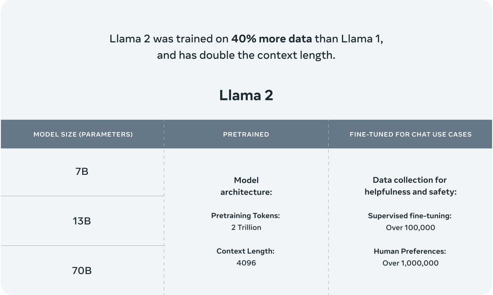
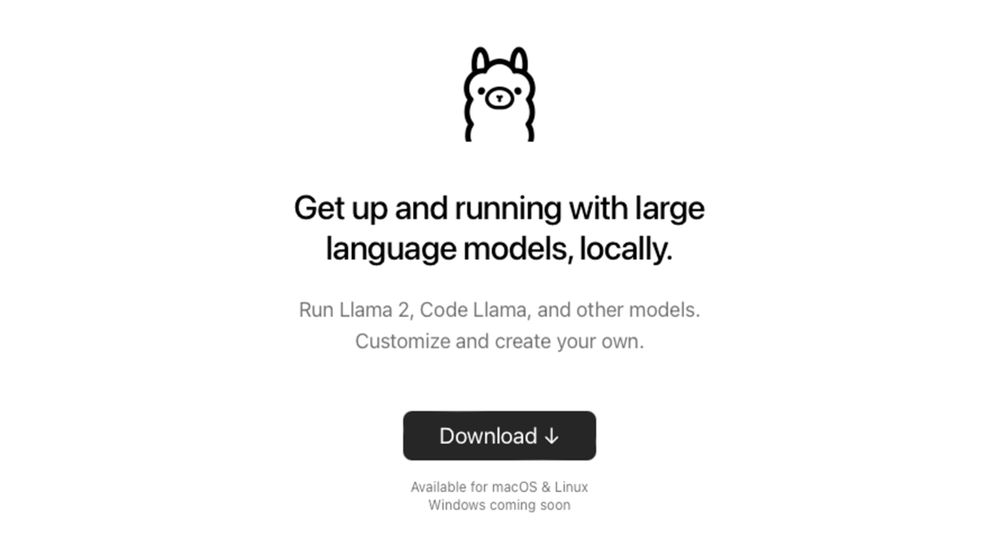
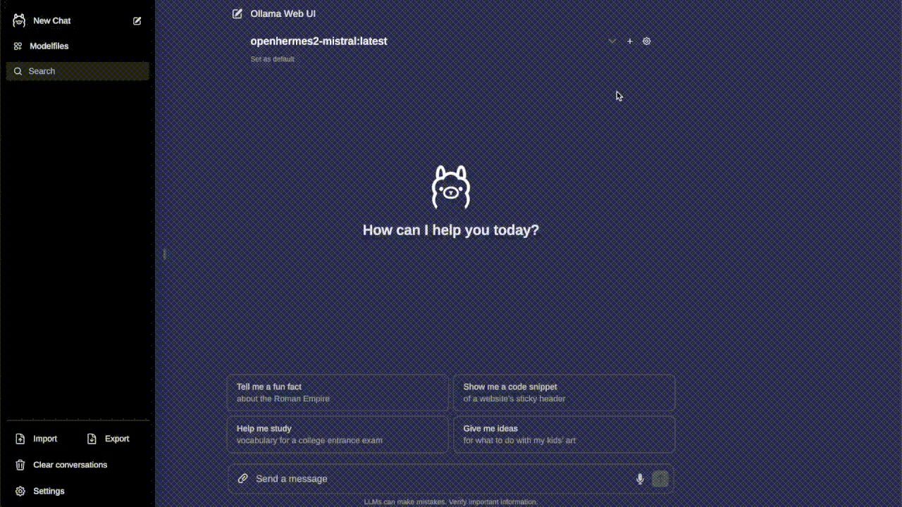
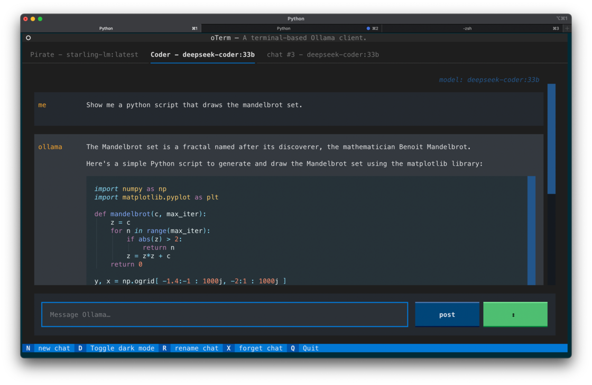
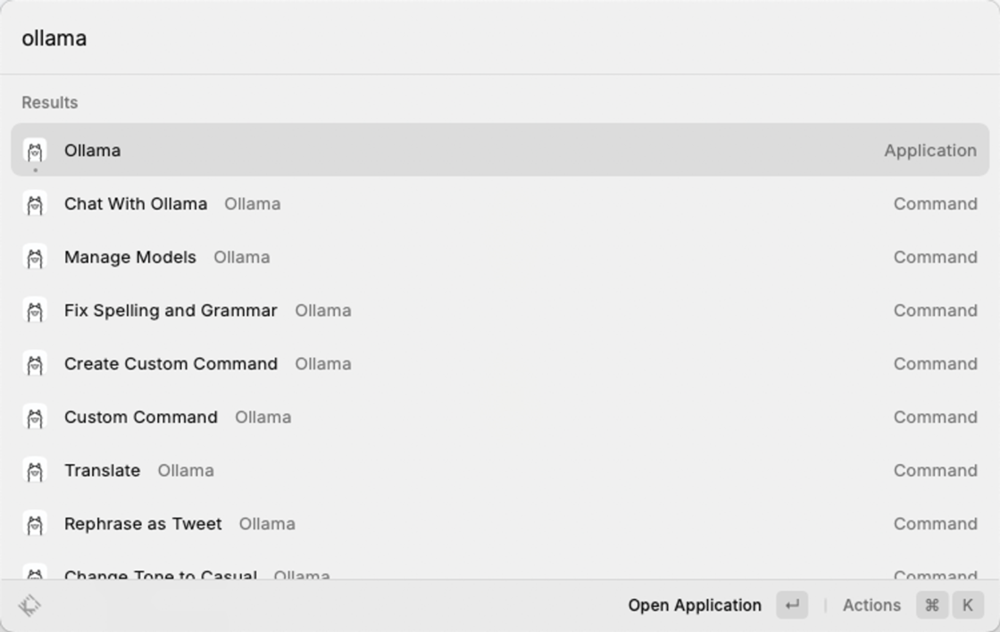
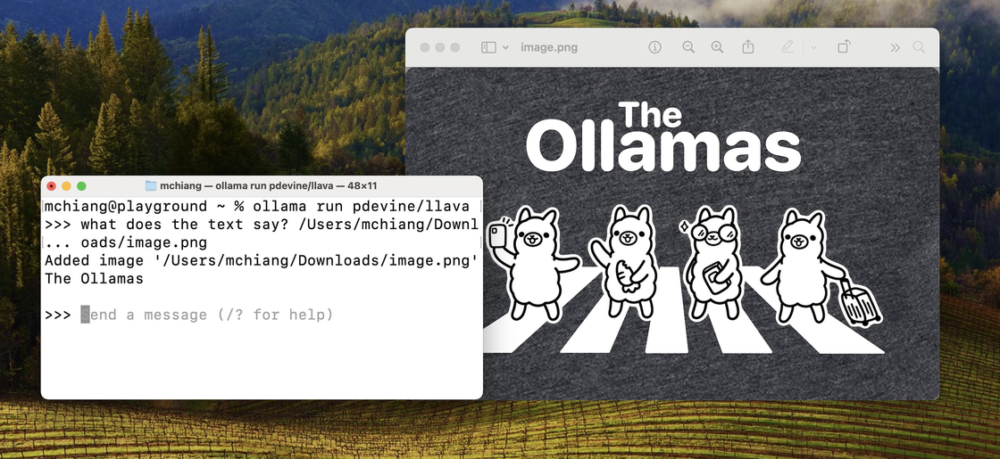

# 用 Ollama 轻松玩转本地大模型 - 少数派

## 引言

4 月份时，我曾借 LLaMA 开源之机，尝试[梳理](https://sspai.com/post/79443)了大语言模型（LLM）平民化运动以及频频在开源项目命名中露面的「羊驼」家族，包括扮演了重要角色的 [llama.cpp](https://sspai.com/link?target=https%3A%2F%2Fgithub.com%2Fggerganov%2Fllama.cpp) 项目。

彼时羊驼一族在开源大模型领域初露头角，周边生态一片向好。转眼年关将至，回望过去的三个季度，以 Meta 在 6 月[发布](https://sspai.com/link?target=https%3A%2F%2Fai.meta.com%2Fblog%2Fllama-2%2F)更强大且更开放的 Llama 2 为节点，开源社区再次以不可阻挡之势适配、进化、落地。

如今 LLM 早已不再等同于昂贵的 GPU，而是可以在大部分消费级计算机上运行推理的应用了——俗称本地大模型。



Llama 2 三件套

## 优雅不易

根据[经验](https://sspai.com/link?target=https%3A%2F%2Fgithub.com%2Fray-project%2Fllm-numbers%232x-number-of-parameters-typical-gpu-memory-requirements-of-an-llm-for-serving)，16 位浮点精度（FP16）的模型，推理所需显存（以 GB 为单位）约为模型参数量（以 10 亿为单位）的两倍。据此，Llama 2 7B（70 亿）对应需要约 14GB 显存以进行推理，这显然超出了普通家用计算机的硬件规格。作为参考，一块 GeForce RTX 4060 Ti 16GB 显卡市场价超过 3000 元。

模型量化（quantization）技术可以很大程度上降低显存要求。以 4-bit 量化为例，其将原本 FP16 精度的权重参数压缩为 4 位整数精度，使模型权重体积和推理所需显存均大幅减小，仅需 FP16 的 1/4 至 1/3，意味着约 4GB 显存即可启动 7B 模型的推理（当然实际显存需求会随着上下文内容叠加而不断增大）。

与此同时，llama.cpp 项目用 C/C++ 重写了推理代码，既避免了 PyTorch 引入的复杂依赖，又提供了更为广泛的硬件支持，包括纯 CPU 推理、Apple Silicon 在内的各类底层计算架构都得以充分发挥对应的推理加速。由于 Llama 架构的流行，llama.cpp 的量化和推理能力能够近乎无缝地迁移应用至相同架构的开源大语言模型，如阿里云的 Qwen 系列、零一万物的 Yi 系列等。

尽管 llama.cpp 带来了诸多好处，但当你想要真正动手体验一把时，却发现需要获取模型权重、克隆项目代码、执行模型量化、设置环境变量、构建可执行文件等诸多环节才能以命令行的形式问一个测试问题，更不要提数十个可能需要手动调整的[参数](https://sspai.com/link?target=https%3A%2F%2Fgithub.com%2Fggerganov%2Fllama.cpp%2Fblob%2Fmaster%2Fexamples%2Fmain%2FREADME.md)了。

所以，很长一段时间里，本地大模型和基于 llama.cpp 的应用都局限于少数极客和研究者的圈子，较高的上手门槛将许多普通人拒之门外。

直到有了 [Ollama](https://sspai.com/link?target=https%3A%2F%2Follama.ai%2F)——一个简明易用的本地大模型运行框架。随着围绕着 Ollama 的生态走向前台，更多用户也可以方便地在自己电脑上玩转大模型了。



官网

## 快速上手

Ollama 安装十分简单，macOS 直接在官网下载安装包打开运行；Window 尚未提供安装包，官方推荐在 [WSL 2](https://sspai.com/link?target=https%3A%2F%2Flearn.microsoft.com%2Fzh-cn%2Fwindows%2Fwsl%2Finstall) 中以 Linux 方式用命令安装：

```shell
% curl https://ollama.ai/install.sh | sh
```

**提示：**请始终注意审阅判断 `curl | sh` 风格安装脚本的风险。

如果你熟悉 Docker，也可以直接使用其[官方镜像](https://sspai.com/link?target=https%3A%2F%2Fhub.docker.com%2Fr%2Follama%2Follama)。

当你运行 `ollama --version` 命令成功查询到版本时，表示 Ollama 的安装已经顺利完成，接下来便可以用 `pull` 命令从[在线模型库](https://sspai.com/link?target=https%3A%2F%2Follama.ai%2Flibrary)下载模型来玩了。

以中文微调过的 Llama2-Chinese 7B 模型为例，下述命令会下载接近 4GB 的 4-bit 量化模型文件，需要至少 8GB 的内存进行推理，推荐配备 16GB 以流畅运行。

```shell
% ollama pull llama2-chinese
```

下载完成后，使用 `run` 命令运行模型，可直接将消息附在命令后，或留空进入对话模式，对话模式内置了几个以斜杠引出的命令：

```shell
# 单条输入
% ollama run llama2-chinese "天空为什么是蓝色的？"
```

```shell
# 对话模式
% ollama run llama2-chinese
>>> /?
Available Commands:
  /set         Set session variables
  /show        Show model information
  /bye         Exit
  /?, /help    Help for a command

Use """ to begin a multi-line message.

>>> 天空为什么是蓝色的？

这个问题是一个常见的争议。有一些科学家认为天空的蓝色可以被解释为雾和云层中的微小碎片反射出来的光色，而其他人则认为这是由于地球自身温度的影响。目前还没这个问题是一个常见的争议。有一些科学家认为天空的蓝色可以被解释为雾和云层中的微小碎片反射出来的光色，而其他人则认为这是由于地球自身温度的影响。目前还没有一个公认的解释。
```

值得一提的是，Ollama 会判别正在运行的硬件并在可行的情况下调用 GPU 加速，不妨在推理时打开活动监视器或任务管理器观察以验证。

到此，你已经体验到触手可及的本地大模型了。

## 套上外壳

若是觉得命令行的形式不够易用，Ollama 有一系列的[周边工具](https://sspai.com/link?target=https%3A%2F%2Fgithub.com%2Fjmorganca%2Follama%23community-integrations)可供使用，包含了网页、桌面、终端等交互界面及诸多插件和拓展。

之所以 Ollama 能快速形成如此丰富的生态，是因为它自立项之初就有清晰的定位：让更多人以最简单快速的方式在本地把大模型跑起来。于是，Ollama 不是简单地封装 llama.cpp，而是同时将繁多的参数与对应的模型打包放入；Ollama 因此约等于一个简洁的命令行工具和一个稳定的[服务端 API](https://sspai.com/link?target=https%3A%2F%2Fgithub.com%2Fjmorganca%2Follama%2Fblob%2Fmain%2Fdocs%2Fapi.md)。这为下游应用和拓展提供了极大便利。

就 Ollama GUI 而言，根据不同偏好，有许多选择：

**Web 版：**[Ollama WebUI](https://sspai.com/link?target=https%3A%2F%2Fgithub.com%2Follama-webui%2Follama-webui) 具有最接近 ChatGPT 的界面和最丰富的功能特性，需要以 Docker 部署；



Ollama WebUI 示例，图源项目首页

**终端 TUI 版：**[oterm](https://sspai.com/link?target=https%3A%2F%2Fgithub.com%2Fggozad%2Foterm) 提供了完善的功能和快捷键支持，用 `brew` 或 `pip` 安装；



Oterm 示例，图源项目首页

**Raycast 插件：**即 [Raycast Ollama](https://sspai.com/link?target=https%3A%2F%2Fwww.raycast.com%2Fmassimiliano_pasquini%2Fraycast-ollama)，这也是我个人最常用的 Ollama 前端 UI，其继承了 Raycast 的优势，能在选中或复制语句后直接调用命令，体验丝滑。而作为价值约 8 美元/月的 Raycast AI 的平替，Raycast Ollama 实现了 Raycast AI 的绝大多数功能，且随着 Ollama 及开源模型的迭代，还将支持多模态等 Raycast AI 不支持的功能，可谓潜力无限。



复刻了 Raycast AI 的 Raycast Ollama 插件

此外，还有 Swift 编写的 macOS 原生应用 [Ollamac](https://sspai.com/link?target=https%3A%2F%2Fgithub.com%2Fkevinhermawan%2FOllamac)、类似于 Notion AI 的 [Obsidian Ollama](https://sspai.com/link?target=https%3A%2F%2Fgithub.com%2Fhinterdupfinger%2Fobsidian-ollama) 等有趣应用，可按需选用。

## 进阶玩法

### 更换模型

如果你仔细读了前文演示中「天空为什么是蓝色的」的回答，可能隐约感觉到一丝异样——恭喜，你成功捕捉到了一次大语言模型的「幻觉」。实际上，因为参数量小又经过量化折损，适合在本地运行的模型更容易出现幻觉，严重时甚至会前言不搭后语。对此，唯一的缓解办法可能就是在条件允许的前提下，尽量运行参数更多的模型。

```shell
% ollama run llama2-chinese:13b "天空为什么是蓝色的？"

天空是由大气层和太阳光的散射而成的蓝色。

在日出之前，我们看到的天空是紫色或彩虹色，这是因为太阳光从海平面反射回来时，会被大气中的二氧化碳和水分子散射成蓝色、紫色或彩虹色。

而在日出之后，天空变成了灰色，这是由于太阳光从大气中被阻挡，并且不再有足够的反射来给天空增加蓝色。

当我们看到天空时，它的颜色是由于太阳光与大气中的物质相互作用而形成的。这些物质包括水、二氧化碳和其他气体，以及微小的冰片和沙塵。

当我们看到天空变成了晚上时，天空会逐渐变得更加深蓝，这是由于太阳光在大气中传播，同时也因为大气层的结构。
```

可以看到，效果确实更好了一些。其他可选标签同样可在对应模型的[标签页](https://sspai.com/link?target=https%3A%2F%2Follama.ai%2Flibrary%2Fllama2-chinese%2Ftags)查看。

此外，还可以换用其他模型。在此，推荐几个官方模型库里对中文支持相对较好或比较有趣的几：

-   DeepSeek 系列，深度求索团队推出，包括针对代码训练的 [DeepSeek-Coder](https://sspai.com/link?target=https%3A%2F%2Follama.ai%2Flibrary%2Fdeepseek-coder) 和 通用的 [DespSeek-LLM](https://sspai.com/link?target=https%3A%2F%2Follama.ai%2Flibrary%2Fdeepseek-llm)；
-   [Yi 系列](https://sspai.com/link?target=https%3A%2F%2Follama.ai%2Flibrary%2Fyi)，零一万物团队推出，有支持 20 万上下文窗口的版本可选；
-   如果碰巧财力雄厚，不妨试试法国明星初创团队 Mistral 最新推出的首个开源混合专家 MoE 模型 [Mixtral-8x7B](https://sspai.com/link?target=https%3A%2F%2Follama.ai%2Flibrary%2Fmixtral)，需要 48GB 内存以运行；
-   如果不巧硬件紧张，无需气馁，[Phi-2](https://sspai.com/link?target=https%3A%2F%2Follama.ai%2Flibrary%2Fphi) 由微软团队针对逻辑和理解精调，2.7B 的尺寸只需 4 GB 内存即可运行，吐字速度飞快，只是不太懂中文。

### 图片支持

除了纯语言大模型，Ollama 自 [0.1.15 版本](https://sspai.com/link?target=https%3A%2F%2Fgithub.com%2Fjmorganca%2Follama%2Freleases%2Ftag%2Fv0.1.15)开始提供支持的视觉模型也值得一玩。将本地图片的路径写在 prompt 里即可（macOS 用户可以直接将图片拖入终端来获得其路径）：

```shell
% ollama run llava
>>> What does the text in this image say? /Users/mchiang/Downloads/image.png 
Added image '/Users/mchiang/Downloads/image.png'

The text in this image says "The Ollamas."
```



LLaVA 示例，图源 Ollama 发版公告

### 自定义系统提示词

根据 ChatGPT 的使用经验，多数人都已知晓系统提示词的重要性。好的系统提示词能有效地将大模型定制成自己需要的状态。在 Ollama 中，有多种方法可以自定义系统提示词。

首先，不少 Ollama 前端已提供系统提示词的配置入口，推荐直接利用其功能。此外，这些前端在底层往往是通过 [API](https://sspai.com/link?target=https%3A%2F%2Fgithub.com%2Fjmorganca%2Follama%2Fblob%2Fmain%2Fdocs%2Fapi.md) 与 Ollama 服务端交互的，我们也可以直接调用，并传入系统提示词选项：

```shell
curl http://localhost:11434/api/chat -d '{
  "model": "llama2-chinese:13b",
  "messages": [
    {
      "role": "system",
      "content": "以海盗的口吻简单作答。"
    },
    {
      "role": "user",
      "content": "天空为什么是蓝色的？"
    }
  ],
  "stream": false
}'
```

其中 `role` 为 `system` 的消息即为系统提示词。

### 更多选项

Ollama 的 ModelFile 给用户留下了更多自定义的空间，除了系统提示词，包括对话模板、模型推理温度、上下文窗口长度[等参数](https://sspai.com/link?target=https%3A%2F%2Fgithub.com%2Fjmorganca%2Follama%2Fblob%2Fmain%2Fdocs%2Fmodelfile.md)均可自行设置，适合进阶使用。

在创建前，通过 `show --modelfile` 命令可以查看现有模型的 ModelFile 内容，作为参考：

```shell
% ollama show --modelfile llama2-chinese:13b
# Modelfile generated by "ollama show"
# To build a new Modelfile based on this one, replace the FROM line with:
# FROM llama2-chinese:13b

FROM ~/.ollama/models/blobs/sha256:8359bebea988186aa6a947d55d67941fede5044d02e0ab2078f5cc0dcf357831
TEMPLATE """{{ .System }}
Name: {{ .Prompt }}
Assistant:
"""
PARAMETER stop "Name:"
PARAMETER stop "Assistant:"
```

以自定义系统提示词并修改推理温度参数为例，应构建如下格式的 ModelFile：

```plain
FROM llama2-chinese:13b

SYSTEM "以海盗的口吻作答。"
PARAMETER temperature 0.1
```

然后使用 `create` 命令进行创建，新的模型会沿用原有模型的权重文件和未作调整的选项参数：

```shell
ollama create llama2-chinese-pirate -f ~/path/to/ModelFile
```

从而得到了属于自己的本地模型。

## 结语

如果与普通应用软件作比，Ollama 的使用体验也许还很难称得上「优雅」。但与数月前的状态相比，其带来的进步就像是从刀耕火种步入现代社会了：当时还需要真金白银堆卡、折腾配置环境才能调通，或是需要自行量化编译才能运行；如今模型发布不到一周（Phi-2 上周发布）就能丝滑地跑在笔记本上。从这个角度说，称 Ollama 为 AI 技术平民化作出了贡献并不为过。
