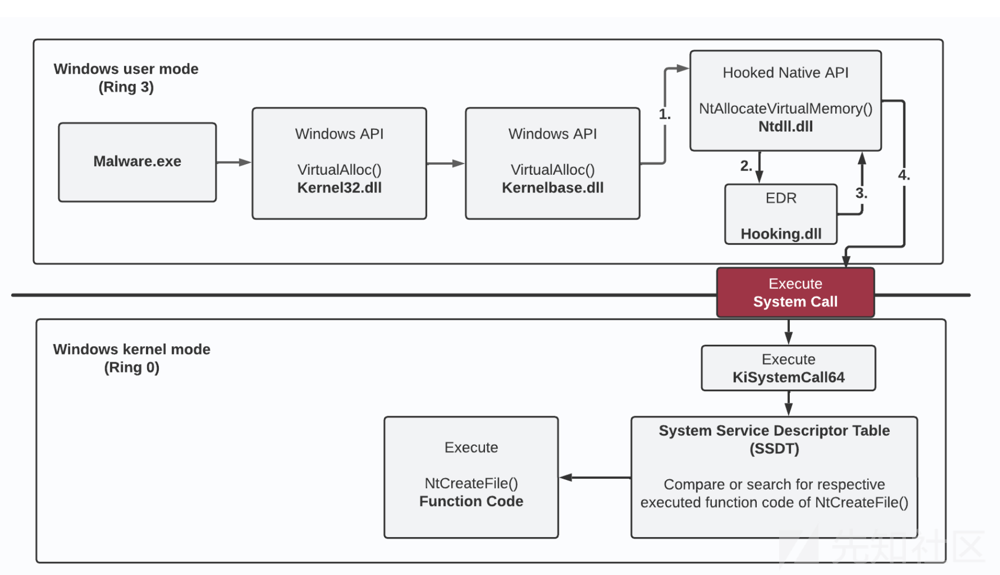
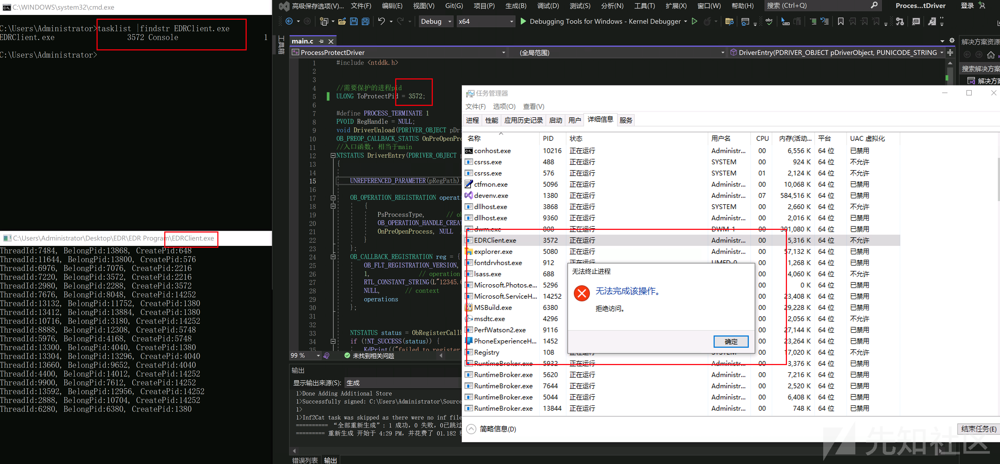

# 白驱动 Kill AV/EDR（上） - 先知社区

白驱动 Kill AV/EDR（上）

- - -

> 本文是白驱动Kill AV/EDR 的第一部分，将讨论驱动开发原理，杀软/EDR 监控拦截原理，并且编写驱动简单实现杀软/EDR 对某些行为的拦截。

myzxcg@深蓝攻防实验室

## 免责声明

本文的所有内容和代码示例仅用于研究目的，不得进行恶意利用，如有恶意利用与本人无关。

## 系统调用过程

应用程序总是需要进行一些不纯是计算的操作，例如打开文件、分配内存，这些操作最终只能由位于内核模式的代码来进行。

例如： 用户要打开一个文件，记事本会调用CreateFile（Kernel32.dll） 来响应。在进行了错误检查后，CreateFile 会进一步调用NtCreateFile（NTDLL.dll），NTDLL.dll 实际上是位于用户模式最底层的代码，这个NtCreateFile 是执行到内核模式转换的API。

在进行实际的转换之前，它会先把系统调用号放到一个EAX 寄存器里，然后执行一个特殊的CPU 指令（syscall/sysenter）来实际转换到内核模式，并跳转到系统服务分发器的例程中去，系统服务分发器读取改寄存器中的值，作为系统服务分发表（SSDT）的索引，代码跳转至相应的系统调用中。

[](https://xzfile.aliyuncs.com/media/upload/picture/20230924113638-9175e420-5a8b-1.png)

## 杀软/EDR 监控原理

传统杀软主要是为了检测拦截主机上的恶意行为和程序，而传统的EDR 并不是为了阻止主机上的恶意活动，而是通过机器学习、行为检测等方式来检测主机上更复杂的恶意活动，并将结果通知到管理员。下面讨论的也是这两者基本通用的检测原理。（***Tips:*** 后文以"EDR" 为"杀软/EDR" 的简称）

大多数EDR 都有一个用户态组件和多个内核态组件，它们会通过驱动在内核中注册多个回调对象来实现进程、线程创建监控，API Hook 等等操作。下面会从用户态和内核态两方面来介绍EDR 监控的大致原理。

### 用户态的组成（R3）

EDR 用户态组件一般由用户态的服务和其用户态的PPL 进程构成。

> Windows Vista首先引入了PP（Protected Process）模型，当时进程要么受保护，要么不受保护。从Windows 8.1 / Server 2012 R2开始，微软引入了Protected Process Light (PPL)的概念。PPL实际上是对以前的受保护进程模型的扩展，并添加了"保护级别" 的概念。进程的保护级别由该进程PE文件的签名级别决定。受保护的进程级别总是大于 PPL 进程，其次高价值的签名者进程可以访问低价值的进程，但反之则不然。

换句话说：

-   PP 进程可以打开具有完全访问权限的 PP 或 PPL 进程，只要其签名者级别大于或等于；
-   一个 PPL 进程可以打开另一个具有完全访问权限的 PPL 进程，只要其签名者级别大于或等于；
-   无论签名者级别如何，PPL 进程都无法以完全访问权限打开 PP 进程。

当然未受保护的进程都无法访问PP 和PPL 进程（只能使用受限的访问标志集）。用户态的EDR 进程一般会将进程启动为PPL级别来保护自己避免被用户态程序篡改，这导致PPL 进程只能从Windows 内核中去终止。（经过观察发现国内的杀软/EDR 用户态大多不是PPL 进程，但是它也可以通过内核回调对象实现对其用户态进程的保护，以达到相同的效果，后面会细说代码实现）

***Tips:*** 杀软/EDR 的保护级别一般是PsProtectedsignerAntimalware-Light。

- - -

在后面测试可能会遇到过这样一个问题：

> 为什么被终止的EDR 用户态PPL 进程总是会重新初始化（Kill 之后会重启）？以及EDR 的哪个模块进行的这个初始化操作？

一般来说是由用户态的EDR 服务组件负责初始化和调度EDR 的PPL 进程。如下图，从左到右，第一个窗口是EDR 的PPL进程，第二个窗口是EDR 的服务进程，第三个窗口是这个服务的介绍。

[](https://xzfile.aliyuncs.com/media/upload/picture/20230924113740-b6473a1a-5a8b-1.png)  
按理说如果能关闭EDR 的用户态服务，那么就能完全关闭掉EDR 的用户态组件。但是EDR 通常将其用户态服务初始化为受保护的服务，受保护的服务初始化是由一个叫Early Launch Antimalware 的EDR驱动程序完成的，这个内核驱动程序不允许停止、禁用这个受保护服务以及不允许修改它的注册表项启动类型来关闭（某些情况下，有的EDR 能修改成功，但重启后修改的值会被重置），如下图。

[](https://xzfile.aliyuncs.com/media/upload/picture/20230924113856-e3bb7ce0-5a8b-1.png)

### 内核态的实现（R0）

EDR 的核心拦截能力主要在内核中实现。通过在内核中注册回调例程，EDR 可以在用户态创建进程、注册表操作、对象获取等等方面进行监控和拦截，属于系统底层的拦截机制。在Windows XP SP3 发布之前，EDR 可以在Windows 内核中进行Hook，比如对SSDT 表的Hook，但微软为了Windows 内核稳定引入了Patch Guard 到内核中。

> Patch Guard 会在不规则的时间间隔内来检查 Windows 内核中某些代码区域是否存在诸如挂钩之类的操作，在必要时通过蓝屏死机 (BSOD) 来阻止 Windows 的进一步执行。Patch Guard 也有Bypass 方法，但现在的杀软/EDR 一般不会通过漏洞去bypass，因为可能会导致蓝屏。

虽然微软引入了Patch Guard 来禁止EDR 在内核中进行Hook 操作，但是它也引入了另一种机制 — 内核回调对象来让EDR 可以在内核中实现保护、检测策略。内核回调机制允许EDR 通过筛选器驱动程序以回调例程的形式注册回调对象，这允许EDR在Windows内核的回调数组中注册不同的回调例程。

举个例子：EDR 在内核中注册了在回调数组中注册了一个进程通知的回调例程，那么进程在用户态中被创建和终止时，都会触发这个回调通知，这样EDR 就知道哪个进程被创建了，从而进行后面一系列的保护或检测操作。

例如注入DLL 去Hook API 来实现恶意代码检测、内存页面保护等。下面简单介绍一下EDR 在用户态的Hook 原理：

[](https://xzfile.aliyuncs.com/media/upload/picture/20230924113929-f788bd64-5a8b-1.png)

上面借用@Daniel Feichter 的图来说明，以VirtualAlloc 和 NtAllocateVirtualMemory 为例，EDR 一般会在kernel32.dll 或 NTDLL.dll 中进行Hook，EDR 可以通过JMP 指令（或其他Hook 库）将调用重定向到EDR注入的Dll 中，这样EDR就能分析的参数、调用的上下文代码等信息，如果没有扫描出恶意代码或行为，才会进行后续正常的调用逻辑。

当然绕过用户态的函数Hook的方法也有很多，可以通过直接系统调用、间接系统调用（两种系统调用都可以被检测）、内存中反汇编等方式绕过。在windbg 调试中，发现几个常见的国内杀软和EDR并没有对Kernel32.dll 和ntdll.dll 函数调用做Hook。

## 一个简单的驱动程序

后面会进行简单的驱动程序开发，实现某些EDR 的检测功能，这样有助于理解EDR 在驱动内部的检测原理。不过首先需要搭建驱动开发环境，首先先构建一个最简单的驱动程序。

1.  这里用Visual Studio 2022 进行开发，Visual Studio 2022 只能安装 Windows 11 版本 22H2 WDK（Windows 驱动程序开发工具包）。并且安装WDK 时需要安装对应版本的Windows SDK。
    1.  [下载WDK](https://learn.microsoft.com/zh-cn/windows-hardware/drivers/download-the-wdk) ，这时候下载的是10.0.22621.382版本。
    2.  在Visual Studio 2022上下载，10.0.22621.3.0 版本的SDK。
2.  在下载好后，新建项目就能看到Empty WDM Driver模板并选择创建项目，创建完项目后删除生成的.inf 文件。  
    [](https://xzfile.aliyuncs.com/media/upload/picture/20230924114017-140deb9e-5a8c-1.png)
3.  一个Hello Word 驱动程序
    
    ```plain
    #include <ntddk.h>
    
     void DriverUnload(PDRIVER_OBJECT pDriverObject);
    
     //入口函数，相当于main
     NTSTATUS DriverEntry(PDRIVER_OBJECT pDriverObject, PUNICODE_STRING pRegPath)
     {
    
         UNREFERENCED_PARAMETER(pRegPath); // 解决pRegPath 变量的未引用报警
         KdPrint(("DriverEntry ok\n"));
         NTSTATUS status = STATUS_SUCCESS;
         pDriverObject->DriverUnload = DriverUnload;
    
         return status;
     }
     //用于驱动程序卸载时执行
     void DriverUnload(PDRIVER_OBJECT pDriverObject)
     {
         UNREFERENCED_PARAMETER(pDriverObject);
         KdPrint(("DriverUnload ok\n"));
    
         return;
     }
    ```
    
4.  点击编译，会发现有报错，需要在Visual Studio 2022 上安装缓解了 Spectre 漏洞的库。在VS上安装即可，此处版本要对应上。  
    [](https://xzfile.aliyuncs.com/media/upload/picture/20230924114135-425c90cc-5a8c-1.png)
5.  生成sys 驱动文件  
    [](https://xzfile.aliyuncs.com/media/upload/picture/20230924114210-57440254-5a8c-1.png)
6.  加载驱动
    
    ```plain
    #本机打开测试签名模式，并重启
     bcdedit /set testsigning on
     #安装驱动
     sc create DriverTest type= kernel binPath= "C:\Users\Administrator\MyDriver.sys"
     #加载驱动
     sc start DriverTest
     #卸载驱动
     sc stop DriverTest
    ```
    

下图可以看到加载驱动和卸载驱动的输出  
[](https://xzfile.aliyuncs.com/media/upload/picture/20230924114309-7ae7aef4-5a8c-1.png)

## 内核回调机制

这种机制简单来说就是在系统某些事情发生时驱动程序可以得到通知。

比如EDR 可以注册很多个回调例程，可以这些回调例程可以在进程与线程创建销毁、映像加载、注册表修改、对象获取、文件系统等操作时获得通知，这样EDR 就可以很好的对这些内容进行监控、拦截等操作。

下面通过编写代码模拟EDR 驱动、EDR 用户态进程来实现一个简易版的EDR。

### 实现 - 远程线程注入拦截

大家都知道某数字杀软在某个模式下，会对远程线程注入进行拦截。下面就来自己实现一下，从内核中禁止远程线程注入。

基本逻辑如下：驱动程序检测到远程线程注入，用户态进程（模拟EDR 进程）通过与驱动程序通信获取到这个恶意行为，然后用户态的进程弹窗提示被拦截。实现效果如下图所示：

[](https://xzfile.aliyuncs.com/media/upload/picture/20230924114719-0f9cf7fc-5a8d-1.png)  
检测原理：

驱动程序通过`PsSetCreateThreadNotifyRoutine()`注册系统中线程创建与销毁的回调函数，这样系统中只要有线程的创建和销毁时，都会执行我们定义的回调函数。远程线程的创建者是发起注入进程的PID而不是这个线程所在进程的PID，通过此检测逻辑即可判断是否是远程线程注入。然后，将符合远程进程创建条件的就记录在一个双向链表中，用户端EDR 通过访问驱动的设备对象，读取链表中的值。然后弹窗警告有进程在进行远程线程注入。

以下代码重要代码都写了注释，不逐行分析了。

-   驱动程序编写（EDR.sys）
    
    实现对远程线程注入的检测
    
    -   main.c
        
        ```plain
        #include <ntddk.h>
        
          typedef struct {
        
              ULONG ThreadId;
              ULONG Create_ProcessId;
              ULONG Belong_ProcessId;
        
          }ThreadData;
          typedef struct {
              LIST_ENTRY Entry;
              ThreadData Data;
          }Item;
        
          typedef struct {
              FAST_MUTEX Mutex;
              ULONG ItemCount;
              LIST_ENTRY Header;
          }Global;//全局变量
          Global global;
          void DriverUnload(PDRIVER_OBJECT pDriverObject);
          void ThreadNotify(HANDLE ProcessId, HANDLE ThreadId, BOOLEAN Create);
          NTSTATUS DispatchFuncRead(PDEVICE_OBJECT DeviceObject, PIRP Irp);
          NTSTATUS DispatchFuncDefault(PDEVICE_OBJECT DeviceObject, PIRP Irp);
          void PushItem(LIST_ENTRY* entry);
          //入口函数，相当于main
          NTSTATUS DriverEntry(PDRIVER_OBJECT pDriverObject, PUNICODE_STRING pRegPath)
          {
              UNREFERENCED_PARAMETER(pRegPath);
              UNICODE_STRING DevName = RTL_CONSTANT_STRING(L"\\Device\\RemoteThreadDev");
              //创建设备对象
              PDEVICE_OBJECT DeviceObject;
              NTSTATUS status = IoCreateDevice(pDriverObject, 0, &DevName, FILE_DEVICE_UNKNOWN, 0, 0, &DeviceObject);
              if (!NT_SUCCESS(status)) {
                  KdPrint(("设备对象创建失败 (0x%08X)\n",status));
                  return status;
              }
              DeviceObject->Flags |= DO_DIRECT_IO;
              //提供符号链接使得设备能够被用户态的调用者访问
              //下面创建了一个符号链接并将其与我们的设备对象连接起来
              UNICODE_STRING SymbolicLink = RTL_CONSTANT_STRING(L"\\??\\RemoteThreadCheck");
              status = IoCreateSymbolicLink(&SymbolicLink, &DevName);
        
              if (!NT_SUCCESS(status)) {
                  KdPrint(("符号链接创建失败 (0x%08X)\n", status));
                  //创建失败时 要销毁设备对象
                  IoDeleteDevice(DeviceObject);
                  return status;
              }
              //此函数是用于注册线程创建和销毁的回调通知
              status = PsSetCreateThreadNotifyRoutine(ThreadNotify);
              if (!NT_SUCCESS(status)) {
                  KdPrint(("注册线程回调失败 (0x%08X)\n", status));
                  //失败情况需要销毁申请的句柄
                  IoDeleteDevice(DeviceObject);
                  IoDeleteSymbolicLink(&SymbolicLink);
                  return status;
        
              }
              KdPrint(("线程回调注册成功\n"));
        
              pDriverObject->DriverUnload = DriverUnload;
        
              InitializeListHead(&global.Header);//初始化链表头 LIST_ENTRY结构的双向链表
              ExInitializeFastMutex(&global.Mutex);
        
              //指定Create和 Close 分发例程
              pDriverObject->MajorFunction[IRP_MJ_CLOSE] = pDriverObject->MajorFunction[IRP_MJ_CREATE] = DispatchFuncDefault;
              //指定读设备对象的分发例程
              pDriverObject->MajorFunction[IRP_MJ_READ] = DispatchFuncRead;
        
              status = STATUS_SUCCESS;
              return status;
          }
        
          NTSTATUS DispatchFuncRead(PDEVICE_OBJECT DeviceObject, PIRP Irp) {
        
              UNREFERENCED_PARAMETER(DeviceObject);
        
              PIO_STACK_LOCATION stack = IoGetCurrentIrpStackLocation(Irp);
              //缓冲区长度
              ULONG len = stack->Parameters.Read.Length;
        
              ULONG count = 0;
        
              NT_ASSERT(Irp->MdlAddress);
        
              //获取缓冲区地址
              //此函数返回MdlAddress描述的缓冲区非分页系统虚拟机地址
              UCHAR* buffer = (UCHAR*)MmGetSystemAddressForMdlSafe(Irp->MdlAddress, NormalPagePriority); 
              if (!buffer) {
                  KdPrint(("获取缓冲区非分页虚拟地址失败"));
                  return STATUS_UNSUCCESSFUL;
              }
        
              ExAcquireFastMutex(&global.Mutex);
        
              //一次性将链表中的内容读出来
              while (1) {
        
                  if (IsListEmpty(&global.Header)) break;
        
                  PLIST_ENTRY entry = RemoveHeadList(&global.Header);//去除第一个
        
                  Item* info = CONTAINING_RECORD(entry, Item, Entry);//找到Item结构体地址
        
                  ULONG size = sizeof(ThreadData);
        
                  if (len < size) {
        
                      //如果缓冲区长度不够 就将原数据插回去 然后在退出
                      InsertTailList(&global.Header, entry);
                      break;
                  }
        
                  global.ItemCount--;
        
                  //复制到缓冲区
                  memcpy(buffer, &info->Data, size);
        
                  buffer += size;
        
                  len -= size;
        
                  count += size;
        
                  ExFreePool(info);
        
              }
        
              ExReleaseFastMutex(&global.Mutex);
              //向用户进程响应请求完成的代码
              Irp->IoStatus.Information = count;
        
              Irp->IoStatus.Status = STATUS_SUCCESS;
        
              IoCompleteRequest(Irp, IO_NO_INCREMENT);
        
              return STATUS_SUCCESS;
        
          }
        
          //此分发例程只需要返回请求成功的状态代码
          NTSTATUS DispatchFuncDefault(PDEVICE_OBJECT DeviceObject, PIRP Irp) {
        
              UNREFERENCED_PARAMETER(DeviceObject);
              Irp->IoStatus.Information = 0;
              Irp->IoStatus.Status = STATUS_SUCCESS;
              IoCompleteRequest(Irp, IO_NO_INCREMENT);
        
              return STATUS_SUCCESS;
          }
        
          //用于驱动程序卸载时执行
          void DriverUnload(PDRIVER_OBJECT pDriverObject)
          {
              UNICODE_STRING symLink = RTL_CONSTANT_STRING(L"\\??\\RemoteThreadCheck");
              IoDeleteSymbolicLink(&symLink);
              IoDeleteDevice(pDriverObject->DeviceObject);
        
              PsRemoveCreateThreadNotifyRoutine(ThreadNotify);
        
              //清除整个链表
              while (!IsListEmpty(&global.Header)) {
                  PLIST_ENTRY item = RemoveHeadList(&global.Header);
                  Item* fullitem = CONTAINING_RECORD(item, Item, Entry);
                  ExFreePool(fullitem);
              }
              KdPrint(("DriverUnload ok\n"));
              return;
          }
          //触发线程创建销毁时执行
          void ThreadNotify(HANDLE ProcessId, HANDLE ThreadId, BOOLEAN Create) {
              if (Create) {
                  //如果线程的所属进程和创建的进程不一致，说明这个线程是远程进程创建的。
                  //这里只收集新线程的信息，判断处理交给用户态进程
                  Item* item = (Item *)ExAllocatePool2(POOL_FLAG_PAGED, sizeof(Item), 'abcd');
                  if (item) {
                      item->Data.ThreadId = HandleToUlong(ThreadId);
                      item->Data.Create_ProcessId = HandleToUlong(PsGetCurrentProcessId());
                      item->Data.Belong_ProcessId = HandleToUlong(ProcessId);
                      //所有新进程的第一个线程都是由pid为4的System进程创建的，所以需要排除
                      if (item->Data.Create_ProcessId != item->Data.Belong_ProcessId && item->Data.Create_ProcessId !=4) {
                          //到这步检测已完成
                          KdPrint(("检测到远程线程注入,tid %d ,cpid %d , bpid %d\n", item->Data.ThreadId, item->Data.Create_ProcessId, item->Data.Belong_ProcessId));
                          //但是需要把数据传回到用户态的进程，以便弹窗显示威胁
                          //将LIST_ENTRY存储到双向链表中
                          PushItem(&item->Entry);
                      }
                      //ExFreePool(item);
                  }
        
              }
          }
        
          void PushItem(LIST_ENTRY* entry) {
        
              ExAcquireFastMutex(&global.Mutex);
        
              if (global.ItemCount > 1024) { //大于1024个就删除第一个添加的程序
        
                  PLIST_ENTRY pitem = RemoveHeadList(&global.Header);
                  //CONTAINING_RECORD 根据结构体成员变量的地址计算出结构体地址
                  ExFreePool(CONTAINING_RECORD(pitem, Item, Entry));
        
                  global.ItemCount--;
        
              }
              //插入新数据
              InsertTailList(&global.Header, entry);
              global.ItemCount++;
              ExReleaseFastMutex(&global.Mutex);
          }
        ```
        
-   用户态程序编写（EDRClient.exe ）
    
    用户态程序与驱动进行通信，获取进行远程线程注入的恶意程序信息
    
    -   main.cpp
        
        ```plain
        #include <windows.h>
          #include <stdio.h>
          #include <Psapi.h>
          #pragma comment(lib,"psapi.lib")
          typedef struct {
        
              ULONG ThreadId;
              ULONG Create_ProcessId;
              ULONG Belong_ProcessId;
        
          }ThreadData;
        
          CHAR* GetPathByProcessId(DWORD dwPid)
          {
              HANDLE hProcess = OpenProcess(PROCESS_ALL_ACCESS, FALSE, dwPid);
              if (hProcess == NULL)
                  return NULL;
              CHAR* path = (CHAR*)calloc(MAX_PATH,1);
              GetModuleFileNameExA(hProcess, NULL, path, MAX_PATH);
              return path;
          }
        
          int main() {
              HANDLE hFile = CreateFile(L"\\\\.\\RemoteThreadCheck", GENERIC_READ, 0, 0, OPEN_EXISTING, FILE_ATTRIBUTE_NORMAL, 0);
        
              if (hFile == INVALID_HANDLE_VALUE) {
        
                  printf("设备对象打开失败\n");
                  return 0;
        
              }
              while (1) {
                  BYTE* buffer = (BYTE*)calloc(1024*200, 1);
                  if (buffer == NULL) return 0;
                  DWORD bytes = 0;
                  ReadFile(hFile, buffer, 1024, &bytes, 0);
                  while (bytes > 0) {
                      ThreadData* item = (ThreadData*)buffer;
                      printf("ThreadId:%d, BelongPid:%d, CreatePid:%d\n", item->ThreadId, item->Belong_ProcessId, item->Create_ProcessId);
                      CHAR* WarningText = (CHAR*)calloc(1024*20,1);
                      if (WarningText == NULL) return 0;
                      CHAR* process1 = GetPathByProcessId(item->Create_ProcessId);
                      CHAR* process2 = GetPathByProcessId(item->Belong_ProcessId);
                      if (process1 && process2 && process1[0]!='\0' && process2[0] != '\0') {
                          sprintf_s(WarningText, 1024 * 20, "进程:\n %s \n在向进程:\n %s \n进行远程线程注入, 注入的线程ID为: %d", process1, process2, item->ThreadId);
                          MessageBoxA(NULL, WarningText, "警告", MB_OK);
                      }
                      buffer += sizeof(ThreadData);
                      bytes -= sizeof(ThreadData);
                  }
        
                  Sleep(1000);
        
              }
        
          }
        ```
        
-   进行远程线程注入的恶意程序（RemoteInject.exe）
    
    -   main.cpp
        
        ```plain
        #define _CRT_SECURE_NO_WARNINGS
        
          #include <windows.h>
          #include <Windows.h>
        
          #include <stdio.h>
        
          int main() {
        
              char szdllname[MAX_PATH] ="kernel32.dll";
        
              int pid;
        
              printf("input pid\r\n");
        
              scanf("%d", &pid);
        
              HANDLE hProcess = OpenProcess(PROCESS_ALL_ACCESS, 0, pid);
        
              LPVOID addralloc = VirtualAllocEx(hProcess, NULL, strlen(szdllname), MEM_COMMIT, PAGE_READWRITE);
        
              if (!addralloc) {
        
                  printf("alloc mem err!\r\n");
        
                  return -1;
              }
        
              if (!WriteProcessMemory(hProcess, addralloc, szdllname, strlen(szdllname), 0)) {
        
                  printf("wirte mem err!\r\n");
        
                  return -2;
        
              }
        
              //获取LoadLibraryA的地址
        
              PTHREAD_START_ROUTINE pLoadLibrary = (PTHREAD_START_ROUTINE)GetProcAddress(GetModuleHandleA("kernel32.dll")
        
                  , "LoadLibraryA");
        
              if (!pLoadLibrary) {
        
                  printf("pLoadLibrary mem err!\r\n");
        
                  return -3;
        
              }
        
              HANDLE hThread = CreateRemoteThread(hProcess, 0, 0, pLoadLibrary, addralloc, 0, 0);
        
              if (!hThread) {
        
                  printf("CreateRemoteThread err!\r\n");
        
                  return -4;
        
              }
        
              WaitForSingleObject(hThread, INFINITE);
        
              printf("dll injected successly!\r\n");
              system("pause");
              return 0;
        
          }
        ```
        

按照驱动回调原理来说，如果将RemoteInject.exe 改成系统调用也会弹窗提醒，如下图。

[](https://xzfile.aliyuncs.com/media/upload/picture/20230924114834-3c5faad2-5a8d-1.png)  
当前对于这种方式的远程线程注入检测，也有绕过方法，但是这篇文章主要是讲EDR，就不展开说。后面有空再写一篇文章来介绍。

### 实现 - 对EDR 进程保护

前面也说到了，国内的大多数杀软/EDR 都不是PPL 进程，那么它是如何保证它的用户态进程不被Kill 的呢？

下面就来实现通过驱动保护上面写的EDRClient.exe 进程不被用户态进程Kill 掉。

这次为了方便，就直接在驱动中写好要保护的进程，这样就不用写与用户态进程通信来获取要保护的进程的代码了。

实现效果图：

[](https://xzfile.aliyuncs.com/media/upload/picture/20230924114858-4aeebba6-5a8d-1.png)

阻止原理：

内核支持在当有进程试图打开或者复制特定对象类型的句柄时通知注册了回调的驱动程序。这里通过`ObRegisterCallbacks()` 来注册一个操作前回调函数。操作前回调是在实际的句柄创建/打开/复制操作完成之前被调用，这样我们就可以在当有进程打开指定进程句柄前，去除掉句柄中的`PROCESS_TERMINATE(1)` 权限，使其返回的句柄没有杀死进程的权限。

***Tips:*** 当然程序自身调用`ExitProcess()` 函数是可以退出程序的。并且如果是像notepad 这类有窗口的程序，点击窗口的关闭按钮也可退出。

驱动程序代码如下：

注：使用ObRegisterCallbacks的驱动程序必须在链接时使用`/integritycheck`参数。

```plain
#include <ntddk.h>

//需要保护的进程pid
ULONG ToProtectPid = 9132;

#define PROCESS_TERMINATE 1
PVOID RegHandle = NULL;
void DriverUnload(PDRIVER_OBJECT pDriverObject);
OB_PREOP_CALLBACK_STATUS OnPreOpenProcess(PVOID  RegistrationContext , POB_PRE_OPERATION_INFORMATION Info);
//入口函数，相当于main
NTSTATUS DriverEntry(PDRIVER_OBJECT pDriverObject, PUNICODE_STRING pRegPath)
{

    UNREFERENCED_PARAMETER(pRegPath); 

    OB_OPERATION_REGISTRATION operations[] = {
        {
            PsProcessType,      
            OB_OPERATION_HANDLE_CREATE | OB_OPERATION_HANDLE_DUPLICATE,
            OnPreOpenProcess, NULL
        }
    };
    OB_CALLBACK_REGISTRATION reg = {
        OB_FLT_REGISTRATION_VERSION,
        1,              
        RTL_CONSTANT_STRING(L"12345.6171"), 
        NULL,       
        operations
    };


    NTSTATUS status = ObRegisterCallbacks(&reg, &RegHandle);
    if (!NT_SUCCESS(status)) {
        KdPrint(("failed to register callbacks\n"));
        return status;
    }

    KdPrint(("DriverEntry ok\n"));
    status = STATUS_SUCCESS;
    pDriverObject->DriverUnload = DriverUnload;

    return status;
}
//用于驱动程序卸载时执行
void DriverUnload(PDRIVER_OBJECT pDriverObject)
{
    UNREFERENCED_PARAMETER(pDriverObject);
    //取消注册
    ObUnRegisterCallbacks(RegHandle);
    KdPrint(("DriverUnload ok\n"));

    return;
}

OB_PREOP_CALLBACK_STATUS OnPreOpenProcess(PVOID  RegistrationContext , POB_PRE_OPERATION_INFORMATION Info) {
    UNREFERENCED_PARAMETER(RegistrationContext);
    if (Info->KernelHandle)
        return OB_PREOP_SUCCESS;

    PEPROCESS process = (PEPROCESS)Info->Object;
    ULONG pid = HandleToULong(PsGetProcessId(process));
    //是否匹配
    if (pid == ToProtectPid) {
        Info->Parameters->CreateHandleInformation.DesiredAccess &= ~PROCESS_TERMINATE;
    }

    return OB_PREOP_SUCCESS;
}
```

此外`CmRegisterCallbackEx()`函数可用于注册注册表的回调函数，以便在访问注册表键值时驱动程序可以进行处理。除此之外，驱动程序还可以实现对文件系统的保护，例如禁止删除某个文件。

## 总结

上面我们通过自己编写模拟EDR 的驱动程序和用户态进程，了解EDR 这两个组成部分的通信过程，有助于帮助我们理解EDR大致的工作检测原理，以便思考如何对抗EDR。

通过分析EDR 原理，现在也能大致总结出致盲EDR 几个方法：

1.  禁用用户态的服务/进程。
2.  禁用EDR 驱动程序或利用白驱动的任意地址写，修补EDR 的各类回调。
3.  禁用的内核组件过滤器驱动程序或微过滤器驱动程序。

其中1、2 两点是咱们有希望能够利用的，第三点对系统影响较大所以暂不考虑。

需要说明的是，第一点禁用用户态的服务和进程在绝大多数情况下是有效的。但是如果EDR 总控通信、监控拦截等主要功能如果写在驱动程序里，那么kill 用户态进程意义不大。测试发现，国内的那些主要杀软/EDR 主要还是很依靠用户态进程进行处理，所以目前来说Kill 用户态进程还是很有效的。

下篇文章中，将会介绍利用白驱动实现去kill 任意进程、进行任意地址写利用的具体方法，敬请期待。

## 参考

1.  《Windows 内核编程》
2.  [A story about tampering EDRs](https://redops.at/en/blog/a-story-about-tampering-edrs)
