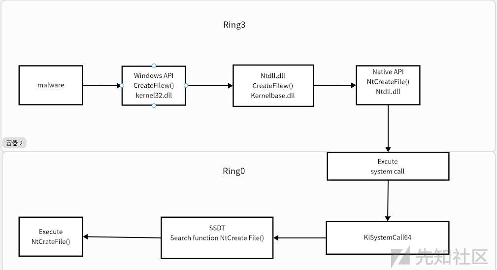

# 直接系统调用学习记录 - 先知社区

直接系统调用学习记录

* * *

**什么是直接系统调用**

## 直接系统调用是windows系统上的操作,允许用户模式临时到内核模式.攻击者无需从kenel32.dll获取api或者是ntdll.dll。

**EDR**  
现在的EDR厂商实现在Ring3层实现了挂钩,通过用户资料替换操作码和操作数导致重新到EDR的hook.dll。EDR检测出本机API执行的代码是否存在恶意内容和行为

**常规调用和直接调用的流程图片**  
这个是未挂钩的执行图片  
[](https://xzfile.aliyuncs.com/media/upload/picture/20231014194742-7c12b142-6a87-1.jpg)

这个是EDR挂钩之后的执行流程

[](https://xzfile.aliyuncs.com/media/upload/picture/20231014194834-9af2c872-6a87-1.png)

这个是直接系统调用的流程图

[](https://xzfile.aliyuncs.com/media/upload/picture/20231014194854-a672c8b4-6a87-1.png)

显而易见直接系统调用没走正常路线所有没有被EDR的钩子检测到达到了绕过EDR的目的

**需要的文件**  
[https://github.com/jthuraisamy/SysWhispers2](https://github.com/jthuraisamy/SysWhispers2)  
这里使用SysWhisper2当中的syscalls.h

asm文件  
需要的函数

```plain
MOVE r10,rcx
mov eax,funcation
syscall
ret
```

**代码实现**

这里我使用c++来实现这个代码  
[](https://xzfile.aliyuncs.com/media/upload/picture/20231014201748-b03fb88a-6a8b-1.png)

这里现获取到ntdll.dll的句柄,从ntdll.dll中的NtallocateVirtualMemory函数读取系统调用号,系统调用号为函数的第四个字节,这个就是系统调用的核心部分。  
重复这个操作获取到全部要使用的函数然后就可以执行加载shellcode

这里给出MASM汇编代码

[](https://xzfile.aliyuncs.com/media/upload/picture/20231014202349-8725603e-6a8c-1.png)  
EXTERN用于全局访问变量 包含了对应的SSN

**展示效果**  
[](https://xzfile.aliyuncs.com/media/upload/picture/20231014203924-b4efb652-6a8e-1.png)

处理一下  
[](https://xzfile.aliyuncs.com/media/upload/picture/20231014204647-bc983bb2-6a8f-1.png)
