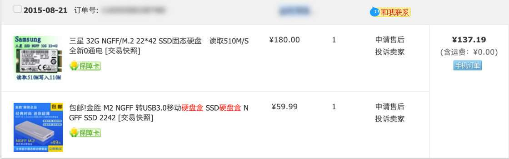
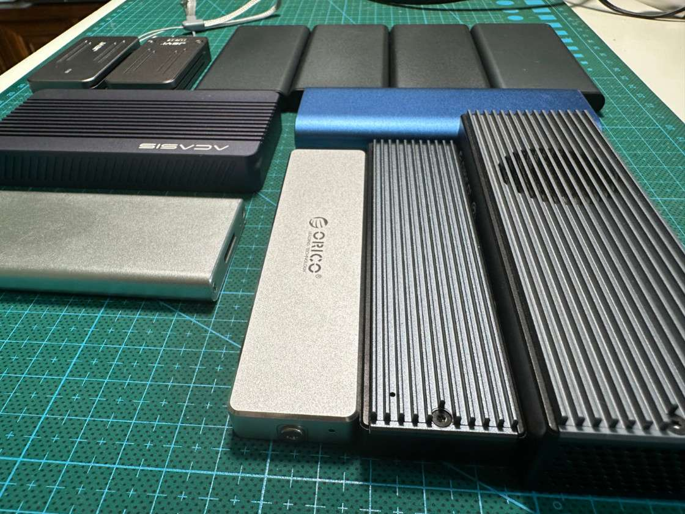
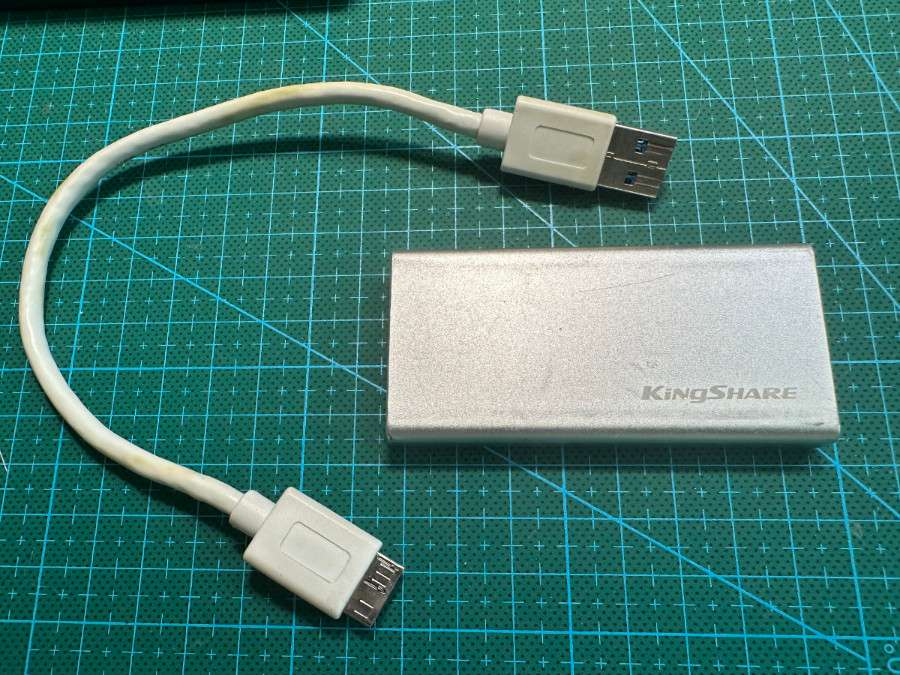
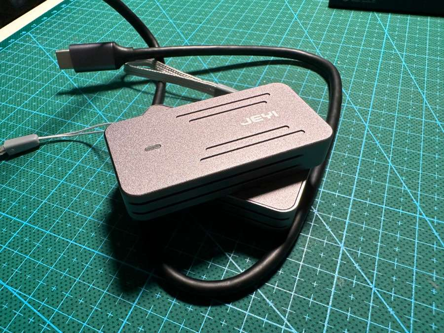
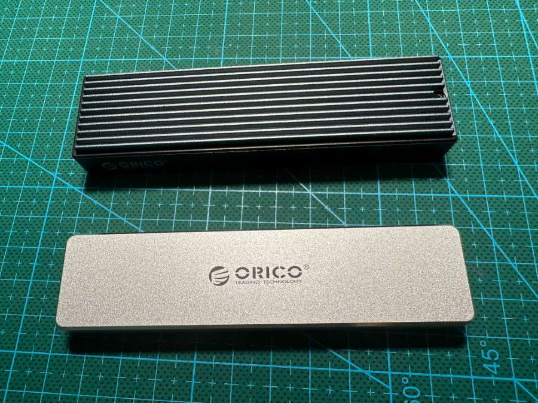
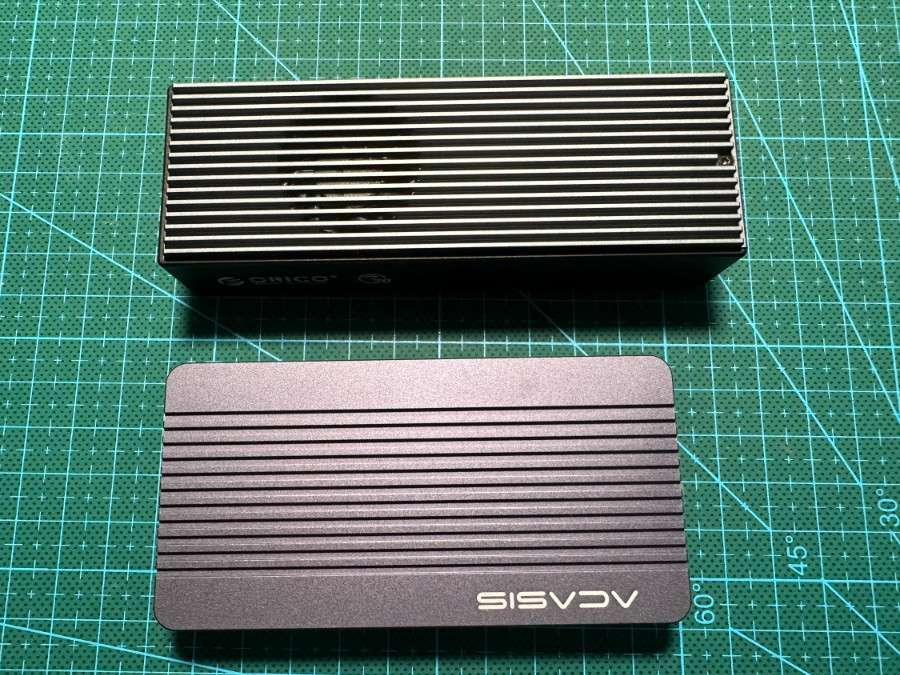
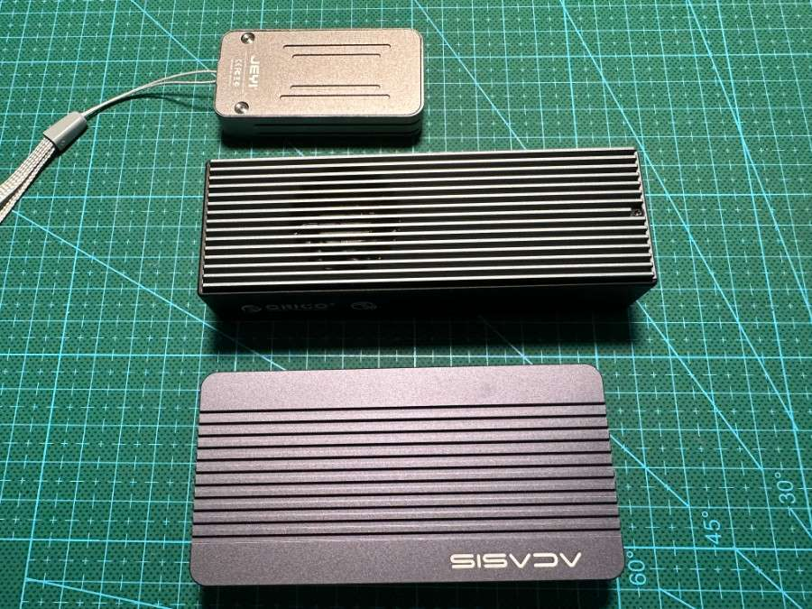

# 硬件笔记：组装“固态 U 盘”的八年，从 100 块到 1000 块 - 少数派

**Matrix 首页推荐** 

[Matrix](https://sspai.com/matrix) 是少数派的写作社区，我们主张分享真实的产品体验，有实用价值的经验与思考。我们会不定期挑选 Matrix 最优质的文章，展示来自用户的最真实的体验和观点。

文章代表作者个人观点，少数派仅对标题和排版略作修改。

- - -

这篇文章，聊聊自从 2015 年开始到目前为止，我使用固态硬盘组装的高速 U 盘，以及它们的使用体验，还有一些明显的坑。

## **写在前面**

2015 年的 8 月，我剁手下单了一块 32GB 大小，NGFF 接口的三星 22x42 尺寸的固态硬盘，以及第一块非「大牌厂商」的硬盘盒，完成了第一块自制的高速固态 U 盘，随后的时间里这块 U 盘，伴随我经历了记不清次数的装机、调试、小尺寸文件共享。

第一笔关于固态 U 盘的购买记录

因为种种原因，它的继任者非常多。因为带来的实打实的速度提升，和更安全可靠一些的数据存储能力，我一度组装了不少的固态 U 盘，其中不少也送给了朋友和家人作为系统制作工具，或者快速的手机备份盘使用。

目前手头的固态 U 盘们

这期间，硬盘的接口和容量都有了不小的变化，甚至连接电脑的协议也从最朴素的只有 5Gb/s 的 USB 3.0 慢慢升级到了能够支持 20 Gb/s 、40Gb/s 的雷电 4，速度越来越快，硬盘和硬盘盒的价格也和硬盘工作温度一样，越来越高。

年初的雷电 4 硬盘盒和硬盘购买记录

我的硬盘盒从最初的 32GB 大小，只有 500MB/s 传输速度，在今年 1 月的时候，也进化到了 2TB 尺寸，每秒 2.6GB 的雷电4 硬盘盒，单个磁盘的成本也从 100 多块钱来到了 1000 多块。（钱包：疼！）

接下来就来聊聊，这八年里，这些固态 U 盘使用起来，到底怎么样？以及各自有哪些坑。

## 一切的起点：mSATA 或 NGFF 小容量固态硬盘

粗略估计，这些年我在这块踩坑和交过接近一千的学费，磁盘和硬盘盒的成本应该一半一半，如果你只需要一块快速装机或者小容量高传输速度的磁盘，并且要支持一些相对古老的设备，这个方案中，你**选择和折腾一块磁盘就够了，成本应该能够控制在 100 元内。**

如果你好奇，我为什么会接触到这个奇怪的东西，可以接着看下面的故事，如果你只对这个方案的优劣势感兴趣，可以跳过故事，看几种方案的优劣对比。

### 为什么会开始接触固态 U 盘

2015 年，在当时网上并不流行自己组装 U 盘，尤其是用硬盘组装 U 盘的时间点，我遇到了一个小麻烦：我**经常**给不同的物理设备安装不同的操作系统，包括常见的 Windows、Linux，不常见的 OpenWRT 等软路由系统，就在想如何能更快地完成这个操作。

当时，我刚刚从杭州回到北京，手头没有现在家里一堆的高性能、支持虚拟化的硬件，为了一些折腾和娱乐的需求，我购入了若干台工控机。为这些性能不太好的设备，安装、对比不同的系统，甚至要自己编译系统，**这个操作往往需要重复非常多次**。我当时住在望京新城的一个小单间里，屋子里没有高速网络，手头的设备也不见得支持 PXE 从网络引导安装系统。

手头倒是不缺金士顿、闪迪这些大众脸的 U 盘，但烧录系统到 U 盘，然后再从 U 盘完成系统到安装，在**大量重复安装过程中**，简直是一种把「急性子变慢性子的修行」，**过程时间太漫长了。**

因为之前的折腾，我知道固态硬盘做移动硬盘没问题，那么固态硬盘能不能做 U 盘使呢？

我第一块固态硬盘是 2012-2013 年左右，在之后「人人喊打」的中关村电脑城买的，随后因为设备的不断升级迭代，小容量的 MLC 固态就被装入了硬盘盒继续兢兢业业地工作着。但这种移动硬盘毕竟个头太大了，能不能有小尺寸一些的方案呢？

于是，在翻阅了一些资料后，我选定了当时尺寸最小的方案之一：2242 的 NGFF 接口的固态，搭配能够将 NGFF 转换为 USB 3.0 的金属硬盘盒。

### 小容量固态 U 盘方案的优劣势

之前最常用的一块移动固态 U 盘

这类硬盘盒，我前前后后应该购入了 10 个左右，分别是支持 NGFF 接口、mSATA 接口转换 USB 3.0 接口、Type-C 接口的盒子，简单来概括我的使用场景是：

-   用来快速装机的 U 盘（几分钟完成引导盘制作和安装过程中的必要文件复制），或者插在设备上，变成不拔的固定引导盘。
-   最低成本（30-90块钱），用来让老旧的 mSATA 焕发青春（从老款平板、老款便携电脑、老款迷你设备升级淘汰下来的），变成固态U盘。

因为「惯性」和之前的经验，我主要买了两个牌子的硬盘盒，金胜（KingShare）和金胜涨价后的替代品，酷鱼（CoolFish），前些年固态不那么火热的时候，这类盒子购入价格都是 50 以内，这几年，盒子们慢慢涨到了接近 100 块。当然，平替的问题是数据接口有一些浅，插着数据线的时候，有一些不那么放心。

为了能使用起来更放心一些，我还寻找了新的替代品，设计感和使用体验更棒的「佳翼」，特别新组装了两块，一块放在家里桌面，一块放在书包里，应对不时之需。硬盘盒比 AirPods 都小的体积，非常小巧。

最近使用的佳翼固态硬盘盒

如果说早些时候，选择这个方案，我倾向于购买 KingShare 的硬盘盒，那么现在开始，如果再购置硬盘盒，或者升级之前的硬盘盒，我会考虑都替换为佳翼（硬盘盒除了拼速度外，颜值也很重要）。

**先来聊聊这个方案下体验或者性价比不高的地方：**

mSATA 硬盘接口的出镜频率越来越低，不论是否搭配硬盘盒使用，能够提供的传输速率是极其有限的，如果你追求高速读写，不要选择这个方案，因为普遍的硬盘盒，提供的都是 SATA 协议的支持，最高能够支持到 USB 3.1 协议，即 5Gbps 到头了。

但即便如此，能够支持 500MB/s 读写的 mSATA 性价比非常的低，可选型号范围不大，生产日期则普遍久远，超过或接近五年的更换推荐期。如果你选择的是「拆机小容量磁盘」，不论磁盘是 SLC、MLC 类型还是其他，这个固态 U 盘切勿存储重要数据，虽然颗粒长寿，但是其他电子元件可是有寿命的呀。

并且，mSATA 的固态硬盘，如果不是刻意购买，老设备中汰换下来的一般的容量最大不过 500GB，更常见一些的是 120GB、240GB 等目前U盘们也能轻松达到的容量，对比其他的方案，容量上的不足让它的适用场景小了非常多。

虽然速度相比较如今的 SSD 硬盘更低，但是持续工作的发热状况缺不容乐观，长时间插着机器使用，拔下来的时候会有些烫手。

最后，虽然固态硬盘的使用寿命比 U 盘要长，但是频繁拔插以及可能设备不够稳定的电源，也会送走我们组装的固态 U 盘，我印象中我应该损失过一两片老固态，索性是单片成本相对比较低，也就没有当回事。

**接下来，我们聊聊这个方案还不错的地方：**

首先，是能够用相对低的成本，换取接近顶流传统 U 盘的读写体验。随便一块 30-50 块钱的拆机固态，且不说颗粒可能是「长寿」著称（冗余量不低）的 MLC 颗粒，单就随随便便最低写入 100MB/s，读取 300MB/s-500MB/s，就挺有性价比的。

10 来个 G 以内的文件，在这类硬盘盒上的表现都是「秒传」，用户体验非常友好。

其次，全金属的硬盘盒，相比较塑料壳的硬盘盒，能够让固态硬盘在工作的时候进行比较好的散热，延续使用时间（注意烫手）。

并且，这类金属硬盘盒，颜值还是挺能打的。

最后，这个方案的固态 U 盘，都是 SATA 协议，所以能够在老设备，或者挑启动设备的 BIOS 程序中被正确识别和使用，并提供远高于普通 U 盘的性能。

说起来，这类硬盘盒，我目前手里只剩下 1 个全铝的 KingShare，4 个金属的 CoolFish（前阵刚组装备用），2 块佳翼。你猜猜除了在使用过程中丢了之外，被朋友「扣留」的有几个？哈哈。

## 浅水区：大容量快速传输的 NVMe 固态U盘方案

粗略估计，这些年我在这块踩坑和交过 500 左右的学费，80% 都交在 2019 年，固态硬盘盒刚刚火起来，大家追求 1 秒 1GB 的时候，那个时候，一块硬盘盒接近 200 块，我买了两块高价硬盘盒，用来给「寸土寸金」的安卓手机做照片快速备份，以及快速传输尺寸比较大的视频文件、还有支持 MacBook 做快速的「时间机器」备份。

最常见的 10G 速率硬盘盒

当然，随着时间的推移，目前支持大容量，10Gbps 的硬盘盒我们也能够和上面小容量硬盘盒一样，在 50 元价位搞定了。

**如果你手头有淘汰下来的 SSD，搭配一块 50 块钱左右的硬盘盒，使用体验还是比较好的，或者你希望有一块全新的，更有保障的固态，来帮助你做 Mac 设备的备份，这个方案也不失为一种不错的选择。**

### 为什么会接触大容量固态 U 盘

不同于苹果很早就推出了 512GB / 1TB 容量的手机，安卓当时似乎是有意限制容量，并阉割了 TF 存储卡功能，模糊印象中当时安卓手机里 256GB 就算是很大的容量了，这样的动作，比较容易让用户喜欢拍户外照片的用户「年年换新」。

和孱弱的云存储上传/下载相比（某年还出现相册泄漏事情），在容量不足的时候，用 Type-C 连接一块 1TB/2TB 的高速固态 U 盘，时间成本、经济成本（云上方案当时好像也就苹果有 2TB 方案）、用户体验、数据安全等方面性价比都挺高的。

以及当时，我折腾了一阵视频直点播业务，每场学术直播之后，大概会产生几十上百GB 的视频文件，时不时需要将视频文件保存下来，交给其他的同事使用，或者需要下载传到某些网盘里，一块 1TB/2TB 的高速 U 盘就显得十分必要了。

### 大容量固态U盘方案的优劣势

如果你和我一样，购买了比较多的电子设备，那么你手里应该也会有一些被淘汰下来的 NVMe 硬盘，这些硬盘在功能和健康度上普遍没有什么问题，只是插在机器上使用的时候，容量和速度在当前时代看起来比较小、比较慢了。

但是，如果给他们搭配上一块能够让他们发挥出 1GB/s 的硬盘盒，在不少密集数据传输、大尺寸文件传输，给不支持扩容的设备增加容量（就是说你呢，苹果电脑）还是非常香的，不是吗？花几十块钱买的 U 盘，可做不到 1GB/s 的传输速度。

并且，目前的 NVMe 硬盘盒颜值也都十分在线，不论是我买的单盘位还是网上为了破除「SSD 数据存储不安全」，自带 Raid 能力的双盘位。

当然，这个方案也存在一些问题，不仅仅只有「利好」：

1.  大容量、高吞吐速度的固态硬盘的代价是热，在小容量硬盘中，采用金属硬盘盒带来的有些烫手，会变成极其烫手。
2.  大容量、高吞吐的固态硬盘支持协议，和硬盘盒支持转换的协议一般是 NVMe 协议，而非 SATA 协议，所以如果你想有一块系统维护 U 盘，顺带存储些数据，很有可能你的设备不能够直接从这块磁盘进行引导。
3.  如果你手头没有淘汰的 SSD，想买一块全新的 SSD 作为存储介质，虽然这个方案硬盘盒成本低，但是，你也浪费了固态硬盘的性能，因为受限于硬盘盒芯片能力，我们最多使用 1GB/s 的读写速度。在实际传输过程中，遇到琐碎的小文件，性能可能会暴跌（和硬盘盒和硬盘、温度都有关系）。
4.  如果你的主要设备支持雷电接口，这个方案也是非常浪费设备接口性能的选择。

**所以，如果你选择这个方案，我推荐你购买类似上面图片中带散热鳍片的硬盘盒，而非苹果风的 CNC 阳极氧化铝外壳的盒子，可以有效减少突然很提神的烫手。**

## 深水区：大容量超高速度的雷电硬盘盒

三年前开始踩坑雷电硬盘盒

最近两三年，我在这块拢共投入了 1500 左右的学费，组装了两块支持超高传输速度的移动硬盘 ，80% 的成本在今年 1 月份的雷电 4 硬盘盒和 2TB 的国产固态硬盘。

雷电 3 和 雷电 4 速率的移动硬盘

因为这个硬盘盒的尺寸实在是比前文介绍的两种固态 U 盘都要大，所以这里我就不叫它固态 U 盘，而改称呼为移动硬盘啦。

尺寸对比

这两块硬盘都作为我的电脑的「时间机器」备份盘使用过，之所以会购入两块，主要有两个原因：

1.  我希望看看这类固态硬盘，到底能跑多快，能不能改善我在备份机器文件过程中的体验。实际测试，相比较上面「浅水区」方案，使用体验确实还是有提升的，更快的备份速度，可以更灵活地安排设备备份时间和带设备出门的时间。
2.  群里总是有同学和我提「ORICO 存在硬盘杀手」的问题，以及确实在网上也搜索到了一些内容。虽然我购买了许多 ORICO 的产品，目前还没出现这个问题，但是电脑的备份数据对于我而言，还是比较重要的，加上 MacBook 已经写入了几百 T 数据，在暂时不想更换和迁移设备数据的情况下，多一份备份，多一份安心，**我希望让我安心的备份盘，能够让我用起来放心，所以多准备了一份。**

**先来聊聊缺点：**

这类硬盘盒**最大的缺点是价格贵！**（可能不是产品的，是我的钱包的缺点），而且遵守数码产品性能和价格的定律，投入的经济成本和获取的性能超过某个点后，性价比直线下降。

想要购买雷电硬盘盒，最便宜的带风扇的版本，相比「浅水区」的 10Gbps 硬盘盒成本要翻一倍到三倍（接近 200 块），如果希望一步到位使用雷电 4 硬盘盒，相比雷电 3 硬盘盒的价格还要翻一番（500 块左右），但是雷电 4 硬盘盒比雷电 3 硬盘盒的传输性能提升并不会像跨越 10Gbps 之后翻一倍提升那么多。

所以，如果你想采用这个方案，我最推荐你使用的是带风扇的，20G 速率硬盘盒方案，速度很快，硬盘工作温度也不高。而非一步到顶，除非你对雷电 4 的硬盘盒外观风格有特别的喜爱，或者和我一样，稍微对 ORICO 网上的口碑产生了一些数据恐慌，给备份再做一个备份。

以及，和上面浅水区 10G 速率的硬盘一样，因为基本都是 NVMe / 雷电协议，所以只有新的硬件能够在启动引导的时候，使用这个磁盘，老设备还是得乖乖的使用前文中提到的小容量的硬盘盒方案。

还有，这类硬盘盒相比上文中的其他硬盘盒，尺寸是真的大了一些，虽然扔书包里不差这点空间，但总归觉得使用场景应该是「固定一些」的环境：比如家里，或者公司工位。

**此外，在最近两三年使用雷电硬盘盒的过程中，真的没遇到啥缺点了。**

**来聊聊优点吧：**

因为超高的读取和写入能力，不论是想使用这个硬盘盒做 Win2Go、Linux2Go，还是作为高速 Mac 时间机器的额外备份盘，都是非常棒的选择。

我目前两块盘的用途分别是 WIn2Go、临时大尺寸文件快速传输，尤其是不在家里的时候；以及放在家里，作为时间机器的额外备份副本。

## **最后**

好了，关于固态 U 盘、移动硬盘的组装折腾经验就先聊到这里。

希望我分享的经验，能够帮到有同样想法或者类似需求的你。

\--EOF

- - -

本文使用「署名 4.0 国际 (CC BY 4.0)」许可协议，同时发布在了我的[博客](https://sspai.com/link?target=https%3A%2F%2Fsoulteary.com%2F2023%2F09%2F16%2Feight-years-of-assembling-solid-state-usb-disk-from-100-to-1000.html)中，欢迎转载、或重新修改使用，但需要注明来源。 [**署名 4.0 国际 (CC BY 4.0)**](https://sspai.com/link?target=https%3A%2F%2Fcreativecommons.org%2Flicenses%2Fby%2F4.0%2Fdeed.zh)

如果你觉得内容还算实用，欢迎点赞分享给你的朋友，在此谢过。

\> 关注 [少数派公众号](https://sspai.com/s/J71e)，解锁全新阅读体验 📰

\> 实用、好用的 [正版软件](https://sspai.com/mall)，少数派为你呈现 🚀
