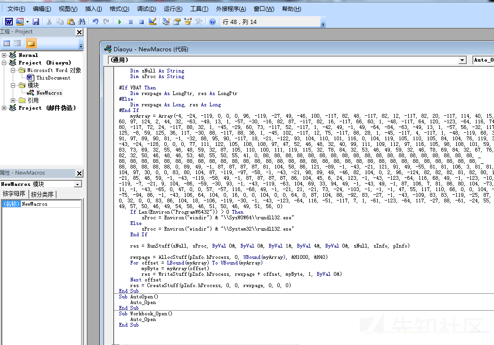
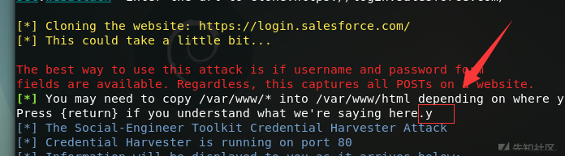
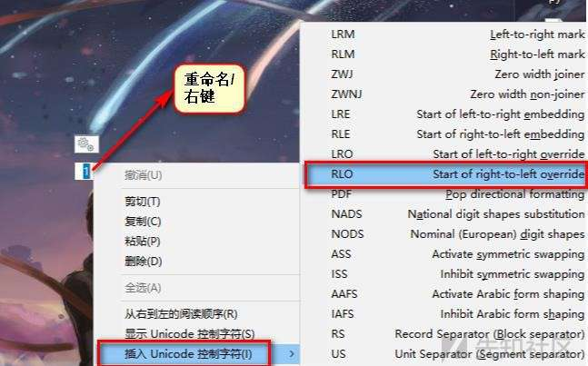
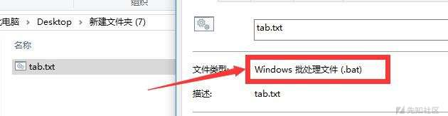
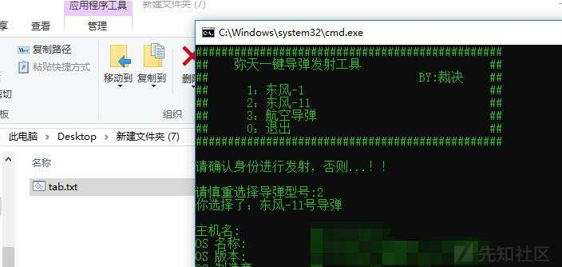
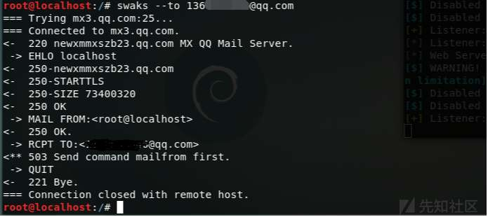
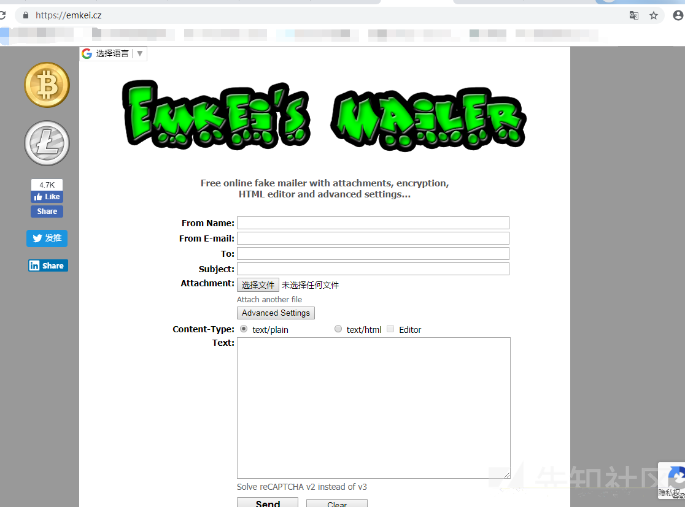

# 社会工程学攻击-钓鱼 - 先知社区

社会工程学攻击-钓鱼

- - -

## 钓鱼方式

1.钓鱼邮件

钓鱼邮件指利用伪装的电邮，欺骗收件人将账号、口令等信息回复给指定的接收者；或引导收件人连接到特制的网页，这些网页通常会伪装成和真实网站一样，如银行或理财的网页，令登录者信以为真，输入信用卡或银行卡号码、账户名称及密码等而被盗取。

2.钓鱼wifi

仿造一个假的wifi,欺骗用户登陆，之后窃取用户信息

3.钓鱼二维码

网站地址（URL）被编成QR二维码，有些网站将网站登录的URL存储在QR码上。攻击者用伪造的QR码替换合法的QR码，篡改登录网站的URL信息，将用户导向一个假冒的登录页面。在这种情况下，用户扫描QR码后，访问了伪造的登陆页面，将个人信息泄露给了攻击者。

4.伪基站

又称假基站、假基地台，是一种利用GSM单向认证缺陷的非法无线电通信设备，主要由主机和笔记本电脑组成，能够搜取以其为中心、一定半径范围内的GSM移动电话信息，并任意冒用他人手机号码强行向用户手机发送诈骗、推销等垃圾短信，通常安放在汽车或者一个比较隐蔽的地方发送。

伪基站+短信+网页……

5.标签钓鱼

标签钓鱼(tabnabbing)是一种新的网络钓鱼攻击手法，该攻击手法是由Mozilla Firefox浏览器的界面及创意负责人Aza Raskin发现和命名的，tabnabbing可改变用户浏览网页的标签及接口，以诱导用户输入网络服务的账号与密码。 因此，Raskin将此手法称为标签绑架（tabnapping），他指出当使用者连上一个嵌有第三方script程序或Flash工具的网页时，就会让自己曝露于风险中，因为相关的恶意软件得以侦测使用者经常使用或正在使用的网络服务，在用户暂时离开该网页后，该网页内容及网页标签会悄悄地变身成为伪造的网络服务，并诱导用户输入个人信息

6.鱼叉式网络钓鱼

指一种源于亚洲与东欧只针对**特定目标**进行攻击的网络钓鱼攻击。

注：

水坑攻击

”水坑攻击”，黑客攻击方式之一，顾名思义，是在受害者必经之路设置了一个“水坑(陷阱)”。最常见的做法是，黑客分析攻击目标的上网活动规律，寻找攻击目标经常访问的网站的弱点，先将此网站“攻破”并植入攻击代码，一旦攻击目标访问该网站就会“中招”。

水坑攻击属于 APT 攻击的一种，与钓鱼攻击相比，黑客无需耗费精力制作钓鱼网站，而是利用合法网站的弱点，隐蔽性比较强。在人们安全意识不断加强的今天，黑客处心积虑地制作钓鱼网站却被有心人轻易识破，而水坑攻击则利用了被攻击者对网站的信任。水坑攻击利用网站的弱点在其中植入攻击代码，攻击代码利用浏览器的缺陷，被攻击者访问网站时终端会被植入恶意程序或者直接被盗取个人重要信息。

水坑攻击相对于通过社会工程方式引诱目标用户访问恶意网站更具欺骗性，效率也更高。水坑方法主要被用于有针对性的攻击，而 Adobe Reader、Java 运行时环境（JRE）、Flash 和 IE 中的零漏洞被用于安装恶意软件。

7.U 盘钓鱼

简单来说就是在 U 盘里面植入木马或者病毒，进行钓鱼

注：U 盘嘛，你可以撇目标单位门口，或者社工个人信息，邮寄给他

## 演示环境

-   服务器：centos 7
-   服务器：windows 7
-   服务器：windows 2008 r2
-   攻击机：kali linux
-   靶机：windows 7

## 制作钓鱼邮件内容-Cobalt strike

进入cobalt strike目录

启动teamserver

执行命令`sudo ./teamserver 192.168.32.138 mitian`

新建终端，进入目录，启动客户端

执行`./cobalstrike`

新建一个监听器

点击底部add添加

点击attacks-packages-ms office macro创建word宏病毒

创建word文档，添加病毒

正文随便加点东西【当然我这是测试，加什么都行】

## 钓鱼网站的制作

### 方法一

上面是利用cobalstrike制作一个word文档的病毒，当然你也可以使用它clone一个网站

点击attacks---web drive-by --- clone site,添加你要克隆的网站，我选的补天登陆页面

访问192.168.32.142:80

当然最好是自己搭建一个钓鱼网站，上面是演示

### 方法二

打开kali linux 的Social-Engineer Toolkit

【或者终端输入setoolkit启动】

选择1 社会工程学攻击，出现下图

选择2 网站攻击，出现下图

选择3 钓鱼网站攻击，出现下图

选择2 网站克隆，出现下图

并输入ip，这里已经给出了

输入要克隆的网站

到这的时候输入一个Y

访问网站

假装受害者登陆，输入用户和密码

kali 终端显示信息

**注：Social-Engineer Toolkit有很多玩法，比如鱼叉，钓鱼二维码，wifi等，使用方法大同小异，自行研究**

### 方法三

自己搭建一个，比如QQ空间

找个QQ空间的源码，放到服务器上

访问，输入用户mitian,密码mitian

访问后台

## U盘钓鱼

### Unicode RTLO

RIGHT TO LEVER OVERRIDE 是一种 Unicode，主要用于书写和阅读阿拉伯语或希伯来语文本。Unicode 有一个特殊字符 U + 202e，它告诉计算机以从右到左的顺序显示它后面的文本。此漏洞用于伪装文件名称。例如， caijueexe.doc 的文件名实际上是 caijuedoc.exe 的可执行文件

1.准备一个 bat 文件  
  
2.鼠标右键---重命名---插入 Unicode 字符---选择 RLO--输入“txt.bat”  
  
3.显示如下，看到的是一个以 txt 结尾的文件，但实际上却是从右开始读的 bat 文件，在属性里面可以看到  
  
4.假如目标以为这是一个 txt 文本，双击执行一下  
  
看着像 txt，其实是 bat

## 邮件伪造发送之SWAKS

1.测试是否可以和目标邮箱发送数据

执行命令：`swaks –to [136*****@qq.com]`

2.swaks参数说明

执行命令：`swaks –help` 可以看到n多参数和实例

\--to 目标邮箱

\--from 邮件发送者

\--attach 添加附件

\--header-From 邮件头

\--header "Subject:主题" 邮件主题

3.发送钓鱼邮件

执行

`swaks --to 136****46@qq.com --from l***ng@qianxin.com --h-From: '"总裁办"<admin@qianxin.com>' --header "Subject: 关于集团报告渗透测试word模板更新的通告" --body "各位一线工程师，集团对外word统一格式，请下载附件使用，谢谢合作！" --attach-name 渗透报告模版.doc --attach-type application/msword --attach /tmp/渗透报告模版.doc`

**注： attach-type是传输文件的MIME类型**

​ **attach-name是名字**

**理论上不加这两个也可以的，不过我这里面不加有点小问题**

伪造发送成功

4.cobalstrike主机上线啦！

假装受害者打开word

滴！肉鸡上线

## 邮件伪造发送之EMKEI’SMAILER

在线的邮件伪造发送工具

网址：[https://emkei.cz/](https://emkei.cz/)

简单试了试139邮箱，噢哟可以哦！

附赠一个：邮箱匿名注册的网站

网址：[http://www.yopmail.com](http://www.yopmail.com/)

**注：邮件发送，还可以自己搭建SMTP服务，之后使用诸如SimpleEmailSpoofer等伪造域名发送。**

## 伪造钓鱼邮件注意事项

1.  钓鱼嘛，鱼饵肯定要诱人才会有鱼上钩,比如：美女图片、中奖
2.  尽量仿造的像真的一样，注意：签名、模版、图标、落款等细节
3.  网站，链接等钓鱼，最好用相似度较高的域名
4.  附件肯定要过杀软！！！【百度一下肯定有】

## 钓鱼邮件防范

1.  不要轻易相信邮件里的附件，比如word里的宏
2.  注册链接，中奖链接不要轻易相信
3.  注意邮件行文风格、落款、签名等地方
4.  服务器响应快慢，一般钓鱼的服务器配置都不是很高
5.  如果突然有封邮件言辞激励，请不要回复，因为它可能在社工你的邮件签名等信息

## 注：文章首发弥天实验室，内容不当处，大佬勿喷

## 总结

总结个锤子…

