# 禅道通用前台RCE利用分析 - 先知社区

禅道通用前台RCE利用分析

* * *

## 前面

禅道 15-18（具体影响到那个版本我也忘了）都是可以通过 misc-captcha 覆盖session-user的，但当时我提交给wxxb的RCE 应该写的只影响\[16.x-17.x\]，这里主要补充一下低版本（15版本）的利用方式。

## 16-17.x漏洞分析

Zentao 的 框架由checkPriv 函数来检查 模块和控制器的权限的。

[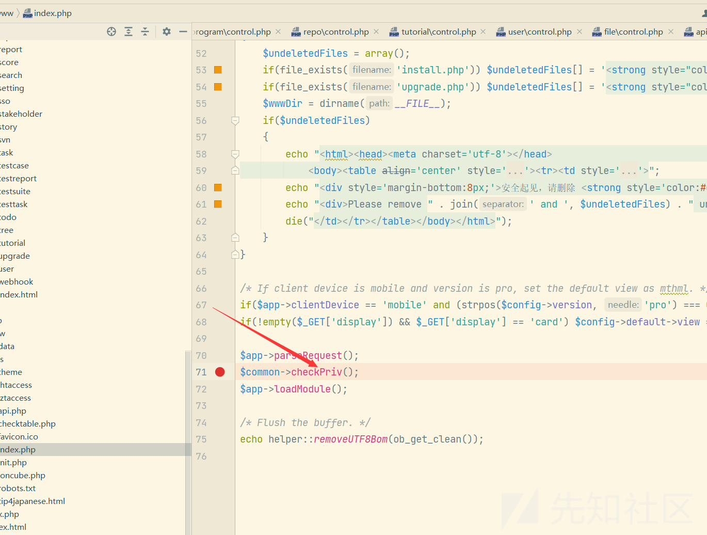](https://xzfile.aliyuncs.com/media/upload/picture/20231130135313-c02460ec-8f44-1.png)

[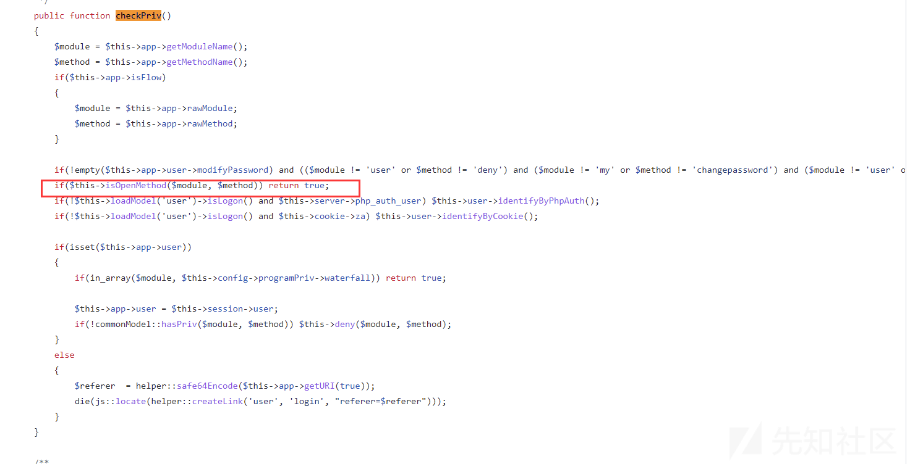](https://xzfile.aliyuncs.com/media/upload/picture/20231130135314-c056aa8e-8f44-1.png)

对于没有登录的用户只能调用isOpenMethod() 函数中允许的方法，我叫他白名单。

[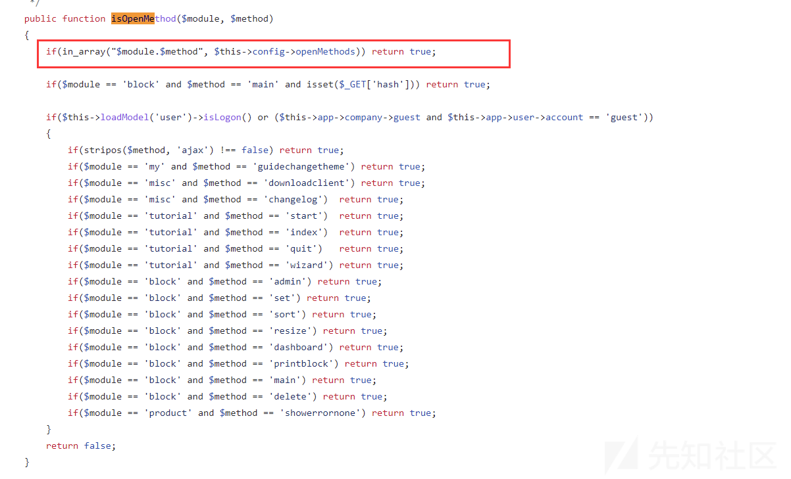](https://xzfile.aliyuncs.com/media/upload/picture/20231130135314-c07c45fa-8f44-1.png)

在15.0.1的以后版本里向白名单里增加了一个控制器，misc模块儿的captcha方法。

[https://github.com/easysoft/zentaopms/blob/zentaopms\_16.0/config/zentaopms.php#L132](https://github.com/easysoft/zentaopms/blob/zentaopms_16.0/config/zentaopms.php#L132)

[https://github.com/easysoft/zentaopms/blob/zentaopms\_16.0/module/misc/control.php#L235](https://github.com/easysoft/zentaopms/blob/zentaopms_16.0/module/misc/control.php#L235)

[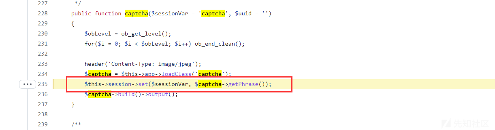](https://xzfile.aliyuncs.com/media/upload/picture/20231130135314-c099fe06-8f44-1.png)

这里可以设置一个可控的sessionid，但是值是一个随机字符串。可以设置任意名称的session。

而 zentao的鉴别用户登录呢又有缺陷，仅仅判断 是否有值，且值不等于guest即可。

[https://github.com/easysoft/zentaopms/blob/zentaopms\_16.0/module/user/model.php#L1034](https://github.com/easysoft/zentaopms/blob/zentaopms_16.0/module/user/model.php#L1034)

[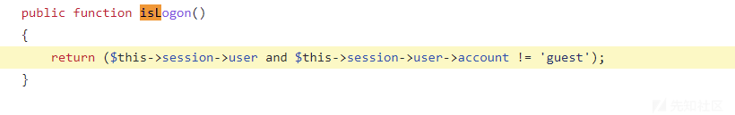](https://xzfile.aliyuncs.com/media/upload/picture/20231130135314-c0b03a86-8f44-1.png)

如果设置一个session user ，那么就绕过了登录的检查。

那么就可以调用下面的这些控制器了。

[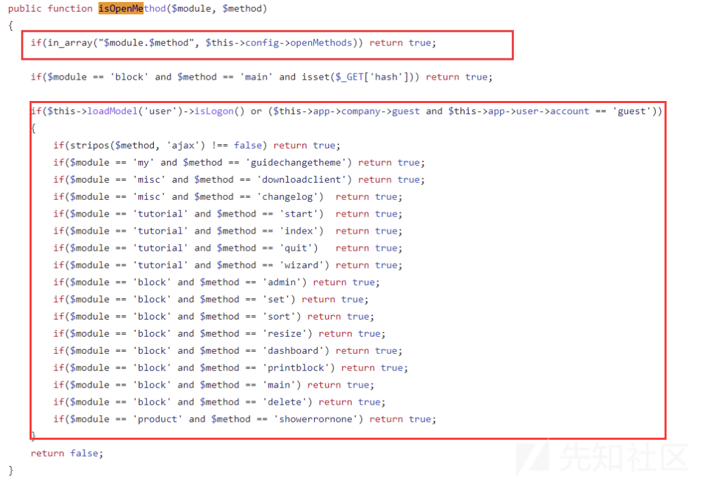](https://xzfile.aliyuncs.com/media/upload/picture/20231130135315-c0d80d0e-8f44-1.png)

**所以在15.0 版本以后，是有很严重的越权的问题的！**

**比如可以调用 所有带有”ajax“ 的方法的模块儿，ajax上传文件，ajax修改数据，ajax更新数据等等！**

但是我并没有整理这些，因为我想找到可以RCE的点。

### 16.0

16.0 对checkPriv做了一个更新，

[https://github.com/easysoft/zentaopms/blob/zentaopms\_16.0/module/common/model.php#L2123](https://github.com/easysoft/zentaopms/blob/zentaopms_16.0/module/common/model.php#L2123)

[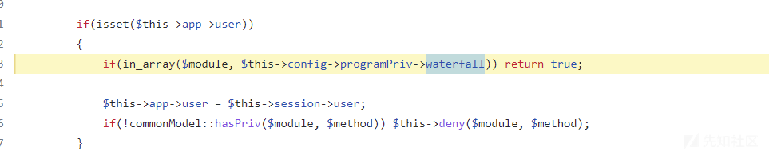](https://xzfile.aliyuncs.com/media/upload/picture/20231130135315-c0f2bbe0-8f44-1.png)

增加一些可利用的模块儿，因为我们已经设置的session user，所以这个逻辑是可以进去的。

[https://github.com/easysoft/zentaopms/blob/zentaopms\_16.0/config/zentaopms.php#L300](https://github.com/easysoft/zentaopms/blob/zentaopms_16.0/config/zentaopms.php#L300)

[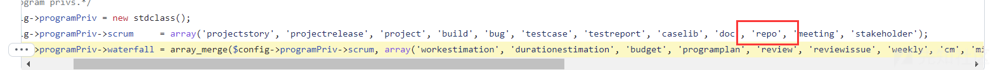](https://xzfile.aliyuncs.com/media/upload/picture/20231130135315-c10e3ac8-8f44-1.png)

这些模块儿其实已经包含禅道OA的所有提供的服务了，不论是项目，bug，文档，还是仓库，所有都可以操作。

主要在repo模块儿中，我找到了RCE的调用。

通过创建GitLab仓库，然后将其更新成SVN仓库，最后造成命令注入。

[https://github.com/easysoft/zentaopms/blob/zentaopms\_16.0/module/repo/model.php#L198](https://github.com/easysoft/zentaopms/blob/zentaopms_16.0/module/repo/model.php#L198)

因为更新仓库需要提供一个已经创建好的仓库ID，所以需要先创建仓库。

[https://github.com/easysoft/zentaopms/blob/zentaopms\_16.0/module/repo/model.php#L258](https://github.com/easysoft/zentaopms/blob/zentaopms_16.0/module/repo/model.php#L258)

这里的data其实就是我们post的数据。

[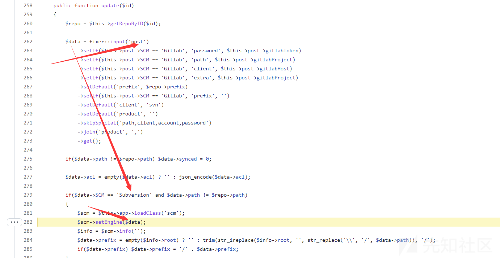](https://xzfile.aliyuncs.com/media/upload/picture/20231130135315-c1356d50-8f44-1.png)

scm类的setEngine方法主要就是创建 对应的 $data->SCM 类对象。

[https://github.com/easysoft/zentaopms/blob/zentaopms\_16.0/lib/scm/subversion.class.php#L36](https://github.com/easysoft/zentaopms/blob/zentaopms_16.0/lib/scm/subversion.class.php#L36)

[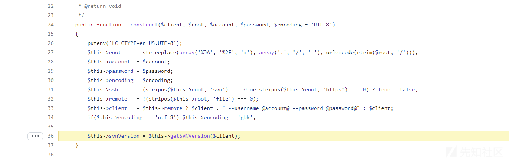](https://xzfile.aliyuncs.com/media/upload/picture/20231130135315-c152afdc-8f44-1.png)

[https://github.com/easysoft/zentaopms/blob/zentaopms\_16.0/lib/scm/subversion.class.php#L679](https://github.com/easysoft/zentaopms/blob/zentaopms_16.0/lib/scm/subversion.class.php#L679)

[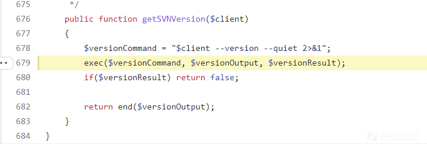](https://xzfile.aliyuncs.com/media/upload/picture/20231130135316-c16cf28e-8f44-1.png)

命令结果是输出在了$versionOutput里，我并没有去寻找命令的执行结果的回显位置，因为我认为php的命令执行可以回显的方式太多了，这并不主要。

其中的细节的绕过不细说了。

这个漏洞直接影响 16.x 到17.4（当时的最新版。

### 17.0-17.3

17.0-17.3 这个版本中 有个很 费解的地方就是 增加了异常处理，但是鉴权不通过是直接抛出异常，捕获后程序并没有结束。

[https://github.com/easysoft/zentaopms/blob/zentaopms\_17.0/module/common/model.php#L2318](https://github.com/easysoft/zentaopms/blob/zentaopms_17.0/module/common/model.php#L2318)

[https://github.com/easysoft/zentaopms/blob/zentaopms\_17.0/module/common/model.php#L2321](https://github.com/easysoft/zentaopms/blob/zentaopms_17.0/module/common/model.php#L2321)

[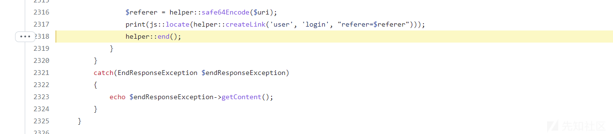](https://xzfile.aliyuncs.com/media/upload/picture/20231130135316-c18a9b54-8f44-1.png)

[https://github.com/easysoft/zentaopms/blob/zentaopms\_17.4/framework/helper.class.php#L260](https://github.com/easysoft/zentaopms/blob/zentaopms_17.4/framework/helper.class.php#L260)

[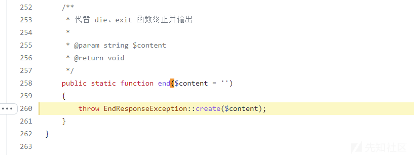](https://xzfile.aliyuncs.com/media/upload/picture/20231130135316-c1a38074-8f44-1.png)

导致整个鉴权直接没用了。

所有的模块儿只要不校验用户，全都可以访问。

这个只影响17.0-17.3 到 17.4 其实就修复了。

[https://github.com/easysoft/zentaopms/blob/zentaopms\_17.4/module/common/model.php#L2382](https://github.com/easysoft/zentaopms/blob/zentaopms_17.4/module/common/model.php#L2382)

这里直接是die掉了。

文件包含我是从api模块的debug方法来打的。

[https://github.com/easysoft/zentaopms/blob/zentaopms\_17.4/module/api/control.php#L794](https://github.com/easysoft/zentaopms/blob/zentaopms_17.4/module/api/control.php#L794)

[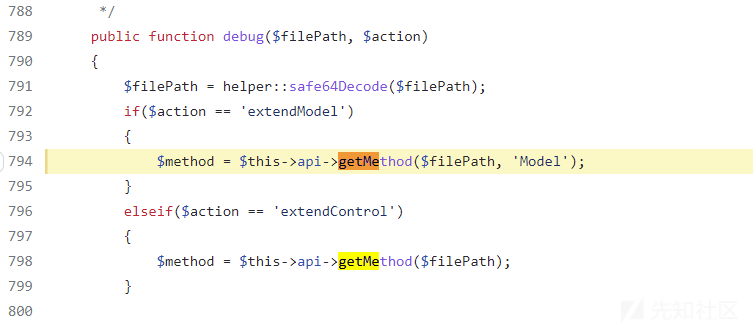](https://xzfile.aliyuncs.com/media/upload/picture/20231130135316-c1be66e6-8f44-1.png)

这个getMethod 在之前就有人报过文件包含漏洞。

文件包含用了 ../xxx.php/foo.txt 绕过 basename

### 17.4

还是利用的16.0的越权漏洞，此漏洞并未公开，所以没有修复。

[https://github.com/easysoft/zentaopms/blob/zentaopms\_17.4/module/common/model.php#L2367](https://github.com/easysoft/zentaopms/blob/zentaopms_17.4/module/common/model.php#L2367)

[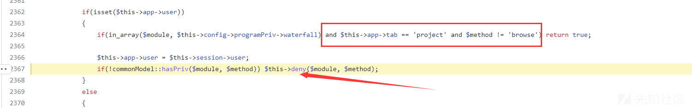](https://xzfile.aliyuncs.com/media/upload/picture/20231130135316-c1d8b47e-8f44-1.png)

不知道为什么17.4阴差阳错的对2364行的代码增加了校验，导致使用 $\_COOKIE\['tab'\] 来绕过 会影响repo仓库的正常操作，所以16.0的越权思路严格意义上这里是没有办法绕过的。

但是！

17.0 以后增加的错误处理机制，帮到了忙。

[https://github.com/easysoft/zentaopms/blob/zentaopms\_17.4/module/common/model.php#L410](https://github.com/easysoft/zentaopms/blob/zentaopms_17.4/module/common/model.php#L410)

[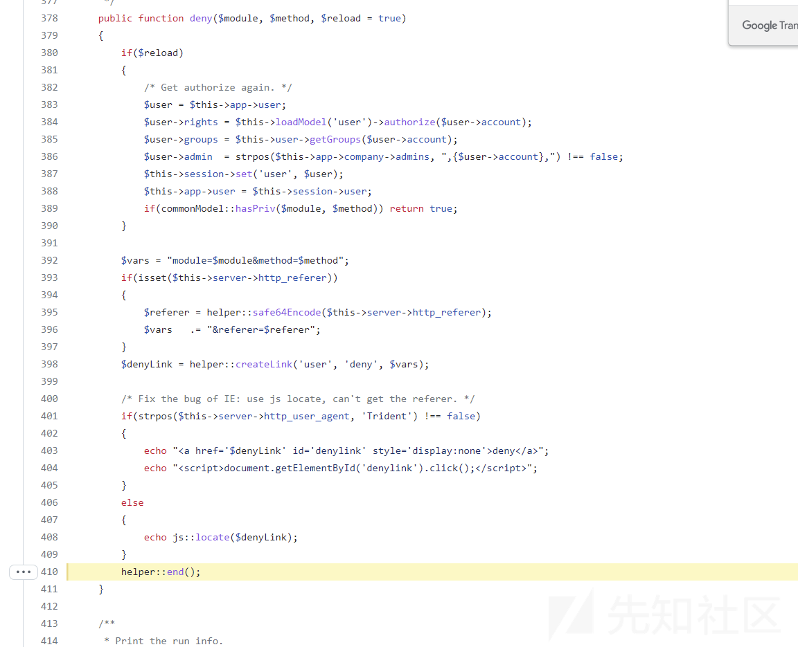](https://xzfile.aliyuncs.com/media/upload/picture/20231130135317-c1faa8e0-8f44-1.png)

当鉴权失败后 对deny掉，还是用的help::end() 抛出异常。

捕获后不退出，进而可以利用。

绕过鉴权后，可以使用文件包含，也可以使用命令注入。

## 15.x 利用

上面说了 覆盖session 后 会允许调用一些需要登陆的路由

其中包括 tutorial-wizard，这个路由允许fetch 一部分模块的方法（也就是跳板

[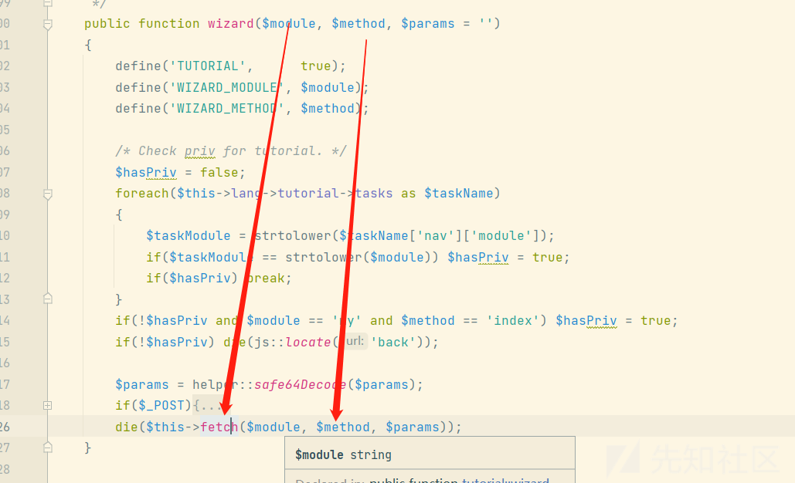](https://xzfile.aliyuncs.com/media/upload/picture/20231130135317-c2345964-8f44-1.png)

但是只能发送GET请求（用途有限。

这一部分模块通过配置来定义的，

[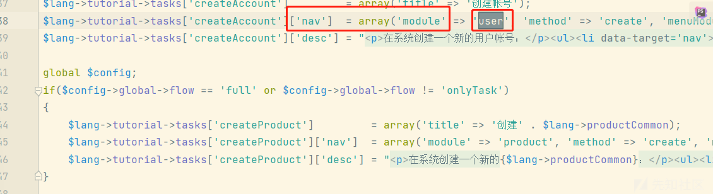](https://xzfile.aliyuncs.com/media/upload/picture/20231130135317-c25243c0-8f44-1.png)

用户模块里可能会泄露一些用户帐密的信息。

todo方法允许将用户查出来，然后直接将对象渲染到页面。

[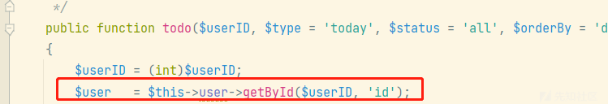](https://xzfile.aliyuncs.com/media/upload/picture/20231130135317-c268eb0c-8f44-1.png)

[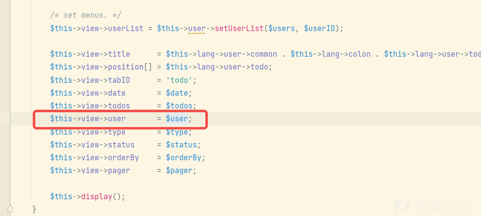](https://xzfile.aliyuncs.com/media/upload/picture/20231130135317-c2878a3a-8f44-1.png)

事实上这样会把对象的所有属性全部输出，zentao的其他方法也做过相关的处理。

比如将密码unset掉。

[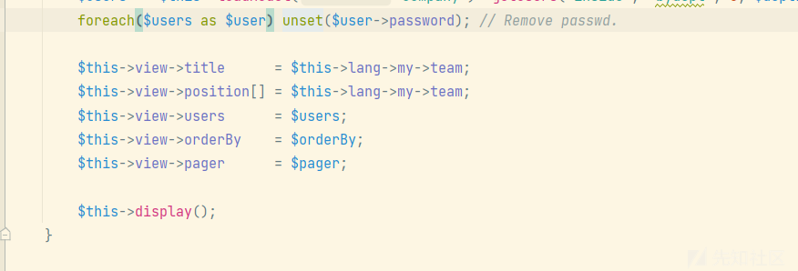](https://xzfile.aliyuncs.com/media/upload/picture/20231130135318-c2a14902-8f44-1.png)

所以这里其实会暴露md5密码的，只需要指定渲染类型为json即可。

[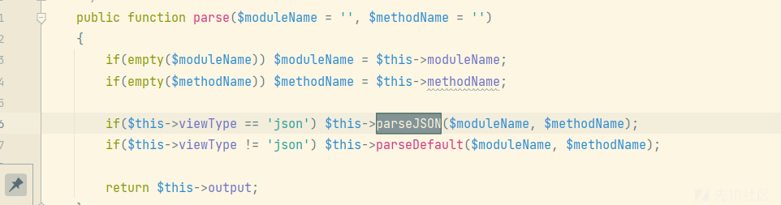](https://xzfile.aliyuncs.com/media/upload/picture/20231130135318-c2bcdd52-8f44-1.png)

[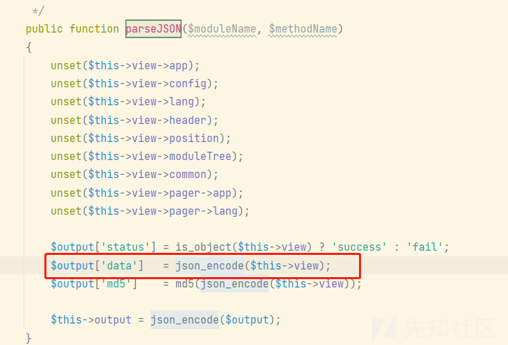](https://xzfile.aliyuncs.com/media/upload/picture/20231130135318-c2da98a6-8f44-1.png)

[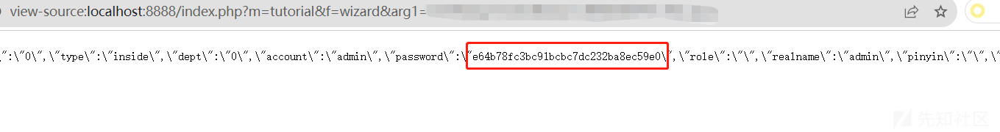](https://xzfile.aliyuncs.com/media/upload/picture/20231130135318-c2f28e48-8f44-1.png)

如果md5无法解开那有密码其实也没啥用，但好在禅道的登录密码是通过md5(pass+rand) 的方式加密的。

[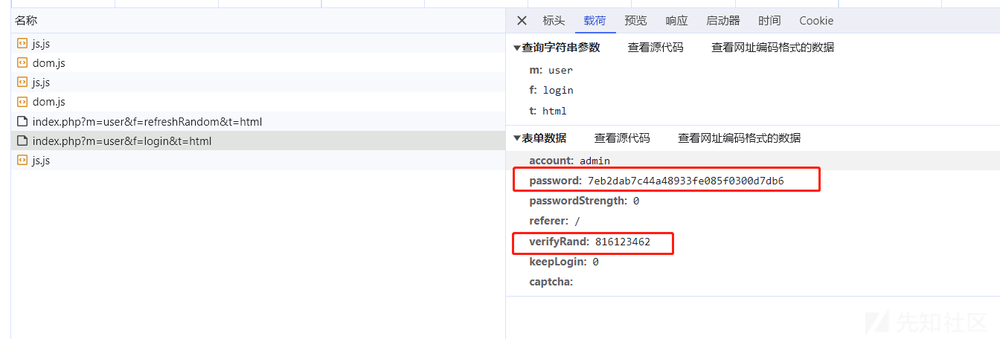](https://xzfile.aliyuncs.com/media/upload/picture/20231130135318-c3111f3e-8f44-1.png)

[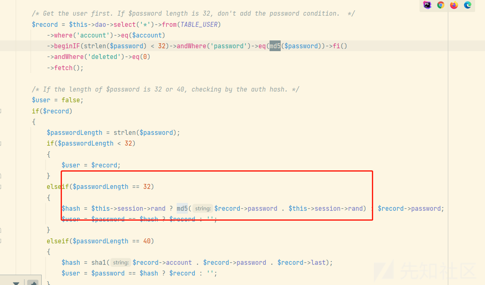](https://xzfile.aliyuncs.com/media/upload/picture/20231130135319-c3349aae-8f44-1.png)

是可以通过md5的密码直接登录的。

rce 可以用上面的文件包含。
